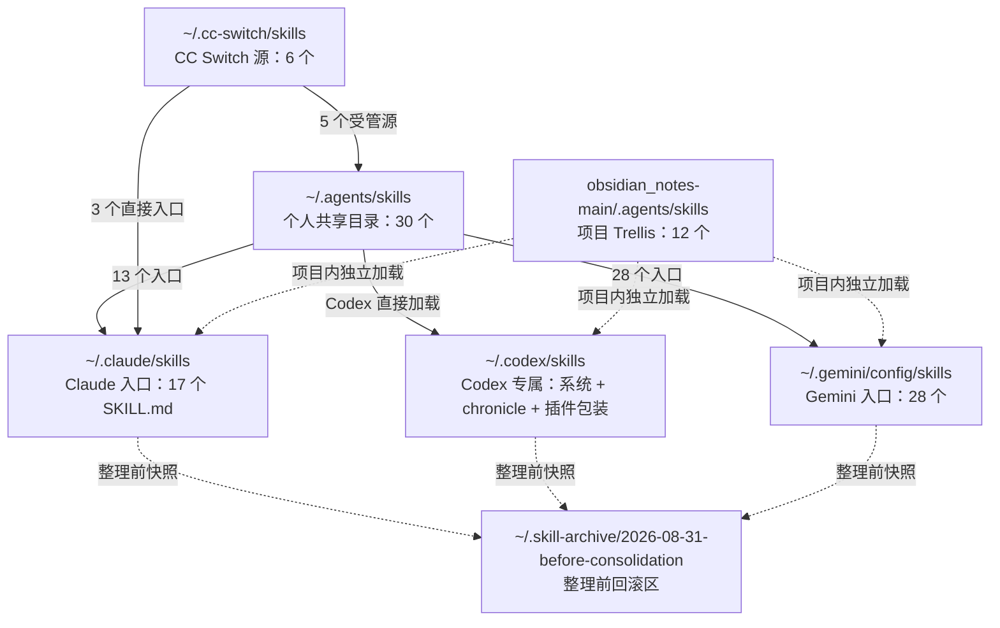

# Skills 总目录

> [!success] 已完成整理
> 个人共享 Skill 统一从 `/Users/melene/.agents/skills/` 管理；Claude、Gemini 保留各自入口，但重复实体已改为符号链接。Codex 直接加载共享目录，不再每小时复制 Claude Skill。

最后核对：2026-08-31。

## 一、整理后的结构



### 当前口径

- 目录中存在 `SKILL.md` 才算一个 Skill。
- `references/`、`scripts/`、`agents/`、`assets/` 是 Skill 配套资源，不单独计数。
- 系统 Skill、插件缓存、候选仓库、历史备份和项目本地 Skill 分区管理，不复制到个人共享目录。
- 符号链接只算入口，不算第二份源文件。

## 二、个人共享主目录

主入口：`/Users/melene/.agents/skills/`

当前共 30 个 Skill，其中 25 个是本目录实体，5 个由 CC Switch 提供源文件。

```text
~/.agents/skills/
├── claude-design/
├── computer-use/
├── cpp-tutor/
├── debug-logger/
├── english-drill/
├── exam-creator/
├── find-skills/
├── github-note-push -> ~/.cc-switch/skills/github-note-push/
├── invest-note-creator/
├── json-canvas/
├── leetcode-note/
├── leetcode-solver/
├── llm-note-creator/
├── no-ai-slop/
├── note-creator/
├── note-extender/
├── note-locator/
├── numerical-analysis/
├── obsidian-bases -> ~/.cc-switch/skills/obsidian-bases/
├── obsidian-cli -> ~/.cc-switch/skills/obsidian-cli/
├── obsidian-markdown -> ~/.cc-switch/skills/obsidian-markdown/
├── obsidian-svg/
├── paseo/
├── paseo-advisor/
├── paseo-committee/
├── paseo-handoff/
├── paseo-loop/
├── remote-ctrl-note -> ~/.cc-switch/skills/remote-ctrl-note/
├── remote-ctrl-tutor/
└── tutor/
```

`/Users/melene/.agents/.skill-lock.json` 只记录通过外部 Skill 安装器管理的 `computer-use` 和 `find-skills`，不是完整目录清单。

### 分类查看

| 分类 | Skill |
|---|---|
| 通用工具 | `computer-use`、`find-skills`、`claude-design`、`no-ai-slop` |
| Obsidian 基础 | `obsidian-bases`、`obsidian-cli`、`obsidian-markdown`、`obsidian-svg`、`github-note-push` |
| 笔记路由 | `note-creator`、`note-extender`、`note-locator` |
| 学习与出题 | `cpp-tutor`、`english-drill`、`exam-creator`、`numerical-analysis`、`tutor` |
| 专题笔记 | `invest-note-creator`、`llm-note-creator`、`leetcode-note`、`leetcode-solver`、`json-canvas` |
| 远控项目 | `remote-ctrl-note`、`remote-ctrl-tutor`、`debug-logger` |
| Agent 协作 | `paseo`、`paseo-advisor`、`paseo-committee`、`paseo-handoff`、`paseo-loop` |

整理时，`note-creator` 选择了 Claude/Codex 中 2026-08-28 更新的版本作为共享源；Gemini 原来的较旧 `vault-map.md` 已保存在回滚区。

## 三、CC Switch 管理的源

真实目录：`/Users/melene/.cc-switch/skills/`

```text
├── github-note-push/SKILL.md
├── obsidian-bases/SKILL.md
├── obsidian-cli/SKILL.md
├── obsidian-markdown/SKILL.md
├── remote-ctrl-note/SKILL.md
└── svg-precision-skill/SKILL.md
```

其中前 5 个已接入个人共享目录。`svg-precision-skill` 暂时保留为旧版/备用实现，没有加入三端公共入口；当前主用 SVG Skill 是 `obsidian-svg`。

CC Switch 设置仍为：

- `skillStorageLocation: cc_switch`
- `skillSyncMethod: symlink`

因此不要绕过 CC Switch 直接改写上面 5 个链接目标的所有权。

## 四、Claude 入口

目录：`/Users/melene/.claude/skills/`

Claude 仍有 17 个 `SKILL.md`，但共享内容不再保存为重复实体：

```text
~/.claude/skills/
├── claude-design-skill -> ~/.agents/skills/claude-design/
├── english-drill -> ~/.agents/skills/english-drill/
├── github-note-push -> ~/.cc-switch/skills/github-note-push/
├── no-ai-slop -> ~/.agents/skills/no-ai-slop/
├── no-ai-slop1/skills/no-ai-slop/SKILL.md   # 插件包装，仍保留
├── note-creator -> ~/.agents/skills/note-creator/
├── note-extender -> ~/.agents/skills/note-extender/
├── note-locator -> ~/.agents/skills/note-locator/
├── numerical-analysis -> ~/.agents/skills/numerical-analysis/
├── obsidian-bases -> ~/.cc-switch/skills/obsidian-bases/
├── obsidian-markdown -> ~/.cc-switch/skills/obsidian-markdown/
├── obsidian-svg -> ~/.agents/skills/obsidian-svg/
├── paseo -> ~/.agents/skills/paseo/
├── paseo-advisor -> ~/.agents/skills/paseo-advisor/
├── paseo-committee -> ~/.agents/skills/paseo-committee/
├── paseo-handoff -> ~/.agents/skills/paseo-handoff/
└── paseo-loop -> ~/.agents/skills/paseo-loop/
```

有效名称是 16 个；`no-ai-slop1` 内部又包装了同一个 `no-ai-slop`，所以文件数为 17。

## 五、Codex 入口

### 5.1 个人共享 Skill

新版 Codex 会直接扫描 `/Users/melene/.agents/skills/`，并且已经验证能加载其中的实体目录和 CC Switch 符号链接。因此不再把 Claude 的目录复制进 `~/.codex/skills/`。

旧自动同步：

```text
~/Library/LaunchAgents/com.melene.claude-skills-sync.plist
~/.local/bin/sync-claude-skills-to-codex.sh
```

已停用并移入回滚区。它原来每小时运行一次，并监控 `~/.claude/skills/`；旧脚本中“Codex 不跟随 Skill 链接”的假设已不符合当前版本。

### 5.2 Codex 专属目录

当前 `/Users/melene/.codex/skills/` 只有 8 个 `SKILL.md`：

```text
~/.codex/skills/
├── .system/
│   ├── imagegen/SKILL.md
│   ├── openai-docs/SKILL.md
│   ├── plugin-creator/SKILL.md
│   ├── review-agent/SKILL.md
│   ├── skill-creator/SKILL.md
│   └── skill-installer/SKILL.md
├── chronicle/SKILL.md
├── no-ai-slop1/
│   └── skills/no-ai-slop/SKILL.md            # 插件包装
└── codex-primary-runtime/                    # 空标记目录
```

`no-ai-slop1` 属于插件包装，名称会显示为 `no-ai-slop:no-ai-slop`；共享目录里的 `no-ai-slop` 仍会同时显示。没有通过插件管理器卸载它。

## 六、Gemini 入口

用户目录：`/Users/melene/.gemini/config/skills/`

28 个用户级 Skill 入口全部已改为指向 `/Users/melene/.agents/skills/` 的符号链接：

```text
claude-design, cpp-tutor, debug-logger, english-drill, exam-creator,
github-note-push, invest-note-creator, json-canvas, leetcode-note,
leetcode-solver, llm-note-creator, no-ai-slop, note-creator,
note-extender, note-locator, numerical-analysis, obsidian-bases,
obsidian-cli, obsidian-markdown, obsidian-svg, paseo, paseo-advisor,
paseo-committee, paseo-handoff, paseo-loop, remote-ctrl-note,
remote-ctrl-tutor, tutor
```

Gemini 没有单独接入共享目录中的 `computer-use` 和 `find-skills`，因此入口数量仍保持 28，不扩大原有启用范围。

### Gemini / Antigravity 内置 Skill

目录：`/Users/melene/.gemini/antigravity/builtin/skills/`

```text
├── agy-customizations/SKILL.md
├── antigravity_guide/SKILL.md      # name: antigravity-guide
├── generative_ui/SKILL.md
├── migrate-workflows/SKILL.md
└── permissioned-github/SKILL.md
```

这是只读系统区，不和个人目录合并。

## 七、obsidian_notes-main 项目专属 Skill

项目根：`/Users/melene/Documents/C++/obsidian_notes-main/`

真实目录：`/Users/melene/Documents/C++/obsidian_notes-main/.agents/skills/`

```text
├── trellis-before-dev/SKILL.md
├── trellis-brainstorm/SKILL.md
├── trellis-break-loop/SKILL.md
├── trellis-channel/SKILL.md
├── trellis-check/SKILL.md
├── trellis-continue/SKILL.md
├── trellis-finish-work/SKILL.md
├── trellis-meta/SKILL.md
├── trellis-session-insight/SKILL.md
├── trellis-spec-bootstrap/SKILL.md
├── trellis-start/SKILL.md
└── trellis-update-spec/SKILL.md
```

共 12 个 Trellis Skill，继续跟随项目版本控制。项目 `.codex/skills/` 保持为空，不再复制一套。

项目 `AGENTS.md` 中原来不存在的 `.codex/skills/obsidian-svg-bg/SKILL.md` 引用，已经改为共享入口 `~/.agents/skills/obsidian-svg/SKILL.md`。

以下是相关配置，但不算 Skill：

```text
obsidian_notes-main/
├── AGENTS.md
├── CLAUDE.md
├── 12.投资/CLAUDE.md
├── .codex/agents/
├── .codex/hooks/
├── .claude/settings.local.json
├── .claude/launch.json
└── .trellis/
```

## 八、其他非主目录 Skill

### Codex 记忆/实验区

目录：`/Users/melene/.codex/memories/skills/`

```text
├── obsidian-note-git-sync/SKILL.md
└── obsidian-study-note-editing/SKILL.md
```

暂不提升为全局 Skill。

### Codex 插件缓存

根目录：`/Users/melene/.codex/plugins/cache/`

当前盘点为 41 个 `SKILL.md`、40 个去重名称；这些 Skill 由插件版本管理，不手动搬入个人共享目录。

| 插件/运行时 | Skill |
|---|---|
| Browser / Chrome / Computer Use | `control-in-app-browser`、`control-chrome`、`computer-use` |
| Sites / Visualize | `sites-building`、`sites-hosting`、`visualize` |
| 文档运行时 | `documents`、`pdf`、`presentations`、`spreadsheets`、`excel-live-control`、`template-creator` |
| 插件管理 | `plugin-management` |
| GitHub | `gh-address-comments`、`gh-fix-ci`、`github`、`yeet` |
| Gmail | `gmail`、`gmail-inbox-triage` |
| Linear | `linear` |
| Artifact templates | `artifact-template-analytics-dashboard`、`artifact-template-business-review`、`artifact-template-design-report`、`artifact-template-experiment-analysis`、`artifact-template-financial-budget`、`artifact-template-investment-committee-memo`、`artifact-template-legal-memorandum`、`artifact-template-market-trends-report`、`artifact-template-minimal-letterhead`、`artifact-template-operating-calendar`、`artifact-template-operating-review`、`artifact-template-project-kickoff`、`artifact-template-project-tracker`、`artifact-template-sales-pipeline`、`artifact-template-simple-dark-mode`、`artifact-template-simple-light-mode`、`artifact-template-strategy-memorandum`、`artifact-template-system-design`、`artifact-template-team-alignment`、`artifact-template-three-statement-forecast` |

### Codex vendor 候选仓库

目录：`/Users/melene/.codex/vendor_imports/skills/skills/.curated/`

```text
aspnet-core, chatgpt-apps, cli-creator, cloudflare-deploy, define-goal,
figma, figma-code-connect-components, figma-create-design-system-rules,
figma-create-new-file, figma-generate-design, figma-generate-library,
figma-implement-design, figma-use, gh-address-comments, gh-fix-ci,
hatch-pet, jupyter-notebook, linear, migrate-to-codex, netlify-deploy,
notion-knowledge-capture, notion-meeting-intelligence,
notion-research-documentation, notion-spec-to-implementation, openai-docs,
pdf, playwright, playwright-interactive, render-deploy, screenshot,
security-best-practices, security-ownership-map, security-threat-model,
sentry, speech, transcribe, vercel-deploy, winui-app, yeet
```

共 39 个候选 Skill，不等于已经启用。

## 九、备份与回滚

### 本次整理回滚区

目录：`/Users/melene/.skill-archive/2026-08-31-before-consolidation/`

```text
├── README.md
├── agents/            # 原来的 2 个实体目录
├── claude/            # 13 个 Claude 原目录
├── codex/             # 第一次收起的 16 个 Codex 镜像
├── codex-resynced/    # 旧自动任务重新生成后再次收起的 16 个镜像
├── gemini/            # 28 个 Gemini 原目录
└── automation/        # 已停用的同步脚本、plist 和 manifest
```

共保存 75 个 `SKILL.md` 快照，很多是相同内容的宿主副本。没有永久删除原目录。

### 更早的历史备份

| 目录 | 数量 | 说明 |
|---|---:|---|
| `/Users/melene/.claude/skills-backup-20260726/` | 34 | Claude 旧备份 |
| `/Users/melene/.codex/skills-backup-20260716/` | 15 | Codex 旧备份 |
| `/Users/melene/.codex/.tmp/` | 动态变化 | 插件、运行时和 `plugins-backup-*` 临时区 |

这些目录都没有删除。

## 十、仍需处理的问题

> [!warning] 路径失效
> 以下 Skill 虽已纳入共享目录，但内容仍针对旧 Windows 环境；本次只整理目录，没有擅自改写其业务路径。

- `remote-ctrl-note`、`remote-ctrl-tutor`、`debug-logger`：仍包含 `D:\obsidian\...` 和 `D:\c++\project\remote_ctl\...`。
- `leetcode-solver`：仍包含 `D:\obsidian\...`。
- `tutor`：依赖 `StudyVault/`，当前已扫描位置没有该目录。
- `obsidian-svg/scripts/obsidian_svg.py`：帮助文本仍写旧的 `D:\obsidian\...`，但主 Skill 已使用当前共享入口。
- `cpp-tutor`、`exam-creator`、`invest-note-creator`、`llm-note-creator` 的示例仍从 `.claude/skills/note-locator/` 调脚本；Claude 入口保留为链接，所以目前仍可工作，但后续最好改成相对 Skill 路径。

## 十一、以后怎么维护

1. 新的跨平台个人 Skill 优先放进 `/Users/melene/.agents/skills/<name>/`。
2. Claude 或 Gemini 需要使用时，只在各自目录建立同名入口，不再复制实体。
3. CC Switch 管理的 5 个 Skill 继续从 `/Users/melene/.cc-switch/skills/` 修改。
4. Codex 专属系统 Skill、插件 Skill 留在 Codex 管理目录。
5. 项目专属 Skill 留在项目 `.agents/skills/`，不要提升为全局，除非多个项目都需要。
6. 不恢复旧的 `com.melene.claude-skills-sync`，否则 Codex 会再次出现重复 Skill。
7. 整理前先查看 `/Users/melene/.agents/README.md` 和本笔记，再决定移动或卸载。

## 关联

- [[1.2 skills]]：Skill_Seekers 生成 Skill 的方法
- [[skills参考目录]]：当前总目录
