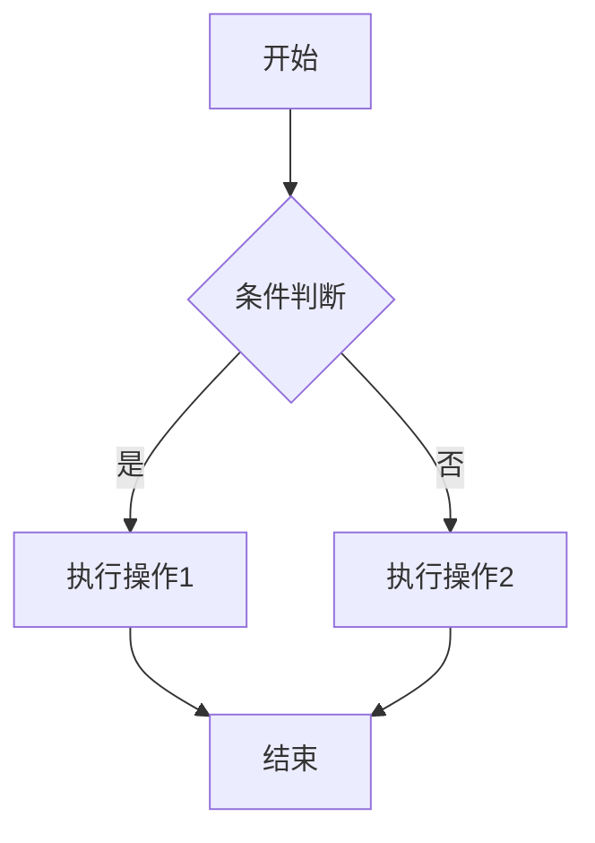
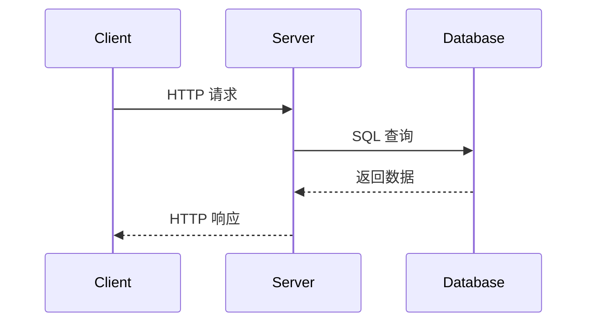
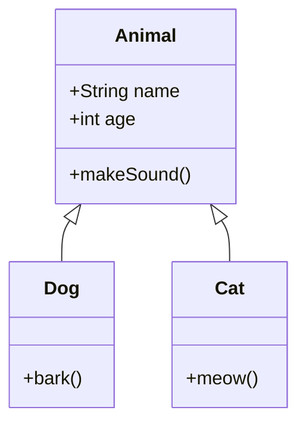
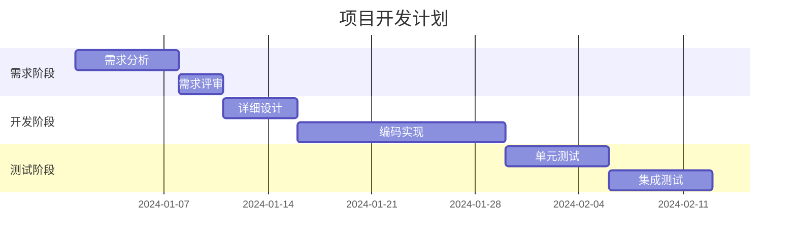

# Markdown 高级语法

本笔记介绍 Markdown 的高级语法，包括表格、代码块、数学公式、流程图等扩展功能。这些语法在不同的 Markdown 解析器中支持程度可能有所不同。

> **前置知识**：建议先阅读 [[3.1 Markdown基础语法]]。

---

## 1. 表格 (Tables)

### 1.1 基本语法

使用 `|` 分隔列，`-` 创建表头分隔线：

```markdown
| 表头1 | 表头2 | 表头3 |
|-------|-------|-------|
| 单元格 | 单元格 | 单元格 |
| 单元格 | 单元格 | 单元格 |
```

效果：

| 表头1 | 表头2 | 表头3 |
|-------|-------|-------|
| 单元格 | 单元格 | 单元格 |
| 单元格 | 单元格 | 单元格 |

### 1.2 对齐方式

在分隔线中使用 `:` 控制对齐：

```markdown
| 左对齐 | 居中对齐 | 右对齐 |
|:-------|:--------:|-------:|
| 内容 | 内容 | 内容 |
| 较长的内容 | 较长的内容 | 较长的内容 |
```

效果：

| 左对齐 | 居中对齐 | 右对齐 |
|:-------|:--------:|-------:|
| 内容 | 内容 | 内容 |
| 较长的内容 | 较长的内容 | 较长的内容 |

### 1.3 表格中使用格式

```markdown
| 功能 | 语法 | 示例 |
|------|------|------|
| **粗体** | `**文本**` | **重要** |
| `代码` | `` `code` `` | `printf()` |
| [链接](#) | `[文本](url)` | [点击](#) |
```

---

## 2. 代码块 (Code Blocks)

### 2.1 围栏式代码块

使用三个反引号 ``` 包裹代码，可指定语言以启用语法高亮：

````markdown
```python
def hello():
    print("Hello, World!")

if __name__ == "__main__":
    hello()
```
````

效果：

```python
def hello():
    print("Hello, World!")

if __name__ == "__main__":
    hello()
```

### 2.2 常用语言标识

| 语言 | 标识符 | 语言 | 标识符 |
|------|--------|------|--------|
| C | `c` | C++ | `cpp` / `c++` |
| Python | `python` / `py` | Java | `java` |
| JavaScript | `javascript` / `js` | TypeScript | `typescript` / `ts` |
| Bash/Shell | `bash` / `shell` | SQL | `sql` |
| JSON | `json` | YAML | `yaml` |
| HTML | `html` | CSS | `css` |
| Markdown | `markdown` / `md` | Go | `go` |
| Rust | `rust` | Assembly | `asm` / `nasm` |

### 2.3 代码示例

**C++ 示例**：

```cpp
#include <iostream>
#include <vector>

int main() {
    std::vector<int> nums = {1, 2, 3, 4, 5};

    for (const auto& n : nums) {
        std::cout << n << " ";
    }

    return 0;
}
```

**Shell 示例**：

```bash
#!/bin/bash

# 编译 C++ 程序
g++ -o main main.cpp -std=c++17

# 运行程序
./main
```

### 2.4 行号与高亮行（部分编辑器支持）

一些 Markdown 编辑器支持显示行号或高亮特定行：

````markdown
```python {.line-numbers}
def example():
    pass
```

```javascript {highlight=[2,4]}
function test() {
    const a = 1;  // 高亮
    const b = 2;
    return a + b; // 高亮
}
```
````

---

## 3. 数学公式 (Math Equations)

许多 Markdown 编辑器（如 Obsidian、Typora）支持 LaTeX 数学公式。

### 3.1 行内公式

使用单个 `$` 包裹：

```markdown
质能方程：$E = mc^2$

二次方程求根公式：$x = \frac{-b \pm \sqrt{b^2-4ac}}{2a}$
```

效果：质能方程：$E = mc^2$

### 3.2 块级公式

使用双 `$$` 包裹：

```markdown
$$
\int_{a}^{b} f(x) \, dx = F(b) - F(a)
$$
```

效果：

$$
\int_{a}^{b} f(x) \, dx = F(b) - F(a)
$$

### 3.3 常用数学符号

| 类别 | LaTeX 语法 | 渲染效果 |
|------|------------|----------|
| 上下标 | `x^2`, `x_i` | $x^2$, $x_i$ |
| 分数 | `\frac{a}{b}` | $\frac{a}{b}$ |
| 根号 | `\sqrt{x}`, `\sqrt[n]{x}` | $\sqrt{x}$, $\sqrt[n]{x}$ |
| 求和 | `\sum_{i=1}^{n}` | $\sum_{i=1}^{n}$ |
| 积分 | `\int_{a}^{b}` | $\int_{a}^{b}$ |
| 极限 | `\lim_{x \to \infty}` | $\lim_{x \to \infty}$ |
| 希腊字母 | `\alpha`, `\beta`, `\gamma` | $\alpha$, $\beta$, $\gamma$ |
| 箭头 | `\rightarrow`, `\Rightarrow` | $\rightarrow$, $\Rightarrow$ |
| 不等式 | `\leq`, `\geq`, `\neq` | $\leq$, $\geq$, $\neq$ |

### 3.4 矩阵

```markdown
$$
\begin{bmatrix}
a & b \\
c & d
\end{bmatrix}
$$
```

效果：

$$
\begin{bmatrix}
a & b \\
c & d
\end{bmatrix}
$$

---

## 4. 流程图与图表 (Diagrams)

### 4.1 Mermaid 流程图

Mermaid 是一种基于文本的图表语法，许多 Markdown 编辑器支持。

#### 基本流程图

````markdown

````

效果：


#### 流程图方向

| 方向 | 说明 |
|------|------|
| `TB` / `TD` | 从上到下 (Top to Bottom/Down) |
| `BT` | 从下到上 (Bottom to Top) |
| `LR` | 从左到右 (Left to Right) |
| `RL` | 从右到左 (Right to Left) |

#### 节点形状

```markdown
graph LR
    A[矩形] --> B(圆角矩形)
    B --> C{菱形}
    C --> D((圆形))
    D --> E>旗形]
    E --> F[[子程序]]
```

### 4.2 时序图

````markdown

````

效果：


### 4.3 类图

````markdown

````

效果：


### 4.4 甘特图

````markdown

````

---

## 5. 脚注 (Footnotes)

### 基本语法

```markdown
这是一段带脚注的文本[^1]。

这是另一个脚注引用[^note]。

[^1]: 这是第一个脚注的内容。
[^note]: 脚注可以使用标识符命名。
```

效果：

这是一段带脚注的文本[^1]。

这是另一个脚注引用[^note]。

[^1]: 这是第一个脚注的内容。
[^note]: 脚注可以使用标识符命名。

---

## 6. 定义列表 (Definition Lists)

部分 Markdown 解析器支持定义列表：

```markdown
术语 1
: 定义 1

术语 2
: 定义 2a
: 定义 2b
```

---

## 7. 缩写 (Abbreviations)

```markdown
HTML 是一种标记语言。

*[HTML]: HyperText Markup Language
```

鼠标悬停在 HTML 上时会显示完整含义。

---

## 8. HTML 嵌入

Markdown 支持直接嵌入 HTML 代码：

```markdown
<details>
<summary>点击展开详情</summary>

这里是隐藏的内容。

- 列表项 1
- 列表项 2

</details>
```

效果：

<details>
<summary>点击展开详情</summary>

这里是隐藏的内容。

- 列表项 1
- 列表项 2

</details>

### 常用 HTML 标签

| 标签 | 用途 | 示例 |
|------|------|------|
| `<br>` | 强制换行 | 第一行<br>第二行 |
| `<sup>` | 上标 | E=mc<sup>2</sup> |
| `<sub>` | 下标 | H<sub>2</sub>O |
| `<kbd>` | 键盘按键 | <kbd>Ctrl</kbd>+<kbd>C</kbd> |
| `<mark>` | 高亮 | <mark>重要内容</mark> |
| `<details>` | 折叠内容 | 见上方示例 |

---

## 总结

| 功能 | 语法 | 支持程度 |
|------|------|----------|
| 表格 | `\| 列 \|` | 广泛支持 |
| 代码块 | ` ``` lang ` | 广泛支持 |
| 数学公式 | `$LaTeX$` | 需编辑器支持 |
| Mermaid 图表 | ` ```mermaid ` | 需编辑器支持 |
| 脚注 | `[^1]` | 部分支持 |
| HTML 嵌入 | `<tag>` | 广泛支持 |

> **相关笔记**：Obsidian 特有的扩展语法请参阅 [[3.3 Obsidian特有语法]]。
