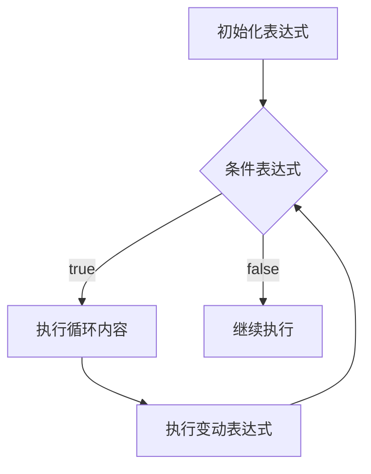

---
tags:
  - 基础语法
---

# for 循环

## 基本语法

```cpp
for (初始化表达式; 运行条件表达式; 变动表达式)
{
    循环内容;
}
```

### 示例

```cpp
for (int i = 0; i < 10; i++)
{
    std::cout << i << std::endl;
}
std::cout << "循环结束";
```

## 执行逻辑



## 跳出循环的三种方式

| 语句 | 说明 |
|------|------|
| `continue` | 跳出本次循环，进入循环的下一次迭代 |
| `break` | 跳出循环 |
| `goto` | 跳出嵌套循环 |

## for 循环的变体

```cpp
// 标准形式
for (初始化; 条件; 变动)
{
}

// 无限循环（省略所有表达式）
for (;;) {}

// 省略初始化表达式
for (; 条件; 变动) {}
```

---

## 练习题一：查找质数

### 题目描述

质数只能被自己和1整除的数，在不对称加密算法中，质数扮演着重要的作用，设计一个程序找出1000以内的质数。

### 背景知识：不对称加密法

不对称加密法，也称为非对称加密，是一种加密方法，它使用一对密钥：一个公钥和一个私钥。公钥可以公开分享，而私钥则必须保密。这种加密方式的关键在于公钥和私钥是不同的，并且它们之间存在数学关系，使得使用其中一个密钥加密的数据只能使用另一个密钥来解密。

**非对称加密的主要特点包括：**

1. **密钥对**：每个用户都有一对密钥，一个公钥用于加密，一个私钥用于解密
2. **安全性**：由于公钥和私钥是不同的，即使公钥被公开，没有私钥也无法解密信息
3. **数字签名**：非对称加密还可以用来创建数字签名，确保信息的完整性和来源的认证
4. **计算成本**：非对称加密通常比对称加密（如AES）在计算上更昂贵，因此它通常用于加密小量数据，如密钥交换或数字签名
5. **应用场景**：非对称加密常用于安全通信，如SSL/TLS协议中的密钥交换，以及数字证书和公钥基础设施（PKI）

常见的非对称加密算法包括RSA、DSA、ECC（椭圆曲线加密）等，这些算法在设计上确保了即使在公钥被广泛知晓的情况下，私钥的安全性也能得到保障。

### 题解

#### 方案一：基础实现

```cpp
int main()
{
    std::cout << sqrt(100) << std::endl;

    for (int i = 3; i < 1000; i++)
    {
        for (int j = 2; j < i; j++)
        {
            if ((i % j) == 0) {
                break;
            }
            else if (j == i - 1) {
                std::cout << i << std::endl;
            }
        }
    }
    return 0;
}
```

#### 方案二：优化版（只检查奇数）

```cpp
int main()
{
    // 偶数没有质数，奇数才有
    for (int i = 3; i < 1000; i += 2)
    {
        bool base{};
        // 奇数不可能被偶数整除
        for (int j = 3; j < i; j += 2) {
            if ((i % j) == 0) {
                base = true;
                break;
            }
        }
        if (!base) {
            std::cout << i << std::endl;
        }
    }
    return 0;
}
```

#### 方案三：进一步优化（平方根优化）

```cpp
int main()
{
    // 偶数没有质数，奇数才有
    for (int i = 3; i < 1000; i += 2)
    {
        bool base{};
        // 奇数不可能被偶数整除
        // 同时对数进行因式分解的时候，最大的数就是他的平方根了
        // （比平方根更大的数肯定可以和比平方根小的数结合）
        for (int j = 3; j < sqrt(i); j += 2) {
            if ((i % j) == 0) {
                base = true;
                break;
            }
        }
        if (!base) {
            std::cout << i << std::endl;
        }
    }
    return 0;
}
```

---

## 练习题二：办公家具采购

### 题目

某单位要采购一批办公家具：
- 共有一万元资金，要买100件家具
- 高级桌子每张500元
- 普通桌子每张300元
- 椅子三把100元

要求把资金刚好花完，并且所有家具的数量加起来是100件。请设计一个软件系统来给出采购方案。

### 解题

#### 方法一：暴力枚举

```cpp
int main()
{
    const int SENIOR_TABLE_PRICE{500};
    const int BASIC_TABLE_PRICE{300};
    const int CHAIR_PRICE{100};

    int total = 10000;

    int basic_table_num{};
    int senior_table_num{};
    int chair_num{};

    for (int i = 0; i <= 20; i++)
    {
        for (int j = 0; j <= 33; j++)
        {
            int k = 100 - i - j;
            if ((k % 3 == 0) && (SENIOR_TABLE_PRICE * i +
                BASIC_TABLE_PRICE * j + k * 100 / 3) == total) {
                std::cout << "高级桌子有: " << i
                          << "张, 普通桌子有: " << j
                          << "张, 椅子有:" << k << "把"
                          << std::endl;
            }
            else
            {
                continue;
            }
        }
    }
    return 0;
}
```

> **注意**：椅子是三把100元，所以椅子数量必须是3的倍数，单价为 100/3 元。

---
## 相关笔记
 - [[5.2 while循环]]