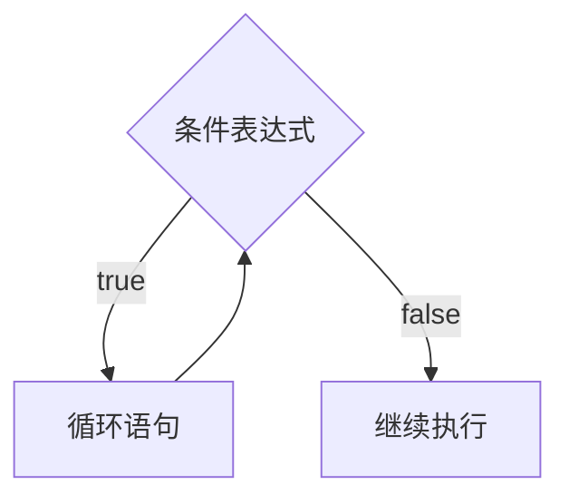
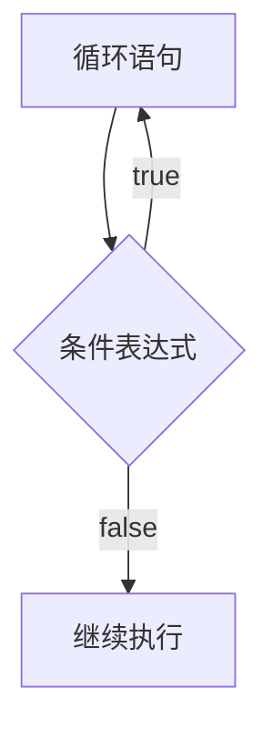

---
tags:
  - 基础语法
阅读次数: 0
---

# while 循环

## 基本语法

```cpp
while (条件表达式)
{
    循环语句;
}
```

### 示例

```cpp
int i = 9;
while (i > 0)
{
    i--;
    std::cout << i;
}
```

## 执行逻辑



## while 循环知识补充

| 特性 | 说明 |
|------|------|
| 循环嵌套 | while 循环可以嵌套 |
| 整数条件 | `while(整数)` - 整数转换为bool值（0为false，非0为true） |
| 跳出循环 | `goto`、`break`、`continue` 可以跳出循环 |

### 嵌套示例

```cpp
while ()
{
    while ()
    {
    }
}
```

---

# do while 循环

## 基本语法

```cpp
do
{
    循环语句;
} while (条件表达式);
```

### 示例

```cpp
int i = 9;
do
{
    i--;
    std::cout << i;
} while (i > 0);
```

## 执行逻辑



> **关键区别**：`do while` 循环**至少执行一次**循环体，因为条件判断在循环体之后。

## do while 循环知识补充

| 特性 | 说明 |
|------|------|
| 循环嵌套 | do while 循环可以嵌套 |
| 整数条件 | `do while(整数)` - 整数转换为bool值 |
| 跳出循环 | `goto`、`break`、`continue` 可以跳出循环 |

### 嵌套示例

```cpp
do
{
    do
    {
    } while ();
} while ();
```

---

## while 与 do while 的对比

| 特性 | while | do while |
|------|-------|----------|
| 条件检查时机 | 循环前 | 循环后 |
| 最少执行次数 | 0次 | 1次 |
| 适用场景 | 可能不需要执行的循环 | 至少执行一次的循环 |

---
## 相关笔记
- [[5.1 for循环]]
