# MFMS 数据中台架构分析文档

> 文档生成日期: 2026-04-20
> 基于代码版本: `58f80da` (main)

---

## 目录

1. [系统总览](#1-系统总览)
2. [数据中台整体架构 (SVG)](#2-数据中台整体架构-svg)
3. [线程模型与跨线程数据交换 (Mermaid)](#3-线程模型与跨线程数据交换-mermaid)
4. [CommunicationInterface 通信链分析](#4-communicationinterface-通信链分析)
5. [数据库结构图 (Mermaid ER)](#5-数据库结构图-mermaid-er)
6. [上下位机数据库交互协议](#6-上下位机数据库交互协议)
7. [代理层 (hyrms_export) 调用链](#7-代理层-hyrms_export-调用链)
8. [接口状态总表](#8-接口状态总表)
9. [关键源码索引](#9-关键源码索引)

---

## 1. 系统总览

MFMS (Multi-Functional Manufacturing System) 数据中台是一个基于 **ROS 2 Humble + Qt5** 的工业设备集成控制平台。它通过单例通信接口将 Qt 前端与 ROS 设备控制、MySQL 数据库事件驱动三大系统统一封装，对 UI 层提供线程安全的信号/槽契约。

### 核心设计原则

| 原则 | 实现方式 |
|------|---------|
| **UI 线程隔离** | `CommunicationInterfaceImpl` 单例 + `QThread` + `Qt::QueuedConnection` |
| **门面模式** | `MfmsGatewayImpl` 统一封装 DB/ROS/CMD 三大服务 |
| **设备代理** | `RobotProxyAdapter` / `AgvProxyAdapter` 通过 PIMPL 隐藏 `hyrms_export` 实现 |
| **数据库事件驱动** | MySQL 触发器 + 轮询 `*_ui_event` 表实现上下位机异步通信 |

---

## 2. 数据中台整体架构 (SVG)

![[图片/SVG/mfms_data_center_architecture.svg|825]]

---

## 3. 线程模型与跨线程数据交换 (Mermaid)

### 3.1 下行命令流 (UI → 物理设备)

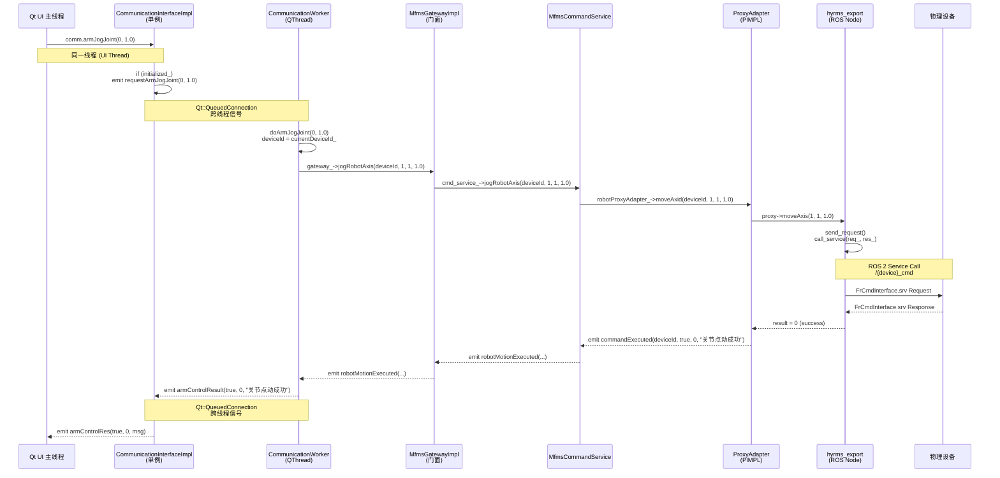

### 3.2 上行状态流 (物理设备 → UI)

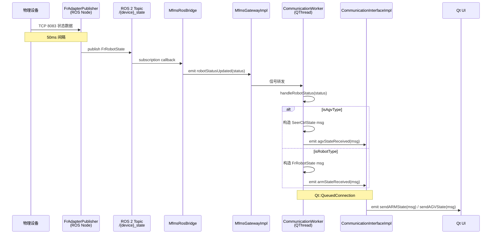

### 3.3 数据库事件流 (上下位机通信)

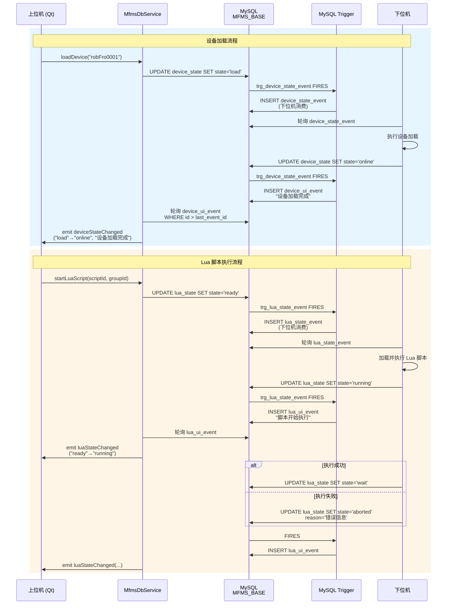

### 3.4 线程全景图

```mermaid
graph TD
    subgraph "Qt UI 主线程"
        UI[hybrid_robot_system / Control / ...]
        Impl["CommunicationInterfaceImpl<br/>getInstance() 单例"]
    end

    subgraph "Communication Thread (QThread)"
        Worker[CommunicationWorker]
        GW[MfmsGatewayImpl]
        DB[MfmsDbService]
        Bridge[MfmsRosBridge]
        CMD[MfmsCommandService]
    end

    subgraph "RobotProxy Executor Thread"
        RExec["MultiThreadedExecutor<br/>spin_some(10ms)"]
        FrProxy["RobotProxy::FrRobot<br/>(rclcpp::Node)"]
    end

    subgraph "AgvProxy Executor Thread"
        AExec["MultiThreadedExecutor<br/>spin_some(10ms)"]
        AgvProxy["AgvProxy::SeerCtrl<br/>(rclcpp::Node)"]
    end

    subgraph "ROS 2 Network"
        Topic["/{device}_state Topic"]
        Service["/{device}_cmd Service"]
    end

    UI <-->|"Qt::QueuedConnection"| Impl
    Impl <-->|"emit requestXxx / resultXxx"| Worker
    Worker --> GW
    GW --> DB
    GW --> Bridge
    GW --> CMD
    CMD --> RExec
    CMD --> AExec
    RExec --> FrProxy
    AExec --> AgvProxy
    FrProxy <--> Service
    AgvProxy <--> Service
    Bridge <-- Topic
    DB <-->|"轮询 *_ui_event"| MySQL[(MySQL)]

    style UI fill:#E8F5E9,stroke:#4CAF50
    style Impl fill:#E3F2FD,stroke:#1976D2
    style Worker fill:#E3F2FD,stroke:#1976D2
    style GW fill:#FFF3E0,stroke:#F57C00
    style DB fill:#F3E5F5,stroke:#7B1FA2
    style Bridge fill:#F3E5F5,stroke:#7B1FA2
    style CMD fill:#F3E5F5,stroke:#7B1FA2
    style FrProxy fill:#FFEBEE,stroke:#C62828
    style AgvProxy fill:#FFEBEE,stroke:#C62828
    style MySQL fill:#FFF9C4,stroke:#F9A825
```

---

## 4. CommunicationInterface 通信链分析

### 4.1 接口层级调用链

每个 `CommunicationInterface` 公开接口的完整调用链如下：

#### 设备列表刷新

```
refreshRobotList()
  → CommunicationInterfaceImpl::refreshRobotList()
    → emit requestRefreshRobotList()                    [跨线程]
      → CommunicationWorker::doRefreshRobotList()
        → MfmsGatewayImpl::refreshDeviceList()
          → MfmsRosBridge::refreshDeviceList()
            → DB 查询 device_state JOIN device
              → emit deviceListUpdated(devices)
                → CommunicationWorker::emitRobotList()
                  → emit robotListUpdated(names)        [跨线程]
                    → CommunicationInterface::getRobotList(names)
```

#### 设备连接（状态机驱动）

```
connectRobot(name)
  → CommunicationInterfaceImpl::connectRobot(name)
    → emit requestConnectRobot(name)                    [跨线程]
      → CommunicationWorker::doConnectRobot(name)
        → resolveDeviceId(name)                         // 名字→设备ID
        → currentDeviceId_ = deviceId

        Case 1: AGV 设备 (online/connected)
          → gateway_->connectAgv(deviceId)
            → MfmsCommandService::connectAgv()
              → AgvProxyAdapter::connectAgv()
                → SeerCtrl::connect()                   // hyrms_export
            → robotConnected 信号
              → subscribeDeviceById()
                → subscribeResult → connectionResult

        Case 2: Robot (connected)
          → gateway_->connectRobot(deviceId)
            → MfmsCommandService::connectRobot()
              → RobotProxyAdapter::connectRobot()
                → FrRobot::connect()                    // hyrms_export
            → robotConnected → subscribe → connectionResult

        Case 3: Robot (online) — 等待下位机 TCP
          → connectingDeviceId_ = deviceId
          → 等待 handleDeviceStateTransition(→ connected)
            → gateway_->connectRobot(deviceId)

        Case 4: Robot (offline) — 走完整状态机
          → gateway_->loadDevice(deviceId)              // DB: state='load'
          → 等待 device_ui_event: load → online
          → 等待 device_ui_event: online → connected
          → gateway_->connectRobot(deviceId)
```

#### 机械臂关节点动

```
armJogJoint(number, jog_step_)
  → emit requestArmJogJoint(number, jog_step_)         [跨线程]
    → CommunicationWorker::doArmJogJoint(jointNum, step)
      → gateway_->jogRobotAxis(deviceId, jointNum+1, direction, abs(step))
        → MfmsCommandService::jogRobotAxis(deviceId, axisId, direction, step)
          → RobotProxyAdapter::moveAxid(deviceId, axisId, direction, step)
            → FrRobot::moveAxis(axisId, direction, step)
              → send_request() → ROS Service /{device}_cmd
```

#### AGV 站点导航

```
exeToStation(stationName)
  → emit requestExeToStation(stationName)               [跨线程]
    → CommunicationWorker::doExeToStation(stationName)
      → gateway_->executeAgvToStation(deviceId, stationName)
        → MfmsCommandService::executeAgvToStation(deviceId, stationName)
          → AgvProxyAdapter::navigateToStation(deviceId, station)
            → SeerCtrl::guideGoTarget(station)
              → send_request() → ROS Service /{device}_cmd
```

#### AGV 路径资源管理

```
getPaths()
  → emit requestGetPaths()                              [跨线程]
    → CommunicationWorker::doGetPaths()
      → resolveCurrentAgvDeviceId()                     // 必须当前已选中 AGV
      → gateway_->queryAgvPaths(deviceId)
        → MfmsCommandService::queryAgvPaths(deviceId)
          → DB 查询 agv_path WHERE device_id = ?
            → emit agvPathsReceived(deviceId, pathNames)

exeToPath(pathName)
  → emit requestExeToPath(pathName)                     [跨线程]
    → CommunicationWorker::doExeToPath(pathName)
      → gateway_->executeAgvToPath(deviceId, pathName)
        → MfmsCommandService::executeAgvToPath(deviceId, pathName)
          → DB 查询 agv_path + agv_path_station → station_list
          → 复用 executeAgvToStationList(deviceId, station_list)
            → AgvProxyAdapter::navigateToStationList()
              → SeerCtrl::guideGoTargetList(station_list)

addPath(pathName, stationList)
  → emit requestAddPath(pathName, stationList)          [跨线程]
    → CommunicationWorker::doAddPath(pathName, stationList)
      → gateway_->addAgvPath(deviceId, pathName, stationList)
        → MfmsCommandService::addAgvPath(deviceId, pathName, stationList)
          → DB 事务: INSERT agv_path + INSERT agv_path_station
```

### 4.2 不可用接口及原因

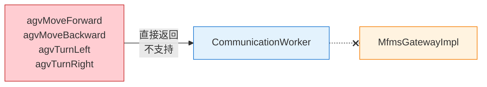

**原因**: `hyrms_export::SeerCtrl` 仅提供站点导航协议 (`guideGoTarget`, `guideGoTargetList`)，`SeerCtrlCmdInterface.srv` 没有 `speed/distance/angle` 字段。要打通需要下位机先扩展命令语义。

---

## 5. 数据库结构图 (Mermaid ER)

### 5.1 完整 ER 图

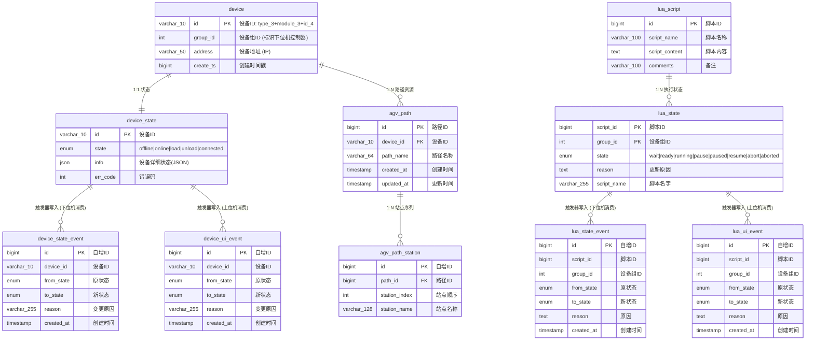

### 5.2 设备ID命名规则

| 前缀 (type_3) | 含义 | module_3 示例 | 完整 ID 示例 |
|:-:|:-:|:-:|:-:|
| `rob` | Robot Arm | `Fro` (Fairino) | `robFro0001` |
| `rbt` | Robot | `Hsu` (华数) | `rbtHsu0001` |
| `agv` | AGV | `Src` (仙工/Seer) | `agvSrc0001` |
| `plc` | PLC | `Sie` (Siemens) | `plcSie0001` |
| `vit` | Virtual | `Dev` | `vitDev0001` |

### 5.3 触发器机制

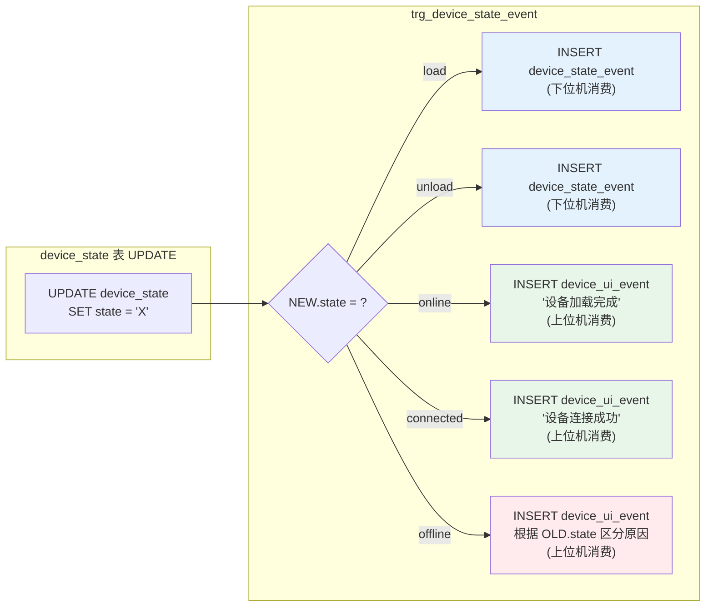

---

## 6. 上下位机数据库交互协议

### 6.1 设备状态机

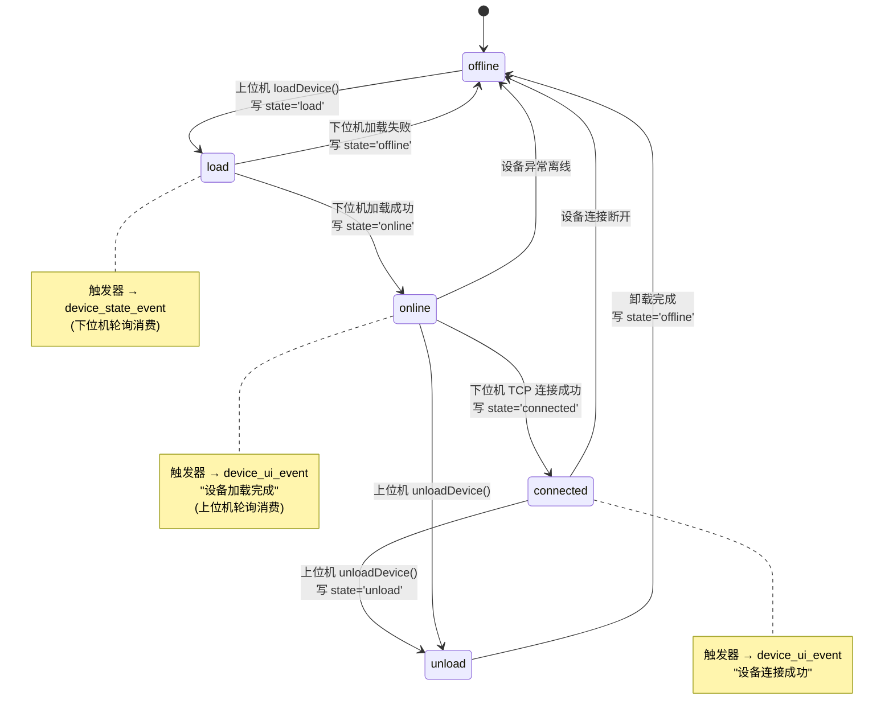

### 6.2 Lua 脚本状态机

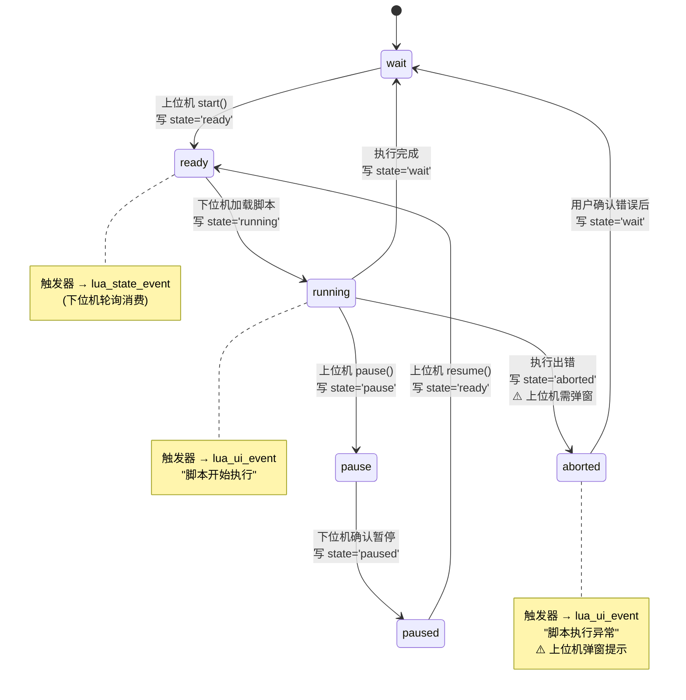

### 6.3 完整上下位机交互时序

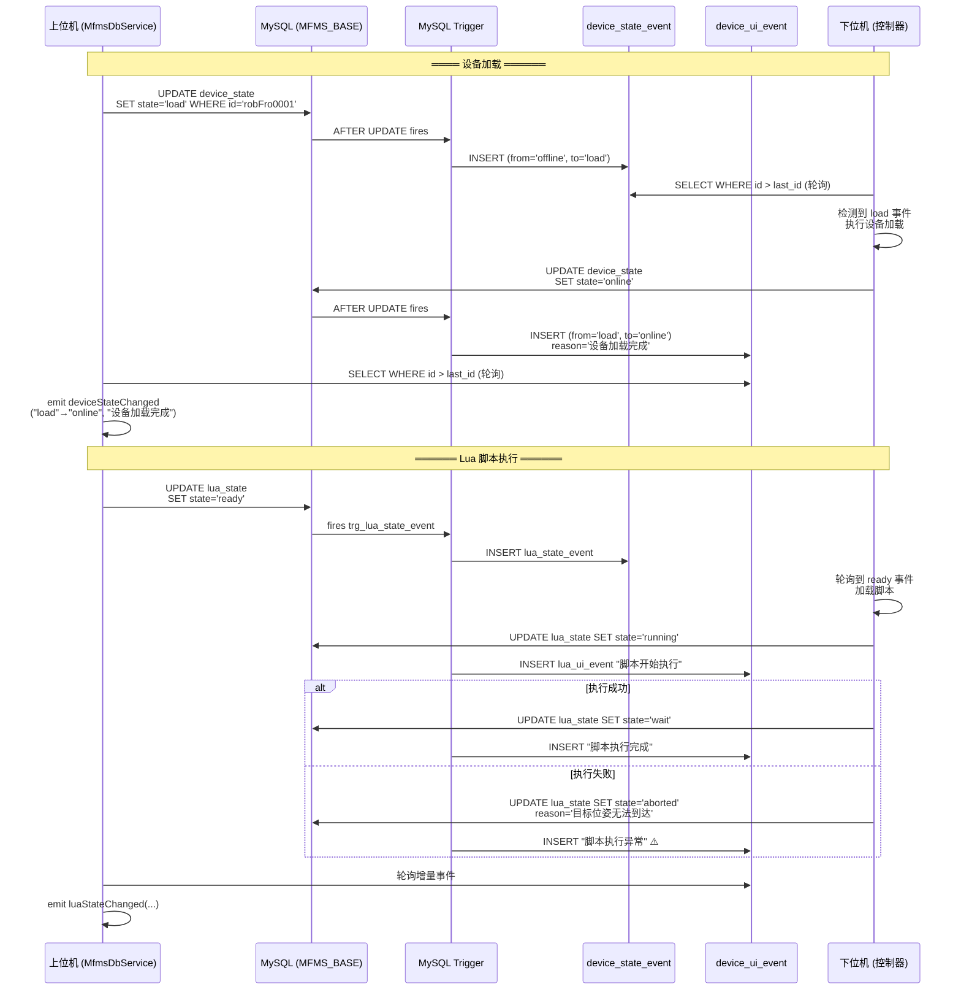

---

## 7. 代理层 (hyrms_export) 调用链

### 7.1 代理层架构

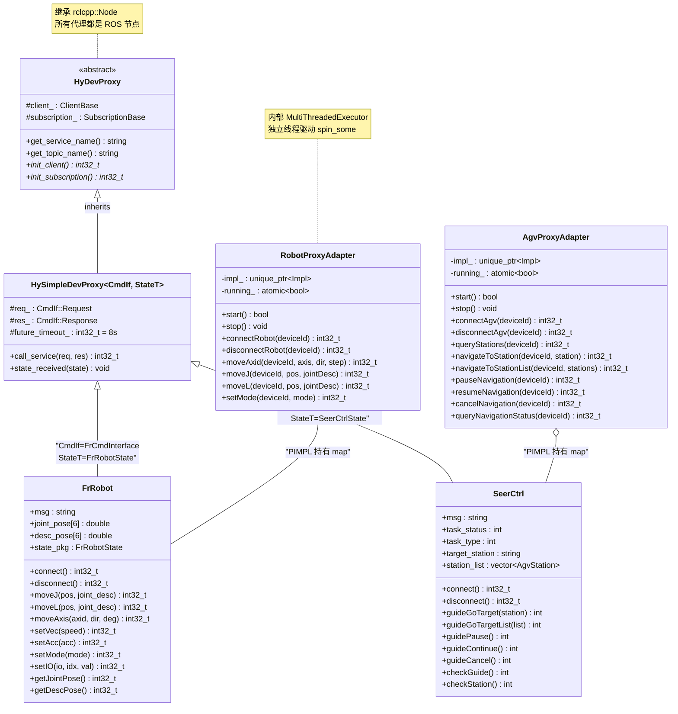

### 7.2 FrRobot 命令下发详细流程

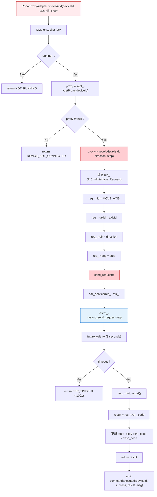

### 7.3 SeerCtrl 导航流程

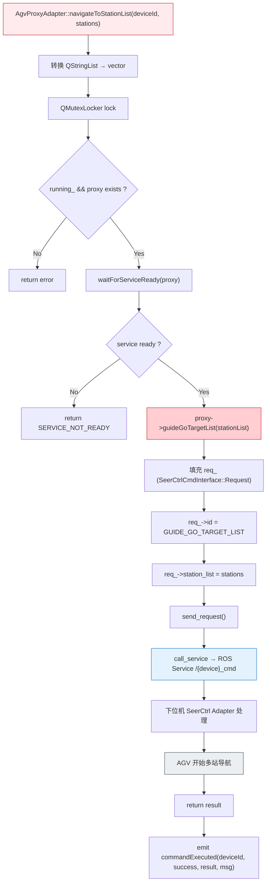

### 7.4 代理层 ROS 服务接口

| 代理类 | ROS Service 名 | .srv 类型 | 关键请求字段 | 关键响应字段 |
|:------|:--------------|:---------|:-----------|:-----------|
| `FrRobot` | `/{device}_cmd` | `FrCmdInterface` | `id, position[6], axid, dir, deg, mode, speed, io_index, io_value` | `err_code, msg, jt_pos[6], tl_pos[6], register_val, io_val` |
| `SeerCtrl` | `/{device}_cmd` | `SeerCtrlCmdInterface` | `id, station, station_list[]` | `err_code, msg, task_status, task_type, target_station, station_list[]` |

### 7.5 代理层错误码

| 错误码 | 宏定义 | 含义 |
|:---:|:------|:-----|
| `0` | `ERR_DEV_PROXY_SEND_OK` | 成功 |
| `-1001` | `ERR_DEV_PROXY_SEND_TIMEOUT` | ROS Service 调用超时 (8s) |
| `-1002` | `ERR_DEV_PROXY_SEND_PARAM` | 参数错误 |
| `-1009` | `ERR_DEV_PROXY_SEND_OTHERS` | 其他错误 |
| `-1110` | `ERR_HYRMS_DEV_WARN` | 设备警告 |
| `-1120` | `ERR_HYRMS_DEV_ERROR` | 设备错误 |
| `-1130` | `ERR_HYRMS_DEV_EMERGENCY_STOP` | 急停 |
| `-1140` | `ERR_HYRMS_DEV_FATAL` | 致命错误 |
| `-1199` | `ERR_HYRMS_DEV_REG` | 设备未注册 |

---

## 8. 接口状态总表

| 接口 | 功能 | 状态 | 走 hyrms_export | 调用终点 |
|:-----|:-----|:----:|:----:|:---------|
| `refreshRobotList` | 刷新可选设备列表 | ✅ 可用 | ❌ | DB → MfmsRosBridge |
| `connectRobot` | 连接设备 | ✅ 可用 | ✅ | FrRobot::connect / SeerCtrl::connect |
| `disconnectRobot` | 断开设备 | ✅ 可用 | ✅ | FrRobot::disconnect / SeerCtrl::disconnect |
| `armJogJoint` | 机械臂关节点动 | ✅ 可用 | ✅ | FrRobot::moveAxis |
| `armJogCartesian` | 机械臂笛卡尔点动 | ✅ 可用 | ✅ | FrRobot::moveL |
| `armChangeMode` | 切换机械臂模式 | ✅ 可用 | ✅ | FrRobot::setMode |
| `refreshState` | 请求状态刷新 | ⚠️ 被动 | ❌ | 等待 topic 下次上报 (~50ms) |
| `getStations` | 查询 AGV 站点 | ✅ 可用 | ✅ | SeerCtrl::checkStation |
| `exeToStation` | AGV 单站导航 | ✅ 可用 | ✅ | SeerCtrl::guideGoTarget |
| `exeToStationList` | AGV 多站导航 | ✅ 可用 | ✅ | SeerCtrl::guideGoTargetList |
| `pauseNavigation` | 暂停导航 | ✅ 可用 | ✅ | SeerCtrl::guidePause |
| `resumeNavigation` | 继续导航 | ✅ 可用 | ✅ | SeerCtrl::guideContinue |
| `cancelNavigation` | 取消导航 | ✅ 可用 | ✅ | SeerCtrl::guideCancel |
| `queryNavigationStatus` | 查询导航状态 | ✅ 可用 | ✅ | SeerCtrl::checkGuide |
| `getPaths` | 查询路径名列表 | ✅ 可用 | ❌ | DB 查询 agv_path |
| `exeToPath` | 执行命名路径 | ✅ 可用 | ✅ | DB → SeerCtrl::guideGoTargetList |
| `addPath` | 保存路径 | ✅ 可用 | ❌ | DB 写入 agv_path + agv_path_station |
| `agvMoveForward` | AGV 前进 | ❌ 不可用 | — | 直接返回"不支持" |
| `agvMoveBackward` | AGV 后退 | ❌ 不可用 | — | 直接返回"不支持" |
| `agvTurnLeft` | AGV 左转 | ❌ 不可用 | — | 直接返回"不支持" |
| `agvTurnRight` | AGV 右转 | ❌ 不可用 | — | 直接返回"不支持" |

---

## 9. 关键源码索引

| 文件路径 | 职责 |
|:---------|:-----|
| `src/mfms_server/client_api/include/mfms_server/CommunicationInterface.h` | 纯虚 Qt 接口，定义 UI 侧信号/槽契约 |
| `src/mfms_server/client_api/include/mfms_server/CommunicationInterfaceImpl.h` | Meyers 单例实现，跨线程请求转发 |
| `src/mfms_server/client_api/src/CommunicationInterfaceImpl.cpp` | 单例初始化、Worker 创建、信号连接 |
| `src/mfms_server/client_api/src/CommunicationWorker.h` | Worker 头文件，定义独立线程接口 |
| `src/mfms_server/client_api/src/CommunicationWorker.cpp` | Worker 实现：ROS 初始化、设备管理、状态映射 |
| `src/mfms_server/gateway/include/mfms_server/MfmsGateway.h` | 门面抽象接口 |
| `src/mfms_server/gateway/include/mfms_server/MfmsGatewayImpl.h` | 门面实现头文件 |
| `src/mfms_server/gateway/src/MfmsGatewayImpl.cpp` | 门面实现：三大服务编排与信号转发 |
| `src/mfms_server/cmd_service/include/cmd_service/MfmsCommandService.h` | 命令服务接口 |
| `src/mfms_server/cmd_service/src/MfmsCommandService.cpp` | 命令服务实现 |
| `src/mfms_server/cmd_service/src/RobotProxyAdapter.cpp` | 机械臂代理适配器 (PIMPL) |
| `src/mfms_server/cmd_service/src/AgvProxyAdapter.cpp` | AGV 代理适配器 (PIMPL) |
| `HyRMS_export_.../hyrms_export/include/dev/robot/robot.hpp` | FrRobot 代理类 (hyrms_export) |
| `HyRMS_export_.../hyrms_export/include/dev/agv/agv.hpp` | SeerCtrl 代理类 (hyrms_export) |
| `HyRMS_export_.../hyrms_export/include/dev/dev_proxy.hpp` | 代理基类 HyDevProxy + HySimpleDevProxy |
| `src/com_interfaces/srv/FrCmdInterface.srv` | 机械臂 ROS Service 定义 |
| `src/com_interfaces/srv/SeerCtrlCmdInterface.srv` | AGV ROS Service 定义 |
| `MFMS_BASE_04171715.sql` | 数据库完整 Schema + Triggers |

---

> **文档维护说明**: 本文档基于 `58f80da` 提交的代码生成。当 `CommunicationInterface.h` 接口变更或新增设备类型时，应同步更新本文档。
