---
tags:
  - 研一上学期
---
# MFMS 数据中台架构分析文档

> 文档生成日期: 2026-04-29 (上次更新: 2026-04-23)
> 基于代码版本: `c64e2cb` (main, Update src workspace)

---

## 目录

1. [系统总览](#1-系统总览)
2. [数据中台整体架构 (SVG)](#2-数据中台整体架构-svg)
3. [线程模型与跨线程数据交换 (Mermaid)](#3-线程模型与跨线程数据交换-mermaid)
4. [CommunicationInterface 通信链分析](#4-communicationinterface-通信链分析)
5. [数据库结构图 (Mermaid ER)](#5-数据库结构图-mermaid-er)
6. [上下位机数据库交互协议](#6-上下位机数据库交互协议)
7. [代理层 (hyrms_export) 调用链](#7-代理层-hyrms_export-调用链)
8. [接口状态总表](#8-接口状态总表)
9. [关键源码索引](#9-关键源码索引)

---

## 1. 系统总览

MFMS (Multi-Functional Manufacturing System) 数据中台是一个基于 **ROS 2 Humble + Qt5** 的工业设备集成控制平台。它通过单例通信接口将 Qt 前端与 ROS 设备控制、MySQL 数据库事件驱动三大系统统一封装，对 UI 层提供线程安全的信号/槽契约。

### 核心设计原则

| 原则 | 实现方式 |
|------|---------|
| **UI 线程隔离** | `CommunicationInterfaceImpl` 单例 + `QThread` + `Qt::QueuedConnection` |
| **门面模式** | `MfmsGatewayImpl` 统一封装 DB/ROS/CMD 三大服务 |
| **设备代理** | `RobotProxyAdapter` / `AgvProxyAdapter` 通过 PIMPL 隐藏 `hyrms_export` 实现 |
| **数据库事件驱动** | MySQL 触发器 + 轮询 `*_ui_event` 表实现上下位机异步通信 |

---

## 2. 数据中台整体架构 (SVG)

<svg xmlns="http://www.w3.org/2000/svg" viewBox="0 0 1100 980" font-family="'Segoe UI','Microsoft YaHei',sans-serif" font-size="13">
  <defs>
    <marker id="arrowDown" markerWidth="10" markerHeight="7" refX="5" refY="3.5" orient="auto">
      <polygon points="0 0, 10 3.5, 0 7" fill="#555"/>
    </marker>
    <marker id="arrowUp" markerWidth="10" markerHeight="7" refX="5" refY="3.5" orient="auto-start-reverse">
      <polygon points="0 0, 10 3.5, 0 7" fill="#555"/>
    </marker>
    <marker id="arrowRight" markerWidth="10" markerHeight="7" refX="5" refY="3.5" orient="0">
      <polygon points="0 0, 10 3.5, 0 7" fill="#555"/>
    </marker>
    <linearGradient id="bgUI" x1="0" y1="0" x2="0" y2="1"><stop offset="0%" stop-color="#E8F5E9"/><stop offset="100%" stop-color="#C8E6C9"/></linearGradient>
    <linearGradient id="bgComm" x1="0" y1="0" x2="0" y2="1"><stop offset="0%" stop-color="#E3F2FD"/><stop offset="100%" stop-color="#BBDEFB"/></linearGradient>
    <linearGradient id="bgGW" x1="0" y1="0" x2="0" y2="1"><stop offset="0%" stop-color="#FFF3E0"/><stop offset="100%" stop-color="#FFE0B2"/></linearGradient>
    <linearGradient id="bgSvc" x1="0" y1="0" x2="0" y2="1"><stop offset="0%" stop-color="#F3E5F5"/><stop offset="100%" stop-color="#E1BEE7"/></linearGradient>
    <linearGradient id="bgProxy" x1="0" y1="0" x2="0" y2="1"><stop offset="0%" stop-color="#FFEBEE"/><stop offset="100%" stop-color="#FFCDD2"/></linearGradient>
    <linearGradient id="bgDev" x1="0" y1="0" x2="0" y2="1"><stop offset="0%" stop-color="#ECEFF1"/><stop offset="100%" stop-color="#CFD8DC"/></linearGradient>
    <linearGradient id="bgDB" x1="0" y1="0" x2="0" y2="1"><stop offset="0%" stop-color="#FFF9C4"/><stop offset="100%" stop-color="#FFF176"/></linearGradient>
  </defs>

  <!-- 标题 -->
  <text x="550" y="30" text-anchor="middle" font-size="20" font-weight="bold" fill="#333">MFMS 数据中台整体架构</text>

  <!-- ===== Layer 1: Qt Frontend ===== -->
  <rect x="30" y="50" width="1040" height="80" rx="10" fill="url(#bgUI)" stroke="#4CAF50" stroke-width="2"/>
  <text x="50" y="75" font-size="15" font-weight="bold" fill="#2E7D32">Qt Frontend (UI 主线程)</text>
  <rect x="50" y="85" width="150" height="35" rx="5" fill="#fff" stroke="#4CAF50"/>
  <text x="125" y="107" text-anchor="middle" font-size="11">hybrid_robot_system</text>
  <rect x="220" y="85" width="100" height="35" rx="5" fill="#fff" stroke="#4CAF50"/>
  <text x="270" y="107" text-anchor="middle" font-size="11">Control</text>
  <rect x="340" y="85" width="110" height="35" rx="5" fill="#fff" stroke="#4CAF50"/>
  <text x="395" y="107" text-anchor="middle" font-size="11">TaskManager</text>
  <rect x="470" y="85" width="130" height="35" rx="5" fill="#fff" stroke="#4CAF50"/>
  <text x="535" y="107" text-anchor="middle" font-size="11">VisualProgram</text>
  <rect x="620" y="85" width="140" height="35" rx="5" fill="#fff" stroke="#4CAF50"/>
  <text x="690" y="107" text-anchor="middle" font-size="11">SystemManagement</text>
  <rect x="780" y="85" width="270" height="35" rx="5" fill="#A5D6A7" stroke="#4CAF50"/>
  <text x="915" y="107" text-anchor="middle" font-size="12" font-weight="bold">connect(&amp;comm, SIGNAL, SLOT)</text>

  <!-- Arrow: UI → Singleton -->
  <line x1="550" y1="130" x2="550" y2="155" stroke="#555" stroke-width="2" marker-end="url(#arrowDown)"/>
  <text x="570" y="148" font-size="10" fill="#888">Qt::QueuedConnection</text>

  <!-- ===== Layer 2: CommunicationInterfaceImpl (Singleton) ===== -->
  <rect x="30" y="155" width="1040" height="65" rx="10" fill="url(#bgComm)" stroke="#1976D2" stroke-width="2"/>
  <text x="50" y="180" font-size="15" font-weight="bold" fill="#1565C0">CommunicationInterfaceImpl (Meyers 单例)</text>
  <text x="50" y="205" font-size="11" fill="#555">client_api | 公开槽: refreshRobotList, connectRobot, armJogJoint, agvMoveForward, getStations, getPaths ...</text>
  <text x="770" y="180" font-size="11" fill="#1565C0">内部信号: requestXxx → QueuedConnection → Worker</text>
  <rect x="770" y="188" width="280" height="25" rx="4" fill="#fff" stroke="#1976D2" stroke-dasharray="4"/>
  <text x="910" y="206" text-anchor="middle" font-size="10">emit requestRefreshRobotList() / requestArmJogJoint() ...</text>

  <!-- Arrow: Singleton → Worker -->
  <line x1="550" y1="220" x2="550" y2="250" stroke="#555" stroke-width="2" marker-end="url(#arrowDown)"/>
  <text x="470" y="240" font-size="10" fill="#D32F2F" font-weight="bold">跨线程边界 ↓</text>

  <!-- ===== Layer 3: CommunicationWorker (独立线程) ===== -->
  <rect x="30" y="250" width="1040" height="75" rx="10" fill="url(#bgComm)" stroke="#1976D2" stroke-width="2" stroke-dasharray="6"/>
  <text x="50" y="275" font-size="15" font-weight="bold" fill="#1565C0">CommunicationWorker (QThread 独立线程)</text>
  <text x="50" y="298" font-size="11" fill="#555">槽: doRefreshRobotList, doConnectRobot, doArmJogJoint, doGetStations, doExeToPath ...</text>
  <text x="50" y="315" font-size="11" fill="#555">维护: rosNode_ | gateway_ | currentDeviceId_ | devices_ | connectingDeviceId_</text>
  <text x="770" y="298" font-size="11" fill="#1565C0">handleRobotStatus() → emit armStateReceived / agvStateReceived</text>

  <!-- Arrow: Worker → Gateway -->
  <line x1="550" y1="325" x2="550" y2="355" stroke="#555" stroke-width="2" marker-end="url(#arrowDown)"/>

  <!-- ===== Layer 4: MfmsGatewayImpl (门面) ===== -->
  <rect x="30" y="355" width="1040" height="75" rx="10" fill="url(#bgGW)" stroke="#F57C00" stroke-width="2"/>
  <text x="50" y="380" font-size="15" font-weight="bold" fill="#E65100">MfmsGatewayImpl (门面 / Facade)</text>
  <text x="50" y="400" font-size="11" fill="#555">gateway/ | 统一封装 → db_service_ + ros_bridge_ + cmd_service_</text>

  <!-- Three sub-services in gateway -->
  <rect x="60" y="405" width="300" height="20" rx="3" fill="#fff" stroke="#F57C00"/>
  <text x="210" y="420" text-anchor="middle" font-size="10">start() → db_service_→start, ros_bridge_→start, cmd_service_→start</text>

  <rect x="380" y="405" width="320" height="20" rx="3" fill="#fff" stroke="#F57C00"/>
  <text x="540" y="420" text-anchor="middle" font-size="10">信号直通: deviceStateChanged / robotStatusUpdated / commandExecuted</text>

  <rect x="720" y="405" width="330" height="20" rx="3" fill="#fff" stroke="#F57C00"/>
  <text x="885" y="420" text-anchor="middle" font-size="10">类型转换: gateway::AgvMotionCommand → mfms::AgvMotionCommand</text>

  <!-- Arrows: Gateway → Three Services -->
  <line x1="200" y1="430" x2="200" y2="465" stroke="#555" stroke-width="2" marker-end="url(#arrowDown)"/>
  <line x1="550" y1="430" x2="550" y2="465" stroke="#555" stroke-width="2" marker-end="url(#arrowDown)"/>
  <line x1="900" y1="430" x2="900" y2="465" stroke="#555" stroke-width="2" marker-end="url(#arrowDown)"/>

  <!-- ===== Layer 5: Three Backend Services ===== -->
  <!-- DB Service -->
  <rect x="50" y="465" width="300" height="90" rx="8" fill="url(#bgSvc)" stroke="#7B1FA2" stroke-width="2"/>
  <text x="200" y="488" text-anchor="middle" font-size="14" font-weight="bold" fill="#4A148C">MfmsDbService</text>
  <text x="200" y="505" text-anchor="middle" font-size="10" fill="#555">mfms_db/</text>
  <text x="70" y="522" font-size="10">loadDevice / unloadDevice</text>
  <text x="70" y="536" font-size="10">start/pause/resume/abort LuaScript</text>
  <text x="70" y="550" font-size="10">轮询 device_ui_event / lua_ui_event</text>

  <!-- ROS Bridge -->
  <rect x="400" y="465" width="300" height="90" rx="8" fill="url(#bgSvc)" stroke="#7B1FA2" stroke-width="2"/>
  <text x="550" y="488" text-anchor="middle" font-size="14" font-weight="bold" fill="#4A148C">MfmsRosBridge</text>
  <text x="550" y="505" text-anchor="middle" font-size="10" fill="#555">ros_bridge/</text>
  <text x="420" y="522" font-size="10">refreshDeviceList → DB 查询 device/device_state</text>
  <text x="420" y="536" font-size="10">subscribeDevice → 订阅 /{name}_state topic</text>
  <text x="420" y="550" font-size="10">robotStatusUpdated 信号 (10-100Hz)</text>

  <!-- Command Service -->
  <rect x="750" y="465" width="300" height="90" rx="8" fill="url(#bgSvc)" stroke="#7B1FA2" stroke-width="2"/>
  <text x="900" y="488" text-anchor="middle" font-size="14" font-weight="bold" fill="#4A148C">MfmsCommandService</text>
  <text x="900" y="505" text-anchor="middle" font-size="10" fill="#555">cmd_service/</text>
  <text x="770" y="522" font-size="10">connectRobot / connectAgv</text>
  <text x="770" y="536" font-size="10">jogRobotAxis / jogRobotCartesian / setRobotMode</text>
  <text x="770" y="550" font-size="10">queryAgvStations / executeAgvToStation / addAgvPath</text>

  <!-- Arrows: Services → Adapters -->
  <line x1="200" y1="555" x2="200" y2="605" stroke="#555" stroke-width="2" marker-end="url(#arrowDown)"/>
  <text x="210" y="590" font-size="9" fill="#888">MySQL</text>

  <line x1="550" y1="555" x2="550" y2="605" stroke="#555" stroke-width="2" marker-end="url(#arrowDown)"/>
  <text x="560" y="590" font-size="9" fill="#888">ROS Topic</text>

  <line x1="830" y1="555" x2="830" y2="605" stroke="#555" stroke-width="2" marker-end="url(#arrowDown)"/>
  <text x="840" y="590" font-size="9" fill="#888">Robot</text>
  <line x1="970" y1="555" x2="970" y2="605" stroke="#555" stroke-width="2" marker-end="url(#arrowDown)"/>
  <text x="980" y="590" font-size="9" fill="#888">AGV</text>

  <!-- ===== Layer 6: Proxy Adapters ===== -->
  <!-- DB -->
  <rect x="80" y="605" width="240" height="55" rx="8" fill="url(#bgDB)" stroke="#F9A825" stroke-width="2"/>
  <text x="200" y="625" text-anchor="middle" font-size="13" font-weight="bold" fill="#F57F17">MySQL (MFMS_BASE)</text>
  <text x="200" y="645" text-anchor="middle" font-size="10">device | device_state | lua_state</text>
  <text x="200" y="655" text-anchor="middle" font-size="10">agv_path | agv_path_station | triggers</text>

  <!-- ROS Topic placeholder -->
  <rect x="430" y="605" width="240" height="55" rx="8" fill="url(#bgDev)" stroke="#546E7A" stroke-width="2"/>
  <text x="550" y="625" text-anchor="middle" font-size="13" font-weight="bold" fill="#37474F">ROS 2 Topic Layer</text>
  <text x="550" y="645" text-anchor="middle" font-size="10">/{device}_state (FrRobotState / SeerCtrlState)</text>
  <text x="550" y="655" text-anchor="middle" font-size="10">订阅频率 ~50ms / 包</text>

  <!-- Robot Proxy -->
  <rect x="750" y="605" width="130" height="55" rx="8" fill="url(#bgProxy)" stroke="#C62828" stroke-width="2"/>
  <text x="815" y="625" text-anchor="middle" font-size="12" font-weight="bold" fill="#B71C1C">RobotProxy</text>
  <text x="815" y="640" text-anchor="middle" font-size="10">Adapter</text>
  <text x="815" y="655" text-anchor="middle" font-size="9" fill="#777">PIMPL + Executor</text>

  <!-- AGV Proxy -->
  <rect x="900" y="605" width="130" height="55" rx="8" fill="url(#bgProxy)" stroke="#C62828" stroke-width="2"/>
  <text x="965" y="625" text-anchor="middle" font-size="12" font-weight="bold" fill="#B71C1C">AgvProxy</text>
  <text x="965" y="640" text-anchor="middle" font-size="10">Adapter</text>
  <text x="965" y="655" text-anchor="middle" font-size="9" fill="#777">PIMPL + Executor</text>

  <!-- Arrows: Adapters → hyrms_export -->
  <line x1="815" y1="660" x2="815" y2="700" stroke="#555" stroke-width="2" marker-end="url(#arrowDown)"/>
  <line x1="965" y1="660" x2="965" y2="700" stroke="#555" stroke-width="2" marker-end="url(#arrowDown)"/>

  <!-- ===== Layer 7: hyrms_export ===== -->
  <rect x="730" y="700" width="320" height="65" rx="8" fill="url(#bgProxy)" stroke="#C62828" stroke-width="1.5" stroke-dasharray="5"/>
  <text x="890" y="720" text-anchor="middle" font-size="14" font-weight="bold" fill="#B71C1C">hyrms_export (下位机代理库)</text>
  <rect x="750" y="730" width="130" height="28" rx="4" fill="#fff" stroke="#C62828"/>
  <text x="815" y="749" text-anchor="middle" font-size="11">RobotProxy::FrRobot</text>
  <rect x="900" y="730" width="130" height="28" rx="4" fill="#fff" stroke="#C62828"/>
  <text x="965" y="749" text-anchor="middle" font-size="11">AgvProxy::SeerCtrl</text>

  <!-- DB Arrows (bidirectional) for 上下位机 -->
  <line x1="200" y1="660" x2="200" y2="700" stroke="#F9A825" stroke-width="2" marker-end="url(#arrowDown)"/>
  <rect x="80" y="700" width="240" height="65" rx="8" fill="url(#bgDB)" stroke="#F9A825" stroke-width="1.5" stroke-dasharray="5"/>
  <text x="200" y="720" text-anchor="middle" font-size="12" font-weight="bold" fill="#F57F17">MySQL Trigger 事件</text>
  <text x="200" y="738" text-anchor="middle" font-size="10">trg_device_state_event</text>
  <text x="200" y="753" text-anchor="middle" font-size="10">trg_lua_state_event</text>

  <!-- Arrows: hyrms → ROS Service → Physical -->
  <line x1="815" y1="765" x2="815" y2="800" stroke="#555" stroke-width="2" marker-end="url(#arrowDown)"/>
  <line x1="965" y1="765" x2="965" y2="800" stroke="#555" stroke-width="2" marker-end="url(#arrowDown)"/>
  <text x="890" y="790" text-anchor="middle" font-size="10" fill="#888">ROS 2 Service (/{device}_cmd)</text>

  <!-- ROS Topic arrows -->
  <line x1="550" y1="660" x2="550" y2="800" stroke="#546E7A" stroke-width="1.5" stroke-dasharray="4" marker-end="url(#arrowDown)"/>

  <!-- ===== Layer 8: Device Adapters ===== -->
  <rect x="400" y="800" width="640" height="55" rx="8" fill="url(#bgDev)" stroke="#455A64" stroke-width="2"/>
  <text x="720" y="820" text-anchor="middle" font-size="14" font-weight="bold" fill="#263238">Device Adapter Nodes (ROS 2)</text>
  <rect x="420" y="825" width="190" height="25" rx="4" fill="#fff" stroke="#455A64"/>
  <text x="515" y="842" text-anchor="middle" font-size="10">FrAdapterServer + Publisher</text>
  <rect x="630" y="825" width="190" height="25" rx="4" fill="#fff" stroke="#455A64"/>
  <text x="725" y="842" text-anchor="middle" font-size="10">SeerCtrl Adapter Node</text>
  <rect x="840" y="825" width="180" height="25" rx="4" fill="#fff" stroke="#455A64"/>
  <text x="930" y="842" text-anchor="middle" font-size="10">未来: HsRobot / PLC ...</text>

  <!-- DB → 下位机 -->
  <line x1="200" y1="765" x2="200" y2="835" stroke="#F9A825" stroke-width="1.5" stroke-dasharray="4"/>
  <line x1="200" y1="835" x2="400" y2="835" stroke="#F9A825" stroke-width="1.5" marker-end="url(#arrowRight)"/>
  <text x="280" y="825" font-size="9" fill="#F57F17">device_state_event / lua_state_event</text>

  <!-- Arrow: Adapters → Physical -->
  <line x1="720" y1="855" x2="720" y2="890" stroke="#555" stroke-width="2" marker-end="url(#arrowDown)"/>

  <!-- ===== Layer 9: Physical Devices ===== -->
  <rect x="300" y="890" width="500" height="65" rx="10" fill="url(#bgDev)" stroke="#263238" stroke-width="2.5"/>
  <text x="550" y="915" text-anchor="middle" font-size="15" font-weight="bold" fill="#263238">物理设备</text>
  <rect x="320" y="925" width="130" height="25" rx="4" fill="#fff" stroke="#455A64"/>
  <text x="385" y="942" text-anchor="middle" font-size="11">Fairino 机械臂</text>
  <rect x="470" y="925" width="110" height="25" rx="4" fill="#fff" stroke="#455A64"/>
  <text x="525" y="942" text-anchor="middle" font-size="11">仙工 AGV</text>
  <rect x="600" y="925" width="180" height="25" rx="4" fill="#fff" stroke="#455A64"/>
  <text x="690" y="942" text-anchor="middle" font-size="11">西门子 PLC / 华数 ...</text>

  <!-- Legend -->
  <rect x="30" y="890" width="240" height="65" rx="6" fill="#FAFAFA" stroke="#CCC"/>
  <text x="40" y="908" font-size="11" font-weight="bold">图例</text>
  <line x1="40" y1="920" x2="70" y2="920" stroke="#555" stroke-width="2" marker-end="url(#arrowDown)"/>
  <text x="80" y="924" font-size="10">同步/直接调用</text>
  <line x1="40" y1="938" x2="70" y2="938" stroke="#555" stroke-width="1.5" stroke-dasharray="4"/>
  <text x="80" y="942" font-size="10">异步/跨线程/事件</text>
</svg>

---

## 3. 线程模型与跨线程数据交换 (Mermaid)

### 3.1 下行命令流 (UI → 物理设备)

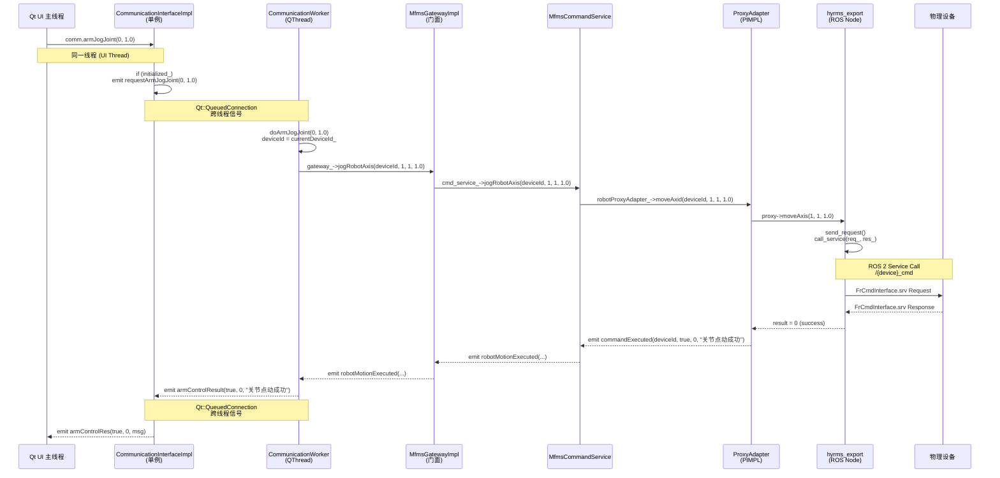
```mermaid
sequenceDiagram
    participant UI as Qt UI 主线程
    participant Impl as CommunicationInterfaceImpl<br/>(单例)
    participant Worker as CommunicationWorker<br/>(QThread)
    participant GW as MfmsGatewayImpl<br/>(门面)
    participant CMD as MfmsCommandService
    participant Proxy as ProxyAdapter<br/>(PIMPL)
    participant Export as hyrms_export<br/>(ROS Node)
    participant Device as 物理设备

    UI->>Impl: comm.armJogJoint(0, 1.0)
    Note over UI,Impl: 同一线程 (UI Thread)

    Impl->>Impl: if (initialized_)<br/>emit requestArmJogJoint(0, 1.0)
    Note over Impl,Worker: Qt::QueuedConnection<br/>跨线程信号

    Worker->>Worker: doArmJogJoint(0, 1.0)<br/>deviceId = currentDeviceId_
    Worker->>GW: gateway_->jogRobotAxis(deviceId, 1, 1, 1.0)
    GW->>CMD: cmd_service_->jogRobotAxis(deviceId, 1, 1, 1.0)
    CMD->>Proxy: robotProxyAdapter_->moveAxid(deviceId, 1, 1, 1.0)
    Proxy->>Export: proxy->moveAxis(1, 1, 1.0)
    Export->>Export: send_request()<br/>call_service(req_, res_)
    Note over Export,Device: ROS 2 Service Call<br/>/{device}_cmd
    Export->>Device: FrCmdInterface.srv Request

    Device-->>Export: FrCmdInterface.srv Response
    Export-->>Proxy: result = 0 (success)
    Proxy-->>CMD: emit commandExecuted(deviceId, true, 0, "关节点动成功")
    CMD-->>GW: emit robotMotionExecuted(...)
    GW-->>Worker: emit robotMotionExecuted(...)
    Worker-->>Impl: emit armControlResult(true, 0, "关节点动成功")
    Note over Worker,Impl: Qt::QueuedConnection<br/>跨线程信号
    Impl-->>UI: emit armControlRes(true, 0, msg)
```

### 3.2 上行状态流 (物理设备 → UI)

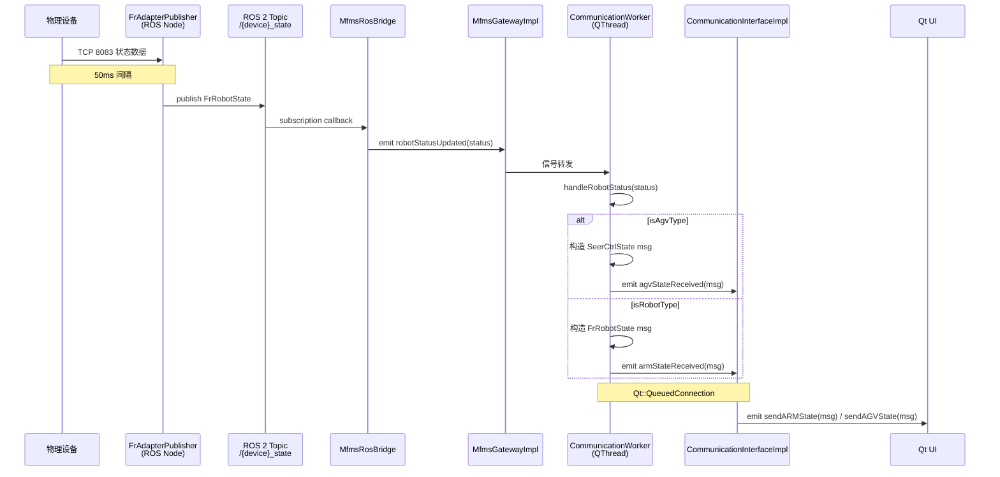
```mermaid
sequenceDiagram
    participant Device as 物理设备
    participant Adapter as FrAdapterPublisher<br/>(ROS Node)
    participant ROS as ROS 2 Topic<br/>/{device}_state
    participant Bridge as MfmsRosBridge
    participant GW as MfmsGatewayImpl
    participant Worker as CommunicationWorker<br/>(QThread)
    participant Impl as CommunicationInterfaceImpl
    participant UI as Qt UI

    Device->>Adapter: TCP 8083 状态数据
    Note over Device,Adapter: 50ms 间隔
    Adapter->>ROS: publish FrRobotState

    ROS->>Bridge: subscription callback
    Bridge->>GW: emit robotStatusUpdated(status)
    GW->>Worker: 信号转发

    Worker->>Worker: handleRobotStatus(status)
    alt isAgvType
        Worker->>Worker: 构造 SeerCtrlState msg
        Worker->>Impl: emit agvStateReceived(msg)
    else isRobotType
        Worker->>Worker: 构造 FrRobotState msg
        Worker->>Impl: emit armStateReceived(msg)
    end

    Note over Worker,Impl: Qt::QueuedConnection
    Impl->>UI: emit sendARMState(msg) / sendAGVState(msg)
```

### 3.3 数据库事件流 (上下位机通信)

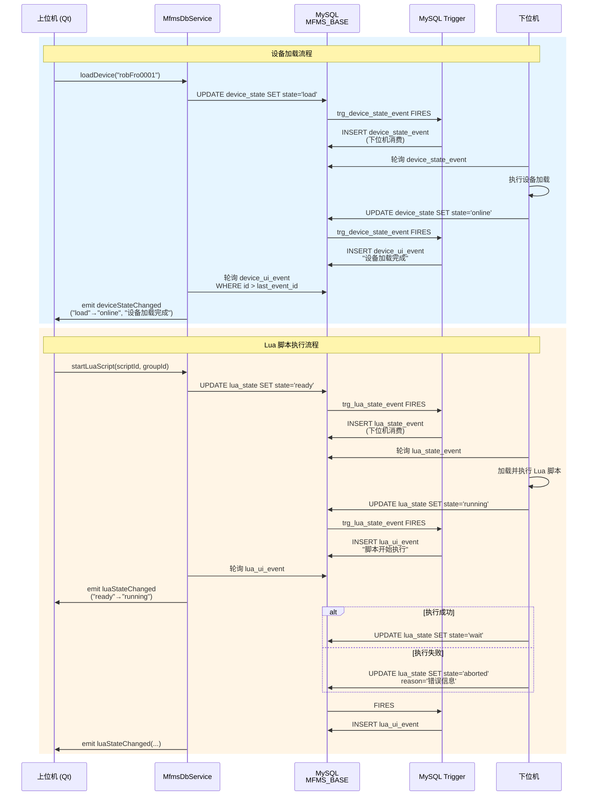
```mermaid
sequenceDiagram
    participant UI as 上位机 (Qt)
    participant DbSvc as MfmsDbService
    participant DB as MySQL<br/>MFMS_BASE
    participant Trigger as MySQL Trigger
    participant Lower as 下位机

    rect rgb(230, 245, 255)
    Note over UI,Lower: 设备加载流程
    UI->>DbSvc: loadDevice("robFro0001")
    DbSvc->>DB: UPDATE device_state SET state='load'
    DB->>Trigger: trg_device_state_event FIRES
    Trigger->>DB: INSERT device_state_event<br/>(下位机消费)

    Lower->>DB: 轮询 device_state_event
    Lower->>Lower: 执行设备加载
    Lower->>DB: UPDATE device_state SET state='online'
    DB->>Trigger: trg_device_state_event FIRES
    Trigger->>DB: INSERT device_ui_event<br/>"设备加载完成"

    DbSvc->>DB: 轮询 device_ui_event<br/>WHERE id > last_event_id
    DbSvc->>UI: emit deviceStateChanged<br/>("load"→"online", "设备加载完成")
    end

    rect rgb(255, 245, 230)
    Note over UI,Lower: Lua 脚本执行流程
    UI->>DbSvc: startLuaScript(scriptId, groupId)
    DbSvc->>DB: UPDATE lua_state SET state='ready'
    DB->>Trigger: trg_lua_state_event FIRES
    Trigger->>DB: INSERT lua_state_event<br/>(下位机消费)

    Lower->>DB: 轮询 lua_state_event
    Lower->>Lower: 加载并执行 Lua 脚本
    Lower->>DB: UPDATE lua_state SET state='running'
    DB->>Trigger: trg_lua_state_event FIRES
    Trigger->>DB: INSERT lua_ui_event<br/>"脚本开始执行"

    DbSvc->>DB: 轮询 lua_ui_event
    DbSvc->>UI: emit luaStateChanged<br/>("ready"→"running")

    alt 执行成功
        Lower->>DB: UPDATE lua_state SET state='wait'
    else 执行失败
        Lower->>DB: UPDATE lua_state SET state='aborted'<br/>reason='错误信息'
    end

    DB->>Trigger: FIRES
    Trigger->>DB: INSERT lua_ui_event
    DbSvc->>UI: emit luaStateChanged(...)
    end
```

### 3.4 线程全景图

```mermaid
graph TD
    subgraph "Qt UI 主线程"
        UI[hybrid_robot_system / Control / ...]
        Impl["CommunicationInterfaceImpl<br/>getInstance() 单例"]
    end

    subgraph "Communication Thread (QThread)"
        Worker[CommunicationWorker]
        GW[MfmsGatewayImpl]
        DB[MfmsDbService]
        Bridge[MfmsRosBridge]
        CMD[MfmsCommandService]
    end

    subgraph "RobotProxy Executor Thread"
        RExec["MultiThreadedExecutor<br/>spin_some(10ms)"]
        FrProxy["RobotProxy::FrRobot<br/>(rclcpp::Node)"]
    end

    subgraph "AgvProxy Executor Thread"
        AExec["MultiThreadedExecutor<br/>spin_some(10ms)"]
        AgvProxy["AgvProxy::SeerCtrl<br/>(rclcpp::Node)"]
    end

    subgraph "ROS 2 Network"
        Topic["/{device}_state Topic"]
        Service["/{device}_cmd Service"]
    end

    UI <-->|"Qt::QueuedConnection"| Impl
    Impl <-->|"emit requestXxx / resultXxx"| Worker
    Worker --> GW
    GW --> DB
    GW --> Bridge
    GW --> CMD
    CMD --> RExec
    CMD --> AExec
    RExec --> FrProxy
    AExec --> AgvProxy
    FrProxy <--> Service
    AgvProxy <--> Service
    Bridge <-- Topic
    DB <-->|"轮询 *_ui_event"| MySQL[(MySQL)]

    style UI fill:#E8F5E9,stroke:#4CAF50
    style Impl fill:#E3F2FD,stroke:#1976D2
    style Worker fill:#E3F2FD,stroke:#1976D2
    style GW fill:#FFF3E0,stroke:#F57C00
    style DB fill:#F3E5F5,stroke:#7B1FA2
    style Bridge fill:#F3E5F5,stroke:#7B1FA2
    style CMD fill:#F3E5F5,stroke:#7B1FA2
    style FrProxy fill:#FFEBEE,stroke:#C62828
    style AgvProxy fill:#FFEBEE,stroke:#C62828
    style MySQL fill:#FFF9C4,stroke:#F9A825
```

---

## 4. CommunicationInterface 通信链分析

### 4.1 接口层级调用链

每个 `CommunicationInterface` 公开接口的完整调用链如下：

#### 设备列表刷新

```
refreshRobotList()
  → CommunicationInterfaceImpl::refreshRobotList()
    → emit requestRefreshRobotList()                    [跨线程]
      → CommunicationWorker::doRefreshRobotList()
        → MfmsGatewayImpl::refreshDeviceList()
          → MfmsRosBridge::refreshDeviceList()
            → DB 查询 device_state JOIN device
              → emit deviceListUpdated(devices)
                → CommunicationWorker::emitRobotList()
                  → emit robotListUpdated(names)        [跨线程]
                    → CommunicationInterface::getRobotList(names)
```

#### 设备连接（状态机驱动）

```
connectRobot(name)
  → CommunicationInterfaceImpl::connectRobot(name)
    → emit requestConnectRobot(name)                    [跨线程]
      → CommunicationWorker::doConnectRobot(name)
        → resolveDeviceId(name)                         // 名字→设备ID
        → currentDeviceId_ = deviceId

        Case 1: AGV 设备 (online/connected)
          → gateway_->connectAgv(deviceId)
            → MfmsCommandService::connectAgv()
              → AgvProxyAdapter::connectAgv()
                → SeerCtrl::connect()                   // hyrms_export
            → robotConnected 信号
              → subscribeDeviceById()
                → subscribeResult → connectionResult

        Case 2: Robot (connected)
          → gateway_->connectRobot(deviceId)
            → MfmsCommandService::connectRobot()
              → RobotProxyAdapter::connectRobot()
                → FrRobot::connect()                    // hyrms_export
            → robotConnected → subscribe → connectionResult

        Case 3: Robot (online) — 等待下位机 TCP
          → connectingDeviceId_ = deviceId
          → 等待 handleDeviceStateTransition(→ connected)
            → gateway_->connectRobot(deviceId)

        Case 4: Robot (offline) — 走完整状态机
          → gateway_->loadDevice(deviceId)              // DB: state='load'
          → 等待 device_ui_event: load → online
          → 等待 device_ui_event: online → connected
          → gateway_->connectRobot(deviceId)
```

#### 机械臂关节点动

```
armJogJoint(number, jog_step_)
  → emit requestArmJogJoint(number, jog_step_)         [跨线程]
    → CommunicationWorker::doArmJogJoint(jointNum, step)
      → gateway_->jogRobotAxis(deviceId, jointNum+1, direction, abs(step))
        → MfmsCommandService::jogRobotAxis(deviceId, axisId, direction, step)
          → RobotProxyAdapter::moveAxid(deviceId, axisId, direction, step)
            → FrRobot::moveAxis(axisId, direction, step)
              → send_request() → ROS Service /{device}_cmd
```

#### AGV 站点导航

```
exeToStation(stationName)
  → emit requestExeToStation(stationName)               [跨线程]
    → CommunicationWorker::doExeToStation(stationName)
      → gateway_->executeAgvToStation(deviceId, stationName)
        → MfmsCommandService::executeAgvToStation(deviceId, stationName)
          → AgvProxyAdapter::navigateToStation(deviceId, station)
            → SeerCtrl::guideGoTarget(station)
              → send_request() → ROS Service /{device}_cmd
```

#### AGV 路径资源管理

```
getPaths()
  → emit requestGetPaths()                              [跨线程]
    → CommunicationWorker::doGetPaths()
      → resolveCurrentAgvDeviceId()                     // 必须当前已选中 AGV
      → gateway_->queryAgvPaths(deviceId)
        → MfmsCommandService::queryAgvPaths(deviceId)
          → DB 查询 agv_path WHERE device_id = ?
            → emit agvPathsReceived(deviceId, pathNames)

exeToPath(pathName)
  → emit requestExeToPath(pathName)                     [跨线程]
    → CommunicationWorker::doExeToPath(pathName)
      → gateway_->executeAgvToPath(deviceId, pathName)
        → MfmsCommandService::executeAgvToPath(deviceId, pathName)
          → DB 查询 agv_path + agv_path_station → station_list
          → 复用 executeAgvToStationList(deviceId, station_list)
            → AgvProxyAdapter::navigateToStationList()
              → SeerCtrl::guideGoTargetList(station_list)

addPath(pathName, stationList)
  → emit requestAddPath(pathName, stationList)          [跨线程]
    → CommunicationWorker::doAddPath(pathName, stationList)
      → gateway_->addAgvPath(deviceId, pathName, stationList)
        → MfmsCommandService::addAgvPath(deviceId, pathName, stationList)
          → DB 事务: INSERT agv_path + INSERT agv_path_station
```

#### AGV 多站导航

```
exeToStationList(stationList)
  → emit requestExeToStationList(stationList)            [跨线程]
    → CommunicationWorker::doExeToStationList(stations)
      → resolveCurrentAgvDeviceId()                      // 必须当前已选中 AGV
      → gateway_->executeAgvToStationList(deviceId, stations)
        → MfmsCommandService::executeAgvToStationList(deviceId, stations)
          → dispatchAgvStationListNavigation(deviceId, stations)
            → AgvProxyAdapter::navigateToStationList(deviceId, stations)
              → SeerCtrl::guideGoTargetList(stations)
                → send_request() → ROS Service /{device}_cmd
```

#### AGV 导航控制 (暂停/继续/取消/查询状态)

```
pauseNavigation()
  → emit requestPauseNavigation()                        [跨线程]
    → CommunicationWorker::doPauseNavigation()
      → gateway_->pauseAgvNavigation(currentDeviceId_)
        → MfmsCommandService::pauseAgvNavigation(deviceId)
          → AgvProxyAdapter::pauseNavigation(deviceId)
            → SeerCtrl::guidePause()

resumeNavigation()
  → emit requestResumeNavigation()                       [跨线程]
    → CommunicationWorker::doResumeNavigation()
      → gateway_->resumeAgvNavigation(deviceId)
        → MfmsCommandService::resumeAgvNavigation()
          → AgvProxyAdapter::resumeNavigation()
            → SeerCtrl::guideContinue()

cancelNavigation()
  → emit requestCancelNavigation()                       [跨线程]
    → CommunicationWorker::doCancelNavigation()
      → gateway_->cancelAgvNavigation(deviceId)
        → MfmsCommandService::cancelAgvNavigation()
          → AgvProxyAdapter::cancelNavigation()
            → SeerCtrl::guideCancel()

queryNavigationStatus()
  → emit requestQueryNavigationStatus()                  [跨线程]
    → CommunicationWorker::doQueryNavigationStatus()
      → gateway_->queryAgvNavigationStatus(deviceId)
        → MfmsCommandService::queryAgvNavigationStatus()
          → AgvProxyAdapter::queryNavigationStatus()
            → SeerCtrl::checkGuide()
              → emit navigationStatusReceived(deviceId, taskStatus, taskType, targetStation)
                → CommunicationInterface::navigationStatusUpdated(taskStatus, taskType, targetStation)
```

#### 设备断开

```
disconnectRobot()
  → emit requestDisconnectRobot()                        [跨线程]
    → CommunicationWorker::doDisconnectRobot()
      → gateway_->unsubscribe()                          // 先取消 Topic 订阅
      → if isCurrentDeviceAgv():
          gateway_->disconnectAgv(currentDeviceId_)
            → MfmsCommandService::disconnectAgv()
              → AgvProxyAdapter::disconnectAgv()
                → SeerCtrl::disconnect()
        else:
          gateway_->disconnectRobot(currentDeviceId_)
            → MfmsCommandService::disconnectRobot()
              → RobotProxyAdapter::disconnectRobot()
                → FrRobot::disconnect()
```

#### 机械臂笛卡尔点动

```
armJogCartesian(number, jog_step_)
  → emit requestArmJogCartesian(number, jog_step_)       [跨线程]
    → CommunicationWorker::doArmJogCartesian(axis, step)
      → gateway_->jogRobotCartesian(deviceId, axis, direction, abs(step))
        → MfmsCommandService::jogRobotCartesian(deviceId, axis, direction, step)
          → RobotProxyAdapter::getDescPose(deviceId, currentPos)    // 先读当前位置
          → 计算 targetPos: currentPos[axis] += direction * step
          → RobotProxyAdapter::moveL(deviceId, targetPos, DESC)     // 走直线运动
            → FrRobot::moveL(targetPos, DESC_COORD)
              → send_request() → ROS Service /{device}_cmd
```

> **注意**: 笛卡尔点动不是下位机原生增量 jog，而是"先读当前位置 → 算目标点 → 走直线运动"。

#### 机械臂模式切换

```
armChangeMode(mode)
  → emit requestArmChangeMode(mode)                      [跨线程]
    → CommunicationWorker::doArmChangeMode(mode)
      → gateway_->setRobotMode(deviceId, mode)
        → MfmsCommandService::setRobotMode(deviceId, mode)
          → RobotProxyAdapter::setMode(deviceId, mode)
            → FrRobot::setMode(mode)
              → send_request() → ROS Service /{device}_cmd
```

> **⚠️ 已知风险**: `CommunicationInterface.h` 注释定义 `0=自动, 1=手动, 2=手动2, 3=外部, 4=拖动`，但 `RobotProxyAdapter` 和 Fairino SDK 底层定义 `0=手动, 1=自动, 2=手动2, 3=外部, 4=拖动`。**0 和 1 的语义相互交换**。当前代码将 mode 值原样透传，不做映射。实际运行结果取决于底层 SDK 的数值解释。

#### 请求状态刷新

```
refreshState()
  → emit requestRefreshState()                           [跨线程]
    → CommunicationWorker::doRequestState()
      → gateway_->requestState(deviceId)
        → MfmsGatewayImpl::requestState(deviceId)
          → 仅记录日志，等待下一次周期性状态上报
```

> **注意**: 这不是主动拉取状态的接口。语义上更接近"记录前端希望尽快看到更新"，实际仍依赖底层设备周期性 Topic 上报（~50ms 间隔）。

### 4.2 AGV 手动控制接口

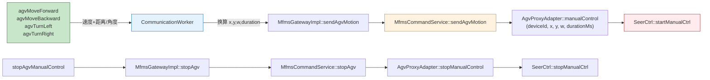
```mermaid
graph LR
    A["agvMoveForward<br/>agvMoveBackward<br/>agvTurnLeft<br/>agvTurnRight"] -->|"速度+距离/角度"| B["CommunicationWorker"]
    B -->|"换算 x,y,w,duration"| C["MfmsGatewayImpl::sendAgvMotion"]
    C --> D["MfmsCommandService::sendAgvMotion"]
    D --> E["AgvProxyAdapter::manualControl<br/>(deviceId, x, y, w, durationMs)"]
    E --> F["SeerCtrl::startManualCtrl"]

    G["stopAgvManualControl"] --> H["MfmsGatewayImpl::stopAgv"]
    H --> I["MfmsCommandService::stopAgv"]
    I --> J["AgvProxyAdapter::stopManualControl"]
    J --> K["SeerCtrl::stopManualCtrl"]

    style A fill:#C8E6C9,stroke:#2E7D32
    style B fill:#E3F2FD,stroke:#1976D2
    style D fill:#FFF3E0,stroke:#F57C00
    style F fill:#FFEBEE,stroke:#C62828
```

`SeerCtrlCmdInterface.srv` 包含 `manual_x/manual_y/manual_w/manual_duration` 字段，`hyrms_export::SeerCtrl` 提供 `startManualCtrl()` 和 `stopManualCtrl()`。UI 传入 `speed + distance` 或 `speed + angle`，中台 (`CommunicationWorker`) 负责换算成下位机需要的开环速度和持续时间，调用 `AgvProxyAdapter::manualControl(deviceId, x, y, w, durationMs)` 发送到下位机。停止手动控制通过 `AgvProxyAdapter::stopManualControl(deviceId)` 实现。

> **安全约束**: `manual_duration == 0` 表示持续执行直到下一条指令。`CommunicationWorker` 要求距离/角度必须大于 0，避免”定距/定角”接口误触发无限手动速度。停止手动控制需显式调用 `stopAgvManualControl()`。

### 4.3 CommunicationInterface.h 信号映射表 (2026-04-29 更新)

当前 `CommunicationInterface.h` 定义的完整信号/槽如下：

#### 上行信号 (UI 接收)

| 信号 | 参数类型 | 实际数据来源 | 备注 |
|:-----|:---------|:-----------|:-----|
| `getRobotList` | `QList<QString>` | `MfmsRosBridge` 查询 `device_state` | 返回设备 ID 列表，非展示名 |
| `connectResult` | `bool` | 连接状态机最终结果 | |
| `sendARMState` | `FrRobotState::SharedPtr` | ROS Topic `/{device}_state` | |
| `sendAGVState` | `SeerCtrlState::SharedPtr` | ROS Topic `/{device}_state` | 注意: 消息类型已更新为 `SeerCtrlState` |
| `agvControlRes` | `bool, int, QString` | `AgvProxyAdapter` 命令结果 | |
| `armControlRes` | `bool, int, QString` | `RobotProxyAdapter` 命令结果 | |
| `armChangeModeRes` | `bool, int, QString` | `RobotProxyAdapter::setMode` 结果 | |
| `navigationStatusUpdated` | `int, int, QString` | `AgvProxyAdapter::queryNavigationStatus` | taskStatus, taskType, targetStation |
| `returnStations` | `QList<QString>` | `SeerCtrl::checkStation` | |
| `returnExeToStationRes` | `bool` | 到站命令是否被接受 | |
| `returnPaths` | `QList<QString>` | DB 查询 `agv_path` | |
| `returnExeToPathRes` | `bool` | 路径执行命令是否被接受 | |
| `returnSinglePath` | `QList<QString>` | 保留但当前未使用 | |

#### 下行槽函数 (UI 调用)

| 槽函数 | 是否 virtual | 实现状态 | 备注 |
|:------|:---:|:----:|:-----|
| `refreshRobotList()` | virtual | ✅ | |
| `connectRobot(name)` | virtual | ✅ | |
| `disconnectRobot()` | virtual | ✅ | |
| `agvMoveForward/Backward/TurnLeft/TurnRight` | virtual | ✅ | 转换为 `AgvProxyAdapter::manualControl(deviceId, x, y, w, durationMs)` → `SeerCtrl::startManualCtrl()` |
| `stopAgvManualControl` | virtual | ✅ | 调用 `AgvProxyAdapter::stopManualControl()` → `SeerCtrl::stopManualCtrl()` |
| `armJogJoint(number, step)` | virtual | ✅ | |
| `armJogCartesian(number, step)` | virtual | ✅ | |
| `armChangeMode(mode)` | virtual | ✅ | 注释 `0-自动,1-手动,2-手动2,3-外部,4-拖动`，**但底层映射存在冲突** |
| `refreshState()` | virtual | ⚠️ | 被动刷新，仅等待下次周期上报 |
| `getStations()` | 非 virtual | ✅ | 基类辅助转发到 `CommunicationInterfaceImpl` |
| `exeToStation(stationName)` | 非 virtual | ✅ | 基类辅助转发 |
| `exeToStationList(stationList)` | virtual | ✅ | 多站序列导航 |
| `pauseNavigation()` | virtual | ✅ | |
| `resumeNavigation()` | virtual | ✅ | |
| `cancelNavigation()` | virtual | ✅ | |
| `queryNavigationStatus()` | virtual | ✅ | |
| `getPaths()` | 非 virtual | ✅ | 基类辅助转发 |
| `exeToPath(pathName)` | 非 virtual | ✅ | 基类辅助转发 |
| `addPath(pathName, stationList)` | virtual | ✅ | |
| `addPath(stationList)` | virtual | ❌ | 旧兼容接口，缺少 pathName，固定返回失败 |

> **非 virtual 接口说明**: `getStations()`, `exeToStation()`, `getPaths()`, `exeToPath()` 在基类 `CommunicationInterface.cpp` 中做了辅助转发：如果 `this` 的实际类型是 `CommunicationInterfaceImpl`，则 `dynamic_cast` 后调用实现类方法。

---

## 5. 数据库结构图 (Mermaid ER)

### 5.1 完整 ER 图

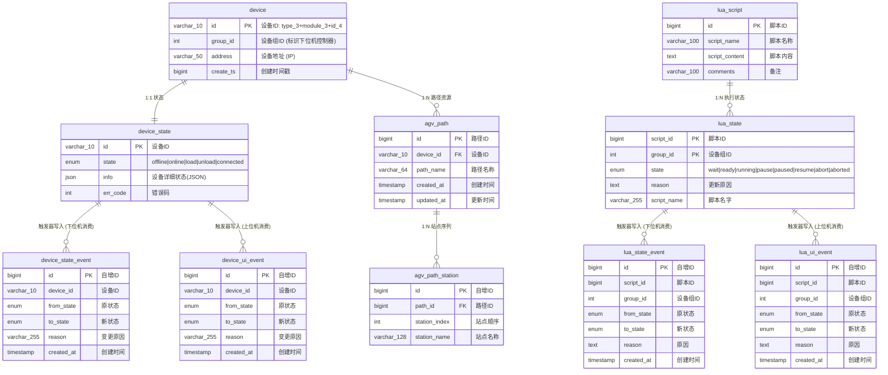
```mermaid
erDiagram
    device {
        varchar_10 id PK "设备ID: type_3+module_3+id_4"
        int group_id "设备组ID (标识下位机控制器)"
        varchar_50 address "设备地址 (IP)"
        bigint create_ts "创建时间戳"
    }

    device_state {
        varchar_10 id PK "设备ID"
        enum state "offline|online|load|unload|connected"
        json info "设备详细状态(JSON)"
        int err_code "错误码"
    }

    device_state_event {
        bigint id PK "自增ID"
        varchar_10 device_id "设备ID"
        enum from_state "原状态"
        enum to_state "新状态"
        varchar_255 reason "变更原因"
        timestamp created_at "创建时间"
    }

    device_ui_event {
        bigint id PK "自增ID"
        varchar_10 device_id "设备ID"
        enum from_state "原状态"
        enum to_state "新状态"
        varchar_255 reason "变更原因"
        timestamp created_at "创建时间"
    }

    lua_script {
        bigint id PK "脚本ID"
        varchar_100 script_name "脚本名称"
        text script_content "脚本内容"
        varchar_100 comments "备注"
    }

    lua_state {
        bigint script_id PK "脚本ID"
        int group_id PK "设备组ID"
        enum state "wait|ready|running|pause|paused|resume|abort|aborted"
        text reason "更新原因"
        varchar_255 script_name "脚本名字"
    }

    lua_state_event {
        bigint id PK "自增ID"
        bigint script_id "脚本ID"
        int group_id "设备组ID"
        enum from_state "原状态"
        enum to_state "新状态"
        text reason "原因"
        timestamp created_at "创建时间"
    }

    lua_ui_event {
        bigint id PK "自增ID"
        bigint script_id "脚本ID"
        int group_id "设备组ID"
        enum from_state "原状态"
        enum to_state "新状态"
        text reason "原因"
        timestamp created_at "创建时间"
    }

    agv_path {
        bigint id PK "路径ID"
        varchar_10 device_id FK "设备ID"
        varchar_64 path_name "路径名称"
        timestamp created_at "创建时间"
        timestamp updated_at "更新时间"
    }

    agv_path_station {
        bigint id PK "自增ID"
        bigint path_id FK "路径ID"
        int station_index "站点顺序"
        varchar_128 station_name "站点名称"
    }

    device ||--|| device_state : "1:1 状态"
    device ||--o{ agv_path : "1:N 路径资源"
    agv_path ||--o{ agv_path_station : "1:N 站点序列"
    lua_script ||--o{ lua_state : "1:N 执行状态"
    device_state ||--o{ device_state_event : "触发器写入 (下位机消费)"
    device_state ||--o{ device_ui_event : "触发器写入 (上位机消费)"
    lua_state ||--o{ lua_state_event : "触发器写入 (下位机消费)"
    lua_state ||--o{ lua_ui_event : "触发器写入 (上位机消费)"
```

### 5.2 设备ID命名规则

| 前缀 (type_3) | 含义 | module_3 示例 | 完整 ID 示例 |
|:-:|:-:|:-:|:-:|
| `rob` | Robot Arm | `Fro` (Fairino) | `robFro0001` |
| `rbt` | Robot | `Hsu` (华数) | `rbtHsu0001` |
| `agv` | AGV | `Src` (仙工/Seer) | `agvSrc0001` |
| `plc` | PLC | `Sie` (Siemens) | `plcSie0001` |
| `vit` | Virtual | `Dev` | `vitDev0001` |

### 5.3 触发器机制

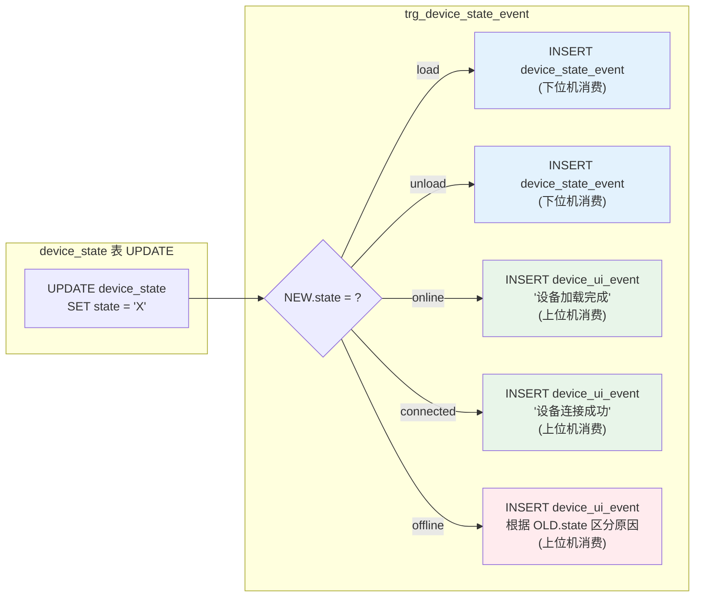
```mermaid
flowchart LR
    subgraph "device_state 表 UPDATE"
        DS["UPDATE device_state<br/>SET state = 'X'"]
    end

    subgraph "trg_device_state_event"
        T1{"NEW.state = ?"}
        T1 -->|"load"| E1["INSERT device_state_event<br/>(下位机消费)"]
        T1 -->|"unload"| E2["INSERT device_state_event<br/>(下位机消费)"]
        T1 -->|"online"| E3["INSERT device_ui_event<br/>'设备加载完成'<br/>(上位机消费)"]
        T1 -->|"connected"| E4["INSERT device_ui_event<br/>'设备连接成功'<br/>(上位机消费)"]
        T1 -->|"offline"| E5["INSERT device_ui_event<br/>根据 OLD.state 区分原因<br/>(上位机消费)"]
    end

    DS --> T1

    style E1 fill:#E3F2FD
    style E2 fill:#E3F2FD
    style E3 fill:#E8F5E9
    style E4 fill:#E8F5E9
    style E5 fill:#FFEBEE
```

#### Lua 脚本触发器 (`trg_lua_state_event`)

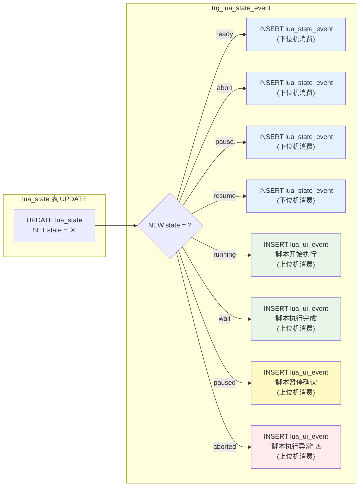
```mermaid
flowchart LR
    subgraph "lua_state 表 UPDATE"
        LS["UPDATE lua_state<br/>SET state = 'X'"]
    end

    subgraph "trg_lua_state_event"
        T2{"NEW.state = ?"}
        T2 -->|"ready"| L1["INSERT lua_state_event<br/>(下位机消费)"]
        T2 -->|"abort"| L2["INSERT lua_state_event<br/>(下位机消费)"]
        T2 -->|"pause"| L3["INSERT lua_state_event<br/>(下位机消费)"]
        T2 -->|"resume"| L4["INSERT lua_state_event<br/>(下位机消费)"]
        T2 -->|"running"| L5["INSERT lua_ui_event<br/>'脚本开始执行'<br/>(上位机消费)"]
        T2 -->|"wait"| L6["INSERT lua_ui_event<br/>'脚本执行完成'<br/>(上位机消费)"]
        T2 -->|"paused"| L7["INSERT lua_ui_event<br/>'脚本暂停确认'<br/>(上位机消费)"]
        T2 -->|"aborted"| L8["INSERT lua_ui_event<br/>'脚本执行异常' ⚠️<br/>(上位机消费)"]
    end

    LS --> T2

    style L1 fill:#E3F2FD
    style L2 fill:#E3F2FD
    style L3 fill:#E3F2FD
    style L4 fill:#E3F2FD
    style L5 fill:#E8F5E9
    style L6 fill:#E8F5E9
    style L7 fill:#FFF9C4
    style L8 fill:#FFEBEE
```

> **关键区分**: Lua 状态触发器把 8 个状态值分成两组：
> - **下位机消费** (`lua_state_event`): `ready`, `abort`, `pause`, `resume` — 这些是上位机发出的指令，需要下位机执行
> - **上位机消费** (`lua_ui_event`): `running`, `wait`, `paused`, `aborted` — 这些是下位机反馈的确认，需要上位机展示

### 5.4 agv_path 表的 Schema 差异

> **⚠️ 注意**: `agv_path` 和 `agv_path_station` 两张表在代码中被 `MfmsCommandService` 直接使用（路径查询、路径保存、路径执行），但**当前 `MFMS_BASE.sql` 导出文件中未包含这两张表的 DDL**。它们的建表语句仅存在于测试代码 (`tests/test_path_interfaces.cpp`) 中。生产部署时需要手动创建：
>
> ```sql
> CREATE TABLE agv_path (
>   id BIGINT NOT NULL AUTO_INCREMENT,
>   device_id VARCHAR(10) NOT NULL,
>   path_name VARCHAR(64) NOT NULL,
>   created_at TIMESTAMP DEFAULT CURRENT_TIMESTAMP,
>   updated_at TIMESTAMP DEFAULT CURRENT_TIMESTAMP ON UPDATE CURRENT_TIMESTAMP,
>   PRIMARY KEY (id),
>   UNIQUE KEY uk_device_path_name (device_id, path_name),
>   KEY idx_device_id (device_id)
> );
>
> CREATE TABLE agv_path_station (
>   id BIGINT NOT NULL AUTO_INCREMENT,
>   path_id BIGINT NOT NULL,
>   station_index INT NOT NULL,
>   station_name VARCHAR(128) NOT NULL,
>   PRIMARY KEY (id),
>   UNIQUE KEY uk_path_station_index (path_id, station_index),
>   KEY idx_path_id (path_id),
>   FOREIGN KEY (path_id) REFERENCES agv_path(id) ON DELETE CASCADE
> );
> ```

---

## 6. 上下位机数据库交互协议

### 6.1 设备状态机

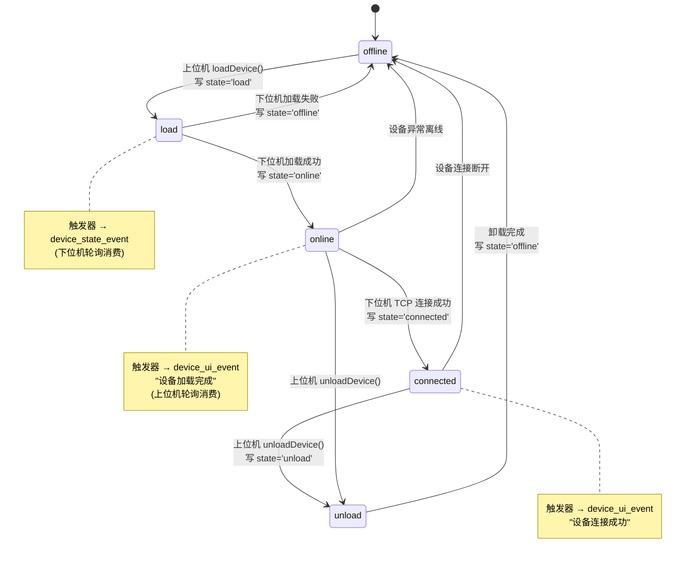
```mermaid
stateDiagram-v2
    [*] --> offline
    offline --> load : 上位机 loadDevice()<br/>写 state='load'
    load --> online : 下位机加载成功<br/>写 state='online'
    load --> offline : 下位机加载失败<br/>写 state='offline'
    online --> connected : 下位机 TCP 连接成功<br/>写 state='connected'
    online --> offline : 设备异常离线
    connected --> offline : 设备连接断开
    connected --> unload : 上位机 unloadDevice()<br/>写 state='unload'
    online --> unload : 上位机 unloadDevice()
    unload --> offline : 卸载完成<br/>写 state='offline'

    note right of load
        触发器 → device_state_event
        (下位机轮询消费)
    end note

    note right of online
        触发器 → device_ui_event
        "设备加载完成"
        (上位机轮询消费)
    end note

    note right of connected
        触发器 → device_ui_event
        "设备连接成功"
    end note
```

### 6.2 Lua 脚本状态机

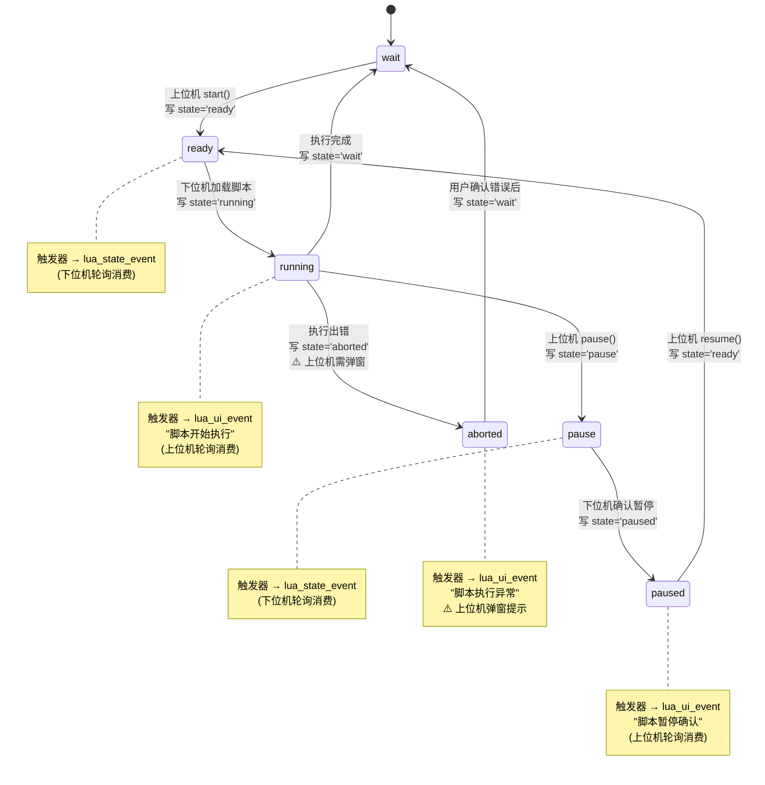
```mermaid
stateDiagram-v2
    [*] --> wait
    wait --> ready : 上位机 start()<br/>写 state='ready'
    ready --> running : 下位机加载脚本<br/>写 state='running'
    running --> wait : 执行完成<br/>写 state='wait'
    running --> aborted : 执行出错<br/>写 state='aborted'<br/>⚠️ 上位机需弹窗
    running --> pause : 上位机 pause()<br/>写 state='pause'
    pause --> paused : 下位机确认暂停<br/>写 state='paused'
    paused --> ready : 上位机 resume()<br/>写 state='ready'
    aborted --> wait : 用户确认错误后<br/>写 state='wait'

    note right of ready
        触发器 → lua_state_event
        (下位机轮询消费)
    end note

    note right of pause
        触发器 → lua_state_event
        (下位机轮询消费)
    end note

    note right of running
        触发器 → lua_ui_event
        "脚本开始执行"
        (上位机轮询消费)
    end note

    note right of paused
        触发器 → lua_ui_event
        "脚本暂停确认"
        (上位机轮询消费)
    end note

    note right of aborted
        触发器 → lua_ui_event
        "脚本执行异常"
        ⚠️ 上位机弹窗提示
    end note
```

> **8 状态模型说明**: Lua 状态枚举为 `wait | ready | running | pause | paused | resume | abort | aborted`。其中 `pause`/`abort`/`resume` 是上位机发出的**指令态**（写入 `lua_state_event` 供下位机消费），而 `paused`/`aborted` 是下位机反馈的**确认态**（写入 `lua_ui_event` 供上位机展示）。这种"指令-确认"分离设计保证了上下位机之间的状态一致性。

### 6.3 完整上下位机交互时序

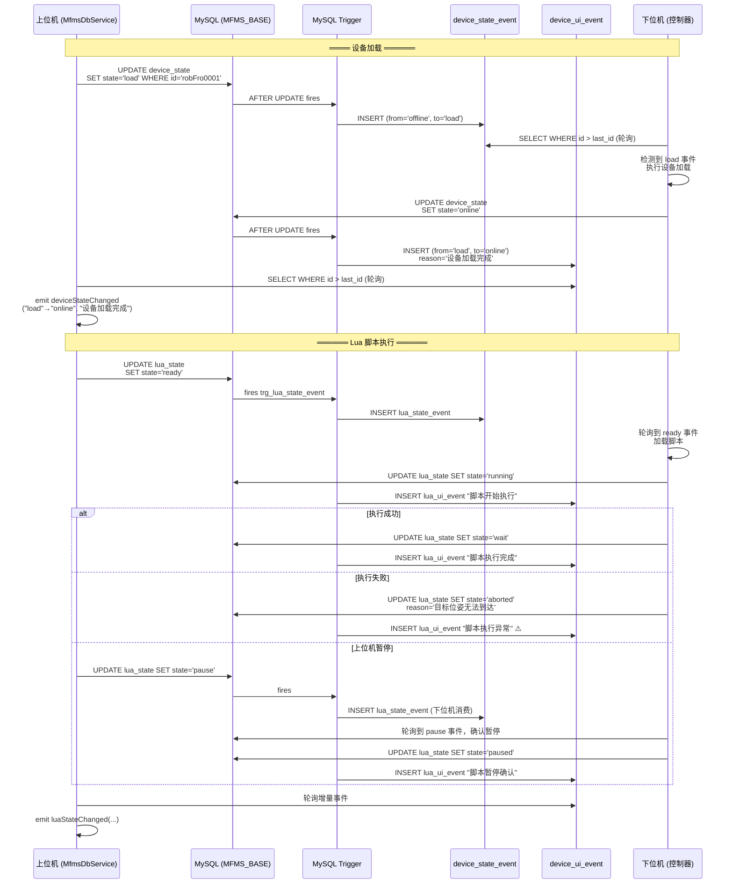
```mermaid
sequenceDiagram
    participant Host as 上位机 (MfmsDbService)
    participant DB as MySQL (MFMS_BASE)
    participant TRG as MySQL Trigger
    participant DEvt as device_state_event
    participant UEvt as device_ui_event
    participant Low as 下位机 (控制器)

    Note over Host,Low: ════ 设备加载 ══════

    Host->>DB: UPDATE device_state<br/>SET state='load' WHERE id='robFro0001'
    DB->>TRG: AFTER UPDATE fires
    TRG->>DEvt: INSERT (from='offline', to='load')

    Low->>DEvt: SELECT WHERE id > last_id (轮询)
    Low->>Low: 检测到 load 事件<br/>执行设备加载
    Low->>DB: UPDATE device_state<br/>SET state='online'
    DB->>TRG: AFTER UPDATE fires
    TRG->>UEvt: INSERT (from='load', to='online')<br/>reason='设备加载完成'

    Host->>UEvt: SELECT WHERE id > last_id (轮询)
    Host->>Host: emit deviceStateChanged<br/>("load"→"online", "设备加载完成")

    Note over Host,Low: ══════ Lua 脚本执行 ══════

    Host->>DB: UPDATE lua_state<br/>SET state='ready'
    DB->>TRG: fires trg_lua_state_event
    TRG->>DEvt: INSERT lua_state_event

    Low->>Low: 轮询到 ready 事件<br/>加载脚本
    Low->>DB: UPDATE lua_state SET state='running'
    TRG->>UEvt: INSERT lua_ui_event "脚本开始执行"

    alt 执行成功
        Low->>DB: UPDATE lua_state SET state='wait'
        TRG->>UEvt: INSERT lua_ui_event "脚本执行完成"
    else 执行失败
        Low->>DB: UPDATE lua_state SET state='aborted'<br/>reason='目标位姿无法到达'
        TRG->>UEvt: INSERT lua_ui_event "脚本执行异常" ⚠️
    else 上位机暂停
        Host->>DB: UPDATE lua_state SET state='pause'
        DB->>TRG: fires
        TRG->>DEvt: INSERT lua_state_event (下位机消费)
        Low->>DB: 轮询到 pause 事件，确认暂停
        Low->>DB: UPDATE lua_state SET state='paused'
        TRG->>UEvt: INSERT lua_ui_event "脚本暂停确认"
    end

    Host->>UEvt: 轮询增量事件
    Host->>Host: emit luaStateChanged(...)
```

---

## 7. 代理层 (hyrms_export) 调用链

### 7.1 代理层架构

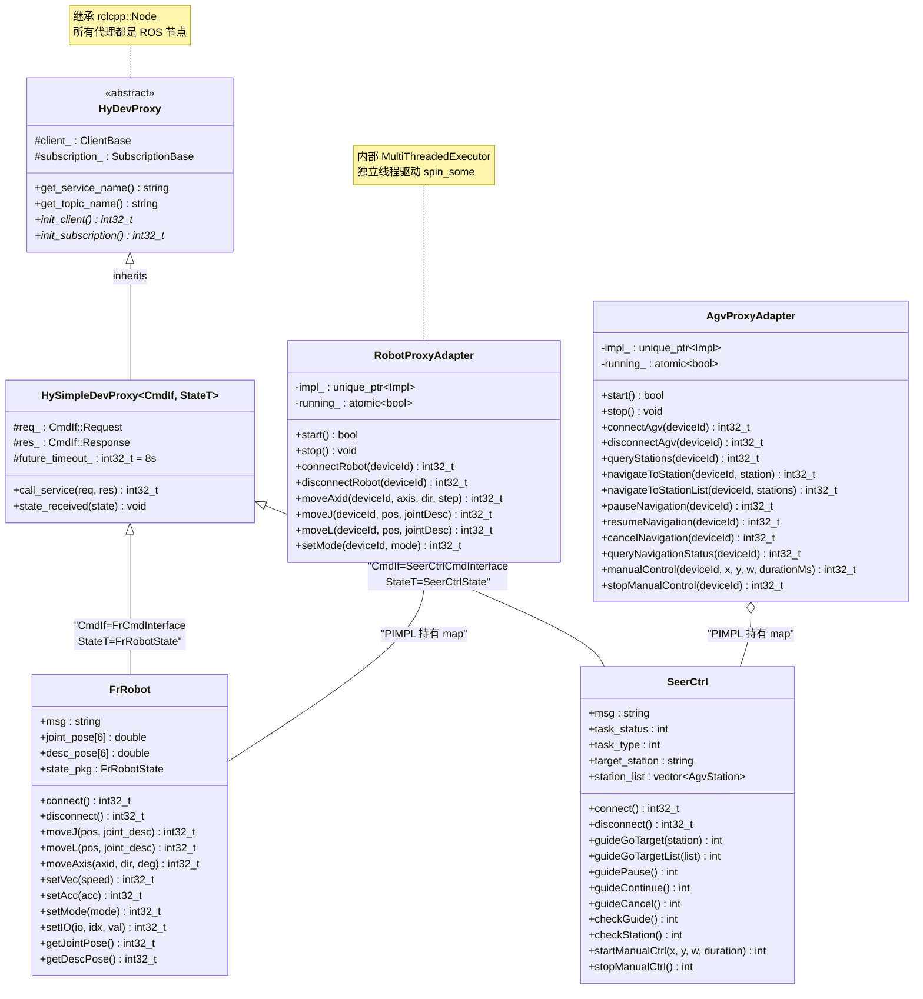
```mermaid
classDiagram
    class HyDevProxy {
        <<abstract>>
        #client_ : ClientBase
        #subscription_ : SubscriptionBase
        +get_service_name() string
        +get_topic_name() string
        +init_client()* int32_t
        +init_subscription()* int32_t
    }

    class HySimpleDevProxy~CmdIf, StateT~ {
        #req_ : CmdIf::Request
        #res_ : CmdIf::Response
        #future_timeout_ : int32_t = 8s
        +call_service(req, res) int32_t
        +state_received(state) void
    }

    class FrRobot {
        +msg : string
        +joint_pose[6] : double
        +desc_pose[6] : double
        +state_pkg : FrRobotState
        +connect() int32_t
        +disconnect() int32_t
        +moveJ(pos, joint_desc) int32_t
        +moveL(pos, joint_desc) int32_t
        +moveAxis(axid, dir, deg) int32_t
        +setVec(speed) int32_t
        +setAcc(acc) int32_t
        +setMode(mode) int32_t
        +setIO(io, idx, val) int32_t
        +getJointPose() int32_t
        +getDescPose() int32_t
    }

    class SeerCtrl {
        +msg : string
        +task_status : int
        +task_type : int
        +target_station : string
        +station_list : vector~AgvStation~
        +connect() int32_t
        +disconnect() int32_t
        +guideGoTarget(station) int
        +guideGoTargetList(list) int
        +guidePause() int
        +guideContinue() int
        +guideCancel() int
        +checkGuide() int
        +checkStation() int
        +startManualCtrl(x, y, w, duration) int
        +stopManualCtrl() int
    }

    class RobotProxyAdapter {
        -impl_ : unique_ptr~Impl~
        -running_ : atomic~bool~
        +start() bool
        +stop() void
        +connectRobot(deviceId) int32_t
        +disconnectRobot(deviceId) int32_t
        +moveAxid(deviceId, axis, dir, step) int32_t
        +moveJ(deviceId, pos, jointDesc) int32_t
        +moveL(deviceId, pos, jointDesc) int32_t
        +setMode(deviceId, mode) int32_t
    }

    class AgvProxyAdapter {
        -impl_ : unique_ptr~Impl~
        -running_ : atomic~bool~
        +start() bool
        +stop() void
        +connectAgv(deviceId) int32_t
        +disconnectAgv(deviceId) int32_t
        +queryStations(deviceId) int32_t
        +navigateToStation(deviceId, station) int32_t
        +navigateToStationList(deviceId, stations) int32_t
        +pauseNavigation(deviceId) int32_t
        +resumeNavigation(deviceId) int32_t
        +cancelNavigation(deviceId) int32_t
        +queryNavigationStatus(deviceId) int32_t
        +manualControl(deviceId, x, y, w, durationMs) int32_t
        +stopManualControl(deviceId) int32_t
    }

    HyDevProxy <|-- HySimpleDevProxy : inherits
    HySimpleDevProxy <|-- FrRobot : "CmdIf=FrCmdInterface<br/>StateT=FrRobotState"
    HySimpleDevProxy <|-- SeerCtrl : "CmdIf=SeerCtrlCmdInterface<br/>StateT=SeerCtrlState"
    RobotProxyAdapter o-- FrRobot : "PIMPL 持有 map<deviceId, FrRobot>"
    AgvProxyAdapter o-- SeerCtrl : "PIMPL 持有 map<deviceId, SeerCtrl>"

    note for HyDevProxy "继承 rclcpp::Node<br/>所有代理都是 ROS 节点"
    note for RobotProxyAdapter "内部 MultiThreadedExecutor<br/>独立线程驱动 spin_some"
```

### 7.2 FrRobot 命令下发详细流程

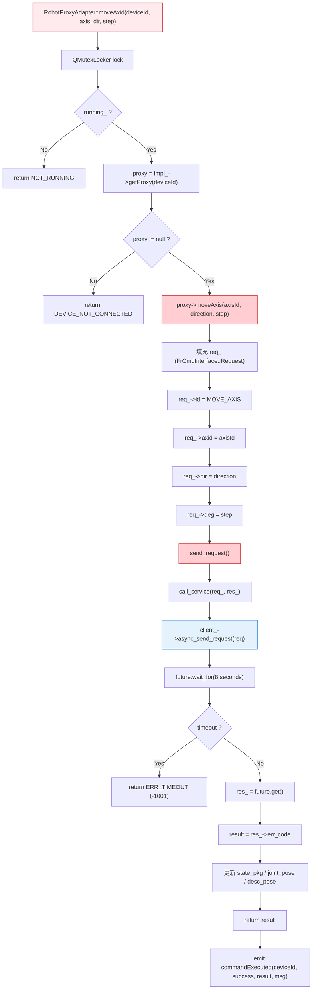
```mermaid
flowchart TB
    A["RobotProxyAdapter::moveAxid(deviceId, axis, dir, step)"] --> B["QMutexLocker lock"]
    B --> C{"running_ ?"}
    C -->|No| D["return NOT_RUNNING"]
    C -->|Yes| E["proxy = impl_->getProxy(deviceId)"]
    E --> F{"proxy != null ?"}
    F -->|No| G["return DEVICE_NOT_CONNECTED"]
    F -->|Yes| H["proxy->moveAxis(axisId, direction, step)"]

    H --> I["填充 req_ (FrCmdInterface::Request)"]
    I --> J["req_->id = MOVE_AXIS"]
    J --> K["req_->axid = axisId"]
    K --> L["req_->dir = direction"]
    L --> M["req_->deg = step"]
    M --> N["send_request()"]

    N --> O["call_service(req_, res_)"]
    O --> P["client_->async_send_request(req)"]
    P --> Q["future.wait_for(8 seconds)"]
    Q --> R{"timeout ?"}
    R -->|Yes| S["return ERR_TIMEOUT (-1001)"]
    R -->|No| T["res_ = future.get()"]
    T --> U["result = res_->err_code"]
    U --> V["更新 state_pkg / joint_pose / desc_pose"]

    V --> W["return result"]
    W --> X["emit commandExecuted(deviceId, success, result, msg)"]

    style A fill:#FFEBEE,stroke:#C62828
    style H fill:#FFCDD2,stroke:#C62828
    style N fill:#FFCDD2,stroke:#C62828
    style P fill:#E3F2FD,stroke:#1976D2
```

### 7.3 SeerCtrl 导航流程

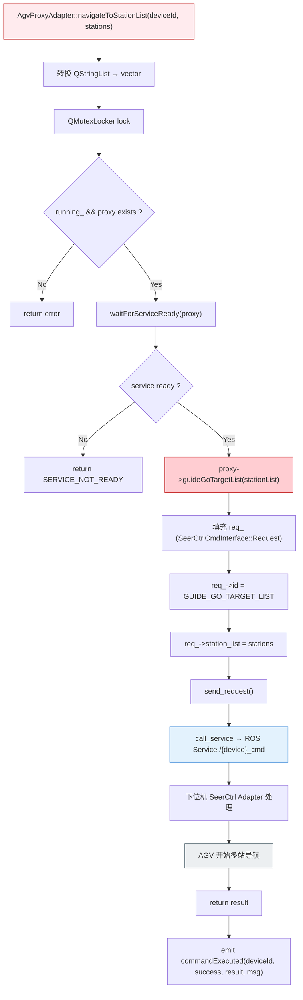
```mermaid
flowchart TB
    A["AgvProxyAdapter::navigateToStationList(deviceId, stations)"] --> B["转换 QStringList → vector<string>"]
    B --> C["QMutexLocker lock"]
    C --> D{"running_ && proxy exists ?"}
    D -->|No| E["return error"]
    D -->|Yes| F["waitForServiceReady(proxy)"]
    F --> G{"service ready ?"}
    G -->|No| H["return SERVICE_NOT_READY"]
    G -->|Yes| I["proxy->guideGoTargetList(stationList)"]

    I --> J["填充 req_ (SeerCtrlCmdInterface::Request)"]
    J --> K["req_->id = GUIDE_GO_TARGET_LIST"]
    K --> L["req_->station_list = stations"]
    L --> M["send_request()"]
    M --> N["call_service → ROS Service /{device}_cmd"]
    N --> O["下位机 SeerCtrl Adapter 处理"]
    O --> P["AGV 开始多站导航"]
    P --> Q["return result"]
    Q --> R["emit commandExecuted(deviceId, success, result, msg)"]

    style A fill:#FFEBEE,stroke:#C62828
    style I fill:#FFCDD2,stroke:#C62828
    style N fill:#E3F2FD,stroke:#1976D2
    style P fill:#ECEFF1,stroke:#455A64
```

### 7.4 代理层 ROS 服务接口

| 代理类 | ROS Service 名 | .srv 类型 | 关键请求字段 | 关键响应字段 |
|:------|:--------------|:---------|:-----------|:-----------|
| `FrRobot` | `/{device}_cmd` | `FrCmdInterface` | `id, position[6], axid, dir, deg, mode, speed, io_index, io_value` | `err_code, msg, jt_pos[6], tl_pos[6], register_val, io_val` |
| `SeerCtrl` | `/{device}_cmd` | `SeerCtrlCmdInterface` | `id, station, station_list[], manual_x, manual_y, manual_w, manual_duration` | `err_code, msg, task_status, task_type, target_station, station_list[]` |

### 7.5 代理层错误码

| 错误码 | 宏定义 | 含义 |
|:---:|:------|:-----|
| `0` | `ERR_DEV_PROXY_SEND_OK` | 成功 |
| `-1001` | `ERR_DEV_PROXY_SEND_TIMEOUT` | ROS Service 调用超时 (8s) |
| `-1002` | `ERR_DEV_PROXY_SEND_PARAM` | 参数错误 |
| `-1009` | `ERR_DEV_PROXY_SEND_OTHERS` | 其他错误 |
| `-1110` | `ERR_HYRMS_DEV_WARN` | 设备警告 |
| `-1120` | `ERR_HYRMS_DEV_ERROR` | 设备错误 |
| `-1130` | `ERR_HYRMS_DEV_EMERGENCY_STOP` | 急停 |
| `-1140` | `ERR_HYRMS_DEV_FATAL` | 致命错误 |
| `-1199` | `ERR_HYRMS_DEV_REG` | 设备未注册 |

---

## 8. 接口状态总表

### 8.1 接口可用性

| 接口 | 功能 | 状态 | 走 hyrms_export | 调用终点 |
|:-----|:-----|:----:|:----:|:---------|
| `refreshRobotList` | 刷新可选设备列表 | ✅ 可用 | ❌ | DB → MfmsRosBridge |
| `connectRobot` | 连接设备 | ✅ 可用 | ✅ | FrRobot::connect / SeerCtrl::connect |
| `disconnectRobot` | 断开设备 | ✅ 可用 | ✅ | FrRobot::disconnect / SeerCtrl::disconnect |
| `armJogJoint` | 机械臂关节点动 | ✅ 可用 | ✅ | FrRobot::moveAxis |
| `armJogCartesian` | 机械臂笛卡尔点动 | ✅ 可用 | ✅ | FrRobot::getDescPose → FrRobot::moveL |
| `armChangeMode` | 切换机械臂模式 | ⚠️ 可用 (有风险) | ✅ | FrRobot::setMode |
| `refreshState` | 请求状态刷新 | ⚠️ 被动 | ❌ | 等待 topic 下次上报 (~50ms) |
| `getStations` | 查询 AGV 站点 | ✅ 可用 | ✅ | SeerCtrl::checkStation |
| `exeToStation` | AGV 单站导航 | ✅ 可用 | ✅ | SeerCtrl::guideGoTarget |
| `exeToStationList` | AGV 多站导航 | ✅ 可用 | ✅ | SeerCtrl::guideGoTargetList |
| `pauseNavigation` | 暂停导航 | ✅ 可用 | ✅ | SeerCtrl::guidePause |
| `resumeNavigation` | 继续导航 | ✅ 可用 | ✅ | SeerCtrl::guideContinue |
| `cancelNavigation` | 取消导航 | ✅ 可用 | ✅ | SeerCtrl::guideCancel |
| `queryNavigationStatus` | 查询导航状态 | ✅ 可用 | ✅ | SeerCtrl::checkGuide |
| `getPaths` | 查询路径名列表 | ✅ 可用 | ❌ | DB 查询 agv_path |
| `exeToPath` | 执行命名路径 | ✅ 可用 | ✅ | DB → SeerCtrl::guideGoTargetList |
| `addPath` | 保存路径 | ✅ 可用 | ❌ | DB 写入 agv_path + agv_path_station |
| `addPath` (旧重载) | 保存路径 (无路径名) | ❌ 不可用 | — | 固定返回失败，缺少 pathName |
| `agvMoveForward` | AGV 前进 | ✅ 可用 | ✅ | AgvProxyAdapter::manualControl → SeerCtrl::startManualCtrl |
| `agvMoveBackward` | AGV 后退 | ✅ 可用 | ✅ | AgvProxyAdapter::manualControl → SeerCtrl::startManualCtrl |
| `agvTurnLeft` | AGV 左转 | ✅ 可用 | ✅ | AgvProxyAdapter::manualControl → SeerCtrl::startManualCtrl |
| `agvTurnRight` | AGV 右转 | ✅ 可用 | ✅ | AgvProxyAdapter::manualControl → SeerCtrl::startManualCtrl |
| `stopAgvManualControl` | 停止 AGV 手动控制 | ✅ 可用 | ✅ | AgvProxyAdapter::stopManualControl → SeerCtrl::stopManualCtrl |

### 8.2 已知风险与语义偏差

| 风险项 | 严重度 | 描述 |
|:------|:------:|:-----|
| `armChangeMode` 模式映射冲突 | **高** | `CommunicationInterface.h` 注释 `0=自动, 1=手动`；`RobotProxyAdapter`/Fairino SDK 实际 `0=手动, 1=自动`。mode 值原样透传无映射，**0/1 语义相互反转**。 |
| `refreshState` 非主动拉取 | 中 | 前端调用后仅记录日志，不会向下位机发起请求。状态更新依赖周期性 Topic (~50ms)。 |
| `armJogCartesian` 非原生增量 | 低 | 实现为"读当前位置 → 计算目标 → moveL"，非下位机原生增量 jog。高频调用可能因网络延迟导致位置偏差。 |
| `agv_path` 表缺失于 Schema | **高** | `MFMS_BASE.sql` 导出中不包含 `agv_path`/`agv_path_station` 两张表的 DDL。部署时必须手动创建（见 5.4 节）。 |
| AGV 手动控制持续时间 | 低 | `manual_duration == 0` 表示持续执行直到下一条指令。前进/后退距离和转向角度必须大于 0，停止需调用 `stopAgvManualControl()`。接口已对齐 `AgvProxyAdapter::manualControl/stopManualControl`。 |
| 返回设备 ID 非展示名 | 低 | `emitRobotList()` 返回的是设备 ID（如 `robFro0001`），不是用户友好的展示名。前端需自行映射。 |

### 8.3 cmd_service 错误码

| 错误码 | 常量名 | 含义 |
|:------:|:------|:-----|
| `0` | `SUCCESS` | 成功 |
| `3001` | `DB_CONNECTION_FAILED` | 数据库连接失败 |
| `3002` | `DB_QUERY_FAILED` | 数据库查询失败 |
| `3003` | `DEVICE_NOT_FOUND` | 设备未在列表中找到 |
| `3004` | `DEVICE_OFFLINE` | 设备不在线 |
| `3005` | `SERVICE_CALL_FAILED` | ROS Service 调用失败 |
| `3006` | `ROS_NODE_NULL` | ROS 节点为空 |
| `3007` | `UNSUPPORTED_DEVICE_TYPE` | 不支持的设备类型 |
| `3008` | `INVALID_PARAMETER` | 参数无效 |
| `3009` | `SERVICE_TIMEOUT` | 服务调用超时 |
| `3010` | `PATH_NOT_FOUND` | 路径不存在 |
| `3011` | `PATH_ALREADY_EXISTS` | 路径名已存在 (MySQL error 1062) |
| `3012` | `DB_TRANSACTION_FAILED` | 数据库事务失败 |
| `3013` | `PATH_HAS_NO_STATIONS` | 路径不包含站点 |

### 8.4 Proxy Adapter 错误码

| 错误码 | 模块 | 常量名 | 含义 |
|:------:|:----:|:------|:-----|
| `-2001` | Robot | `NOT_RUNNING` | 代理未启动 |
| `-2002` | Robot | `DEVICE_NOT_CONNECTED` | 设备未连接 |
| `-2003` | Robot | `PROXY_CREATE_FAILED` | 代理创建失败 |
| `-2004` | Robot | `CONNECT_FAILED` | 连接失败 |
| `-2005` | Robot | `EXECUTOR_ERROR` | 执行器错误 |
| `-2101` | AGV | `NOT_RUNNING` | 代理未启动 |
| `-2102` | AGV | `DEVICE_NOT_CONNECTED` | 设备未连接 |
| `-2103` | AGV | `PROXY_CREATE_FAILED` | 代理创建失败 |
| `-2104` | AGV | `CONNECT_FAILED` | 连接失败 |
| `-2105` | AGV | `EXECUTOR_ERROR` | 执行器错误 |
| `-2106` | AGV | `INVALID_PARAMETER` | 参数无效 |
| `-2107` | AGV | `SERVICE_NOT_READY` | ROS 服务未就绪 |

---

## 9. 关键源码索引

| 文件路径 | 职责 |
|:---------|:-----|
| `src/mfms_server/client_api/include/mfms_server/CommunicationInterface.h` | 纯虚 Qt 接口，定义 UI 侧信号/槽契约 |
| `src/mfms_server/client_api/include/mfms_server/CommunicationInterfaceImpl.h` | Meyers 单例实现，跨线程请求转发 |
| `src/mfms_server/client_api/src/CommunicationInterfaceImpl.cpp` | 单例初始化、Worker 创建、信号连接 |
| `src/mfms_server/client_api/src/CommunicationWorker.h` | Worker 头文件，定义独立线程接口 |
| `src/mfms_server/client_api/src/CommunicationWorker.cpp` | Worker 实现：ROS 初始化、设备管理、状态映射 |
| `src/mfms_server/gateway/include/mfms_server/MfmsGateway.h` | 门面抽象接口 |
| `src/mfms_server/gateway/include/mfms_server/MfmsGatewayImpl.h` | 门面实现头文件 |
| `src/mfms_server/gateway/src/MfmsGatewayImpl.cpp` | 门面实现：三大服务编排与信号转发 |
| `src/mfms_server/cmd_service/include/cmd_service/MfmsCommandService.h` | 命令服务接口 |
| `src/mfms_server/cmd_service/src/MfmsCommandService.cpp` | 命令服务实现 |
| `src/mfms_server/cmd_service/include/cmd_service/RobotProxyAdapter.h` | 机械臂代理适配器接口 (PIMPL) |
| `src/mfms_server/cmd_service/src/RobotProxyAdapter.cpp` | 机械臂代理适配器实现 |
| `src/mfms_server/cmd_service/include/cmd_service/AgvProxyAdapter.h` | AGV 代理适配器接口 (PIMPL) |
| `src/mfms_server/cmd_service/src/AgvProxyAdapter.cpp` | AGV 代理适配器实现 |
| `src/mfms_server/cmd_service/include/cmd_service/CommandTypes.h` | 命令/结果类型定义 (AgvMotionCommand, RobotMotionCommand, IOControlCommand, OnlineDeviceInfo, CommandResult) |
| `HyRMS_export_.../hyrms_export/include/dev/robot/robot.hpp` | FrRobot 代理类 (hyrms_export) |
| `HyRMS_export_.../hyrms_export/include/dev/agv/agv.hpp` | SeerCtrl 代理类 (hyrms_export) |
| `HyRMS_export_.../hyrms_export/include/dev/dev_proxy.hpp` | 代理基类 HyDevProxy + HySimpleDevProxy |
| `src/com_interfaces/srv/FrCmdInterface.srv` | 机械臂 ROS Service 定义 |
| `src/com_interfaces/srv/SeerCtrlCmdInterface.srv` | AGV ROS Service 定义 |
| `src/com_interfaces/msg/SeerCtrlState.msg` | AGV 状态消息 (已从 SeerAgvState 更名) |
| `src/mfms_server/MFMS_BASE.sql` | 数据库 Schema + Triggers (注意: 缺少 agv_path 表) |
| `src/mfms_server/tests/test_path_interfaces.cpp` | 路径管理接口测试 (含 agv_path 建表语句) |
| `src/mfms_server/tests/test_agv_manual_interface.cpp` | AGV 手动控制接口测试 |
| `src/mfms_server/tests/test_agv_station_flow.cpp` | AGV 站点导航流程测试 |
| `src/mfms_server/tools/simulated_lower_machine.cpp` | 模拟下位机工具 |

---

> **文档维护说明**: 本文档基于 `c64e2cb` 提交的代码更新 (2026-04-29)。当 `CommunicationInterface.h` 接口变更或新增设备类型时，应同步更新本文档。
>
> **2026-04-29 更新 (`0c01cdf` ~ `c64e2cb`)**:
> - AGV 手动控制接口恢复可用：移除 `[[deprecated]]` 标注，新增 `stopAgvManualControl()` 到 `CommunicationInterface.h` (4.2, 4.3, 8.1 节)
> - `AgvProxyAdapter` 新增 `manualControl()` 和 `stopManualControl()` 方法，完成 AGV 手动控制全链路对齐 (7.1 节)
> - `MfmsRosBridge` 移除 `HsRobotState` 订阅/转换逻辑，当前仅支持 `FrRobotState` 和 `SeerCtrlState` 两种消息类型
> - 新增测试: `test_agv_manual_interface`、`test_path_interfaces`，CMakeLists 新增 `dev_export` 依赖路径 (9 节)
> - 降低 AGV 手动控制持续时间风险等级 (8.2 节)
>
> **2026-04-23 更新 (`83138c0`)**:
> - 补充 cmd_service 完整调用链 (4.1 节新增: 多站导航、导航控制、设备断开、笛卡尔点动、模式切换、状态刷新)
> - 新增 CommunicationInterface.h 信号/槽完整映射表 (4.3 节)
> - 新增 Lua 触发器流程图 (5.3 节)
> - 标注 agv_path 表 Schema 缺失问题及建表语句 (5.4 节)
> - 完善 Lua 8 状态模型的指令-确认分离说明 (6.2 节)
> - 补充 Lua 暂停交互时序 (6.3 节)
> - 拆分接口状态总表为可用性/风险/错误码三部分 (8.1-8.4 节)
> - 完善源码索引 (9 节)
