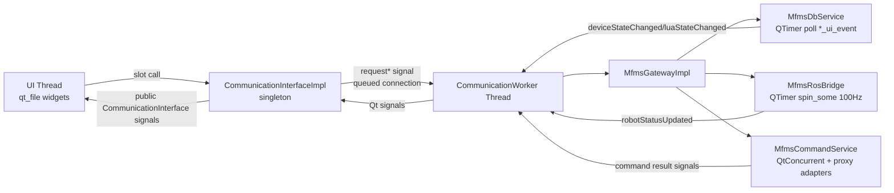
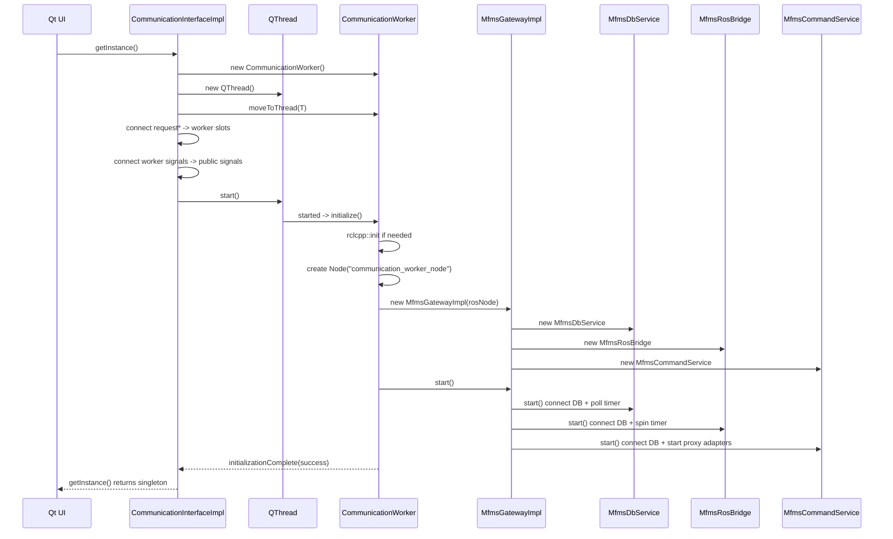
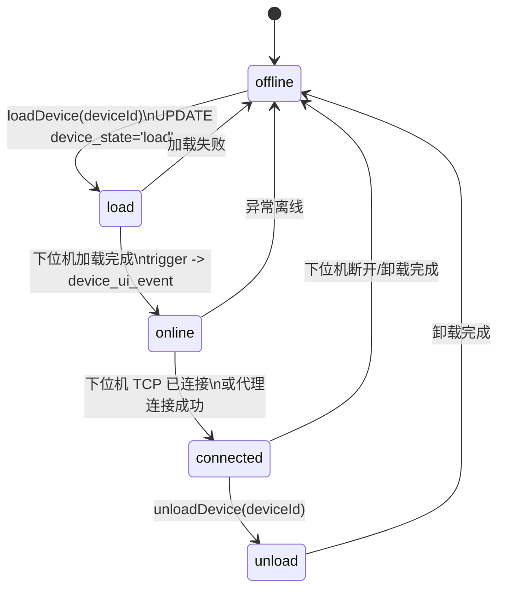
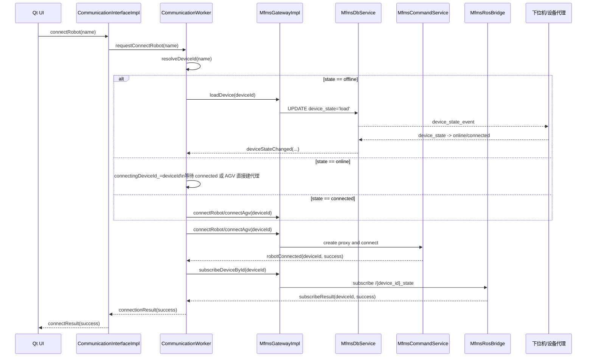
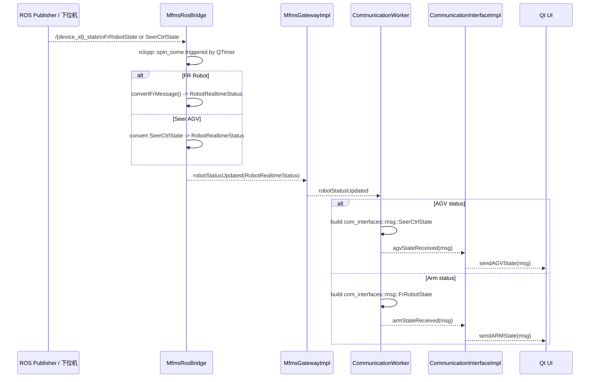
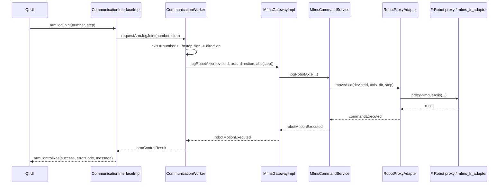
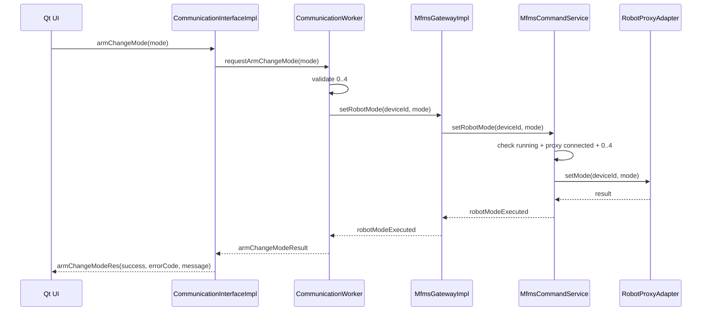
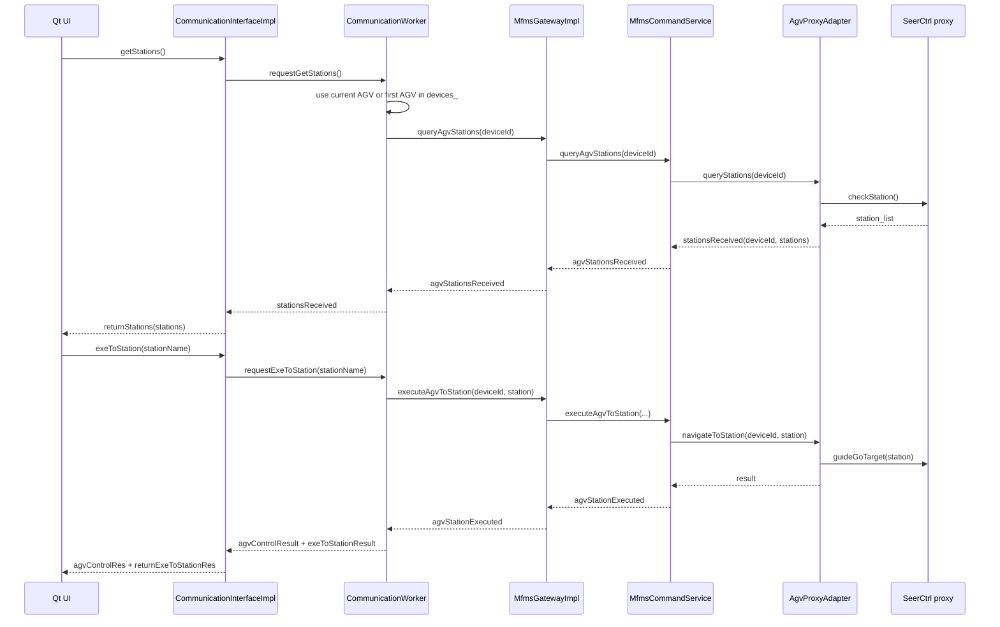
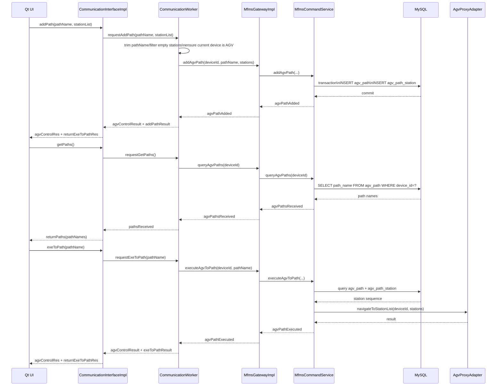
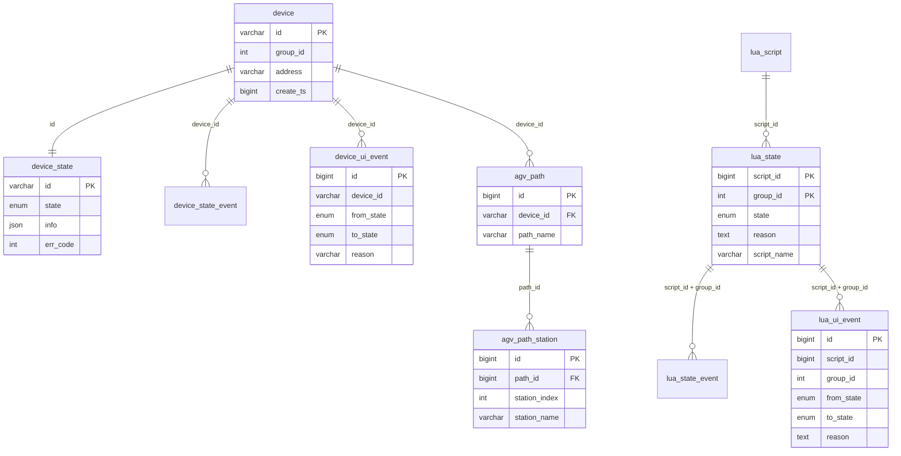

# MFMS 数据中台完整技术文档

本文面向开发交接，基于当前 `src/mfms_server`、`src/qt_file`、`src/com_interfaces` 的真实代码整理。这里的“数据中台”不是单一数据库，而是 `client_api + CommunicationWorker + gateway + db_service + ros_bridge + cmd_service + 设备代理` 组成的上位机通信中间层。

文档目标：

- 说明 `mfms_server` 的模块边界、链接关系和运行线程。
- 说明 Qt 前端如何通过 `CommunicationInterfaceImpl::getInstance()` 接入。
- 说明设备列表、连接、状态订阅、机械臂命令、AGV 站点/路径/导航命令的端到端链路。
- 说明数据库表、ROS Topic/Service、外部 SDK 和部署依赖。
- 标出当前限制，避免交接时把保留接口误认为完整能力。

## 1. 系统定位

`mfms_server` 位于 Qt 前端、MySQL、ROS 2、设备代理和下位机之间，负责把上位机 UI 的信号/槽调用转换为数据库状态变更、ROS 状态订阅和设备命令调用。

核心入口是：

- 前端头文件：`src/mfms_server/client_api/include/mfms_server/CommunicationInterface.h`
- 单例实现：`src/mfms_server/client_api/include/mfms_server/CommunicationInterfaceImpl.h`
- Worker 线程：`src/mfms_server/client_api/src/CommunicationWorker.cpp`
- Gateway 门面：`src/mfms_server/gateway/include/mfms_server/MfmsGateway.h`
- 三个服务：`MfmsDbService`、`MfmsRosBridge`、`MfmsCommandService`

整体架构如下。该图已外置为 SVG，避免 Obsidian 内嵌 SVG 样式解析异常。

![[图片/10.研一上学期/10_1_1.svg|1120]]

## 2. 包与库结构

`src/mfms_server/CMakeLists.txt` 将数据中台拆成五个共享库：

| 库 | 主要源码 | 职责 | 主要依赖 |
| --- | --- | --- | --- |
| `mfms_server_db` | `mfms_db/src/MfmsDbService.cpp` | 连接 MySQL，写 `device_state` / `lua_state`，轮询 UI 事件表 | `Qt5::Core`、`Qt5::Sql` |
| `mfms_server_ros_bridge` | `ros_bridge/src/MfmsRosBridge.cpp` | 查询设备列表，订阅设备 ROS 状态 Topic，转换为统一状态 | `rclcpp`、`com_interfaces`、`Qt5::Sql` |
| `mfms_server_cmd_service` | `cmd_service/src/MfmsCommandService.cpp`、`AgvProxyAdapter.cpp`、`RobotProxyAdapter.cpp` | 机械臂/AGV/IO 命令，路径表读写，设备代理管理 | `Qt5::Concurrent`、`com_interfaces`、`libhyrms_export.so`、`dev_export` |
| `mfms_server_gateway` | `gateway/src/MfmsGatewayImpl.cpp` | 统一门面，持有并转发三类服务 | `mfms_server_db`、`mfms_server_ros_bridge`、`mfms_server_cmd_service` |
| `mfms_server_client_api` | `client_api/src/CommunicationInterface*.cpp`、`CommunicationWorker.cpp` | 给前端暴露 Qt 单例接口，把请求放入 Worker 线程 | `mfms_server_gateway` |

安装导出的目标包括 `mfms_server::mfms_server_client_api`。`src/qt_file/CMakeLists.txt` 当前通过：

```cmake
find_package(mfms_server REQUIRED)

target_link_libraries(${PROJECT_NAME}
  mfms_server::mfms_server_client_api
  ...
)
```

完成前端接入。

## 3. 后端依赖边界

| 依赖 | 当前用途 | 边界说明 |
| --- | --- | --- |
| ROS 2 Humble / `rclcpp` | `CommunicationWorker` 创建 ROS Node；`MfmsRosBridge` 订阅状态；代理适配器运行 executor | `CommunicationWorker::shutdown()` 不调用 `rclcpp::shutdown()`，应用主流程负责 ROS 生命周期 |
| `com_interfaces` | 状态消息和命令服务类型 | 当前状态 Topic 使用 `FrRobotState`、`SeerCtrlState` |
| Qt5 | QObject、QThread、signals/slots、QTimer、QSqlDatabase、QtConcurrent | `mfms_server` 本身启用 `CMAKE_AUTOMOC` |
| MySQL / QMYSQL | `MFMS_BASE` 数据库访问 | 连接参数默认来自 `mfms_common/DbConfig.h`，可用环境变量覆盖 |
| `HyRMS_export_202601251449_bszydxh-HP/hyrms_export` | `libhyrms_export.so` 和头文件 | `mfms_server_cmd_service` 私有依赖 |
| `dev_export` | `dev/agv/agv.hpp`、`dev/robot/robot.hpp` 等代理头 | `RobotProxyAdapter` / `AgvProxyAdapter` 的底层能力来源 |
| `mfms_fr_adapter` | Fairino 机器人适配节点 | 与命令代理、状态 Topic 配合，但不是 `mfms_server` 库内部源码 |

默认数据库配置：

| 环境变量 | 默认值 |
| --- | --- |
| `MFMS_DB_HOST` | `127.0.0.1` |
| `MFMS_DB_PORT` | `3306` |
| `MFMS_DB_NAME` | `MFMS_BASE` |
| `MFMS_DB_USER` | `cyiwen` |
| `MFMS_DB_PASSWORD` | `123` |
| `MFMS_DB_POLL_INTERVAL_MS` | `100` |
| `MFMS_DB_CONNECT_TIMEOUT_MS` | `5000` |

## 4. 前端接入方式

前端不直接实例化 DB、ROS Bridge 或 Command Service。当前接入点是 `CommunicationInterfaceImpl` 单例：

```cpp
#include "mfms_server/CommunicationInterfaceImpl.h"

auto& comm = CommunicationInterfaceImpl::getInstance();
connect(&comm, &CommunicationInterface::getRobotList, this, &Widget::onRobotList);
connect(&comm, &CommunicationInterface::sendARMState, this, &Widget::onArmState);
connect(&comm, &CommunicationInterface::agvControlRes, this, &Widget::onAgvControlRes);

comm.refreshRobotList();
```

当前 `qt_file` 里已有使用点：

- `src/qt_file/src/hybrid_robot_system.cpp`
- `src/qt_file/src/Control.cpp`
- `src/qt_file/src/main.cpp` 在退出前调用 `CommunicationInterfaceImpl::getInstance().shutdown()`

`CommunicationInterface.h` 是前端契约，分为：

- 设备列表和连接：`refreshRobotList()`、`connectRobot()`、`disconnectRobot()`
- 状态回传：`sendARMState`、`sendAGVState`
- AGV 手动控制：`agvMoveForward()`、`agvMoveBackward()`、`agvTurnLeft()`、`agvTurnRight()`、`stopAgvManualControl()`
- 机械臂控制：`armJogJoint()`、`armJogCartesian()`、`armChangeMode()`、`refreshState()`
- AGV 站点/路径：`getStations()`、`exeToStation()`、`exeToStationList()`、`getPaths()`、`exeToPath()`、`addPath()`
- AGV 导航控制：`pauseNavigation()`、`resumeNavigation()`、`cancelNavigation()`、`queryNavigationStatus()`

注意：`returnSinglePath` 信号仍在接口里保留，但当前调用链没有实际发射路径。

## 5. 线程模型

前端 UI 线程只持有 `CommunicationInterfaceImpl`。第一次调用 `getInstance()` 时，单例创建 `CommunicationWorker` 和 `QThread`，把 Worker 移入通信线程。前端调用槽函数时，`CommunicationInterfaceImpl` 发射内部 `request*` 信号；Qt queued connection 把请求投递到 Worker 线程；Worker 通过 gateway 调用 DB、ROS、命令服务，再把结果信号回传给 UI。



运行线程要点：

- `CommunicationWorker::initialize()` 在 worker 线程中执行。
- Worker 内部创建 ROS 节点名 `communication_worker_node`。
- `MfmsRosBridge` 使用 `QTimer` 周期调用 `rclcpp::spin_some(rosNode_)`，默认 100Hz。
- `MfmsDbService` 使用 `QTimer` 轮询 `device_ui_event`、`lua_ui_event`，默认 100ms。
- `RobotProxyAdapter` 和 `AgvProxyAdapter` 各自维护 `MultiThreadedExecutor` 后台线程。
- AGV 命令通过 `QtConcurrent::run()` 异步调用底层代理，再用 `QMetaObject::invokeMethod(..., Qt::QueuedConnection)` 回到服务对象线程发信号。

## 6. 启动初始化时序



## 7. 设备列表刷新链路

```mermaid
sequenceDiagram
    participant UI as Qt UI
    participant API as CommunicationInterfaceImpl
    participant W as CommunicationWorker
    participant G as MfmsGatewayImpl
    participant RB as MfmsRosBridge
    participant DB as MySQL

    UI->>API: refreshRobotList()
    API->>W: requestRefreshRobotList()
    W->>G: refreshDeviceList()
    G->>RB: refreshDeviceList()
    RB->>DB: SELECT device_state LEFT JOIN device<br/>state IN offline/load/online/connected
    DB-->>RB: device rows + info JSON
    RB-->>G: deviceListUpdated(QList&lt;OnlineDevice&gt;)
    G-->>W: deviceListUpdated
    W->>W: cache devices_; filter FR/HS/SeerAGV
    W-->>API: robotListUpdated(QList&lt;QString&gt;)
    API-->>UI: getRobotList(QList&lt;QString&gt;)
```

列表显示当前使用设备 `id`，因为订阅和命令链路按 `device_id` 定位，例如 `/{device_id}_state`。

## 8. 连接设备状态机

`connectRobot(name)` 会先把 UI 传入的 name/id 解析为 `deviceId`，再根据 `device_state.state` 走不同路径。





AGV 的连接路径会走 `connectAgv()` / `AgvProxyAdapter`；机械臂走 `connectRobot()` / `RobotProxyAdapter`。`disconnectRobot()` 会先 `unsubscribe()`，再按当前设备类型断开对应代理。

## 9. ROS 状态上报链路



状态 Topic 命名由 `OnlineDevice::topicName()` 决定：优先使用 `id`，格式 `/{id}_state`。

## 10. 机械臂命令链路

### 10.1 关节点动



### 10.2 笛卡尔点动

`armJogCartesian(axis, step)` 会查询当前笛卡尔位姿 `getDescPose()`，修改单个轴后调用 `moveL()`。`axis` 范围为 `0..5`，对应 `X,Y,Z,RX,RY,RZ`。

### 10.3 模式切换



当前风险：`CommunicationInterface.h` 注释写 `0=自动,1=手动,2=手动2,3=外部,4=拖动`，而 `MfmsCommandService.cpp` 注释说明底层 `hyrms_export` 支持 `0-4: 手动/自动/手动2/外部/拖动`。代码当前对 mode 值原样透传，没有做 0/1 映射。前端接入时必须确认 UI 枚举与底层 SDK 枚举一致。

`refreshState()` 当前不会主动调用设备查询接口；`MfmsGatewayImpl::requestState()` 只记录日志，实际等待周期性状态 Topic 更新。

## 11. AGV 站点、路径和导航命令链路

### 11.1 站点查询与到点



`exeToStationList(QStringList)` 复用 `AgvProxyAdapter::navigateToStationList()`，底层为 `guideGoTargetList(stationList)`。

### 11.2 路径保存、查询与执行



当前路径接口限制：

- `addPath(const QList<QString>&)` 旧重载保留，但缺少 `pathName`，固定失败。
- `addPath(pathName, stationList)` 只过滤空站点名，不校验站点是否真实存在于 AGV 站点表。
- `returnSinglePath` 保留但当前调用链未实际使用。
- `agv_path` / `agv_path_station` 当前被代码直接使用，但不在 `MFMS_BASE.sql` 导出中；部署时需要单独建表，测试代码提供了当前期望 DDL。

### 11.3 导航暂停、恢复、取消和状态查询

| API | Gateway | Command Service | AgvProxyAdapter | 底层接口 |
| --- | --- | --- | --- | --- |
| `pauseNavigation()` | `pauseAgvNavigation(deviceId)` | `pauseAgvNavigation` | `pauseNavigation` | `guidePause()` |
| `resumeNavigation()` | `resumeAgvNavigation(deviceId)` | `resumeAgvNavigation` | `resumeNavigation` | `guideContinue()` |
| `cancelNavigation()` | `cancelAgvNavigation(deviceId)` | `cancelAgvNavigation` | `cancelNavigation` | `guideCancel()` |
| `queryNavigationStatus()` | `queryAgvNavigationStatus(deviceId)` | `queryAgvNavigationStatus` | `queryNavigationStatus` | `checkGuide()` |

`queryNavigationStatus()` 成功后发出 `navigationStatusUpdated(taskStatus, taskType, targetStation)`。

### 11.4 AGV 手动运动

`agvMoveForward` / `agvMoveBackward` / `agvTurnLeft` / `agvTurnRight` 构造 `AgvMotionCommand.params[0..5]` 后进入 `MfmsCommandService::sendAgvMotion()`，最终调用 `AgvProxyAdapter::manualControl()` 和底层 `startManualCtrl(x, y, w, durationMs)`。

当前需要标注限制：AGV 手动运动接口在上位机 API 和命令服务中存在，但底层能力受下位机协议和 `SeerCtrl` 代理实现限制。部署或演示前应以真实 AGV/下位机返回码验证，不应仅凭接口存在判断能力完整。

## 12. 数据库模型

### 12.1 关键表关系



### 12.2 设备状态表

`device` 保存设备基础信息：`id`、`group_id`、`address`、`create_ts`。

`device_state` 保存当前状态和 JSON 设备信息：

- `state`: `offline`、`online`、`load`、`unload`、`connected`
- `info`: 设备详细信息，代码会读取 `name`、`ip`、`module` 或 `type`
- `err_code`: 错误码

`MfmsRosBridge::refreshDeviceList()` 查询 `device_state` 联合 `device`，条件是：

```sql
WHERE ds.state IN ('offline', 'load', 'online', 'connected')
```

`MfmsCommandService::refreshOnlineDevices()` 查询在线命令设备，条件是：

```sql
WHERE ds.state IN ('online', 'connected')
```

### 12.3 设备事件表

`device_state_event` 面向下位机消费。上位机调用 `MfmsDbService::loadDevice()` 或 `unloadDevice()` 时，更新 `device_state`，触发器 `trg_device_state_event` 在 `state` 变成 `load` 或 `unload` 时插入事件。

`device_ui_event` 面向上位机消费。下位机把 `device_state` 更新为 `online`、`connected` 或 `offline` 时，触发器插入 UI 事件。`MfmsDbService` 轮询该表，发出 `deviceStateChanged(deviceId, fromState, toState, reason)`，随后删除已处理事件。

如果触发器缺失，`MfmsDbService` 会检测并对自身写入的状态变更插入 fallback event。

### 12.4 Lua 状态表

`lua_state` 的状态枚举是：

```text
wait, ready, running, pause, paused, resume, abort, aborted
```

`MfmsDbService` 当前行为：

- `startLuaScript()`：确保 `lua_state` 存在，然后写 `ready`
- `pauseLuaScript()`：写 `pause`
- `resumeLuaScript()`：写 `resume`
- `abortLuaScript()`：写 `abort`

`lua_state_event` 面向下位机消费；`lua_ui_event` 面向上位机消费。`MfmsDbService` 轮询 `lua_ui_event` 时会左连接 `lua_script` 获取 `script_name`，再发出 `luaStateChanged(scriptId, groupId, scriptName, fromState, toState, reason)`。

### 12.5 AGV 路径表

当前 `MfmsCommandService` 直接查询/写入：

- `agv_path(device_id, path_name)`
- `agv_path_station(path_id, station_index, station_name)`

但当前 `src/mfms_server/MFMS_BASE.sql` 未包含这两张表的 DDL。测试文件 `src/mfms_server/tests/test_path_interfaces.cpp` 中的期望结构如下，生产库需要补齐：

```sql
CREATE TABLE agv_path (
  id BIGINT NOT NULL AUTO_INCREMENT PRIMARY KEY,
  device_id VARCHAR(10) NOT NULL,
  path_name VARCHAR(64) NOT NULL,
  created_at TIMESTAMP NULL DEFAULT CURRENT_TIMESTAMP,
  updated_at TIMESTAMP NULL DEFAULT CURRENT_TIMESTAMP ON UPDATE CURRENT_TIMESTAMP,
  UNIQUE KEY uk_device_path_name (device_id, path_name),
  CONSTRAINT fk_agv_path_device_id
    FOREIGN KEY (device_id) REFERENCES device(id)
    ON DELETE CASCADE ON UPDATE RESTRICT
) ENGINE=InnoDB DEFAULT CHARSET=utf8mb4;

CREATE TABLE agv_path_station (
  id BIGINT NOT NULL AUTO_INCREMENT PRIMARY KEY,
  path_id BIGINT NOT NULL,
  station_index INT NOT NULL,
  station_name VARCHAR(128) NOT NULL,
  UNIQUE KEY uk_path_station_index (path_id, station_index),
  CONSTRAINT fk_agv_path_station_path_id
    FOREIGN KEY (path_id) REFERENCES agv_path(id)
    ON DELETE CASCADE ON UPDATE RESTRICT
) ENGINE=InnoDB DEFAULT CHARSET=utf8mb4;
```

### 12.6 本机 `MFMS_BASE` 与 `MFMS_BASE_04171715.sql` 的现场差异提示

结合 2026-04-18 的现场库查询结果，当前本机 `MFMS_BASE` 不能简单视为 `MFMS_BASE_04171715.sql` 的直接落地副本，而更接近一个持续演进后的“混合态”数据库：

- 本机已存在 `agv_path` / `agv_path_station` 两张表，但当前仓库导出的 `MFMS_BASE.sql` 仍未包含其 DDL。
- `device_state.state` 的现场默认值仍偏旧（`unload`），与 `04171715.sql` 中的 `offline` 语义不完全一致。
- `lua_state` / `lua_state_event` / `lua_ui_event` 已经使用 8 状态模型，并包含 `reason`、`script_name` 等扩展字段。

因此在部署、回库、排查“数据库结构与代码访问不一致”问题时，不能默认现场库与仓库 SQL 完全一致；涉及路径表、Lua 状态机和设备默认状态时，应优先核对现场 schema 与代码当前访问路径。

## 13. 接口契约总表

| 前端 API / signal | 当前状态 | 主要调用链 |
| --- | --- | --- |
| `refreshRobotList()` -> `getRobotList` | 可用 | Worker -> Gateway -> RosBridge -> DB |
| `connectRobot(name)` -> `connectResult` | 可用 | Worker 状态机 -> DB/CommandService/RosBridge |
| `disconnectRobot()` | 可用 | Worker -> Gateway unsubscribe -> disconnect proxy |
| `sendARMState` | 可用 | ROS Topic -> RosBridge -> Worker 转回 `FrRobotState` |
| `sendAGVState` | 可用 | ROS Topic -> RosBridge -> Worker 转回 `SeerCtrlState` |
| `armJogJoint()` -> `armControlRes` | 可用 | CommandService -> RobotProxyAdapter -> `moveAxis` |
| `armJogCartesian()` -> `armControlRes` | 可用 | `getDescPose` + `moveL` |
| `armChangeMode()` -> `armChangeModeRes` | 可用但枚举需确认 | CommandService -> RobotProxyAdapter -> `setMode` |
| `refreshState()` | 仅等待周期状态 | Gateway 只记日志，不主动查询 |
| `agvMove*()` / `stopAgvManualControl()` -> `agvControlRes` | 可用，已完成联调验证 | CommandService -> AgvProxyAdapter -> manual control |
| `getStations()` -> `returnStations` | 可用 | AgvProxyAdapter -> `checkStation` |
| `exeToStation()` -> `returnExeToStationRes` | 可用 | AgvProxyAdapter -> `guideGoTarget` |
| `exeToStationList()` -> `agvControlRes` | 可用 | AgvProxyAdapter -> `guideGoTargetList` |
| `pauseNavigation()` / `resumeNavigation()` / `cancelNavigation()` | 可用 | `guidePause` / `guideContinue` / `guideCancel` |
| `queryNavigationStatus()` -> `navigationStatusUpdated` | 可用 | `checkGuide` |
| `getPaths()` -> `returnPaths` | 可用，依赖额外 DDL | DB 查询 `agv_path` |
| `exeToPath()` -> `returnExeToPathRes` | 可用，依赖额外 DDL | DB 查路径站点后 `guideGoTargetList` |
| `addPath(pathName, stationList)` -> `returnExeToPathRes` | 可用，依赖额外 DDL | DB 事务写 `agv_path` / `agv_path_station` |
| `addPath(stationList)` | 保留但固定失败 | 缺少 `pathName` |
| `returnSinglePath` | 保留未使用 | 当前没有实际发射点 |

## 14. 构建、运行与验证

### 14.1 构建

推荐从工作区根目录执行：

```bash
source /opt/ros/humble/setup.bash
colcon build --symlink-install --packages-select com_interfaces mfms_server qt_file
```

增量构建某个包：

```bash
source /opt/ros/humble/setup.bash
colcon build --packages-select mfms_server --event-handlers console_direct+
```

测试二进制默认由 `MFMS_SERVER_BUILD_TEST_BINARIES` 控制。需要构建 standalone 测试程序时：

```bash
source /opt/ros/humble/setup.bash
colcon build --packages-select mfms_server --cmake-args -DMFMS_SERVER_BUILD_TEST_BINARIES=ON
```

### 14.2 运行

```bash
source /opt/ros/humble/setup.bash
source install/setup.bash
ros2 run qt_file qt_file
```

或按 GUI/可视化启动方式：

```bash
source /opt/ros/humble/setup.bash
source install/setup.bash
ros2 launch inspection_robot realdisplay.launch.py
```

如果只验证中台节点和接口，可结合现有测试/工具：

```bash
source /opt/ros/humble/setup.bash
source install/setup.bash
ros2 run mfms_server simulated_lower_machine
```

### 14.3 常见失败点

| 现象 | 优先检查 |
| --- | --- |
| `mfms_server_cmd_service` 链接失败 | `HyRMS_export_202601251449_bszydxh-HP/hyrms_export/lib/libhyrms_export.so` 是否存在 |
| AGV/机器人代理创建失败 | `dev_export` 头文件和运行时库、ROS service 是否匹配 |
| `QMYSQL driver not loaded` | Qt MySQL 驱动是否安装，运行环境能否找到插件 |
| `MfmsDbService` 启动失败 | `MFMS_DB_*` 环境变量、MySQL 账号、`MFMS_BASE` 是否存在 |
| 设备列表为空 | `device_state` 是否有 `offline/load/online/connected` 状态记录，`info` JSON 是否可解析 |
| 连接后无状态 | `/{device_id}_state` Topic 是否存在，`com_interfaces` 是否已重新 build/source |
| 路径功能提示表不存在 | 生产库是否补齐 `agv_path` / `agv_path_station` 两张表 |
| 模式切换语义反了 | UI 枚举和底层 SDK mode 枚举是否一致 |
| 退出卡住 | 是否调用 `CommunicationInterfaceImpl::shutdown()`，代理 executor 是否仍在运行 |

## 15. 当前限制与维护说明

- 当前环境未安装 `mmdc`，本文不新增 Mermaid CLI 依赖，也不生成独立 SVG 文件。
- Mermaid 图保留源码，阅读器负责渲染；总览架构图使用内嵌 SVG。
- AGV 手动运动接口已在 `周报/Weekly_Report_2026-04-24_AGV_Manual_Control.md` 记录联调验证结果：`agvMoveForward/agvMoveBackward/agvTurnLeft/agvTurnRight/stopAgvManualControl` 已完成从 Qt 接口到 `AgvProxyAdapter::manualControl/stopManualControl` 再到 `SeerCtrl::startManualCtrl/stopManualCtrl` 的链路打通。
- `returnSinglePath` 保留但当前调用链未实际使用。
- `addPath(const QList<QString>&)` 旧接口保留但固定失败；新接入应使用 `addPath(pathName, stationList)`。
- `agv_path` / `agv_path_station` 未包含在当前 `MFMS_BASE.sql`，部署前必须补齐。
- `armChangeMode` mode 枚举存在注释语义不一致风险，前端和底层 SDK 对齐前不要扩大使用。

后续修改 `CommunicationInterface.h`、`MfmsGateway.h`、`MfmsCommandService` 或数据库 schema 时，应同步更新本文档的接口总表、时序图和 ER 图。
