# mfms_server 数据中台结构与顶级接口调用链

## 1. 文档目的

这份文档从 `src/mfms_server/client_api/include/mfms_server/CommunicationInterface.h` 出发，向下梳理 `mfms_server` 这一套“数据中台”在运行时的真实结构、模块职责、线程关系，以及顶级接口到数据库/ROS/下位机之间的调用链。

这里说的“数据中台”并不是单指数据库，而是 `mfms_server` 内部这几层协同后的整体：

- Qt 前端可调用的客户端接口层
- 线程隔离后的通信工作层
- 统一门面 `MfmsGateway`
- 三个核心后端服务：`mfms_db`、`ros_bridge`、`cmd_service`
- 下位机通过数据库事件、ROS Topic、ROS Service 与上位机形成闭环

## 2. 从 `CommunicationInterface.h` 看到的顶级接口

`CommunicationInterface` 是最外层的 Qt 抽象接口，给前端暴露了两类能力：

- 向下发命令：通过 `public slots`
- 向上回传数据：通过 `signals`

### 2.1 上行信号

| 信号 | 作用 | 实际来源 |
| --- | --- | --- |
| `getRobotList` | 返回设备列表 | `CommunicationWorker` 从 `MfmsRosBridge` 查询设备列表后整理 |
| `connectResult` | 返回连接结果 | 订阅成功/失败，或连接状态机失败 |
| `sendARMState` | 推送机械臂状态 | ROS Topic `/设备ID_state` 订阅后转换 |
| `sendAGVState` | 推送 AGV 状态 | ROS Topic `/设备ID_state` 订阅后转换 |
| `agvControlRes` | AGV 控制结果 | `MfmsCommandService` 返回 |
| `armControlRes` | 机械臂运动结果 | `MfmsCommandService` / `RobotProxyAdapter` 返回 |
| `armChangeModeRes` | 机械臂模式切换结果 | `MfmsCommandService` / `RobotProxyAdapter` 返回 |
| `returnStations` | 返回站点列表 | AGV service 查询结果 |
| `returnExeToStationRes` | 返回到点命令是否接受 | AGV service 返回 |
| `returnPaths` / `returnSinglePath` / `returnExeToPathRes` | 路径规划相关 | 当前仍是占位接口，未落地 |

### 2.2 下行顶级槽函数

| 顶级接口 | 当前实现状态 | 备注 |
| --- | --- | --- |
| `refreshRobotList()` | 已实现 | 查询数据库中的设备状态，再过滤成前端列表 |
| `connectRobot(const QString& name)` | 已实现 | 内部实际按设备 ID 连接 |
| `disconnectRobot()` | 已实现 | 先取消订阅，再断开机器人代理 |
| `getStations()` | 已实现 | 面向 AGV 站点查询 |
| `exeToStation(QString& stationName)` | 已实现 | 面向 AGV 到点命令 |
| `agvMoveForward/Backward/TurnLeft/TurnRight` | 接口存在，但底层已禁用 | 目前会下沉到 `MfmsCommandService::sendAgvMotion()`，但该功能直接返回“不支持” |
| `armJogJoint()` | 已实现 | 走机器人代理 |
| `armJogCartesian()` | 已实现 | 走机器人代理 |
| `armChangeMode()` | 已实现，但存在模式语义不一致风险 | 顶层注释和底层枚举语义没有完全对齐 |
| `refreshState()` | 已实现为“被动刷新” | 只是记录请求并等待下一个周期性状态上报，不会主动向下位机发请求 |
| `getPaths()` / `exeToPath()` / `addPath()` | 未实现 | `CommunicationInterface.cpp` 里仍是 TODO |

补充说明：

- `refreshRobotList/connectRobot/disconnectRobot/agvMove*/armJog*/armChangeMode/refreshState` 在基类中是 `virtual`，由 `CommunicationInterfaceImpl` override。
- `getStations()` 和 `exeToStation()` 不是 `virtual`，而是在 `CommunicationInterface.cpp` 中做了一个“基类辅助转发”：
  - 如果对象本体就是 `CommunicationInterfaceImpl`，会转发到实现类
  - 如果前端直接持有 `CommunicationInterfaceImpl*`，也可以直接进入实现类
- 路径相关接口当前仍只有基类占位实现，没有真正下沉到 worker/gateway。

## 3. 整体分层结构

运行时可以把 `mfms_server` 看成下面这条链：

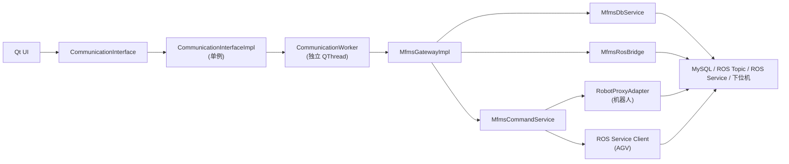

再展开成职责图：

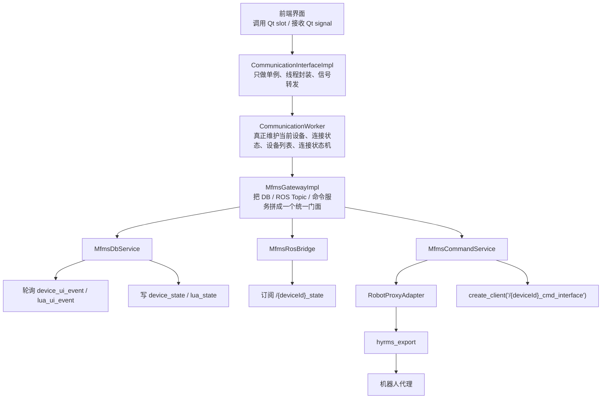

## 4. 各层真实职责

### 4.1 `CommunicationInterface`

它是对前端最友好的抽象层，特点是：

- 只暴露 Qt 信号槽
- 不让前端直接碰 ROS 节点
- 不让前端直接碰数据库
- 默认把“通信模块”作为第一视角

但它本身基本不做业务，真正逻辑都在实现类和 worker 里。

### 4.2 `CommunicationInterfaceImpl`

这一层的本质是“单例 + 线程隔离 + 事件桥接”：

- `getInstance()` 第一次调用时懒加载初始化
- 创建 `CommunicationWorker` 和独立 `QThread`
- 用内部 `request*` 信号把前端调用转发给 worker
- 再把 worker 的结果信号重新转发给 `CommunicationInterface`
- 初始化时阻塞等待 worker 启动完成，超时时间 10 秒

因此它并不直接操作数据库、ROS 或命令服务，它只是中转枢纽。

### 4.3 `CommunicationWorker`

这一层才是客户端 API 下真正的“通信核心”。它负责：

- 初始化 ROS 和 `MfmsGatewayImpl`
- 维护当前设备 `currentDeviceId_`
- 维护正在连接中的设备 `connectingDeviceId_`
- 缓存设备列表 `devices_`
- 决定连接逻辑走 AGV 直连订阅，还是机器人代理创建
- 监听数据库状态事件，驱动连接状态机继续向前推进
- 把统一状态 `RobotRealtimeStatus` 转回前端熟悉的 ROS 消息类型

换句话说，`CommunicationWorker` 是“顶级接口到中台内部”的实际业务入口。

### 4.4 `MfmsGatewayImpl`

`MfmsGatewayImpl` 是门面层。它不做复杂业务判断，主要职责是：

- 构造并拥有 `MfmsDbService`
- 构造并拥有 `MfmsRosBridge`
- 构造并拥有 `MfmsCommandService`
- 把这三层信号重新拼成统一的 Qt 门面
- 把外部调用按职责分发给对应子服务

它解决的是“前端只面对一个 gateway，不需要关心底下到底是 DB、Topic 还是 Service”。

### 4.5 `MfmsDbService`

这一层负责数据库事件总线，核心是两类动作：

- 主动写状态表：`device_state`、`lua_state`
- 被动轮询 UI 事件表：`device_ui_event`、`lua_ui_event`

它本质上是用数据库表和触发器模拟一套“上位机 <-> 下位机”的事件总线。

### 4.6 `MfmsRosBridge`

这一层负责状态上行桥接：

- 从数据库查询设备列表
- 根据设备 ID/类型订阅对应状态 Topic
- 将不同消息类型统一转换成 `RobotRealtimeStatus`
- 再通过 Qt 信号把状态往上送

它解决的是“Topic 很杂，前端不要直接碰 ROS 消息类型细节”。

### 4.7 `MfmsCommandService`

这一层负责命令下行：

- AGV：通过 ROS Service Client 访问 `/{deviceId}_cmd_interface`
- 机器人：通过 `RobotProxyAdapter` 和 `hyrms_export` 间接控制
- IO：通过机器人代理下发
- 所有结果再转回 Qt signal

这里有一个关键分流：

- AGV 走 ROS Service
- 机器人走 Robot Proxy

### 4.8 `RobotProxyAdapter`

这是机器人控制的适配器层，目的不是给前端直接用，而是把：

- `MfmsCommandService`
- `hyrms_export`
- `RobotProxy::FrRobot`

隔离开，避免业务层直接依赖厂商 SDK 细节。

## 5. 数据中台里的数据库结构

### 5.1 设备相关主表

| 表 | 作用 |
| --- | --- |
| `device` | 设备静态信息，记录 `id`、`group_id`、`address` |
| `device_state` | 设备当前状态，记录 `state`、`info`、`err_code` |
| `device_state_event` | 上位机写给下位机消费的设备状态事件 |
| `device_ui_event` | 下位机写给上位机消费的设备状态事件 |

设备状态枚举主要有：

- `offline`
- `load`
- `online`
- `connected`
- `unload`

其中角色分工很明确：

- 上位机主动写 `load` / `unload`
- 下位机主动写 `online` / `connected` / `offline`

### 5.2 Lua 相关主表

| 表 | 作用 |
| --- | --- |
| `lua_script` | Lua 脚本内容及元数据 |
| `lua_state` | Lua 脚本在某个设备组上的运行状态 |
| `lua_state_event` | 上位机写给下位机消费的脚本事件 |
| `lua_ui_event` | 下位机写给上位机消费的脚本事件 |

虽然这部分目前不在 `CommunicationInterface` 的顶级接口里直接暴露，但它仍然是 gateway 结构的一部分。

### 5.3 触发器在闭环中的作用

数据库触发器是中台闭环的关键：

- `trg_device_state_event`
  - 当 Qt/上位机把 `device_state.state` 改成 `load` 或 `unload` 时，写入 `device_state_event`
  - 当下位机把状态改成 `online` / `connected` / `offline` 时，写入 `device_ui_event`
- `trg_lua_state_event`
  - 当 Qt/上位机把 `lua_state.state` 改成 `ready` / `abort` / `pause` / `resume` 时，写入 `lua_state_event`
  - 当下位机把状态改成 `running` 等状态时，写入 `lua_ui_event`

因此数据库在这里不是普通存储层，而是“弱消息总线 + 状态机媒介”。

## 6. 线程与生命周期

### 6.1 线程模型

实际线程关系如下：

- UI 主线程
  - 持有 `CommunicationInterfaceImpl` 单例引用
- 通信线程 `QThread`
  - 持有 `CommunicationWorker`
  - worker 内再持有 ROS 节点和 gateway

前端调用流程是：

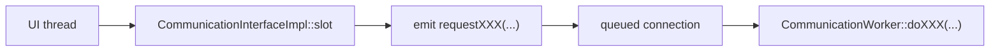

回传流程相反：

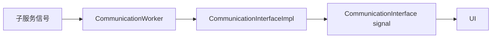

### 6.2 初始化顺序

启动顺序如下：

1. 前端第一次调用 `CommunicationInterfaceImpl::getInstance()`
2. 创建 `CommunicationWorker`
3. 创建通信线程 `QThread`
4. `CommunicationWorker::initialize()`
5. 如果 `rclcpp` 未初始化，则先 `rclcpp::init(0, nullptr)`
6. 创建 ROS 节点 `communication_worker_node`
7. 构造 `MfmsGatewayImpl`
8. `gateway->start()`
9. `MfmsDbService::start()`
10. `MfmsRosBridge::start()`
11. `MfmsCommandService::start()`
12. worker 通过 `initializationComplete` 通知外层初始化完成

### 6.3 停止顺序

停止时按反方向收缩：

1. `CommunicationInterfaceImpl::shutdown()`
2. `CommunicationWorker::shutdown()`
3. `gateway_->stop()`
4. `cmd_service_->stop()`
5. `ros_bridge_->stop()`
6. `db_service_->stop()`
7. 线程退出

## 7. 顶级接口调用链详解

下面按前端真正可见的接口逐条展开。

### 7.1 `refreshRobotList()`

目标：让前端拿到可展示、可连接的设备列表。

调用链：

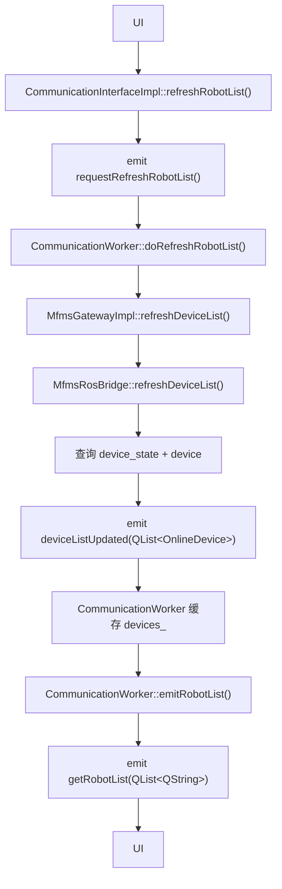

关键细节：

- `MfmsRosBridge` 会查询所有 `offline/load/online/connected` 状态的设备，排除 `unload`
- `CommunicationWorker::emitRobotList()` 又会进一步过滤成：
  - 法奥机器人
  - 华数机器人
  - 仙工 AGV
- 返回给前端的字符串不是 `name`，而是 `device.id`
  - 这是为了后续按设备 ID 去订阅 Topic / Service

### 7.2 `connectRobot(const QString& name)`

这是最复杂的一条链，因为它不是简单的“点一下立刻连”，而是带状态机的连接闭环。

#### 7.2.1 总体逻辑

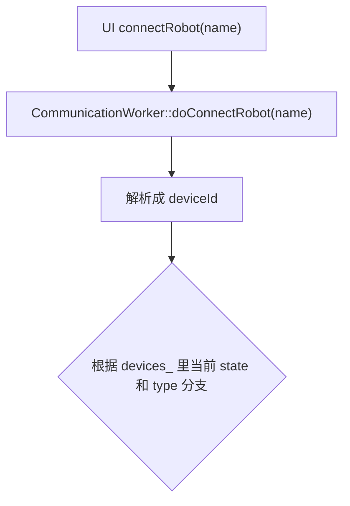

#### 7.2.2 AGV 连接链

如果目标设备是 AGV，且状态是 `online` 或 `connected`，当前代码直接订阅，不创建机器人代理：

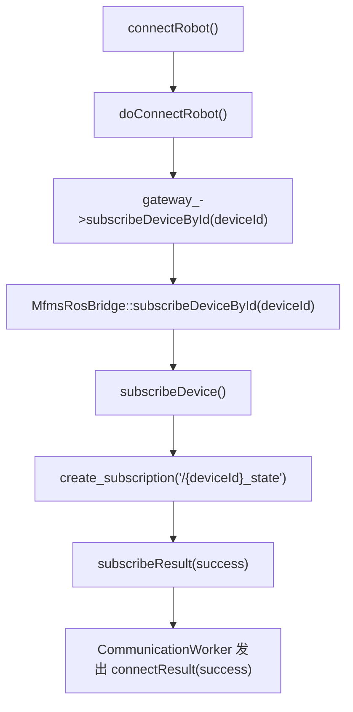

也就是说 AGV 的“连接”在现有代码里更接近“建立状态订阅”。

#### 7.2.3 机器人已是 `connected` 的链

如果数据库状态已经是 `connected`，说明下位机 TCP 已经连上，当前只需要补齐命令代理：

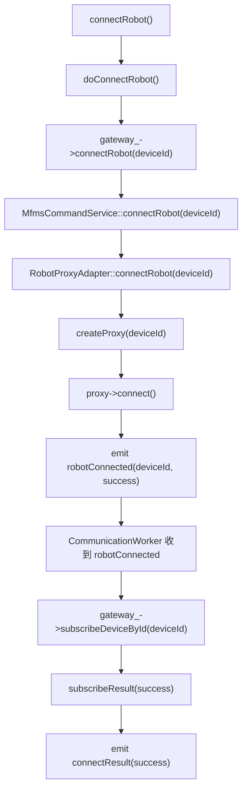

#### 7.2.4 机器人是 `online` 的链

如果数据库已经是 `online`，但还没到 `connected`，worker 不会立即创建代理，而是等待下位机继续推进状态：

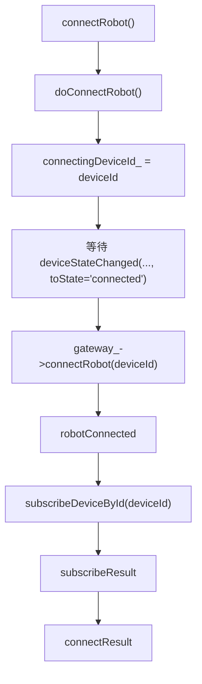

#### 7.2.5 机器人是 `offline/load` 的链

这是完整的数据库状态机闭环：

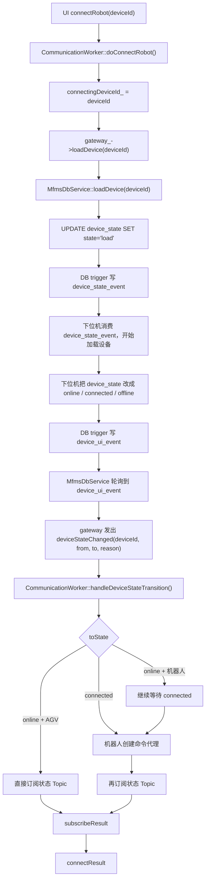

这说明：机器人连接并不是纯 ROS 行为，而是数据库事件驱动的设备装载状态机。

### 7.3 `disconnectRobot()`

调用链：

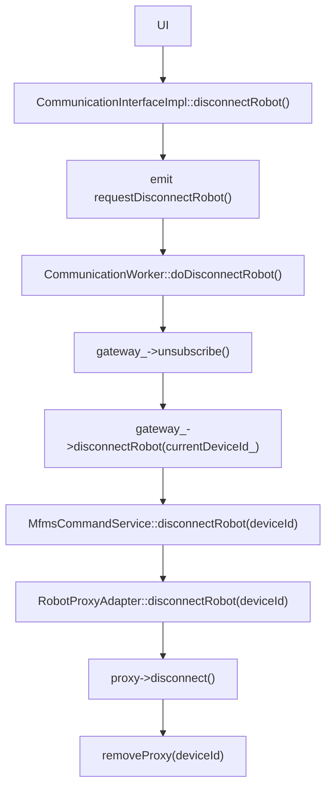

关键点：

- 先取消 Topic 订阅
- 再断开机器人代理
- AGV 没有真正的 RobotProxy，因此它的 disconnect 更像“取消上层使用”

### 7.4 状态上行：`sendARMState` / `sendAGVState`

状态上行是另一条主链，和命令链是分开的。

调用链：

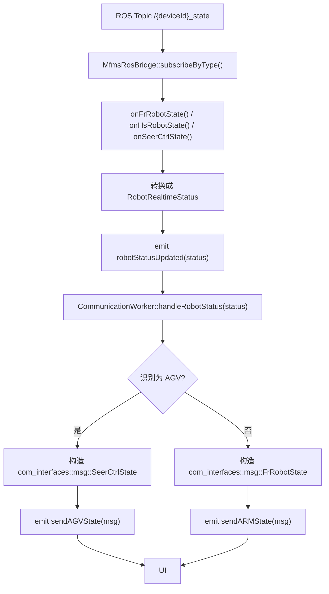

关键点：

- 中间统一态是 `RobotRealtimeStatus`
- 最终发给前端时又转换回它习惯的消息结构
- AGV 位姿会做单位转换：
  - `m -> mm` 在 bridge 里
  - `mm -> m` 在 worker 给前端时再转回

### 7.5 `getStations()`

目标：查询 AGV 站点列表。

调用链：

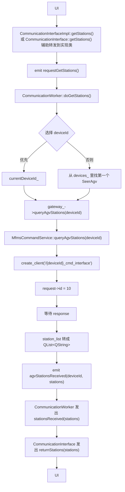

关键点：

- 站点查询走的是 AGV 的 ROS Service，不走数据库
- Service 命令码常量是 `kAgvCmdCheckStation = 10`

### 7.6 `exeToStation(QString& stationName)`

目标：让 AGV 执行到点。

调用链：

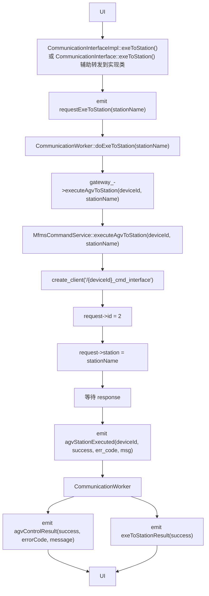

这条链只表示“到点命令是否被接受/执行返回是否成功”。

真正到站的判定仍要靠后续状态上报：

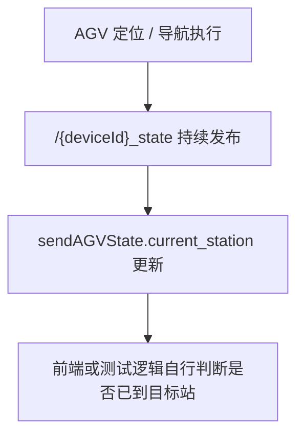

### 7.7 `agvMoveForward/Backward/TurnLeft/TurnRight`

这组接口目前是“顶层仍保留、底层已禁用”的状态。

表面调用链仍然存在：

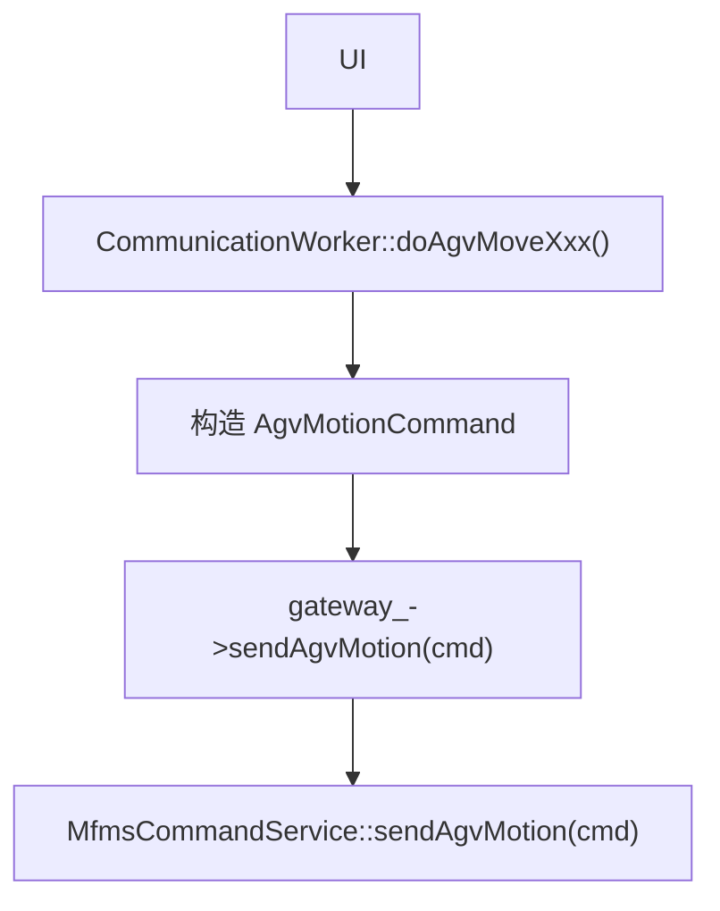

但 `MfmsCommandService::sendAgvMotion()` 当前实现直接：

- 打日志警告
- 发出 `errorOccurred`
- 发出 `agvMotionExecuted(..., false, ..., "AGV 控制功能已禁用")`

也就是说：

- 顶级接口还在
- worker 还会组装参数
- 但命令服务已经明确认为当前 SeerCtrl 契约是“站点/导航型”，不是“速度/位姿型”

因此这组接口目前不能算真正可用链路。

### 7.8 `armJogJoint(const int& number, const double& jog_step_)`

调用链：

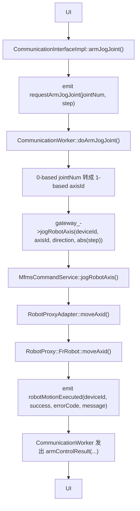

关键点：

- 顶层 `number` 是 0-based
- 底层代理要求 1-based 轴号
- 方向由步长正负推断

### 7.9 `armJogCartesian(const int& number, const double& jog_step_)`

调用链：

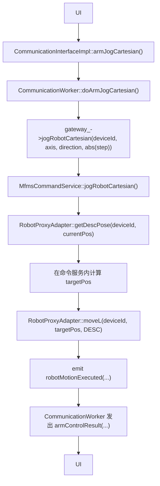

关键点：

- 笛卡尔点动不是“下位机原生增量 jog”
- 而是“先读当前位置，再算一个目标点，再走一次直线运动”

### 7.10 `armChangeMode(quint8 mode)`

调用链：

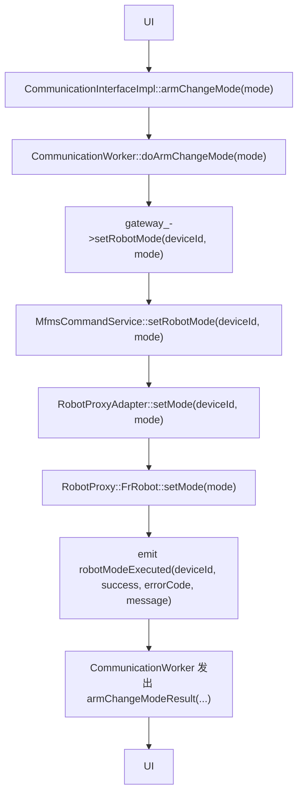

这里有一个必须明确写出来的风险：

- 顶层 `CommunicationInterface.h` 注释写的是：
  - `0=自动`
  - `1=手动`
  - `2=拖动`
- 但 `RobotProxyAdapter.h` 注释写的是：
  - `0=手动`
  - `1=自动`
  - `2=手动2`
  - `3=外部`
  - `4=拖动`
- 当前代码没有做模式映射，只是把 `mode` 原值透传到底层

所以现状不是“语义已经统一”，而是“顶层和底层注释存在冲突，运行结果取决于底层 SDK 对数值的真实解释”。

这在文档里必须视为已知风险。

### 7.11 `refreshState()`

调用链：

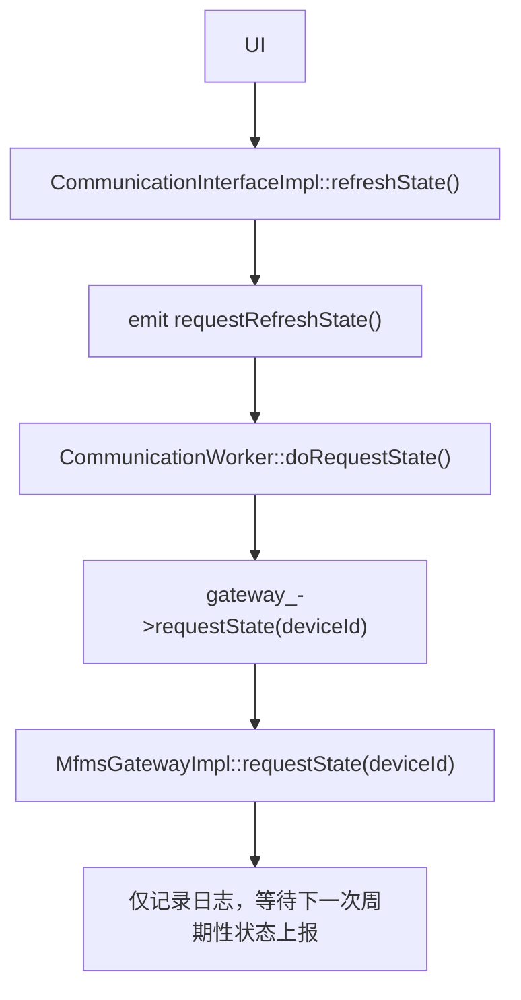

也就是说这不是一个真正的“主动拉取状态”接口。

当前语义更接近：

- 前端提示“我现在希望尽快看到最新状态”
- 实际仍依赖底层设备周期性发布 Topic

### 7.12 `getPaths()` / `exeToPath()` / `addPath()`

这组接口虽然出现在 `CommunicationInterface.h`，但当前并没有向下打通：

- `CommunicationInterface.cpp` 里仍是 TODO 占位
- `CommunicationInterfaceImpl` 没有 override
- `CommunicationWorker` 也没有对应实现
- gateway/cmd_service 也没有路径规划链路

因此这部分目前只能算接口草稿，不是可运行功能。

## 8. 设备连接状态机

实际连接状态机核心如下：

```mermaid
stateDiagram-v2
    [*] --> offline
    offline --> load: 上位机 loadDevice()
    load --> online: 下位机加载成功
    online --> connected: 下位机 TCP/命令通道建立

    load --> offline: 加载失败
    online --> offline: 设备异常离线
    connected --> offline: 连接断开
    unload --> offline: 卸载完成
```

异常分支：

- `load -> offline`：加载失败
- `online -> offline`：设备异常离线
- `connected -> offline`：连接断开
- `unload -> offline`：卸载完成

其中 `CommunicationWorker::handleDeviceStateTransition()` 专门监听这条状态机，并决定：

- AGV 在 `online` 即可直接订阅
- 机器人要等到 `connected` 再创建命令代理

## 9. Topic、Service、数据库三条通路怎么分工

可以把系统理解成三条互补通路：

### 9.1 数据库通路

负责：

- 设备加载/卸载状态机
- Lua 任务状态机
- 上位机和下位机之间的事件投递

特点：

- 低频
- 状态驱动
- 有持久化

### 9.2 ROS Topic 通路

负责：

- 实时状态上报
- 机械臂状态
- AGV 状态

特点：

- 高频
- 单向上行
- 适合持续刷新 UI

### 9.3 ROS Service / Robot Proxy 通路

负责：

- 命令下发
- 点动
- 模式切换
- AGV 站点查询/到点

特点：

- 请求/响应式
- 适合控制命令
- 机器人和 AGV 的实现方式不同

## 10. 从构建目标看中台模块边界

`CMakeLists.txt` 把整套中台明确拆成五个库：

| CMake target | 对应目录 | 作用 |
| --- | --- | --- |
| `mfms_server_db` | `mfms_db/` | 数据库事件服务 |
| `mfms_server_ros_bridge` | `ros_bridge/` | 设备列表查询与 Topic 订阅 |
| `mfms_server_cmd_service` | `cmd_service/` | 命令服务 |
| `mfms_server_gateway` | `gateway/` | 统一门面 |
| `mfms_server_client_api` | `client_api/` | 最上层前端接口 |

这说明项目作者实际上已经把“数据中台”拆成了五层，而不是一个大类。

## 11. 当前代码里的重要事实与限制

### 11.1 已真正打通的主链

下面这些链路当前是源码和测试都能对上的：

- 刷新设备列表
- 连接设备
- 断开设备
- 机械臂关节点动
- 机械臂笛卡尔点动
- 机械臂模式切换
- AGV 站点查询
- AGV 到点执行
- Topic 状态上行

### 11.2 顶层还保留但实际上未打通的接口

- `getPaths`
- `exeToPath`
- `addPath`

### 11.3 语义存在偏差或需要特别小心的点

1. AGV 手动运动接口仍在顶层暴露，但命令服务已经明确禁用。
2. `refreshState()` 并不主动拉状态，只是等待下一个周期上报。
3. `armChangeMode()` 的顶层注释与底层 `RobotProxyAdapter` 模式枚举存在冲突，当前又没有映射层，存在真实模式不一致风险。
4. `CommunicationWorker::emitRobotList()` 返回的是设备 ID，不是展示名；这一点对前端联调非常关键。
5. AGV 连接本质上更接近“订阅状态流”，而不是像机器人那样建立代理。

## 12. 一句话总结

`mfms_server` 这套数据中台，本质上是一个以 `CommunicationInterface` 为前台入口、以 `CommunicationWorker` 为业务中枢、以 `MfmsGateway` 为统一门面、以下层 `MfmsDbService + MfmsRosBridge + MfmsCommandService` 为三条主干的数据与控制闭环系统：

- 数据库负责状态机和事件总线
- Topic 负责实时状态上行
- Service/Proxy 负责控制命令下行

前端看到的是一个 Qt 接口，底下实际运行的是“线程隔离 + 数据库事件 + ROS Topic + ROS Service + 机器人代理”共同组成的中台。
