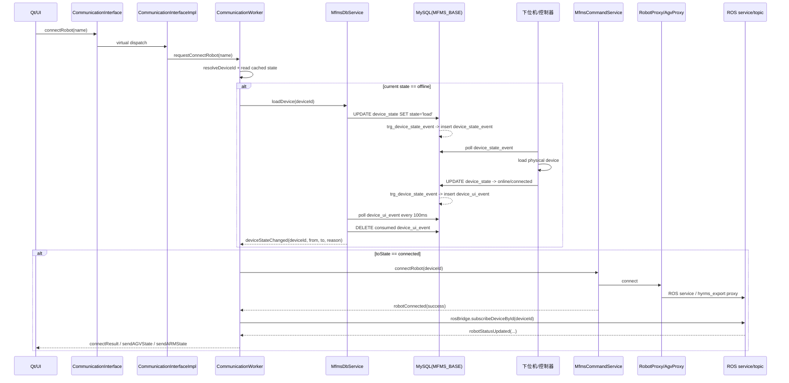
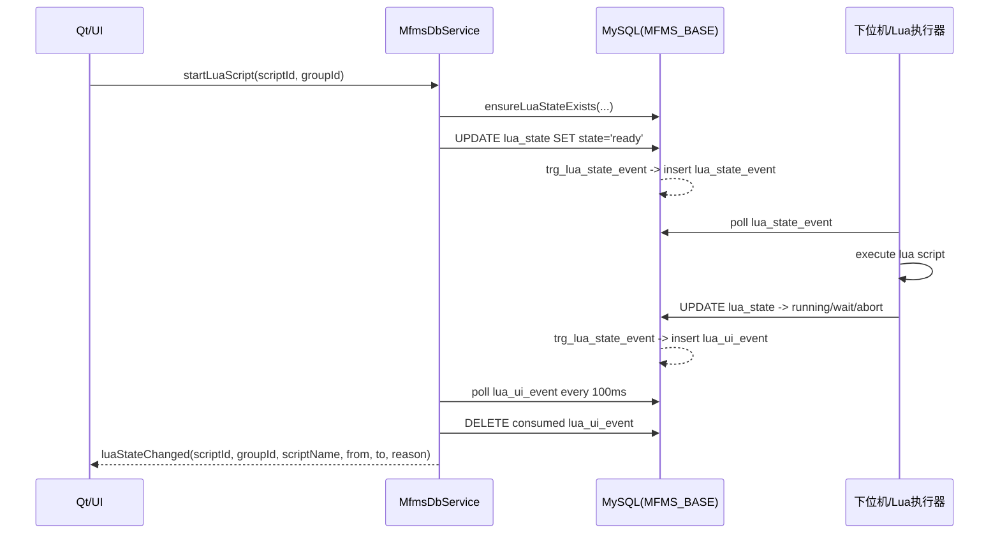

# 当前数据中台结构、数据库通讯机制与 `CommunicationInterface.h` 调用链

## 1. 调查范围与结论

本文基于以下两类信息整理：

- `src/mfms_server` 源码静态阅读
- 2026-04-17 对本机 MySQL 的现场查询结果
![[mfms_server_topology.svg]]
本次调查得到的核心结论有 6 条：

1. 当前“数据中台”的真正对外入口只有 `interface/include/CommunicationInterface.h`；它本身只是门面，真实工作在 `CommunicationInterfaceImpl + CommunicationWorker + 3 个后端服务` 中完成。
2. 当前中台并不是“所有命令都通过数据库发给下位机”。数据库只承担 4 类职责：
   - 设备注册与设备状态持久化
   - 设备加载/卸载状态机事件总线
   - Lua 脚本控制状态机事件总线
   - AGV 路径对象持久化
3. 高频状态上报不走数据库，而是走 ROS 2 Topic；大部分实时控制命令也不走数据库，而是走 ROS service 或 `hyrms_export` 代理。
4. 数据库和下位机之间的通信，本质上是“双向事件邮箱”：
   - Qt/上位机写 `device_state` / `lua_state`
   - 触发器写 `device_state_event` / `lua_state_event` 给下位机消费
   - 下位机再回写 `device_state` / `lua_state`
   - 触发器继续写 `device_ui_event` / `lua_ui_event`
   - Qt 轮询 `*_ui_event` 表并发信号给上层 UI
5. 当前 live 数据库已经偏离仓库里的 `MFMS_BASE.sql`：
   - `lua_state` / `lua_state_event` / `lua_ui_event` 的枚举值已经扩展到 `paused/resume/aborted`
   - `lua_state` 新增了 `reason`、`script_name`
   - `trg_lua_state_event` 的逻辑也与仓库 SQL 和代码注释不完全一致
6. 当前 AGV 直线运动、旋转运动、DO 控制接口在代码中仍然是空实现，占位返回 `INVALID_PARAMETER`；因此 `agvMoveForward/agvMoveBackward/agvTurnLeft/agvTurnRight` 这组 public API 目前并没有真正打到下位机。

## 2. 包结构与职责分层

### 2.1 目录结构

`src/mfms_server` 当前主要由 4 个功能层组成：

| 层级 | 目录 | 关键文件 | 核心职责 |
| --- | --- | --- | --- |
| Public Facade | `interface` | `CommunicationInterface.h` | 向 `qt_file` 或其他客户端暴露统一通信接口 |
| DB Event Layer | `mfms_db` | `MfmsDbService.h/.cpp` | 写数据库状态、轮询 UI 事件表、驱动设备/Lua 状态机 |
| ROS State Layer | `ros_bridge` | `MfmsRosBridge.h/.cpp` | 查设备列表、订阅 Topic、把 ROS 状态转成 Qt 信号 |
| Command Layer | `cmd_service` | `MfmsCommandService.h/.cpp` | 管理设备连接、机械臂代理、AGV service 调用、路径对象 CRUD |

另有一个公共配置层：

| 目录 | 文件 | 作用 |
| --- | --- | --- |
| `common/include/mfms_common` | `DbConfig.h` | 默认数据库连接配置与环境变量覆盖 |

### 2.2 实际运行时的对象关系

从运行时对象而不是目录看，链路是：

`Client/UI -> CommunicationInterface -> CommunicationInterfaceImpl -> CommunicationWorker(QThread) -> {MfmsDbService, MfmsRosBridge, MfmsCommandService} -> {MySQL, ROS Topic, ROS Service, hyrms_export}`

### 2.3 构建边界

虽然目录上拆成了 `mfms_db` / `ros_bridge` / `cmd_service` 三个模块，但真正给上层客户端链接的目标是 `mfms_server_interface`。该目标在 `interface/CMakeLists.txt` 里直接把其他三层的源码一起编译进同一个共享库。

这意味着：

- 客户端只需要链接一个库：`mfms_server_interface`
- public header 只安装 `CommunicationInterface.h`
- 其他实现类都是中台内部细节，不应该由 UI 直接依赖

### 2.4 线程模型

`CommunicationInterfaceImpl` 在首次 `instance()` 时初始化：

1. new 一个 `CommunicationWorker`
2. new 一个 `QThread`
3. 把 `CommunicationWorker` 移到这个线程
4. 线程启动时调用 `CommunicationWorker::initialize()`
5. `CommunicationWorker` 在工作线程内创建：
   - `MfmsDbService`
   - `MfmsRosBridge`
   - `MfmsCommandService`

因此当前架构是：

- UI/调用方线程只负责发请求、收信号
- 所有 DB/ROS/代理交互都集中在 `CommunicationWorker` 所在线程中

## 3. 顶层运行拓扑图

下图是当前 `src/mfms_server` 的顶层结构图，使用单独 SVG 文件承载：


这个图表达的重点是：

- `CommunicationInterface` 是唯一 public facade
- `CommunicationWorker` 是真正的编排中心
- `MfmsDbService` 只负责 DB 状态机和事件轮询
- `MfmsRosBridge` 只负责状态订阅
- `MfmsCommandService` 负责命令发送与路径管理
- DB 通道和 ROS 通道是两条并行通道，不是同一条总线

## 4. 数据库连接与现场数据库快照

### 4.1 代码默认连接参数

默认数据库配置来自 `common/include/mfms_common/DbConfig.h`：

| 项 | 默认值 |
| --- | --- |
| host | `127.0.0.1` |
| port | `3306` |
| database | `MFMS_BASE` |
| username | `cyiwen` |
| password | `123` |
| poll interval | `100ms` |

同时支持环境变量覆盖：

- `MFMS_DB_HOST`
- `MFMS_DB_PORT`
- `MFMS_DB_NAME`
- `MFMS_DB_USER`
- `MFMS_DB_PASSWORD`
- `MFMS_DB_POLL_INTERVAL_MS`
- `MFMS_DB_CONNECT_TIMEOUT_MS`

本次调查时，当前 shell 未发现任何 `MFMS_DB_*` 环境变量，因此运行时应当仍在使用默认连接参数。

### 4.2 2026-04-17 的 live DB 结果

现场查询结果如下：

- 当前数据库：`MFMS_BASE`
- MySQL 版本：`8.0.45-0ubuntu0.22.04.1`

现场库存在以下表：

- `agv_path`
- `agv_path_station`
- `alterLogs`
- `device`
- `device_state`
- `device_state_event`
- `device_ui_event`
- `hyrms_log`
- `lua_script`
- `lua_state`
- `lua_state_event`
- `lua_ui_event`
- `trigger_table`
- `users`
- `这里记录了修改日志`

### 4.3 当前设备表快照

`device` 表当前共有 7 条记录：

| id | group_id | address |
| --- | --- | --- |
| `agvser0001` | 1 | `192.168.56.2` |
| `ctrkos0001` | 1 | `192.168.56.5` |
| `rbafra0001` | 1 | `192.168.56.3` |
| `rbafra0002` | 1 | `192.168.1.99` |
| `rbthsu0001` | 1 | `192.168.56.4` |
| `robFro0001` | 1 | `192.168.58.2` |
| `vitDev0001` | 1 | `127.0.0.1` |

### 4.4 当前 `device_state` 快照

2026-04-17 查询到的 `device_state` 状态如下：

| id | state | info.type | info.module | info.name | err_code |
| --- | --- | --- | --- | --- | --- |
| `agvser0001` | `load` | `agv` | `ser` | `SEER AGV #1` | `NULL` |
| `ctrkos0001` | `offline` | `ctr` | `kos` | `Kossi Controller #1` | `NULL` |
| `rbafra0001` | `offline` | `rbt` | `fra` | `FANUC Robot #1` | `NULL` |
| `rbafra0002` | `offline` | `法奥机器人` | `fra` | `Fr1` | `NULL` |
| `rbthsu0001` | `offline` | `rbt` | `hsu` | `Huashu Robot #1` | `NULL` |
| `robFro0001` | `connected` | `rob` | `fr` | `Fr1_test` | `0` |
| `vitDev0001` | `offline` | `NULL` | `NULL` | `NULL` | `NULL` |

这个快照很关键，因为它说明：

- 当前现场并不是所有设备都在线
- `agvser0001` 仍停在 `load`，表示“加载请求已经发出，但加载握手还没有闭环”
- `robFro0001` 是当前唯一处于 `connected` 的设备

### 4.5 当前事件表快照

#### 设备事件

当前计数：

- `device_state_event_count = 1`
- `device_ui_event_count = 12`

唯一一条 `device_state_event` 为：

| id | device_id | from_state | to_state | reason | created_at |
| --- | --- | --- | --- | --- | --- |
| 71 | `agvser0001` | `offline` | `load` | `NULL` | `2026-03-25 17:09:15` |

这条记录说明：

- 上位机已经在 2026-03-25 17:09:15 对 `agvser0001` 发出了“加载设备”请求
- 该请求仍然保留在 `device_state_event`
- 从当前 `device_state.agvser0001 = load` 来看，下位机侧很可能尚未把它推进到 `online` 或 `connected`

最近的 `device_ui_event` 样本（按时间倒序）：

| id | device_id | from_state | to_state | reason | created_at |
| --- | --- | --- | --- | --- | --- |
| 70 | `robFro0001` | `connected` | `offline` | `设备连接断开` | `2026-01-29 20:59:29` |
| 48 | `rbafra0002` | `online` | `offline` | `设备异常离线` | `2026-01-29 13:53:10` |
| 47 | `rbafra0001` | `online` | `offline` | `设备异常离线` | `2026-01-29 13:53:08` |
| 44 | `agvser0001` | `online` | `offline` | `设备异常离线` | `2026-01-29 12:50:25` |
| 43 | `robFro0001` | `load` | `online` | `设备加载完成` | `2026-01-29 12:48:38` |
| 42 | `agvser0001` | `load` | `online` | `设备加载完成` | `2026-01-29 12:48:25` |

#### Lua 事件

当前计数：

- `lua_state_event_count = 0`
- `lua_ui_event_count = 5`

当前 `lua_state` 快照：

| script_id | group_id | state | reason | script_name |
| --- | --- | --- | --- | --- |
| 2 | 1 | `running` | `只有aborted或者wait的任务才能被ready` | `NULL` |
| 3 | 1 | `aborted` | `运行失败,已有运行中的任务` | `virt_test` |
| 4 | 1 | `aborted` | `lua脚本被强制终止` | `while_test` |

最近的 `lua_ui_event` 样本：

| id | script_id | group_id | from_state | to_state | reason | created_at |
| --- | --- | --- | --- | --- | --- | --- |
| 285 | 2 | 1 | `ready` | `running` | `只有aborted或者wait的任务才能被ready` | `2026-01-27 20:17:43` |
| 284 | 2 | 1 | `pause` | `running` | `只有aborted或者wait的任务才能被ready` | `2026-01-27 20:17:42` |
| 283 | 2 | 1 | `wait` | `running` | `只有aborted或者wait的任务才能被ready` | `2026-01-27 20:17:41` |
| 282 | 2 | 1 | `ready` | `wait` | `执行完毕` | `2026-01-27 20:17:40` |
| 281 | 2 | 1 | `pause` | `running` | `正在运行` | `2026-01-27 20:17:39` |

### 4.6 AGV 路径表快照

现场查询结果：

- `agv_path_count = 0`
- `agv_path_station_count = 0`

这说明当前库结构已经支持 AGV 命名路径，但现场库里暂时没有保存任何路径对象。

## 5. 数据库结构拆解

### 5.1 设备主数据与设备状态

#### `device`

作用：设备注册表，保存设备属于哪个控制组、地址是什么。

关键字段：

| 字段 | 类型 | 说明 |
| --- | --- | --- |
| `id` | `varchar(10)` | 设备唯一 ID，格式约定是 `type_3 + module_3 + id_4` |
| `group_id` | `int` | 设备组/控制组 ID，实质上用于定位同一套下位机控制器 |
| `address` | `varchar(50)` | 设备地址 |
| `create_ts` | `bigint` | 创建时间 |

#### `device_state`

作用：设备状态主表，是设备生命周期状态机的中心表。

关键字段：

| 字段 | 类型 | 说明 |
| --- | --- | --- |
| `id` | `varchar(10)` | 对应 `device.id` |
| `state` | `enum('offline','online','load','unload','connected')` | 状态机主状态 |
| `info` | `json` | 设备详细信息和最近状态快照 |
| `err_code` | `int` | 错误码 |

当前这套架构里，`device_state.state` 的含义非常重要：

| 状态 | 谁写入 | 语义 |
| --- | --- | --- |
| `offline` | 下位机 | 设备离线、卸载完成、连接断开、加载失败等最终静止态 |
| `load` | Qt/上位机 | 请求下位机加载设备 |
| `online` | 下位机 | 设备已加载完成，可被识别 |
| `connected` | 下位机 或 下位链路联动 | 设备已经处于“可控制/已建立控制链路”的状态 |
| `unload` | Qt/上位机 | 请求下位机卸载设备 |

### 5.2 设备事件双表

#### `device_state_event`

作用：下位机消费的“命令事件表”。

只要 Qt 把 `device_state.state` 更新为 `load` 或 `unload`，触发器就会向该表插入事件。

字段：

| 字段 | 说明 |
| --- | --- |
| `device_id` | 设备 ID |
| `from_state` | 旧状态 |
| `to_state` | 新状态 |
| `reason` | 变更原因 |
| `created_at` | 生成时间 |

#### `device_ui_event`

作用：Qt 消费的“UI 事件表”。

当下位机把 `device_state.state` 改成 `online` / `connected` / `offline` 时，触发器会向该表插入记录，`MfmsDbService` 轮询它，并在消费后删除对应行。

### 5.3 AGV 路径对象表

#### `agv_path`

作用：保存命名路径对象。

唯一键是：

- `group_id + path_name`

这意味着路径不是全局唯一，而是“同一控制组下唯一”。

#### `agv_path_station`

作用：保存路径中的站点列表。

关键点：

- `path_id` 关联 `agv_path.id`
- `station_index` 定义路径中的顺序
- `ON DELETE CASCADE` 表示删除路径时自动删除站点明细

### 5.4 Lua 脚本相关表

#### `lua_script`

作用：Lua 脚本定义表，保存脚本名称、内容和备注。

#### `lua_state`

作用：Lua 执行状态主表，也是 Lua 控制状态机中心表。

仓库 SQL 中的设计是：

- `wait`
- `ready`
- `running`
- `pause`
- `abort`

但 live DB 实际已经扩展为：

- `wait`
- `ready`
- `running`
- `pause`
- `paused`
- `resume`
- `abort`
- `aborted`

并新增字段：

- `reason`
- `script_name`

#### `lua_state_event`

作用：下位机消费的 Lua 状态事件表。

#### `lua_ui_event`

作用：Qt/上位机消费的 Lua 事件表。

## 6. `device_state.info` JSON 结构长什么样

`device_state.info` 不是统一 schema，而是“通用壳 + 设备类型扩展内容”。

### 6.1 通用外层字段

仓库里的样例数据表明，常见外层字段包括：

- `id`
- `ts`
- `msg`
- `type`
- `module`
- `err_code`
- `state`

### 6.2 AGV 样例结构

AGV (`agvser0001`) 的 `info.state` 中可以看到：

- `pose`
  - `pose_x`
  - `pose_y`
  - `angle`
  - `confidence`
- `velocity`
  - `vel_x`
  - `vel_y`
  - `vel_ang`
- `run_stats`
  - `odo`
  - `time`
  - `today_odo`
  - `total_time`
- `navigation`
  - `last_station`
  - `current_station`
- `controller_env`
  - `controller_humi`
  - `controller_temp`
  - `controller_voltage`
- `exception_status`
  - `slowed`
  - `blocked`
  - `slow_reason`
  - `block_reason`

### 6.3 法奥机器人样例结构

法奥机器人 (`rbafra0001`) 的 `info.state` 里包括：

- `safety`
  - `emergency_stop`
- `io_status`
  - `cl_dgt_input_h`
  - `cl_dgt_input_l`
  - `cl_analog_input`
  - `cl_dgt_output_h`
  - `cl_dgt_output_l`
  - `tl_dgt_output_l`
  - `cl_analog_output`
- `task_status`
  - `curstep_index`
  - `curtask_index`
  - `program_state`
  - `robot_motion_done`
- `error_status`
  - `sub_code`
  - `main_code`
  - `robot_err_code`
- `motion_status`
  - `jt_cur_pos`
  - `robot_mode`
  - `tl_cur_pos`
  - `robot_speed`

### 6.4 华数机器人样例结构

华数机器人 (`rbthsu0001`) 的 `info.state` 中包含：

- `io_status`
  - `robot_dgt_input`
  - `robot_dgt_output`
- `task_status`
  - `curstep_index`
  - `curtask_index`
- `motion_status`
  - `robot_en`
  - `auto_speed`
  - `jt_cur_pos`
  - `robot_mode`
  - `tl_cur_pos`
  - `manual_speed`

### 6.5 Kossi 样例结构

Kossi 控制器 (`ctrkos0001`) 的 `info.state` 包括：

- `cdhd_params`
- `claw_status`
- `main_status`
- `settings_group_1`
- `settings_group_2`

结论是：`info` 更像“设备私有状态快照 JSON”，不是强 schema 关系表。

## 7. 数据中台如何通过数据库与下位机通讯

这一部分是本文最关键的部分。

### 7.1 先给一句总定义

当前中台通过数据库跟下位机通信的方式，不是“把所有控制命令写到数据库”，而是：

- **设备生命周期命令** 通过数据库状态机和触发器传递
- **Lua 脚本执行命令** 通过数据库状态机和触发器传递
- **实时状态与实时控制** 主要通过 ROS Topic / ROS Service / `hyrms_export` 传递

换句话说，数据库在这里更像“控制面 mailbox + 状态持久化层”，而不是“实时数据面总线”。

### 7.2 设备生命周期 DB 通讯链

设备 DB 通讯链分为两个方向。

#### A. 上位机 -> 下位机

1. Qt/UI 调用 `CommunicationInterface::connectRobot(name)`
2. 请求进入 `CommunicationInterfaceImpl`
3. 通过 Qt queued signal 投递到工作线程中的 `CommunicationWorker::doConnectRobot(name)`
4. `CommunicationWorker` 根据缓存的设备列表判断当前状态
5. 如果设备当前是 `offline`，则调用 `MfmsDbService::loadDevice(deviceId)`
6. `MfmsDbService` 执行：

```sql
UPDATE device_state SET state = 'load' WHERE id = ?
```

7. MySQL 触发器 `trg_device_state_event` 监听到 `device_state` 更新
8. 触发器向 `device_state_event` 插入一条 `offline -> load` 事件
9. 下位机/控制器轮询 `device_state_event`
10. 下位机收到该事件后执行实际加载动作

#### B. 下位机 -> 上位机

1. 下位机加载成功后回写 `device_state.state = 'online'` 或后续 `connected`
2. MySQL 触发器再次触发
3. 触发器把结果写入 `device_ui_event`
4. `MfmsDbService` 每 100ms 轮询 `device_ui_event`
5. 读取新事件后立即删除该行
6. 发出 Qt 信号 `deviceStateChanged(deviceId, fromState, toState, reason)`
7. `CommunicationWorker::handleDeviceStateTransition(...)` 收到信号，更新本地缓存状态
8. 如果该设备正处于“等待连接完成”的流程中，并且 `toState == connected`，则进一步调用 `MfmsCommandService::connectRobot(deviceId)`

### 7.3 设备 DB 通讯的 Mermaid 时序图



### 7.4 这个设备状态机到底怎么理解

可以把它理解为两段式握手：

#### 第一段：设备加载状态机

`offline -> load -> online`

这一段是“设备有没有被下位机加载出来”的握手。

#### 第二段：控制链路建立状态机

`online -> connected`

这一段是“设备能不能被上位机真正控制”的握手。

但是要注意一个很现实的代码细节：

- `CommunicationWorker::handleDeviceStateTransition(...)` 当前只在 `toState == connected` 时才自动触发 `MfmsCommandService::connectRobot(deviceId)`
- 如果外部系统只把设备推进到 `online`，却没有继续推进到 `connected`，那么当前包内逻辑不会再自动往下走

这意味着当前包对下位机有一个隐含假设：

- 下位机或外部系统必须负责把 `online` 进一步推进到 `connected`
- 或者存在另一条外部链路帮助进入 `connected`

从 2026-04-17 的现场快照看，`agvser0001` 正停在 `load`，而 `device_state_event` 仍保留 `offline -> load`，说明这条 DB 握手链路至少在现场并没有完全闭环。

### 7.5 Lua 状态机的 DB 通讯链

Lua 的通讯思想和设备状态机是同一套模式。

#### 上位机 -> 下位机

`MfmsDbService` 提供：

- `startLuaScript(scriptId, groupId)` -> 写 `ready`
- `pauseLuaScript(scriptId, groupId)` -> 写 `pause`
- `resumeLuaScript(scriptId, groupId)` -> 写 `ready`
- `abortLuaScript(scriptId, groupId)` -> 当前代码里并不直接写 `abort`，而是写 `pause`

写库之后，触发器把事件送入 `lua_state_event`，供下位机消费。

#### 下位机 -> 上位机

下位机执行脚本后，会回写：

- `running`
- `wait`
- `abort` / `aborted`
- 现场库还出现了 `paused` / `resume`

然后触发器写入 `lua_ui_event`，`MfmsDbService` 轮询该表并发信号。

### 7.6 Lua 状态机 Mermaid 时序图



### 7.7 当前数据库触发器在通讯中的角色

#### `trg_device_state_event`

它同时承担两种方向：

- Qt 写 `load/unload` 时，生成 `device_state_event`
- 下位机写 `online/connected/offline` 时，生成 `device_ui_event`

所以这一个触发器，其实是设备状态机的“总交换机”。

#### `trg_lua_state_event`

它同样承担两种方向：

- Qt 写脚本状态时，生成 `lua_state_event`
- 下位机回写脚本状态时，生成 `lua_ui_event`

## 8. 需要特别强调：哪些通信不走数据库

### 8.1 设备状态实时流不走数据库

`MfmsRosBridge` 做的事情是：

1. 从 `device_state + device` 查设备列表
2. 根据设备类型推导 Topic 名
3. 订阅：
   - 法奥机器人：`FrRobotState`
   - 华数机器人：`HsRobotState`
   - 仙工 AGV：`SeerCtrlState`
4. 收到 Topic 后转换成统一的 `RobotRealtimeStatus`
5. 再由 `CommunicationWorker` 转回 public 消息类型，发给 UI

因此：

- 数据库只负责“设备清单与状态元数据”
- 真实的实时姿态、IO、任务状态、导航状态来自 ROS Topic，而不是来自 `device_state.info`

### 8.2 大部分运动控制不走数据库

#### 机械臂

机械臂命令链是：

`CommunicationInterface -> CommunicationWorker -> MfmsCommandService -> RobotProxyAdapter -> hyrms_export::RobotProxy::FrRobot -> ROS service / linker -> 下位机`

#### AGV

AGV 命令链是：

`CommunicationInterface -> CommunicationWorker -> MfmsCommandService -> AgvProxyAdapter -> /{deviceId}_cmd_interface -> 下位机`

因此：

- DB 不负责机械臂点动/模式切换
- DB 不负责 AGV 到点/站点列表执行
- DB 只负责“设备生命周期”和“路径对象持久化”

### 8.3 AGV 路径是“DB 持久化 + ROS 执行”的混合模式

这是一条很容易混淆的链路：

#### 路径保存

`addPath(pathName, stationList)` 最终调用 `MfmsCommandService::saveAgvPath(...)`：

- 开事务
- 查 `agv_path`
- insert 或 update 路径对象
- 清空旧 `agv_path_station`
- 按顺序插入新站点
- commit

这一步完全在数据库完成。

#### 路径执行

`exeToPath(pathName)` 最终调用 `MfmsCommandService::executeAgvPath(...)`：

- 先从数据库读出 `agv_path_station`
- 拼出 `stationList`
- 再调用 `navigateAgvPath(deviceId, stationList)`
- 最终由 `AgvProxyAdapter::guideGoTargetList(...)` 通过 ROS service 发给下位机

所以 AGV 命名路径不是“数据库直接下发给下位机”，而是：

`数据库负责保存路径定义 -> 命令服务从 DB 取定义 -> ROS service 真正执行`

## 9. `CommunicationInterface.h` 顶层调用链

### 9.1 总体调用链

最上层 public API 统一遵循同一模式：

1. 客户端调用 `CommunicationInterface` 的虚函数
2. 实际落到 `CommunicationInterfaceImpl`
3. `CommunicationInterfaceImpl` 检查是否初始化
4. 通过 signal/slot 把请求排队送给 `CommunicationWorker`
5. `CommunicationWorker` 决定调用哪个后端服务
6. 后端服务访问 DB / ROS / 代理
7. 结果再通过 `CommunicationWorker` 的信号回流
8. `CommunicationInterfaceImpl` 转发给 public signal

### 9.2 接口到实现的映射表

| Public API | Impl 发出的请求信号 | Worker 槽函数 | 下游服务 | 真实外部通道 |
| --- | --- | --- | --- | --- |
| `refreshRobotList()` | `requestRefreshRobotList()` | `doRefreshRobotList()` | `MfmsCommandService + MfmsRosBridge` | DB 查询 |
| `connectRobot(name)` | `requestConnectRobot(name)` | `doConnectRobot(name)` | `MfmsDbService` 或 `MfmsCommandService` | DB 状态机 / ROS service |
| `disconnectRobot()` | `requestDisconnectRobot()` | `doDisconnectRobot()` | `MfmsRosBridge + MfmsCommandService` | 取消 Topic + 代理断连 |
| `agvMoveForward()` | `requestAgvMoveForward()` | `doAgvMoveForward()` | `MfmsCommandService` | AGV ROS service |
| `agvMoveBackward()` | `requestAgvMoveBackward()` | `doAgvMoveBackward()` | `MfmsCommandService` | AGV ROS service |
| `agvTurnLeft()` | `requestAgvTurnLeft()` | `doAgvTurnLeft()` | `MfmsCommandService` | AGV ROS service |
| `agvTurnRight()` | `requestAgvTurnRight()` | `doAgvTurnRight()` | `MfmsCommandService` | AGV ROS service |
| `armJogJoint()` | `requestArmJogJoint()` | `doArmJogJoint()` | `MfmsCommandService` | `hyrms_export` / ROS |
| `armJogCartesian()` | `requestArmJogCartesian()` | `doArmJogCartesian()` | `MfmsCommandService` | `hyrms_export` / ROS |
| `armChangeMode()` | `requestArmChangeMode()` | `doArmChangeMode()` | `MfmsCommandService` | `hyrms_export` / ROS |
| `refreshState()` | `requestRefreshState()` | `doRequestState()` | 无主动下游动作 | 依赖已有周期上报 |
| `getStations()` | `requestGetStations()` | `doGetStations()` | `MfmsCommandService` | AGV ROS service |
| `exeToStation()` | `requestExeToStation()` | `doExeToStation()` | `MfmsCommandService` | AGV ROS service |
| `getPaths()` | `requestGetPaths()` | `doGetPaths()` | `MfmsCommandService` | DB 查询 |
| `getPathDetail()` | `requestGetPathDetail()` | `doGetPathDetail()` | `MfmsCommandService` | DB 查询 |
| `addPath()` | `requestAddPath()` | `doAddPath()` | `MfmsCommandService` | DB 事务写入 |
| `exeToPath()` | `requestExeToPath()` | `doExeToPath()` | `MfmsCommandService` | DB 查询 + AGV ROS service |
| `agvNavigatePath()` | `requestAgvNavigatePath()` | `doAgvNavigatePath()` | `MfmsCommandService` | AGV ROS service |

### 9.3 `refreshRobotList()` 调用链

这条链路很容易被忽略，因为它其实同时刷新了两套视图：

1. `MfmsCommandService::refreshOnlineDevices()`
   - 只查 `online/connected`
   - 目的是刷新“可发命令设备缓存”
2. `MfmsRosBridge::refreshDeviceList()`
   - 查 `offline/load/online/connected`
   - 目的是刷新 UI 可见设备列表

最后 `CommunicationWorker::emitRobotList()` 实际发给 UI 的是 `rosBridge_` 维护的 `devices_`，而不是 `cmdService_` 的 `onlineDevices_`。

也就是说：

- UI 看到的列表比命令层缓存更宽
- `cmd_service` 只关心可以控制的设备
- `ros_bridge` 关心可以展示和订阅的设备

### 9.4 `connectRobot()` 调用链

这是当前最复杂的一条 public API。

#### 场景 A：设备已经是 `connected`

- `CommunicationWorker` 直接调用 `MfmsCommandService::connectRobot(deviceId)`
- 成功后调用 `rosBridge_->subscribeDeviceById(deviceId)`
- UI 开始收到状态

#### 场景 B：设备是 `offline`

- `CommunicationWorker` 先调用 `dbService_->loadDevice(deviceId)`
- 进入 DB 状态机
- 等待下位机把状态推进
- `handleDeviceStateTransition()` 监听 DB UI 事件
- 当目标状态为 `connected` 时，才继续 `cmdService_->connectRobot(deviceId)`

#### 场景 C：设备是 `online`

- 当前代码只记录 `connectingDeviceId_`
- 等待未来的 `connected` 事件
- 当前包内不会在看到 `online` 的瞬间主动触发 `cmdService_->connectRobot(deviceId)`

这意味着 `online -> connected` 这一步并不在本包内显式驱动，而依赖外部系统。

### 9.5 `disconnectRobot()` 调用链

当前 disconnect 的动作是：

1. `rosBridge_->unsubscribe()`
2. `cmdService_->disconnectRobot(currentDeviceId_)`
3. 清空 `currentDeviceId_` 和 `connectingDeviceId_`

这里有两个值得注意的点：

- 它没有调用 `dbService_->unloadDevice()`，所以 public interface 并未直接暴露“卸载设备”的能力
- `cmdService_->robotDisconnected(...)` 当前只在 `CommunicationWorker` 里打印日志，没有再向 public interface 暴露独立的“断连结果”信号

### 9.6 AGV 运动调用链

以 `agvMoveForward(speed, distance)` 为例：

1. `CommunicationInterfaceImpl` 发 `requestAgvMoveForward(speed, distance)`
2. `CommunicationWorker::doAgvMoveForward(...)`
3. 检查当前设备必须是 AGV 且 `state == connected`
4. 组装 `AgvMotionCommand`
5. 调用 `MfmsCommandService::sendAgvMotion(cmd)`
6. `MfmsCommandService` 根据参数选择：
   - `AgvProxyAdapter::moveLinear(...)`
   - 或 `AgvProxyAdapter::moveTurn(...)`
7. 本应落到 `/{deviceId}_cmd_interface`

但是当前实现有一个非常重要的事实：

- `AgvProxyAdapter::moveLinear(...)` 当前直接返回 `AgvProxyError::INVALID_PARAMETER`
- `AgvProxyAdapter::moveTurn(...)` 当前直接返回 `AgvProxyError::INVALID_PARAMETER`
- `AgvProxyAdapter::setDigitalOutput(...)` 也同样未实现

因此这 3 类 API 目前都只是接口存在，链路并没有真正打通。

### 9.7 机械臂点动与模式切换调用链

机械臂链路相对完整。

#### `armJogJoint(number, jogStep)`

调用链：

`CommunicationInterface -> requestArmJogJoint -> doArmJogJoint -> MfmsCommandService::jogRobotAxis -> RobotProxyAdapter::moveAxid -> RobotProxy::FrRobot`

#### `armJogCartesian(number, jogStep)`

调用链：

`CommunicationInterface -> requestArmJogCartesian -> doArmJogCartesian -> MfmsCommandService::jogRobotCartesian -> RobotProxyAdapter::getDescPose + moveL -> RobotProxy::FrRobot`

#### `armChangeMode(mode)`

调用链：

`CommunicationInterface -> requestArmChangeMode -> doArmChangeMode -> mapPublicArmModeToLower -> MfmsCommandService::setRobotMode -> RobotProxyAdapter::setMode`

需要注意：

- `CommunicationWorker` 的 public mode 会先被映射为 lower mode
- `RobotProxyAdapter` 底层统一使用 `RobotProxy::FrRobot`
- 也就是说当前命令层虽然识别了 `FrRobot` 和 `HsRobot` 两种设备类型，但命令发送仍然共用同一个 `RobotProxyAdapter`

### 9.8 AGV 站点与路径相关调用链

#### 站点查询

`getStations() -> doGetStations() -> queryAgvStations(deviceId) -> AgvProxyAdapter::queryStations(deviceId)`

`queryStations()` 通过 service request `id = 10` 查询站点，并把结果经 `agvStationsReceived` 返回。

#### 到站执行

`exeToStation(stationName) -> doExeToStation() -> navigateAgvToStation(deviceId, stationName) -> AgvProxyAdapter::moveToStation()`

`moveToStation()` 发送 service request `id = 2`。

#### 路径直接执行

`agvNavigatePath(stationList) -> doAgvNavigatePath() -> navigateAgvPath(deviceId, stationList) -> AgvProxyAdapter::guideGoTargetList()`

`guideGoTargetList()` 在 continuous 模式下使用 service request `id = 4`。

#### 命名路径 CRUD

- `getPaths()` -> 查 `agv_path`
- `getPathDetail(pathName)` -> 查 `agv_path + agv_path_station`
- `addPath(pathName, stationList)` -> 事务写 `agv_path + agv_path_station`
- `exeToPath(pathName)` -> 先读库，再复用 `guideGoTargetList()`

### 9.9 `refreshState()` 的真实行为

`refreshState()` 这个 public API 名字看起来像“向下位机主动拉一次状态”，但当前实现并没有真的发 DB 或 ROS 请求。

它当前只做一件事：

- 在 `CommunicationWorker::doRequestState()` 里打印一条 debug log

也就是说，当前状态刷新仍然依赖：

- 已建立的 Topic 订阅
- 下位机/ROS 的周期上报

### 9.10 结果信号如何回流到 `CommunicationInterface`

请求链之外，`CommunicationInterfaceImpl::connectWorkerSignals()` 还把 `CommunicationWorker` 的结果信号重新映射回 public interface。

| Worker 信号 | Public Interface 信号 | 对上层的语义 |
| --- | --- | --- |
| `robotListUpdated` | `getRobotList` | 返回设备列表 |
| `connectionResult` | `connectResult` | 返回连接结果 |
| `armStateReceived` | `sendARMState` | 推送机械臂实时状态 |
| `agvStateReceived` | `sendAGVState` | 推送 AGV 实时状态 |
| `agvControlResult` | `agvControlRes` | 返回 AGV 控制结果 |
| `armControlResult` | `armControlRes` | 返回机械臂控制结果 |
| `armChangeModeResult` | `armChangeModeRes` | 返回模式切换结果 |
| `errorOccurred` | `errorOccurred` | 统一错误出口 |
| `stationsReceived` | `stationsReceived` | 返回 AGV 站点列表 |
| `pathsReceived` | `pathsReceived` | 返回 AGV 路径名列表 |
| `pathDetailReceived` | `pathDetailReceived` | 返回路径明细 |

因此 `CommunicationInterface.h` 在运行时既是：

- 请求入口
- 结果回流出口
- 实时状态广播口

它并不是一个单纯的“函数式 API”，而是 Qt 信号槽风格的双向通信门面。

## 10. 当前 live DB 与仓库 SQL/代码的差异

这一部分非常值得单列，因为它会影响后续任何维护工作。

### 10.1 Lua 状态枚举已经漂移

代码中的 `DbTypes.h` 仍把 Lua 状态理解为：

- `wait`
- `ready`
- `running`
- `pause`
- `abort`

但现场库已经扩展为：

- `wait`
- `ready`
- `running`
- `pause`
- `paused`
- `resume`
- `abort`
- `aborted`

这意味着：

- 代码注释已经不是 live schema 的完整描述
- 文档和实现之间已经出现版本漂移

### 10.2 live `lua_state` 多了 `reason` 和 `script_name`

当前 live 表结构额外包含：

- `reason text`
- `script_name varchar(255)`

而仓库里的 `MFMS_BASE.sql` 没有这两个字段。

### 10.3 live 触发器与仓库 SQL 不完全一致

现场 `SHOW TRIGGERS` 显示：

- `trg_lua_state_event` 会处理 `pause/resume/abort`
- UI 事件 reason 使用 `NEW.reason`
- 还出现了 `paused` / `aborted`

而仓库 SQL 与 `MfmsDbService` 注释仍然以旧版语义为主。

### 10.4 设备数据也比仓库 SQL 新

仓库 SQL 里的 `device` 样例只有 5 条设备记录，但现场库已经有：

- `rbafra0002`
- `robFro0001`

说明现场数据库已经持续演进，不能再把仓库 SQL 当成唯一真实结构。

## 11. 当前架构的能力边界与实现空洞

### 11.1 已经打通的能力

- 设备列表查询
- 设备 DB 生命周期管理（至少设计上已具备）
- Topic 状态订阅
- 机械臂连接、点动、模式切换
- AGV 站点查询
- AGV 到点
- AGV 路径对象 CRUD
- AGV 命名路径执行
- Lua 状态机 DB 事件轮询

### 11.2 仍有明显空洞的能力

- AGV 直线运动 `moveLinear()` 未实现
- AGV 转向 `moveTurn()` 未实现
- AGV DO 控制 `setDigitalOutput()` 未实现
- public interface 没有直接暴露 `unloadDevice()`
- `refreshState()` 没有主动拉取语义
- `online -> connected` 的推进依赖外部系统，不在本包内显式闭环

## 12. 最后给出一句话版总图景

当前 `src/mfms_server` 数据中台的本质，是一个“**单门面、单工作线程、DB 状态机 + ROS 状态桥 + 命令代理**”的混合架构：

- **门面层**：`CommunicationInterface`
- **编排层**：`CommunicationWorker`
- **数据库层**：负责设备/Lua 状态机与事件邮箱
- **ROS 状态层**：负责 Topic 状态回流
- **命令层**：负责 ROS service / `hyrms_export` 控制链路

数据库与下位机的通信不是全量指令流，而是“**生命周期与脚本状态的控制面事件流**”；真正的实时控制和实时状态，依然主要通过 ROS 与代理层完成。
