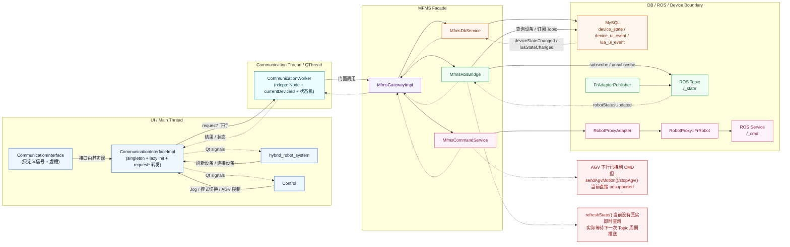
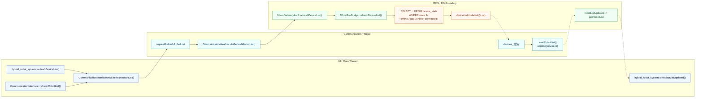
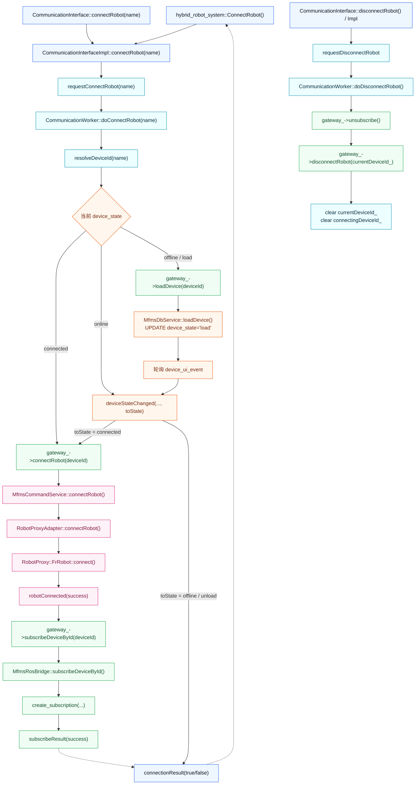
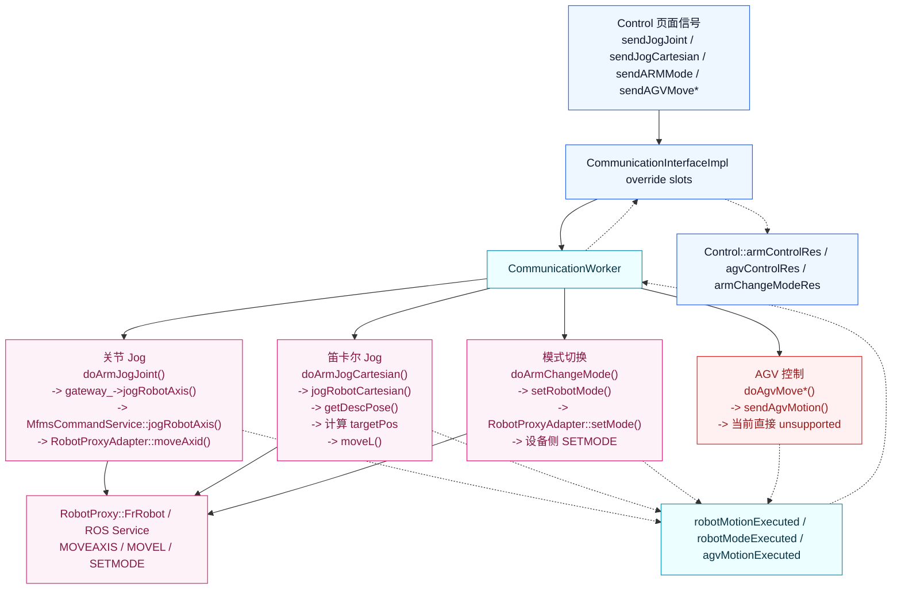
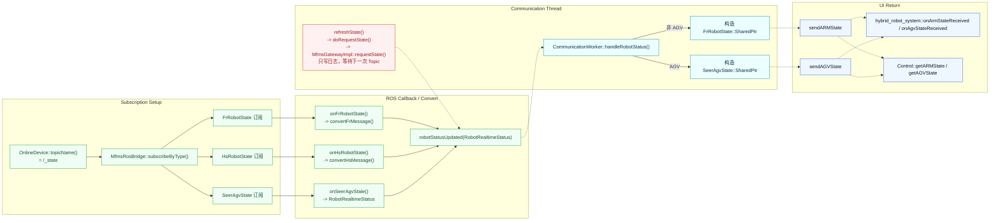

# 数据中台全链路展示

## 1. 说明

- 本文从 `src/qt_file/src/CommunicationInterface.h` 起，梳理 Qt 前端到数据中台、再到 ROS / DB / 设备适配层的完整调用线路。
- 图中统一约定：
  - `-->` 表示下行请求、调用、状态机推进。
  - `-.->` 表示上行结果、状态回流、Qt 信号回传。
  - `subgraph` 表示线程边界或系统边界。
- 本文只基于源码现状梳理，不改动代码，不推断不存在的链路。

## 2. 总览图



### 总览说明

- `CommunicationInterface` 只是顶层 Qt 接口，真正实现位于 `CommunicationInterfaceImpl`。
- `CommunicationInterfaceImpl` 负责单例、懒初始化、线程切换和 worker 信号转发。
- `CommunicationWorker` 是中台真正的工作入口，独占 `QThread`，内部持有 `rclcpp::Node` 和 `MfmsGatewayImpl`。
- `MfmsGatewayImpl` 是中台门面，向下拆成三条支路：
  - `MfmsDbService`：负责 DB 状态机和事件轮询。
  - `MfmsRosBridge`：负责设备列表查询与 ROS Topic 订阅。
  - `MfmsCommandService`：负责控制命令下发。
- 控制链最终落到 `RobotProxyAdapter -> RobotProxy::FrRobot -> ROS Service`。
- 状态链最终由 `FrAdapterPublisher` 发出 `/<id>_state` Topic，再被 `MfmsRosBridge` 拉回 Qt。

## 3. 场景 1：设备列表链路



### 关键说明

- 页面入口在 `hybrid_robot_system::refreshDeviceList()`，最终走到 `CommunicationInterfaceImpl::refreshRobotList()`。
- worker 侧真实动作是 `CommunicationWorker::doRefreshRobotList()`，它通过 `MfmsGatewayImpl` 下发到 `MfmsRosBridge::refreshDeviceList()`。
- `MfmsRosBridge` 会查询 `device_state`，并把 `offline / load / online / connected` 设备都拉出来。
- 查询结果先以 `QList<OnlineDevice>` 形式回到 worker。
- worker 最终回传给 UI 的是 `device.id`，不是 `device.name`，因为 `emitRobotList()` 明确 `append(device.id)`。
- 这意味着 UI 下拉框当前看到的是设备 ID，不是更友好的设备名。

## 4. 场景 2：连接 / 断开状态机



### 关键说明

- `connectRobot(name)` 进入 worker 后，不会直接连设备，而是先 `resolveDeviceId(name)`。
- 然后按 DB 里的当前设备状态分三路：
  - `connected`：直接进入 `gateway_->connectRobot(deviceId)`。
  - `online`：先等待 DB 状态继续推进到 `connected`，再发起真正连接。
  - `offline / load`：先 `loadDevice()`，通过 DB 状态机推进。
- `offline / load` 分支会走 `MfmsDbService::loadDevice()`，更新 `device_state`，再靠轮询 `device_ui_event` 收到 `deviceStateChanged`，进入 `connected` 后再继续连接。
- 连接成功不是一步结束，而是两阶段：
  - 第一阶段：`RobotProxyAdapter::connectRobot()` 成功。
  - 第二阶段：继续 `subscribeDeviceById(deviceId)`，订阅成功后才回 `connectionResult(true)`。
- 断开时会先 `unsubscribe()`，再 `disconnectRobot(currentDeviceId_)`，最后 worker 清空 `currentDeviceId_` 和 `connectingDeviceId_`。

## 5. 场景 3：控制命令链路



### 关键说明

- `Control` 页面已经把 ARM jog、AGV 前后左右、模式切换、结果回调全部接到 `CommunicationInterfaceImpl`。
- ARM 关节 jog 是完整闭环：
  - `armJogJoint`
  - `requestArmJogJoint`
  - `doArmJogJoint`
  - `jogRobotAxis(deviceId, jointNum + 1, dir, step)`
  - `RobotProxyAdapter::moveAxid()`
  - 设备服务
- ARM 笛卡尔 jog 不是直接一步走到底，它会先 `getDescPose()` 获取当前位置，再计算目标位姿，然后调用 `moveL()`。
- ARM 模式切换链路是：
  - `armChangeMode`
  - `doArmChangeMode`
  - `setRobotMode()`
  - `RobotProxyAdapter::setMode()`
  - 设备服务 `SETMODE`
- AGV 控制链路在 Qt / Worker / Gateway 层都已接好，但 `MfmsCommandService::sendAgvMotion()` / `stopAgv()` 当前直接返回 unsupported，不是完整闭环。
- 所有控制结果都统一回流为 `robotMotionExecuted` / `robotModeExecuted` / `agvMotionExecuted`，再经 worker 和 `CommunicationInterfaceImpl` 回到页面槽函数。

## 6. 场景 4：状态回流链路



### 关键说明

- 状态订阅目标名来自 `OnlineDevice::topicName()`，规则是 `/<id>_state`。
- `MfmsRosBridge::subscribeByType()` 会按设备类型创建三类订阅：
  - `FrRobotState`
  - `HsRobotState`
  - `SeerAgvState`
- ROS 回调统一先转换成 `RobotRealtimeStatus`。
- 然后由 `CommunicationWorker::handleRobotStatus()` 再分流成：
  - ARM：构造 `FrRobotState::SharedPtr`，发 `sendARMState`
  - AGV：构造 `SeerAgvState::SharedPtr`，发 `sendAGVState`
- UI 侧主要接收方有两个：
  - `hybrid_robot_system`
  - `Control`
- `refreshState()` 目前没有真正向下游发起即时查询；`MfmsGatewayImpl::requestState()` 只有日志说明，实际依赖下一次周期性 Topic 推送。

## 7. Topic / Service 命名边界

### Topic 命名

- 中台侧订阅名来自 `OnlineDevice::topicName()`：

```cpp
QString topicName() const {
    const QString topicBase = id.isEmpty() ? name : id;
    return QString("/%1_state").arg(topicBase);
}
```

- 因此本文统一按 `/<id>_state` 展示状态 Topic。

### Service 命名

- 设备服务边界本文统一展示为 `/<device_name>_cmd`。
- Fr 适配器源码中当前默认实现是：

```cpp
service_name_ = node_name_ + "_cmd";
```

- 所以在 Fr 默认实例下，更接近 `/FrAdapterServer_cmd` 这种实际命名。
- 如果部署侧要求严格满足 `/<device_name>_cmd`，则 DB 中设备 ID、适配器节点名、代理创建名三者需要一致。

## 8. 三个现状风险

### 风险 1：AGV 控制未真正落地

- `CommunicationInterfaceImpl`
- `CommunicationWorker`
- `MfmsGatewayImpl`

这三层已经把 AGV 下行接口接起来了，但 `MfmsCommandService::sendAgvMotion()` / `stopAgv()` 当前直接返回 unsupported，所以不是完整闭环。

### 风险 2：`refreshState()` 不是实时查询

- `refreshState()` 会一路调用到 `CommunicationWorker::doRequestState()`。
- 但 `MfmsGatewayImpl::requestState()` 目前只有日志，没有真实下钻查询动作。
- 结果上看，它不是“立刻取一次最新状态”，而是“等待下一次周期性 Topic 推送”。

### 风险 3：设备列表 UI 显示的是 ID 而不是 Name

- `MfmsRosBridge` 查询时其实能拿到 `name` 和 `id`。
- 但 `CommunicationWorker::emitRobotList()` 最终回传的是 `device.id`。
- 所以 UI 下拉框当前展示的是设备 ID，这会影响操作体验，也容易让“设备名”和“部署标识”混淆。

## 9. 结论

- 从顶层 `CommunicationInterface.h` 往下看，数据中台的主干非常清晰：
  - Qt 接口层
  - 单例线程桥接层
  - Worker 执行层
  - Gateway 门面层
  - DB / ROS / 命令三支路
  - 设备适配层
- 真正最关键的两条闭环是：
  - 控制闭环：`Qt -> Worker -> Gateway -> CommandService -> RobotProxyAdapter -> Device`
  - 状态闭环：`Device / Publisher -> ROS Topic -> RosBridge -> Worker -> Qt`
- 当前最需要注意的三个缺口是：
  - AGV 控制尚未落地
  - `refreshState()` 不是即时查询
  - 设备列表对外展示的是 `id`

