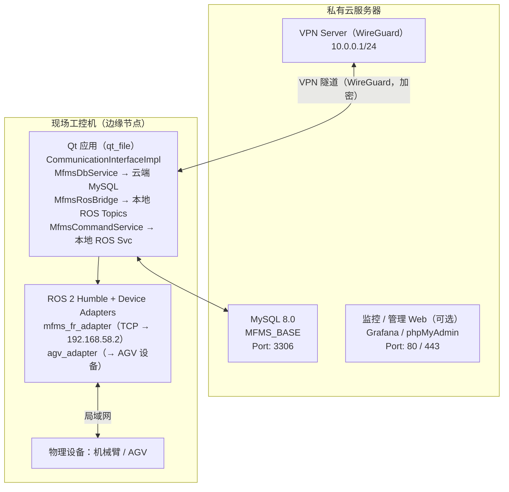
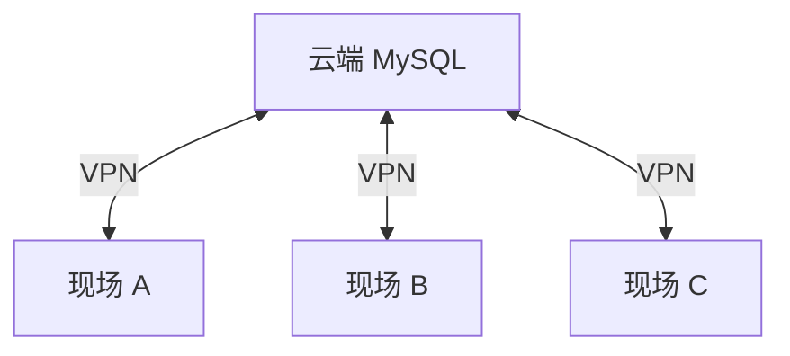

---
tags:
  - 研一上学期/复合机器人开发-AMR底盘开发
---
# MFMS 私有云部署方案

> [!summary] 方案结论
> MFMS 私有云部署建议采用 **云端数据库 + 边缘计算** 架构：云端部署 MySQL、VPN 和可选管理 Web；现场工控机部署 Qt 应用、ROS 2 与设备适配器，保证机械臂 / AGV 控制链路仍在现场局域网内。

## 1. 背景

MFMS 项目需要部署到私有云，包括数据库和应用。但由于系统控制物理设备（机械臂、AGV），设备适配器必须与物理设备在同一局域网。因此采用 **云端 + 边缘** 分层架构。

## 2. 核心约束

- `mfms_fr_adapter` 通过 TCP:8083 / RPC 直连机械臂（192.168.58.x 网段），**必须在现场局域网**。
- AGV 适配器同理，需要与 AGV 在同一网络。
- 上下位机通过 **MySQL 数据库表** 通信（`device_state_event` / `lua_state_event`），天然支持远程部署。

## 3. 推荐架构：云端数据库 + 边缘计算



---

## 4. 实施步骤

### 第 1 步：云服务器环境搭建

#### 服务器配置建议（私有云 VM）

| 配置项 | 建议 |
| --- | --- |
| CPU | 2 核+ |
| 内存 | 4 GB+ |
| 硬盘 | 50 GB+ SSD |
| OS | Ubuntu 22.04 LTS |

#### 安装 MySQL

```bash
sudo apt update && sudo apt install -y mysql-server
sudo systemctl enable mysql

# 安全配置
sudo mysql_secure_installation

# 创建远程访问用户
sudo mysql -u root -p
```

```sql
CREATE DATABASE MFMS_BASE;
CREATE USER 'mfms'@'10.0.0.%' IDENTIFIED BY '<强密码>';
GRANT ALL PRIVILEGES ON MFMS_BASE.* TO 'mfms'@'10.0.0.%';
FLUSH PRIVILEGES;
```

#### 导入数据库 schema

```bash
mysql -u root -p MFMS_BASE < src/mfms_server/MFMS_BASE.sql
```

#### MySQL 配置

配置文件：`/etc/mysql/mysql.conf.d/mysqld.cnf`

```ini
# 仅监听 VPN 网段，不暴露公网
bind-address = 10.0.0.1
port = 3306
max_connections = 100
```

---

### 第 2 步：VPN 网络打通（WireGuard）

#### 云服务器（VPN Server）

```bash
sudo apt install -y wireguard
wg genkey | tee /etc/wireguard/server_private.key | wg pubkey > /etc/wireguard/server_public.key
```

配置文件：`/etc/wireguard/wg0.conf`

```ini
[Interface]
Address = 10.0.0.1/24
ListenPort = 51820
PrivateKey = <server_private_key>

[Peer]
PublicKey = <edge_public_key>
AllowedIPs = 10.0.0.2/32
```

#### 现场工控机（VPN Client）

```bash
sudo apt install -y wireguard
wg genkey | tee /etc/wireguard/client_private.key | wg pubkey > /etc/wireguard/client_public.key
```

配置文件：`/etc/wireguard/wg0.conf`

```ini
[Interface]
Address = 10.0.0.2/24
PrivateKey = <client_private_key>

[Peer]
PublicKey = <server_public_key>
Endpoint = <云服务器公网IP>:51820
AllowedIPs = 10.0.0.0/24
PersistentKeepalive = 25
```

#### 启动与验证

```bash
# 双端启动
sudo systemctl enable wg-quick@wg0
sudo systemctl start wg-quick@wg0

# 从工控机 ping 云服务器
ping 10.0.0.1
```

---

### 第 3 步：代码配置修改

#### 3.1 统一数据库连接指向云端

修改 `config.json`：

```json
{
  "mysql": {
    "host": "10.0.0.1",
    "port": 3306,
    "user": "mfms",
    "password": "<强密码>",
    "schema": "MFMS_BASE",
    "pool_size": 32,
    "wait_timeout_ms": 5000
  }
}
```

也可以通过环境变量配置（无需改代码，推荐）：

```bash
export MFMS_DB_HOST=10.0.0.1
export MFMS_DB_PORT=3306
export MFMS_DB_USER=mfms
export MFMS_DB_PASSWORD=<强密码>
export MFMS_DB_NAME=MFMS_BASE
```

#### 3.2 修复 `mfms_fr_adapter` 硬编码的 `localhost`

文件：`src/mfms_fr_adapter/include/mfms_fr_adapter/FrRobot.h`

将硬编码的 MySQL 连接改为从环境变量读取：

```cpp
// 修改前
#define MYSQL_IP "localhost"

// 修改后：读取环境变量，回退到默认值
#define MYSQL_IP (getenv("MFMS_DB_HOST") ? getenv("MFMS_DB_HOST") : "10.0.0.1")
```

#### 3.3 调整数据库连接超时

云端数据库延迟比 localhost 高，需要调整。

文件：`src/mfms_server/common/include/mfms_common/DbConfig.h`

```cpp
int connectionTimeout = 10000; // 从 5000 提高到 10000ms
```

MfmsDbService 轮询间隔（环境变量）：

```bash
export MFMS_DB_POLL_INTERVAL_MS=200 # 从 100ms 提高到 200ms，减少远程查询压力
```

---

### 第 4 步：防火墙与安全

云服务器防火墙规则：

```bash
# WireGuard VPN
sudo ufw allow 51820/udp

# MySQL 仅 VPN 内访问
sudo ufw allow from 10.0.0.0/24 to any port 3306

# Web 管理（可选）
sudo ufw allow from 10.0.0.0/24 to any port 80

# 拒绝公网直连 MySQL
sudo ufw deny 3306
sudo ufw enable
```

---

### 第 5 步：数据库备份（可选但推荐）

```bash
# 自动每日备份 cron
0 2 * * * mysqldump -u root -p'<密码>' MFMS_BASE | gzip > /backup/mfms_$(date +\%Y\%m\%d).sql.gz

# 保留最近 30 天
0 3 * * * find /backup -name "mfms_*.sql.gz" -mtime +30 -delete
```

---

## 5. 需要修改的关键文件汇总

| 文件 | 修改内容 |
| --- | --- |
| `config.json` | MySQL host 改为 `10.0.0.1`，用户名密码更新 |
| `src/mfms_fr_adapter/include/mfms_fr_adapter/FrRobot.h` | `MYSQL_IP` 从 `localhost` 改为读取环境变量 |
| `src/mfms_server/common/include/mfms_common/DbConfig.h` | 提高 `connectionTimeout` 默认值至 10000 ms |

## 6. 验证步骤

1. **VPN 连通性**：从工控机执行 `ping 10.0.0.1`。
2. **MySQL 远程连接**：执行 `mysql -h 10.0.0.1 -u mfms -p MFMS_BASE`。
3. **编译部署**：执行 `colcon build && source install/setup.bash`。
4. **运行应用**：执行 `ros2 run qt_file qt_file`，验证设备列表正常加载。
5. **设备控制**：加载设备 → 连接 → 发送命令，确认延迟可接受。
6. **Lua 脚本执行**：确认 start / pause / resume 流程正常。

## 7. 多现场扩展（未来）

如果有多个现场需要连接同一云端数据库，只需：

1. 为每个现场分配 VPN IP（10.0.0.3、10.0.0.4 ...）。
2. 在 `device` 表中注册各现场设备。
3. 各现场工控机独立运行 Qt 应用 + 设备适配器。


