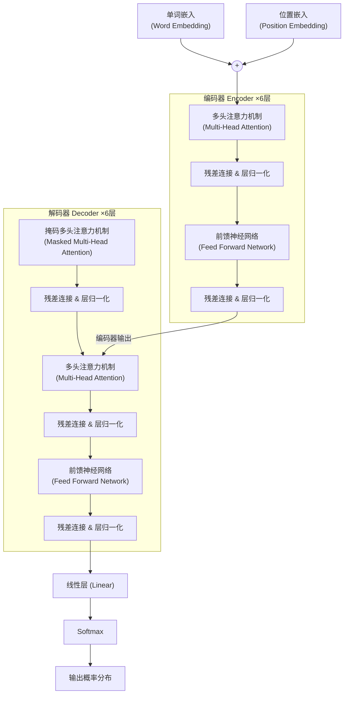
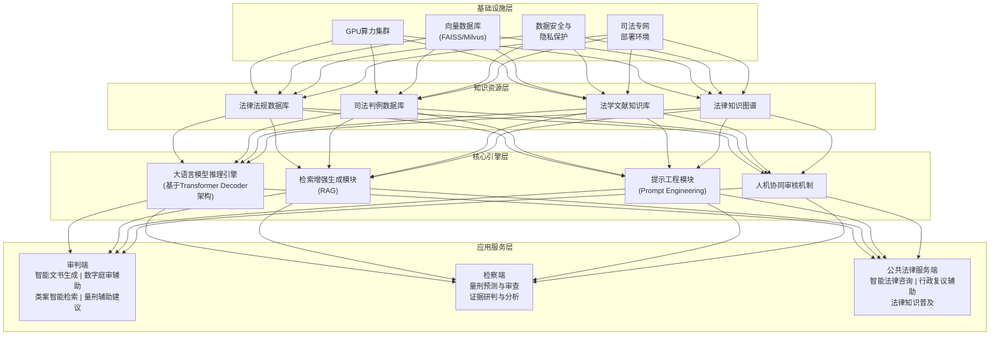
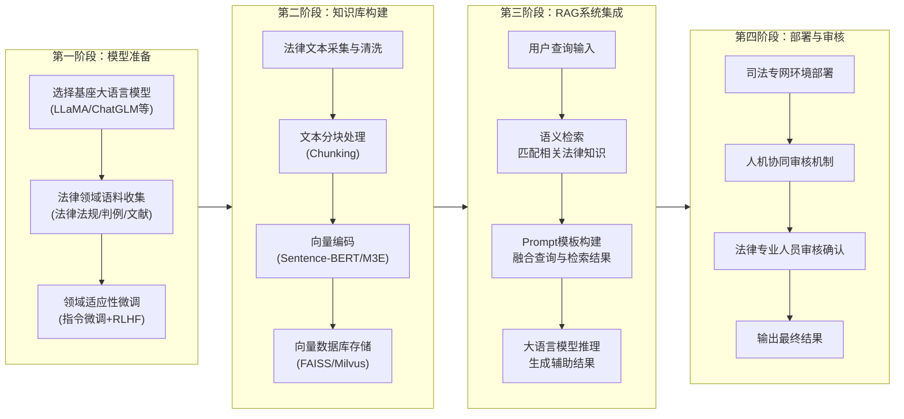
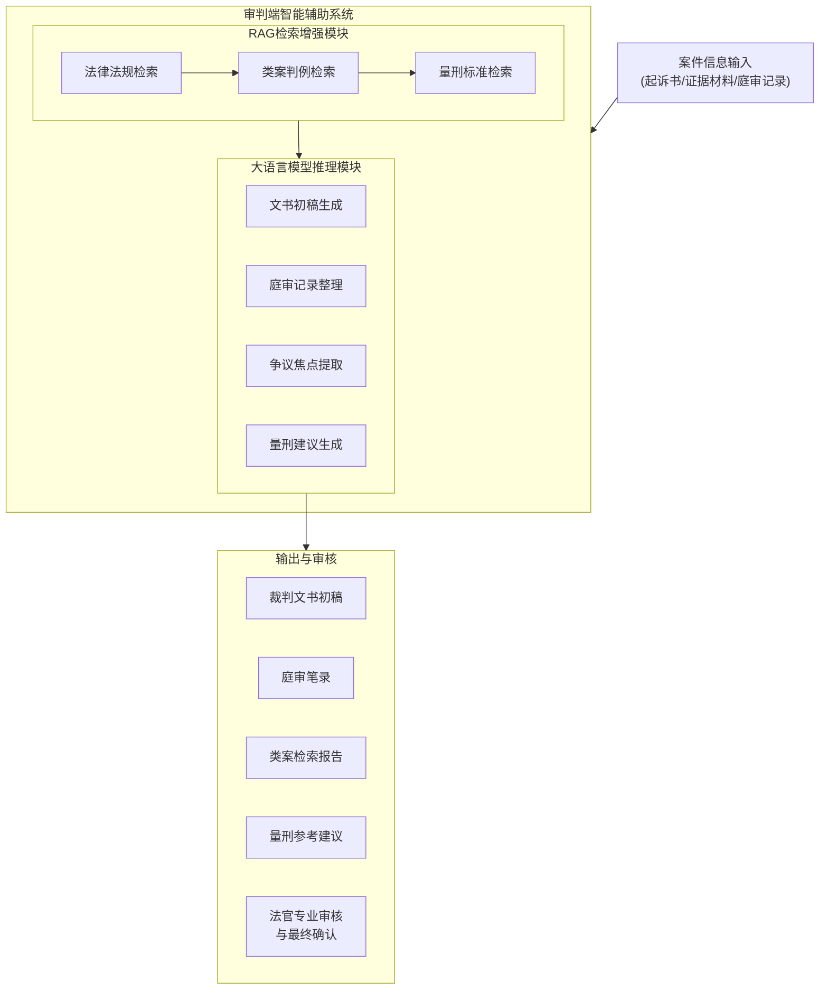
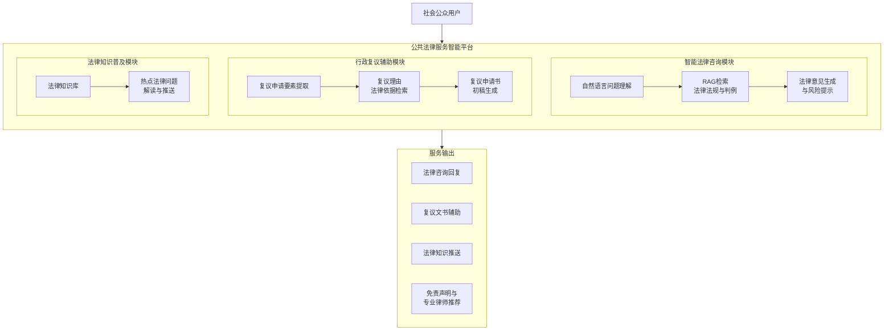
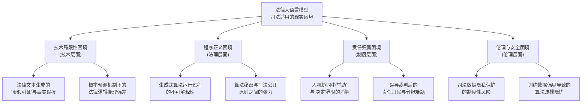
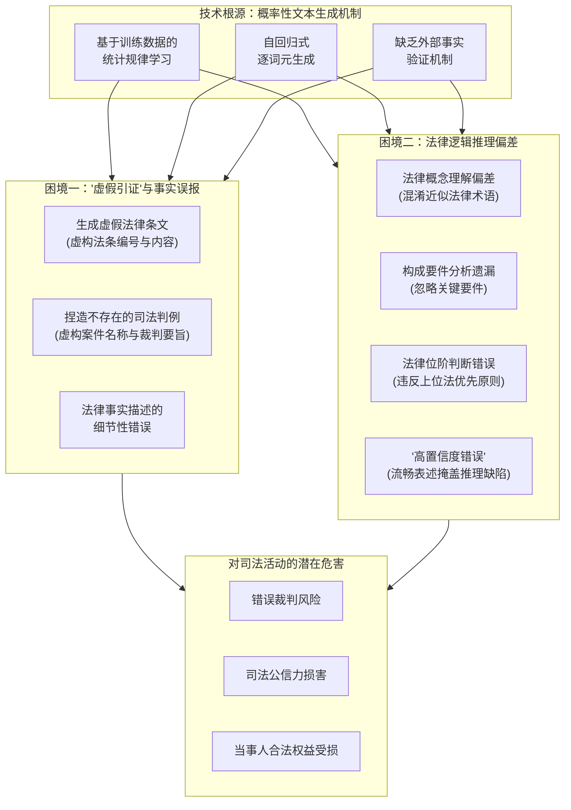
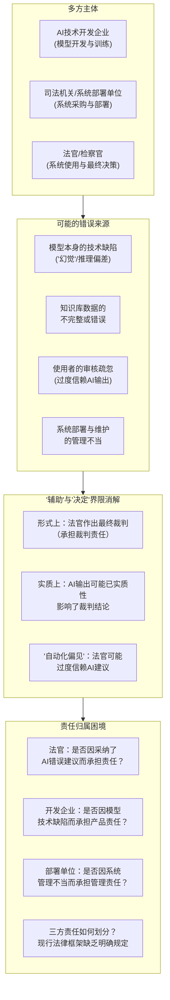

---


解码器同样由6个相同的层堆叠而成，但每层包含三个子层：第一层为掩码多头注意力机制（Masked Multi-Head Attention）层，第二层和第三层分别为多头注意力机制层和全连接前馈神经网络层。解码器的每个子层同样使用残差连接和层归一化处理。当前的大语言模型通常仅采用Transformer的Decoder架构进行构建，通过自回归的方式逐步生成输出文本。Transformer架构的整体结构如图2-1所示。




法律大语言模型司法应用的整体框架如图3-1所示。该框架由基础设施层、知识资源层、核心引擎层和应用服务层四个层次构成，自下而上依次支撑法律大语言模型在司法各环节中的应用部署。



**图3-1 法律大语言模型司法应用整体框架**


法律大语言模型司法应用系统的搭建流程如图3-2所示。






**图3-3 审判端智能辅助系统架构**

### 示。



**图3-5 公共法律服务端智能平台架构**

### 3面、法理层面、制度层面和伦理层面相互交织、彼此关联的系统性问题。为全面把握这些困境的内在逻辑和层次关系，本章构建了法律大语言模型司法适用困境的整体分析框架，如图4-1所示。



**图4-1 法律大语言模型司法适用困境的整体分析框架**

如图4-1所示，法律大语言模型司法适用的困境体系由四个层面构成。技术局限性困境位于整个困境体系的基础层，是其他三类困境产生的技术根源——正是由于大语言模型在事实准确性和推理可靠性方面存在固有缺陷，才进一步引发了程序正义、责任归属和伦理安全等方面的制度性问题。程序正义困境和责任归属困境位于制度层，分别从司法过程的透明度要求和决策后果的责任分配两个维度，揭示了大语言模型司法应用对现有法律制度框架的冲击。伦理与安全困境则涉及数据隐私保护和算法公正性等更为根本的价值层面问题。四类困境之间存在密切的逻辑关联，下文将逐一进行分析。


## 4.2 技术局限性困境：大模型"幻觉"及法律推理不稳定的风险

技术局限性困境是法律大语言模型司法适用面临的最基础也是最直接的问题。如第二章所述，大语言模型的核心工作机制是基于概率分布预测下一个最可能出现的词元，这一机制赋予了模型强大的文本生成能力，但也决定了其输出结果不可避免地存在事实准确性和逻辑严密性方面的缺陷。在司法领域，这些技术缺陷可能导致严重的后果。本节从"虚假引证"与事实误报、法律逻辑推理偏差两个方面进行分析。技术局限性困境的具体表现与生成机理如图4-2所示。



```mermaid

```


**图4-2 技术局限性困境的表现与生成机理**

### 4节从生成式算法的不可解释性、算法秘密与司法公开原则之间的张力两个方面进行分析。程序正义困境的逻辑结构如图4-3所示。

```mermaid
flowchart TB
    subgraph 程序正义要求["程序正义的基本要求"]
        P1["司法公开原则<br/>(裁判过程与依据公开)"]
        P2["当事人知情权<br/>(了解裁判理由的权利)"]
        P3["当事人质证权<br/>(对证据和推理的辩论权利)"]
    end

    subgraph 算法黑箱["大语言模型的'算法黑箱'特征"]
        A1["模型架构的<br/>高度复杂性<br/>(数十亿至万亿参数)"]
        A2["推理过程的<br/>不可还原性<br/>(无法追溯生成逻辑)"]
        A3["商业秘密保护<br/>与技术壁垒<br/>(模型参数与训练数据不公开)"]
    end

    subgraph 困境冲突["程序正义困境"]
        C1["不可解释性困境<br/>法官无法向当事人<br/>解释AI辅助推理过程"]
        C2["质证权落空困境<br/>当事人无法对<br/>算法推理提出有效质疑"]
        C3["知情权虚化困境<br/>当事人不知裁判是否<br/>受到AI输出的实质影响"]
    end

    程序正义要求 --"冲突"--> 算法黑箱
    算法黑箱 --> 困境冲突
```

**图4-3 程序正义困境的逻辑结构**





