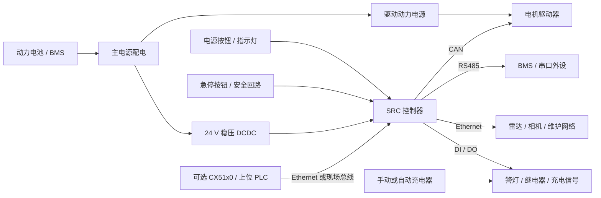

# SRC 控制器开发与使用指南

本文是“复合机器人开发-SRC-1000 的使用与二次开发”任务的主文档，用于把当前目录下的控制器手册、上位 PLC 参考资料和工程经验整理为一份可执行的中文开发使用方案。本文重点面向 AGV、AMR 和复合机器人项目，目标不是逐字翻译原厂手册，而是沉淀一份能直接指导选型、接线、调试、验收和交付的工程文档。

若项目合同、供应商技术协议、认证要求或原厂 PDF 与本文有冲突，应以原始协议和原厂文档为准。本文适合作为项目组内部的设计基线、实施清单和交接材料。

这三份 PDF 实际上可以归并为两套有效资料：

* `SRC-1X00.pdf`：对应 `SRC-1X00` 系列
* `SRC-2000I.pdf` 与 `SRC-2000S.pdf`：对应 `SRC-2000(S)` 系列

目录中还附带了一个参考资料 `cx5100_en.pdf`。本文只把它当作一个可选的上位 Beckhoff 工业控制器来分析，不改变本文以两大 SRC 控制器系列为主的重点。

## 资料清单

| 源文件             | 对应系列                                                  | 版本与日期                                     | 使用建议                                                                                                                                                                                                        |
| --------------- | ----------------------------------------------------- | ----------------------------------------- | ----------------------------------------------------------------------------------------------------------------------------------------------------------------------------------------------------------- |
| `SRC-1X00.pdf`  | `SRC-1X00` 核心控制器                                      | `V1.0`，第一版，2025 年 3 月 11 日                | 重点看第 2 章了解接口定义、电气特性、上电指示与信号逻辑；第 5 章和附录 1 可用于注意事项、首次上电检查和 FAQ。                                                                                                                                               |
| `SRC-2000I.pdf` | `SRC-2000(S)` 系列，包括 `SRC-2000-I(S)` 和 `SRC-2000-F(S)` | `V2.3`，最后修订于 2023 年 10 月                  | 重点看第 3.1、3.2 章了解接口定义和接线行为；第 4 章用于注意事项和首次上电检查；附录 2 为 FAQ。                                                                                                                                                    |
| `SRC-2000S.pdf` | `SRC-2000I.pdf` 的重复副本                                 | 与 `SRC-2000I.pdf` 完全一致                    | 仅作为归档副本使用即可，它与 `SRC-2000I.pdf` 文件内容完全相同。                                                                                                                                                                    |
| `cx5100_en.pdf` | 可选上位 `CX51x0` Beckhoff 平台                             | 英文手册，元数据版本 `2.9`，主题为 `Embedded-PC CX51x0` | 仅在 SRC 控制器之上的 PLC / 工业 PC 集成场景下参考。建议关注 `4 Product overview`、`5 Interface description`、`6 Commissioning`、`7 Configuration`、`9 Error handling and diagnostics`、`10 Care and maintenance`、`12 Technical data`。 |
|                 |                                                       |                                           |                                                                                                                                                                                                             |

`SRC-2000I.pdf` 与 `SRC-2000S.pdf` 文件级完全一致，二者 SHA-256 摘要相同：

`272019BC9C311E6F652B5C97F95FE777115784CEEE8D39E329F951E23C4D6AAA`

## CX51x0 分析说明

`cx5100_en.pdf` 并不是机器人侧 SRC 控制器手册，也不应被当作当前架构中的电机驱动、减速箱或直接动力传动文档。其嵌入式元数据表明它是一份 Beckhoff 文档，主要信息如下：

* 作者：`Beckhoff Automation GmbH & Co. KG`
* 主题：`Embedded-PC CX51x0`
* 标题：`Manual Embedded-PC`
* 关键词：`CX51x0 Manual Embedded-PC cx5100_en version:2.9 lang:en-US`

文档结构也进一步说明，它是 Beckhoff `CX51x0` 嵌入式 PC 手册，而不是专门的驱动链或传动系统文档。主要章节涵盖产品概览、接口说明、调试、配置、诊断、维护和技术参数。目录提取结果中还包含 USB、Ethernet、DVI-I、RS232、RS422/RS485、EtherCAT master、EtherCAT slave、PROFIBUS、CANopen、PROFINET RT 等可选接口，以及 TwinCAT 相关配置主题。

因此，除非后续又补充了独立的驱动器、减速箱、伺服或功率级资料，否则在当前文档体系中，`CX51x0` 不能被描述为独立的动力传输设备。

## 架构定位

在当前文档体系下，架构边界建议明确如下：

* `SRC-1X00` 和 `SRC-2000(S)` 仍然是机器人本体侧的主控制器，负责本地运动相关集成、I/O 接线、电池开关管理、急停接线、充电器信号以及本地设备总线接入。
* `CX51x0` 是可选部件，位于 SRC 层之上，充当 PLC、工业 PC、网关或上位监控控制器。
* `CX51x0` 更适合承担工厂级流程控制、TwinCAT 运行时与 PLC 逻辑、Beckhoff I/O 的 EtherCAT Master 集成、工厂网络网关、诊断、日志、HMI 和 MES 对接等任务。
* 不推荐在当前设计中直接用 `CX51x0` 替代 SRC 控制器。除非整个控制栈、线束归属、现场总线归属以及安全架构一起重构，否则这种替换不成立。
* 如果项目已经使用 SRC 控制器，那么 `CX51x0` 应通过 Ethernet 或现场总线与其连接，不应把本地急停接线、电池开关逻辑或控制器 DCDC 供电要求从 SRC 转移到 `CX51x0` 上。

## CX51x0 的可选集成方式

如果项目确实需要 Beckhoff 上位监督控制，建议把集成范围控制在明确、可追溯的边界内：

| 主题    | 有据可依的关注点                                                                                                                                 | 集成位置                                         |
| ----- | ---------------------------------------------------------------------------------------------------------------------------------------- | -------------------------------------------- |
| 产品身份  | `4 Product overview`、`4.1 Configuration of the CX51x0 Embedded PC`、`4.3 Types`、`4.4 Architecture overview`                               | 用于选择 Beckhoff 硬件型号，并明确它只是上位监督，还是同时承担工厂网络侧功能。 |
| 接口    | `5 Interface description`，包括 USB、Ethernet RJ45、DVI-I、可选 RS232、可选 RS422/RS485、EtherCAT master、EtherCAT slave、PROFIBUS、CANopen、PROFINET RT | 仅用于上位工业集成，不要借这部分去接管已有的 SRC 机器人侧线束。           |
| 调试    | `6 Commissioning`，尤其是安装、允许的安装方向、接电、开机与关机                                                                                                 | 只用于 Beckhoff IPC 本体调试，SRC 的调试流程仍应独立执行。       |
| 配置    | `7 Configuration`，尤其是网口识别、Beckhoff Device Manager 以及 `7.6 TwinCAT`                                                                       | 用于工位或产线控制器通过 PLC 逻辑、Beckhoff 总线工具对机器人进行上位监督。 |
| 诊断与维护 | `9 Error handling and diagnostics`、`10 Care and maintenance`、`12 Technical data`                                                         | 用于 Beckhoff 设备的生命周期维护，不替代 SRC 的诊断体系。         |

可以简单概括为：

* `SRC = 机器人本体侧控制器`
* `CX51x0 = 可选上位工业控制器`

除非后续有明确的重构方案，把运动相关控制权移交给以 Beckhoff 为中心的控制栈，否则这个边界不建议打破。

## 控制器对比

| 项目                | `SRC-1X00`                                      | `SRC-2000(S)`                                                                     | 工程影响                                 |
| ----------------- | ----------------------------------------------- | --------------------------------------------------------------------------------- | ------------------------------------ |
| 文档基线              | `V1.0`，2025 年 3 月 11 日                          | `V2.3`，2023 年 10 月                                                                | `SRC-1X00` 的手册更新。                    |
| 机械尺寸              | `171 x 118.5 x 38 mm`                           | `225.2 x 128 x 83.8 mm`                                                           | `SRC-1X00` 更适合紧凑型机柜。                 |
| 工作温度              | `-30 C ~ 55 C`                                  | `0 C ~ 50 C`                                                                      | `SRC-1X00` 更适合低温环境。                  |
| 存储温度              | `-30 C ~ 70 C`                                  | `-20 C ~ 60 C`                                                                    | `SRC-1X00` 存储条件更宽松。                  |
| 工作湿度              | `10% ~ 90% RH`，无凝露                              | `10% ~ 90% RH`，无凝露                                                                | 湿度范围基本相近。                            |
| 防护等级              | `IP20`                                          | `IP42`                                                                            | `SRC-2000(S)` 更能适应较恶劣的柜内环境。          |
| 控制器功耗             | `12 W`                                          | `48 W`                                                                            | `SRC-1X00` 对散热与供电预算要求更低。             |
| 控制器最小电流（不含 DO 负载） | `24 V` 下 `500 mA`                               | `24 V` 下 `> 2 A`                                                                  | DCDC 选型要按此基线做预算。                     |
| 供电要求              | `24 V` 稳压，纹波 `<= 150 mVpp`                      | `24 V` 稳压，纹波 `<= 150 mVpp`                                                        | 两者供电规则一致。                            |
| DI 数量             | `10`                                            | 新硬件 `11`，旧硬件 `9`                                                                  | 新版 `SRC-2000(S)` 离散输入更多。             |
| DO 数量             | `10` 路 PNP 输出                                   | 新硬件为 `8` 路 Power DO + `2` 路标准 DO                                                  | `SRC-2000(S)` 更适合带载较强的执行器。           |
| DO 电流能力           | `DO8`~`DO9` 可到 `24 V / 1 A`，其余最多 `24 V / 0.4 A` | Power DO 每路最多 `2 A`，总 DO 功率最多 `120 W`，即 `24 V / 5 A`；标准 `DO8` 和 `DO9` 最多 `400 mA` | 负载较大的继电器、刹车、警灯、电磁阀更适合 `SRC-2000(S)`。 |
| CAN               | 共 `3` 路，但 `CAN3` 仅维护使用                          | `2` 路标准 CAN                                                                       | `SRC-1X00` 有 2 路应用 CAN + 1 路维护 CAN。  |
| RS485             | `5` 路：`/dev/RS485_0`、`_1`、`_3`、`_4`、`_6`        | 系列规划基线：`4` 路 RS485 + `1` 路专用电池 RS485                                              | 两个系列都支持混合接入 BMS 和串口设备。               |
| USB               | `2 x USB 3.0`                                   | 新硬件 `4 x USB 3.0`                                                                 | `SRC-2000(S)` 更适合多 USB 外设。           |
| 以太网               | `2` 个千兆交换口 + `1` 个独立 `100 Mbit` 口               | `6` 个千兆交换口 + `1` 个外接 Wi-Fi 客户端 RJ45 口                                             | `SRC-2000(S)` 更适合复杂网络拓扑。             |
| 内置 Wi-Fi          | 双频 `2.4/5 GHz`，双 SMA 天线                         | 双频 `2.4/5 GHz`，手册明确标注为非工业级                                                        | `SRC-2000(S)` 量产项目更建议外接工业 Wi-Fi 客户端。 |
| 急停架构              | `1` 路常闭急停输入 + `1` 对干接点急停输出                      | `1` 路常闭急停输入 + `2` 对干接点急停输出                                                        | `SRC-2000(S)` 更方便把急停信号直接分发给多个设备。     |
| 电池开关架构            | 1 组控制器管理的电池开关 + 1 路手动充电输入                       | 2 组内部互连电池开关 + 手动/自动充电输入                                                           | `SRC-2000(S)` 电池与充电集成更灵活。            |
| 驱动电源切换            | 提取内容中未明确给出专用驱动电源 I/O                            | `2` 路驱动电源输入与输出，每路可达 `10 A`                                                        | `SRC-2000(S)` 更方便做驱动电源门控。            |
| 刹车释放支持            | 提取内容中未看到明确说明                                    | 老硬件有刹车释放输入/输出；新硬件改为 `DI9` 和 `Power DO7`                                           | 使用前务必确认 `SRC-2000(S)` 的硬件版本。         |
| 启动指示              | 手册有详细 LED1 / LED2 状态表                           | 提取内容中未找到等价 LED 状态矩阵                                                               | `SRC-1X00` 现场上电诊断更直接。                |
| 维护限制              | 不允许热插拔，不允许额外装软件，不要与感性负载共用 DCDC                  | 同样限制，另外还禁止修改控制器 IP 或内部设置                                                          | 两者都应按“封闭式设备”看待。                      |

## 控制器选型建议

* 如果机柜空间紧、环境温度低、控制器发热必须小，或者平台对 I/O 和 USB 数量要求不高，优先选 `SRC-1X00`。
* 如果机器人需要更多网口、更多 USB、更强的带电输出、直接驱动电源切换能力，或者属于叉车类 / I/O 较重平台，优先选 `SRC-2000(S)`。
* 如果设计能接受 `10` 路 DI 和 `10` 路相对较轻载的 PNP DO，并且希望侧边接口布局更简单，`SRC-1X00` 更合适。
* 如果设计需要 `8` 路 Power DO、更高总输出功率、两组急停输出，或外接工业 Wi-Fi 客户端方案，`SRC-2000(S)` 更适合。
* 对于新的紧凑型 AMR，配置大致为 1 个激光雷达、1~2 个电机驱动、适中的警灯/继电器负载以及小型电控柜，建议默认 `SRC-1X00`。
* 对于更大的 AMR、叉车或较多外设的平台，尤其是继电器/刹车负载更大、有更多有线网络节点或多 USB 设备时，建议默认 `SRC-2000(S)`。

## 关键接口摘要

本文不在正文中展开原始连接器图纸。完整的插头方向、针脚位置仍应以 PDF 手册为准。下面的表格只提炼关键集成点。

### `SRC-1X00`

#### J2 28 针连接器

| 功能组      | 关键引脚 / 标签                                          | 设计说明                                                      |
| -------- | -------------------------------------------------- | --------------------------------------------------------- |
| 电池通信     | `RS485_A0`、`RS485_B0`、`RS485_GND`                  | 隔离 RS485，手册建议用于电池通信，对应 `/dev/RS485_0`。                    |
| 通用 RS485 | `RS485_A1`、`RS485_B1`、`RS485_A6`、`RS485_B6`        | 可接氛围灯、扫码器及其他串口设备。                                         |
| 应用 CAN   | `CAN_H1`、`CAN_L1`、`CAN_H2`、`CAN_L2`、`CAN_GND`      | `CAN1` 和 `CAN2` 为隔离 CAN，适合接电机驱动。在模型中选择 `port1` 或 `port2`。 |
| 维护 CAN   | 内部 `CAN3` 出现在保留的 `N.C.` 位置                         | `CAN3` 仅用于维护，不要分配给应用设备。                                   |
| 急停输出     | `EM_OUT1-`、`EM_OUT1+`                              | 一对干接点急停输出，最大电流 `120 mA`。                                  |
| 急停输入     | `J2-28` 上的 `EMC_KEY`                               | 一路常闭急停输入。控制器内部上拉，外部常闭开关接通时把线拉低。                           |
| 电源按钮输入   | `J2-27` 上的 `BOOT_KEY`                              | 这里接瞬时按钮 `1NC + 1NO + LED` 的常闭触点。                          |
| 电池开关     | `J2-25` / `J2-26` 上的 `BAT_SWITCH_O`、`BAT_SWITCH_N` | 当控制器负责管理电池开关时，这里接同一个瞬时电源按钮的常开触点。                          |
| 启动灯      | `J2-16`                                            | 为电源指示灯输出 `24 V`，最大 `500 mA`。                              |
| 电池电压检测   | `VBAT_DET`                                         | 只有在控制器充当充电站控制器，或该架构中需要检测电池电压时才使用。                         |

#### J1 32 针连接器

| 功能组      | 关键引脚 / 标签                               | 设计说明                                                    |
| -------- | --------------------------------------- | ------------------------------------------------------- |
| 控制器电源输入  | `J1-17`、`J1-18` 为 `24V input+`，另有多路 GND | 控制器应由独立 `24 V` 稳压 DCDC 供电。                              |
| DO 输出    | `DO_00` 到 `DO_09`                       | 全部为 PNP 高边 `24 V` 输出。`DO8`、`DO9` 最大 `1 A`，其余最大 `0.4 A`。 |
| DI 输入    | `DI_00` 到 `DI_09`                       | 共 10 路 DI。需通过 NPN 型传感器或开关将输入拉低到地来触发。                    |
| 手动充电信号   | `DI_CHG_IN`                             | 当手动充电器接入时，该信号被拉到地。                                      |
| 额外 RS485 | `RS485_3`、`RS485_4`                     | 在模型中对应 `/dev/RS485_3` 与 `/dev/RS485_4`。                 |

#### 外部端口

| 端口组       | 数量  | 设计说明                                           |
| --------- | --- | ---------------------------------------------- |
| RJ45 以太网  | `3` | `ETH1`、`ETH2` 为交换式千兆口，`ETH3` 为独立 `100 Mbit` 口。 |
| USB 3.0   | `2` | 可用于相机或维护设备。                                    |
| SMA Wi-Fi | `2` | 内置双频 Wi-Fi。                                    |
| 音频        | `1` | 一个音频接口。                                        |

### `SRC-2000(S)`

#### TE35 顶部连接器

| 功能组          | 关键引脚                                                  | 设计说明                           |
| ------------ | ----------------------------------------------------- | ------------------------------ |
| 控制器电源输入      | `1`、`13`、`24` 为 `24V input+`；`3`、`14`、`25`、`26` 为 GND | 仍应使用独立 `24 V` 稳压 DCDC 供电。      |
| CAN          | `33/32` 为 `CAN1 H/L`，`31/30` 为 `CAN2 H/L`             | `CAN1`、`CAN2` 适合接电机驱动。         |
| RS485 / 维护串口 | `29/17` 为一路 RS485，`28/16` 为另一路 RS485 或维护串口别名          | 系列概览中还提到一路专用电池 RS485。          |
| 电池开关         | `18/19` 为 battery switch 1，`22/23` 为 battery switch 2 | 两组内部相连。通常做法是电池接 1 组，电源按钮接 2 组。 |
| 手动 / 自动充电    | `27` 为手动充电，`15` 为旧版自动充电，或在新硬件中复用为 `DI10`              | 充电信号有效时均被拉低。                   |
| 电源按钮与指示灯     | `20` 为 mode-1 power key，`21` 为 startup lamp           | 应接瞬时、非自锁按钮。                    |
| 急停输入         | `6`                                                   | 一路常闭急停开关输入。                    |
| 急停输出         | `4/5` 与 `8/9`                                         | 两对干接点急停输出。急停灯与 `Power DO8` 复用。 |
| 报警灯          | `12`                                                  | 与 `Power DO9` 复用。              |

#### TE23 顶部连接器

| 功能组            | 关键引脚                                                 | 设计说明                                   |
| -------------- | ---------------------------------------------------- | -------------------------------------- |
| 额外 RS485       | `1/2`、`3/4`                                          | 为现场设备提供额外 RS485 接口。                    |
| DI 输入          | `DI0` 到 `DI8`，新硬件中 `DI9` 取代原刹车释放功能                   | 仅支持 NPN。悬空或高电平为无效，拉地为有效。               |
| Power DO 及相关输出 | `20`、`21`、`22`、`23`，以及 `15` 和 TE35 上的 power output 位 | 所有 `Power DO` 通道需要结合 TE35 和 TE23 一起规划。 |
| 旧版刹车释放         | 老硬件上的 `17` 与 `15`                                    | 仅老硬件有效，新硬件已经重映射。                       |

#### 侧边接口

| 端口组               | 数量                | 设计说明                                                         |
| ----------------- | ----------------- | ------------------------------------------------------------ |
| 千兆 RJ45 交换口       | `6`               | 机器人内部传感器和设备的主要有线网络扩展口。                                       |
| 外接 Wi-Fi 客户端 RJ45 | `1`               | 用于接工业级 Wi-Fi 客户端。                                            |
| USB 3.0           | `4`               | 单个 USB 设备优先接这些口。手册说明单口 `0.9 A`，总计 `3.6 A`。                   |
| HDMI              | `2`               | 多媒体输出。                                                       |
| Wi-Fi 天线口         | `2`               | 使用 Wi-Fi 时必须两根天线都接好，且不能被金属外壳屏蔽。                              |
| 驱动电源 I/O          | `2` 路输入 + `2` 路输出 | `BAT-IN1/2` 输入，输出到 `Drive-PWR-OUT1/2`，每路最大 `10 A`，回流直接回电池负极。 |

## 开发设计建议

### 1. 电源架构

* 两个系列都应使用独立的 `24 V` 稳压 DCDC 给控制器供电。
* 供电纹波应控制在 `150 mVpp` 及以下。
* 不要让控制器的 DCDC 与电机驱动、接触器、阀、刹车线圈或其他大功率/感性负载共用。
* DCDC 选型时，先按控制器本体基础负载，再叠加最坏情况下的输出负载。
* 对 `SRC-1X00`，基线按约 `12 W` 或 `24 V / 500 mA` 起算，再加上计划中的 DO 负载。
* 对 `SRC-2000(S)`，基线按约 `48 W` 或 `24 V / >2 A` 起算，再加上 `Power DO` 预算。
* `SRC-2000(S)` 的总 DO 功率应控制在 `120 W`，即 `24 V / 5 A` 以内。
* 若电池包提供可控的 battery switch 接口，并且控制器需要管理整车上电，必须严格按手册方式接线并采用控制器管理的上电按钮逻辑。
* 如果 battery switch 闭合后电池输出存在延迟，操作员必须按住电源按钮，直到延迟过去且电源灯亮起，再立即松手。

### 2. 接地与 EMC

* 控制器外壳或金属底座要与车体底盘可靠连接。
* 车体底盘要通过低阻抗路径接地。
* 所有裸露导体和端子都应做好绝缘。
* CAN 与 RS485 线路建议统一使用双绞线。
* 对隔离总线，要接对应的隔离地，不要随意接系统公共地。
* 对非隔离总线，则按手册要求连接控制器系统地。

### 3. 急停设计

* 两个系列都采用常闭型急停输入。
* `SRC-1X00` 提供一对干接点急停输出，用于把急停状态转发给驱动器或安全输入。
* `SRC-2000(S)` 提供两对干接点急停输出，更方便分发给多个驱动通道或外部安全继电器。
* 两个系列的急停输出都只能当低电流信号通路来用，手册给出的干接点电流上限为 `120 mA`。
* 不要直接用这对干接点去带灯、线圈或其他负载。
* 在 `SRC-2000(S)` 上，还要注意急停灯与 `Power DO8` 是复用关系。

### 4. DI 输入策略

* 两个系列都应按 NPN / 下拉有效逻辑来设计。
* 低电平或接地视为有效。
* 悬空或被上拉为无效。
* 若平台必须使用纯 PNP 传感器，需要额外加适配电路。
* `SRC-1X00` 上的专用充电输入建议用于手动充电器检测。
* `SRC-2000(S)` 则可根据电池和充电架构使用手动 / 自动充电输入。

### 5. DO 与执行器策略

* `SRC-1X00` 的 DO 是 `24 V` PNP 高边输出，适合驱动指示灯、小继电器、电磁阀等中小负载。
* 需要注意 `SRC-1X00` 不同通道的能力不同：`DO8`、`DO9` 更强，其余为轻载通道。
* `SRC-2000(S)` 的 `Power DO` 更适合带较大的执行器、继电器线圈、刹车线圈和灯路。
* 所有继电器、接触器、电磁阀及其他感性负载，都必须并联续流二极管。
* 手册推荐的二极管型号为 `SR3100`。
* 接法为：二极管阴极接 DO 输出，阳极接 DO 地。
* 如果感性负载未加续流二极管，手册明确警告可能引发激光雷达通信异常、Linux 崩溃、网络掉线以及 Roboshop 无法连接等问题。

### 6. CAN 与 RS485 规划

* 在 `SRC-1X00` 上，把 `CAN1`、`CAN2` 分配给电机驱动，`CAN3` 保留给维护使用。
* 在 `SRC-1X00` 上，隔离的 `RS485_0` 优先给电池通信。
* `SRC-1X00` 的 `/dev/RS485_1`、`/dev/RS485_3`、`/dev/RS485_4`、`/dev/RS485_6` 可按需分给其他应用设备。
* 对 `SRC-2000(S)`，建议按“`4` 路 RS485 + `1` 路电池专用 RS485”的系列规划来设计。
* `SRC-2000(S)` 手册说明，CAN 与所有 RS485 通道都可以通过软件启用或关闭内部 `120 ohm` 终端电阻。
* 在 `SRC-2000(S)` 的 CAN 串接网络中，如果控制器位于链路一端，应在 Roboshop 中启用控制器侧 `120 ohm` 终端，并在远端驱动器处加另一只 `120 ohm` 终端。
* 一般建议：电机驱动优先走 CAN，像氛围灯、扫码器、相机、电池通信这类设备优先走 RS485。

### 7. Ethernet、Wi-Fi 与 USB

* `SRC-1X00` 上，两个千兆交换口适合作为主机器人局域网，独立的 `100 Mbit` 口可用于设备隔离、维护网络或单独辅助网段。
* `SRC-2000(S)` 的 6 个千兆交换口适合做内部传感器和设备网络扩展。
* `SRC-2000(S)` 的额外 RJ45 口适合接工业 Wi-Fi 客户端。
* `SRC-2000(S)` 手册明确指出其内置 Wi-Fi 为非工业级。如果项目重视在线率、漫游和车队稳定性，建议使用工业级 Wi-Fi 客户端。
* 手册给出的工业 Wi-Fi 客户端示例包括：`Moxa AWK-1137C`、`TP-LINK TL-CPE1300D`、`Siemens SCALANCE W734-1`。
* 在 `SRC-2000(S)` 上使用 Wi-Fi 时，必须接好两根天线，而且天线不能封闭在金属腔体内。
* `SRC-2000(S)` 上单个 USB 设备应优先接 USB 3.0 口。

### 8. 软件配置策略

* Roboshop 应作为总线设置、I/O 行为和终端电阻设置的主要配置入口。
* 在 `SRC-1X00` 上，模型里的 `port1`、`port2` 分别对应 `CAN1`、`CAN2`。
* `SRC-1X00` 的串口设备节点名应严格按手册标注使用。
* `SRC-2000(S)` 上不要擅自修改控制器 IP 地址或内部设置。
* 两个系列都不应在控制器操作系统里安装额外软件包，除非供应商明确批准。
* 尽量把应用层逻辑放在控制器外部，让控制器作为“专用设备”使用，而不是通用 Linux 主机。

## 上电调试与使用流程

### 机械安装

* 两个系列都应安装在刚性好、散热合理的位置。
* 对 `SRC-2000(S)`，手册要求安装平面必须与 X、Y、Z 三轴中的某一轴垂直。
* `SRC-2000(S)` 还应按手册指定的接地点做机壳接地。
* `SRC-1X00` 的提取内容里没有同样详细的安装方向矩阵，因此至少应满足：安装牢固、线束有应力释放、外壳与底盘可靠连接。

### 首次上电流程

建议两个系列都按同样的分阶段流程执行：

1. 检查端子接地与底盘接地。
2. 确认电源正负极没有接反。
3. 再次确认控制器与车体底盘的接地关系。
4. 检查 DCDC 输入正极是否对地短路。
5. 检查 DCDC 输出正极是否对地短路。
6. 检查电机动力电正极是否对地短路。
7. 检查电机动力电极性。
8. 检查激光雷达电源正极是否对地短路。
9. 检查激光雷达电源极性。
10. 第一次带电测试前，先断开激光雷达和电机驱动电源。
11. 先只给控制器上电，确认没有异常。
12. 断电后再接入电机驱动电源，重新测试。
13. 再断电后接入激光雷达电源，继续测试。
14. 只有以上步骤全部通过后，才进入完整系统联调。

### 正常开关机

* 使用瞬时、非自锁按钮。手册不支持自锁式电源按钮。
* `SRC-1X00` 推荐使用 `1NC + 1NO + LED` 的自复位按钮。
* `SRC-2000(S)` 明确要求使用非自锁按钮，并警告不要使用 NC 与 NO 共用错误公共端的按钮结构。
* 两个系列都不建议在日常关机时直接切断电池主电。
* `SRC-2000(S)` 的开机动作是：按住电源键直到启动灯亮，再立即松手。
* `SRC-2000(S)` 的关机动作是：按住电源键约 `2 秒`，松手，等待启动灯熄灭。
* 如果 battery switch 输出有延迟，无论哪个系列，都应适当延长按键保持时间，确保控制器已经真正得到有效供电后再松手。

### `SRC-1X00` 启动 LED 状态说明

`SRC-1X00` 手册给出了详细的 LED 表：

| LED1   | LED2   | 含义                    |
| ------ | ------ | --------------------- |
| 慢闪     | 灭      | 控制器已上电，正在等待串口启动状态信号。  |
| 慢闪     | 慢闪     | 正在等待 Wi-Fi 开机命令。      |
| 常亮     | 慢闪     | 正在等待 `PMU Server` 心跳。 |
| 常亮     | 常亮     | 正常启动完成。               |
| 常亮     | 灭      | `PMU Server` 心跳丢失。    |
| 慢闪     | 常亮     | 当前电源按钮正被按下。           |
| 两灯同时快闪 | 两灯同时快闪 | 固件升级中。                |
| 交替慢闪   | 交替慢闪   | Bootloader 升级中。       |

提取到的 `SRC-2000(S)` 内容中没有找到同等级的 LED 状态矩阵，因此对 `SRC-2000(S)`，更实际的判断方式是看启动灯、总线是否可用以及 Roboshop 是否能连接。

### 充电流程

* 在 `SRC-1X00` 上，未接入手动充电器时，manual charge 信号悬空；接入后被拉到地。
* 在 `SRC-2000(S)` 上，手动和自动充电输入在无效时都悬空，有效时都拉到地。
* `SRC-2000(S)` 新硬件中，自动充电信号与 `DI10` 复用。
* 如果电池由控制器管理，那么 battery switch 与电源按钮的接线必须严格按手册执行，才能保证开机、关机和充电检测逻辑都正常。

### 现场维护规则

* `SRC-1X00` 的 `J1`、`J2` 不允许热插拔。
* `SRC-2000(S)` 的 `TE35`、`TE23` 不允许热插拔。
* 拔插线束前必须确认电池真的已经失电，尤其是在电池并不受控制器管理的情况下。
* 不要在控制器内安装额外软件。
* `SRC-2000(S)` 上不要修改控制器 IP 地址或未文档化的内部设置。
* Wi-Fi 天线不要装在金属封闭空间内。

## 故障排查与 FAQ

| 现象                                                  | 常见原因                            | 建议处理                                |
| --------------------------------------------------- | ------------------------------- | ----------------------------------- |
| 按下电源按钮后控制器无法保持开机                                    | battery switch 输出有延迟，或者电源按钮松得太早 | 按住按钮时间要长于电池输出延迟，待启动灯亮后立即松开。         |
| `SRC-2000(S)` 上电源按钮线缆松动导致异常开机                       | 控制器把断线误判为长按                     | 修复按键线缆，并重新核对按钮接线。                   |
| 继电器或接触器动作时引发激光雷达故障、Linux 崩溃或网络掉线                    | 感性负载没有并联续流二极管                   | 给负载并联续流二极管，手册推荐 `SR3100`。           |
| Roboshop 无法连接，`192.168.192.4` 或 `192.168.192.5` 无响应 | 同样可能是感性负载干扰问题                   | 先解决执行器抑制问题，再重新上电测试。                 |
| DI 一直无法触发                                           | 传感器没有把输入拉到地，或者用了纯 PNP 传感器       | 换成 NPN / 下拉型逻辑，并确认有效态时 DI 被拉低。      |
| 急停输出表现异常                                            | 输出负载过大，或接错了触点对                  | 急停干接点只作为低电流信号使用，且负载应低于 `120 mA`。    |
| `SRC-2000(S)` 的 Wi-Fi 在量产现场不稳定                      | 内置 Wi-Fi 为非工业级                  | 使用额外 RJ45 口外接工业 Wi-Fi 客户端。          |
| 需要移动一台断电的 `SRC-2000(S)` 机器人                         | 误以为新硬件仍保留刹车释放功能                 | 先确认硬件版本。新版本已取消旧刹车释放功能，并复用了这些针脚。     |
| 重新插接线束后控制器损坏或运行不稳                                   | 带电热插拔                           | 重新接线前必须确保整机完全失电。                    |
| `SRC-2000(S)` 卡住且无法正常关机                             | 固件或系统异常卡死                       | 按住电源键超过 `2 秒`，松开后等待约 `1 分钟` 进行强制关机。 |

## 实用构建建议

* 对于新做的紧凑型 AMR，只有 1~2 路驱动、USB 设备不多、只需 1 路电池串口通信，并且有小空间或低温环境约束时，优先选 `SRC-1X00`。
* 对于叉车改型平台、大型 AMR，或者外设多、带电输出多、有驱动电源切换需求的平台，优先选 `SRC-2000(S)`。
* 电池通信尽量放在隔离程度最高的串口通道上。
* 电机驱动优先走 CAN，不要优先走 RS485。
* 所有高能量切换负载都不要挂在控制器 DCDC 上。
* 首套线束建议优先使用手册要求的原厂连接器配件。
* 详细线束设计和电气评审阶段，建议始终保留原始 PDF，因为 PDF 中包含完整连接器图和参考原理图。

## 最低验收清单

当以下条件都满足时，可以认为设计已具备继续推进的基础：

* 所选控制器系列与机柜空间、I/O、网络和供电要求匹配。
* 电源预算中已包含控制器基础负载和 DO 最坏工况负载。
* 急停输入、急停输出、电源按钮接线和 battery switch 接线都已定义。
* DI 逻辑已经确认采用 NPN / 下拉方式。
* 所有感性负载都已加装续流二极管。
* CAN / RS485 的线缆类型、接地和终端策略都已文档化。
* Wi-Fi 方案已经明确，包括是否需要外接工业级 Wi-Fi 客户端。
* 首次上电计划按分阶段调试执行，而不是整机一次性全带载启动。
* 没有人打算热插拔控制器线束，也没有人在计划往控制器里安装额外软件。

## 完整开发使用方案

本章把前文的资料整理、接口摘要和经验建议收敛成一套可执行的实施方案，适合作为项目立项后的开发主线。

### 方案目标

本文方案默认满足以下目标：

* 完成 `SRC-1X00` 或 `SRC-2000(S)` 的控制器选型。
* 完成控制器与电池、DCDC、驱动器、BMS、传感器、急停和充电接口的电气集成。
* 明确控制器内外的软件边界，避免把 SRC 控制器误用为通用工业 PC。
* 形成可重复执行的上电、调试、验收和交付流程。

### 适用范围

本文适用于以下场景：

* 新做 AMR / AGV / 复合机器人整机的控制器方案设计。
* 现有平台从零搭建 `SRC-1X00` 或 `SRC-2000(S)` 电控系统。
* 在 SRC 控制器之上叠加 `CX51x0` 作为上位 PLC / IPC 的场景。
* 需要对项目成员进行内部培训、评审和交接的场景。

本文不覆盖以下内容：

* 对 SRC 控制器内部固件做未授权修改。
* 绕开原厂工具对内部操作系统做深度定制。
* 安全回路认证本身的法规论证。
* 原厂未公开接口的逆向分析。

## 典型系统架构

### 架构总原则

* `SRC = 机器人本体侧控制器`。
* `CX51x0 = 可选上位控制器，不替代 SRC 本体职责`。
* 动力供电、控制供电、安全回路、通信总线必须在架构图和接线图中分层表达。
* 所有大功率和感性负载都应与控制器 DCDC 供电域隔离。

### 推荐架构图

### 典型架构分工

| 模块 | 主要职责 | 默认归属 |
| --- | --- | --- |
| SRC 控制器 | 车体控制、I/O、驱动器接入、急停链路、本地总线和充电相关逻辑 | 必选 |
| 动力电池与 BMS | 提供主电源、状态信息、充放电协同 | 必选 |
| DCDC | 给控制器和低功率辅件提供稳定 `24 V` | 必选 |
| 电机驱动器 | 闭环驱动电机和执行器 | 必选 |
| 雷达 / 相机 / 辅助传感器 | 环境感知和上位应用支撑 | 按项目需要 |
| `CX51x0` | 工厂级逻辑、上位流程控制、HMI、日志、MES 对接 | 可选 |

## 典型硬件实施方案

### 方案 A：紧凑型 AMR，优先 `SRC-1X00`

适用条件：

* 电机驱动数量不多，通常为 `1~2` 路。
* 机柜空间紧凑，对散热和功耗敏感。
* I/O、USB 和网络扩展需求适中。

建议配置：

* 控制器：`SRC-1X00`
* 供电：独立 `24 V` 稳压 DCDC
* 驱动器通信：`CAN1` / `CAN2`
* 电池通信：隔离 `RS485_0`
* 维护总线：保留 `CAN3`
* 维护网络：独立 `100 Mbit` 口

### 方案 B：外设较多的平台，优先 `SRC-2000(S)`

适用条件：

* 网络节点多、USB 外设多、I/O 较重。
* 需要较强的带电输出能力或驱动电源切换能力。
* 平台更大，或属于叉车类、重载 AMR 类产品。

建议配置：

* 控制器：`SRC-2000(S)`
* 供电：独立 `24 V` 稳压 DCDC，按控制器基础负载加 `Power DO` 最坏工况预算
* 驱动器通信：标准 CAN
* 电池通信：专用 RS485
* 网络扩展：多千兆交换口 + 工业 Wi-Fi 客户端
* 急停分发：两对干接点输出分别分配给驱动器和安全继电器链路

### 方案 C：SRC + `CX51x0` 上位联动

适用条件：

* 项目需要 PLC 流程控制、产线接口、HMI、日志或 MES 对接。
* 机器人本体控制仍由 SRC 承担，不改动本体控制边界。

建议配置：

* 本体控制器：`SRC-1X00` 或 `SRC-2000(S)`
* 上位控制器：`CX51x0`
* 上下层通信：优先 `Ethernet`，必要时使用现场总线
* 上位职责：任务编排、数据记录、可视化、产线联动
* 下位职责：运动相关集成、本地 I/O、安全输入、上电与充电逻辑

## 工程实施流程

### 阶段 1：需求冻结

在选型前必须冻结以下输入：

* 驱动器数量与通信类型
* 电池类型、BMS 接口和充电方式
* 急停链路数量与安全回路结构
* 雷达、相机、警灯、继电器、刹车、接触器等外设清单
* 网络节点数量、维护网需求和 Wi-Fi 方案
* 机柜空间、散热和环境温度边界

本阶段交付物：

* 《控制器选型输入表》
* 《外设清单与功率预算表》
* 《安全回路输入表》

### 阶段 2：控制器选型

选型过程建议按以下顺序执行：

1. 先按机柜空间、功耗和环境边界筛掉不适合的控制器。
2. 再按 I/O、USB、网口和 DO 负载能力确认是否需要 `SRC-2000(S)`。
3. 最后确认电池管理、充电和急停分发是否与控制器能力匹配。

本阶段交付物：

* 《SRC 控制器选型结论》
* 《控制器能力对照表》
* 《选型风险与假设说明》

### 阶段 3：电气设计

本阶段应完成：

* 电源原理图
* 控制器连接器分配表
* DI / DO 点位表
* CAN / RS485 / Ethernet 拓扑图
* 急停和充电接口逻辑图
* 接地与屏蔽策略说明

电气设计评审必须回答这几个问题：

* DCDC 是否独立，纹波和电流预算是否满足要求。
* 所有感性负载是否已加续流二极管。
* DI 是否按 NPN / 下拉逻辑设计。
* 急停输出是否只承担低电流信号，不直接带负载。
* 电池管理和电源按钮逻辑是否与控制器手册一致。

### 阶段 4：软件与参数化配置

本阶段重点不是“给控制器装软件”，而是完成参数化和系统集成配置：

* 在 Roboshop 中建立总线、I/O、终端电阻与设备参数
* 完成电机驱动映射和串口外设映射
* 完成网络地址规划
* 完成故障、急停、低电压、充电等状态机逻辑配置
* 完成参数备份和版本归档

本阶段交付物：

* 《Roboshop 配置备份》
* 《通信映射表》
* 《状态机与报警表》
* 《版本记录表》

### 阶段 5：台架调试

台架调试建议按“控制器单独上电 -> 驱动器接入 -> 外设接入 -> 整机联调”推进。

本阶段必须验证：

* 控制器独立上电稳定
* 按键、急停、充电、指示灯逻辑正确
* CAN / RS485 / Ethernet 通信稳定
* 雷达和关键外设接入后系统不掉线
* DO 带感性负载动作时无复位、死机或网络中断

### 阶段 6：整车联调与试运行

本阶段建议分三层推进：

* 低风险层：状态显示、按键、报警、充电信号
* 中风险层：驱动器使能、刹车、继电器和底盘动作
* 高风险层：整车运动、路径、联动和边界工况测试

## 软件开发与二次开发边界

### 推荐的软件边界

| 层级 | 推荐职责 | 是否建议放在 SRC 内部 |
| --- | --- | --- |
| 控制器参数层 | 总线参数、I/O 映射、基础设备接入 | 是 |
| 本体逻辑层 | 上电、使能、急停、充电、基础联锁 | 是 |
| 项目应用层 | 复杂业务逻辑、调度、任务编排、数据统计 | 否，优先外置 |
| 工厂集成层 | PLC、MES、产线通信、HMI、日志平台 | 否，优先外置 |

### 推荐状态机

建议项目统一采用下面的状态机命名，避免不同人员理解不一致：

| 状态 | 含义 | 进入条件 | 退出条件 |
| --- | --- | --- | --- |
| `INIT` | 上电初始化 | 控制器启动 | 自检通过 |
| `SELF_CHECK` | 设备和总线自检 | `INIT` 完成 | 无关键故障 |
| `STANDBY` | 待机 | 自检通过 | 允许使能 |
| `ENABLED` | 驱动上使能 | 待机且允许 | 收到运动命令或转故障 |
| `RUNNING` | 执行运动 | 驱动使能且命令有效 | 任务结束或触发异常 |
| `CHARGING` | 充电状态 | 检测到充电流程 | 充电结束或中断 |
| `ESTOP` | 急停状态 | 急停触发 | 急停解除并重新上电或复位 |
| `FAULT` | 故障状态 | 关键故障出现 | 故障消除后复位 |

### 推荐软件交付件

* 参数导出文件
* I/O 映射表
* 驱动器节点表
* 网络地址表
* 状态机说明
* 报警码清单
* 版本发布记录

## 典型接线与分配策略

### 电源分配原则

* 控制器电源与大功率执行器电源分层。
* 先算控制器基础负载，再叠加 DO 最坏工况负载。
* 任何继电器、接触器、阀和刹车线圈都不能直接把反灌干扰带回控制器 DCDC。

### 推荐 I/O 分配方式

| 类型 | 建议接入对象 | 说明 |
| --- | --- | --- |
| DI | 急停输入、充电检测、限位、模式开关 | 统一按下拉有效设计 |
| 标准 DO | 指示灯、小继电器、状态输出 | 注意单点电流能力 |
| Power DO | 接触器、刹车、较大线圈负载 | 优先放在 `SRC-2000(S)` |
| RS485 | BMS、仪表、低速串口外设 | 电池通信优先隔离通道 |
| CAN | 电机驱动器、需要实时性的总线设备 | 终端电阻必须成链路规划 |
| Ethernet | 雷达、相机、维护网、上位设备 | 与业务网络、维护网络区分 |

### 推荐网络分区

| 网络 | 建议用途 |
| --- | --- |
| 本体控制网 | 驱动器、核心传感器、必要设备 |
| 维护网 | 调试、日志抓取、设备维护 |
| 工厂网 | PLC、MES、上位调度和产线对接 |

## 调试与验证计划

### 调试顺序

1. 控制器空载上电
2. 电源按钮、指示灯、急停链路验证
3. 接入驱动器但不动作
4. 单总线验证 CAN / RS485 / Ethernet
5. 接入雷达和关键传感器
6. 验证充电链路
7. 驱动器低速动作
8. 整机联调
9. 边界条件验证

### 台架调试检查表

| 检查项 | 通过标准 |
| --- | --- |
| 控制器单独上电 | 无复位、无异常发热、无异味 |
| 电源按钮逻辑 | 开机、关机与手册一致 |
| 急停输入 | 触发后可立即进入急停态 |
| 急停输出 | 可稳定传递低电流安全信号 |
| DI 输入 | 低电平有效逻辑正确 |
| DO 输出 | 动作时不引发控制器异常 |
| CAN 总线 | 节点上线稳定、终端电阻正确 |
| RS485 | 通信稳定，无明显丢帧 |
| Ethernet | 设备可发现、可通信、可维护 |

### 整车联调检查表

| 检查项 | 通过标准 |
| --- | --- |
| 驱动器使能 | 上使能和去使能动作正确 |
| 底盘正反转 | 方向、速度和反馈一致 |
| 低电压保护 | 欠压时能进入预期保护状态 |
| 充电流程 | 手动或自动充电检测正确 |
| 雷达接入 | 通信稳定，不因负载干扰掉线 |
| 长时间运行 | 连续运行无重启、掉线或异常日志 |

## 正式验收标准

相较于前文“最低验收清单”，正式验收用于项目交付或阶段里程碑评审。

| 验收类别 | 验收标准 | 证据 |
| --- | --- | --- |
| 选型 | 控制器能力与项目约束匹配 | 选型结论文档 |
| 电源 | DCDC、电流预算、纹波和负载隔离明确 | 电源预算表、原理图 |
| 接线 | 控制器端子和外设接线均有文档 | 接线图、端子分配表 |
| 软件参数 | 所有关键参数可追溯、可回退 | 参数备份、版本记录 |
| 安全 | 急停、充电、欠压、故障联锁验证通过 | 测试记录 |
| 通信 | CAN / RS485 / Ethernet 稳定 | 联调记录、抓包或日志 |
| 运行 | 台架和整车测试通过 | 调试记录、视频或报告 |
| 交接 | 维护人员具备基本操作能力 | 培训记录、SOP |

## 建议交付物清单

项目结束前建议至少形成以下交付物：

* 《SRC 控制器选型结论》
* 《控制器能力对照表》
* 《供电预算表》
* 《端子与线束分配表》
* 《I/O 映射表》
* 《CAN / RS485 / Ethernet 拓扑图》
* 《急停与充电逻辑说明》
* 《Roboshop 配置备份》
* 《版本发布与变更记录》
* 《首次上电记录》
* 《整车联调记录》
* 《验收报告》
* 《现场维护 SOP》

## 推荐结论

如果项目当前目标是尽快形成一套稳妥、可交付的开发使用方案，建议按以下默认策略推进：

* 新做紧凑型 AMR，默认优先 `SRC-1X00`。
* 外设较多、带电输出较重的平台，默认优先 `SRC-2000(S)`。
* `CX51x0` 只作为上位 PLC / IPC 选项，不作为 SRC 的替代者。
* 所有开发工作以“参数化配置 + 外部应用集成”为主，不以改造控制器内部系统为主。
* 所有交付必须留下可追溯文档，而不是只停留在口头经验和现场调通状态。

> [!summary]
> 这份文档现在可作为该任务的正式主文档使用：
> 既包含资料整理、选型对比、接口与接线要点，也包含完整的实施流程、软件边界、调试计划、验收标准和交付物清单。
