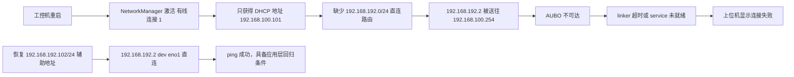

# MFMS 0812 Bug：重启后 AUBO 连接失败与设备网辅助地址丢失

> [!abstract] 结论
> 上位机没有真正“连接成功后断开”。重启后，工控机的 NetworkManager profile 只恢复了 DHCP 地址 `192.168.100.101/24`，丢失了访问 AUBO 所需的辅助地址 `192.168.192.102/24`。因此到 `robAub0001=192.168.192.2` 的流量错误地走默认网关，AUBO 连接请求最终超时或 service 未就绪。

本次网络层已经通过 SSH 修复并验证：`eno1` 同时拥有 `192.168.100.101/24` 与 `192.168.192.102/24`，到 AUBO 的路由变为直连，ping `3/3` 成功。MFMS/HyRMS 在重启后没有自动启动，应用层连接还需要单独回归。

## 1. Bug 基本信息

| 项目 | 内容 |
| --- | --- |
| 发生时间 | 2026-08-12 |
| 用户反馈 | 测试人员认为“连接成功后一秒立刻断开” |
| 实际症状 | `robot.connect` 没有成功回包，随后返回 `-2007` 或 `-2004` |
| 目标设备 | `robAub0001`，AUBO 控制器 `192.168.192.2` |
| 工控机 SSH 链路 | `enp7s0=10.10.10.2/24` |
| 工控机设备网 | `eno1=192.168.192.102/24`（本次恢复） |
| Mac 调试链路 | USB 10/100 LAN，`10.10.10.1/24` |
| 网络层状态 | 已修复，AUBO ping `3/3` 成功 |
| 应用层状态 | 待启动 MFMS/HyRMS 后回归 |

相关的基础拓扑和 SSH 连接方式见 [[MFMS工控机网络修复记录-多网卡路由与SSH直连]]。

## 2. 日志证据：不是成功后的断开

0812 的三次 MFMS 会话共记录 16 次 `robot.connect`：

- `cmd.result success=true`：0 次；
- `robot.disconnect`：0 次；
- `connected -> offline`：0 次；
- 所有连接结果都是 `success=false`。

| 日志表现 | 含义 |
| --- | --- |
| `-2007`，约 1 秒后返回 | `RobotProxyAdapter` 等待 `/robAub0001_cmd` service 1 秒仍未就绪 |
| `linker 发送指令超时`，错误 `-1001` | 本地 proxy 发给 linker 的请求没有在约 3 秒内收到响应 |
| 上层结果 `-2004` | 适配器把下层连接失败统一归类为 `CONNECT_FAILED` |
| `ros.stale dev=robAub0001` | `/robAub0001_state` 没有持续提供有效状态数据 |

典型时间线：

```text
17:03:34.288  robot.connect 发起
17:03:35.303  返回 -2007，service not ready

16:08:31.638  proxy -> linker
16:08:34.640  linker 发送指令超时 -1001
16:08:34.643  上层结果 -2004
```

所以“一秒”对应的是 service readiness 的等待超时，不是连接建立后的断开延迟。

## 3. 根因链



### 3.1 已确认的事实

1. `10.10.10.2` 是工控机的 SSH 调试地址，不是 AUBO 地址。
2. AUBO 位于 `192.168.192.0/24`，需要工控机 `eno1` 的 `192.168.192.102/24` 辅助地址。
3. 重启后的 NetworkManager 日志显示：`eno1` 只通过 DHCP 获得 `192.168.100.101`，随后直接进入 activated 状态。
4. 重启后执行 `nmcli connection show "有线连接 1"` 显示 `ipv4.method=auto`，但 `ipv4.addresses=--`。
5. 修复前 `ip route get 192.168.192.2` 为：

   ```text
   192.168.192.2 via 192.168.100.254 dev eno1 src 192.168.100.101
   ```

6. 修复后路由变为：

   ```text
   192.168.192.2 dev eno1 src 192.168.192.102
   ```

### 3.2 为什么昨天正常、今天重启后异常

上一轮运行时，`eno1` 上存在设备网辅助地址，所以 AUBO 流量可以直连；重启后，NetworkManager 重新激活 profile 时只应用了 DHCP 配置，静态辅助地址没有随 profile 恢复。

目前能确定的是“开机时 profile 中没有该地址”，但日志无法证明是谁在什么时候删除或覆盖了这条配置。可能性包括：

- 辅助地址曾经只用 `ip addr add` 临时添加，没有写入 NetworkManager；
- NetworkManager profile 被重建或被其他配置覆盖；
- 修改只作用于运行时状态，未持久化到当前 profile。

这些是待确认的配置变更来源，不能把其中任一项当成已证实结论。当前修复已经使用 `nmcli connection modify` 写入 profile，属于持久配置。

## 4. 修复过程

在工控机上对 `有线连接 1` 执行：

```bash
sudo nmcli connection modify "有线连接 1" \
  +ipv4.addresses 192.168.192.102/24

sudo nmcli connection up "有线连接 1"
```

这里使用 `+ipv4.addresses` 是为了在保留 DHCP 的同时追加第二个 IPv4 地址；不能把 `ipv4.method` 改成纯手动，也不能给 `192.168.192.102/24` 添加第二个默认网关或 DNS。

修复后的验收结果：

```text
eno1: 192.168.192.102/24 192.168.100.101/24
192.168.192.2 dev eno1 src 192.168.192.102
ping 192.168.192.2: 3 packets transmitted, 3 received, 0% packet loss
```

## 5. 应用层回归计划

修复网络后，重启后的工控机上没有自动启动 MFMS/HyRMS，ROS 图为空。因此网络修复已经验证，但 AUBO 的 MFMS 连接按钮还没有重新执行。

启动 MFMS/HyRMS 后，先做只读检查：

```bash
source /opt/ros/humble/setup.bash
source /home/norco/Desktop/code/Reconstructed-MFMS/install/setup.bash

ros2 node list
ros2 service list | grep -F robAub0001
ros2 topic list | grep -F robAub0001
timeout 8s ros2 topic echo --once /robAub0001_state
```

确认 `/robAub0001_state` 有实际消息、`/robAub0001_cmd` 存在后，再由现场人员点击连接按钮。不要用 `ros2 service call` 代替 UI 回归，避免绕过现场安全流程发送设备命令。

## 6. 预防措施

- 每次重启后先检查 `nmcli connection show "有线连接 1"`，确认 `ipv4.method=auto` 且包含 `192.168.192.102/24`。
- 检查 `ip route get 192.168.192.2`，预期必须是 `dev eno1 src 192.168.192.102`，不能经过 `192.168.100.254`。
- 启动 MFMS 前执行 AUBO ping 和 `/robAub0001_state` 状态检查。
- 将 NetworkManager profile 作为唯一配置来源，避免只用 `ip addr add` 添加运行时地址。
- 如果再次丢失，优先查看 `journalctl -u NetworkManager -b`，比较 profile 激活日志和 `ipv4.addresses`，再判断是否发生 profile 重建或配置覆盖。

## 7. 调试经验

| 经验 | 说明 |
| --- | --- |
| ROS 图存在不等于设备可达 | `/robAub0001_cmd`、proxy、publisher 出现在 `ros2 service/topic list` 中，只说明本机 ROS discovery 正常；仍需验证设备网路由和状态消息。 |
| “一秒断开”先看结果码 | `-2007` 的一秒来自 1 秒 service readiness 等待，必须先区分“连接失败”与“连接后断开”。 |
| DHCP 正常不代表设备网正常 | `192.168.100.101` 能上网，只说明默认网段正常；AUBO 仍需要 `192.168.192.102` 的直连地址。 |
| 重启是持久化配置测试 | 重启前能 ping、重启后不能 ping，优先检查 NetworkManager profile，而不是先改 MFMS 连接状态机。 |

## 8. 关联笔记

- [[MFMS工控机网络修复记录-多网卡路由与SSH直连]]：记录多网卡拓扑、SSH 直连和正确的 DHCP + 设备网双地址方案。
- [[MFMS现场Bug修复日志-数据库、弹窗、双窗口与组连接]]：记录现场连接链路、设备状态和上位机连接边界问题。

## 更新记录

| 日期 | 变更 |
| --- | --- |
| 2026-08-12 | 记录重启后 `192.168.192.102/24` 丢失导致 AUBO 连接失败的现场故障；完成网络层修复和 ping 验收。 |
