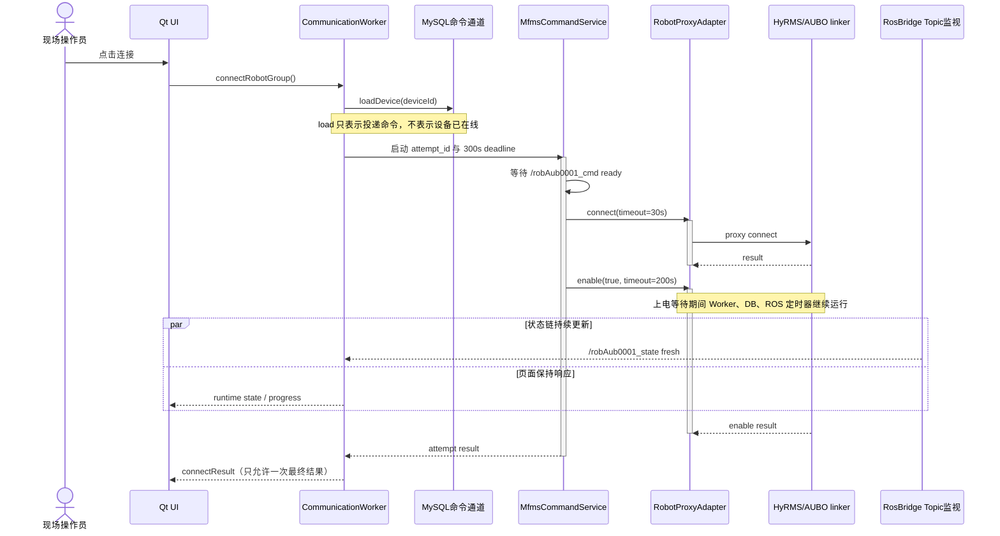

# MFMS 0820 现场修复记录：异步连接、日志与实时可视化

> [!abstract] 最终结论
> 本轮把“连接按钮假失败、首页报警读不到、AGV 到点弹窗重复、Myviz 无模型或模型不动、AUBO 姿态错误”拆成了多条独立链路处理。现场最终确认 AGV 模型可以随真实位姿运动；AUBO 与 AGV 的状态 Topic、Myviz 中间状态和 TF 也能够分层观测。可视化修复已经随 `f85ac05` 合入 `main`。

这次排查不是单一 Bug，而是连接生命周期、日志路径、ROS 消息类型、设备 Topic 选择、RViz 坐标变换和 UI 回调重入叠加后的结果。理解数据中台边界时可先读 [[MFMS数据中台技术文档-架构线程与代理层]]；网络基础见 [[MFMS工控机网络修复记录-多网卡路由与SSH直连]]；此前的现场连接问题见 [[MFMS现场Bug修复日志-数据库、弹窗、双窗口与组连接]]。

## 1. 现场环境与范围

| 项目 | 现场值 |
| --- | --- |
| SSH 入口 | `norco@192.168.58.151:6622` |
| 工控机主机名 | `norco-Default-string` |
| 上位机工程 | `/home/norco/Desktop/code/Reconstructed-MFMS` |
| 下位机工程 | `/home/norco/Desktop/code/HyRMS_0722/HyRMS` |
| 有线测试口 | `192.168.100.104:22` |
| 设备网地址 | `192.168.192.80/24` |
| AUBO 状态 Topic | `/robAub0001_state` |
| AGV 状态 Topic | `/agvSrc0001_state` |

SSH 入口 `192.168.58.151:6622` 与有线测试口 `192.168.100.104:22` 指向同一台工控机：远程检查时主机名相同，且 `enp6s0` 上可见 `192.168.100.104/24`。因此后续日志、ROS 图和进程检查都来自现场工控机，不是 Mac 本地模拟环境。

> [!warning] 真机边界
> 状态 Topic、日志、节点图和 TF 都可以只读检查；机械臂或 AGV 的运动命令必须由现场人员明确触发。不能为了验证动画而擅自发送真机运动指令。

## 2. 修复总表

| # | 现象 | 根因 | 修复 | 状态 |
| --- | --- | --- | --- | --- |
| 1 | AUBO 已上电，但上位机按钮仍显示连接失败 | `connect + enable` 同步阻塞，旧 3 秒超时早于现场上电完成 | 两阶段后台连接；普通 RPC 30 秒、AUBO connect 30 秒、enable 200 秒、整体 300 秒 | 已实现并现场使用；最终 30 秒参数未重新跑自动测试 |
| 2 | Topic、DB 和定时器在连接期间停顿 | 长 RPC 占用数据中台工作线程 | 命令任务放入可跟踪后台执行器，结果回到所属线程处理 | 自动回归通过 |
| 3 | DB 状态与真实在线状态互相覆盖 | 把 `device_state.state` 同时当命令和事实 | DB 只承载 `load/unload`；cmd ready 与 Topic fresh 推导运行态 | 自动回归通过 |
| 4 | 首页实时报警为空 | 日志路径写死到旧用户、旧工程和单个旧文件 | 每次从当前月份目录选择最新 `hyrms_*.log` 并重挂 watcher | 已合入 `de03158` |
| 5 | AGV 到点弹窗要点多次 OK | 通知发出后才清 pending，模态回调重入时重复命中旧状态 | 发通知前先保存站点名并清空 pending | 已合入 `de03158` |
| 6 | Myviz 左侧没有机器人模型 | RViz 后端未按实际连接设备 Topic 重启/切换 | 连接成功后同步 ARM 与 AGV Topic，再启动对应后端 | 已合入 `f85ac05` |
| 7 | AGV/机械臂模型闪烁或姿态错误 | AUBO 被当作 FR 消息订阅，外部绝对关节角又叠加校准零位 | AUBO 使用 `AuboRobotState`；显示模式不再叠加保存零位 | 已合入 `f85ac05` |
| 8 | 认为“页面不刷新” | 有时源 Topic 本身静止；另一次真实移动时链路实际正常 | 分层比较原始 Topic、`/myviz/odom`/`joint_states` 与 TF | 现场确认 AGV 已能运动 |

## 3. AUBO 异步两阶段连接

### 3.1 为什么单纯延长同步超时不够

现场 AUBO 上电可能持续十几秒，旧实现却在数据中台工作线程中同步执行连接和自动上电。把 3 秒简单改成 200 秒虽然可能等到结果，但会同时卡住 ROS Topic、数据库轮询和 Qt 定时器，页面看起来像“整个系统死了”。

最终采用的参数是：

| 阶段 | 超时 |
| --- | ---: |
| 普通 RPC | 30 秒 |
| AUBO proxy connect | 30 秒 |
| AUBO `enable(true)` | 200 秒 |
| 整体连接 deadline | 300 秒，包含线程池排队时间 |
| Topic fresh 窗口 | 3 秒，仅用于内部运行态 |

### 3.2 数据流与等待关系



这张图揭示的关键不是函数调用顺序，而是 `enable` 等待与 ROS/DB/UI 更新并行发生：长时间上电不能再占住数据中台主状态循环。

### 3.3 运行态不再读取 DB 事实值

数据中台内部只使用两条实时证据：

| cmd ready | Topic fresh | 内部运行态 |
| --- | --- | --- |
| false | false | `offline` |
| true | false | `online` |
| 任意 | true | `connected` |

MySQL `device_state.state` 暂时只负责通知下位机 `load/unload`。即使表中残留 `online` 或 `connected`，也不能覆盖实时证据；反过来，表中仍是 `load` 也不妨碍 Topic 把内部状态推进到 `connected`。

### 3.4 `-1001` 的语义

`-1001` 只说明等待窗口内没有收到确认回包，不能证明 AUBO 一定连接或上电失败。因此：

- connect 的 `-1001` 记录为“连接结果未确认”，不进入 enable；
- enable 的 `-1001` 记录为“上电结果未确认”；
- 两种情况都不自动重试，避免重复上电；
- Topic 即使已经 fresh，也不能伪造命令成功或自动开放运动控制。

### 3.5 attempt 与退出保护

每次连接生成独立 `attempt_id`。切换设备、取消、整体超时或程序退出时，旧 generation/token 立即失效。后台 RPC 可以自然结束，但迟到结果只能写 stale 日志，不能覆盖新设备状态，也不能发第二次 `connectResult`。

## 4. 日志系统修复与排查路径

### 4.1 首页实时报警读取位置

首页读取的是下位机控制台日志，不是上位机结构化日志。正确根目录是：

`/home/norco/Desktop/code/HyRMS_0722/HyRMS/Log/console/YYYYMM/`

程序按当前月份生成 `YYYYMM`，再按修改时间选择最新的 `hyrms_*.log`。新日志文件出现时，`QFileSystemWatcher` 会从旧文件切换到新文件，而不是永久盯着一个历史文件。

旧实现写死为 `/home/ubuntu/Desktop/code/HyRMS_0714/.../hyrms_20260718_103326.log`，换用户、工程版本、月份或下位机重启后都会读不到报警。

### 4.2 上位机结构化日志

上位机每次启动创建独立 session，现场路径为：

`/home/norco/.local/share/qt_file/mfms_logs/sessions/<session>/events.jsonl`

它适合查询：

- `cmd.send` / `cmd.result` 与耗时；
- 连接 attempt、proxy connect、enable 和最终结果；
- `ros.sample` 中的 AUBO 关节角与 AGV 位姿；
- UI 操作与实际下发命令之间的关联。

下位机日志适合查询 linker 是否执行了命令、设备连接与 SDK 错误；上位机日志适合查询 UI、数据中台和 ROS 状态链。两者必须按同一时间窗口对齐，不能只看一侧就判断责任。

## 5. AGV 到点弹窗重复

`Myviz::onAgvControlResult()` 原先先发出 `userNotification`，之后才清空 `pendingStationExecuteName_`。通知会打开模态窗口并进入嵌套事件循环；在窗口关闭前若新的结果回调进入，仍能看到旧 pending，于是重复弹出相同成功提示。

修复顺序改为：

1. 把 pending 站点复制到局部变量；
2. 立即清空成员状态；
3. 再发出通知。

这是一类典型的 Qt 重入问题：不是下位机重复回包，也不是用户真的发送了多次，而是“消费标志”清理得太晚。

## 6. Myviz 模型加载、实时运动与 AUBO 姿态

### 6.1 连接成功后切换真实设备 Topic

旧流程能够启动 Myviz，但未保证 RViz 后端使用当前机器人组的真实设备 ID。连接成功后现在会从设备树取得：

- ARM：`robAub0001_state`
- AGV：`agvSrc0001_state`

然后调用 `switchRvizDeviceTopics()`。这样页面不再继续订阅默认示例 Topic 或上一次设备 Topic。

### 6.2 AUBO 与 FR 必须按消息类型分流

`subscriber.cpp` 过去统一按 `FrRobotState` 订阅机械臂。AUBO 实际发布 `com_interfaces/msg/AuboRobotState`，ROS Topic 名相同不代表消息类型兼容。

修复后按设备 ID 前缀选择：

- `robAub*` / `robAob*`：订阅 `AuboRobotState`；
- 其他机械臂：保持 `FrRobotState`。

两类消息最终都把 `jt_cur_pos` 送入统一关节状态发布函数，避免复制整套姿态处理逻辑。

### 6.3 为什么 AUBO 姿态会偏

外部 `/robAub0001_state.jt_cur_pos` 已经是绝对关节角，单位为度。旧显示路径又叠加了保存的 `default_joint_deg`，等于把校准零位加了两次，所以模型虽然动了，姿态却不对应真机。

现在只有 `calibration_mode=true` 时才使用保存零位；正常显示模式直接使用外部绝对角，再应用 URDF 所需的关节方向和固定 offset。

### 6.4 如何证明“页面不动”到底卡在哪一层

排查必须按以下顺序比较：

```mermaid
flowchart LR
    Device[真机] --> Lower[HyRMS状态采集]
    Lower --> Topic[原始设备 Topic]
    Topic --> Bridge[myviz subscriber]
    Bridge --> State[/myviz/joint_states 或 /myviz/odom]
    State --> TF[robot_state_publisher 与 TF]
    TF --> RViz[内嵌 RViz RobotModel]
```

- 原始 Topic 不变：Myviz 不应该动，继续查下位机状态采集或真机是否真的在运动；
- 原始 Topic 变化而中间状态不变：查订阅消息类型、Topic 选择和 callback；
- 中间状态变化而 TF 不变：查 frame、robot_state_publisher 和重复节点；
- TF 变化而画面不变：才进入 RViz 渲染循环、Fixed Frame 和页面显示问题。

现场曾连续 10 秒看到 AGV 固定在 `pose_x=0.5056`、`pose_y=-0.3014`，当时速度也为 0，所以静止画面是正确的。随后现场连续发送低速后退，结构化日志记录到：

| 时间 | `pose_x` | `pose_y` | `vel_x` |
| --- | ---: | ---: | ---: |
| 17:48:07 | 0.3615 | -0.2995 | -0.0097 |
| 17:48:12 | 0.3129 | -0.3006 | -0.0103 |
| 17:48:17 | 0.2624 | -0.2994 | -0.0100 |

同一时段 `/myviz/odom` 与 `myviz/map -> base` TF 也同步变化，最终页面确认 AGV 能移动。这证明 AGV 的数据链和渲染链已经闭环。

机械臂排查也使用相同原则：如果真机运动而 `/robAub0001_state.jt_cur_pos` 不变，问题在下位机/AUBO 状态发布侧；如果原始关节角变化而 `/myviz/joint_states` 不变，才属于 Myviz 订阅或转换问题。

## 7. HyRMS export 与部署

下位机提供的新 `hyrms_export` 被同步到数据中台依赖树，Linux/amd64 ROS 2 Humble 环境完成接口和动态库兼容检查。`main` 中对应提交为：

- `81208c0 Update HyRMS export runtime`
- `de03158 Fix homepage alarms and AGV point popup`
- `f85ac05 Fix live AGV and AUBO visualization`

`f85ac05` 只包含：

- `src/myviz/src/subscriber.cpp`
- `src/qt_file/src/hybrid_robot_system.cpp`

推送时使用基于最新 `origin/main` 的独立干净工作树，因此本地其他未提交文件没有混入 `main`。

> [!warning] 仓库状态说明
> 异步 AUBO 连接生命周期的实现提交是 `92c75c1`，规范与验证记录是 `4fbfba9`。截至本文更新日，远端 `main` 的可见主线为 `81208c0 → de03158 → f85ac05`，因此合并或发布异步连接功能前，应再次核对 `92c75c1/4fbfba9` 是否已经以其他提交形式进入目标分支，不能只凭工控机当前运行效果判断仓库已合并。

## 8. 验证记录与证据边界

异步连接初版在 10/200/300 参数下完成：

- `mfms_server` 构建通过；
- 连接隔离回归连续 `5/5` 通过；
- 非格式化质量检查 `8/8` 通过；
- `qt_file` 上游兼容构建通过；
- `git diff --check` 通过。

随后按现场要求把普通 RPC 和 AUBO connect 都调整为 30 秒，但当时明确要求“快速修改、不需要验证”。因此这些自动测试可以证明异步架构和 200/300 秒边界，不应被表述为“30/30/200/300 最终参数重新完整测试通过”。

可视化部分的最终证据来自现场：

- `/agvSrc0001_state` 有 1 个发布者，Myviz 正确订阅；
- `/robAub0001_state` 类型为 `AuboRobotState`，Myviz 正确分流；
- `/myviz/odom`、`/myviz/joint_states` 与 TF 持续发布；
- AGV 原始位姿变化能够传到 TF，页面最终可见运动；
- 远端 `main` 已确认指向 `f85ac05`。

## 9. 本轮调试经验

1. **上电成功不等于 RPC 已确认**：设备发生物理动作，只能说明下位机可能执行了命令；上位机仍需收到正确 attempt 的确认结果。
2. **Topic 有频率不等于状态在变化**：10 Hz 重复发布同一组值，模型保持静止是正确行为。
3. **先看源，再看桥，再看 TF**：不要一看到 RViz 不动就直接改刷新定时器。
4. **同名 Topic 也要核对消息类型**：FR 与 AUBO 的状态消息不能混订。
5. **绝对角不能再次叠加校准零位**：校准参数与实时状态必须有清晰使用边界。
6. **模态窗口会引入重入**：pending/in-progress 标志要在发信号或开弹窗之前清理。
7. **日志路径不能写死到单个文件**：生产日志会按月份和进程启动滚动，程序应动态选择最新文件。
8. **部署成功与主线合并是两件事**：工控机运行的是工作树内容，远端 `main` 需要单独用提交哈希确认。

## 更新记录

| 日期 | 变更 |
| --- | --- |
| 2026-08-20 | 完成现场连接、日志、弹窗和 Myviz 数据链排查；AGV 页面运动回归通过；可视化修复推送 `main`。 |
| 2026-08-24 | 将本轮修复整理为 Obsidian 文档，补充提交状态、验证边界和分层诊断方法。 |
