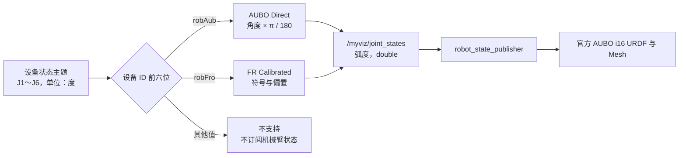

# MFMS Myviz AUBO 位姿、地图与现场网络修复记录

> [!abstract] 结论
> Myviz 中“AGV 会动、AUBO 机械臂保持固定姿势或与实机不一致”的核心问题已经修复并部署验证。修复方案根据设备 ID 严格区分傲博与 FR 机械臂：AUBO 使用原始关节角度直接转换为弧度，FR 保留独立的标定入口，未知型号不订阅机械臂状态。模型替换为官方 AUBO i16 运动链，并将底座顺时针旋转 90°。地图默认隐藏的代码、同步、构建和测试已经完成，但运行中的 Qt/Myviz 尚未重启，因此地图是否已在现场界面隐藏仍待最终验收。

## 1. 问题现象与修复范围

现场最初出现以下问题：

- Myviz 中 AGV 可以随实际设备移动，但机械臂始终保持固定姿势。
- 后续虽然机械臂模型开始更新，其关节姿态仍与 AUBO 实机不一致。
- 机械臂模型整体朝向与现实相差 90°。
- 当前没有确定地图文件地址，需要先隐藏地图，后续再由用户手动指定。
- 切换到有线网络后，电脑的默认出口发生变化，影响原有网络代理；无线 SSH 端口可连接但 SSH 握手无输出。

本次记录覆盖 Myviz 关节数据映射、设备厂家识别、AUBO i16 模型、安装朝向、地图启动策略，以及现场有线网络和 SSH 排查。

## 2. 根因分析

### 2.1 AUBO 错用了 FR 的关节标定参数

原实现让 AUBO 与 FR 共用同一套符号和偏置换算：

```text
关节弧度 = 符号 × 关节角度 × π / 180 + 关节偏置
```

目标工控机上的实际参数为：

```text
joint_sign       = [-1, 1, 1, 1, 1, 1]
joint_offset_rad = [2.632, 1.981, -1.458, 1.070, 1.551, 0.323]
```

这些参数属于 FR 机械臂的标定逻辑，不应直接套用到 AUBO。结果是 ROS 2 发布的关节位置虽然持续变化，但其数值与 AUBO 实际关节角不一致，因此模型姿态错误。

### 2.2 原 URDF 与官方 AUBO i16 运动链不一致

原有 SolidWorks 导出模型在关节原点、旋转轴和几何结构上与官方 AUBO i16 描述存在差异。即使关节角数据正确，错误的运动链也会导致末端位置和姿态偏离实机。

### 2.3 厂家识别与数据映射没有彻底隔离

系统需要同时兼容现有 AUBO 和未来的 FR 机械臂。如果仅根据“机器人”类型进入同一个换算分支，后续 FR 的偏置会再次影响 AUBO，因此必须在订阅和换算前完成厂家识别。

### 2.4 地图由启动文件默认拉起

地图显示和 `map_server` 原本随 Myviz 启动。由于当前尚未确定地图 YAML 文件地址，默认拉起会显示无效或不需要的地图，并增加现场判断干扰。

## 3. 修复后的数据链路



修复后，AUBO 的六个关节严格按以下公式换算：

```text
q_rad[i] = jt_cur_pos[i] × π / 180
```

关节顺序保持为 J1～J6，不增加 FR 的符号或偏置。周期性重发使用已经转换完成的弧度缓存，且保留 `double` 精度，不再对关节值做额外舍入。

## 4. 根据设备 ID 区分厂家

设备 ID 的前 3 位表示设备类型，第 4～6 位表示设备型号或厂家。本次采用大小写敏感的前 6 位精确匹配：

| ID 前缀 | 设备 | 状态类型 | Myviz 映射策略 |
|---|---|---|---|
| `robAub` | AUBO 机械臂 | `AuboRobotState` | 关节角直接由度转弧度 |
| `robFro` | FR 机械臂 | `FrRobotState` | 使用 FR 独立标定策略，偏置后续处理 |
| 其他 | 未知或不支持 | 无 | 不创建机械臂状态订阅 |

识别时只允许清理主题或设备名开头的 `/`，不兼容旧前缀、大小写变体或模糊匹配。这样可以防止未知设备误用 AUBO 或 FR 的运动学参数。

> [!important] FR 后续约束
> 未来接入 FR 机械臂时，应配置独立模型、关节符号和偏置，不能复用 AUBO 的直接换算。本次仅保留 FR 的独立入口，不处理其新偏置。

## 5. AUBO i16 官方模型与安装朝向

### 5.1 官方模型来源

机械臂运动链和 Mesh 替换为 `AuboRobot/aubo_description` 中的官方 AUBO i16 描述，固定到提交：

```text
47fa5e02fa873f27f7e812d31f31e3f4cf5e56b1
```

项目原有 AGV 底盘继续保留。AUBO 的 J1～J6 名称不变，关节原点、旋转轴、限制和 Mesh 使用官方定义，避免自定义模型与控制器运动学不一致。

### 5.2 安装变换

AGV 底座到机械臂 `base_link` 的固定变换设置为：

| 项目 | 数值 |
|---|---|
| 平移 `xyz` | `0 0 0.77` m |
| 绕 Z 轴旋转 | `-π/2` rad |
| 现场含义 | 从 +Z 方向观察，机械臂模型顺时针旋转 90° |

对应四元数约为：

```text
[0, 0, -0.707106781187, 0.707106781187]
```

## 6. 地图暂时隐藏

Qt 中的 Map 显示默认设为禁用，同时为 `display.launch.py` 和 `qtdisplay.launch.py` 增加 `launch_map_server` 参数，其默认值为 `false`。

因此，未指定地图文件时不会主动启动地图服务；AGV、机械臂、`JointState` 和 TF 的显示不受影响。未来确定地图地址后，应显式启动：

```bash
launch_map_server:=true map:=<地图 YAML 文件地址>
```

> [!warning] 现场验收状态
> 地图隐藏相关源码已同步到工控机，`myviz` 与 `qt_file` 构建成功，相关测试 2 项全部通过。但当时因网络、SSH 和代理排查暂停了运行中 Qt/Myviz 的重启，所以不能把“现场界面已经隐藏地图”标记为完成。下一次连接工控机后，需要重启界面并目视确认。

## 7. 部署与被动验证结果

本次验证只读取状态和检查可视化链路，没有向机械臂发送运动命令。HyRMS 进程 PID `5219` 在验证过程中保持不变。

| 验证项 | 结果 |
|---|---|
| 官方 Mesh 完整性 | 14 个文件哈希校验通过 |
| AUBO 角度到弧度映射 | 最大误差 `2.22044604925e-16 rad` |
| 安装高度 | `0.77 m` |
| 安装朝向 | yaw `-90°`，即顺时针 90° |
| `base_link → Link6` 与控制器 TCP 的位置误差 | `0.338957 mm` |
| 构建与测试 | 2 项测试通过，0 失败 |
| 机械臂控制 | 未下发运动或控制命令 |

### 7.1 工控机备份

部署前均创建了可回滚备份：

| 内容 | 备份地址 | SHA-256 |
|---|---|---|
| AUBO i16 模型和位姿修复 | `/home/norco/Desktop/code/Reconstructed-MFMS-backups/myviz-aubo-i16-20260821-105802.tar.gz` | `eab2b45cb350a93eb4acec5dfa3580b26584e6f39c0f58da1a8d9094bc947b22` |
| 机械臂顺时针 90° 修正 | `/home/norco/Desktop/code/Reconstructed-MFMS-backups/myviz-aubo-mount-yaw-20260821-112119.tar.gz` | `24e5dc6070bb370d5d458fb22002db1c7f415c5cd343390b63a3d100def5330b` |
| 地图默认隐藏 | `/home/norco/Desktop/code/Reconstructed-MFMS-backups/myviz-hide-map-20260821-113118.tar.gz` | `7c9c2a7f7dd117df5c79f01af51310895a316761d3ed3b6fcb2aeb5f782ca1ed` |

## 8. Myviz 重复进程问题

排查时发现，多次打开建模页面可能留下重复或孤立的 Myviz launch、状态订阅、`robot_state_publisher` 和地图进程链。重复进程会造成以下风险：

- 多个节点同时发布或消费相同主题，使观察结果不稳定。
- 旧进程继续使用旧 URDF 或旧参数，看起来像“修改没有生效”。
- 地图服务被旧进程保留，影响地图隐藏验收。

本次部署只在确认精确 PID 和父子进程关系后终止对应进程链，没有进行宽泛的批量结束操作。Qt/QProcess 的生命周期根因尚未修复，应作为后续独立任务处理。

## 9. 现场有线网络、V2Ray 与 SSH 排查

这部分可结合 [[MFMS工控机网络修复记录-多网卡路由与SSH直连]] 和 [[MFMS 0812 Bug：重启后 AUBO 连接失败与设备网辅助地址丢失]] 阅读。系统模块背景见 [[MFMS数据中台技术文档-架构线程与代理层]]。

### 9.1 当前网络信息

现场 Ubuntu 电脑当时的地址和默认路由如下：

| 接口 | 地址 | 用途 |
|---|---|---|
| 有线 `enx3cab7285b013` | `192.168.100.101/24` | 连接工控机现场网 |
| 无线 `wlp0s20f3` | `10.104.14.223/18` | 互联网访问 |

同时存在两条默认路由：

```text
有线：via 192.168.100.254，metric 100
无线：via 10.104.63.254，metric 600
```

Linux 优先选择 metric 更小的有线默认路由。因此插入 DHCP 有线网络后，互联网和 V2Ray 的出站流量从无线切换到有线网关。若该网关不能正常访问互联网或代理节点，就会表现为“改用有线 IP 后 V2Ray 失效”。这不是 V2Ray 本身被关闭，而是系统默认出口被 DHCP 改写。

推荐的现场拓扑是：

- 有线仅保留 `192.168.100.0/24` 的直连路由，用于访问工控机。
- 有线连接设置 `ipv4.never-default yes`，避免抢占默认路由。
- 有线连接设置 `ipv4.ignore-auto-dns yes`，避免 DHCP DNS 干扰外网解析。
- 无线继续承担默认路由和互联网访问。

### 9.2 SSH 两个入口的现象

当时检测到：

| 入口 | 检测结果 |
|---|---|
| `192.168.58.151:6622` | TCP 端口可连接，但 SSH 握手没有输出 |
| `192.168.100.104:22` | TCP 和 SSH 握手正常，可进入密码验证 |

端口探测成功只表示 TCP 连接已建立，不代表 SSH 服务、端口转发或协议握手一定正常。无线入口长时间无输出时，应继续检查 6622 端口对应的转发目标和服务端日志。

两个入口返回的 ED25519 主机指纹均核对为：

```text
SHA256:1sFImiyfVsqwzU8KxEXpBDiR1fh+SOAR9aZBShhFhmI
```

因此可以确认它们指向同一台工控机或同一个 SSH 主机身份。

### 9.3 正确配置现场人员的 SSH 公钥

现场人员查看的本机 `~/.ssh/authorized_keys` 只控制“哪些密钥可以登录现场人员这台电脑”，不能让这台电脑免密登录工控机。

正确流程是：

1. 在现场 Ubuntu 电脑上生成或读取其 SSH 公钥，例如 `~/.ssh/id_ed25519.pub`。
2. 由已获授权的管理员把该公钥追加到工控机 `/home/norco/.ssh/authorized_keys`。
3. 检查工控机上 `.ssh` 目录和 `authorized_keys` 的属主与权限。
4. 使用有线地址重新验证公钥登录。

密码猜测已被 SSH 拒绝，因此不能把历史记录中的密码样值当作当前凭据。应优先使用经授权的公钥，或由设备管理员重置登录凭据。

## 10. 安全边界

- 文档和聊天中不记录工控机密码。
- 只传递公钥，禁止发送 `id_ed25519` 等私钥文件。
- 添加公钥必须获得工控机所有者或管理员授权。
- 远程排查默认只读，不向 AUBO 或 AGV 下发运动命令。
- 结束进程前必须确认 PID、命令行和父子关系，避免影响 HyRMS 或其他现场服务。

## 11. 当前状态

- [x] 按 `robAub` 与 `robFro` 严格区分机械臂厂家。
- [x] AUBO 使用关节角度直接转弧度，不再使用 FR 偏置。
- [x] 未知厂家不订阅机械臂状态。
- [x] 替换为官方 AUBO i16 URDF 与 Mesh。
- [x] 模型安装朝向顺时针修正 90°。
- [x] 核心位姿映射、TF 和末端位置完成被动验证。
- [x] 地图默认隐藏的源码、工控机同步、构建和测试完成。
- [ ] 重启现场 Qt/Myviz，确认地图在运行界面中隐藏。
- [ ] 获取地图 YAML 地址后，验证显式启用地图。
- [ ] 为 FR 机械臂增加独立模型、符号和偏置。
- [ ] 修复重复打开页面后遗留孤立 Myviz 进程的问题。
- [ ] 经授权后把现场人员公钥安装到工控机。
- [ ] 如需有线与 V2Ray 共存，在现场电脑上设置有线连接不接管默认路由和 DNS。

## 12. 后续现场验收建议

1. 确认有线和无线的路由分工，保证工控机网段走有线、互联网走无线。
2. 通过已授权的 SSH 公钥登录 `192.168.100.104:22`。
3. 确认没有旧的 Myviz 孤立进程后重启 Qt/Myviz。
4. 目视确认地图默认不显示。
5. 在不下发控制命令的前提下，改变 AUBO 实际姿态并观察 J1～J6 模型是否同步。
6. 核对机械臂底座高度、顺时针 90° 朝向和末端位置。
7. 记录未来地图 YAML 文件地址，再测试显式启动地图。

