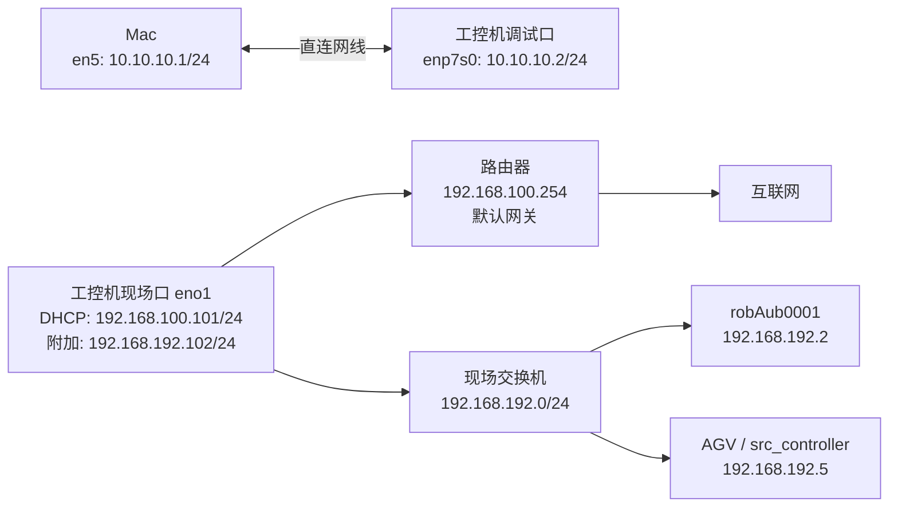
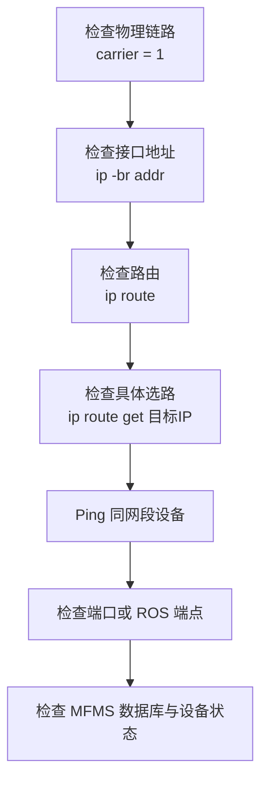

> [!abstract] 结论
> 工控机需要同时维护三条通信路径：
>
> 1. `enp7s0` 使用 `10.10.10.2/24`，通过直连网线供 Mac 调试和 SSH 登录。
> 2. `eno1` 保留 DHCP 地址 `192.168.100.101/24` 和默认网关 `192.168.100.254`，用于访问外网。
> 3. 同一个 `eno1` 额外配置 `192.168.192.102/24`，用于访问机械臂和现场设备网段。
>
> 最终配置已经验证：Mac、AUBO 机械臂、现场控制器、互联网和 DNS 可以同时访问。将数据库中的 `agvSrc0001.address` 从 `127.0.0.1` 改为 `192.168.192.5` 后，AGV 也已通过实际控制验证。

本文记录 2026 年 7 月 30 日的现场网络修复过程。MFMS 软件与现场设备之间的关系可结合 [[MFMS数据中台技术文档-架构线程与代理层]] 阅读；本次网络排查与软件侧问题的边界可结合 [[MFMS现场Bug修复日志-数据库、弹窗、双窗口与组连接]] 阅读。

## 1. 最终网络拓扑



| 设备或接口 | 地址 | 用途 | 是否配置默认网关 |
|---|---|---|---|
| Mac `en5` | `10.10.10.1/24` | 直连工控机 | 否 |
| 工控机 `enp7s0` | `10.10.10.2/24` | Mac 调试、SSH | 否 |
| 工控机 `eno1` DHCP 地址 | `192.168.100.101/24` | 上网 | 是，`192.168.100.254` |
| 工控机 `eno1` 附加地址 | `192.168.192.102/24` | 机械臂和设备网 | 否 |
| `robAub0001` | `192.168.192.2` | AUBO 机械臂 | 不涉及本次修改 |
| `agvSrc0001` / `src_controller` | `192.168.192.5` | AGV 现场控制端 | 数据库地址已由 `127.0.0.1` 改为该地址 |

> [!important]
> `192.168.100.254` 是工控机通过 DHCP 获得的**默认网关**，不是工控机自身地址。工控机在该网段的地址是 `192.168.100.101`。

## 2. Mac 直连工控机后为什么仍然无法 Ping

### 2.1 现象

- Mac 已经用网线直连工控机。
- 工控机的 `enp7s0` 一直显示“正在连接”。
- 网卡物理链路存在，但 Mac 与工控机互相 Ping 不通。

工控机上的检查结果为：

```bash
ip -br addr show enp7s0
cat /sys/class/net/enp7s0/carrier
```

其中 `carrier` 返回 `1`，说明网线、网口和物理链路正常。问题不在网线，而在 IP 配置。

### 2.2 原因

Mac 与工控机直接相连时，中间没有提供 DHCP 服务的路由器。两端如果都等待 DHCP，就无法自动获得同网段的 IPv4 地址。桌面显示“正在连接”，实际上是在等待 DHCP 超时。

### 2.3 修复

为直连链路两端配置独立的静态地址：

```text
Mac en5:        10.10.10.1/24
工控机 enp7s0: 10.10.10.2/24
```

该链路只用于两台计算机直接通信，因此：

- 不填写网关。
- 不填写 DNS。
- 不让 `enp7s0` 生成默认路由。

修复后，Mac 可以访问：

```bash
ping 10.10.10.2
ssh norco@10.10.10.2
```

## 3. 为什么 DHCP 能上网，却无法访问 AUBO

工控机的 `eno1` 使用 DHCP 时，获得了以下配置：

```text
地址:     192.168.100.101/24
默认网关: 192.168.100.254
```

此时系统路由表只知道：

- `192.168.100.0/24` 可以从 `eno1` 直接访问。
- 其他地址走默认网关 `192.168.100.254`。

而 `robAub0001` 的地址是 `192.168.192.2`，属于另一个网段。工控机没有 `192.168.192.0/24` 的直连路由，因此会错误地把数据交给默认网关，最终无法到达机械臂。

可用下面的命令观察系统实际选路：

```bash
ip route get 192.168.192.2
```

修复前，该地址不会通过 `192.168.192.102` 这个本地源地址直接访问。

## 4. 为什么改成 `192.168.192.102` 后能访问机械臂，却不能上网

将 `eno1` 从 DHCP 改成手动 `192.168.192.102/24` 后，工控机与 `192.168.192.2` 处于同一网段，所以可以直接访问机械臂。

但这次修改同时替换了 DHCP 配置：

- 原来的 `192.168.100.101/24` 地址消失。
- 原来的默认网关 `192.168.100.254` 消失，或者变成当前地址无法直接到达的网关。
- DHCP 下发的 DNS 配置也可能消失。

因此，机械臂恢复通信，但外网连接中断。这不是机械臂占用了网络，而是默认路由和 DNS 被手动配置替换了。

## 5. 正确修复：DHCP 地址与设备网地址并存

正确方案不是在两个地址之间切换，而是：

- `eno1` 继续使用 DHCP，保留上网所需的地址、网关和 DNS。
- 给同一个 `eno1` 增加一个 `192.168.192.102/24` 地址。

现场使用的 NetworkManager 连接名称是 `有线连接 1`，执行：

```bash
sudo nmcli connection modify "有线连接 1" \
  ipv4.method auto \
  ipv4.addresses 192.168.192.102/24

sudo nmcli connection up "有线连接 1"
```

这项配置会写入 NetworkManager 连接配置，重启后仍然有效。

> [!warning]
> `192.168.192.102/24` 只是附加地址，不要为它单独填写默认网关或 DNS。工控机只能保留一条正常的默认上网路径，即通过 `192.168.100.254` 出网。

## 6. 修复后的路由行为

修复后，`eno1` 同时具有两个 IPv4 地址：

```text
192.168.100.101/24
192.168.192.102/24
```

关键路由为：

```text
default via 192.168.100.254 dev eno1
10.10.10.0/24 dev enp7s0 src 10.10.10.2
192.168.100.0/24 dev eno1 src 192.168.100.101
192.168.192.0/24 dev eno1 src 192.168.192.102
```

系统会按目标地址自动选择路径：

| 目标 | 出口 | 源地址 | 结果 |
|---|---|---|---|
| Mac `10.10.10.1` | `enp7s0` | `10.10.10.2` | 直连 |
| AUBO `192.168.192.2` | `eno1` | `192.168.192.102` | 直连 |
| 控制器 `192.168.192.5` | `eno1` | `192.168.192.102` | 直连 |
| 互联网 | `eno1`，经 `192.168.100.254` | `192.168.100.101` | 默认路由 |

可使用以下命令确认选路：

```bash
ip route get 192.168.192.2
ip route get 1.1.1.1
```

预期分别看到：

```text
192.168.192.2 dev eno1 src 192.168.192.102
1.1.1.1 via 192.168.100.254 dev eno1 src 192.168.100.101
```

## 7. SSH 直连配置

Mac 通过专用调试链路连接工控机：

```bash
ssh -o IdentitiesOnly=yes \
    -o UseKeychain=yes \
    -o AddKeysToAgent=yes \
    -i ~/.ssh/id_ed25519_norco \
    norco@10.10.10.2
```

本次确认公钥已经存在于工控机。执行 `ssh-copy-id` 时出现：

```text
All keys were skipped because they already exist on the remote system.
```

这不是错误，表示远端已经安装该公钥。私钥本身设置了口令，Mac 可以将口令保存到钥匙串：

```bash
ssh-add --apple-use-keychain ~/.ssh/id_ed25519_norco
```

> [!danger]
> 文档、Git 仓库和 Trellis 规范中不得记录 SSH 私钥、私钥口令或工控机登录密码。这里只记录公用连接参数和私钥文件名。

## 8. 现场验证结果

修复后已通过 SSH 在工控机上完成以下检查：

| 检查项 | 结果 |
|---|---|
| Mac `10.10.10.1` | Ping 成功，`2/2` |
| AUBO `192.168.192.2` | Ping 成功，`3/3`，平均约 `0.348 ms` |
| `src_controller` `192.168.192.5` | Ping 成功，`2/2`，平均约 `0.886 ms` |
| MFMS 控制 AGV | 将 `agvSrc0001.address` 改为 `192.168.192.5` 后连接和控制正常 |
| 默认网关 `192.168.100.254` | Ping 成功，`3/3`，平均约 `0.617 ms` |
| 公网地址 `1.1.1.1` | Ping 成功，`3/3`，平均约 `5.915 ms` |
| DNS 查询 `github.com` | 成功，解析到 `20.205.243.166` |
| NetworkManager 持久配置 | `ipv4.method=auto`，附加地址为 `192.168.192.102/24` |

完整复查命令：

```bash
ip -br addr
ip route
ip route get 192.168.192.2
ip route get 1.1.1.1
ping -c 3 192.168.192.2
ping -c 3 192.168.100.254
ping -c 3 1.1.1.1
getent hosts github.com
nmcli connection show "有线连接 1"
```

## 9. AGV 连接已经通过实际控制验证

网络修复完成后，`192.168.192.5` 可以从工控机正常访问。随后将数据库中的 AGV 地址修改为：

```text
device.id      = agvSrc0001
修改前 address = 127.0.0.1
修改后 address = 192.168.192.5
```

修改后，MFMS 已经能够正常连接并控制 AGV。由这次现场结果可以确认：

- `192.168.192.5` 是当前部署中 `agvSrc0001` 使用的有效控制地址。
- `127.0.0.1` 只会指向工控机自身，不适合作为当前现场 AGV 的远端地址。
- 当前 AGV 连接链路会使用数据库中的 `device.address`，该字段不是单纯的展示信息。
- 此前 AGV 无法连接同时涉及两项配置：工控机缺少 `192.168.192.0/24` 设备网地址，以及数据库仍指向回环地址。

> [!success] 已验证链路
> `eno1` 增加 `192.168.192.102/24` → 工控机可达 `192.168.192.5` → `agvSrc0001.address` 改为 `192.168.192.5` → MFMS 连接成功 → AGV 实际控制正常。

这里的结论适用于当前现场部署，不代表其他项目或其他 AGV 必须使用相同 IP。后续更换控制器、调整网段或复制数据库时，仍需核对设备实际地址。数据库和真机控制属于高风险操作，修改前应确认目标行和回滚值。

## 10. 尚未确认的现场地址

根据现场拓扑图尝试访问过以下地址，但当时没有成功：

| 地址 | 图中含义 | 当前结论 |
|---|---|---|
| `192.168.192.130` | 图中标注的遨博机械臂控制箱 | 未响应；当前数据库和实机使用 `192.168.192.2` |
| `192.168.1.100` | 工控机第二网口 | 未响应，且不属于当前直连网段 |
| `192.198.192.100` | 导航激光前 | 未响应；地址中的 `192.198` 需要现场核对是否为笔误 |
| `192.198.192.101` | 导航激光后 | 未响应；地址中的 `192.198` 需要现场核对是否为笔误 |

拓扑图还标注了路由器 WAN 地址 `192.168.58.120` 和上游 `192.168.58.1`。这些是图纸信息，本次没有从工控机侧验证，不能作为已确认配置。

## 11. 常见错误与排查顺序

### 11.1 常见错误

1. **把默认网关当成工控机地址**
   - `192.168.100.254` 是网关。
   - 工控机 DHCP 地址是 `192.168.100.101`。

2. **给直连口配置默认网关**
   - `enp7s0` 只负责 `10.10.10.0/24`。
   - 如果给它配置网关，可能抢占外网默认路由。

3. **把 `eno1` 完全改成机械臂网段**
   - 可以访问机械臂，但会丢失原 DHCP 地址、网关和 DNS。
   - 应增加附加地址，不应替换 DHCP。

4. **只增加静态路由，不配置本地设备网地址**
   - 现场设备通常需要看到同网段源地址。
   - `eno1` 应持有 `192.168.192.102/24`，系统才能正确选择源地址并接收回包。

5. **只凭 Ping 通就认定 AGV 已经可控**
   - Ping 只证明 IP 层可达。
   - 本次是在数据库地址修改后，又经过 MFMS 连接和实际控制，才确认 `192.168.192.5` 是有效控制地址。

### 11.2 推荐排查顺序



> [!tip]
> 排查多网卡问题时，不要只看“能不能 Ping”。`ip route get <目标地址>` 可以直接显示系统准备使用的网口、下一跳和源地址，通常更容易发现问题。

## 12. 回滚附加地址

如果现场需要撤销 `192.168.192.102/24`，保留 DHCP 上网配置，可以执行：

```bash
sudo nmcli connection modify "有线连接 1" \
  -ipv4.addresses 192.168.192.102/24

sudo nmcli connection up "有线连接 1"
```

回滚后应确认：

```bash
ip -br addr show eno1
ip route
```

预期 `eno1` 仍保留 DHCP 地址和默认网关，但不再具有 `192.168.192.102/24`，也无法再直接访问 `192.168.192.0/24` 设备。

## 13. 最终检查清单

- [x] Mac `en5` 配置为 `10.10.10.1/24`
- [x] 工控机 `enp7s0` 配置为 `10.10.10.2/24`
- [x] 直连调试口不配置网关和 DNS
- [x] 工控机 `eno1` 保持 DHCP
- [x] `eno1` 增加 `192.168.192.102/24`
- [x] 默认路由仍经 `192.168.100.254`
- [x] Mac 可以 Ping 和 SSH 到工控机
- [x] 工控机可以 Ping `robAub0001`
- [x] 工控机可以 Ping `src_controller`
- [x] 工控机可以访问公网 IP
- [x] 工控机 DNS 解析正常
- [x] `agvSrc0001.address` 已由 `127.0.0.1` 改为 `192.168.192.5`
- [x] MFMS 已正常连接并实际控制 AGV
- [ ] 核对拓扑图中 `192.198.192.100/101` 是否为笔误
