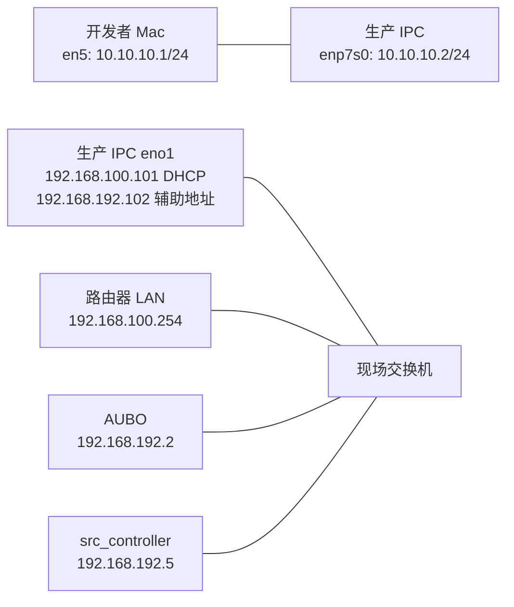

# MFMS 当前网络配置快照：基于 Trellis 记录

> [!abstract] 当前结论
> 生产工控机当前远程入口是 `norco@192.168.58.151:6622`，已由后续 Trellis 任务确认主机名为 `norco-Default-string`。历史设备网配置为：工控机同时保留 `192.168.100.101/24` 的 DHCP 外网地址和 `192.168.192.102/24` 的无网关辅助地址；AUBO 使用 `192.168.192.2`，当前 AGV 控制地址使用 `192.168.192.5`。`10.10.10.2:22` 是历史 Mac 有线直连入口，`192.168.100.104:22` 在当前 Trellis 规范中仍属于待验证测试入口。

本文只整理 2026-08-24 时仓库中现有 Trellis 记录，没有重新 SSH、修改网卡、写数据库或操作真机。历史网络故障过程见 [[MFMS工控机网络修复记录-多网卡路由与SSH直连]] 和 [[MFMS 0812 Bug：重启后 AUBO 连接失败与设备网辅助地址丢失]]；最近的连接与可视化现场处理见 [[MFMS 0820现场修复记录-异步连接、日志与实时可视化]]。

## 1. 信息来源与可信度

| 来源 | 用途 | 当前判断 |
| --- | --- | --- |
| `.trellis/spec/guides/industrial-network-and-ssh.md` | 网络与 SSH 的项目级契约 | 主要权威来源；包含历史快照、当前入口和安全边界 |
| `.trellis/workspace/mfms-core/network-access.md` | 开发者快速记忆 | 更新时间为 2026-08-19；AGV 地址结论已落后于项目级规范 |
| `08-20-fix-aubo-myviz-kinematics/verification.md` | 生产工控机部署验证 | 2026-08-21 再次验证 `.151:6622`、主机名和生产工程路径 |
| `08-23-handoff-ubuntu-native-installer/verification.md` | Ubuntu 实验/交接主机 | 独立主机 `cyi@192.168.3.2:22`，不能与生产工控机混用 |

> [!important] “当前”不等于全部现场实时复测
> Trellis 的生产 SSH 入口在 2026-08-21 有后续验证；但 `eno1/enp7s0` 地址表主要来自 2026-07-30 和 2026-08-12 的现场快照。使用前仍应只读复核接口名、地址和路由，不能把历史网卡名当成永不变化的事实。

## 2. SSH 入口清单

### 2.1 当前生产远程入口

| 项目 | 配置 |
| --- | --- |
| 用户 | `norco` |
| Host | `192.168.58.151` |
| Port | `6622` |
| Identity | `~/.ssh/id_ed25519_norco` |
| 已验证主机名 | `norco-Default-string` |
| 主要用途 | 数据中台日志、进程、ROS 图、构建与经批准的部署 |
| 最近 Trellis 证据 | 2026-08-21 Myviz 远程构建与被动运行验证 |

标准连接签名为：

```bash
ssh -o IdentitiesOnly=yes \
    -o UseKeychain=yes \
    -o AddKeysToAgent=yes \
    -i ~/.ssh/id_ed25519_norco \
    -p 6622 \
    norco@192.168.58.151
```

这里显式指定 identity，是为了避免 Mac 同时加载多把密钥时认证顺序不确定。端口 `6622` 是远程转发入口，不是 AUBO 或 AGV 的设备端口。

> [!warning] 旧远程入口
> `192.168.58.119:6622` 是 2026-08-19 之前使用过的入口，已经被 `.151:6622` 替代。后续脚本和文档不应再把 `.119` 当作当前目标。

### 2.2 历史 Mac 有线直连入口

| 端点 | 地址 | 说明 |
| --- | --- | --- |
| Mac USB 网卡 `en5` | `10.10.10.1/24` | 无网关，只用于现场直连 |
| 工控机 `enp7s0` | `10.10.10.2/24` | SSH 目标，端口 22 |
| SSH 用户与密钥 | `norco` + `~/.ssh/id_ed25519_norco` | 2026-08-12 已成功使用 |

`10.10.10.2` 是工控机地址，不是 Mac 本机地址。该入口只有在 Mac 与工控机之间的物理直连链路存在时才可用。

### 2.3 有线测试入口

| 项目 | Trellis 当前记录 |
| --- | --- |
| Host | `192.168.100.104` |
| Port | `22` |
| 用途 | 有线测试 |
| 用户名 | 尚未在网络规范中确认 |
| Identity | 尚未在网络规范中确认 |
| 状态 | 未连接验证 |

Trellis 明确规定：不能仅因为生产入口使用 `norco` 和 `id_ed25519_norco`，就自动把相同认证信息套到测试口。首次使用必须先核对路由、主机密钥、用户名、identity 和 `hostname`。

> [!note] 记录差异
> 其他现场文档中已有 `.104:22` 可进入认证阶段的观察，但当前 Trellis 项目级网络规范仍保留“未连接验证”。本文按用户要求记录 Trellis 当前状态，不擅自替 Trellis 改写结论。

## 3. 生产工控机历史接口配置

| 节点 | 接口/对象 | 地址 | 用途 | 记录状态 |
| --- | --- | --- | --- | --- |
| 开发者 Mac | USB 10/100 LAN `en5` | `10.10.10.1/24` | SSH 直连 | 2026-08-12 截图确认 |
| 生产工控机 | `enp7s0` | `10.10.10.2/24` | Mac 直连 | carrier 与 SSH 已验证 |
| 生产工控机 | `eno1` DHCP | `192.168.100.101/24` | 外网、默认路由 | 历史现场正常 |
| 生产工控机 | `eno1` 辅助地址 | `192.168.192.102/24` | AUBO/AGV 设备网 | 2026-08-12 恢复并验证 |
| 路由器 LAN | 默认网关 | `192.168.100.254` | 工控机外网出口 | ping 成功 |
| AUBO | `robAub0001` | `192.168.192.2/24` | 机械臂控制器 | ping 3/3 成功 |
| AGV 侧控制机 | `agvSrc0001` / `src_controller` | `192.168.192.5/24` | 当前 AGV 控制地址 | ping、MFMS 连接和实车控制成功 |

### 3.1 NetworkManager 契约

`eno1` 使用的 profile 名为 `有线连接 1`，必须保持：

```text
ipv4.method = auto
ipv4.addresses 包含 192.168.192.102/24
default route = 192.168.100.254，由 DHCP 提供
DNS = DHCP
```

这里的关键是“DHCP + 辅助地址并存”：

- `192.168.100.101/24` 负责到默认网关和外网；
- `192.168.192.102/24` 负责直接访问设备网；
- 辅助地址不能配置第二个默认网关或 DNS；
- 不能把 `eno1` 改成只有 `192.168.192.102/24` 的纯静态接口，否则外网默认路由会丢失。

### 3.2 预期路由

```text
default via 192.168.100.254 dev eno1
10.10.10.0/24 dev enp7s0 src 10.10.10.2
192.168.100.0/24 dev eno1 src 192.168.100.101
192.168.192.0/24 dev eno1 src 192.168.192.102
```

访问 AUBO 时，关键断言是：

```text
192.168.192.2 dev eno1 src 192.168.192.102
```

如果结果变成 `192.168.192.2 via 192.168.100.254`，说明设备网辅助地址或直连路由丢失。2026-08-12 的 AUBO 连接超时就是由这一问题造成的。

### 3.3 网络关系



图中 `10.10.10.0/24` 是独立调试链路；`192.168.100.0/24` 和 `192.168.192.0/24` 共用工控机的 `eno1`，但承担不同职责。

## 4. 设备地址与数据库记录

### 4.1 AUBO

当前有效设备地址是 `robAub0001 = 192.168.192.2`。图纸曾标注 `192.168.192.130`，但该地址 ping 失败，数据库与现场实测都使用 `.2`，因此 `.130` 只能保留为未确认图纸信息。

### 4.2 AGV

较新的项目级网络规范记录：

```text
device.id      = agvSrc0001
修改前 address = 127.0.0.1
修改后 address = 192.168.192.5
验证结果        = MFMS 连接成功，AGV 实际控制正常
```

`127.0.0.1` 指向工控机自身，不是当前现场 AGV 控制端。`192.168.192.5` 是当前部署结论，不应复制成所有项目和所有 AGV 的固定默认值；换控制器或数据库时必须重新确认 endpoint。

> [!bug] Trellis 内部的陈旧记录
> `.trellis/workspace/mfms-core/network-access.md` 仍写着 `agvSrc0001.address=127.0.0.1` 且 `.5` 角色未确认；而较新的 `.trellis/spec/guides/industrial-network-and-ssh.md` 已记录地址改为 `.5`，并通过 MFMS 连接和实际控制。本文采用较新的项目级规范，同时保留这项冲突，提示后续应更新 workspace 速查文件。

## 5. 图纸中尚未确认的地址

| 标注 | 当前 Trellis 判断 |
| --- | --- |
| 路由器 WAN `192.168.58.120`、上游 `192.168.58.1` | 未从工控机验证 WAN 管理面 |
| AUBO 控制箱 `192.168.192.130` | ping 失败；当前使用 `.2` |
| `src_controller` 另一接口 `192.168.1.100` | 当前无直连路由，ping 失败 |
| 前后激光雷达 `192.198.192.100/101:2111` | ping 失败；`192.198` 是否为图纸笔误待确认 |

图纸、数据库和现场实测冲突时，应先保留冲突，再以只读现场验证作为当前运行事实。不能看到图纸地址后直接覆盖数据库或 NetworkManager。

## 6. Ubuntu 实验/交接主机必须独立处理

Trellis 还记录了一台 2026-08-23 使用的 Ubuntu 主机：

| 项目 | 配置 |
| --- | --- |
| SSH | `cyi@192.168.3.2:22` |
| 主机名 | `cyi-ThinkStation-P340` |
| 工作目录 | `/home/cyi/mfms-installer-workspace` |
| 用途 | 原生 Ubuntu 构建/安装交接 |
| 状态 | SSH、MySQL、MongoDB、Tailscale 服务只读复查正常 |

这台机器不是生产工控机，不能使用 `norco` 用户、生产工程路径、生产设备网地址或生产部署操作。生产问题和 Ubuntu 交接问题必须分别记录目标与结果。

## 7. 只读验收清单

连接生产工控机后，先执行只读检查：

```bash
hostname
ip -br addr
ip route
ip route get 192.168.192.2
ip route get 192.168.192.5
ip route get 1.1.1.1
ping -c 3 192.168.192.2
ping -c 3 192.168.192.5
ping -c 3 192.168.100.254
resolvectl query github.com
```

这些检查分别证明主机身份、接口地址、设备网路由、外网路由和 DNS。设备 IP 可达后，还要单独确认 ROS service、state Topic 和数据中台运行态；ping 成功不能推出上位机已经连接，更不能推出真机可以安全运动。

## 8. 安全边界

| 操作 | Trellis 风险级别与要求 |
| --- | --- |
| SSH 只读查看、`ip`、`ping`、ROS 图查询 | R0，只读；不得追加 service call |
| 修改 NetworkManager、路由、DNS | R3，先记录现值和回滚方式，再取得明确批准 |
| 修改数据库 `device.address` 或状态 | R3，必须确认目标行、旧值和回滚值 |
| 启停生产进程、部署代码 | R3，核对主机、目录、PID、备份和授权 |
| 连接、上电或运动真机 | R3，必须由现场人员明确批准目标和动作 |

不得把密码、私钥正文、数据库凭据或 SSH 口令写入 Trellis 或本文。主机密钥不匹配时必须停止，不能用 `StrictHostKeyChecking=no` 绕过校验。

## 9. 当前 Trellis 待整理项

1. 更新 `.trellis/workspace/mfms-core/network-access.md` 中陈旧的 AGV `127.0.0.1` 结论。
2. 首次直接使用 `192.168.100.104:22` 后，把用户名、identity、主机名和验证时间回写网络规范。
3. 重新只读采集生产工控机当前接口名与地址，确认历史 `eno1/enp7s0` 是否仍适用。
4. 网络规范的设备连接验收仍写“`device_state` 进入 online/connected”；而较新的 AUBO 连接设计已经规定 DB 只作为 `load/unload` 命令通道，运行态由 cmd ready 和 Topic fresh 推导。这一处需要后续统一。
5. 激光雷达 `192.198.192.100/101` 和 `src_controller 192.168.1.100` 仍缺少现场确认。

## 更新记录

| 日期 | 变更 |
| --- | --- |
| 2026-08-24 | 根据当前 Trellis 规范、workspace 速查和近期任务验证记录，整理生产 SSH、历史接口、路由、设备地址、实验主机及内部冲突。 |
