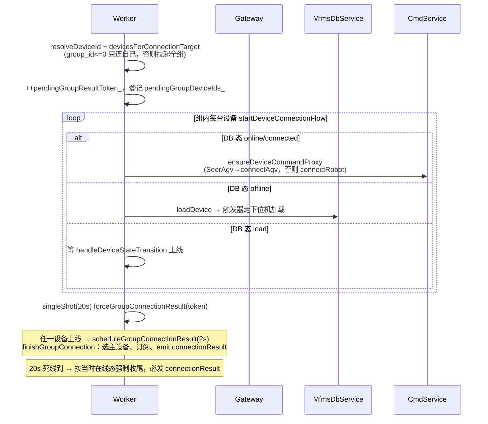
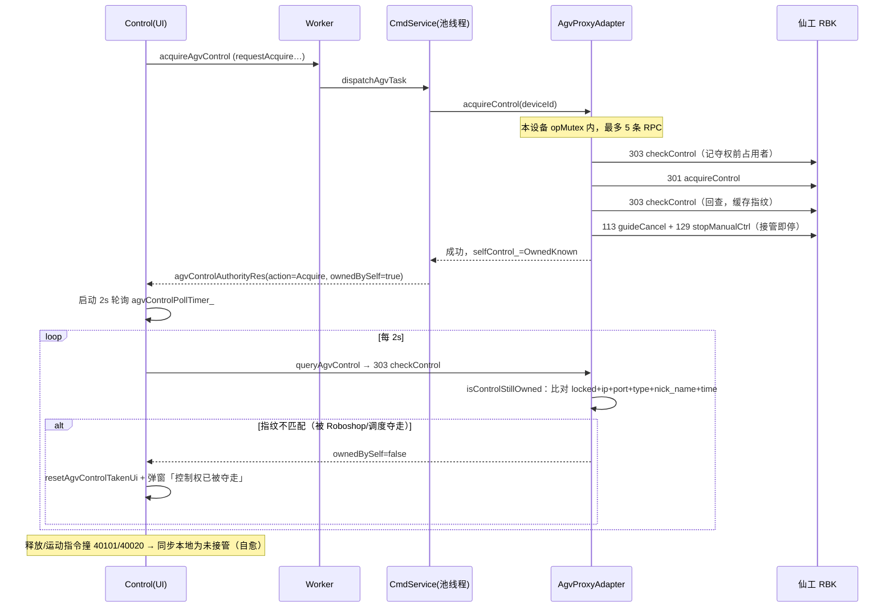
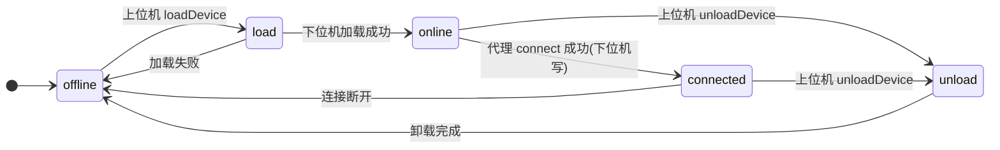
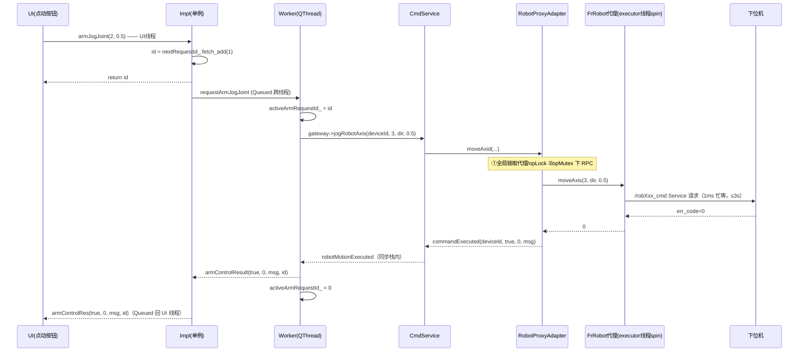

# MFMS 数据中台技术文档：架构、线程与代理层

> [!abstract] 本文定位
> 基于 **main @ `4f33b3b`（2026-07-16）** 的代码逐行核实，覆盖 7 月锁改造（`bac7252`）、AGV 控制权（`7d7c695`/`55421a1`）、requestId、Aubo 接入与 3s 设备列表轮询（`e84267d`）之后的**当前形态**。仓库内置的 `src/mfms_server/design/MFMS_DataCenter_Architecture.md`（4 月版，基于 `c64e2cb`）与 vault 里的 [[MFMS_DataCenter_Technical_Documentation]] 均早于这轮演进，涉及锁模型、信号签名、组连接的内容以本文为准。

**“数据中台”的范围**：不是单指数据库，而是 `qt_file` 前端与下位机之间的整个上位机通信中间层——`client_api（CommunicationInterface/Worker）+ gateway + mfms_db + ros_bridge + cmd_service + 两个代理适配器 + hyrms_export 代理库`，全部位于 `src/mfms_server/`。

相关笔记：[[MFMS上位机阶段Bug修复总览]] · [[MFMS上位机Bug修复汇总-锁竞态与控制权]]

---

## 1. 分层架构总览

![[图片/10.研一上学期/10_2_1.svg|1100]]

自上而下九层，两条独立的通信平面：

- **ROS 平面**（实时控制/状态）：UI → 单例 → Worker → Gateway → cmd_service → 代理适配器 → hyrms_export 代理节点 → `/{id}_cmd` Service 与 `/{id}_state` Topic → 下位机 linker。
- **数据库平面**（生命周期/脚本/资源）：mfms_db 与下位机通过 **MySQL 触发器 + 双事件表** 异步互通；ros_bridge、cmd_service 也各自直连 MySQL 做查询。

三条设计红线贯穿全部层次：

1. **UI 线程零阻塞**：所有耗时操作都在 worker 线程或线程池，UI 只收 `Qt::QueuedConnection` 信号。
2. **同设备串行、跨设备并行**：由代理适配器的每设备 `opMutex` 保证（`bac7252` 改造核心）。
3. **指令-确认分离**：数据库平面上位机只写意图态、下位机只写事实态，各自只消费对方的事件表。

---

## 2. 进程模型

| 进程 | 启动方式 | 说明 |
| --- | --- | --- |
| `mfms-db-1`（mysql:8.0，原生 ARM64） | compose 服务 | 首次启动导入 `MFMS_BASE.sql`；仅回环 3306 |
| `mfms-mfms-1` 容器主进程 | `docker/entrypoint.sh` | 依次：colcon 增量构建 → Xtigervnc(:1) → websockify(6080) → `ros2 run qt_file qt_file` |
| **qt_file**（linux/amd64，Rosetta） | entrypoint 后台拉起 | 数据中台宿主进程，内部线程见 §3 |
| RViz `ros2 launch` / subscriber | qt_file 内 `QProcess`（`Myviz.cpp:1499`、`:1567`） | Myviz 页面按需派生 |
| `simulated_lower_machine` | 手动 `ros2 run` 或 `docker/soak_arm_jog.sh sim` | 模拟下位机；**不在 compose 编排内** |
| `soak_arm_jog` | 手动 | 浸泡测试客户端，走与 UI 相同的 7 层栈 |
| 下位机 HyRMS linker | 真机 192.168.83.74 | 设备适配节点 + Lua 解释器（不在本仓库） |

> [!note] ROS 初始化位置
> `main.cpp` **不初始化 ROS**（`main.cpp:37-38` 注释明确），只在退出时 `rclcpp::shutdown()`。`rclcpp::init` 发生在 worker 线程 `CommunicationWorker::initialize()` 里（`CommunicationWorker.cpp:106-109`），由首次 `CommunicationInterface::instance()` 惰性触发。

---

## 3. 线程模型

![[图片/10.研一上学期/10_2_2.svg|1100]]

### 3.1 线程清单

| # | 线程 | 创建处 | 承载内容 |
| --- | --- | --- | --- |
| 1 | Qt UI 主线程 | `QApplication` | 全部窗体；`Control` 的两个轮询定时器；Myviz 的 rviz 节点（rviz 自带 executor） |
| 2 | CommunicationWorker 线程 | `CommunicationInterfaceImpl.cpp:103-110`（`new QThread` + `moveToThread`） | rosNode `communication_worker_node`、gateway 及 db/ros_bridge/cmd 三服务（QObject parent 链全在此线程）、全部 `doXxx` 槽、三个周期定时器 |
| 3 | Robot executor | `RobotProxyAdapter.cpp:51-71`（`std::thread`） | `MultiThreadedExecutor::spin_some(10ms)+sleep(1ms)` 驱动 FrRobot/AuboRobot 代理节点 |
| 4 | AGV executor | `AgvProxyAdapter.cpp:99-120` | 同上，驱动 SeerCtrl 代理节点，RPC 的 future 在此被解析 |
| 5 | Qt 全局线程池 | `QtConcurrent::run` | 全部 AGV RPC（`MfmsCommandService.cpp:2331-2334`）；UI 侧 `database_proxy` 查询 |
| — | rclcpp/DDS 内部线程、QtWebEngine 渲染进程 | 框架自建 | 不参与中台数据流 |

关键点：**进程内两套 spin 并存**——`communication_worker_node` 的订阅回调由 worker 线程 QTimer 驱动的 `rclcpp::spin_some` 处理（`MfmsRosBridge.cpp:951-956`，非独立 spin 线程）；各 `{id}_proxy` 代理节点由两个适配器各自的 std::thread executor 驱动。

### 3.2 周期活动总表

| 定时器 | 周期 | 线程 | 作用 | 代码 |
| --- | --- | --- | --- | --- |
| `spinTimer_` | 10ms（100Hz，可调 ≤1000Hz） | worker | `spin_some(rosNode_)` 处理状态订阅回调 | `MfmsRosBridge.cpp:161-163` |
| `statusTimer_` | 1s | worker | 心跳快照重算 + **每 3 tick 分频**拉一次设备列表 | `MfmsRosBridge.cpp:36-37`、`:938-941` |
| `pollTimer_` | 100ms（`MFMS_DB_POLL_INTERVAL_MS` 可调） | worker | 轮询 `device_ui_event` / `lua_ui_event` | `MfmsDbService.cpp:76-78` |
| executor 循环 ×2 | 10ms + 1ms sleep | 各自 std::thread | 代理节点 spin | 见 §3.1 |
| `agvNavStatusPollTimer_` | 1s | UI | 导航状态轮询，终态自动停 | `Control.cpp:1632-1636` |
| `agvControlPollTimer_` | 2s | UI | 接管期间查控制权归属（SEER 303） | `Control.cpp:1668-1672` |
| singleShot 2s | 一次性 | worker | 组连接延迟收尾 | `CommunicationWorker.cpp:22` |
| singleShot 20s | 一次性 | worker | 组连接死线 `forceGroupConnectionResult` | `CommunicationWorker.cpp:25`、`:754-756` |
| 模拟器 4 定时器 | 20ms spin / 200ms 发布 / 500ms 轮库 / 2s info 同步 | 模拟器主线程 | `simulated_lower_machine.cpp:402-438` |

### 3.3 锁与原子量全景

| 锁/原子量 | 归属 | 保护对象 | 备注 |
| --- | --- | --- | --- |
| `initMutex_` / `deviceTreeMutex_` / `deviceStatusMutex_` | Impl | init 序列 / 两个缓存 | `CommunicationInterfaceImpl.h:185-191` |
| `nextRequestId_`（atomic qint64，从 1 起） | Impl | 运动请求发号 | `.h:183-184` |
| `mutex_` | Worker | `devices_`、`currentDeviceId_`、`pendingGroup*` 等连接状态 | 30+ 处 `QMutexLocker` |
| `activeArmRequestId_`（普通 qint64） | Worker | 臂指令同步关联 | 仅 worker 线程读写，无需锁（`CommunicationWorker.h:267-270`） |
| `mutex_` ×3 | 三服务各一把 | 各自内部状态；`running_` 为普通 bool 受其保护 | |
| 适配器全局 `mutex_` ×2 | 两适配器 | **仅**代理表 + `opMutexes_` 表 +（AGV）`selfControl_` | 绝不跨 RPC |
| `opMutexes_[deviceId]` ×2 套 | 两适配器 Impl | 该设备的串行 RPC 与代理结果成员 | 只增不删；详见 §7 |
| `running_` / `executorRunning_`（atomic） | 适配器 / Impl | 生命周期 | |

> [!tip] 与 52c1a83 的呼应
> UI 侧 `DatabasePool` 按 `QThread::currentThreadId()` 每线程一条 `QSqlDatabase`（`DatabasePool.cpp:24-27`）——这是修复"断库段错误"后的形态；中台侧三处 DB 连接（mfms_db、ros_bridge、cmd_service）连接名各自唯一且只在 worker 线程使用，天然满足 Qt 线程亲和约束。

---

## 4. client_api：UI 接入层

### 4.1 CommunicationInterfaceImpl（单例，UI 线程侧）

- **Meyers 单例**：`getInstance()` 内 `static CommunicationInterfaceImpl instance;`，首次访问惰性 `initialize()`（`CommunicationInterfaceImpl.cpp:48-58`）；基类 `CommunicationInterface::instance()` 是它的转发（`CommunicationInterface.cpp:6-9`）。
- **initialize() 全流程**（`:77-238`）：注册元类型 → `new CommunicationWorker` + `new QThread` + `moveToThread` → `QThread::started → worker->initialize`（保证初始化跑在新线程）→ 连接 30 路 `requestXxx→doXxx` → 连接 worker 结果信号 → `QEventLoop` 等 `initializationComplete`，超时 30s（`kInitializationTimeoutMs`）失败则清理线程。
- **shutdown()**：`QMetaObject::invokeMethod(worker_, "shutdown", Qt::BlockingQueuedConnection)`，特判"从 worker 线程调用"防死锁；随后 `thread_->quit()+wait(5000)`（`:310-364`）。
- 未初始化时对外槽直接回失败信号（如 `connectRobot` 直发 `connectResult(false,…)`，`:411-418`），不让 UI 无限等。
- 持有 `deviceTreeCache_` / `deviceStatusCache_`，worker 每次推送先写缓存再转发信号，UI 随时可拉快照。

### 4.2 CommunicationWorker（QThread 线程体）

**状态字段**（`CommunicationWorker.h:253-265`）：`currentDeviceId_`、`devices_`（OnlineDevice 列表）、`latestStatusSnapshot_`、`connectedDeviceIds_`、`connectedGroupId_`，以及组连接 pending 六件套（`pendingGroupDeviceIds_ / pendingPrimaryDeviceId_ / pendingGroupId_ / pendingGroupResultScheduled_ / pendingGroupResultToken_ / suppressedSubscribeResultDeviceIds_`）。

**doXxx 槽 ≈34 个**，按域分组：设备列表/树（doRefreshRobotList）、连接（doConnectRobot / doSwitchRobot / doDisconnectRobot）、AGV 站点与路径（doGetStations / doExeToStation(List) / doGetPaths / doExeToPath / doAdd/Update/DeletePath）、AGV 运动（doAgvMove* / doAgvTurn* / doStopAgvManualControl）、导航控制（doPause/Resume/Cancel/QueryNavigationStatus）、控制权（doAcquire/Release/QueryAgvControl）、机械臂（doArmJogJoint / doArmJogCartesian / doArmChangeMode / do*Waypoint）。

**组连接状态机**（`doConnectRobot`，`CommunicationWorker.cpp:675-756`）是最复杂的一段：



- 收尾 `finishGroupConnection`（`:1469-1507`）用 token 防旧连接串台；`bestOnlineGroupDeviceIdLocked` 选主设备后 `subscribeDeviceById`。
- **doSwitchRobot 主设备纠偏**（`624fedd`，`:774-839`）：目标在已连组内且运行时在线 → 只切 `currentDeviceId_` 并 `ensureDeviceCommandProxy`，**不断连**；否则退化为"先 doDisconnectRobot 再 doConnectRobot"顺序执行。这是防止组连接后 jog 打到错误机械臂的关键。
- `doDisconnectRobot`（`:1233-1276`）：断开 `connectedDeviceIds_` 全部设备，`++pendingGroupResultToken_` 作废在途结果，`gateway->unsubscribe()`。

**上行状态分流 handleRobotStatus**（`:1278-1284`、`:1730-1804`）：按 `isAgvType`（robotType 含 AGV/仙工/Seer）→ 构 `SeerCtrlState`（此处做 mm→m、deg→rad 的**反向**换算，因消息字段是 m/rad）；`isAuboType` → 构 `AuboRobotState`；默认 → `FrRobotState` 全字段。Impl 侧 Aubo 状态双发：`sendAuboARMState` + 经 `toGenericArmState` 泛化后的 `sendARMState`，旧 UI 零改动。

### 4.3 DeviceTree（给 UI 的四层设备树）

`DeviceTreeRobot(group) → DeviceTreeCategory(rob/agv) → DeviceTreeVendor(robFro) → DeviceTreeDevice(robFro0001)`（`DeviceTree.h:52-143`）。builder 输入是 ros_bridge 的 `OnlineDevice`，因此放在 `client_api/src/DeviceTreeBuilder.cpp` 不对前端暴露；叶子提供 `stateTopic()` 供 RViz 直接订阅。`emitRobotList()` 同时发 id 列表（旧接口）与设备树（新接口）（`CommunicationWorker.cpp:1617-1629`）。

---

## 5. gateway：门面层

- 构造即建三子服务，全部 `parent=this`（`MfmsGatewayImpl.cpp:60-66`）→ 生命周期与线程归属一次锁定。
- `start()`：db → ros_bridge → cmd；**db 失败仅告警不计入 ok**（允许空数据模式起 UI）；`stop()` 严格逆序（`:136-166`）。
- 两类职责：**信号直通**（≈30 条 signal→signal 连接，零转换零拷贝）与**类型转换**（`toAgvCommand/toRobotCommand/toIoCommand/toGatewayResult`，隔离 gateway 命名空间与 mfms 内部类型）。
- `requestState` 是刻意的空实现（`:466-472`）——状态靠下位机周期发布，不存在"主动拉取"语义。

---

## 6. 三服务详解

### 6.1 MfmsDbService（数据库事件服务）

- 连接：`QMYSQL`，连接名 `mfms_db_<this指针>` 保证多实例不冲突（`MfmsDbService.cpp:25-32`）；配置 `mfms::DbConfig`，默认远程 `100.84.157.31`，全部字段可被 `MFMS_DB_*` 环境变量覆盖（`mfms_common/DbConfig.h:46-57`）——容器里实际指向 compose 内置 db。
- **轮询协议**：启动时游标水位 = `MAX(id)`（跳过历史事件）；每 100ms `SELECT … WHERE id > ? ORDER BY id ASC LIMIT 100`，逐行**更新水位 → 解锁后 DELETE（防死锁）→ emit → 回锁**（`:545-637`）。事件消费即删，表常态为空。
- 写库统一走 `executeUpdateWithReason`：先 `SET @change_reason(=?)` 参数化会话变量再 UPDATE，触发器把 reason 带进事件行（`:501-537`）。
- **触发器缺失回退**：启动时查 `information_schema.TRIGGERS`，缺 `trg_*` 时由应用层直写 `*_state_event`，保证下位机仍能收到指令事件（`:341-462`）。

### 6.2 MfmsRosBridge（状态桥接）

![[图片/10.研一上学期/10_2_5.svg|1100]]

三个独立机制：

1. **设备列表**：核心 SQL `SELECT ds.id, ds.state, CAST(ds.info AS CHAR(4096)), … FROM device_state ds LEFT JOIN device d … WHERE ds.state IN ('offline','load','online','connected')`（排除 unload；`CAST` 是为消除 QMYSQL 预处理 JSON 列 ~1.1s 的 mmap 开销，`MfmsRosBridge.cpp:305-321`）。手动 `refreshDeviceList()` 每次必发；3s 周期 `pollDeviceList()` **逐字段比较、变化才发**，前端下拉框不再被周期性重建（`e84267d`，`:400-423`）。
2. **当前订阅**：`subscribeByType` 按 `DeviceType` 三分支选消息类型（FrRobotState / AuboRobotState / SeerCtrlState），QoS 统一 `SensorDataQoS()`，话题名 = `/{完整设备ID}_state`（**不是** topic_prefix，`RobotTypes.h:59-69`）。输出 `robotStatusUpdated(RobotRealtimeStatus)`，字段覆盖位姿（mm/deg）、IO、故障码、AGV 站点/速度扩展（`RobotTypes.h:153-258`）。
3. **全量监视**：`monitorEntries_` 为组内每台可心跳设备（仅 Fr/Aubo/Seer 三类）保持轻量订阅，回调只刷 `lastSeenMs`/`errCode`；1s 重算 `online = 3s 内有心跳`，`statusSnapshotChanged` 变化才发 `deviceStatusUpdated`。`DeviceRuntimeStatus::statusText()` 集中决策显示文案，能识别"DB 说在线但没数据"→「离线(无数据)」（`DeviceStatus.h:70-89`）。

### 6.3 MfmsCommandService（命令服务）

- 成员：两个适配器（unique_ptr + setParent）、独立 QMYSQL 连接（`MfmsCommandService_<this>`）、`onlineDevices_` 缓存、一把 `mutex_`。**无自建线程**。
- **两种执行模型**：机械臂指令在 worker 线程**同步直调**适配器；AGV 指令一律 `dispatchAgvTask → QtConcurrent::run`，结果 `QMetaObject::invokeMethod(…, Qt::QueuedConnection)` 回投 worker 线程发信号（`.cpp:452-517`、`:2331-2334`）。这是"臂链路能栈内直返 requestId、AGV 链路必须结构体携带"的根源。
- **jog 读-改-写**在此层：`jogRobotCartesian = getDescPose → targetPos[axis]±=step → moveL(DESC)`（`:1699-1717`）——非原子，真机并发会物理漂移，soak 工具因此强制真机关闭流水线。
- AGV 手动运动换算：UI 的"速度+距离/角度"→ `x/y/w + durationMs`（`durationFromDistance = distance/speed*1000`，角速度 deg→rad）（`:424-440`）。
- 路径/路点资源：`agv_path`（查/增/改/删，事务 + 1062 重复键判定）与 `robot_waypoint`（保存时同取关节+笛卡尔位姿存 JSON）全在此层直连 DB。

---

## 7. 代理层布置（重点）

![[图片/10.研一上学期/10_2_3.svg|1100]]

### 7.1 PIMPL 与 executor

两个适配器同构（`RobotProxyAdapter.cpp:46-180` / `AgvProxyAdapter.cpp:94-242`）：

- `Impl` 持有：代理表（Robot 侧**两张**：`proxies_<FrRobot>` + `auboProxies_<AuboRobot>`，因两类无公共基接口；AGV 侧一张 `proxies_<SeerCtrl>`）、`opMutexes_`、`MultiThreadedExecutor` + `std::thread` + `executorRunning_`。
- 代理节点命名 `deviceId + "_proxy"`，`add_node/remove_node` 随连接/断开动态挂卸。

### 7.2 双层锁范式（bac7252）

每个对外方法固定两段：

```cpp
// 段①：全局锁短持有 —— 只取资源
QSharedPointer<QMutex> opLock;
std::shared_ptr<RobotProxy::FrRobot> fr;
{
    QMutexLocker locker(&mutex_);          // 全局锁
    if (!running_) return NOT_RUNNING;
    fr = impl_->getProxy(deviceId);        // 查代理表
    if (!fr) return DEVICE_NOT_CONNECTED;
    opLock = impl_->opMutexLocked(deviceId); // 取/建每设备锁
}                                           // ← 全局锁在此释放
// 段②：每设备锁下执行 RPC —— 同设备串行、跨设备并行
QMutexLocker op(opLock.get());
int32_t result = fr->moveAxis(axisId, direction, step);  // 阻塞 RPC，最长 3s
op.unlock();                                // 先解锁
emit commandExecuted(deviceId, result == 0, result, msg); // 再发信号
```

配套护栏：

| 护栏 | 值 | 原因 | 代码 |
| --- | --- | --- | --- |
| `ShortRpcTimeoutProxy<T>` | `future_timeout_` 8s→**3s** | 基类成员是 protected，用派生类暴露；8s 意味着下位机卡死时单条 RPC 占设备锁 8s | `RobotProxyAdapter.cpp:25-32`、`dev_proxy.hpp:32,253` |
| `wait_for_service(1s)` 预检 | 连接前（Robot）/ 每个操作前（AGV） | `connect()` 在闭源 .so 内，服务缺失时无限阻塞（实测 >15s 无返回） | `RobotProxyAdapter.cpp:36-42`、`AgvProxyAdapter.cpp:17,55-59` |
| `opMutexes_` 只增不删 | 条目数=历史设备数 | 代理移除时销毁互斥会砸在途 RPC | `RobotProxyAdapter.cpp:165-171` |
| 失败回滚 | connect 失败重取全局锁 removeProxy；AGV 同时 clearSelfControl | 防脏代理残留 | `:275-287` / AGV `:333-336` |

### 7.3 hyrms_export 代理库机制

- 继承链：`HyDevProxy : rclcpp::Node` → CRTP `HySimpleDevProxy<Derived, CmdIf, StateT>` → 具体设备类（`dev_proxy.hpp:44-255`）。
- **命名规则**：节点名 `robFro0001_proxy` → `get_base_name()` 取下划线前段 `robFro0001` → service `/robFro0001_cmd`、topic `/robFro0001_state`（`:54-70`）。模拟器旧前缀命名 `/robFro_cmd` 与此不符正是 `11b042c` 修的 bug 之一。
- **`call_service` 实现**（`:152-185`）：`async_send_request` 后 `while(rclcpp::ok())` 以 **1ms** 粒度 `future.wait_for` 忙轮询；`future_timeout_` 秒内未就绪返回 `-1001`。future 由适配器 executor 线程 spin 解析——所以**调用线程忙等、executor 线程收包**是这套库的固定协作模式。
- **状态订阅 QoS**：`create_subscription(topic, 10, cb)` → KeepLast(10) + 默认 **RELIABLE**。发布端必须 RELIABLE 才能兼容（见 §6.2 图）。
- 设备类全量：FrRobot / AuboRobot（robot.hpp）、SeerCtrl / SeerM4（agv.hpp）、VisionEngine / SiemensPlc / Realsense / VirtDev（存在但适配器未用）。
- SEER 指令 ID（SEER_CTRL_COMMAND_ID.h）：`101 guideGoTarget / 102 goTargetList / 111 pause / 112 continue / 113 cancel / 121 startManualCtrl / 129 stopManualCtrl / 201 checkGuide / 202 checkStation / 301 acquireControl / 302 releaseControl / 303 checkControl`。

### 7.4 设备 ID 路由

ID 结构 `[3位类别][3位模块][4位实例]`（`DeviceTypes.h:80-99`）：

| 类别码 | 模块码 | DeviceType | 走的代理类 |
| --- | --- | --- | --- |
| rob/rbt | fro/fra/fan | FrRobot | `RobotProxy::FrRobot` |
| rob/rbt | aob/aub | AuboRobot | `RobotProxy::AuboRobot`（独立表） |
| rob/rbt | hsu | HsRobot | `RobotProxy::FrRobot`（共用） |
| agv | src/ser | SeerAgv | `AgvProxy::SeerCtrl` |
| plc/cam/vit | … | 预留 | 未接适配器 |

Aubo 特殊点：适配器对 Aubo 的 `setIO/getIO` 直接返回 `UNSUPPORTED_OPERATION(-2006)`；速度设置走 `setSpeed(double)` 而非 Fr 的 `setVec`。

---

## 8. requestId 关联机制

![[图片/10.研一上学期/10_2_6.svg|1100]]

- 发号：`nextRequestId_.fetch_add(1)`，0 保留为"无法关联"；运动类接口（armJog*/armMoveToWaypoint/agvMove*/agvTurn*/stopAgvManualControl）返回该 ID。
- **臂链路（同步）**：worker 栈内 `activeArmRequestId_ = id → gateway 调用 → =0`，结果回调发生在同一调用栈，`armControlRes` 尾参取当时值。`RobotProxyAdapter::commandExecuted` 本身**无 ID 字段**——若未来把臂链路改异步，必须先把 ID 下沉到适配器层。
- **AGV 链路（异步）**：ID 进 `AgvMotionCommand.requestId`（`CommandTypes.h:37`），穿过 QtConcurrent 与 Queued 回投原样带回。
- 站点/路径/导航/控制权类结果 requestId 恒为 0；UI 精确配对尚未消费（遗留）。

---

## 9. AGV 控制权子系统



要点：

- 指纹 = `DEVM::AgvControl{locked, ip, port, type, nick_name, time}`；`time` 是抢占时刻戳，可识别"同 IP 换主"；`desc` 不参与比对。回查失败退化为 `OwnedUnknown`（locked 即视为持有）。
- 结果走**独立信号** `agvControlAuthorityExecuted(deviceId, action, success, errorCode, message, ownedBySelf)`，与导航/运动结果隔离，防状态机被轮询结果击穿。`action` 常量（Acquire=1/Release=2/Query=3）在服务层、worker、接口层**三处同值镜像**，改动需三处同步（各处有注释互指）。
- 原生错误码：`40020` 被占用 / `40101` req_forbidden（本端非控制方）/ `40400`、`40401` 获取/释放失败。
- 停车结果无法由返回码可靠判定，UI 措辞如实提示人工确认——SEER 被夺权时车**不会自动停**，接管即停是安全兜底。

---

## 10. 数据库平面

![[图片/10.研一上学期/10_2_4.svg|1100]]

### 10.1 表清单（MFMS_BASE.sql，当前版本已含 agv_path）

| 表 | 用途 | 关键点 |
| --- | --- | --- |
| `device` / `device_state` | 设备注册 / 生命周期态 | state 枚举 offline/online/load/unload/connected；info JSON |
| `device_state_event` / `device_ui_event` | 下行 / 上行事件 | 触发器写入，消费即删 |
| `lua_script` / `lua_state` | 脚本内容 / 执行态 | 8 态；主键 (script_id, group_id) |
| `lua_state_event` / `lua_ui_event` | 下行 / 上行事件 | 同上 |
| `agv_path` / `agv_path_station` | 命名路径资源 | **已在 SQL 中**（旧文档说缺失，已过时）；外键级联删除 |
| `robot_waypoint` | 机械臂路点 | joint_pos/desc_pos 双 JSON |
| `users` / `alterLogs` / `hyrms_log` / `trigger_table` | 账号 / 登录日志 / 下位机日志 / 杂项 | |

### 10.2 状态机



Lua 8 态的"指令态/确认态"分离：上位机写 `ready/pause/resume/abort`（触发器 → `lua_state_event` 给下位机），下位机写 `running/wait/paused/aborted`（→ `lua_ui_event` 给上位机）。`aborted` 携带失败原因，UI 需弹窗。

Worker 侧消费 `handleDeviceStateTransition`（`CommunicationWorker.cpp:1631-1726`）：更新本地 `devices_` 与状态快照；组连接 pending 设备上线即 `ensureDeviceCommandProxy` 并调度收尾，终态离线则提前判败。

---

## 11. 端到端链路示例（关节点动）



---

## 12. 单位与坐标约定

| 链路 | 单位 | 换算点 |
| --- | --- | --- |
| UI ↔ Worker ↔ CmdService ↔ 适配器 ↔ 下位机（Fr **和** Aubo） | **mm / deg 全程直传** | 无换算（`4f33b3b` 后铁律：下位机 HyRMS 封装层已把 aubo_sdk 的 m/rad 归一为 mm/deg） |
| `SeerCtrlState` 消息字段 | m / rad | ros_bridge 收包 ×1000、×180/π 转 mm/deg（`MfmsRosBridge.cpp:626-653`）；Worker 反向构包时再转回 |
| AGV 手动控制角速度 | UI deg/s → 下发 rad/s | `MfmsCommandService.cpp:424-434` |
| linker 内部日志 | m / rad | 对照时勿误判（`x:0.449` = 449mm） |

> [!warning] 单位纠错方法论
> 一律以 `ros2 topic echo /{id}_state` 实测量级为准，不信 SDK 头文件注释——`29cc7c6→4f33b3b` 的教训详见 [[MFMS上位机Bug修复汇总-锁竞态与控制权#Bug 6：Aubo 笛卡尔单位误换算（自引入，真机纠错）⭐ 教训最深]]。

---

## 13. 错误码总表

| 区段 | 范围 | 定义处 |
| --- | --- | --- |
| hyrms_export 传输层 | 0 / -1001 超时 / -1002 参数 / -1009 其他 | `dev_proxy.hpp:9-12` |
| hyrms 设备级 | -1110 警告 ~ -1140 致命 / -1199 未注册 | `dev_proxy.hpp:24-29` |
| RobotProxyAdapter | -2001~-2007（含 -2006 UNSUPPORTED、-2007 SERVICE_NOT_READY） | `RobotProxyAdapter.h:212-221` |
| AgvProxyAdapter | -2101~-2107 | `AgvProxyAdapter.h:73-80` |
| CommandService | 3001~3015（DB/设备/路径类） | `MfmsCommandService.h:457-474` |
| MfmsDbService | 1001~1005 | `DbTypes.h:80-87` |
| SEER 原生（控制权） | 40020 / 40101 / 40400 / 40401 | 语义见 §9 |

---

## 14. 已知风险与文档-代码不一致点

1. **armChangeMode 0/1 语义冲突仍在**：接口注释 `0=自动,1=手动`，底层 SDK `0=手动,1=自动`，透传无映射（旧文档 8.2 节风险未消）。
2. `MfmsDbService.h` 注释与实现不一致两处：`resumeLuaScript` 注释说写 `ready` 实际写 `resume`；`abortLuaScript` 注释说走 pause-确认流程实际直写 `abort`。
3. `subscribeDeviceById` 的单设备 SQL 未做 `CAST(info AS CHAR)`（列表查询已做），留有同样的 QMYSQL JSON 慢查询隐患。
4. 臂链路 `commandExecuted` 无 requestId 字段，关联依赖同步调用栈——异步化前必须先下沉 ID。
5. `AgvControlAction` 三处同值镜像常量，跨层改动需同步。
6. `opMutexes_` 只增不删，长期运行条目数=历史设备数（量级可控，知晓即可）。
7. UI 尚未消费 requestId 做结果精确配对（信号已带 4 参）。

---

## 15. 验证工具

- **simulated_lower_machine**（`tools/`，单线程 QCoreApplication + 4 QTimer）：以 RELIABLE QoS 发布状态、完整设备 ID 命名服务，与真实代理兼容（`11b042c` 后）；`--kind fr/aubo/seer`。
- **soak_arm_jog**：走与 UI 相同 7 层栈的浸泡测试，`timeout_late/timeout/串扰` 三分类定位锁 vs 竞态；真机需 `--allow-group` 显式豁免并自动套护栏（关流水线、≥300ms 间隔、步长 ≤2mm/2°、`--skip-restore` 零写库）。用法与验证数据见 [[MFMS上位机Bug修复汇总-锁竞态与控制权#配套工具：soak_arm_jog]]。

---

## 16. 关联笔记

- [[MFMS上位机阶段Bug修复总览]] —— 本阶段 8 个 bug 的索引
- [[MFMS上位机Bug修复汇总-锁竞态与控制权]] —— 锁/竞态/控制权修复详录与真机验证
- [[MFMS_DataCenter_Technical_Documentation]] / [[MFMS_DataCenter_Architecture]] —— 4 月版旧文档（接口清单、ER 图仍可参考；锁模型与信号签名已过时）
