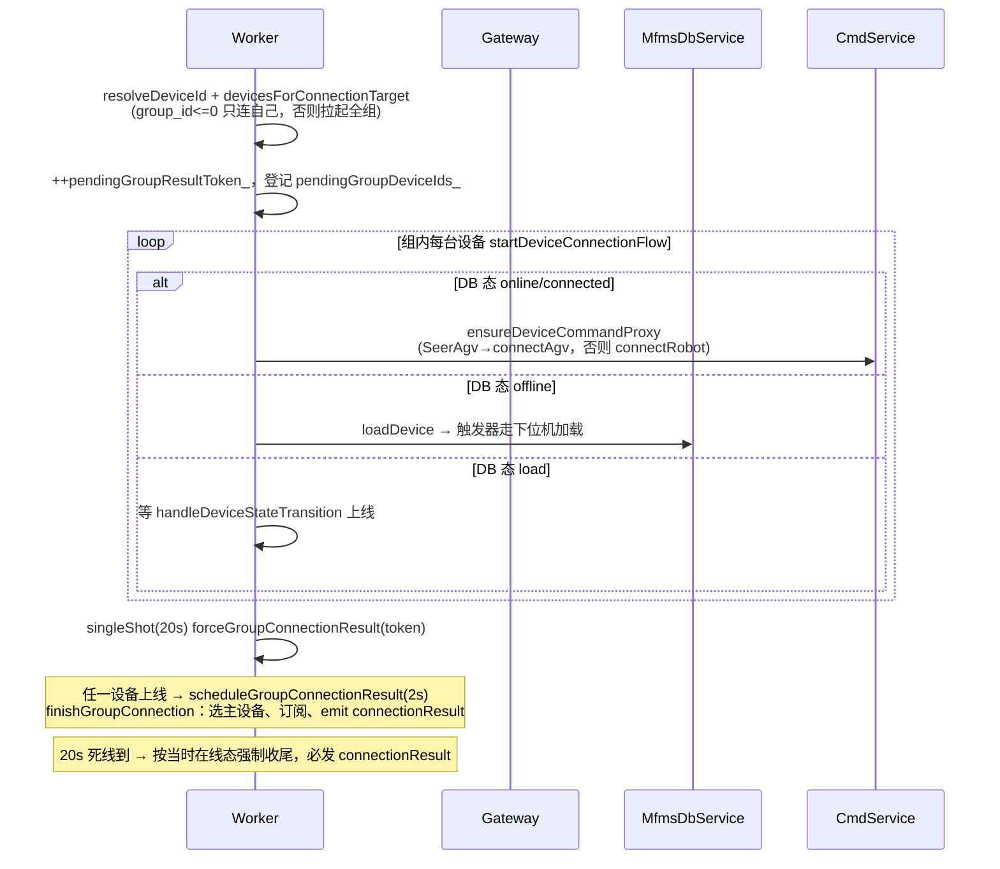
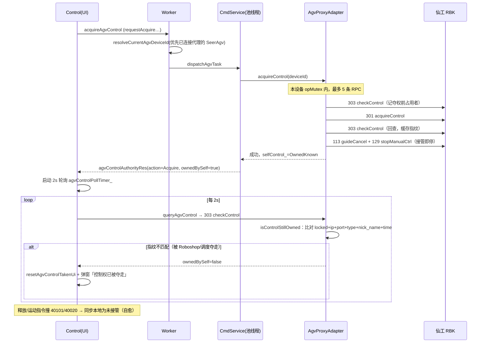
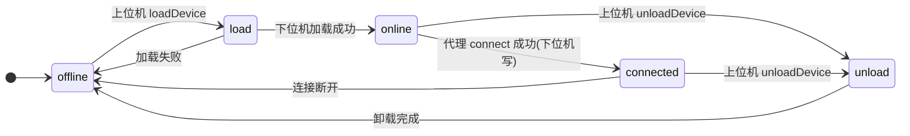
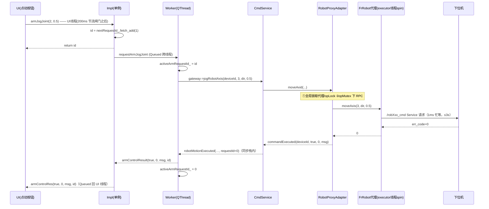

# MFMS 数据中台技术文档：架构、线程与代理层

> [!abstract] 本文定位
> 基于 **fix/homepage-client-api @ `2f21499`（2026-07-18）** 的代码逐行核实。相比上一版基准 `4f33b3b`（2026-07-16）新增 14 个提交，主要演进：**首页数据全量接入 client_api**（`9ae4678`，HomePageStatus/AlarmSnapshot 聚合）、**工厂告警日志实时 tail**（`5c96017`/`f86516b`/`1ead8a6`/`2f21499`）、**到点运动异步派发 + 按次放宽 RPC 超时**（`ac76897`）、**组内多 AGV 代理选择修复**（`31ac743`）、**agvSm4 调度车全链路隔离**（`498604e`）、**hyrms_export 库 vendor 化到 `vendor/hyrms_export/2.0.0`**。仓库内置的 `src/mfms_server/design/MFMS_DataCenter_Architecture.md`（4 月版）与 vault 里的 [[MFMS_DataCenter_Technical_Documentation]] 均早于这轮演进，涉及锁模型、信号签名、组连接的内容以本文为准。

**“数据中台”的范围**：不是单指数据库，而是 `qt_file` 前端与下位机之间的整个上位机通信中间层——`client_api（CommunicationInterface/Worker）+ gateway + mfms_db + ros_bridge + cmd_service + 两个代理适配器 + hyrms_export 代理库`，全部位于 `src/mfms_server/`（代理库已 vendor 化到 `vendor/hyrms_export/2.0.0`）。

相关笔记：[[MFMS上位机阶段Bug修复总览]] · [[MFMS上位机Bug修复汇总-锁竞态与控制权]] · [[MFMS上位机修改汇总-段错误、本地库与AGV接管功能]]

---

## 1. 分层架构总览

![[图片/10.研一上学期/10_2_1.svg|1100]]

自上而下九层，两条独立的通信平面，外加一条本地文件平面：

- **ROS 平面**（实时控制/状态）：UI → 单例 → Worker → Gateway → cmd_service → 代理适配器 → hyrms_export 代理节点 → `/{id}_cmd` Service 与 `/{id}_state` Topic → 下位机 linker。
- **数据库平面**（生命周期/脚本/资源）：mfms_db 与下位机通过 **MySQL 触发器 + 双事件表** 异步互通；ros_bridge、cmd_service 也各自直连 MySQL 做查询。
- **告警日志平面**（新增，`5c96017`）：worker 线程直接增量 tail 下位机 HyRMS 的 `hyrms_*.log`，与 ROS / DB 平面完全独立，详见 §4.4。

三条设计红线贯穿全部层次：

1. **UI 线程零阻塞**：所有耗时操作都在 worker 线程或线程池，UI 只收 `Qt::QueuedConnection` 信号。
2. **同设备串行、跨设备并行**：由代理适配器的每设备 `opMutex` 保证（`bac7252` 改造核心）。
3. **指令-确认分离**：数据库平面上位机只写意图态、下位机只写事实态，各自只消费对方的事件表。

自 `9ae4678` 起新增第四条约定：**UI 不再自行拼装跨设备视图**——首页所需的臂/AGV/导航/控制权/告警聚合全部由 worker 在中台侧汇成 `HomePageStatus`/`AlarmSnapshot` 推送，`qt_file` 的 CMake 已彻底移除对 hyrms_export SDK 的直接链接。

---

## 2. 进程模型

| 进程 | 启动方式 | 说明 |
| --- | --- | --- |
| `mfms-db-1`（mysql:8.0，原生 ARM64） | compose 服务 | 首次启动导入 `MFMS_BASE.sql`；现将 3306 绑定到宿主机回环 `127.0.0.1:3306`（供 Navicat 等工具，不暴露局域网；工作区未提交改动） |
| `mfms-mfms-1` 容器主进程 | `docker/entrypoint.sh` | 依次：colcon 增量构建 → Xtigervnc(:1) → websockify(6080) → `ros2 run qt_file qt_file` |
| **qt_file**（linux/amd64，Rosetta） | entrypoint 后台拉起 | 数据中台宿主进程，内部线程见 §3 |
| RViz `ros2 launch` / subscriber | qt_file 内 `QProcess`（`Myviz.cpp:1499`、`:1567`） | Myviz 页面按需派生 |
| `simulated_lower_machine` | 手动 `ros2 run` 或 `docker/soak_arm_jog.sh sim` | 模拟下位机；**不在 compose 编排内** |
| `soak_arm_jog` | 手动 | 浸泡测试客户端，走与 UI 相同的 7 层栈 |
| 下位机 HyRMS linker | 真机 192.168.83.74 | 设备适配节点 + Lua 解释器（不在本仓库） |

构建脚本 `bal.bash` 已重写为注释化的简版（首次构建强制全量、其后可 `./bal.bash qt_file myviz` 按包增量；未提交）。`HYRMS_EXPORT_ROOT` 从裸目录 `HyRMS_export_202601251449_bszydxh-HP/hyrms_export` 切到 `vendor/hyrms_export/2.0.0`（`src/mfms_server/CMakeLists.txt:27`），内容与旧 export 逐字节一致（仅 dev_proxy.hpp 少一个空行），属路径规范化而非升级。

> [!note] ROS 初始化位置
> `main.cpp` **不初始化 ROS**（`main.cpp:37-38` 注释明确），只在退出时 `rclcpp::shutdown()`。`rclcpp::init` 发生在 worker 线程 `CommunicationWorker::initialize()` 里（`CommunicationWorker.cpp:174`），由首次 `CommunicationInterface::instance()` 惰性触发。

---

## 3. 线程模型

![[图片/10.研一上学期/10_2_2.svg|1100]]

### 3.1 线程清单

| # | 线程 | 创建处 | 承载内容 |
| --- | --- | --- | --- |
| 1 | Qt UI 主线程 | `QApplication` | 全部窗体；`Control` 的两个轮询定时器与 200ms 点击节流闸门（`a2ce251`）；Myviz 的 rviz 节点（rviz 自带 executor） |
| 2 | CommunicationWorker 线程 | `CommunicationInterfaceImpl.cpp:106-110`（`new QThread` + `moveToThread`） | rosNode `communication_worker_node`、gateway 及 db/ros_bridge/cmd 三服务（QObject parent 链全在此线程）、全部 `doXxx` 槽、周期定时器（spin/status/poll + 首页聚合 + 告警 tail） |
| 3 | Robot executor | `RobotProxyAdapter.cpp:51-71`（`std::thread`） | `MultiThreadedExecutor::spin_some(10ms)+sleep(1ms)` 驱动 FrRobot/AuboRobot 代理节点 |
| 4 | AGV executor | `AgvProxyAdapter.cpp:99-120` | 同上，驱动 SeerCtrl 代理节点，RPC 的 future 在此被解析 |
| 5 | Qt 全局线程池 | `QtConcurrent::run` | 全部 AGV RPC 与**机械臂到点运动**（`MfmsCommandService.cpp:2363-2366`，`ac76897` 起）；UI 侧 `database_proxy` 查询 |
| — | rclcpp/DDS 内部线程、QtWebEngine 渲染进程 | 框架自建 | 不参与中台数据流 |

关键点：**进程内两套 spin 并存**——`communication_worker_node` 的订阅回调由 worker 线程 QTimer 驱动的 `rclcpp::spin_some` 处理（`MfmsRosBridge.cpp:970-976`，非独立 spin 线程）；各 `{id}_proxy` 代理节点由两个适配器各自的 std::thread executor 驱动。

### 3.2 周期活动总表

| 定时器 | 周期 | 线程 | 作用 | 代码 |
| --- | --- | --- | --- | --- |
| `spinTimer_` | 10ms（100Hz，可调 ≤1000Hz） | worker | `spin_some(rosNode_)` 处理状态订阅回调 | `MfmsRosBridge.cpp:163` |
| `statusTimer_` | 1s | worker | 心跳快照重算 + **每 3 tick 分频**拉一次设备列表 | `MfmsRosBridge.cpp:36-37`、`:960` |
| `pollTimer_` | 100ms（`MFMS_DB_POLL_INTERVAL_MS` 可调） | worker | 轮询 `device_ui_event` / `lua_ui_event` | `MfmsDbService.cpp:76-78` |
| `middlePlatformTimer_`（新增） | 1s | worker | 首页聚合：解析当前 AGV → 单飞查询导航状态与控制权 → 变化即推 `homePageStatusUpdated` | `CommunicationWorker.cpp:1996-2056` |
| `alarmTimer_`（新增） | 100ms（源文件重扫 3s 分频） | worker | 告警日志增量 tail，见 §4.4 | `CommunicationWorker.cpp:2058-2069`、`:2184` |
| executor 循环 ×2 | 10ms + 1ms sleep | 各自 std::thread | 代理节点 spin | 见 §3.1 |
| `agvNavStatusPollTimer_` | 1s | UI | 导航状态轮询，终态自动停 | `Control.cpp:1634-1638` |
| `agvControlPollTimer_` | 2s | UI | 接管期间查控制权归属（SEER 303） | `Control.cpp:1670-1674` |
| singleShot 2s | 一次性 | worker | 组连接延迟收尾（`kGroupConnectionResultDelayMs`） | `CommunicationWorker.cpp:32`、`:1573` |
| singleShot 20s | 一次性 | worker | 组连接死线 `forceGroupConnectionResult`（`kConnectResultDeadlineMs`） | `CommunicationWorker.cpp:35`、`:855` |
| 模拟器 4 定时器 | 20ms spin / 200ms 发布 / 500ms 轮库 / 2s info 同步 | 模拟器主线程 | `simulated_lower_machine.cpp:402-438` |

UI 侧另有非定时器的**点击节流闸门**：全部运动/任务类按钮共用一个 `QElapsedTimer`，距上次被接受的点击不足 200ms 即丢弃（`Control.cpp:38`、`:2130-2140`），拦截点设在指令漏斗处共 9 个。

### 3.3 锁与原子量全景

| 锁/原子量 | 归属 | 保护对象 | 备注 |
| --- | --- | --- | --- |
| `initMutex_` / `deviceTreeMutex_` / `deviceStatusMutex_` | Impl | init 序列 / 两个缓存 | `CommunicationInterfaceImpl.h:185-191` |
| `homePageStatusMutex_` / `alarmSnapshotMutex_`（新增） | Impl | `homePageStatusCache_` / `alarmSnapshotCache_`，UI 随时可拉的中台聚合快照 | `CommunicationInterfaceImpl.h:196-200` |
| `nextRequestId_`（atomic qint64，从 1 起） | Impl | 运动请求发号 | `.h:183-184` |
| `mutex_` | Worker | `devices_`、`currentDeviceId_`、`pendingGroup*` 等连接状态 | 30+ 处 `QMutexLocker` |
| `activeArmRequestId_`（普通 qint64） | Worker | 臂**同步链路**指令关联 | 仅 worker 线程读写，无需锁（`CommunicationWorker.h:281-284`）；到点异步链路已改由信号显式携带 ID（§8） |
| `mutex_` ×3 | 三服务各一把 | 各自内部状态；`running_` 为普通 bool 受其保护 | |
| 适配器全局 `mutex_` ×2 | 两适配器 | **仅**代理表 + `opMutexes_` 表 +（AGV）`selfControl_` | 绝不跨 RPC |
| `opMutexes_[deviceId]` ×2 套 | 两适配器 Impl | 该设备的串行 RPC 与代理结果成员 | 只增不删；详见 §7 |
| `running_` / `executorRunning_`（atomic） | 适配器 / Impl | 生命周期 | |

> [!tip] 与 52c1a83 的呼应
> UI 侧 `DatabasePool` 按 `QThread::currentThreadId()` 每线程一条 `QSqlDatabase`（`DatabasePool.cpp:24-27`）——这是修复"断库段错误"后的形态；中台侧三处 DB 连接（mfms_db、ros_bridge、cmd_service）连接名各自唯一且只在 worker 线程使用，天然满足 Qt 线程亲和约束。

---

## 4. client_api：UI 接入层

### 4.1 CommunicationInterfaceImpl（单例，UI 线程侧）

- **Meyers 单例**：`getInstance()` 内 `static CommunicationInterfaceImpl instance;`，首次访问惰性 `initialize()`（`CommunicationInterfaceImpl.cpp:48-58`）；基类 `CommunicationInterface::instance()` 是它的转发（`CommunicationInterface.cpp:6-9`）。
- **initialize() 全流程**（`:77-240`）：注册元类型（含新增的 `mfms::HomePageStatus` / `mfms::AlarmSnapshot`）→ `new CommunicationWorker` + `new QThread` + `moveToThread` → `QThread::started → worker->initialize`（保证初始化跑在新线程）→ 连接 ≈30 路 `requestXxx→doXxx` → 连接 worker 结果信号（其中 `homePageStatusUpdated` / `alarmSnapshotUpdated` 两路先写 Impl 缓存再转发，`:294-308`）→ `QEventLoop` 等 `initializationComplete`，超时 30s（`kInitializationTimeoutMs`）失败则清理线程。
- **shutdown()**：`QMetaObject::invokeMethod(worker_, "shutdown", Qt::BlockingQueuedConnection)`，特判"从 worker 线程调用"防死锁；随后 `thread_->quit()+wait(5000)`（`:328-382`）。
- 未初始化时对外槽直接回失败信号（如 `connectRobot` 直发 `connectResult(false,…)`，`:441-448`），不让 UI 无限等。
- 持有四份缓存：`deviceTreeCache_` / `deviceStatusCache_` / `homePageStatusCache_` / `alarmSnapshotCache_`，worker 每次推送先写缓存再转发信号，UI 随时可拉快照——`HomePage` 构造时即拉 `homePageStatus()` 与 `alarmSnapshot()` 兜底显示（`2f21499`，`HomePage.cpp:133-139`）。

### 4.2 CommunicationWorker（QThread 线程体）

**状态字段**（`CommunicationWorker.h:267-299`）：`currentDeviceId_`、`devices_`（OnlineDevice 列表）、`latestStatusSnapshot_`、`connectedDeviceIds_`、`connectedGroupId_`，组连接 pending 七件套（`pendingGroupDeviceIds_ / pendingPrimaryDeviceId_ / pendingGroupId_ / pendingGroupResultScheduled_ / pendingGroupResultToken_ / suppressedSubscribeResultDeviceIds_ / pendingSwitchDeviceIds_`），以及新增的首页聚合与告警 tail 字段组（`homePageStatus_`、`pendingNavigation/ControlDeviceId_`、`alarmSourcePath_ / alarmReadOffset_ / alarmPendingBytes_ / recentAlarmEntries_` 等）。

**doXxx 槽 ≈34 个**，按域分组：设备列表/树（doRefreshRobotList）、连接（doConnectRobot / doSwitchRobot / doDisconnectRobot）、AGV 站点与路径（doGetStations / doExeToStation(List) / doGetPaths / doExeToPath / doAdd/Update/DeletePath）、AGV 运动（doAgvMove* / doAgvTurn* / doStopAgvManualControl）、导航控制（doPause/Resume/Cancel/QueryNavigationStatus）、控制权（doAcquire/Release/QueryAgvControl）、机械臂（doArmJogJoint / doArmJogCartesian / doArmChangeMode / do*Waypoint）。

**组连接状态机**（`doConnectRobot`，`CommunicationWorker.cpp:776-858`）是最复杂的一段：



- 收尾 `finishGroupConnection`（`:1578` 起）用 token 防旧连接串台；`bestOnlineGroupDeviceIdLocked` 选主设备后 `subscribeDeviceById`。
- **doSwitchRobot 主设备纠偏**（`624fedd`，`:875-940`）：目标在已连组内且运行时在线 → 只切 `currentDeviceId_` 并 `ensureDeviceCommandProxy`，**不断连**；否则退化为"先 doDisconnectRobot 再 doConnectRobot"顺序执行。这是防止组连接后 jog 打到错误机械臂的关键。
- `doDisconnectRobot`（`:1338-1381`）：断开 `connectedDeviceIds_` 全部设备，`++pendingGroupResultToken_` 作废在途结果，`gateway->unsubscribe()`。

**上行状态分流 handleRobotStatus**（`:1857-1977`）：按 `isAgvType`（robotType 含 AGV/仙工/Seer）→ 构 `SeerCtrlState`（此处做 mm→m、deg→rad 的**反向**换算，因消息字段是 m/rad）；`isAuboType` → 构 `AuboRobotState`；默认 → `FrRobotState` 全字段。Impl 侧 Aubo 状态双发：`sendAuboARMState` + 经 `toGenericArmState` 泛化后的 `sendARMState`，旧 UI 零改动。自 `9ae4678` 起，此函数同时把臂遥测（`armDeviceId/armName/armType/armVersion/急停/错误码/程序态/motionDone`，`:1909-1919`）与 AGV 遥测（完整 `SeerCtrlState`，`:1891-1894`）写入 `homePageStatus_` 并触发推送。

### 4.3 DeviceTree（给 UI 的四层设备树）

`DeviceTreeRobot(group) → DeviceTreeCategory(rob/agv) → DeviceTreeVendor(robFro) → DeviceTreeDevice(robFro0001)`（`DeviceTree.h:52-143`）。builder 输入是 ros_bridge 的 `OnlineDevice`，因此放在 `client_api/src/DeviceTreeBuilder.cpp` 不对前端暴露；叶子提供 `stateTopic()` 供 RViz 直接订阅。`emitRobotList()` 同时发 id 列表（旧接口）与设备树（新接口）（`CommunicationWorker.cpp:1746-1758`）。

UI 侧另有**设备前缀白名单**（`0981c65`）：首页两个下拉框只显示 ID 前缀在 `AppConfig` `deviceIdWhitelist`（默认 robFro/robAub/agvSrc，空数组=不过滤）内的设备，过滤 plc/vit/alg/cam 等杂项；仅影响显示，不影响后端组连接。

### 4.4 中台聚合：HomePageStatus 与告警快照（新增，`9ae4678` 系列）

首页数据不再由 UI 自行拼装，全部经 client_api 聚合下发。两个新结构定义在 `CommunicationInterface.h:15-49`：

- **`mfms::HomePageStatus`**：组连接态（groupId/connected）+ 臂遥测摘要（deviceId/name/type/version/急停/错误码/程序态/motionDone）+ AGV 遥测（整包 `SeerCtrlState`，含 `9ae4678` 新增的电池字段）+ 导航任务态 + 控制权归属，附 `updatedAtMs`。
- **`mfms::AlarmSnapshot`**：告警源文件路径 + 最多 20 条告警行 + 时间戳。

**聚合路径**（全部在 worker 线程）：

1. `middlePlatformTimer_` 每 1s 跑 `pollMiddlePlatformStatus()`（`:2020-2056`）：用 `resolveCurrentAgvDeviceId` 解析当前组 AGV → 校验在线后**单飞**（`pendingNavigationDeviceId_` / `pendingControlDeviceId_` 非空即跳过）发起导航状态与控制权查询；结果在 initialize() 的 gateway 信号拦截里回填 `homePageStatus_`（`:282-302`），UI 主动查询与周期查询共用同一副单飞护栏。
2. `handleRobotStatus` 每收一包遥测即回填对应字段并 `publishHomePageStatus()`（变化才发）。
3. Impl 缓存 + `homePageStatusUpdated` 信号双通道，HomePage 构造即拉缓存兜底。

**告警 tail**（`alarmTimer_` 100ms，`:2058-2246`）：

- 源发现 `discoverAlarmSource()`（`:2071-2109`）优先级：`MFMS_ALARM_LOG_PATH`（指定文件）→ `MFMS_ALARM_LOG_DIR` → AppSettings 的 `alarmLogPath`/`alarmLogDirectory` → 默认目录 `/home/ubuntu/Desktop/code/HyRMS_0714/HyRMS/Log/console`；在目录内**递归**找最新的 `hyrms_*.log`。源扫描 3s 分频（`1ead8a6`），tail 本身 100ms。
- 增量读取：首次从文件尾部回退最多 1MB（`kAlarmInitialTailBytes`）起读，之后按 `alarmReadOffset_` 增量；文件截断/换源自动 reset。
- 行过滤：正则 `^\[(E|W|F)\]` 前缀（`f86516b` 起放宽为所有错误/警告/致命行），环形保留最近 20 条（`kAlarmMaxEntries`）。
- 发布去重：源与条目均无变化不重发（`lastPublishedAlarm*`）。

---

## 5. gateway：门面层

- 构造即建三子服务，全部 `parent=this`（`MfmsGatewayImpl.cpp:60-66`）→ 生命周期与线程归属一次锁定。
- `start()`：db → ros_bridge → cmd；**db 失败仅告警不计入 ok**（允许空数据模式起 UI）；`stop()` 严格逆序（`:136-166`）。
- 两类职责：**信号直通**（≈30 条 signal→signal 连接，零转换零拷贝）与**类型转换**（`toAgvCommand/toRobotCommand/toIoCommand/toGatewayResult`，隔离 gateway 命名空间与 mfms 内部类型）。
- `requestState` 是刻意的空实现（`:466-472`）——状态靠下位机周期发布，不存在"主动拉取"语义。
- `ac76897` 起 `robotMotionExecuted` 增加 `qint64 requestId = 0` 尾参、`moveToRobotWaypoint` 增加 requestId 直通参数；直通连接零改动（默认参兼容）。

---

## 6. 三服务详解

### 6.1 MfmsDbService（数据库事件服务）

- 连接：`QMYSQL`，连接名 `mfms_db_<this指针>` 保证多实例不冲突（`MfmsDbService.cpp:25-32`）；配置 `mfms::DbConfig`，**默认值已改为本地**：host `127.0.0.1`、用户 `hyrms`（`DbConfig.h:9-14`，配合 compose 内置 db 与宿主回环端口映射；勿回退），全部字段可被 `MFMS_DB_*` 环境变量覆盖（`DbConfig.h:46-57`）。
- **轮询协议**：启动时游标水位 = `MAX(id)`（跳过历史事件）；每 100ms `SELECT … WHERE id > ? ORDER BY id ASC LIMIT 100`，逐行**更新水位 → 解锁后 DELETE（防死锁）→ emit → 回锁**（`:545-637`）。事件消费即删，表常态为空。
- 写库统一走 `executeUpdateWithReason`：先 `SET @change_reason(=?)` 参数化会话变量再 UPDATE，触发器把 reason 带进事件行（`:501-537`）。
- **触发器缺失回退**：启动时查 `information_schema.TRIGGERS`，缺 `trg_*` 时由应用层直写 `*_state_event`，保证下位机仍能收到指令事件（`:341-462`）。

### 6.2 MfmsRosBridge（状态桥接）

![[图片/10.研一上学期/10_2_5.svg|1100]]

三个独立机制：

1. **设备列表**：核心 SQL `SELECT ds.id, ds.state, CAST(ds.info AS CHAR(4096)), … FROM device_state ds LEFT JOIN device d … WHERE ds.state IN ('offline','load','online','connected')`（排除 unload；`CAST` 是为消除 QMYSQL 预处理 JSON 列 ~1.1s 的 mmap 开销，`MfmsRosBridge.cpp:305-325`）。手动 `refreshDeviceList()` 每次必发；3s 周期 `pollDeviceList()`（`kDeviceListPollIntervalTicks=3`，`:37`、`:960`）**逐字段比较、变化才发**，前端下拉框不再被周期性重建（`e84267d`，`:400-423`）。
2. **当前订阅**：`subscribeByType` 按 `DeviceType` 三分支选消息类型（FrRobotState / AuboRobotState / SeerCtrlState），QoS 统一 `SensorDataQoS()`，话题名 = `/{完整设备ID}_state`（**不是** topic_prefix，`RobotTypes.h:59-69`）。Seer 转换抽出为 `convertSeerMessage()`（`:632-676`），除位姿/站点/速度外新增透传电池组字段（电量/温度/充电态/电压/电流/循环次数等）与定位置信度——`RobotRealtimeStatus` 扩展见 `RobotTypes.h:153-270`。输出 `robotStatusUpdated(RobotRealtimeStatus)`。
3. **全量监视**：`monitorEntries_` 为组内每台可心跳设备（仅 Fr/Aubo/Seer 三类）保持轻量订阅，1s 重算 `online = 3s 内有心跳`，`statusSnapshotChanged` 变化才发 `deviceStatusUpdated`。**行为变化（`9ae4678`）**：Seer 的监视回调不再只刷 `lastSeenMs`/`errCode`——它同时是**聚合路**，对非当前订阅设备转发完整遥测 `robotStatusUpdated`（当前设备由主订阅发布，监视路抑制以防双发，`:892-902`）。`DeviceRuntimeStatus::statusText()` 集中决策显示文案，能识别"DB 说在线但没数据"→「离线(无数据)」（`DeviceStatus.h:70-89`）。

### 6.3 MfmsCommandService（命令服务）

- 成员：两个适配器（unique_ptr + setParent）、独立 QMYSQL 连接（`MfmsCommandService_<this>`）、`onlineDevices_` 缓存、一把 `mutex_`。**无自建线程**。
- **三种执行模型**（`ac76897` 起从两种变为三种）：
    - 机械臂 jog/模式/IO 等短指令：worker 线程**同步直调**适配器；
    - 机械臂**到点运动**：`QtConcurrent::run` 异步派发 + **按次放宽 RPC 超时 60s**（`kWaypointMoveRpcTimeoutSec`，`:2012`、派发体 `:2090-2115`），结果 `QMetaObject::invokeMethod` 回投 worker 线程、`robotMotionExecuted` 显式携带 requestId。改造动机：下位机的到点服务**执行完运动才回包**，3s 快超时把长行程成功运动误判为 -1001；同时 worker 线程不再被整段行程阻塞。60s 仍超时的文案如实提示"指令已下发，机械臂可能仍在运动"；
    - AGV 指令：一律 `dispatchAgvTask → QtConcurrent::run`（`:2363-2366`），结果 Queued 回投。
- **jog 读-改-写**在此层：`jogRobotCartesian = getDescPose → targetPos[axis]±=step → moveL(DESC)`（`:1661-1717`，核心 `:1703-1717`）——非原子，真机并发会物理漂移，soak 工具因此强制真机关闭流水线。
- AGV 手动运动换算：UI 的"速度+距离/角度"→ `x/y/w + durationMs`（`durationFromDistance = distance/speed*1000`，`:83`；角速度 deg→rad，`:424-445`）。
- 控制权预检失败消息现附带设备 ID（`31ac743`），现场可直接看出指令打到了哪台。
- 路径/路点资源：`agv_path`（查/增/改/删，事务 + 1062 重复键判定）与 `robot_waypoint`（保存时同取关节+笛卡尔位姿存 JSON）全在此层直连 DB。

---

## 7. 代理层布置（重点）

![[图片/10.研一上学期/10_2_3.svg|1100]]

### 7.1 PIMPL 与 executor

两个适配器同构（`RobotProxyAdapter.cpp:46-200` / `AgvProxyAdapter.cpp:94-242`）：

- `Impl` 持有：代理表（Robot 侧**两张**：`proxies_<FrRobot>` + `auboProxies_<AuboRobot>`，因两类无公共基接口；AGV 侧一张 `proxies_<SeerCtrl>`）、`opMutexes_`、`MultiThreadedExecutor` + `std::thread` + `executorRunning_`。
- 代理节点命名 `deviceId + "_proxy"`，`add_node/remove_node` 随连接/断开动态挂卸。

### 7.2 双层锁范式（bac7252）

每个对外方法固定两段：

```cpp
// 段①：全局锁短持有 —— 只取资源
QSharedPointer<QMutex> opLock;
std::shared_ptr<RobotProxy::FrRobot> fr;
{
    QMutexLocker locker(&mutex_);          // 全局锁
    if (!running_) return NOT_RUNNING;
    fr = impl_->getProxy(deviceId);        // 查代理表
    if (!fr) return DEVICE_NOT_CONNECTED;
    opLock = impl_->opMutexLocked(deviceId); // 取/建每设备锁
}                                           // ← 全局锁在此释放
// 段②：每设备锁下执行 RPC —— 同设备串行、跨设备并行
QMutexLocker op(opLock.get());
int32_t result = fr->moveAxis(axisId, direction, step);  // 阻塞 RPC，最长 3s
op.unlock();                                // 先解锁
emit commandExecuted(deviceId, result == 0, result, msg); // 再发信号
```

配套护栏：

| 护栏 | 值 | 原因 | 代码 |
| --- | --- | --- | --- |
| `ShortRpcTimeoutProxy<T>` | `future_timeout_` 默认（ConfigManager，实测 8s）→**3s** | 基类成员是 protected，用派生类暴露；8s 意味着下位机卡死时单条 RPC 占设备锁 8s | `RobotProxyAdapter.cpp:28-33`、`dev_proxy.hpp:250` |
| 按次放宽 RPC 超时（新增，`ac76897`） | `applyRpcTimeoutSecs`：moveJ/moveL 的 `rpcTimeoutSecs` 参数，到点 60s，RPC 后恢复 3s | 到点服务执行完运动才回包，长行程远超 3s；放宽仅对本次调用生效，期间同设备指令仍被 opMutex 正常串行 | `RobotProxyAdapter.cpp:35-41`、`RobotProxyAdapter.h:98-118` |
| `wait_for_service(1s)` 预检 | 连接前（Robot）/ 每个操作前（AGV） | `connect()` 在闭源 .so 内，服务缺失时无限阻塞（实测 >15s 无返回） | `RobotProxyAdapter.cpp:36-42`、`AgvProxyAdapter.cpp:17,55-59` |
| `opMutexes_` 只增不删 | 条目数=历史设备数 | 代理移除时销毁互斥会砸在途 RPC | `RobotProxyAdapter.cpp:149-181` |
| 失败回滚 | connect 失败重取全局锁 removeProxy；AGV 同时 clearSelfControl | 防脏代理残留 | `:292` / AGV `:333-336` |

### 7.3 hyrms_export 代理库机制

- **vendor 化**：库固定在 `vendor/hyrms_export/2.0.0`（include + `libhyrms_export.so`），CMake `HYRMS_EXPORT_ROOT` 指向它；`qt_file` 的 CMake 已**移除对该 SDK 的全部直接链接**（首页数据改走 client_api）。内容与旧散装 export 一致，非功能升级。
- 继承链：`HyDevProxy : rclcpp::Node` → CRTP `HySimpleDevProxy<Derived, CmdIf, StateT>` → 具体设备类（`dev_proxy.hpp:44-254`）。
- **命名规则**：节点名 `robFro0001_proxy` → `get_base_name()` 取下划线前段 `robFro0001` → service `/robFro0001_cmd`、topic `/robFro0001_state`（`:55-70`）。模拟器旧前缀命名 `/robFro_cmd` 与此不符正是 `11b042c` 修的 bug 之一。
- **`call_service` 实现**（`:152-185`）：`async_send_request` 后 `while(rclcpp::ok())` 以 **1ms** 粒度 `future.wait_for` 忙轮询；`future_timeout_` 秒内未就绪返回 `-1001`。future 由适配器 executor 线程 spin 解析——所以**调用线程忙等、executor 线程收包**是这套库的固定协作模式。
- **状态订阅 QoS**：`create_subscription(topic, 10, cb)` → KeepLast(10) + 默认 **RELIABLE**。发布端必须 RELIABLE 才能兼容（见 §6.2 图）。
- 设备类全量：FrRobot / AuboRobot（robot.hpp）、SeerCtrl / SeerM4（agv.hpp）、VisionEngine / SiemensPlc / Realsense / VirtDev（存在但适配器未用）。
- 消息同步：`SeerM4State.msg` 新增 `AgvOrderState order_state` 运单状态字段（`9ae4678`，随新一版下位机 export 的 com_interfaces 合入）。
- SEER 指令 ID（SEER_CTRL_COMMAND_ID.h）：`101 guideGoTarget / 102 goTargetList / 111 pause / 112 continue / 113 cancel / 121 startManualCtrl / 129 stopManualCtrl / 201 checkGuide / 202 checkStation / 301 acquireControl / 302 releaseControl / 303 checkControl`。

### 7.4 设备 ID 路由

ID 结构 `[3位类别][3位模块][4位实例]`（`DeviceTypes.h:83-99`）：

| 类别码 | 模块码 | DeviceType | 走的代理类 |
| --- | --- | --- | --- |
| rob/rbt | fro/fra/fan | FrRobot | `RobotProxy::FrRobot` |
| rob/rbt | aob/aub | AuboRobot | `RobotProxy::AuboRobot`（独立表） |
| rob/rbt | hsu | HsRobot | `RobotProxy::FrRobot`（共用） |
| agv | src/ser | SeerAgv | `AgvProxy::SeerCtrl` |
| agv | sm4 等非仙工 | **Unknown（隔离）** | 无——禁止任何操作 |
| plc/cam/vit | … | 预留 | 未接适配器 |

> [!warning] agvSm4 全链路隔离（`498604e`）
> 现场约束：本代码只对接仙工（Src/Ser）AGV，调度车 `agvSm4*` 不归本系统管、禁止任何操作。原 `inferDeviceType` 的 `contains("AGV")` 泛化兜底会把 agvSm4 误判成 SeerAgv——组连接对它 connectAgv、指令解析可能选中它。收窄后（`DeviceTypes.h:246-254`、`:294-300`）agvSm4* 为 Unknown：组连接跳过、指令解析不选中、状态监视不订阅、首页白名单本就隐藏——全链路零接触。配套的 `31ac743`：`resolveCurrentAgvDeviceId` 统一**优先返回已建立命令代理的 SeerAgv**（`CommunicationWorker.cpp:1626-1700`），被隔离/无代理设备仅作无更优候选时的兜底，修复了组内多 AGV 时接管报 3004"AGV 代理未连接"。

Aubo 特殊点：适配器对 Aubo 的 `setIO/getIO` 直接返回 `UNSUPPORTED_OPERATION(-2006)`；速度设置走 `setSpeed(double)` 而非 Fr 的 `setVec`。

---

## 8. requestId 关联机制

![[图片/10.研一上学期/10_2_6.svg|1100]]

- 发号：`nextRequestId_.fetch_add(1)`，0 保留为"无法关联"；运动类接口（armJog*/armMoveToWaypoint/agvMove*/agvTurn*/stopAgvManualControl）返回该 ID。
- **臂短指令链路（同步）**：worker 栈内 `activeArmRequestId_ = id → gateway 调用 → =0`，结果回调发生在同一调用栈，`armControlRes` 尾参取当时值。
- **臂到点链路（异步，`ac76897` 起）**：requestId 随 `moveToRobotWaypoint(deviceId, pointName, moveMode, requestId)` 显式下传，异步派发完成后 `robotMotionExecuted(…, requestId)` 带 ID 回投；worker 转发 lambda 规则：`requestId != 0 ? requestId : activeArmRequestId_`——非零显式携带优先，零回退栈内关联，存量同步链路零改动。
- **AGV 链路（异步）**：ID 进 `AgvMotionCommand.requestId`（`CommandTypes.h:37`），穿过 QtConcurrent 与 Queued 回投原样带回。
- 适配器层 `RobotProxyAdapter::commandExecuted` 本身**仍无 ID 字段**——若未来把 jog 也改异步，仍须先把 ID 下沉到适配器层。
- 站点/路径/导航/控制权类结果 requestId 恒为 0；UI 精确配对尚未消费（遗留）。

---

## 9. AGV 控制权子系统



要点：

- 指纹 = `DEVM::AgvControl{locked, ip, port, type, nick_name, time}`；`time` 是抢占时刻戳，可识别"同 IP 换主"；`desc` 不参与比对。回查失败退化为 `OwnedUnknown`（locked 即视为持有）。
- 结果走**独立信号** `agvControlAuthorityExecuted(deviceId, action, success, errorCode, message, ownedBySelf)`，与导航/运动结果隔离，防状态机被轮询结果击穿。`action` 常量（Acquire=1/Release=2/Query=3）在服务层、worker、接口层**三处同值镜像**，改动需三处同步（各处有注释互指）。
- 控制权查询结果同时回填 `HomePageStatus.agvControlOwnedBySelf`（§4.4），首页与 Control 页共享同一数据源。
- 原生错误码：`40020` 被占用 / `40101` req_forbidden（本端非控制方）/ `40400`、`40401` 获取/释放失败。
- 停车结果无法由返回码可靠判定，UI 措辞如实提示人工确认——SEER 被夺权时车**不会自动停**，接管即停是安全兜底。

---

## 10. 数据库平面

![[图片/10.研一上学期/10_2_4.svg|1100]]

### 10.1 表清单（MFMS_BASE.sql，当前版本已含 agv_path）

| 表 | 用途 | 关键点 |
| --- | --- | --- |
| `device` / `device_state` | 设备注册 / 生命周期态 | state 枚举 offline/online/load/unload/connected；info JSON |
| `device_state_event` / `device_ui_event` | 下行 / 上行事件 | 触发器写入，消费即删 |
| `lua_script` / `lua_state` | 脚本内容 / 执行态 | 8 态；主键 (script_id, group_id) |
| `lua_state_event` / `lua_ui_event` | 下行 / 上行事件 | 同上 |
| `agv_path` / `agv_path_station` | 命名路径资源 | **已在 SQL 中**（旧文档说缺失，已过时）；外键级联删除 |
| `robot_waypoint` | 机械臂路点 | joint_pos/desc_pos 双 JSON |
| `users` / `alterLogs` / `hyrms_log` / `trigger_table` | 账号 / 登录日志 / 下位机日志 / 杂项 | |

连接拓扑现状：容器内三服务连 compose 内置 db；宿主机工具（Navicat 等）经 `127.0.0.1:3306` 回环映射直连同一库；`DbConfig` 默认值即本地（远程库 `100.84.157.31` 长期离线，已从默认值移除）。

### 10.2 状态机



Lua 8 态的"指令态/确认态"分离：上位机写 `ready/pause/resume/abort`（触发器 → `lua_state_event` 给下位机），下位机写 `running/wait/paused/aborted`（→ `lua_ui_event` 给上位机）。`aborted` 携带失败原因，UI 需弹窗。

Worker 侧消费 `handleDeviceStateTransition`（`CommunicationWorker.cpp:1760-1855`）：更新本地 `devices_` 与状态快照；组连接 pending 设备上线即 `ensureDeviceCommandProxy` 并调度收尾，终态离线则提前判败。

---

## 11. 端到端链路示例（关节点动）



到点运动（armMoveToWaypoint）与上图的差别只在 CmdService 之后：查库取路点 → `QtConcurrent::run` 派发到池线程 → 临时把该设备 RPC 超时放宽到 60s 执行 moveJ/moveL → 结果连同显式 requestId Queued 回投 worker → `robotMotionExecuted(…, id)`。worker 线程全程不被行程阻塞。

---

## 12. 单位与坐标约定

| 链路 | 单位 | 换算点 |
| --- | --- | --- |
| UI ↔ Worker ↔ CmdService ↔ 适配器 ↔ 下位机（Fr **和** Aubo） | **mm / deg 全程直传** | 无换算（`4f33b3b` 后铁律：下位机 HyRMS 封装层已把 aubo_sdk 的 m/rad 归一为 mm/deg） |
| `SeerCtrlState` 消息字段 | m / rad | ros_bridge 收包 ×1000、×180/π 转 mm/deg（`convertSeerMessage`，`MfmsRosBridge.cpp:632-676`）；Worker 反向构包时再转回。电池/置信度等新透传字段无单位换算 |
| AGV 手动控制角速度 | UI deg/s → 下发 rad/s | `MfmsCommandService.cpp:424-445` |
| linker 内部日志 | m / rad | 对照时勿误判（`x:0.449` = 449mm） |

> [!warning] 单位纠错方法论
> 一律以 `ros2 topic echo /{id}_state` 实测量级为准，不信 SDK 头文件注释——`29cc7c6→4f33b3b` 的教训详见 [[MFMS上位机Bug修复汇总-锁竞态与控制权#Bug 6：Aubo 笛卡尔单位误换算（自引入，真机纠错）⭐ 教训最深]]。

---

## 13. 错误码总表

| 区段 | 范围 | 定义处 |
| --- | --- | --- |
| hyrms_export 传输层 | 0 / -1001 超时 / -1002 参数 / -1009 其他 | `dev_proxy.hpp:9-12` |
| hyrms 设备级 | -1110 警告 ~ -1140 致命 / -1199 未注册 | `dev_proxy.hpp:24-29` |
| RobotProxyAdapter | -2001~-2007（含 -2006 UNSUPPORTED、-2007 SERVICE_NOT_READY） | `RobotProxyAdapter.h:212-221` |
| AgvProxyAdapter | -2101~-2107 | `AgvProxyAdapter.h:73-80` |
| CommandService | 3001~3015（DB/设备/路径类） | `MfmsCommandService.h:457-474` |
| MfmsDbService | 1001~1005 | `DbTypes.h:80-87` |
| SEER 原生（控制权） | 40020 / 40101 / 40400 / 40401 | 语义见 §9 |

到点链路的 -1001 语义自 `ac76897` 起变化：60s 内未回包才报超时，且文案提示"指令已下发，机械臂可能仍在运动"（此前 3s 快超时会把成功的长行程误报为 -1001）。

---

## 14. 已知风险与文档-代码不一致点

1. **armChangeMode 0/1 语义冲突仍在**：接口注释 `0=自动,1=手动`，底层 SDK `0=手动,1=自动`，透传无映射（旧文档 8.2 节风险未消）。
2. `MfmsDbService.h` 注释与实现不一致两处：`resumeLuaScript` 注释说写 `ready` 实际写 `resume`；`abortLuaScript` 注释说走 pause-确认流程实际直写 `abort`。
3. `subscribeDeviceById` 的单设备 SQL 未做 `CAST(info AS CHAR)`（列表查询已做），留有同样的 QMYSQL JSON 慢查询隐患。
4. ~~臂链路 commandExecuted 无 requestId 字段~~ **部分收敛（`ac76897`）**：cmd_service 的 `robotMotionExecuted` 已带 requestId 尾参，到点异步链路显式携带；但适配器层 `commandExecuted` 仍无 ID，jog 等同步链路仍靠调用栈关联——jog 异步化前必须先把 ID 下沉到适配器层。
5. `AgvControlAction` 三处同值镜像常量，跨层改动需同步。
6. `opMutexes_` 只增不删，长期运行条目数=历史设备数（量级可控，知晓即可）。
7. UI 尚未消费 requestId 做结果精确配对（信号已带 4 参）。
8. **告警 tail 的环境耦合（新增）**：默认目录写死下位机绝对路径 `/home/ubuntu/Desktop/code/HyRMS_0714/HyRMS/Log/console`，跨环境需 `MFMS_ALARM_LOG_PATH/DIR` 或 AppSettings `alarmLogPath`/`alarmLogDirectory` 覆盖；行过滤只认 `[E|W|F]` 前缀，下位机日志格式变更会静默漏报。
9. **HomePageStatus 单臂假设（新增）**：`handleRobotStatus` 对臂遥测无条件覆盖 `armDeviceId` 等字段，组内多臂时首页显示为"最后一包"的臂，存在互相覆盖。
10. **到点 60s 窗口的串行代价（新增）**：放宽超时期间该设备 `opMutex` 被占，同设备后续指令最长排队 60s（跨设备不受影响）；且到点与全部 AGV RPC 共享 Qt 全局线程池。
11. `src/mfms_server/design/` 下新增 `REFACTOR_PROPOSAL_LightCore.md`（v1/v2，未提交）为重构提案，**未实施**——阅读时勿与现状混淆。

---

## 15. 验证工具

- **simulated_lower_machine**（`tools/`，单线程 QCoreApplication + 4 QTimer）：以 RELIABLE QoS 发布状态、完整设备 ID 命名服务，与真实代理兼容（`11b042c` 后）；`--kind fr/aubo/seer`。
- **soak_arm_jog**：走与 UI 相同 7 层栈的浸泡测试，`timeout_late/timeout/串扰` 三分类定位锁 vs 竞态；浸泡动作已扩为 **6 对 12 个小幅动作覆盖全部笛卡尔轴 X/Y/Z/RX/RY/RZ**（`41f7779`），仍先正后负成对自抵消 + moveToOrigin 兜底回原位；真机需 `--allow-group` 显式豁免并自动套护栏（关流水线、≥300ms 间隔、步长 ≤2mm/2°、`--skip-restore` 零写库）。`ac76897` 的异步到点链路经模拟环境 30s 浸泡 556 条零失败零超时零串扰回归。用法与验证数据见 [[MFMS上位机Bug修复汇总-锁竞态与控制权#配套工具：soak_arm_jog]]。

---

## 16. 关联笔记

- [[MFMS上位机阶段Bug修复总览]] —— 上一阶段 8 个 bug 的索引
- [[MFMS上位机Bug修复汇总-锁竞态与控制权]] —— 锁/竞态/控制权修复详录与真机验证
- [[MFMS上位机修改汇总-段错误、本地库与AGV接管功能]] —— 段错误、本地库切换与 AGV 接管
- [[MFMS_DataCenter_Technical_Documentation]] / [[MFMS_DataCenter_Architecture]] —— 4 月版旧文档（接口清单、ER 图仍可参考；锁模型与信号签名已过时）
