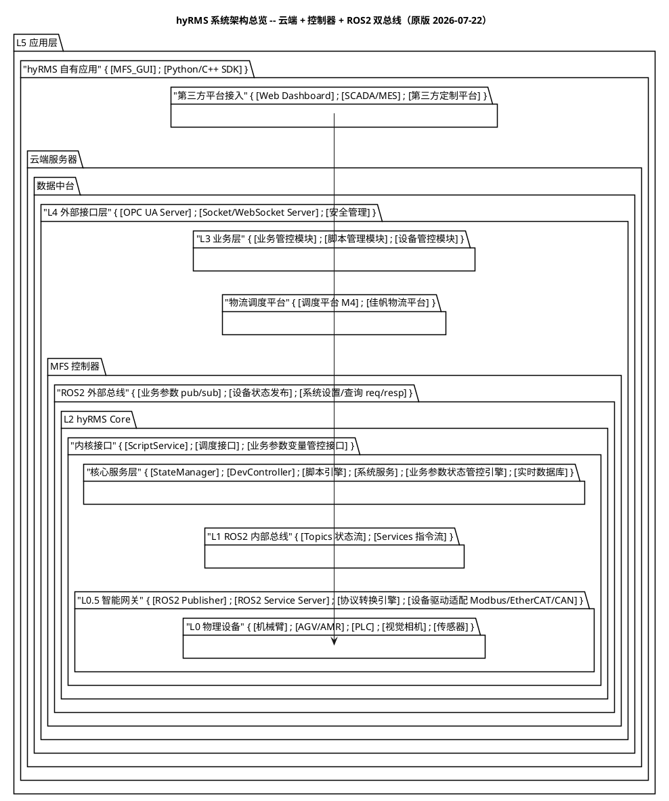
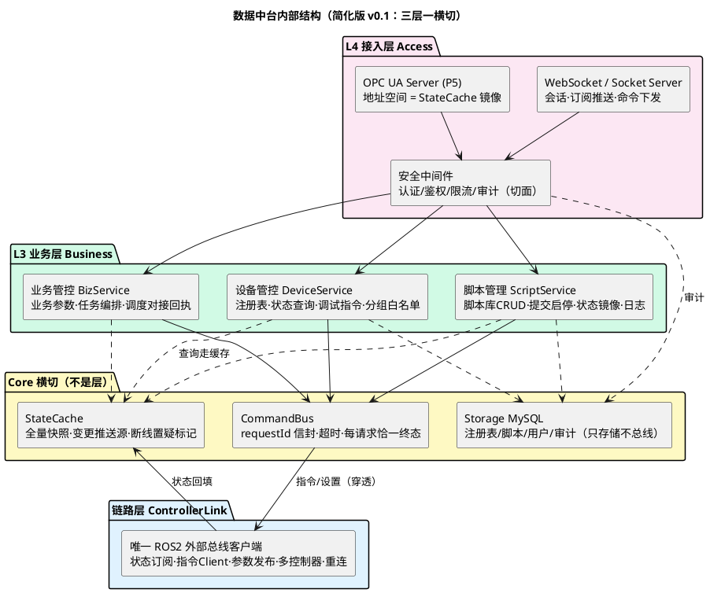

# MFMS 数据中台新版架构设计：分层、功能清单与 .trellis 规划

> [!abstract] 本文定位
> 基于 `1_system_architecture.puml`（hyRMS 系统架构总览，2026-07-22）的**数据中台重设计工作稿**。输入材料：新版总览 puml、`REFACTOR_PROPOSAL_LightCore_v2.md`（其契约设计被吸收、其重构执行建议冻结）、[[MFMS数据中台技术文档-架构线程与代理层]]（旧架构现状）。本文是讨论稿，定稿前所有小节都可推翻；定稿后浓缩为 `.trellis/ARCHMAP.md` 与层卡片。

---

## 1. 边界变化：数据中台从"进程内中间层"变成"云端服务"

| 维度 | 旧（现行 MFMS） | 新（hyRMS 总览） |
| --- | --- | --- |
| 数据中台位置 | qt_file 进程内 7 层（client_api→gateway→三服务→适配器） | 云端独立服务：L4 外部接口层 + L3 业务层 |
| 上位机 GUI | 与中台同进程，直接持有单例 | 纯 L5 应用（MFS_GUI），走 SDK / 外部总线 |
| 与设备侧通信 | MySQL 触发器双事件表 + 直连 `/{id}_cmd`/`/{id}_state` | ROS2 外部总线三通道（业务参数 pub/sub · 设备状态发布 · 系统设置/查询 req/resp） |
| 设备接入 | hyrms_export 代理库 + 下位机 linker | MFS 控制器（hyRMS Core）+ L0.5 智能网关（协议转换 + Modbus/EtherCAT/CAN 驱动） |
| MySQL 角色 | 持久存储 **兼消息总线**（触发器协议） | 只做持久存储（注册表/脚本库/用户/审计） |
| 多客户端 | 单 GUI | GUI/SDK/Web/SCADA/MES/第三方 并发接入 |

**旧组件职责迁移表**（"去哪了"）：

| 旧组件 | 新去处 |
| --- | --- |
| CommunicationInterface/Impl/Worker | 拆解：UI 接入 → SDK 客户端库；HomePageStatus 聚合 → 中台 StateCache + 设备管控；告警 tail → 控制器系统服务经总线上报（**不再 tail 文件**） |
| gateway（纯转发） | 消失（LightCore 已判死刑，新架构直接不建） |
| mfms_db（触发器双事件表协议） | 退役，被外部总线 req/resp + topic 取代；MySQL 触发器协议进入只读存续期 |
| ros_bridge | 一分为二：控制器 StateManager（归一化）+ 中台 StateCache（缓存与推送源） |
| cmd_service + 两适配器 | 下移：控制器 DevController + L0.5 网关；**中台不再做设备级锁**（每设备串行语义由控制器保证） |
| qt_file GUI | 保留为 MFS_GUI，最后切换到 SDK |

---

## 2. 对原版 puml 的修改建议（简化 5 条）

原版连线编号见 puml。以下修改全部以"简单、可维护"为准绳：

1. **删除线 11（设备管控 → L1 内部总线）**。云端中台若能直捅控制器内网总线，等于绕开控制器的状态归一与串行保证，回到旧架构"多入口打设备"的老路。中台一律只经外部总线。
2. **线 2（GUI/SDK → L1 直连）标注 debug-only**。保留调试后门，但必须挂显式开关（环境变量/编译开关），生产禁用。
3. **中台内部补两个组件：ControllerLink 与 StateCache**。原版 L3 三模块直连外部总线，意味着每个业务模块都要各自懂 ROS2（三份订阅/重连/超时逻辑）。集中到唯一的 ControllerLink（对应控制器侧的 DevController 镜像），业务模块只面对进程内接口。这是"统一脚本+分层锚点数据"同款思想：**协议逻辑一份，业务数据多份**。
4. **安全管理画为 L4 中间件而非并列组件**。认证/鉴权/限流是所有端点的前置切面，不是第四个端点。
5. **线 4/5（M4→调度接口、佳帆→业务参数接口，直连控制器内核）保留但锁契约**。调度平台绕过中台直连控制器是高频运单通道，加一跳中台无价值；但必须在 P0 契约里锁定其可调用的接口集，并在控制器端留审计，否则中台的安全层形同虚设。

### 2.1 原版总览（存档）



### 2.2 数据中台内部结构（我的简化版 v0.1）



---

## 3. 新版数据中台：层与功能清单（核心）

四个部分：三层 + 一个横切内核。**调用规则：Access → Business → CommandBus/StateCache → ControllerLink，禁止跨层，禁止反向。**

### 3.1 L4 接入层 Access

职责：把多协议外部世界归一成三种内部动作——**命令、查询、订阅**；全系统唯一的认证鉴权点。

| 功能 | 内容 | 期数 |
| --- | --- | --- |
| WebSocket/Socket 服务 | 会话与心跳；JSON 命令下发（携带客户端侧幂等键）；状态/告警/结果按订阅推送；结果按 requestId 回推 | P2 |
| SDK 接入 | 即上述协议的 Python/C++ 封装库，GUI 与二次开发共用同一条通道（不给 GUI 开小灶） | P2 |
| OPC UA Server | 地址空间映射 StateCache 变量；写节点转命令 | P5 |
| 安全中间件 | token 认证；角色鉴权（viewer/operator/admin）；会话级限流；审计日志（谁、何时、对哪台设备、下了什么指令、结果如何） | 骨架 P2，硬化 P5 |

明确不做：业务判断、设备寻址、状态缓存（只调业务层）。

### 3.2 L3 业务层 Business（三模块，每模块一个目录）

**设备管控 DeviceService**：设备注册表（静态配置 + 控制器上报合并，含设备类型/分组/能力）；状态与告警聚合查询（一律读 StateCache）；调试指令（jog/到点/AGV 导航/控制权，参数校验后交 CommandBus）；**设备白名单/禁区由注册表数据驱动**（取代旧架构 agvSm4 硬编码在类型推断里的做法）。

**脚本管理 ScriptService**：脚本库 CRUD 与版本（存 MySQL）；提交/启停/暂停（经 ControllerLink 调控制器 ScriptService 内核接口）；执行状态镜像（沿用 running/wait/paused/aborted 语义，`aborted` 带原因）；执行日志收集与查询。

**业务管控 BizService**：业务参数变量读写（经业务参数通道）；任务编排（把运单/流程分解为设备动作与脚本序列）；调度平台对接（M4/佳帆运单接收、进度回执）。

明确不做：ROS2 细节、协议细节、设备级串行控制（控制器负责）。

### 3.3 Core 横切内核（共享，不算层）

| 组件 | 内容 | 吸收的旧教训 |
| --- | --- | --- |
| CommandBus | 统一命令信封 `{requestId, source会话, target, action, payload, deadline}`；接入层生成 ID；派发与超时管理；**每个受理请求有且仅有一个同 ID 终态** | 旧架构 requestId 半条链路、信号改名五连（LightCore §2.5/§4.3） |
| StateCache | 设备/脚本/业务参数全量最新快照；变更通知（推送唯一来源）；控制器断线 → 数据带"置疑"标记而非静默过期 | 旧 HomePageStatus 聚合 + 「离线(无数据)」显示决策 |
| Storage | MySQL：注册表、脚本库、用户、审计。**只存储，不做消息总线** | 触发器双事件表协议退役 |
| 配置/日志 | 单一配置文件 + 环境变量覆盖（沿用 `MFMS_DB_*` 风格）；结构化日志 | DbConfig 环境覆盖模式是旧架构少数值得全盘继承的设计 |

### 3.4 链路层 ControllerLink

职责：**进程内唯一**碰 ROS2 外部总线的组件（控制器侧 DevController 的镜像原则）。

功能：三通道客户端（状态订阅、系统设置/查询与指令 Service Client、业务参数发布）；多控制器支持（每控制器一个 namespace + 会话）；上下线检测（liveliness/心跳）、断线重连、在途请求超时终态化；**单位与错误码契约的执行点**（总线上全 mm/deg，错误码分段透传不改写）。

明确不做：业务判断、缓存（状态直接回填 StateCache）。

### 3.5 触碰预算（反加码的硬指标）

新增一条业务命令 = 接入层 handler（1 文件）+ 业务模块方法（1 文件）+（若新指令类型）ControllerLink 方法（1 文件）≤ **3 文件**。对比旧架构穿透 6 层。`.trellis` check 阶段核对该预算，超预算必须给出书面理由。

---

## 4. 红线草案（constraints.md v2）

1. 中台禁止直连 L1 内部总线；GUI/SDK 直连仅限 debug 开关下。
2. 只准调相邻层；禁止新增转发层/结果改名链；新命令触碰 ≤3 文件。
3. requestId 由接入层生成，信封透传到底，每请求恰一终态；结果只加字段不改签名。
4. 状态查询一律走 StateCache；穿透到控制器的只有指令与设置。
5. 设备级串行/锁在控制器侧；中台不持设备锁。
6. MySQL 只做存储；触发器协议存续期间只读不改。
7. 外部总线单位铁律：mm/deg（P0 契约冻结，以 `ros2 topic echo` 实测为准，不信头文件注释）。
8. 存续红线：`MFMS_BASE.sql` 禁止真机执行；下位机 `DbConfig.h` 改动勿回退；agvSm4 等非管辖设备零接触（新机制=注册表白名单，旧机制=类型推断收窄，切换前两者并存）。

---

## 5. 分期建设路线（每期一条可演示的竖切）

| 期 | 内容 | 可演示结果 |
| --- | --- | --- |
| P0 | **契约冻结**：外部总线 msg/srv 定义（设备状态/指令/脚本/业务参数/告警）、命令信封 schema、错误码分段、单位铁律。产出 `com_interfaces_v2` + `.trellis/spec/contracts/bus-contracts.md` | 契约文档评审通过；新旧系统的接缝从此固定 |
| P1 | ControllerLink + StateCache 骨架 | CLI 打印真实控制器的设备状态快照，断线有置疑标记 |
| P2 | 设备管控 + WebSocket 端点 + 最小安全（token） | 浏览器实时看设备状态、下发一条 jog 并收到同 ID 结果 |
| P3 | 脚本管理竖切 | 浏览器提交/启停脚本，状态镜像正确 |
| P4 | 业务参数 + 调度对接 | M4 运单走通一单，回执正确 |
| P5 | 安全硬化 + OPC UA + 审计完善 | MES 经 OPC UA 读到状态 |
| P6 | MFS_GUI 切 SDK，老中台退役 | qt_file 删除 7 层中间层 |

并行约束：老 qt_file 中台**冻结只修 bug**；P0-P5 期间不做 LightCore 老代码重构（理由见 §7）。

---

## 6. 基于新架构的 .trellis 组装方案

四项决策（均已确认 A）：原地扩展 `.trellis`；符号锚点 + rg 实时解析 + finish 校验；每需求一文件 + INDEX；先建最小闭环。新架构下的落位：

```text
.trellis/
├── ARCHMAP.md                  # 上半: hyRMS 全景(≈15行) 下半: 中台四部分 + 迁移三态表
├── spec/
│   ├── constraints.md          # §4 红线
│   ├── contracts/
│   │   └── bus-contracts.md    # P0 产出，最重要的 spec：msg/srv/信封/错误码/单位
│   ├── layers/
│   │   ├── 10-access.md        # 层卡片固定五小节:
│   │   ├── 20-business.md      #   职责边界/关键锚点表(只写符号)/修改守则/禁区/验证命令
│   │   ├── 30-core.md
│   │   ├── 40-controller-link.md
│   │   └── legacy-mfms.md      # 老中台一张卡（冻结态，链接旧架构笔记，只服务修 bug）
│   └── backend/                # 既有 DB 规范保留至老库退役
├── scripts/
│   ├── where.py                # 统一定位器；新增 --route: URL/topic/srv 名 → handler
│   ├── ctx.py  task.py  map_check.py
├── intake/
│   ├── TEMPLATE.md             # 十问不变；Q6 平面选项改: 接入面/业务面/链路面/控制器侧/仅GUI/存储
│   ├── INDEX.md
│   └── REQ-YYYYMMDD-NN-*.md
├── tasks/                      # 沿用；P0-P6 各为一组任务
└── workspace/mfms-core/        # journal 沿用
```

迁移期专用机制：

- **三态标记**：ARCHMAP 每个组件标 `[旧·运行中] [新·建设中] [已切换]`，AI 一眼知道该改哪边。
- **双卡片路由**：`ctx.py` 读需求单 Q6——涉及老 GUI/老中台 bug → 加载 `legacy-mfms.md` + 旧架构笔记；新功能 → 只加载新层卡片。避免新旧上下文互相污染。
- **锚点语言无关**：where.py 的符号锚点机制对 Python/C++ 一视同仁（rg 不挑语言），技术栈定了不用改工具。
- 层卡片在各 P 阶段结束时随代码落地补锚点——**卡片跟着代码走，不提前写空卡**。

---

## 7. 与 LightCore v2.1 的关系：冻结执行、吸收设计

LightCore 是"把 7 层收敛为 4 边界"的**旧进程内重构**方案。新架构把中台整个搬出进程，旧 7 层最终随 P6 整体退役——再花力气重构注定要拆的代码是浪费。处置：

- **吸收进 P0/新设计**：命令信封与 requestId 全链路（§4.3）、每设备 CommandLane 串行语义（→控制器侧实现约束，写进 bus-contracts）、确定性停机清单（§4.10 →ControllerLink 与控制器）、双类测试基线思想（P0 就为契约写测试）。
- **冻结不执行**：删 gateway、拆 Worker、单 executor 压测等对旧代码的手术。
- **例外**：若 P0-P2 期间旧系统出现必须修的并发 bug，按 legacy 卡片最小修复，不顺手重构。

---

## 8. 待拍板 review 清单

1. **技术栈**：中台推荐 Python（rclpy + FastAPI/websockets + asyncua），理由：迭代快、协议库全、AI 定位与生成成本最低；控制器/网关留 C++。若团队强偏好 C++/Qt 也可行，但 OPC UA 与 WebSocket 的工程量明显变大。
2. **"云端"的实际部署**：是厂内局域网服务器（逻辑上叫云端），还是真跨公网？ROS2/DDS 跨公网需要 zenoh-bridge 或 DDS Router，否则外部总线要改 gRPC/WebSocket。这直接影响 P0 契约形态，**必须先确认**。
3. **OPC UA 排期**：放 P5 是否可接受？取决于 SCADA/MES 接入的紧迫度。
4. **代码位置**：本仓库新增顶层 `src/dmp_server/`（monorepo，.trellis 一套管到底，推荐）vs 新开仓库（部署独立但双 .trellis 维护成本高）。
5. **LightCore 处置**：按 §7 冻结执行、吸收设计——是否同意？
6. **调度平台直连控制器**（原版线 4/5）：按 §2 第 5 条"保留直连 + P0 锁契约 + 控制器端审计"——是否同意？

---

## 9. 关联

- [[MFMS数据中台技术文档-架构线程与代理层]] —— 旧架构现状（legacy 卡片的事实来源）
- `src/mfms_server/design/REFACTOR_PROPOSAL_LightCore_v2.md` —— 契约设计的输入材料
- `1_system_architecture.puml` —— 新版系统总览（本文 §2.1 存档）
- 定稿后待办：按 vault SVG 规范绘制新架构正式图（当前用 puml 迭代，避免返工）；生成 `.trellis/ARCHMAP.md` 首版
