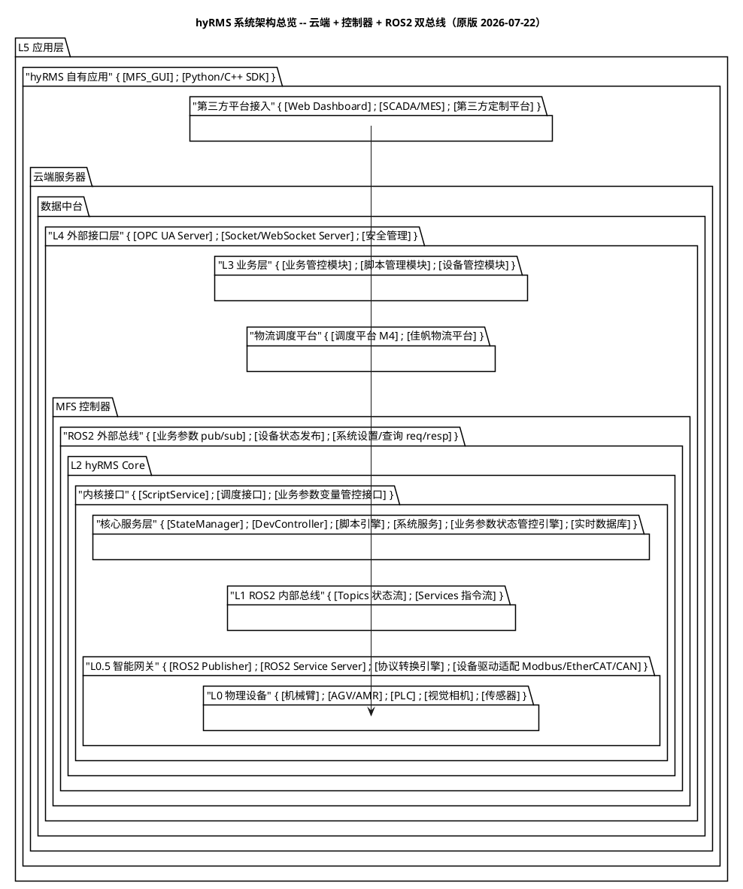
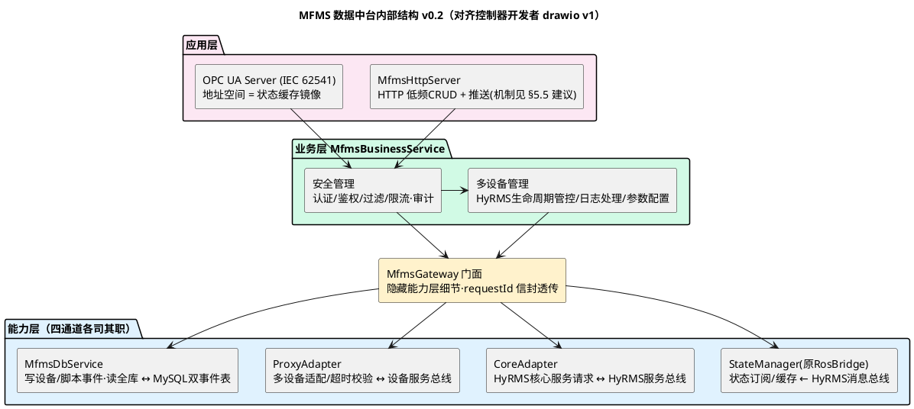

# MFMS 数据中台新版架构设计：分层、功能清单与拍板记录

> [!warning] 历史决策原文 · 不再作为当前入口
> 本文保留 2026-07 两轮拍板、红线与旧图解读，供追溯使用。2026-08-16 晚的新业务流已重新打开调度、共享存储、广播与适配器边界；当前请从 [[MFMS新中台-资料索引与权威源]]、[[MFMS新中台-架构构造思路]] 和 [[MFMS新中台-待确定问题清单]] 进入。不要在本页继续追加新结论。

> [!abstract] 本文定位
> **数据中台重设计——架构本体**（系统"长什么样"）。权威结构 = 控制器开发者 `mfms.drawio` v1（2026-07-22，解读见 §6；中台内部对齐版见 §2.2/§3；可编辑图源见 §7）。早期输入：`1_system_architecture.puml`、`REFACTOR_PROPOSAL_LightCore_v2.md`（契约设计吸收、重构执行冻结，处置见 [[MFMS敏捷开发工作流-trellis规划与需求流程#8. 与 LightCore v2.1 的关系|敏捷篇 §8]]）、[[MFMS数据中台技术文档-架构线程与代理层]]（旧架构现状）。
> **开发流程（.trellis 工作流、需求 intake、分期路线 P0-P6）拆至姊妹篇** [[MFMS敏捷开发工作流-trellis规划与需求流程]]；定稿后本文浓缩为 `.trellis/ARCHMAP.md` 与层卡片。

---

## 1. 边界变化：数据中台从"进程内中间层"变成"云端服务"

| 维度 | 旧（现行 MFMS） | 新（drawio v1 定稿方向） |
| --- | --- | --- |
| 数据中台位置 | qt_file 进程内 7 层（client_api→gateway→三服务→适配器） | 独立服务（局域网服务器）：应用层 + 业务层 + 门面 + 能力层 |
| 上位机 GUI | 与中台同进程，直接持有单例 | 纯 L5 应用，经 Http/推送服务面接入中台 |
| 与设备侧通信 | MySQL 触发器双事件表 + 直连 `/{id}_cmd`/`/{id}_state` | **双通道并存**：MySQL 双事件表（生命周期/脚本）+ Cpp-Proxy-SDK 上的四条 ROS2 总线（状态/实时指令/核心服务） |
| 设备接入 | hyrms_export 代理库 + 下位机 linker | HyRMS Core（DevController + Core Proxy）+ L1 设备网关（Gateway Linker）+ 虚拟设备/ros桥接包 |
| MySQL 角色 | 持久存储兼消息总线（触发器协议） | **保持**：持久存储 + 事件通道（协议不退役，与总线各司其职） |
| 多客户端 | 单 GUI | Qt GUI/Web/SCADA/MES/佳帆 经 Http·OPC UA 服务面并发接入；M4 设备化接入 |

**旧组件职责迁移表**（"去哪了"）：

| 旧组件 | 新去处（2026-07-22 按 drawio v1 修订） |
| --- | --- |
| CommunicationInterface/Impl/Worker | **删除**，职责由 MfmsHttpServer + MfmsBusinessService 承接；GUI 改为 Http/推送客户端 |
| gateway | **保留**：MfmsGateway 门面（隐藏能力层细节），但不再是逐信号转发链 |
| mfms_db（双事件表协议） | **保留**：MfmsDbService 轮询消费设备事件、脚本事件读取时置 status=read；状态机沿用现库 |
| ros_bridge | **保留改名**：StateManager(原RosBridge)，订阅源改为 HyRMS 消息总线上的汇总状态 topic |
| cmd_service + 两适配器 | ProxyAdapter **保留**（经 Cpp-Proxy-SDK 的 ROS2 Client 打设备服务总线）；新增 **CoreAdapter**（HyRMS 核心服务请求，走 HyRMS 服务总线）；设备级锁语义仍在控制器侧 |
| 告警 tail（文件） | 退役 → L2-2 日志下载/日志路径服务（经 CoreAdapter 请求） |
| qt_file GUI | 保留为 Qt 上位机，最后切换到 Http/推送接入 |

---

## 2. 对原版 puml 的修改建议（简化 5 条）【历史决策记录】

> [!note] 本节针对第一版 puml，已被控制器开发者 drawio v1 取代（解读见 §6）。其中条 3 的 StateCache/ControllerLink 思想由 StateManager(原RosBridge)/CoreAdapter/ProxyAdapter 落地；条 5 的调度平台结论修正为「佳帆从上方消费中台 API、M4 设备化接入」。现行权威结构以 §2.2（v0.2）、§3 与 §6 为准。

原版连线编号见 puml。以下修改全部以"简单、可维护"为准绳：

1. **删除线 11（设备管控 → L1 内部总线）**。云端中台若能直捅控制器内网总线，等于绕开控制器的状态归一与串行保证，回到旧架构"多入口打设备"的老路。中台一律只经外部总线。
2. **线 2（GUI/SDK → L1 直连）标注 debug-only**。保留调试后门，但必须挂显式开关（环境变量/编译开关），生产禁用。
3. **中台内部补两个组件：ControllerLink 与 StateCache**。原版 L3 三模块直连外部总线，意味着每个业务模块都要各自懂 ROS2（三份订阅/重连/超时逻辑）。集中到唯一的 ControllerLink（对应控制器侧的 DevController 镜像），业务模块只面对进程内接口。这是"统一脚本+分层锚点数据"同款思想：**协议逻辑一份，业务数据多份**。
4. **安全管理画为 L4 中间件而非并列组件**。认证/鉴权/限流是所有端点的前置切面，不是第四个端点。
5. **内核接口是唯一正门，且中台看不见调度平台（2026-07-22 二轮拍板）**。修正原版线 4/5 的方向与归属：物流调度平台（M4/佳帆）只与 L2 内核对话——由内核**调度接口负责集成调度平台**，再把任务/运单能力以 API 形式向上提供；数据中台与调度平台之间不存在任何直接连接。中台三模块的下行路径分工：**脚本管理、业务管控 → 内核接口 API**（ScriptService / BIZ_CTRL_IF / 调度查询）；**设备管控 → MFS 控制器 ROS 外部总线设备通道**（状态订阅 + 设备指令/系统设置查询）。任何上层组件（含中台、GUI 调试通道）禁止绕过内核接口直达核心服务层（StateManager/DevController/脚本引擎/RTDB）。P0 契约同时冻结内核接口 srv 集，控制器端对内核接口调用留审计。

### 2.1 原版总览（存档）

### 2.2 数据中台内部结构（drawio 对齐版 v0.2）

（StateManager/CoreAdapter/ProxyAdapter 全部架在 Cpp-Proxy-SDK 之上——中台不自写 rclcpp；MfmsDbService 直连 MySQL。）

> [!info] 可编辑 drawio 版
> 本图的 drawio 源文件已生成：仓库 `src/mfms_server/design/MFMS_DMP_内部结构_v0.2.drawio`（与控制器开发者的图同格式同配色，可直接在 draw.io 打开合并；含推送策略已拍板标注：P2 轮询 → P3 WebSocket）。图源清单见 §7。

---

## 3. 新版数据中台：层与功能清单（核心，v0.2 对齐 drawio v1）

四个部分：应用层 → 业务层 → MfmsGateway 门面 → 能力层。**调用规则：只准逐层向下；能力层四通道各司其职，禁止互替。**

### 3.1 应用层（协议端点）

| 组件 | 功能 | 备注 |
| --- | --- | --- |
| MfmsHttpServer | 低频请求-响应：登录、脚本库 CRUD、注册表、历史查询、日志下载跳转；**实时推送机制待拍板**（开发者当前计划 HTTP 轮询，建议见 §5.5） | Qt GUI 与 Web 共用同一服务面 |
| OPC UA Server | 地址空间映射状态缓存；写节点转命令 | 服务 SCADA/MES/佳帆；排期见 §5.3 |

明确不做：业务判断、设备寻址、状态缓存（只调业务层）。

### 3.2 业务层 MfmsBusinessService（两个模块）

- **安全管理**：认证、角色鉴权（viewer/operator/admin）、过滤、会话级限流；审计日志（谁、何时、对哪台设备、下了什么指令、结果如何）。
- **多设备管理**：HyRMS 生命周期管控（load/unload 编排，落 DB 事件表）；日志处理（经 CoreAdapter 调 L2-2 日志下载/路径服务）；参数配置（经 CoreAdapter 调 L2-2 配置服务）；设备注册表与白名单（数据驱动，取代 agvSm4 硬编码）；设备/脚本状态聚合查询（一律读 StateManager 缓存）。
- 业务请求统一封装 **requestId 信封** `{requestId, source会话, target, action, payload, deadline}` 后交 MfmsGateway，每个受理请求有且仅有一个同 ID 终态（吸收 LightCore 契约设计）。

明确不做：ROS2 细节、SQL 细节、设备级串行控制（控制器负责）。

### 3.3 MfmsGateway（门面）

对业务层暴露稳定接口、隐藏能力层四通道细节；**只做门面聚合，禁止逐信号转发链**（旧 gateway 的教训）；requestId 信封在此透传不改名。

### 3.4 能力层（四通道各司其职）

| 组件 | 通道 | 职责 |
| --- | --- | --- |
| StateManager(原RosBridge) | **HyRMS 消息总线**（订阅核内 StateManager 汇总状态 topic） | 设备/脚本/告警状态缓存，推送唯一来源；控制器断线 → 数据带"置疑"标记而非静默过期 |
| CoreAdapter | **HyRMS 服务总线**（ROS2 srv） | 核心服务请求：配置 / 生命周期管控 / 日志下载与路径 / 调度查询（L2-2 与核内服务） |
| ProxyAdapter | **设备服务总线**（`/{id}_cmd`，经 SDK ROS2 Client） | 实时设备指令：jog/到点/导航/IO/控制权；超时校验 |
| MfmsDbService | **MySQL 双事件表** | 设备事件轮询消费；脚本事件读取时置 status=read；写 device_state/lua_state 意图态；状态机沿用现库 |

StateManager/CoreAdapter/ProxyAdapter 全部架在 **Cpp-Proxy-SDK（L3-2，Core Proxy 导出物，今天 hyrms_export 的正统后继）**之上——中台不自写 rclcpp；MfmsDbService 直连 MySQL。配置沿用"单一配置文件 + `MFMS_*` 环境变量覆盖"模式（旧架构少数值得全盘继承的设计）。

### 3.5 触碰预算（反加码的硬指标）

新增一条业务命令 = 应用层 handler（1 文件）+ 业务模块方法（1 文件）+（若需新通道方法）能力层方法（1 文件）≤ **3 文件**。对比旧架构穿透 6 层。`.trellis` check 阶段核对该预算（工作流见 [[MFMS敏捷开发工作流-trellis规划与需求流程]]），超预算必须给出书面理由。

---

## 4. 红线草案（constraints.md v2）

1. **中台不自写 rclcpp**——ROS2 一律经 Cpp-Proxy-SDK；GUI/SDK 直连总线仅限 debug 开关下。
2. **三条下行通道各司其职，禁止互替**：设备生命周期（load/unload）与脚本控制走 MySQL 双事件表；实时设备指令（jog/导航/IO）走设备服务总线；核心服务请求（配置/生命周期管控/日志/调度查询）走 HyRMS 服务总线。事件表与总线独立并存，互不取代。
3. **物流调度平台不与中台直连**：佳帆从应用层服务面（Http/OPC UA）进，M4 设备化接入、由核内任务调度器驱动；中台对运单只有"经 CoreAdapter 查询"的视图。
4. 只准调相邻层；MfmsGateway 只做门面聚合，**禁止逐信号转发链**；新命令触碰 ≤3 文件。
5. requestId 由应用层生成，信封透传到底，每请求恰一终态；结果只加字段不改签名。
6. 状态查询一律走中台 StateManager 缓存；穿透到控制器的只有指令与设置。
7. 设备级串行/锁在控制器侧；中台不持设备锁。
8. MySQL 双事件表是**正式通道**（不是过渡）：消费语义 = 设备事件轮询、脚本事件读取置 read；状态机以现库为准，改动需上下位机双端同步评审。
9. 总线单位铁律：mm/deg（P0 契约冻结，以 `ros2 topic echo` 实测为准，不信头文件注释）。
10. 存续红线：`MFMS_BASE.sql` 禁止真机执行；下位机 `DbConfig.h` 改动勿回退；agvSm4 等非管辖设备零接触（注册表白名单机制落地前维持类型推断收窄）。

---

## 5. review 拍板记录（2026-07-22 两轮）

### 5.1 第一轮拍板

| # | 问题 | 结论 |
| --- | --- | --- |
| 1 | 技术栈 | **C++ 已定**（全栈 C++，选型建议见 §5.2） |
| 2 | 部署形态 | **局域网已定**：外部总线用原生 ROS2/DDS，无需 zenoh/gRPC |
| 3 | OPC UA 排期 | 默认 P5，**待最终确认**（判据见 §5.3：有没有外部 MES/SCADA 明确等着用） |
| 4 | 代码位置 | 待定，先定架构再议 |
| 5 | LightCore 处置 | **已同意**：冻结执行、吸收设计（详见 [[MFMS敏捷开发工作流-trellis规划与需求流程#8. 与 LightCore v2.1 的关系|敏捷篇 §8]]） |
| 6 | 控制器入口 | **已拍板（二轮修正）**：中台不可见调度平台，调度集成收在内核调度接口并向上提供 API；脚本/业务管控走内核接口 API，设备管控走外部总线设备通道；禁止绕过内核接口直达核心服务层（§2 条 5、§4 红线 2） |

### 5.2 C++ 技术选型建议（待确认）

- 通信/并发骨架：rclcpp（外部总线客户端）+ Qt6 Core 事件循环（团队现有能力，信号槽做模块间解耦）
- WebSocket：Qt WebSockets（与现有 Qt 栈一致，不引入 Boost.Beast 第二套异步模型）
- JSON：nlohmann/json（vendor 里已有同款 `json.hpp`）
- DB：Qt SQL / QMYSQL（沿用现有经验，含 JSON 列 CAST 教训）
- OPC UA（P5）：open62541（C 库，开源事实标准；C++ 侧工作量主要在地址空间建模与证书配置）
- 测试：colcon test + GoogleTest（P0 起为契约与并发行为写测试，吸收 LightCore 思想）

原则：**不引入第三套异步模型**——Qt 事件循环 + rclcpp executor 两套并存已是复杂度下限（旧架构已证明两套 spin 可控），任何新库不得再带自己的事件循环。

### 5.3 OPC UA 是什么、"放 P5"是什么意思

OPC UA（IEC 62541）是工业自动化领域的标准互联协议——SCADA、MES 等工厂信息系统之间交换数据的"普通话"。它不是一个简单的 socket 服务：一个合规的 OPC UA Server 要实现**地址空间**（把设备状态建模成标准节点树）、**订阅推送**、**会话管理**和**证书加密安全策略**，实现成本显著高于 WebSocket。

在本架构里它只服务一个场景：外部工厂信息系统（SCADA/MES）读设备状态、写业务参数。自家的 GUI/SDK/Web 全部走 WebSocket，不依赖它。

"放 P5"= 在分期路线（[[MFMS敏捷开发工作流-trellis规划与需求流程#7. 分期建设路线（P0-P6）|敏捷篇 §7]]）中排在第 5 期才实现：前四期用 WebSocket 已能喂饱自有应用，OPC UA 只是 StateCache 的"另一个翻译器"（地址空间映射 StateCache、写节点转命令），后加不动内核、不改架构。**唯一需要提前的理由**：近期有明确的 MES/SCADA 对接需求（对方点名要 OPC UA）。有，就提到 P2/P3；没有，P5 是最省力的位置。

### 5.4 第二轮拍板（基于 drawio v1 与开发者答复）

| # | 问题 | 结论 |
| --- | --- | --- |
| 1 | 能力层复用 | MfmsDbService 语义沿用（设备事件轮询消费、脚本事件读取置 status=read，状态机以现库为准）；RosBridge 改名 StateManager 保留；**中台不自写 rclcpp，一律经 Cpp-Proxy-SDK** |
| 2 | 四总线分工 | **确认**：HyRMS 服务/消息总线 = 系统级，设备服务/消息总线 = 每设备 cmd/state；StateManager 订 HyRMS 消息总线、CoreAdapter 走 HyRMS 服务总线、ProxyAdapter 走设备服务总线 |
| 3 | 双通道关系 | **确认**：DB 事件表与总线独立并存，互不取代 |
| 4 | 推送机制 | 开发者当前计划 HTTP 轮询，并主动询问合理性 → **建议见 §5.5（待拍板）** |

### 5.5 推送机制建议（待拍板）

针对开发者"HTTP 轮询是否合理"的提问。**结论：作为 P2 脚手架合理，作为终态不合理；解法不是加协议加进程，而是"一种实时协议 + 分级推送 + 单进程多线程"。**

1. 纯轮询的真实代价不是带宽，是**请求放大**（N 客户端 × 轮询频率，全部打到中台）与 **jog 结果延迟一个轮询周期**（requestId 精确配对的价值被浪费，操作手感差）。
2. **协议矩阵收敛为三面各一种**：实时面 WebSocket（浏览器原生、Qt 有 QWebSocket——一种协议同时服务 Web 与 Qt，不存在"多协议爆炸"）；CRUD 面 HTTP；MES 面 OPC UA。SSE 单向且 Qt 支持差，不选。
3. **推送分级**：10~100Hz 是总线原始频率，UI 不消费——中台 StateManager 缓存后**变化才推 + 100~200ms 节流**；量级估算 20 设备 × 10Hz × 1KB × 10 客户端 ≈ 2MB/s，单进程 IO 无压力；高频原始数据的调试场景走 SDK 直连。
4. **并发模型：单进程多线程，不上多进程**——接入 IO 线程（HTTP/WS 同端口同会话）+ 业务线程 + SDK executor 线程 + DB 线程；多进程带来的 IPC/状态共享正是要避免的"层层加码"。未来规模化 = 按控制器分片多实例水平扩，而非进程内拆分。
5. **渐进路径**：P2 先 HTTP 轮询打通（1s 级，与今天 Control 页一致），但 API schema 按订阅制设计（推送消息与轮询响应同构），P3 换 WS 零重构。

---

## 6. 控制器开发者版架构图（drawio）解读与差异点（2026-07-22）

> 来源：MFS 控制器开发者的 `mfms____.drawio`（112 节点/72 边，已程序化解析）。这版图与 §2 的 puml 总览有实质差异，以下解读已经用户确认（拍板见 §5.4），本文 §1/§3 与分期路线已按此修订。

### 6.1 图的分层（自上而下）

- **L5 业务应用**：Web Dashboard、Qt GUI（上位机）、SCADA/MES；**L6 物流调度平台**（佳帆、其他平台）与 L5 同带，从上方接入。
- **两条横贯服务条**：`OPC UA 服务` 与 `Http 服务`——L5/L6 全部经这两条服务面进中台。
- **L4 MFMS 数据中台**（内部三层）：应用层 = MfmsHttpServer + OPC UA Server；业务层 = MfmsBusinessService（内含 2 个安全管理：认证/鉴权/过滤/限流）；能力层 = **MfmsGateway（门面）+ RosBridge（多设备状态订阅/缓存）+ ProxyAdapter（多设备适配/超时校验）+ MfmsDbService（写设备/脚本事件、读全库）**——即现有 MFMS 组件直接延续，但 client_api/CommunicationWorker 消失。
- **数据库设备事件 / 数据库脚本事件**（两个数据体）：画在中台与 HyRMS Core 之间——**MySQL 事件表协议保留**，仍是中台→下位机的通道之一。
- **L2-1 HyRMS Core**：LuaExecutor（Lua 解释器 + 扩展服务[延时/tcp/错误连接释放]）→ **任务调度器/工艺流程定制模块（在核内！）**；StateManager（报警/状态缓存）；DevController（掌管 Core Proxy 与 Linker 生命周期）；Core Proxy [1..N]。
- **L2-2 HyRMS 辅助服务**（标签在文件里粘贴损坏）：配置服务、生命周期管理服务、日志下载服务、日志路径服务(URL)。
- **四条 ROS2 总线**（横贯全图）：HyRMS 服务总线、HyRMS 消息总线、设备服务总线、设备消息总线。
- **L3-1/L3-2 Proxy SDK**：Python(.pyc) / Cpp(.h/.so)，Cpp 版由 Core Proxy「导出」生成（= 今天 hyrms_export 的正统后继）；**中台能力层就架在 Cpp-Proxy-SDK 上**（RosBridge←SDK Subscription，ProxyAdapter↔SDK Client）。
- **L1 Gateway 设备网关**：Gateway Linker[1..N]（网关设备包：设备服务类 + 设备驱动/SDK）；另有两类 Core ROS2 Linker（虚拟设备包=虚拟设备模拟服务、ros 桥接包=算法支持/设备服务）挂在 Core 侧。
- **L0 物理设备**：机械臂、PLC、AGV、深度相机、ROS2 设备、网络设备(socket/modbusTCP/http)、**M4 平台（被当作网络设备接入！）**。

### 6.2 与本文前述设计的差异（确认后已修订的假设）

| # | 本文原假设 | drawio 实际 |
| --- | --- | --- |
| 1 | MySQL 触发器/事件表协议退役 | **保留**：设备/脚本事件仍是中台→HyRMS 通道 |
| 2 | gateway 纯转发层消失 | **MfmsGateway 门面保留**（但巨型 Worker 消失） |
| 3 | 单一外部总线三通道 | **四条总线**：HyRMS 服务/消息 + 设备服务/消息 |
| 4 | 自造 ControllerLink 组件 | 链路层 = **Cpp-Proxy-SDK + RosBridge/ProxyAdapter**（现有形态延续） |
| 5 | WebSocket 接入 | 图上是 **MfmsHttpServer**（推送机制待问） |
| 6 | 调度平台对中台完全不可见 | **分野**：佳帆/其他平台=L6 从上面消费中台 API；**M4=设备化**，经网关设备包从 L0 接入，由核内任务调度器驱动 |
| 7 | 告警走文件 tail | L2-2 提供日志下载/日志路径服务（**服务化取代 tail**） |

### 6.3 问题与答复（2026-07-22 开发者已回，详见 §5.4）

1. ~~能力层平移 vs 重写~~ → **语义沿用**：MfmsDbService 轮询设备事件、脚本事件读取置 read；RosBridge 改名 StateManager；中台不自写 rclcpp，经 Cpp-Proxy-SDK。
2. ~~推送机制~~ → 开发者计划 HTTP 轮询并主动问合理性 → 建议见 §5.5（待拍板）。
3. ~~四总线分工~~ → **确认**；drawio v1 进一步明确三个总线客户端组件的归属（§6.4）。
4. ~~双通道分工~~ → **确认**：独立并存、互不取代。
5. 遗留：L2-2 容器标签损坏未答（推测="HyRMS 辅助服务"，功能=配置/生命周期/日志，与中台"多设备管理"模块对偶）；任务调度器在核内由 drawio 确认不变。

### 6.4 drawio v1（第二版）相对第一版的变化

- RosBridge → **StateManager(原RosBridge)(状态订阅/缓存)**；
- 新增 **CoreAdapter (HyRMS 核心服务请求)**——第四个能力组件，走 HyRMS 服务总线；
- 业务层新增 **多设备管理**（HyRMS 生命周期管控/日志处理/参数配置），安全管理由 2 合 1；
- L4 容器拓宽；连线确认：HttpServer/OPCUA → 业务层 → MfmsGateway → 四能力组件（StateManager←HyRMS 消息总线，CoreAdapter↔HyRMS 服务总线，ProxyAdapter↔SDK ROS2 Client，MfmsDbService→双事件表圆柱）。

---

## 7. 架构图源文件（drawio）

仓库 `src/mfms_server/design/` 下两份可编辑图源，与控制器开发者的图同格式同配色，可在 draw.io 直接打开合并：

| 文件 | 页名 | 内容 |
| --- | --- | --- |
| `MFMS_系统架构_统一_v1.0.drawio` | MFMS系统架构v1.0 | 全系统统一视图（105 节点）：L0–L6 + HTTP/OPC UA 双服务面 + 中台内部（应用/业务/门面/能力四通道）+ 四条 ROS2 总线 + Gateway Linker / HyRMS Core / Proxy-SDK；已标注推送建议（P2 轮询 → P3 WebSocket、单进程多线程，对应 §5.5，待拍板） |
| `MFMS_DMP_内部结构_v0.2.drawio` | 数据中台v0.2 | 中台内部结构放大图（52 节点），§2.2 plantuml 的可编辑版 |

开发者原图 `mfms____.drawio`（v1，112 节点/72 边）的解读与差异见 §6。定稿后按 vault SVG 规范出正式图（当前用 drawio 迭代，避免返工）。

---

## 8. 关联

- [[MFMS敏捷开发工作流-trellis规划与需求流程]] —— **姊妹篇（怎么建）**：.trellis 组装方案、需求 intake、分期路线 P0-P6、LightCore 处置、下一步
- [[MFMS数据中台技术文档-架构线程与代理层]] —— 旧架构现状（legacy 卡片的事实来源）
- `src/mfms_server/design/REFACTOR_PROPOSAL_LightCore_v2.md` —— 契约设计的输入材料
- `1_system_architecture.puml` —— 第一版系统总览（本文 §2.1 存档）
