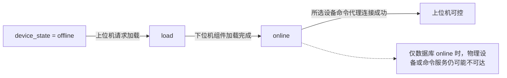

# MFMS 现场 Bug 修复日志：数据库、弹窗、双窗口与组连接

> [!abstract] 本轮范围
> 本文记录 2026-07-24 至 2026-07-28 的现场问题，代码范围为 `7b86522` 至 `60ce490`。上一阶段的断库崩溃、AGV 控制权、全局锁和请求关联问题不在这里重复，见 [[MFMS上位机阶段Bug修复总览]] 与 [[MFMS上位机Bug修复汇总-锁竞态与控制权]]。

本轮现场链路是：

1. 工控机改用本地 MySQL 后，数据库连接稳定；
2. 旧数据库缺少 `device.topic_prefix`，设备列表查询失败；
3. 下位机未启动或代理未连接时，上位机每秒弹出模态窗口；
4. 自动登录会创建两个主窗口；
5. 数据库里残留 `robFro0001`，但现场只有 `robAub0001`，旧组连接仍把 FR 拉起，FR 重连阻塞后面的 AUBO；
6. `Ctrl+C` 退出时仍可能触发 ROS 上下文失效异常，此项尚未闭环。

---

## 修复总表

| # | 现象 | 根因 | 处理 | 状态 |
| --- | --- | --- | --- | --- |
| 1 | 换网络后数据库地址要重新修改 | 数据库默认地址写成现场网卡 IP | 默认主机改为 `127.0.0.1`，保留环境变量覆盖 | 已合入 `7b86522` |
| 2 | `Unknown column 'd.topic_prefix'` | 代码与现场数据库 schema 版本不一致 | 给旧库补列，或把新库内容导入 `MFMS_BASE` | 现场数据迁移项 |
| 3 | 连接失败后反复弹窗 | 连接结果直接使用模态 `QMessageBox` | 改为页面状态标签和日志 | 已合入 `922691c` |
| 4 | 每秒弹出 `3004 AGV 代理未连接` | 后台导航轮询与用户指令共用弹窗通道 | 停止离线轮询；后台失败只记日志 | 已合入 `4e1594a` |
| 5 | 自动登录后出现两个主窗口 | 构造函数内嵌套事件循环导致登录流程重入 | 改用单次定时器，并增加登录状态闸门 | 已合入 `eea26cc` |
| 6 | 删除机械臂位姿时弹窗闪烁 | 模态窗口与 RViz 原生渲染窗口争抢层级 | 弹窗期间暂停 RViz 渲染，结果回调防重入 | 已合入 `34ebee9` |
| 7 | FR 不存在时仍被拉起，AUBO 随后无法连接 | UI 白名单只过滤显示，后端仍连接整个 `group_id` | 白名单下沉到连接层；连接成功只看所选主设备 | 已合入 `60ce490` |
| 8 | `Ctrl+C` 后抛出 `rclcpp::exceptions::RCLError` | ROS 全局上下文先失效，Qt 事件和 ROS 对象仍在收尾 | 需要调整 SIGINT 与 Qt 退出顺序 | 未闭环 |

---

## 1. 数据库地址固定为本机回环地址

### 现场现象

数据库运行在工控机本机，但旧配置使用 `192.168.83.74` 等网卡地址。工控机切换路由器、Wi-Fi 或有线网段后，网卡地址会变化，上位机又要改一次数据库配置。

### 根因

进程和 MySQL 在同一台工控机上时，连接不应该经过现场局域网地址。网卡地址属于外部网络配置，数据库本机连接应使用回环接口。

### 修复

提交 `7b86522` 把以下默认值统一改为 `127.0.0.1`：

- `mfms_common::DbConfig::host`
- `AppConfig` 内置默认值
- 安装到 `qt_file` 目录的 `AppSettings.json`

数据库配置优先级为：

1. 代码默认值 `127.0.0.1`
2. `AppSettings.json` 的 `database`
3. `MFMS_DB_*` 环境变量，优先级最高

因此桌面运行使用 `127.0.0.1`，Docker Compose 仍可用 `MFMS_DB_HOST=db` 连接容器内的 MySQL 服务。

> [!warning] 外部配置会覆盖仓库默认值
> 如果设置了 `MFMS_APP_SETTINGS_JSON`，程序会读取该文件，而不是安装目录里的 `AppSettings.json`。现场仍连旧 IP 时，先检查 `echo "$MFMS_APP_SETTINGS_JSON"` 和该文件中的 `database.host`。

---

## 2. `topic_prefix` 字段缺失

### 现场日志

```text
[MfmsRosBridge] 设备列表轮询查询失败:
"Unknown column 'd.topic_prefix' in 'field list' QMYSQL: Unable to execute query"
```

这条错误发生后，数据库本身已经连接成功，但设备列表 SQL 无法执行，因此首页不会加载设备。

### 字段何时加入

`topic_prefix` 在提交 `16b1c33`（2026-06-07）加入 `device` 表。最初它同时参与状态话题和命令服务命名。提交 `a10cccc`（2026-06-10）重新定稿：

- 状态话题使用完整设备 ID，例如 `/robAub0001_state`
- `topic_prefix` 保留给命令端点元数据和设备商分组

现场的旧 `MFMS_BASE` 和收到的 `MFMS_BASE_2607231027(2).sql` 都早于这次 schema 变化，所以代码查询 `d.topic_prefix` 时直接失败。

### 处理边界

`topic_prefix` 的值允许为 `NULL`，代码可以从设备 ID 前 6 位回退计算；但列本身必须存在。旧库只缺列时，先备份，再执行下面的迁移：

```sql
ALTER TABLE device
    ADD COLUMN topic_prefix VARCHAR(10) DEFAULT NULL
    COMMENT '端点前缀(type_3+module_3)';

UPDATE device
SET topic_prefix = LEFT(id, 6)
WHERE topic_prefix IS NULL OR topic_prefix = '';
```

这里第二条语句只补已有设备的数据。它不会改变设备 ID、`group_id` 或 `device_state`。

> [!warning] SQL 文件名不等于数据库名
> 文件名叫 `MFMS_BASE_2607231027(2).sql`，不代表导入后一定生成 `MFMS_BASE_2607231027`。应检查 SQL 内部的 `CREATE DATABASE` 和 `USE`。为了让上位机继续使用原配置，现场最终应把新数据恢复到数据库名 `MFMS_BASE`。

---

## 3. 连接失败与 AGV 3004 重复弹窗

这一症状有两个独立来源，所以第一次只改连接弹窗后，`3004 AGV 代理未连接` 仍会继续出现。

### 3.1 主连接失败弹窗

旧版 `onConnectResult(false, ...)` 每收到一次失败结果就调用模态 `QMessageBox::warning`。下位机持续重试时，用户关闭窗口后马上又收到下一次失败，界面无法操作。

提交 `922691c` 改为：

- 页面显示红色“连接失败”状态；
- Tooltip 保存失败设备 ID；
- 详细内容写日志；
- 不再用模态窗口阻塞用户。

### 3.2 后台导航轮询弹窗

控制页每秒查询一次 AGV 导航状态。AGV 代理不存在时，每次查询都返回错误码 `3004`。这个后台结果进入 `Myviz::onAgvControlResult` 后，被当成用户指令失败并弹窗。

提交 `4e1594a` 做了两层隔离：

1. `Control` 收到 3004 后停止导航状态定时器，把页面状态改为“AGV 代理未连接”；
2. `Myviz` 检查 `requestId` 和待处理 UI 命令。`requestId=0` 且没有用户命令时，只写日志，不弹窗。

用户主动点击导航、保存路径或执行站点产生的失败仍会提示。被压制的只是后台轮询错误。

> [!tip] 定位经验
> “弹窗文字相同”不代表只有一个调用点。应沿错误码和信号链查所有消费者，区分用户操作、后台轮询和状态订阅三个来源。

---

## 4. 自动登录创建两个主窗口

### 现象

执行 `ros2 run qt_file qt_file` 后出现两个 MFMS 主窗口。关闭一个窗口后，另一个仍在运行。

### 根因

登录窗口构造函数为了延迟自动登录，启动了一个嵌套 `QEventLoop`。自动登录在构造函数返回前就创建并显示主窗口；随后 `main()` 又执行 `loginUi->show()`。登录失败弹窗也可能让定时器重入，第二次创建主窗口。

### 修复

提交 `eea26cc`：

- 用 `QTimer::singleShot` 安排自动登录，不再开启嵌套事件循环；
- 增加 `auto_login_cancelled_`、`login_in_progress_`、`login_accepted_` 三个状态；
- 手动登录开始后取消待执行的自动登录；
- `acceptLogin()` 只允许成功一次。

这一问题与 ROS 节点数量无关，根因是 Qt 登录流程重入。

---

## 5. RViz 页面上的位姿删除弹窗闪烁

### 现象

控制页显示 RViz 时，点击删除机械臂位姿，确认框和结果框闪烁、层级跳动，连续点击还可能产生重复请求。

### 根因

RViz 的 `RenderPanel` 使用原生渲染窗口。同步模态 `QMessageBox` 出现时，两个原生窗口同时重排层级。删除请求又缺少进行中状态，旧的位姿列表响应可能覆盖新状态。

### 修复

提交 `34ebee9`：

- 弹窗打开前暂停 RViz 渲染，窗口销毁后的下一个事件循环再恢复；
- 同步 `QMessageBox::question` 改为异步 `open()`；
- 增加 `armWaypointDeleteInProgress_`，删除期间禁用相关按钮；
- 只消费与当前删除请求匹配的结果，忽略过期列表响应。

---

## 6. `robFro0001` 阻塞 `robAub0001` 的组连接

这是本轮现场问题的主因。

### 现场条件

- 数据库 `group_id=1` 同时存在 `robFro0001`、`robAub0001`、`agvSrc0001` 等设备；
- 现场没有法奥机械臂，只有奥博机械臂；
- `robFro0001` 地址仍保留在数据库；
- 设备启动前的 `device_state` 全部显示 `offline`。

`offline` 本身不是异常。它只表示设备已登记，但下位机组件尚未加载。



### 旧链路为什么会卡住

提交 `02dd5f1` 引入了按 `group_id` 的复合机器人连接。点击“机器人 1”后，`CommunicationWorker::devicesForConnectionTarget()` 会返回组内所有设备。

后续提交 `0981c65` 增加了首页白名单，但它只过滤 UI 显示，不影响后端组连接。因此即使用户想连接 AUBO，后端仍会：

1. 给组内所有 `offline` 设备写入加载请求；
2. 下位机先加载 `robFro0001` 的 linker 和 proxy；
3. 法奥机械臂不存在，linker 进入连接失败和重试；
4. AUBO 的加载或服务连接被前面的 FR 流程拖延；
5. 旧上位机只要看到组内任意设备数据库状态为 `online`，就可能提前报告整组连接成功。

这里混淆了两种状态：

- 数据库 `online`：下位机组件已经加载；
- 命令代理连接成功：上位机能够通过目标设备的服务执行命令。

前者不能代替后者。

### 修复内容

提交 `60ce490` 修改了连接边界：

1. 现场默认白名单移除 `robFro`，保留 `robAub` 和 `agvSrc`；
2. UI 白名单通过 `setConnectionDeviceFilter()` 下沉到 `CommunicationWorker`；
3. 过滤只针对机械臂和 AGV 命令设备，PLC、视觉等同组配套组件保持原加载逻辑；
4. 右侧设备下拉框不再选择后立即复位，可以明确选择 AUBO 或 AGV 作为主设备；
5. 主设备排在组连接队列第一位；
6. 只有所选主设备的命令代理成功，才发送 `connectionResult(true, ...)`；
7. AGV 等可选设备先成功时，不再冒充主设备成功；
8. 主设备失败后，忽略仍在返回途中的可选设备旧回调。

> [!warning] 旧运行时配置仍可能把 FR 加回来
> 如果 `MFMS_APP_SETTINGS_JSON` 指向的外部配置仍包含 `"robFro"`，后端过滤器会继续允许 FR。现场更新后应检查实际生效的配置文件，而不只检查仓库源码。

`[[MFMS数据中台技术文档-架构线程与代理层]]` 中“白名单仅影响显示”和“任一设备在线即可收尾”的描述对应 `60ce490` 之前的实现。本节记录的是当前 `main` 行为。

### 回归测试

新增连接隔离用例验证了四件事：

- 选择 `robAub0001` 时加载 AUBO、允许的 AGV 和非命令配套设备；
- 不加载未启用的 `robFro0001`；
- AGV 先成功不会提前发送整组成功；
- AUBO 失败后，迟到的 AGV 成功回调不会覆盖失败结果。

Docker 中完成了 `colcon build --packages-up-to qt_file`，三个包均构建成功；独立连接隔离测试通过。

---

## 7. `Ctrl+C` 退出时 ROS 上下文失效

### 日志

```text
terminate called after throwing an instance of 'rclcpp::exceptions::RCLError'
what(): failed to create guard condition: the given context is not valid
```

### 当前判断

ROS 2 的 SIGINT 处理先让全局 context 进入 shutdown；Qt 事件循环、定时器或工作线程随后还在创建 guard condition 或处理 ROS 对象，于是异常从 Qt 事件处理器向外传播。

提交 `3fd6089` 已修过一次通信线程退出竞态，包括阻塞等待 worker 收尾和先停止 `MfmsRosBridge` 定时器。但现场日志说明 `Ctrl+C` 路径仍有窗口，不能标记为已闭环。

> [!todo] 后续修复方向
> 让 SIGINT 只请求 `QApplication::quit()`；退出 Qt 事件循环后，按“停止定时器与 ROS executor → 销毁 worker/node → 最后 `rclcpp::shutdown()`”的顺序收尾。需要补连续启动退出和连接中退出测试。

在修复前，现场优先使用窗口关闭或桌面启动脚本正常退出，避免在设备连接回调执行期间连续按 `Ctrl+C`。

---

## 8. 已排除的非上位机代码问题

| 日志或现象 | 判断 |
| --- | --- |
| `Identity file ~/.ssh/mfms_deploy_key not accessible` | 工控机没有对应 GitHub deploy key，不是仓库代码错误 |
| `Host key verification failed` | 首次连接 GitHub 时拒绝了主机指纹，应先核对指纹再接受 |
| `网络中已存在相同 ID(1)` | DDS 网络中已有相同 HyRMS 节点 ID，下位机安全检查主动退出 |
| `Connect to 192.168.192.2:30004 FAILED: Connection refused` | 工控机已能到达目标 IP，但机械臂端口 30004 没有监听或服务拒绝连接 |
| 工控机 `192.168.100.101`，机械臂 `192.168.192.2` | 两者不在同一 `/24` 网段；可给工控机有线口增加 `192.168.192.102/24`，不必删除原管理地址 |
| SQL 文件存在，但 `SHOW DATABASES LIKE 'MFMS_BASE_2607231027'` 为空 | 文件名不是 schema 名，需检查 SQL 内的 `CREATE DATABASE` 和 `USE` |

`Connection refused` 与 `No route to host` 含义不同。前者说明 IP 路由已经通，下一步应检查机械臂服务进程和端口；后者才继续查网卡、掩码、交换机和路由。

---

## 9. 工控机更新与验收

下面的命令把工控机更新到 `main`，重新安装 `AppSettings.json`，再启动上位机：

```bash
cd ~/Desktop/code/Reconstructed-MFMS
git switch main
git pull origin main
colcon build --packages-up-to qt_file
source install/setup.bash
ros2 run qt_file qt_file
```

也可以在完成构建后使用仓库入口脚本，它会检查 ROS 2 和工作区环境：

```bash
cd ~/Desktop/code/Reconstructed-MFMS
./mfms-qt-file
```

现场验收按以下顺序进行：

- [ ] `git merge-base --is-ancestor 60ce490 HEAD` 返回成功；
- [ ] 实际生效的 `AppSettings.json` 只包含 `robAub`、`agvSrc`，不包含 `robFro`；
- [ ] 点击“机器人 1”后，右侧设备下拉框默认选中 `robAub0001`；
- [ ] 下位机日志不再出现由上位机触发的 `robFro0001` 加载和重连；
- [ ] `robAub0001` 代理成功后，上位机才显示连接成功；
- [ ] AGV 未运行时只显示一次页面状态，不再每秒弹出 3004；
- [ ] 自动登录只创建一个主窗口；
- [ ] 正常关闭窗口时无 ROS context 异常；
- [ ] `Ctrl+C` 退出问题单独记录，未验证前不勾选闭环。

---

## 10. 本轮结论

1. `device_state=online` 只能证明下位机组件已加载，不能证明物理设备或命令代理可用；
2. UI 过滤和后端执行范围必须使用同一份配置，否则“看不见的设备”仍会被拉起；
3. 后台轮询错误不能进入用户指令的模态提示通道；
4. Qt 构造函数里不要开启嵌套事件循环，登录和弹窗都要防重入；
5. 代码升级必须带数据库 schema 检查，`NULL` 值可回退不等于缺列可兼容；
6. 网络错误、服务端口错误、DDS 节点冲突和上位机状态机错误要分层判断，不能都归为“连接不上”。
