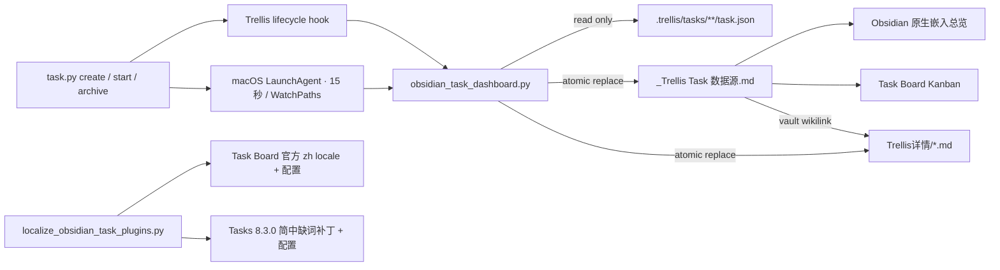

# Obsidian 插件汉化与 Trellis Task 可视化

> [!info] 自动生成 · 只读详情
> 此页是 Trellis 源文档在 Obsidian 库内的展示镜像，解决库外 `file://` 链接无法打开的问题。
> 请在 Trellis 项目中修改任务；下一次同步会用权威源重新生成此页。

- 状态：已完成
- 当前阶段：已完成
- 执行清单：53/53
- 优先级：P2
- 负责人：mfms-core
- 创建时间：2026-08-17
- 完成时间：2026-08-18
- Trellis Task：`/Users/melene/project/mfms_Framework/.trellis/tasks/archive/2026-08/08-17-obsidian-trellis-task-dashboard`

## PRD

来源：`/Users/melene/project/mfms_Framework/.trellis/tasks/archive/2026-08/08-17-obsidian-trellis-task-dashboard/prd.md`

# Obsidian 插件汉化与 Trellis Task 可视化

## Goal

让用户在 Obsidian 中使用中文界面的 Task Board 与 Tasks 管理普通任务，并在指定目录中只读查看当前 MFMS Framework 项目的 Trellis 任务状态，同时保持 Trellis 任务文件的结构与生命周期不被破坏。

## Background

- Trellis 项目根目录：`/Users/melene/project/mfms_Framework`
- Trellis 任务来源：项目内 `.trellis/tasks/`，当前可见任务包含已完成、规划中等状态。
- Obsidian vault：`/Users/melene/Documents/C++/obsidian_notes-main`
- 目标目录：`14.复合mfms/14.1 Task/`，检查时为空。
- 已安装插件：
  - `task-board` v1.10.11
  - `obsidian-tasks-plugin`（Tasks）v8.3.0
- 两个插件均以已构建的 `main.js` 形式安装在 vault 的 `.obsidian/plugins/` 下。

## Confirmed Facts

- Obsidian 主界面语言为简体中文。
- Task Board 具备官方外置 locale 机制；简中 `zh` 已存在但属于机器生成、未人工校对。当前插件语言仍为 `en`，且本地尚无 `locales/zh.json`。
- Tasks 8.3.0 已内置简中资源，现有设置大部分已汉化；新 `Searches` 设置区、部分按钮与持久化状态名仍显示英文。
- Tasks 支持按标签、状态、优先级、创建日期、路径进行过滤、分组和排序；但当前大型 vault 启动时全库索引会延迟查询渲染，因此主总览采用原生嵌入，Tasks 保留为兼容消费者。
- Task Board 1.x 能扫描同一份 Markdown 任务并通过路径/标签收窄为 Kanban，但没有成熟的单文件静态看板模式，适合作为次级视图。
- 官方资料与本机证据记录在 `research/` 下两份研究文档中。

## Requirements

1. 将 Task Board 与 Tasks 插件中用户可见的主要界面文本汉化为简体中文，至少覆盖命令、设置项、按钮、对话框、状态与默认看板列名；Task Board 以官方 locale 为基线，Tasks 以官方内置简中为基线并补齐核心缺词。
2. 在 `14.复合mfms/14.1 Task/` 下创建 Trellis Task 可视化入口，能按任务状态区分并展示任务标题、当前 Trellis Phase、Workflow 步骤、执行/验收清单进度、下一步、优先级、负责人、创建时间及任务文档入口等已有信息。
3. Trellis 的 `.trellis/tasks/**/task.json` 与规划文档保持项目侧权威来源，不因展示层处理而改变格式。
4. 方案需要说明插件升级对汉化的影响，并提供可重复执行或可恢复的维护方式。
5. 保留用户现有插件设置，不覆盖与本任务无关的配置。
6. 任务总览以 Obsidian 原生嵌入展示生成数据，以 Task Board Kanban 为附加展示；Tasks 仍识别同一份兼容 Markdown 数据，三者不维护独立状态副本。
7. Obsidian 展示层只读：不得从原生嵌入、Tasks 结果或 Task Board 操作反向改变 Trellis 状态；Trellis 始终是唯一权威来源。
8. 使用 Trellis 正常生命周期命令新建、开始、结束当前会话或归档任务后，Obsidian 数据源应自动刷新，使后续新增任务和稳定检查点的执行进度无需手工复制即可出现。
9. Workflow 展示必须保持只读：可将 PRD / Implement 中的复选框投影为 Task Board 父卡片内的子步骤，但不得把 Obsidian 中的勾选动作写回 Trellis。
10. 任务标题与文档入口必须通过 Obsidian vault 内部链接打开自动生成的只读详情页，不依赖指向 vault 外部项目目录的 `file://` 链接。
11. 在 Codex 工作区沙盒无法写入 vault 时，本机后台同步器仍需独立检测 Trellis Task 变化并更新看板；安装必须限定到当前项目、可检查、可卸载，且不得覆盖非本工具所有的系统配置。

## Acceptance Criteria

- [ ] Task Board 的核心操作流程不再依赖英文界面即可使用。
- [ ] Tasks 插件的核心操作与设置界面不再依赖英文界面即可使用。
- [ ] `14.复合mfms/14.1 Task/` 下存在可在 Obsidian 中直接打开的中文任务总览。
- [ ] 总览能正确反映 `.trellis/tasks/` 中至少 `planning`、`in_progress`、`completed` 状态，并对没有任务的状态显示空态或省略。
- [ ] 每个任务可通过 Obsidian 库内详情页定位到其完整 `prd.md`，存在 `design.md`、`implement.md` 时也可访问；标题和文档链接不使用 `file://`。
- [ ] 每张任务卡直接显示当前 Phase 与清单完成数；展开内容能看到 Workflow 阶段、执行/验收步骤及第一个未完成项。
- [ ] `implement.md` 存在时优先按其章节汇总执行清单；不存在时回退到 `prd.md` 复选框；已完成任务以 `task.json.status` 为准，不被陈旧文档复选框反向降级。
- [ ] 重新生成或刷新总览不会破坏用户手写笔记，也不会改写 Trellis 源任务。
- [ ] 在隔离的临时测试环境中通过 Trellis 生命周期命令创建、开始、结束会话和归档测试任务时，Obsidian 数据源自动新增并更新对应任务。
- [ ] Obsidian 主总览隐藏或禁用会修改生成任务的交互，并明确标识数据源为自动生成、只读。
- [ ] 汉化与任务总览经过文件级校验，并在 Obsidian 中完成一次渲染/交互检查。
- [ ] 安装后台同步器后，制造一次真实 Trellis 数据漂移，无需手动导出即可在 15 秒内恢复为最新看板；服务重装幂等且不会覆盖非本项目所有的 LaunchAgent。

## Out of Scope

- 修改或发布两个上游社区插件的官方仓库版本，或向上游提交 PR。
- 改变 Trellis 自身的任务生命周期、状态语义或 `task.py` 行为。
- 将其他项目的 Trellis 任务纳入本次 MFMS 看板。
- 依赖非官方 i18n 插件或维护完整的上游插件 fork。
- 从 Obsidian 拖卡、勾选或编辑任务来反向调用 Trellis 状态转换。

## 设计

来源：`/Users/melene/project/mfms_Framework/.trellis/tasks/archive/2026-08/08-17-obsidian-trellis-task-dashboard/design.md`

# Obsidian 插件汉化与 Trellis Task 可视化：技术设计

## 1. Architecture and Boundaries

本方案将 Trellis 视为唯一权威源，将 Obsidian 视为只读展示缓存。任何 Obsidian 交互都不得调用 `task.py`、修改 `task.json` 或改写 Trellis 规划文档。



边界约束：

- 导出器仅读取 `.trellis/tasks/`，不写该目录中的任何任务文件。
- 导出器只允许写入本机配置声明的 vault 内目标目录。
- 自动更新只覆盖带固定生成标记的 `_Trellis Task 数据源.md` 与 `Trellis详情/*.md`；普通笔记一律拒绝覆盖。
- `Trellis Task 总览.md` 是用户可扩展笔记，自动钩子不覆盖它。
- Task Board 和 Tasks 共享同一生成数据源，不建立第二套任务状态。

## 2. Local Configuration Contract

复用项目现有 `.trellis/hooks.local.json` 约定保存机器相关路径，并将该文件加入 `.trellis/.gitignore`。实际本机配置：

```json
{
  "obsidian": {
    "vault_path": "/Users/melene/Documents/C++/obsidian_notes-main",
    "task_dashboard_dir": "14.复合mfms/14.1 Task",
    "language": "zh"
  }
}
```

同时提供不含真实用户路径的 `.trellis/hooks.local.example.json`，便于迁移或恢复。

路径校验：

1. `vault_path` 必须存在且包含 `.obsidian/`。
2. `task_dashboard_dir` 必须是相对路径。
3. 解析后的输出路径必须仍位于 `vault_path` 内；出现 `..` 越界或符号链接逃逸时中止。
4. 本机配置缺失时，生命周期钩子打印警告但不得阻塞 Trellis 命令。

## 3. Dashboard Export Contract

### 3.1 Source discovery

扫描：

- `.trellis/tasks/*/task.json`
- `.trellis/tasks/archive/**/task.json`

忽略不能解析的 JSON 并给出具体路径警告；一个坏任务不得导致其他任务消失。按任务目录路径去重，输出顺序保持确定性。

### 3.2 Field mapping

| Trellis field | Obsidian representation |
| --- | --- |
| `title` / `name` | 任务标题 |
| `status` | 中文状态标签 + `#trellis/status/<status>` |
| `priority` | 文本标签 + Tasks priority emoji |
| `assignee` | `#trellis/assignee/<slug>` + 可见文本 |
| `createdAt` | Tasks created date `➕ YYYY-MM-DD` |
| `completedAt` | 完成日期文本；完成任务使用 `[x]` |
| `prd.md` | vault 内只读详情镜像的 `#PRD` wikilink |
| `design.md` / `implement.md` | 文件存在时输出到同一详情镜像的章节 wikilink |
| Trellis status + checklist | 当前 Phase、总进度与父卡片内的只读 Workflow 子步骤 |
| `implement.md` checkboxes | 优先按最近 Markdown 标题分组；小清单逐项展示，大清单按章节汇总 |
| `prd.md` checkboxes | `implement.md` 无清单时作为验收清单回退来源 |

优先级映射：`P0 → 🔺`、`P1 → ⏫`、`P2 → 🔼`、`P3 → 🔽`。未知优先级保留文本，不伪造 Tasks 优先级。

状态显示顺序：`in_progress`、`planning`、`blocked`、`completed`、其他。未知状态仍输出，并放入 `#trellis/status/unknown`，避免静默丢失。

### 3.3 Generated note safety

生成文件 frontmatter 必须包含：

```yaml
generated_by: trellis-obsidian-task-dashboard
readonly: true
project: mfms_Framework
```

写入规则：

- 文件不存在：创建。
- 文件存在且带正确 `generated_by`：原子替换。
- 文件存在但没有正确标记：失败并保留原文件。
- 内容相同：不重写，避免 Obsidian 无意义重索引。

导出器提供手动命令，作为钩子失败或插件升级后的恢复入口。

### 3.4 Workflow projection

- `planning` 显示 Phase 1 为当前阶段；`in_progress` 根据首个未完成的 Implement 章节区分 Phase 2 执行与 Phase 3 收尾；`completed` 三阶段均完成；未知或受阻状态不伪造阶段进度。
- Header 始终直接包含当前阶段；存在清单时同时包含 `已完成/总数`，保证 Task Board 即使折叠详情也能看见进度。
- Workflow 与清单详情使用父任务下的缩进 Markdown checkbox。缩进从 vault `.obsidian/app.json` 的 `useTab` / `tabSize` 推导，缺省与 Task Board 一致使用 Tab。Task Board 将其渲染为父卡片子步骤；它们不带 `#trellis` 标签，不成为独立顶层看板卡片。
- 清单总数不超过 8 时逐项展示；更大清单按 Markdown 章节汇总，只在当前未完成章节显示“下一步”。
- `task.json.status=completed` 是权威完成信号。已完成任务不重放可能陈旧的 PRD / Implement 勾选状态，避免把历史文档误报为未完成。

### 3.5 Vault-internal document mirrors

- `.trellis/tasks` 位于 Obsidian vault 外部，因此看板不得使用 `file://` 作为文档导航；这类链接在 Obsidian / Task Board 中不能保证可打开。
- 每个 Trellis Task 在 `<task_dashboard_dir>/Trellis详情/` 生成一个带 `generated_by: trellis-obsidian-task-detail` 的只读详情页，完整投影 PRD、设计、实施计划和 Task JSON。
- 数据源中的任务标题和文档入口使用 Obsidian wikilink，并按 `#PRD`、`#设计`、`#实施计划`、`#Task JSON` 定位到详情页章节。
- 导出前先检查数据源与所有详情页的所有权标记；任一目标与用户笔记冲突时整次同步停止，不先写入其他文件。内容相同的详情页不重写，`--check` 同时检查数据源与详情页漂移。
- 详情页只是可丢弃的展示缓存；Trellis 项目文件仍是唯一权威源，生命周期 hook 与手动同步会刷新镜像。

## 4. Automatic Refresh

在 `.trellis/config.yaml` 注册：

- `after_create`
- `after_start`
- `after_finish`
- `after_archive`

四个事件均调用同一幂等导出器。它们覆盖 Trellis 的 `planning`、`in_progress`、会话结束稳定检查点与 `completed` 状态变化。钩子失败只产生 Trellis 原生警告，不阻塞任务生命周期。

生命周期 hook 继承其调用环境的文件权限；在 Codex `workspace-write` 沙盒内，它可能能读取项目却不能写项目外的 Obsidian vault。因此本机同时安装一个项目专属 macOS LaunchAgent：监听 `.trellis/tasks`、配置文件变化，并以 15 秒间隔兜底调用同一幂等导出器。它不改变数据流向，只把执行位置移到用户会话中，使 vault 写入不依赖某次 Codex 命令的沙盒权限。

LaunchAgent 使用由仓库绝对路径派生的稳定 label，plist 带项目路径和固定所有权标记。安装器仅覆盖带相同标记且属于当前项目的 plist；更新使用原子替换，`bootstrap` 或 `kickstart` 失败时恢复旧配置和旧加载状态。提供 `install`、`status`、`uninstall` 三个动作，卸载只删除精确匹配的项目 plist。标准输出丢弃，错误写入 `.trellis/.runtime/`，避免污染仓库。

普通 PRD / Implement 文本编辑由后台同步器最多在 15 秒内刷新；生命周期 hooks 仍保留，用于没有沙盒限制的 Trellis 调用场景和即时更新。手动运行同一幂等同步命令仍作为诊断与恢复入口。

## 5. Obsidian Presentation

### 5.1 Main overview

`Trellis Task 总览.md` 使用 Obsidian 原生 wikilink 嵌入 `_Trellis Task 数据源.md`。这样总览随生成文件立即刷新，不需要等待 Tasks 对整个大型 vault 建立缓存；状态顺序和任务排序由导出器的确定性输出负责。

### 5.2 Read-only styling

新增 `trellis-task-dashboard.css`：

- 仅作用于 `cssclasses: trellis-task-dashboard`。
- 禁用原生嵌入及 Tasks 渲染结果中的复选框、编辑和延期按钮。
- 禁用只读详情镜像中源文档复选框的点击交互。
- 使用现有暖色主题变量，不硬编码与主题冲突的背景色。
- 为状态标题、元数据、空态和生成说明提供清晰层级。

Task Board 建立名为“MFMS · Trellis 任务”的独立板，并用 `#trellis` 与生成文件路径做过滤。该板是附加 Kanban 视图，不承担状态写回；相关卡片的编辑/完成交互通过专用 CSS 尽可能禁用，任何意外改动也会在下次同步时由 Trellis 权威数据覆盖。

Task Board 默认把子任务最小化；专用 CSS 只对带生成标记的卡片强制展开 Workflow 子步骤，同时继续禁用卡片、主/子复选框、拖拽、菜单和 footer 写操作。文档链接仍可点击。

## 6. Localization Design

### 6.1 Task Board 1.10.11

1. 使用插件官方 `Update language translations` 下载 `locales/zh.json`。
2. 保留官方文件为基线，合并本地核心词条修订；不改 `main.js`。
3. 将 `data.globalSettings.lang` 设为 `zh`。
4. 只翻译保存于配置中的默认板名、列名与状态显示名，不改变 tag、状态字符、类型枚举或其他语义字段。

### 6.2 Tasks 8.3.0

1. 使用官方内置简中为基线。
2. 对实际界面确认仍为英文的核心缺词做小范围、可重复补丁，主要覆盖 `Searches`、搜索结果布局、预设操作按钮及相关说明。
3. 补丁必须验证 `manifest.json` 版本及预期匹配次数；任一条件不满足则拒绝写入。
4. 首次写入前保存原始 `main.js` 版本备份，并提供恢复命令。
5. 将持久化状态显示名改为“待办 / 已完成 / 进行中 / 已取消”，不改变符号、next symbol 或类型。

Tasks 升级后 `main.js` 会被覆盖。补丁工具必须在版本不匹配时停止，待更新补丁规则后再应用，禁止盲目替换。

## 7. Compatibility and Rollback

- 当前目标版本固定为 Task Board 1.10.11 与 Tasks 8.3.0。
- Task Board 2.x 正在改变内部架构，本任务不提前适配其未稳定格式。
- Dashboard 主总览只依赖 Obsidian 原生 Markdown 嵌入；即使 Tasks 或 Task Board 暂时禁用，主总览仍可使用。
- 停止自动同步：删除或注释三个 hook 命令。
- 回滚汉化：使用本地化工具的 `--restore`，或恢复生成的版本备份。
- 回滚 Dashboard：禁用 CSS snippet，并移除明确标记的数据源、总览与 `Trellis详情/` 镜像；Trellis 源数据不受影响。

## 8. Validation Strategy

- 单元测试覆盖扫描 active/archive、字段映射、vault 内 wikilink、详情镜像漂移、路径越界拒绝、非生成文件拒绝覆盖与幂等写入。
- 使用临时目录做 hook 集成测试，不创建污染真实历史的测试 Trellis task。
- 同步前后对 `.trellis/tasks/**` 做内容哈希比较，证明只读。
- 本地化工具验证版本、备份、匹配次数、JSON 可解析性与幂等性。
- 在 Obsidian 中重载插件后检查 Tasks 设置、Task Board 设置、主总览和 Kanban；确认中文、分组、排序、文档链接与只读交互。

## 实施计划

来源：`/Users/melene/project/mfms_Framework/.trellis/tasks/archive/2026-08/08-17-obsidian-trellis-task-dashboard/implement.md`

# Obsidian 插件汉化与 Trellis Task 可视化：实施计划

## 1. Preparation and safeguards

- [x] 记录两个插件现有 manifest、data 与 main.js 哈希。
- [x] 确认 vault 目标目录仍为空或仅包含本任务明确创建的文件。
- [x] 将 `.trellis/hooks.local.json` 加入 `.trellis/.gitignore`，创建无隐私路径的示例配置。
- [x] 创建本机 `.trellis/hooks.local.json`，只写 vault 与 dashboard 路径。

Rollback point：本步骤不修改插件；删除本机配置即可撤销。

## 2. Implement the read-only exporter

- [x] 新增 `.trellis/scripts/hooks/obsidian_task_dashboard.py`。
- [x] 实现本机配置加载、vault containment 校验、active/archive 扫描、字段映射和确定性 Markdown 生成。
- [x] 实现生成标记校验、相同内容不写入、临时文件 + 原子替换。
- [x] 提供 `--check` / `--dry-run` 或等价诊断入口，便于升级后自检。
- [x] 新增标准库单元测试，覆盖设计文档列出的安全与映射场景。

Validation：

```bash
python3 -m unittest discover -s .trellis/scripts/tests -p 'test_obsidian_task_dashboard.py'
python3 -m py_compile .trellis/scripts/hooks/obsidian_task_dashboard.py
```

## 3. Wire lifecycle refresh

- [x] 在 `.trellis/config.yaml` 配置 `after_create`、`after_start`、`after_archive`。
- [x] 用临时 fixture 验证三个事件执行同一幂等导出器，失败不会中断 Trellis 生命周期。
- [x] 手动运行一次导出器，在目标目录创建 `_Trellis Task 数据源.md`。
- [x] 对比同步前后 `.trellis/tasks/**` 内容哈希，确认源任务未被修改。

Rollback point：注释三个 hook 命令；生成数据源仍可保留为静态快照。

## 4. Build the Obsidian overview

- [x] 创建 `Trellis Task 总览.md`，使用中文 frontmatter、说明 callout 与原生只读数据源嵌入，避免等待 Tasks 全库索引。
- [x] 创建 `.obsidian/snippets/trellis-task-dashboard.css`，限制作用域并禁用嵌入/查询结果写交互。
- [x] 启用该 CSS snippet，不改变其他现有 snippet。
- [x] 验证当前 completed / planning 任务均正确出现，空状态不报错。

## 5. Localize Task Board and Tasks

- [x] 新增可重复执行的本地化工具与版本/匹配保护。
- [x] 在修改前为 Task Board 配置、Tasks 配置和 Tasks 8.3.0 `main.js` 建立可恢复备份。
- [x] 通过 Task Board 官方入口下载 `zh.json`，合并核心中文修订并将插件语言切到 `zh`。
- [x] 翻译 Task Board 默认板、列和状态显示名，保留 ID、类型、tag 与状态字符。
- [x] 为 Tasks 8.3.0 应用核心缺词补丁，并翻译持久化状态显示名；保持 query preset 标识符及语法不变。
- [x] 再次运行本地化工具，确认幂等；运行恢复演练后重新应用。

Rollback point：运行本地化工具 `--restore` 并重载 Obsidian。

## 6. Configure the auxiliary Kanban

- [x] 在 Task Board 中建立“MFMS · Trellis 任务”板。
- [x] 用 `#trellis` 与生成数据源路径限制板内容。
- [x] 建立“规划中 / 进行中 / 受阻 / 已完成”列，并验证状态标签映射。
- [x] 应用只读 CSS；确认其他非 Trellis 看板不受影响。

## 7. Full validation

- [x] 运行 exporter 单元测试、语法检查与配置 JSON 校验。
- [x] 验证手动同步及 create/start/archive hook 的临时集成场景。
- [x] 验证导出器重复运行不会改写内容相同的文件。
- [x] 重载 Obsidian，检查 Task Board 与 Tasks 核心界面已中文化。
- [x] 打开 `Trellis Task 总览.md`，检查状态分区、优先级、负责人、日期与 PRD/design/implement 链接。
- [x] 打开 Task Board 的 Trellis 板，检查仅显示生成数据源任务，且写交互被禁用或明确不可持久化。
- [x] 记录插件升级后的维护与恢复命令到总览说明或同目录维护笔记。

## 8. Surface Workflow and execution progress

- [x] 从 `implement.md` 提取 Markdown checklist，按章节计算完成数并定位第一个未完成项。
- [x] 无 Implement 清单时回退到 PRD checklist，并以 `task.json.status` 保护 completed 权威状态。
- [x] 在父卡片标题显示当前 Phase 与总进度，按 Obsidian `useTab` / `tabSize` 在父卡片内生成只读 Workflow 子步骤。
- [x] 对大清单按章节汇总、小清单逐项展示，确保子步骤不带顶层 `#trellis` 过滤标签。
- [x] 强制展开生成卡片的 Workflow 子步骤，同时保持勾选、拖拽、菜单等写交互禁用。
- [x] 增加 `after_finish` 稳定检查点刷新，并补充单元测试、设计与 tooling contract。

## 9. Fix Obsidian document navigation

- [x] 将 Task Board 中指向 vault 外部项目目录的 `file://` 链接替换为 Obsidian 内部 wikilink。
- [x] 为每个 Trellis Task 生成 `Trellis详情/` 只读镜像，包含完整 PRD、设计、实施计划与 Task JSON。
- [x] 对数据源和全部详情镜像做写前所有权检查、原子写入、内容幂等与 `--check` 漂移检测。
- [x] 增加内部链接、详情内容、镜像修复和用户文件冲突的回归测试。
- [x] 在 Obsidian Task Board 中实际点击任务标题打开 PRD 详情，并确认 PRD、设计、实施计划与 Task JSON 均解析为对应的 `app://obsidian.md` 章节链接。

## 10. Install sandbox-independent background refresh

- [x] 新增项目专属的 macOS 后台同步器安装、状态与卸载工具。
- [x] 每 15 秒兜底刷新并监听 `.trellis/tasks`，保持 Trellis 只读、Obsidian 单向投影。
- [x] 对 LaunchAgent 使用固定所有权标记、冲突拒绝、原子写入与失败回滚。
- [x] 增加后台同步器配置、所有权与拒绝覆盖测试，并运行完整测试集。
- [x] 实际安装服务，制造一次真实数据漂移，确认后台进程自动修复 Obsidian 看板。

Rollback point：运行后台同步器工具的 `uninstall`；生命周期 hooks 和静态看板仍可保留。

## 11. Final review and handoff

- [x] 对照 PRD 每条验收标准做最终核对。
- [x] 检查 git dirty state，只纳入本任务创建或修改的项目文件；vault/plugin 文件不进入项目 commit。
- [x] 按 Trellis Phase 3 要求给出提交计划，获得用户确认后再提交。

## Task JSON

来源：`/Users/melene/project/mfms_Framework/.trellis/tasks/archive/2026-08/08-17-obsidian-trellis-task-dashboard/task.json`

```json
{
  "id": "obsidian-trellis-task-dashboard",
  "name": "obsidian-trellis-task-dashboard",
  "title": "Obsidian 插件汉化与 Trellis Task 可视化",
  "description": "",
  "status": "completed",
  "dev_type": null,
  "scope": null,
  "package": null,
  "priority": "P2",
  "creator": "mfms-core",
  "assignee": "mfms-core",
  "createdAt": "2026-08-17",
  "completedAt": "2026-08-18",
  "branch": null,
  "base_branch": "main",
  "worktree_path": null,
  "commit": null,
  "pr_url": null,
  "subtasks": [],
  "children": [],
  "parent": null,
  "relatedFiles": [],
  "notes": "",
  "meta": {}
}
```
