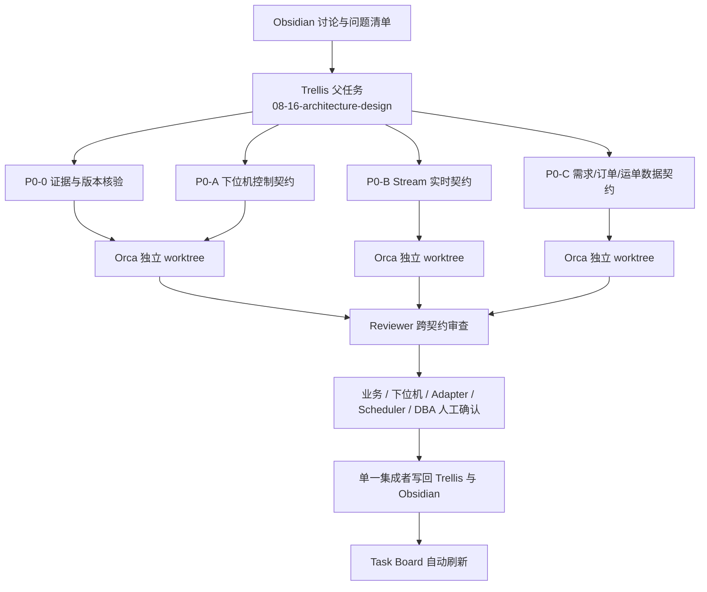

# MFMS 新中台 · P0 契约评审控制台

> [!important] 这里负责协调，不复制状态
> Trellis 是任务、规范和验收的唯一来源；Orca 显示代理、worktree 和候选结果；本页组织讨论入口与人工确认。`worker_done` 只表示候选结果可审查，不表示 Trellis 任务完成。

## 1. 工作流

## 2. 正式任务入口

| 工作包 | Trellis 任务 | 负责回答 | 人工门 |
| --- | --- | --- | --- |
| 父任务 | [[14.复合mfms/14.1 Task/Trellis详情/08-16-architecture-design\|08-16 架构设计]] | 跨任务一致性与最终集成 | MFMS 负责人 |
| P0-0 | [[14.复合mfms/14.1 Task/Trellis详情/08-23-p0-0-evidence-baseline\|证据与版本核验]] | SDK、消息/服务版本和证据身份 | MFMS + 下位机 |
| P0-A | [[14.复合mfms/14.1 Task/Trellis详情/08-23-p0-a-lower-machine-control-contract\|下位机控制契约]] | Q-35～Q-44 | 下位机 + Adapter + MFMS |
| P0-B | [[14.复合mfms/14.1 Task/Trellis详情/08-23-p0-b-redis-stream-contract\|Stream 实时契约]] | Q-31、Q-45、Q-54 实时关联 | 下位机 + Adapter + MFMS |
| P0-C | [[14.复合mfms/14.1 Task/Trellis详情/08-23-p0-c-requirement-order-waybill-contract\|需求/订单/运单数据契约]] | Q-32、Q-46～Q-48、Q-54 | 业务 + Scheduler + DBA + Adapter + MFMS |

任务实时状态：[[14.复合mfms/14.1 Task/Trellis Task 总览]]

## 3. Orca 评审波次

> [!info] Run 已就绪：run_709bea11811c
> 五个 Orca Task 已创建，但 worker 尚未启动。worker 必须使用 `mfms_Framework`、`main` 基线和 `new-top-level` worktree。首轮只做 research/review，不改业务代码。

> [!warning] Agent 登录状态
> Orca 已检测到 Codex 的系统 OAuth。Claude 当前凭据过期；若 P0-B 要使用 Claude，启动前需要在 Orca/Claude 中重新登录，否则先改用 Codex。

| Orca Task | Trellis 映射 | 默认代理 | worktree | 启动条件 |
| --- | --- | --- | --- | --- |
| P0-0 evidence | P0-0 | Codex | 独立同级 | 可立即开始 |
| P0-A control | P0-A | Codex | 独立同级 | 可收集；冻结等待 P0-0 |
| P0-B stream | P0-B | Claude | 独立同级 | 可收集；冻结等待 P0-0 |
| P0-C data | P0-C | Codex | 独立同级 | 可准备评审包；缺失事实保持 unknown |
| cross reviewer | 父任务 | Codex | 独立同级 | 四组候选报告均可见后启动 |

## 4. 人工确认

人工签字、版本、日期和结论统一写入 [[MFMS新中台-人工确认记录]]。未签字的候选不得改成“已确认”，也不得触发 migration 或业务代码任务。

待回答问题唯一登记：[[MFMS新中台-待确定问题清单]]

## 5. 写回规则

1. Worker 只在各自 Trellis 子任务 `research/` 中写候选报告。
2. Reviewer 只比较冲突，不代替责任团队拍板。
3. 单一集成者更新 `.trellis/spec/`、父子任务、问题清单和 canonical 架构文档。
4. 通过人工验收后才归档子任务；Task Board 由现有 Trellis hook 自动刷新。
5. 同一子任务不得同时使用 Trellis Channel 和 Orca orchestration。

## 6. 当前首要阻塞

> [!warning] SDK 权威路径待核验
> Vault 记录的 `/Users/melene/Downloads/HyRMS_export_0810` 当前未找到；legacy 目录中存在共享库哈希相同的候选包，但必须经 P0-0 人工确认后才能作为当前权威输入。

## 7. 关联

- [[MFMS新中台-资料索引与权威源]]
- [[MFMS新中台-架构构造思路]]
- [[MFMS新中台-逐层设计工作台]]
- [[MFMS新中台-Trellis工程结构方案]]
- [[MFMS新中台-待确定问题清单]]
- [[MFMS新中台-人工确认记录]]
