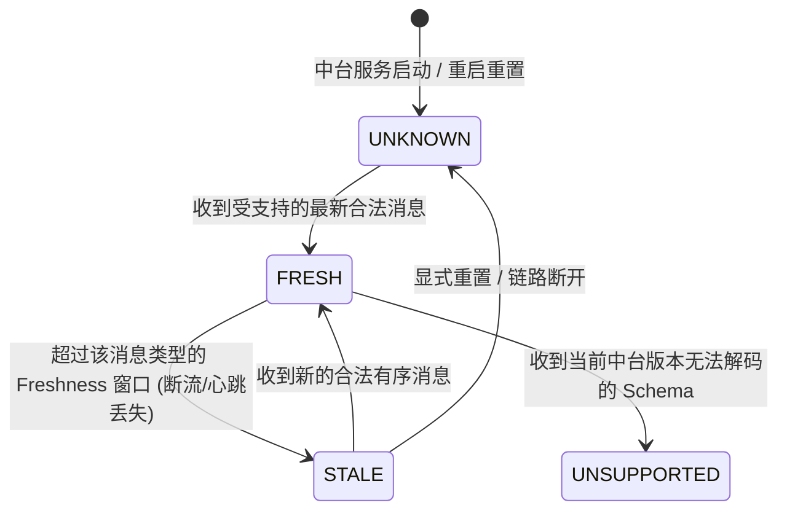
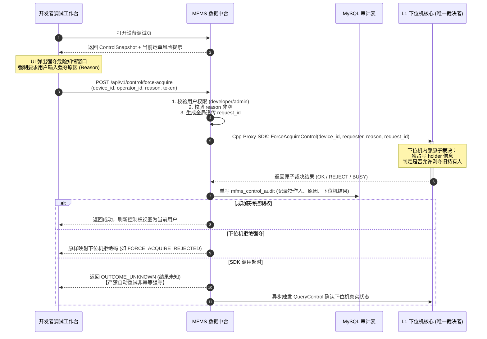

# MFMS 新中台 · 应用层与数据中台需求对齐文档 (v0.4 最新基线)

> [!abstract] 对齐目标与文档定位
> 本文用于指导 **上位应用层（MES/SCADA、Qt工控看板、Web综合大屏、开发者调试工作台及工厂专有协议接入端）** 与 **MFMS 数据中台（部署于工厂小主机的独立 C++ 模块化单体）** 之间的需求、交互契约、数据流转与异常降级对齐。
> 
> **事实依据**：严格遵循 `.trellis/ARCHMAP.md`、`.trellis/spec/constraints.md`、各子项契约及 2026-08-28 最新现场网络与地址分区证据。
> **跨组件原则**：中台绝不越权承担调度（选车/拆单/DAG）或下位机（控制权裁决/设备驱动）职责；应用层亦不直接穿透中台访问物理总线。

---

## 0. 结论标签与架构基线状态

为避免团队沟通歧义，本文所有条款严格采用统一语义标记：

| 标记 | 法律级约束语义 | 落地要求 |
| :--- | :--- | :--- |
| **【已确认】** | 可作为硬编码/实现边界；上下游团队必须共同遵守 | 已冻结系统职责，任何实现不得违反（如控制权归属、单写隔离） |
| **【推荐基线】** | 当前首选方案；可据此规划开发，但物理 DDL/API 签名需联合评审 | 评审通过前不得冒充已冻结生产接口 |
| **【待业务/下位机确认】** | 依赖外部团队（MES、调度、下位机、现场网络）的未决项 | 禁止中台自行发明语义，保留未知标记并登记跟踪 |
| **【历史废弃/严禁】** | 历史方案遗留或明确禁止进入新代码的反模式 | 严禁进入新系统（如中台做锁表、调度 gRPC 直连等） |

---

## 1. 系统边界与职责对齐矩阵

```text
┌─────────────────────────────────────────────────────────────────────────────────┐
│                      L5 / L6 上位应用层 (Client & Site Layer)                     │
│   MES / SCADA 系统  ｜  Qt GUI 工控上位看板  ｜  Web Dashboard 监控  ｜  开发者调试客户端   │
└────────────────────────────────────────┬────────────────────────────────────────┘
                                         │ HTTP REST (CRUD) / WebSocket 事实广播 / Cpp-Proxy-SDK 透传
                                         ▼
┌─────────────────────────────────────────────────────────────────────────────────┐
│                 L4 MFMS 数据中台 (独立 C++ 模块化单体 · 部署于局域网小主机)                  │
│   需求受理与校验 ｜ 业务血缘组装 (RequirementView) ｜ 实时流接入与 StateManager ｜ 控制调试透传与审计   │
└────────────┬───────────────────────────┬───────────────────────────┬────────────┘
             │ 【中台单写】                  │ 【中台只读】                  │ 申请/强夺/调试
             │ mfms_requirement          │ mfms_order & mfms_waybill │ 指令透传
             ▼                           ▲                           ▼
     ┌───────────────┐           ┌───────────────┐           ┌───────────────────┐
     │  MySQL 关系库  │           │   L3 调度系统  │           │   L1 下位机核心    │
     │ 需求与审计存储 │           │ 认领/拆分/单写 │           │ 唯一控制权裁决者   │
     └───────────────┘           └───────┬───────┘           └─────────▲─────────┘
                                         │ 派发运单                    │ ADK 申请与驱动
                                         ▼                           │
                                 ┌───────────────┐                   │
                                 │   L2 Adapter  │───────────────────┘
                                 │ 运单适配执行  │
                                 └───────────────┘
```

### 1.1 四方权威分工矩阵【已确认】

| 业务领域 | 权威管理者 (Sole Authoritative Owner) | 数据中台的职责范围 | 应用层 (MES/Web/Qt/Debug) 的对齐规范 |
| :--- | :--- | :--- | :--- |
| **原始业务需求** | **MFMS 数据中台** | 接收、语法校验、幂等检查、单写 `mfms_requirement` | MES 提交生产拉料需求，只与中台需求接口交互；不直接呼叫调度 |
| **订单与运单** | **L3 调度系统 (Scheduler)** | 从 MySQL 消费只读数据，组装 `RequirementView` 供前端查询；**中台严禁单写/拆单/修改订单运单** | 看板展示订单/运单持久状态必须以调度写入为准；禁止前端试图直接创建运单 |
| **运单物理执行** | **L2 Adapter** | 消费 Redis Stream 中 Adapter 发布的进度与完成事实，更新实时内存快照 | 前端可消费实时进度事实，但该事实不替代调度的持久终态 |
| **控制权与安全** | **L1 下位机核心 (Lower Machine)** | 用户鉴权、风险知情提示、必填原因采集、透传请求至下位机、写入审计；**中台无锁无lease无token** | 前端 `ControlSnapshot` 仅供展示与保守禁用；**每次控制动作必须以下位机真实返回为准** |
| **物理动作驱动** | **L1 下位机核心** | 透传合法调试命令；执行前置身份与硬件安全双重校验 | 调试客户端发送 jog/nav/IO 指令必须附带凭据，接受下位机最终拒绝 |

### 1.2 架构红线与禁区（【严禁】）
1. **控制权红线**：中台绝不在本地实现控制权状态机、锁表、续租（lease）、fencing token、`control_epoch` 或跨系统夺权仲裁。
2. **持久化红线**：中台只单写原始需求表，严禁实现 `OrderWriter`、`WaybillWriter` 或拆单引擎。
3. **网络与身份红线**：严禁把动态 IP 当作稳定设备身份或鉴权凭证；多机器人必须使用 `factory_id + robot_unit_id + device_id` 解耦寻址。
4. **状态与缓存红线**：中台重启后所有快照一律从 `UNKNOWN` 开始重建，绝对不从历史日志恢复控制权或假定设备空闲；`STALE` 状态绝不能当成“已解锁”。

---

## 2. 业务需求受理与全景血缘对齐 (Requirement Intake & Lineage)

### 2.1 需求提交与受理交互 (Intake Flow)

* **调用通道**：HTTP REST POST `/api/v1/requirements`（MES / 上位工控看板发起）
* **接口语义**：中台负责受理、合法性校验与持久化存储，生成全链路根标识 `requirement_uid`。

#### 【推荐基线】请求与响应 DTO

```json
// POST /api/v1/requirements 请求载荷
{
  "factory_id": "FACTORY-01",
  "source_system": "MES",
  "source_requirement_id": "REQ-20260824-0091",  // 来源侧幂等键
  "schema_version": "v1.0",
  "target_workstation": "WS-ASSEMBLY-A03",
  "payload_json": {
    "material_type": "TRAY_TYPE_B",
    "batch_no": "BATCH-20260824",
    "quantity": 2,
    "priority": 10,
    "request_timestamp": 1724486400000
  }
}

// 响应载荷
{
  "request_id": "req-trace-uuid-10023",
  "code": "OK",
  "message": "Requirement accepted and persisted",
  "data": {
    "requirement_uid": "req_uid_8849102847192",
    "intake_status": "RECEIVED",                   // 仅代表中台受理成功，非调度执行状态
    "created_at": "2026-08-24T10:00:00.120Z"
  }
}
```

* **对齐约束**：
  1. `intake_status` 仅包含 `RECEIVED`（已入库）、`VALIDATED`（校验通过）、`REJECTED`（语法或业务校验拒绝），**严禁出现 `RUNNING`、`FINISHED` 等调度执行状态**。
  2. 幂等性保障：以 `(factory_id, source_system, source_requirement_id)` 为联合唯一索引，重复提交直接返回既有 `requirement_uid`。

---

### 2.2 统一血缘视图 `RequirementView` 对齐

Web 监控大屏与上位看板需要跟踪生产拉料从需求、拆单、派单到执行的完整链路。中台提供只读组合模型 `RequirementView`：

```text
RequirementView (聚合根)
├── requirement (需求实体 · 中台单写)
│     ├── requirement_uid
│     ├── intake_status: RECEIVED / VALIDATED
│     └── payload_json
├── orders[] (派生订单列表 · 调度单写 · 中台只读)
│     ├── order_uid
│     ├── workstation_alias
│     ├── operation_type: LOAD / UNLOAD
│     ├── item_ids: ["ITEM-01", "ITEM-02"]
│     ├── business_timestamp
│     ├── quantity
│     ├── priority
│     ├── status (调度持久终态: CREATED / DISPATCHED / COMPLETED / FAILED)
│     └── waybills[] (派生执行运单 · 调度单写 · 中台只读)
│           ├── waybill_uid
│           ├── external_waybill_id
│           ├── assigned_device_id
│           ├── status (调度持久态: PENDING / RUNNING / COMPLETED / ABORTED)
│           └── live_state (实时执行事实 · 来自 Redis Stream)
│                 ├── progress_percent: 75%
│                 ├── current_node: "POINT-104"
│                 ├── observed_at: "2026-08-24T10:05:20Z"
│                 └── source: "ADAPTER_INSTANCE_01"
└── control_display (当前设备控制权事实 · 来自下位机 AgvControl)
      ├── locked: true
      ├── owner_ip: "192.168.58.119"
      ├── owner_nick_name: "Adapter-Worker-01"
      └── quality: FRESH
```

#### 【已确认】订单最小业务字段规范
应用层在前端设计工位订单看板时，必须且仅能依赖以下已确认的订单字段集：
1. **工作站点名称/别名 (`workstation_alias`)**：业务工位标识；
2. **操作类型 (`operation_type`)**：物理动作类型，规范取值为 `LOAD`（上料）或 `UNLOAD`（下料）；
3. **业务对象标识集 (`item_ids`)**：物料、料框或料盘的业务 ID 集合；
4. **业务时间戳 (`business_timestamp`)**：调度业务执行或生效基准时间；
5. **数量 (`quantity`)**：实际操作物料总数；
6. **优先级 (`priority`)**：调度任务编排优先级。

---

## 3. 实时态势感知与状态质量对齐 (Realtime State & Quality)

### 3.1 统一消息信封 (Normalized Envelope)【已确认】

所有进入中台 `StateManager` 的下位机遥测（`SeerCtrlState`、`FrRobotState`、`AgvControl`）及 Adapter 运单事实（`AgvOrderState`），均封装于统一信封中。中台在推向 Web 前端长连接时保持该元数据规范：

| 信封字段 | 生产者保证 | 中台追加 | 前端消费语义 |
| :--- | :---: | :---: | :--- |
| `message_type` | ✓ | | 区分消息家族（如 `AgvControl`、`SeerCtrlState`、`FrRobotState`） |
| `schema_version` | ✓ | | 负载版本，确保前端序列化组件向前兼容 |
| `factory_id` | ✓ | | 厂区隔离标识 |
| `device_id` | ✓ | | 规范化完整设备唯一标识（如 `agvSee0003`） |
| `source_type` | ✓ | | 来源分类：`LOWER_MACHINE` ｜ `ADAPTER` ｜ `IPC_AGENT` |
| `source_instance_id` | ✓ | | 产生该事实的具体进程实例 ID，用于序列号隔离域 |
| `sequence` | ✓ | | 单调递增序号。低序号后到视为乱序，**绝不回滚已更新快照** |
| `observed_at` | ✓ | | **物理源端事实产生的绝对时间戳** |
| `received_at` | | ✓ | 中台时钟接收时刻，仅供管道延迟分析，**不得覆盖 observed_at** |
| `stream_entry_id` | | ✓ | 消息队列定位游标，严禁前端作为业务时间使用 |
| `payload` | ✓ | | 具体的业务/物理载荷 |

---

### 3.2 四级状态质量标记与前端展示铁律【已确认】

前端页面在呈现设备状态（电量、坐标、机械臂角度）或控制权状态时，必须根据中台附加的 `quality` 字段进行可视化降级：



| 质量级别 (Quality) | 物理含义 | 前端 UI 显示要求 | 高危控制权限 (Jog/强夺/IO) |
| :--- | :--- | :--- | :--- |
| **`FRESH`** | 数据新鲜，位于有效时间窗口内 | 正常绿色显示数值与状态 | 允许根据当前持有者身份申请操作 |
| **`STALE`** | 超时过期，可能遭遇断流、无线丢包或进程挂起 | 黄色告警标示，显示最后观测时间，提示“数据已过期” | **默认锁定并禁用所有高危控制按钮** |
| **`UNKNOWN`** | 未知状态。中台刚重启或尚未建立观测 | 灰色标示，明确显示“状态未知” | **严禁启用控制；禁止假定为空闲或健康** |
| **`UNSUPPORTED`** | 该设备或消息版本当前中台 build 无法识别 | 红色告警标示“不支持的消息类型” | 严禁部分解码或强制转换为空闲 |

> [!danger] 重启恢复铁律
> 中台进程发生崩溃重启时，**所有设备的实时快照与控制权快照全部重置为 `UNKNOWN`**。
> 前端绝不能因为上次会话缓存显示“未锁定”就引导用户发起控制命令；必须等待下位机重新推送最新 `AgvControl` 或通过显式 `QueryControl` 刷新。

---

## 4. 控制权申请、强夺与调试安全对齐 (Control Access & Debug Safety)

### 4.1 控制权展示模型 `ControlSnapshot`

前端在渲染设备卡片及调试抽屉时，读取由中台维护的只读快照 `ControlSnapshot`：

```json
{
  "device_id": "agvSee0003",
  "locked": true,
  "owner_ip": "192.168.58.119",
  "owner_port": 19204,
  "owner_type": "ADAPTER_PRODUCTION",
  "owner_nick_name": "Adapter-Line1-AGV01",
  "owner_time": 1724486410000,
  "owner_description": "Executing Order: ORD-20260824-001",
  "observed_at": "2026-08-24T10:10:00.050Z",
  "received_at": "2026-08-24T10:10:00.055Z",
  "quality": "FRESH"
}
```

---

### 4.2 强夺控制权 (Force Acquire) 的应用层闭环【已确认流程】

当开发者或现场工程师需要对处于生产中的机器人进行紧急强夺调试时，必须遵循以下对齐流程：



#### 对齐要求：
1. **二次确认与知情提示**：前端在弹出强制申请模态框时，必须向用户展示：
   * 当前持有人及 IP（如 `Adapter-Line1-AGV01`）；
   * 当前正在履行的 MES 订单与运单号；
   * 警示文字：“强夺将导致当前正在执行的运单中断，产线可能发生停线或物料状态不一致”。
2. **不可逆原因采集 (Reason)**：**前端必须提供多行文本框，强制要求输入非空原因**（中台后端执行非空校验，否则直接抛出 `400 INVALID_PARAMETER`）。
3. **二次确认绝非锁协议**：该流程仅仅是知情警示与审计凭据采集，中台本地绝不生成锁记录，下位机拥有 100% 的裁决拒绝权。

---

### 4.3 调试指令透传与双重安全硬校验

在获得控制权后，开发者工作台发送调试动作指令（点动 `jog`、导航 `navigate`、机械臂单轴运动、夹爪开合）：

* **下位机前置双重硬校验**：
  1. **持有者合法性校验**：请求包中的 `requester_identity` 必须完全匹配下位机当前登记的 `owner`；
  2. **硬件物理安全联锁**：若下位机检测到物理急停按下、安全光幕遮挡、机械臂关节超限位或设备处于硬件错误状态，**坚决予以 `REJECT`**。
* **应用层表现**：前端收到拒绝响应后，应明确区分展示是“无控制权（未持权）”还是“硬件安全联锁（急停/限位）”，引导用户排查物理现场。

---

## 5. 现场网络拓扑与多机器人寻址对齐 (Network & Multi-Robot)

根据 **2026-08-28 用户最新确认事实** 与样机证据，现场多机器人网络具有复杂的网段隔离特征：

```text
工厂外部 WLAN (192.168.58.0/24) ── 对端网关: 192.168.58.1
   ├── 机器人内部路由器 WAN: 192.168.58.xxx (Wi-Fi Client-Router)
   │     ├── [冲突待确认] A03-T2 热点/调试端点 (文字 192.168.193.xxx vs 截图 192.168.192.xxx)
   │     ├── AGV/车载设备网络: 192.168.192.xxx
   │     │     └── src_controller (仙工 AGV 小车主控制器，角色: AGV_CONTROLLER)
   │     └── 内部交换机分配网络: 192.168.193.xxx
   │           ├── 机械臂 (FrRobot / AuboRobot)
   │           ├── 工业相机系统
   │           └── 力觉传感器 / PLC 夹爪
   └── 工控机外部无线网卡 (WLAN): 192.168.58.xxx
         │
         └── (车载工控机双归属，有线网卡接入内部交换机 192.168.193.xxx)
```

### 5.1 应用层寻址三原则【已确认】

1. **绝对稳定身份标识**：
   应用层界面与 API 调用必须以 `factory_id + robot_unit_id + device_id` 为目标定位主键。
   * 现场多台机器人内部均复用 `192.168.192.xxx` 和 `192.168.193.xxx` 私网网段；
   * 路由器 WAN IP 由工厂侧 DHCP 分配，存在租约过期飘移可能；
   * **前端严禁直接根据 IP 地址作为机器人唯一主键！**
2. **工控机非网桥铁律**：
   车载工控机具备无线（`192.168.58.x`）与有线（`192.168.193.x`）双网卡，但**严禁将其当作网络路由器或 NAT 网桥**。应用层与中台不得尝试通过工控机透明穿透访问机械臂或相机。
3. **外部服务访问解析链**：
   工厂外部网络访问机器人内部服务时，必须经由中台解析：“稳定身份 → 当前路由器 WAN IP (`192.168.58.xxx`) → 经安全评审批准的 NAT 端口映射”。

---

## 6. 接口协议与错误码对齐清单 (API Contract & Error Codes)

### 6.1 核心 HTTP REST 接口清单

| 方法 | 路径 | 来源客户端 | 核心作用 | 终态语义与注意事项 |
| :--- | :--- | :--- | :--- | :--- |
| `POST` | `/api/v1/requirements` | MES / 看板 | 提交生产需求 | 中台单写入库，返回 `requirement_uid` 与 `RECEIVED` |
| `GET` | `/api/v1/requirements/{uid}/view` | Web / 看板 | 查询血缘视图 | 只读组合需求、调度单写的订单/运单与实时状态 |
| `GET` | `/api/v1/devices/{id}/control-snapshot` | 调试端 / Web | 读取控制权显示 | 读取内存只读快照，质量标为 `FRESH/STALE/UNKNOWN` |
| `POST` | `/api/v1/control/acquire` | 调试端 / Operator | 普通申请空闲控制权 | 仅限空闲申请，透传下位机裁决 |
| `POST` | `/api/v1/control/force-acquire` | 调试端 / Admin | 强制夺取控制权 | **强制采集 reason**，二次确认知情，下位机裁决 |
| `POST` | `/api/v1/control/release` | 调试端 / Operator | 释放控制权 | 透传下位机，下位机清空持有人并广播新快照 |
| `POST` | `/api/v1/devices/{id}/debug-command` | 开发者调试端 | 下发点动/IO/调试 | 需带权限凭据，下位机执行双重安全硬校验 |

---

### 6.2 统一错误码与下位机状态映射规范【推荐基线】

中台负责将下位机或适配器的底层原始码转换为应用层稳定错误码，前端应根据标准分类进行处理：

| 中台标准错误分类 (Category) | HTTP 状态码 | 业务含义 | 应用层 (前端/客户端) 处理对策 |
| :--- | :---: | :--- | :--- |
| `OK` | 200 | 操作成功 | 正常推进状态，刷新视图 |
| `ALREADY_OWNED_BY_REQUESTER` | 200 | 当前调用者已持有控制权 | 无需重复申请，直接开启调试面板 |
| `OWNED_BY_OTHER` | 409 | 控制权已被他人持有 | 禁用普通操作，提示持有人信息，允许选择强夺 |
| `FORCE_ACQUIRE_REJECTED` | 403 | 下位机拒绝强制剥夺 | 提示强夺被下位机策略拒绝（如下位机处于生产不可逆阶段） |
| `CONTROL_NOT_OWNED` | 403 | 未持有控制权，禁止执行命令 | 提示先获取控制权，禁止直接执行动作指令 |
| `DEVICE_BUSY` | 423 | 物理设备忙（正在执行其他物理动作） | 提示设备当前繁忙，排队或稍后重试 |
| `DEVICE_FAULT` | 503 | 物理设备存在硬件故障/急停按下 | 提示现场硬件故障告警，排查物理急停按钮或光幕 |
| `REQUEST_TIMEOUT` | 504 | 下位机响应超时 | **标记为 OUTCOME_UNKNOWN；严禁前端盲目自动重试！** |
| `INVALID_PARAMETER` | 400 | 参数缺失（如强制申请 reason 为空） | 表单高亮提示必填项 |
| `UNAUTHORIZED` | 401 | 用户未登录或凭据失效 | 跳转统一登录鉴权中心 |
| `FORBIDDEN` | 403 | 用户角色权限不足（如 viewer 尝试强夺） | 权限不足弹窗提示 |

---

## 7. 待对齐与待确认问题跟踪清单 (Open Items)

以下事项目前属于 **【待业务/下位机/现场网络确认】**，已在问题清单中登记，开发中严禁提前做假定：

| 问题编号 | 事项分类 | 待确认内容 | 当前应对策略 |
| :--- | :--- | :--- | :--- |
| **Q-32 / Q-46** | 业务 / DDL | 订单物理 DDL 字段类型、`ids[]` 存储形态（JSON 还是关联子表）、时间戳具体含义 | 中台仅按已确认的 6 个逻辑字段建模，不向前端暴露物理数据库列名 |
| **Q-35～Q-44** | 下位机控制 | 下位机真实 C++ 函数签名、错误码数值字典、超时结果查询 API | 中台通过 `LowerMachineControlClient` 设隔离薄层，暂用标准 DTO 解耦 |
| **Q-20260828** | 现场网络 | A03-T2 调试热点权威网段（文字 `192.168.193.x` vs 附图标注 `192.168.192.x` 冲突） | 现场确认前禁止写死任何一个网段作为自动调试连接目标 |
| **Q-NAT-PORTS** | 网络安全 | 仙工路由器 NAT 最小开放端口白名单（502/503/Redis/调试端口是否允许暴露） | 坚持最小化原则 (fail-closed)，未明确审批端口一律不予映射 |
| **Q-ROS-SPEC** | 寻址协议 | 多机 ROS 广播 IP 的 Topic、消息结构、QoS、以及中台是否主动订阅 | 暂作为现场寻址事实记录，中台核心控制与遥测不依赖 ROS 广播通道 |

---

## 8. 关联索引与参考文档

* `.trellis/ARCHMAP.md` —— MFMS v0.4 架构基线
* `.trellis/spec/contracts/control-access-contract.md` —— 控制访问与审计契约
* `.trellis/spec/contracts/realtime-stream-contract.md` —— 实时流与信封契约
* `.trellis/spec/contracts/order-persistence-contract.md` —— 需求/订单/运单持久化契约
* `.trellis/spec/contracts/deployment-network-contract.md` —— 现场网络与机器人寻址契约
* [[MFMS新中台-逐层设计工作台]] —— 详细分层设计基线
* [[MFMS新中台-P0契约评审控制台]] —— P0 契约联合评审跟踪
* [[MFMS新中台-架构图.drawio]] —— v0.4 多标签页架构与数据流向源图
