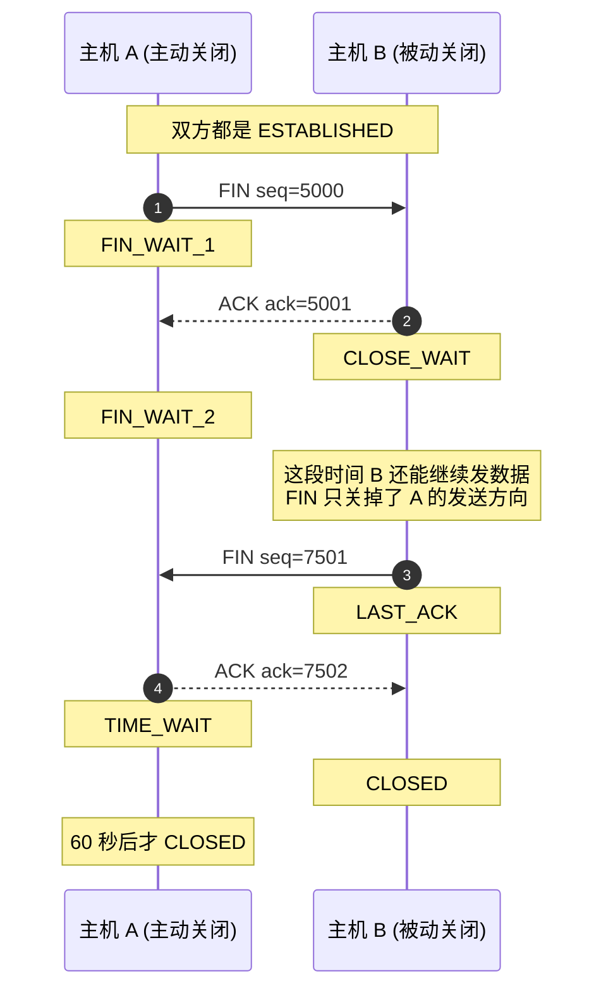
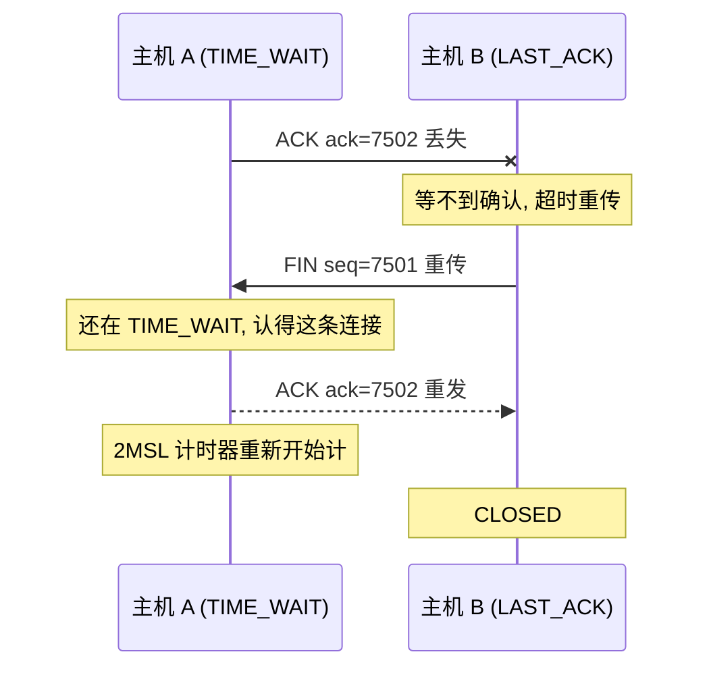
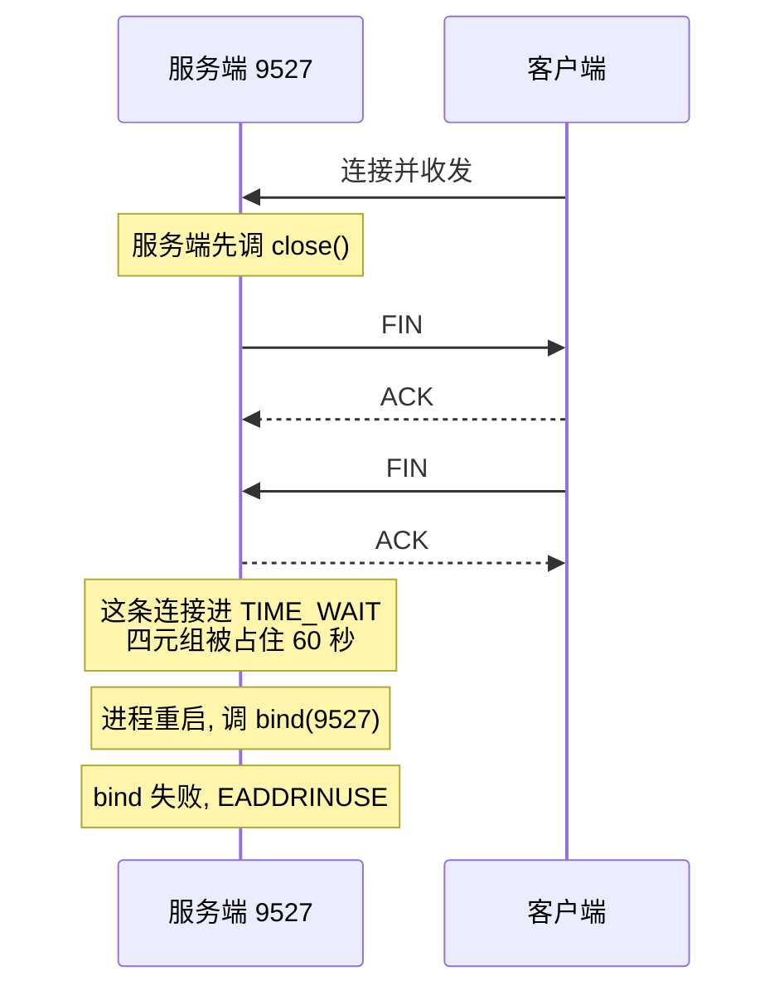

---
tags:
  - Linux
  - 套接字
阅读次数: 0
---

# 10.2 TIME_WAIT 状态

## 1. 谁会进 TIME_WAIT

[[7.5 TCP协议基础#5. 四次挥手|四次挥手]]结束时，两端的结局并不对称：**主动调 `close()` 的那一方**在发出最后一个 ACK 后进入 `TIME_WAIT`，被动方收到这个 ACK 就直接 `CLOSED`。



> [!note]- 教材原图
> ![[图片/3.Linux/10. 套接字/fa9d51f7-4fe2-4600-a59c-0d2d3568719a.png]]

有两个数字要分清：

- **2MSL** 是协议层面的规定，MSL（Maximum Segment Lifetime）是报文在网络中的最大存活时间。
- **60 秒**是 Linux 的实际取值。内核把它写成常量 `TCP_TIMEWAIT_LEN`，不随负载变化，也没有任何 sysctl 能调。

> [!warning] `tcp_fin_timeout` 改不了 TIME_WAIT
> 这是最常见的一条误传。`net.ipv4.tcp_fin_timeout` 控制的是 **`FIN_WAIT_2`** 能等多久（对方迟迟不发 FIN 时的兜底），和 `TIME_WAIT` 的 60 秒毫无关系。把它调到 5 秒，`ss` 里的 `TIME_WAIT` 数量一个也不会少。

`CLOSE_WAIT` 堆积和 `TIME_WAIT` 堆积是完全相反的两回事，别混：前者在被动关闭方、是应用忘了 `close()` 的 bug，后者在主动关闭方、是协议要求的正常现象。详见 [[8.11 TCP连接关闭与异常状态#2. 先看全景：两个状态各落在哪一端|两个状态各落在哪一端]]。

---

## 2. 这 60 秒在拦什么

![[图片/SVG/3_10_10_2_1.svg|900]]

### 2.1 作用一：兜底最后那个 ACK

最后一个 ACK 也可能丢。丢了之后，被动方收不到确认，超时重传 FIN；这时主动方还在 `TIME_WAIT`，认得这条连接，把 ACK 再发一次。



注意最后那一步：**每收到一次重传的 FIN，计时器就重新从 2MSL 开始计**，不是接着原来的倒计时走。

> [!note]- 教材原图
> ![[图片/3.Linux/10. 套接字/Pasted image 20251218085447.png]]

如果没有 `TIME_WAIT`，主动方发完 ACK 立刻 `CLOSED`，重传的 FIN 会打到一个已经不存在的端口上。内核对着不存在的连接只会回 **RST**，于是被动方拿到的不是「正常关闭」而是「连接被重置」，应用层可能因此报错、丢掉尚未处理完的数据。

### 2.2 作用二：让旧连接的报文自然消亡

TCP 连接由四元组标识。旧连接关掉后，如果同一个四元组立刻被复用，而网络里还漂着上一条连接的延迟报文，接收方无从分辨新旧，会把旧数据当成新连接的数据收下。

2MSL 里的 2 就是这么来的：**旧报文最多活一个 MSL，对方基于旧报文触发的重传最多再花一个 MSL**，一去一回，等满两倍就能保证网络里不再有属于这条连接的任何报文。

> [!important] TIME_WAIT 占的是四元组，不是端口
> 这个区分决定了后面所有的排查方向。一台服务器在 `:80` 上有十万条 `TIME_WAIT`，端口只用了一个：每条的对端 `IP:port` 都不同，四元组各不相同。
>
> 真正会被耗尽的是**主动发起连接那一侧的本地端口**（`ip_local_port_range` 默认约 2.8 万个），这通常是客户端或正向代理的问题，不是被连接的服务端。

---

## 3. 它带来的实际问题

服务端主动关闭连接后立刻重启，`bind()` 会失败：



```bash
$ ./server 9527
服务器启动成功，监听端口 9527
^C

$ ./server 9527
bind failed: Address already in use     # 60 秒内一直是这个结果
```

原因是内核在 `bind()` 时做地址冲突检查，发现这个 `IP:port` 上还挂着处于 `TIME_WAIT` 的旧套接字。注意此时旧套接字**不占文件描述符**，进程也已经退出了，占用的只是内核里一小块记录四元组的结构。

### 3.1 服务端和客户端遇到的不是同一个问题

| | 服务端（被连接方） | 客户端 / 正向代理（发起方） |
|:---|:---|:---|
| 症状 | 重启时 `bind()` 报 `EADDRINUSE` | `connect()` 报 `EADDRNOTAVAIL` |
| 瓶颈 | 地址冲突检查；总量上限是 `tcp_max_tw_buckets` | 本地端口耗尽，`ip_local_port_range` |
| 解法 | `SO_REUSEADDR` | 扩大端口范围、连接池、`tcp_tw_reuse` |
| 端口会耗尽吗 | 不会，监听端口只有一个 | 会，这是它的主要瓶颈 |

`TIME_WAIT` 总数超过 `net.ipv4.tcp_max_tw_buckets` 时，内核会直接销毁多出来的表项并在日志里打一行 `TCP: time wait bucket table overflow`。这是**保护阀，不是优化开关**：被强行销毁的连接就失去了上面那两层保护。看到这行日志应该去减少 `TIME_WAIT` 的产生，而不是把阈值调大了事。

---

## 4. SO_REUSEADDR 解决方案

![[图片/SVG/3_10_10_2_2.svg|900]]

`SO_REUSEADDR` 告诉内核：做地址冲突检查时，忽略那些处于 `TIME_WAIT` 的旧套接字。

它**不**做的事同样重要：它不会让两个套接字同时 `listen` 在一个 `IP:port` 上，那是 `SO_REUSEPORT` 的活。两者的区别见 [[10.1 套接字选项#6.4 SO_REUSEADDR 与 SO_REUSEPORT|套接字选项]]。

### 4.1 代码

```cpp
#include <sys/socket.h>
#include <netinet/in.h>
#include <cstdio>

int fd = ::socket(AF_INET, SOCK_STREAM, 0);
if (fd < 0) { std::perror("socket"); return -1; }

// 关键的一步，必须在 bind 之前
int on = 1;
if (::setsockopt(fd, SOL_SOCKET, SO_REUSEADDR, &on, sizeof(on)) < 0) {
    std::perror("setsockopt SO_REUSEADDR");
    return -1;
}

sockaddr_in addr{};
addr.sin_family      = AF_INET;
addr.sin_addr.s_addr = htonl(INADDR_ANY);   // 不要写死 127.0.0.1，否则只能本机访问
addr.sin_port        = htons(9527);

if (::bind(fd, reinterpret_cast<sockaddr*>(&addr), sizeof(addr)) < 0) {
    std::perror("bind");     // 设了 SO_REUSEADDR 之后，不会再因为 TIME_WAIT 走到这里
    return -1;
}
::listen(fd, SOMAXCONN);
```

四个容易写错的地方：

- **`on` 必须是 `int`，不能是 `bool` 或 `char`。** `setsockopt` 按 `optlen` 从指针读那么多字节，长度给错就是未定义行为。
- **必须在 `bind()` 之前设。** 冲突检查发生在 `bind()` 内部，`bind()` 已经返回了再设置，对这次绑定没有任何影响。
- **`listen()` 的 backlog 别写 3。** 用 `SOMAXCONN` 或按并发量估，写太小在压力下会丢连接，见 [[8.13 TCP内核队列与参数调优|内核队列]]。
- **要确认是否设置成功，用 `getsockopt` 读回来，不是再调一次 `setsockopt`。**

```cpp
int val = 0;
socklen_t len = sizeof(val);
if (::getsockopt(fd, SOL_SOCKET, SO_REUSEADDR, &val, &len) == 0) {
    std::printf("SO_REUSEADDR = %d\n", val);   // 期望 1
}
```

`getsockopt` 的第五个参数是 `socklen_t*`（值-结果参数），`setsockopt` 的是 `socklen_t`。名字只差三个字母，签名不一样，这是新手最容易踩的一处。

### 4.2 加上之后的效果

```bash
$ ./server 9527
SO_REUSEADDR = 1
服务器启动成功，监听端口 9527
^C

$ ./server 9527          # 立刻重启，不用等 60 秒
SO_REUSEADDR = 1
服务器启动成功，监听端口 9527
```

> [!tip] 服务端应该默认打开它
> 这不是一个「排障时才加」的选项。任何需要能随时重启的监听服务，都应该在 `bind()` 前设上，否则一次异常退出就要等一分钟才能拉起来。生产上因为漏了这一行导致回滚窗口拉长的事故并不少见。

---

## 5. 优化：先改设计，再改参数

`TIME_WAIT` 是协议要求的正常状态，堆积说明**这一端主动关闭了太多连接**。真正有效的手段都在设计层：

| 做法 | 为什么有效 |
|:---|:---|
| 让客户端主动关闭 | `TIME_WAIT` 跟着 `close()` 走，谁先关谁承担 |
| 打开 HTTP keep-alive，别每个请求关一次 | 一条连接跑 N 个请求，关闭次数除以 N |
| 用连接池复用长连接 | 同上，且省掉重复握手的 RTT |
| 减少不必要的服务端主动断连 | 比如别把空闲超时设得过短 |

参数层面能做的有限，而且要知道边界：

- **`net.ipv4.tcp_tw_reuse`**：允许拿处于 `TIME_WAIT` 的端口去**发起新的出方向连接**，依赖 TCP 时间戳来分辨新旧报文。它只帮发起连接的一方，对服务端的入方向连接没有任何作用。
- **`net.ipv4.ip_local_port_range`**：客户端侧端口不够时调大它，比动 `TIME_WAIT` 机制安全得多。
- **`net.ipv4.tcp_max_tw_buckets`**：保护阀，前面说过了。
- **`SO_LINGER` 设成 0**：让 `close()` 直接发 RST 从而跳过 `TIME_WAIT`。这是**故意破坏协议保证**，只在测试对端健壮性或踢掉恶意连接时用，见 [[8.11 TCP连接关闭与异常状态#8. SO_LINGER|SO_LINGER]]。

> [!danger] `tcp_tw_recycle` 别用，也别信老文章
> 它在 NAT 环境下会按源 IP 记录时间戳，把同一个出口 IP 后面不同主机的正常连接误判成旧报文丢掉，症状是「一部分用户随机连不上」。这个参数**已在 Linux 4.12 中移除**。网上大量调优文章仍在推荐它，看到就跳过。

参数细节和整条链路上的其他闸口见 [[8.13 TCP内核队列与参数调优|TCP 内核队列与参数调优]]。

---

## 6. 观察

```bash
# 数一下当前有多少 TIME_WAIT
ss -tan state time-wait | wc -l

# 按对端聚合，看是被谁撑起来的
ss -tan state time-wait | awk '{print $4}' | sort | uniq -c | sort -rn | head

# 只看某个端口
ss -tan '( sport = :9527 or dport = :9527 )'

# 相关阈值
sysctl net.ipv4.tcp_max_tw_buckets
sysctl net.ipv4.ip_local_port_range
sysctl net.ipv4.tcp_tw_reuse

# 桶满了会打这行日志
dmesg | grep -i "time wait bucket"
```

排查顺序：先看 `TIME_WAIT` 在哪一端（主动关闭的是谁），再判断卡的是 `bind` 还是本地端口，最后才轮到参数。顺序反了通常会白折腾。

> [!tip] 交互动画
> TIME_WAIT 与 Nagle 的可视化（四次挥手双端状态 · 2MSL 的两大作用 · `SO_REUSEADDR` 修复 `EADDRINUSE`）：
> [▶ 在浏览器中打开动画](<../../图片/HTML/3.Linux/10. 套接字/10.2-10.3 TIME_WAIT & Nagle (EN).html>)　·　更多见 [[网络编程·动画合集]]

---

## 7. 常见误区

| 说法 | 实际 |
|:---|:---|
| `TIME_WAIT` 两端都会有 | 只在主动 `close()` 的一方，被动方收到最后的 ACK 就 `CLOSED` |
| 调 `tcp_fin_timeout` 能缩短 `TIME_WAIT` | 它管的是 `FIN_WAIT_2`，对 `TIME_WAIT` 无效 |
| Linux 上 `TIME_WAIT` 时长可以配 | 固定 60 秒，内核常量 `TCP_TIMEWAIT_LEN` |
| 服务端 `TIME_WAIT` 多会导致端口耗尽 | 监听端口只有一个；端口耗尽是发起连接那一侧的问题 |
| `TIME_WAIT` 占着文件描述符 | 不占，套接字已关闭，只剩一小块内核记录 |
| `SO_REUSEADDR` 能让两个进程监听同一端口 | 那是 `SO_REUSEPORT`，两者解决的问题完全不同 |
| `SO_REUSEADDR` 什么时候设都行 | 必须在 `bind()` 之前，之后设无效 |
| `tcp_tw_reuse` 能救服务端 | 只作用于出方向的新连接，服务端的入方向用不上 |
| `tcp_tw_recycle` 是标准调优项 | NAT 下会误伤，已在 Linux 4.12 移除 |
| 把 `tcp_max_tw_buckets` 调大就解决了 | 它是保护阀，调大只是让问题晚点暴露 |

---

## 8. 自测问题

1. 为什么 `TIME_WAIT` 只出现在主动关闭的一方？
2. 如果取消 `TIME_WAIT`，最后那个 ACK 丢了会发生什么？
3. 一台服务器上有十万条 `TIME_WAIT`，它的端口会不会被耗尽？
4. `SO_REUSEADDR` 和 `SO_REUSEPORT` 各解决什么问题？

> [!question]- 参考答案
> 1. 因为需要等待的那两件事只对主动方成立：只有它发出了最后那个 ACK，才有「ACK 丢了要能重发」的责任；也只有它这一侧的四元组可能被立刻复用。被动方收到 ACK 时挥手已经确定完成，直接 `CLOSED` 没有风险。
> 2. 被动方收不到 ACK，超时重传 FIN。这个 FIN 打到一个已经 `CLOSED` 的端口上，内核回 RST。被动方于是以「连接被重置」而不是「正常关闭」结束，可能丢掉还没处理完的数据，应用层也会看到一个异常而非正常的 EOF。
> 3. 不会。`TIME_WAIT` 占的是四元组，服务器的本地端口始终是那一个监听端口，变化的是对端 `IP:port`。真正的上限是 `tcp_max_tw_buckets` 和连接哈希表，端口耗尽是主动发起连接那一侧（客户端、正向代理）的问题。
> 4. `SO_REUSEADDR` 让 `bind()` 忽略处于 `TIME_WAIT` 的旧套接字，解决的是服务重启时的 `EADDRINUSE`；`SO_REUSEPORT` 允许多个套接字同时绑定并监听同一个 `IP:port`，由内核按四元组哈希分发新连接，解决的是多进程/多线程共享监听端口。两者和彼此的场景没有重叠。

---

## 9. 关键要点

1. **`TIME_WAIT` 只在主动关闭方产生**，被动方走 `LAST_ACK` 后直接 `CLOSED`。
2. **协议规定 2MSL，Linux 固定 60 秒**（`TCP_TIMEWAIT_LEN`），`tcp_fin_timeout` 管的是 `FIN_WAIT_2`，改它没用。
3. **两个作用**：兜底重发最后那个 ACK；等旧连接的报文在网络中消亡。收到重传的 FIN 会让计时器重新计时。
4. **它占的是四元组不是端口**，所以服务端不会因此端口耗尽，端口耗尽是发起连接那一侧的问题。
5. **`SO_REUSEADDR` 必须在 `bind()` 之前设**，用 `getsockopt` 读回来确认，别再调一次 `setsockopt`。
6. **它不等于 `SO_REUSEPORT`**：前者绕过 `TIME_WAIT` 的地址冲突检查，后者让多个套接字共享同一个监听端口。
7. **优化先改设计**：谁主动关闭谁承担，keep-alive 和连接池比调参数有效得多。
8. **`tcp_tw_reuse` 只帮客户端，`tcp_tw_recycle` 已在 4.12 移除**，`tcp_max_tw_buckets` 是保护阀不是优化项。

---

## 10. 相关笔记

- [[8.11 TCP连接关闭与异常状态]] - `close`/`shutdown`、半关闭、RST、`SO_LINGER`
- [[8.13 TCP内核队列与参数调优]] - 全链路闸口与端口耗尽排查
- [[10.1 套接字选项]] - `setsockopt`/`getsockopt` 用法与其他选项
- [[10.3 Nagle算法]] - 同一章的另一个默认行为陷阱
