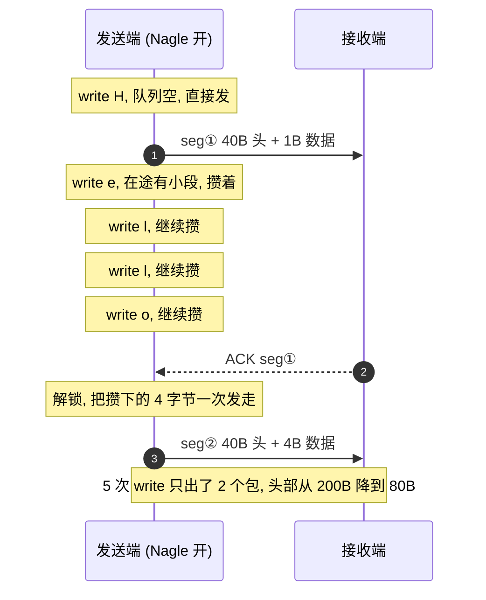
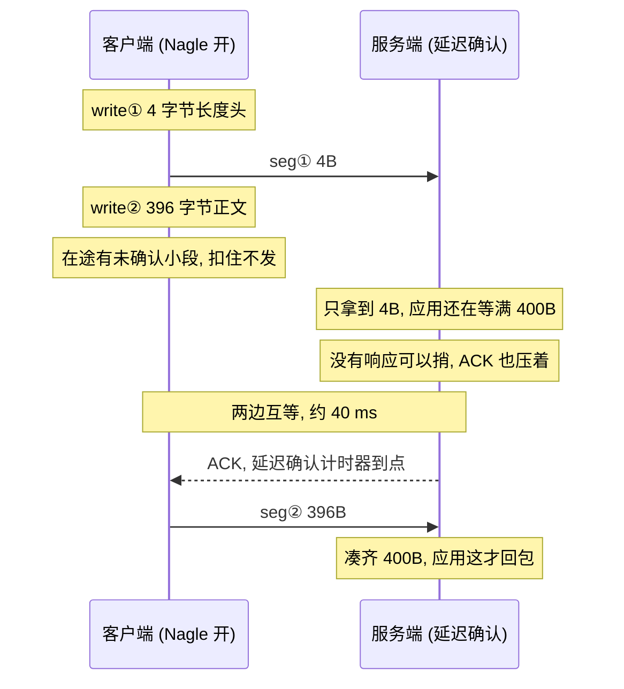
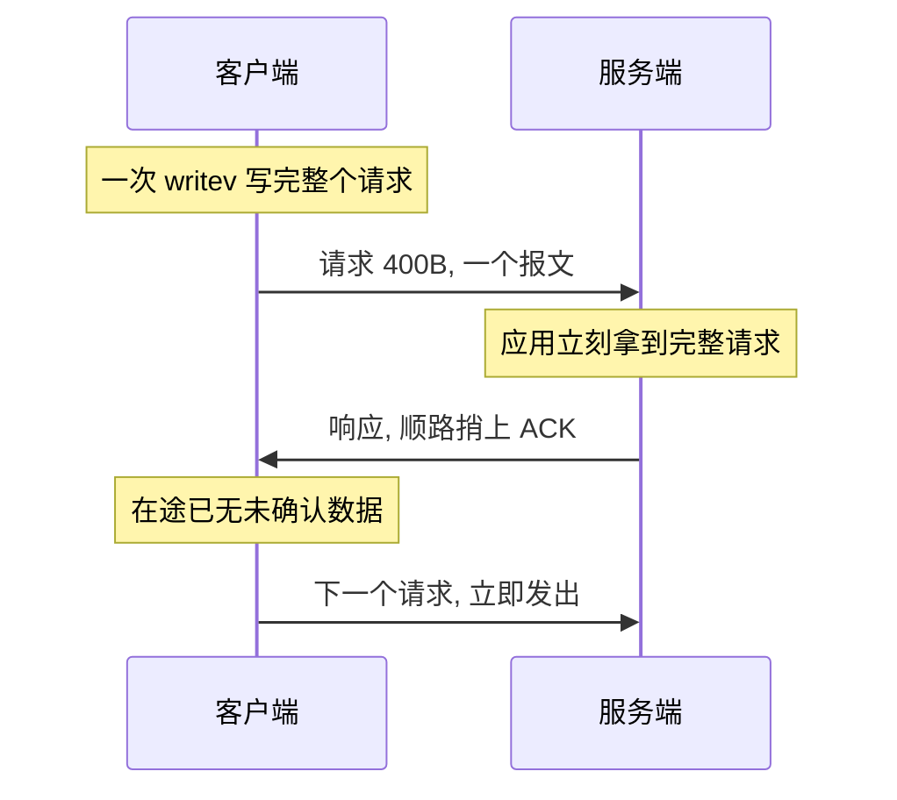

---
tags:
  - Linux
  - 套接字
阅读次数: 0
---

# 10.3 Nagle 算法

## 1. 它在拦什么

Nagle 算法（RFC 896，John Nagle，1984）只做一件事：**应用交下来的数据不满一个 MSS 时，决定这一段现在就发，还是先压在发送队列里**。

它诞生的场景是 Telnet。每敲一个键就是一个 41 字节的包：20 字节 IP 头 + 20 字节 TCP 头 + 1 字节数据。当年的广域网被这种包喂满了头部，真正的载荷只占 2.4%。

![[图片/SVG/3_10_10_3_1.svg|1390]]

以太网上 MSS 的典型值是 1460 字节（1500 的 MTU 减去 20 字节 IP 头和 20 字节 TCP 头）。Linux 默认开着 TCP 时间戳选项，TCP 头会变成 32 字节，实际能装的载荷是 1448，`ss -i` 里的 `mss` 字段显示的就是这个数。

> [!important] Nagle 只管发送端，只管「什么时候发」
> 它不改变字节流的内容，也不改变接收端 `read()` 一次能读到多少。**关掉 Nagle 不等于解决粘包**，粘包本来就不是发送端能控制的事，见 [[8.9 TCP的粘包和拆包]]。

---

## 2. 判定规则

每次 `write()` 把数据放进发送队列之后，内核按这个顺序判断：

```
若 这一段满一个 MSS:
    立即发
否则若 在途没有未确认的小段:
    立即发
否则:
    压在队列里，等 ACK 回来，或等后续数据凑满一个 MSS
```

关键在于**它没有定时器**。压在队列里的数据不会「等 40 毫秒然后发出去」，它等的是一个 ACK。这条区别是后面所有排障的前提：延迟不是 Nagle 定的，是对端回 ACK 的时机定的。

### 2.1 内核用的是 Minshall 变体

RFC 896 的原版规则是「在途有**任何**未确认数据就攒着」。Linux 收紧了一步：只有**在途还有未确认的小段**时才扣住新的小段，这是 Minshall 变体，对应 `net/ipv4/tcp_output.c` 里的 `tcp_nagle_check()` 和 `tcp_minshall_check()`。

差别落到实际行为上：按原版，一个满段刚发出去还没被确认，后面跟一个小段也得排队；按 Linux 的实现，满段不算「小段」，后面那个小段照发不误。所以「大块写 + 一个小尾巴」这种模式在 Linux 上不会被卡住，在别的实现上未必。

### 2.2 攒包的效果

逐字节写 `Hello` 时，Nagle 把 5 次 write 收成 2 个包：



不开 Nagle 是 5 个包、200 字节头部；开着是 2 个包、80 字节头部。SSH 这类逐字符交互的连接，正是 Nagle 当年要救的场景。

---

## 3. Nagle 撞上延迟确认

这是 Nagle 唯一真正会出事的地方，也是网络排障里最经典的一个 40 毫秒毛刺。

![[图片/SVG/3_10_10_3_2.svg|1390]]

触发它需要三个条件同时成立：

1. 发送端**连续写两次**，第一次是个小段（典型是「先写长度头，再写正文」）；
2. 接收端拿到第一段之后**产生不了响应**，因为消息还不完整；
3. 接收端的**延迟确认**开着，没有数据可以捎带 ACK，于是压着不回。



两边都没有违反协议：发送端在等 ACK，接收端在等数据。打破僵局的只能是接收端的延迟确认计时器。

### 3.1 那 40 毫秒是谁的

| 数字 | 出处 | 含义 |
|:---|:---|:---|
| **40 ms** | Linux `TCP_DELACK_MIN`（HZ/25） | 延迟确认的下限，也是最常见的那个停顿值 |
| **200 ms** | Linux `TCP_DELACK_MAX`（HZ/5） | 上限；很多 BSD 系统固定就是 200 ms |
| **500 ms** | RFC 1122 | 协议规定的延迟确认上限，实现不得超过 |
| **每 2 个满段** | RFC 1122 | 收到两个满段必须回一次 ACK |

最后一行解释了为什么大流量下看不到这个问题：满段成对到达，ACK 一直在回，Nagle 从来没被真正卡住过。它只咬**小段**。

> [!warning] 40 毫秒不是 Nagle 的参数
> 这是最常见的一处误解。Nagle 没有任何定时器，40 毫秒来自**接收端**的延迟确认下限。所以在发送端反复调 Nagle 相关的东西是找错了地方，同一份代码换到延迟确认是 200 毫秒的系统上，停顿会变成 200 毫秒。

### 3.2 为什么本机测不出来

Linux 在连接刚建立之后会进入 quickack 模式，前若干个包（上限 16 个，`TCP_MAX_QUICKACKS`）立即确认，不走延迟确认。加上环回接口 RTT 接近 0、应用响应快，短测试跑完一切正常，压到线上跑久了才开始出现 40 毫秒的毛刺。

**别用「我本机跑过没问题」来排除这个原因。**

### 3.3 什么情况下不会卡

一次写完整个请求就不会。在途始终只有一个小段，响应回来时 ACK 顺路捎上，下一次写时队列已经干净：



根源在 **write-write-read 这个写法**。Nagle 只是让它的代价暴露出来。

---

## 4. 怎么修

### 4.1 合并成一次写（首选）

把长度头和正文交给一次 `writev()`，内核看到的是一段完整数据，接收端一次就能拿到完整消息：

```cpp
#include <netinet/in.h>
#include <sys/uio.h>
#include <cstdint>

// 长度前缀 + 正文，一次系统调用交给内核，只产生一个报文
ssize_t sendFrame(int fd, const void* body, std::uint32_t len) {
    std::uint32_t netLen = ::htonl(len);        // 必须是具名变量：writev 返回前内核要读它
    iovec iov[2];
    iov[0].iov_base = &netLen;
    iov[0].iov_len  = sizeof(netLen);
    iov[1].iov_base = const_cast<void*>(body);  // iovec 没有 const 版本，只能转一下
    iov[1].iov_len  = len;
    return ::writev(fd, iov, 2);                // 返回值可能小于总长，生产代码要处理短写
}
```

三处要留意：

- **`netLen` 必须是活到 `writev()` 返回的具名变量。** `iov_base` 存的只是指针，内核到 `writev()` 里才去读那块内存。`&::htonl(len)` 这种写法编译就过不去；`body` 那一路同理，调用方要保证缓冲区在这期间不被释放。
- **`const_cast` 是接口逼的。** `iovec::iov_base` 是 `void*`，同一个结构体既用于 `readv` 也用于 `writev`，所以没有 const 版本。这里只读不写，转换是安全的。
- **返回值要检查。** `writev()` 和 `write()` 一样可能短写，非阻塞套接字上尤其常见。真实代码要把没发完的部分留在应用层缓冲区里，等可写事件再续，见 [[13.6 Reactor模式与EventLoop]]。

`writev` 的完整用法和零拷贝的其他手段见 [[8.14 高性能发送与线上排障#6. writev 和 readv|writev 和 readv]]。

### 4.2 发送端 TCP_NODELAY

改不动写法时，才轮到关 Nagle。`TCP_NODELAY` 让小段跳过判定直接下推：

```cpp
#include <netinet/tcp.h>
#include <sys/socket.h>
#include <cstdio>

int fd = ::socket(AF_INET, SOCK_STREAM, 0);

int on = 1;                                    // 必须是 int，不能是 bool 或 char
if (::setsockopt(fd, IPPROTO_TCP, TCP_NODELAY, &on, sizeof(on)) < 0) {
    std::perror("setsockopt TCP_NODELAY");
    return -1;
}

// 确认设置成功，用 getsockopt 读回来，不是再调一次 setsockopt
int val = 0;
socklen_t len = sizeof(val);
if (::getsockopt(fd, IPPROTO_TCP, TCP_NODELAY, &val, &len) == 0) {
    std::printf("TCP_NODELAY = %d\n", val);    // 1 表示 Nagle 已关闭
}
```

几个容易搞错的点：

- **级别是 `IPPROTO_TCP`，不是 `SOL_SOCKET`。** `SO_REUSEADDR` 那类选项才在 `SOL_SOCKET` 下，级别写错 `setsockopt` 直接返回 `ENOPROTOOPT`。
- **服务端要在 `accept()` 返回的那个 fd 上设，不是监听 fd。** 监听 fd 上的部分选项会被新连接继承，但把这件事交给继承不如显式设，muduo 的 `TcpConnection` 构造时就直接对连接 fd 设了 `TCP_NODELAY`。
- **在 Linux 上，设置的那一刻会顺手把积压的数据推出去**（内核走 `tcp_push_pending_frames`），所以它也能当成「立刻冲刷一次」用。
- **它管不到对端。** 接收端的延迟确认照样存在，只是发送端不再需要那个 ACK 了。

### 4.3 接收端 TCP_QUICKACK

最后一条路是从接收端拆掉延迟确认：

```cpp
int on = 1;
::setsockopt(fd, IPPROTO_TCP, TCP_QUICKACK, &on, sizeof(on));
```

> [!danger] 这个选项不粘
> `TCP_QUICKACK` 不是一个持久开关。man page 写得很清楚：它只切换一次模式，内核后续会根据延迟确认超时、数据流特征等因素自己切回去。要保持住就得**每次 `recv()` 之后重新设一遍**，代码丑而且容易漏。
>
> 它还只对本端有效，改不了对端。真实场景里对端往往不归你管，所以这条通常是排障时用来验证猜想，不是最终方案。

---

## 5. 反方向的开关：TCP_CORK 与 MSG_MORE

![[图片/SVG/3_10_10_3_3.svg|900]]

`TCP_CORK` 的方向和 `TCP_NODELAY` 相反：主动堵住出口，不满 MSS 的一律扣着，直到显式解除或者攒够。典型用法是「响应头 + 大文件」，配 `sendfile()` 用，nginx 的 `tcp_nopush` 在 Linux 上就是它。

它有个坑：**忘了解除就白等 200 毫秒**（内核的封顶时间）。用 RAII 把解除绑到作用域上，比手写配对可靠：

```cpp
#include <netinet/tcp.h>
#include <sys/sendfile.h>
#include <sys/socket.h>
#include <unistd.h>
#include <string>

// 进作用域堵住，出作用域放开，异常路径上也不会漏
class CorkGuard {
public:
    explicit CorkGuard(int fd) : fd_(fd) {
        int on = 1;
        ::setsockopt(fd_, IPPROTO_TCP, TCP_CORK, &on, sizeof(on));
    }
    ~CorkGuard() {
        int off = 0;
        ::setsockopt(fd_, IPPROTO_TCP, TCP_CORK, &off, sizeof(off));  // 解除时把半段冲出去
    }

    CorkGuard(const CorkGuard&)            = delete;   // 复制会导致解除两次
    CorkGuard& operator=(const CorkGuard&) = delete;

private:
    int fd_;
};

void sendResponse(int fd, const std::string& header, int fileFd, off_t fileSize) {
    CorkGuard cork(fd);                                // 从这里开始攒
    ::write(fd, header.data(), header.size());
    ::sendfile(fd, fileFd, nullptr, fileSize);
}                                                      // 析构解除 CORK，最后那个半段立刻走
```

复制被删掉是必须的：`CorkGuard` 管的是「解除」这个动作，允许复制就会解除两次，第二次作用在一个可能已经关闭的 fd 上。这和 [[13.8 连接对象生命周期与RAII|连接对象的 RAII]] 是同一套思路。

Linux 2.5.71 之后 `TCP_CORK` 和 `TCP_NODELAY` 可以同时设，`TCP_CORK` 生效期间优先级更高。单次调用级别的等价物是 `send()` 的 `MSG_MORE` 标志，语义是「这次先别发，后面还有」，不需要配对解除，作用只覆盖当次调用。

> [!note] CORK 不是「更强的 Nagle」
> 两者的判据不同。Nagle 会因为「在途没有未确认的小段」而放行一个小段，`TCP_CORK` 不看在途状态，只要不满 MSS 就扣着。所以 `TCP_CORK` 会引入 Nagle 引入不了的延迟，用它必须自己负责及时解除。

---

## 6. 观察

先确认停顿真的存在，再确认它落在哪一端：

```bash
# 抓包看包间隔，Nagle 卡住时会看到一个 ~0.040 的空档
tcpdump -i any -nn -ttt 'tcp port 9527'

# 看连接的确认超时和当前 mss
ss -ti '( sport = :9527 or dport = :9527 )'
#  ato:40ms  表示这条连接的延迟确认超时
#  mss:1448  开了时间戳选项之后的实际载荷上限

# 看应用是不是在 read 上白等了 40ms
strace -T -tt -e trace=write,writev,read ./client

# 延迟确认的全局计数，毛刺频繁时这个数涨得快
nstat -az TcpExtDelayedACKs TcpExtDelayedACKLost
```

选项的当前值没有对应的命令行工具，只能在进程里用 `getsockopt()` 读回来，写法见上面 `TCP_NODELAY` 那段。

排查顺序：

1. `strace` 确认慢的是哪次系统调用。如果是 `read()` 等了 40 毫秒，才继续往下看。
2. `tcpdump` 确认 40 毫秒的空档出现在**第二个小段发出之前**，而不是别处。
3. 数一下应用对这一个请求调了几次 `write()`。两次以上就是 write-write-read，回头改写法。
4. 到这一步还没定位，再去看 `TCP_NODELAY` 有没有设、设在哪个 fd 上。

顺序反过来，通常会在选项上折腾很久却没碰到真正的原因。

> [!tip] 交互动画
> Nagle 与 TIME_WAIT 的可视化（小包合并 · Nagle × Delayed-ACK 互等 · `TCP_NODELAY` 决策表）：
> [▶ 在浏览器中打开动画](<../../图片/HTML/3.Linux/10. 套接字/10.2-10.3 TIME_WAIT & Nagle (EN).html>)　·　更多见 [[网络编程·动画合集]]

---

## 7. 该不该关

| 场景 | 建议 | 原因 |
|:---|:---|:---|
| **SSH / Telnet** | 关（`TCP_NODELAY`） | 每个按键都要立刻上路，攒包直接变成输入卡顿 |
| **在线游戏、实时控制** | 关 | 状态包本来就小，晚 40 毫秒就是掉帧 |
| **RPC / 数据库客户端** | 关 | 请求响应短且频繁，最容易踩 write-write-read |
| **存储的 NVMe-oF over TCP** | 关 | 命令包小，等不起攒批，见 [[5.20 TCP Transport 数据路径]] |
| **HTTP 服务端** | 关 | nginx 的 `tcp_nodelay` 默认就是 on |
| **响应头 + 大文件** | 用 `TCP_CORK` | 让头和文件首块并成一个报文，发完解除 |
| **纯批量传输、日志上报** | 留着 | 数据本来就成大块，Nagle 几乎不生效，留着是免费的保险 |

**长连接的交互式服务，默认就该关掉 Nagle。** 逐字节写这种模式今天已经很少见，而 write-write-read 却到处都是；留着 Nagle 换来的头部节省，抵不过一次 40 毫秒的毛刺。真正靠攒包省流量的场景，应该在应用层显式攒批，而不是指望传输层替你判断。

---

## 8. 与其他机制的关系

**它和流控制、拥塞控制是三道独立的闸。** 滑动窗口管「对方还收不收得下」，拥塞窗口管「网络还塞不塞得进」，Nagle 管「这么点数据值不值得现在占一个包」。三道都放行才会真的发出去，见 [[8.8 流控制#2.5 糊涂窗口综合症|糊涂窗口综合症]]。

**和糊涂窗口综合症是一个问题的两端。** 接收端那侧的对策是不通告小窗口，发送端这侧的对策就是 Nagle。

**和粘包无关。** 关掉 Nagle 之后每次 `write()` 确实更可能对应一个报文，但接收端什么时候来读、一次读走多少，依然不受发送方控制。消息边界只能靠应用层协议定，见 [[8.9 TCP的粘包和拆包]]。

---

## 9. 常见误区

| 说法 | 实际 |
|:---|:---|
| Nagle 会等 40 毫秒再发 | Nagle 没有定时器，40 毫秒是接收端延迟确认的下限 |
| 只要有未确认数据，小段就要等 | Linux 只看在途的**小段**，满段不挡路（Minshall 变体） |
| 大块写也会被 Nagle 拖慢 | 满 MSS 的段直接发，从判定的第一条就出去了 |
| 关掉 Nagle 就不粘包了 | 粘包由接收端何时读、读多少决定，发送方管不了 |
| `TCP_NODELAY` 能治好 40 毫秒毛刺 | 能治标；根因是 write-write-read，改写法才是根治 |
| `TCP_NODELAY` 设在监听 fd 上就够了 | 应该设在 `accept()` 返回的连接 fd 上 |
| `TCP_QUICKACK` 设一次就一直有效 | 不粘，内核会自己切回延迟确认，每次读后要重设 |
| `TCP_CORK` 和 `TCP_NODELAY` 不能共存 | Linux 2.5.71 起可以同设，`TCP_CORK` 期间优先 |
| 本机测过没问题就说明没踩坑 | 环回 RTT 近 0，且连接初期有 quickack，测不出来 |
| Nagle 是过时的东西，应该全局关掉 | 内核里它仍是默认；该关的是连接级别，不是系统级别 |

---

## 10. 自测问题

1. Nagle 算法里，那个被扣住的小段到底在等什么？
2. 为什么「先 write 长度头再 write 正文」会卡 40 毫秒，而一次 `writev` 写完就不会？
3. 发送端设了 `TCP_NODELAY`，接收端的延迟确认还在，会不会还有 40 毫秒的停顿？
4. 大流量的批量传输为什么几乎看不到 Nagle 造成的延迟？

> [!question]- 参考答案
> 1. 等一个 ACK，不等时间。Nagle 本身没有定时器，压在发送队列里的小段要么等对端的 ACK 把「在途有未确认小段」这个条件解除，要么等后续数据把它凑满一个 MSS。停顿多长完全取决于对端什么时候回 ACK。
> 2. 写两次时，第一段（长度头）先发出去，第二段（正文）是小段且在途有未确认小段，被 Nagle 扣住；接收端只拿到长度头，消息不完整，应用产生不了响应，没有数据可以捎带 ACK，于是延迟确认压着不回。两边互等到延迟确认计时器到点。一次 `writev` 只产生一个报文，接收端立刻拿到完整请求，应用马上回包，ACK 顺路捎回，任何一步都没有等待。
> 3. 不会再有这个停顿。Nagle 关掉之后，发送端不再需要那个 ACK 才能发第二段，两段紧接着上路，接收端一次凑齐完整请求就回包了。延迟确认还在，但没人在等它。代价是包数变多，每个包多 40 字节以上的头部。
> 4. 因为 RFC 1122 要求接收端每收到两个满段就必须回一次 ACK，大流量下满段成对到达，ACK 一直在回，Nagle 的「在途有未确认小段」这个条件几乎不成立。而且满段本身在判定的第一条就被放行了。Nagle 只咬小段。

---

## 11. 关键要点

1. **Nagle 只决定「不满 MSS 的段现在发还是攒着」**，判定顺序是：满 MSS 就发，在途没有小段就发，否则压队列。
2. **它没有定时器**，压着的数据等的是 ACK。这条是所有排障的前提。
3. **Linux 用的是 Minshall 变体**（`tcp_minshall_check()`），只有在途的**小段**才挡路，满段不算。
4. **40 毫秒来自接收端的延迟确认下限**（`TCP_DELACK_MIN`），不是 Nagle 的参数；换个系统可能是 200 毫秒。
5. **触发条件是 write-write-read**：连续两次小写 + 接收端产生不了响应 + 延迟确认开着，三个条件缺一不可。
6. **首选修法是合并成一次 `writev()`**，根治且两个选项都不用动；`TCP_NODELAY` 是次选，`TCP_QUICKACK` 不粘，只适合排障时验证。
7. **`TCP_CORK` 方向相反**，主动扣住不满 MSS 的段，封顶 200 毫秒，配 `sendfile()` 用，务必用 RAII 保证解除。
8. **交互式长连接默认关掉 Nagle**，批量传输留着；关的是连接级别，不是系统级别。

---

## 12. 相关笔记

- [[10.1 套接字选项]] - `setsockopt`/`getsockopt` 的用法与其他选项
- [[10.2 TIME_WAIT状态]] - 同一章的另一个默认行为陷阱
- [[8.14 高性能发送与线上排障]] - `writev`、`sendfile`、`TCP_CORK` 与三层排障
- [[8.9 TCP的粘包和拆包]] - 为什么关掉 Nagle 也解决不了消息边界
- [[8.8 流控制]] - 滑动窗口、糊涂窗口综合症与 Nagle 的分工
- [[8.7 IO缓冲]] - 发送缓冲区、攒包与延迟的取舍
