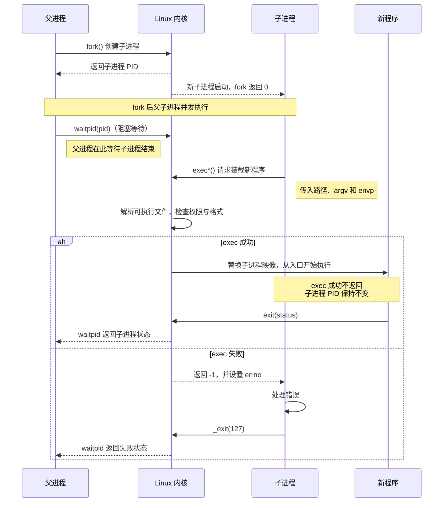
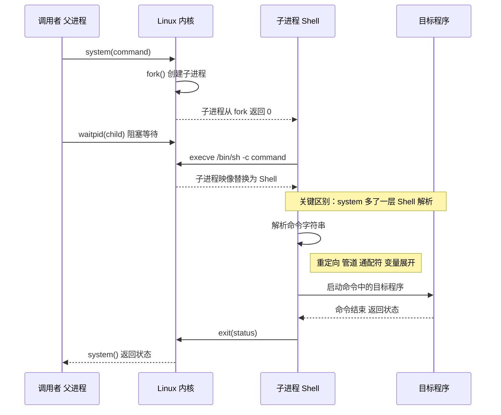

---
tags:
  - Linux
  - 进程
阅读次数: 0
---

# 11.2 进程创建与程序替换

> [!tip] 交互动画
> `l/v` `p` `e` 三个开关如何拼出六个函数名 · `exec` 那一刻什么被换掉、什么原样留下 · `exec` 只有失败才返回：
> [▶ 在浏览器中打开动画](<../../图片/HTML/3.Linux/11. 进程/11.2-11.6 exec·退出·status·进程组动画.html>)　·　更多见 [[网络编程·动画合集]]
> 单个场景直达：[exec 家族](<../../图片/HTML/3.Linux/11. 进程/11.2-11.6 exec·退出·status·进程组动画.html#scene=exec>) · [退出出口](<../../图片/HTML/3.Linux/11. 进程/11.2-11.6 exec·退出·status·进程组动画.html#scene=exit>) · [stdio 缓冲区](<../../图片/HTML/3.Linux/11. 进程/11.2-11.6 exec·退出·status·进程组动画.html#scene=buffer>)

## 1. 简介

Linux 提供了一系列用于进程控制的系统调用，主要包括创建进程（`fork`）和执行新程序（`exec` 系列）。这些函数是 Unix/Linux 进程管理的核心。

---

## 2. fork() - 创建子进程

### 2.1 函数原型

```c
#include <unistd.h>

pid_t fork(void);
```

### 2.2 功能

`fork()` 函数用于创建一个与当前进程几乎完全相同的子进程。调用一次，返回两次：
- 在**父进程**中返回子进程的 PID
- 在**子进程**中返回 0
- 出错时返回 -1

### 2.3 返回值说明

| 返回值 | 含义 |
|--------|------|
| `> 0` | 父进程中返回，值为子进程的 PID |
| `= 0` | 子进程中返回 |
| `< 0` | 创建失败，返回 -1 |

### 2.4 fork() 的工作原理

当调用 `fork()` 时，操作系统会：

1. **复制[[1.3 进程的虚拟地址空间|虚拟地址空间]]**：子进程获得父进程地址空间的副本（采用写时复制 COW 技术优化）
2. **复制文件描述符**：子进程继承父进程打开的所有文件描述符
3. **复制[[2.2 环境变量|环境变量]]**：子进程继承父进程的环境变量
4. **分配新的 PID**：子进程获得一个唯一的进程 ID

### 2.5 写时复制 (Copy-On-Write, COW)

> **优化机制**：`fork()` 并不会立即复制父进程的所有内存页，而是让父子进程共享同一份物理内存。只有当某一方试图修改内存时，才会真正复制那一页内存。这大大提高了 `fork()` 的效率。

![[图片/SVG/3_11_11_2_1.svg|1387]]

图 A 三帧的关键是第 ① 帧：`fork()` 返回时内核只复制了页表，把两边原本可写的匿名页都标成只读，物理页一份没动。开销由此变成「页表有多大」而不是「地址空间里装了多少数据」。

图 B 那张表里中间一行最容易踩：fd 表本身是副本，但 fd 背后的 open file description 是**共享**的。父子各自 `read()` 同一个 fd，读到的字节是接续的，不是各自从头读；一方 `lseek` 另一方也跟着动。这跟 [[4.3 文件锁|文件锁]]那一节讲的是同一个内核对象。

最后一行还有个隐患：多线程程序里 `fork()` 出来只剩调用它的那个线程，别的线程持有的互斥量还锁着，却永远没人来解。这是 `fork` 不能随便用在多线程程序里的根本原因。

### 2.6 「返回两次」说的是什么

`fork()` 之后的公共代码在父子两条路径上各跑一次，所以下面例子的最后一行 `printf` 会打印两遍。想只让一方执行，要么写进分支里，要么在分支末尾就 `exit`。父子谁先被调度没有保证，输出顺序每次可能不同；返回值是唯一的分流依据，`getpid()` 在两边都返回自己的 pid，看不出谁是父谁是子。

### 2.7 代码示例

```c
#include <stdio.h>
#include <stdlib.h>
#include <unistd.h>
#include <sys/types.h>

int main() {
    pid_t pid;

    printf("Before fork, my PID is %d.\n", getpid());

    pid = fork();

    if (pid < 0) {
        // fork 失败
        perror("fork failed");
        exit(1);
    } else if (pid == 0) {
        // 这是子进程
        printf("I am the child process. My PID is %d, my parent's PID is %d.\n",
               getpid(), getppid());
        printf("Child process is sleeping for 3 seconds...\n");
        sleep(3);
        printf("Child process finished.\n");
    } else {
        // 这是父进程
        printf("I am the parent process. My PID is %d, my child's PID is %d.\n",
               getpid(), pid);
        printf("Parent process is waiting for the child to finish...\n");
    }

    printf("-- Parent process detected child's termination. Exiting now --\n");

    return 0;
}
```

### 2.8 运行结果示例

```
Before fork, my PID is 12345.
I am the parent process. My PID is 12345, my child's PID is 12346.
Parent process is waiting for the child to finish...
I am the child process. My PID is 12346, my parent's PID is 12345.
Child process is sleeping for 3 seconds...
Child process finished.
-- Parent process detected child's termination. Exiting now --
```

---

## 3. vfork() - 创建子进程（共享地址空间）

### 3.1 函数原型

```c
#include <unistd.h>

pid_t vfork(void);
```

### 3.2 与 fork() 的区别

| 特性 | `fork()` | `vfork()` |
|------|----------|-----------|
| 地址空间 | 复制父进程的地址空间（COW） | **共享**父进程的地址空间 |
| 执行顺序 | 父子进程执行顺序不确定 | **保证子进程先执行**，直到调用 `exec` 或 `_exit` |
| 使用场景 | 通用 | 子进程立即调用 `exec` 时使用 |

### 3.3 注意事项

- `vfork()` 的子进程**必须**调用 `exec` 系列函数或 `_exit()`，否则会导致未定义行为
- 现代 Linux 中，由于 `fork()` 已使用 COW 优化，`vfork()` 的性能优势已不明显
- `vfork()` 被认为是过时的，新代码应优先使用 `fork()`

### 3.4 为什么「必须」而不是「建议」

![[图片/SVG/3_11_11_2_3.svg|1307]]

上表里「共享父进程的地址空间」这句话轻描淡写，实际含义是父子共用同一个 `mm_struct`，**包括同一个栈**（图 A）。把子进程分支里的 `_exit(-1)` 写成 `return -1`，后果就是图 B 那三步。

图 C 的分界线其实很简单：**允许的两条都是「不再回到用户态代码」**，`exec` 换掉整个地址空间，`_exit` 直接进内核结束；禁止的三条都是「还要继续用父子共用的那份用户态状态」。除此之外还有一条没进表：不能修改父进程之后还要读的变量，接收 `vfork()` 返回值的那个除外。

`vfork()` 今天仍有意义的场景很窄：进程占了几十 GB 内存、页表本身就有几百 MB，`fork` 出来只为立刻 `exec`。这时该用的也不是手写 `vfork`，而是 `posix_spawn()`。它内部走同一条路，但把 fd 重定向、信号复位这些事做成了参数，危险区间被压在库里几十条指令内。

---

## 4. exec 系列函数 - 执行新程序

`exec` 系列函数用于在当前进程中加载并执行一个新程序，**替换**当前进程的代码段、数据段、堆栈等。

### 4.1 执行时序：`fork + exec` 的常见用法



> [!tip] 看图要点
> 图中的 `fork()` 是最常见的搭配：`exec*()` **不会创建进程**。成功时子进程（或当前进程）从新程序入口继续，原调用点不再返回。

### 4.2 函数族概览

```c
#include <unistd.h>

int execl(const char *path, const char *arg, ... /* (char *)NULL */);
int execlp(const char *file, const char *arg, ... /* (char *)NULL */);
int execle(const char *path, const char *arg, ... /*, (char *)NULL, char *const envp[] */);
int execv(const char *path, char *const argv[]);
int execvp(const char *file, char *const argv[]);
int execvpe(const char *file, char *const argv[], char *const envp[]);
```

### 4.3 函数命名规则

| 后缀 | 含义 |
| --- | --- |
| `l` (list) | 参数以**列表**形式传递，以 `NULL` 结尾 |
| `v` (vector) | 参数以**数组**形式传递 |
| `p` (path) | 在 `PATH` 环境变量中搜索可执行文件，见 [[2.2 环境变量]] |
| `e` (environment) | 可以自定义环境变量 |

这三个后缀是**正交**的，六个函数名就是这三个开关的组合，不需要单独记：

![[图片/SVG/3_11_11_2_2.svg|1307]]

图 A 最右一列那三个坑值得单独说一句。`l` 系列的 `NULL` 之所以要写成 `(char *)NULL`，是因为裸 `NULL` 在某些平台上展开成 `int` 的 `0`，压进可变参数栈时宽度和指针不一致，`execl` 找不到列表末尾就会一路往下读。

图 B 的重点是 `exec` 那一刻的分界。fd 会跨过 `exec` 存活这一条尤其要记住，不想让子程序拿到某个 fd，就在 `open` 时加 `O_CLOEXEC`。另外 `exec` 只有失败才返回，所以调用后面必须紧跟错误处理并 `exit`，否则子进程会带着父进程的代码继续往下跑。

### 4.4 各函数详解

#### 4.4.1 execl()

```c
int execl(const char *path, const char *arg, ... /* (char *)NULL */);
```
- **path**：可执行文件的完整路径
- **arg**：参数列表，第一个参数通常是程序名，最后必须是 `NULL`

```c
execl("/bin/ls", "ls", "-l", "-a", NULL);
```

#### 4.4.2 execlp()

```c
int execlp(const char *file, const char *arg, ... /* (char *)NULL */);
```
- **file**：可执行文件名（会在 `PATH` 中搜索）

```c
execlp("ls", "ls", "-l", NULL);  // 不需要完整路径
```

#### 4.4.3 execv()

```c
int execv(const char *path, char *const argv[]);
```
- **argv**：参数数组，最后一个元素必须是 `NULL`

```c
char *args[] = {"ls", "-l", "-a", NULL};
execv("/bin/ls", args);
```

#### 4.4.4 execvp()

```c
int execvp(const char *file, char *const argv[]);
```
- 结合了 `v`（数组参数）和 `p`（PATH 搜索）

```c
char *args[] = {"ls", "-l", NULL};
execvp("ls", args);
```

### 4.5 exec 的特点

1. **不返回**：成功时 `exec` 不会返回，因为原进程已被新程序完全替换
2. **返回 -1**：只有失败时才返回
3. **PID 不变**：新程序继承原进程的 PID
4. **继承文件描述符**：除非设置了 `FD_CLOEXEC` 标志

### 4.6 代码示例：fork + exec 模式

```c
#include <stdio.h>
#include <stdlib.h>
#include <unistd.h>
#include <sys/wait.h>

int main() {
    pid_t pid = fork();

    if (pid < 0) {
        perror("fork failed");
        exit(1);
    } else if (pid == 0) {
        // 子进程：执行 ls 命令
        printf("Child: executing ls command...\n");
        execlp("ls", "ls", "-l", NULL);

        // 如果 exec 成功，下面的代码不会执行
        perror("exec failed");
        exit(1);
    } else {
        // 父进程：等待子进程结束
        int status;
        waitpid(pid, &status, 0);
        printf("Parent: child process finished with status %d\n",
               WEXITSTATUS(status));
    }

    return 0;
}
```

---

## 5. system() - 执行 Shell 命令

### 5.1 函数原型

```c
#include <stdlib.h>

int system(const char *command);
```

### 5.2 功能

`system()` 函数会创建一个新的子进程来执行你指定的 Shell 命令。这个过程是阻塞的，也就是说，父进程会一直暂停，直到子进程执行完命令后，`system()` 函数才会返回。

### 5.3 作用

它是一个非常方便的函数，用于在 C/C++ 程序中直接调用外部程序或执行 Shell 脚本。它内部封装了 `fork`、`exec()` 和 [[11.4 等待与回收|wait()]] 等复杂操作，让你能轻松地执行命令。

### 5.4 执行时序：`system()` 的 Shell 层



> [!warning] 与 `fork + exec` 的区别
> `fork + exec` 中，子进程直接把 `argv` 交给目标程序；`system()` 中，子进程先执行 `sh -c command`，再由 Shell 解释字符串。这正是命令注入风险出现的位置。

### 5.5 返回值

| 情况 | 返回值 |
|------|--------|
| 成功执行命令 | 命令的退出状态 |
| 无法创建子进程 | -1 |
| `command` 为 `NULL` | 非零值（表示 Shell 可用） |

### 5.6 代码示例

```c
#include <stdio.h>
#include <stdlib.h>

int main() {
    int ret;

    printf("Executing 'ls -l' command:\n");
    ret = system("ls -l");

    if (ret == -1) {
        perror("system() failed");
    } else {
        printf("Command exited with status: %d\n", WEXITSTATUS(ret));
    }

    return 0;
}
```

### 5.7 安全注意事项

> **警告**：`system()` 会调用 Shell 来解析命令，如果命令字符串包含用户输入，可能存在**命令注入**风险。在安全敏感的程序中，应避免使用 `system()`，改用 `fork` + `exec` 组合。

回到这张时序图：`system("ls -l")` 展开就是同一条线，`fork` + `execl("/bin/sh", "sh", "-c", cmd)` + `waitpid`。风险全部来自多出来的那层 `sh -c`：命令字符串是交给 shell 解析的，`;`、`|`、`` ` `` 都是元字符。

```c
// 危险：filename 若为 "a.txt; rm -rf ~"，两条命令都会执行
char cmd[256];
snprintf(cmd, sizeof(cmd), "wc -l %s", filename);
system(cmd);

// 安全：参数逐个放进 argv 数组，没有 shell 参与解析
// 此时 filename 里的分号只是文件名里的一个普通字符
char *args[] = {"wc", "-l", filename, NULL};
execvp("wc", args);          // 需先 fork，见前面的 fork + exec 例子
```

区别不在于有没有过滤特殊字符，而在于**有没有一个会解释这些字符的进程**。`execvp` 直接把 `argv` 交给新程序，中间没有 shell，也就没有可注入的语法。需要管道或重定向时，用 `pipe()` 加 `dup2()` 自己接，而不是退回 `system()`。

---

## 6. 总结对比

| 函数 | 创建新进程 | 执行新程序 | 特点 |
|------|-----------|-----------|------|
| `fork()` | 是 | 否 | 复制当前进程，父子并行 |
| `vfork()` | 是 | 否 | 共享地址空间，子进程先执行 |
| `exec*()` | 否 | 是 | 替换当前进程映像 |
| `system()` | 是 | 是 | 封装了 fork+exec+wait |

### 6.1 典型使用模式

```
父进程
   │
   ├── fork() ──> 子进程
   │                │
   │                └── exec() ──> 新程序
   │
   └── wait() ──> 等待子进程结束
```

---

## 7. 关键要点

- **fork()** 是创建进程的核心函数，返回两次（父子进程各一次）。返回值是唯一的分流依据，`getpid()` 在两边都返回自己的 pid
- **写时复制 (COW)** 优化了 `fork()` 的性能：`fork` 那一刻只复制页表并把匿名页标成只读，真正的复制推迟到第一次写。开销跟页表大小相关，跟数据量关系不大
- **继承关系分三类**：内存和 fd 表是副本，fd 背后的 open file description 是共享的（**文件偏移共用**），挂起的信号和 POSIX 记录锁不继承
- **exec 系列**用于在当前进程中执行新程序，成功后不返回。六个名字是 `l/v`、`p`、`e` 三个正交开关的组合，真正的系统调用只有 `execve()`
- **exec 的分界线**：地址空间全换，pid 和已打开的 fd 保留。不想让 fd 泄漏给子程序就加 `O_CLOEXEC`
- **fork + exec** 是 Unix/Linux 创建新程序的标准模式
- **vfork()** 与父进程共用同一个栈，除了 `exec` 和 `_exit()` 之外什么都不能做；确实需要时用 `posix_spawn()` 而不是手写
- **system()** 多一层 `sh -c`，命令注入的入口就在这里。参数含用户输入时改用 `execvp` 把参数放进 `argv` 数组
