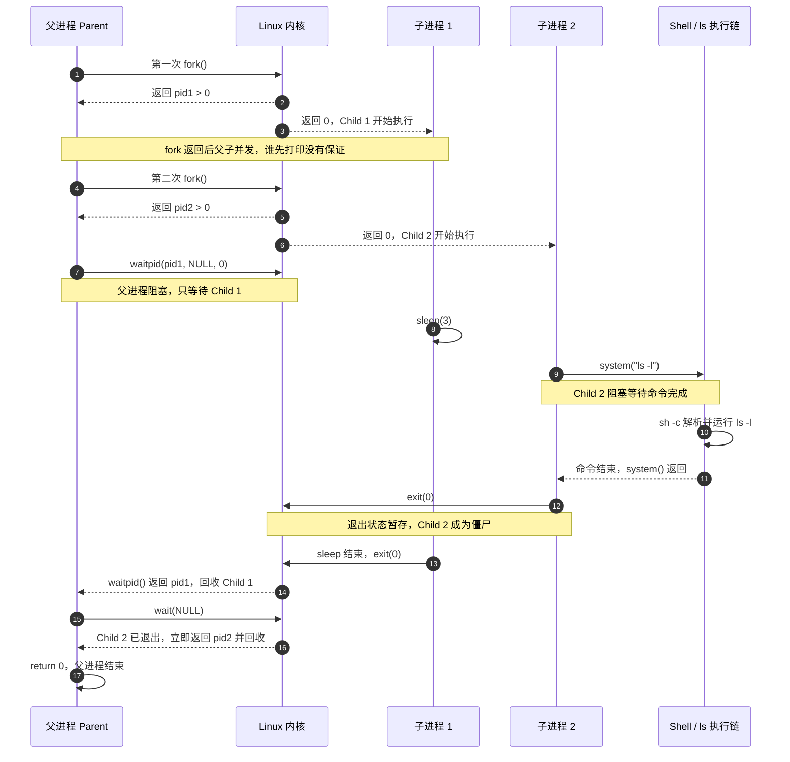

---
tags:
  - Linux
  - 进程
阅读次数: 0
---

# 11.4 等待与回收

> [!tip] 交互动画
> `status` 的 16 位摊开：低字节说「怎么没的」，高字节说「具体是多少」 · 三种编码与 `WIF*` 的判定顺序：
> [▶ 在浏览器中打开动画](<../../图片/HTML/3.Linux/11. 进程/11.2-11.6 exec·退出·status·进程组动画.html>)　·　更多见 [[网络编程·动画合集]]
> 单个场景直达：[status 位布局](<../../图片/HTML/3.Linux/11. 进程/11.2-11.6 exec·退出·status·进程组动画.html#scene=status>) · [退出出口](<../../图片/HTML/3.Linux/11. 进程/11.2-11.6 exec·退出·status·进程组动画.html#scene=exit>)

## 1. 简介

[[11.2 进程创建与程序替换#2. fork() - 创建子进程|fork()]] 之后父子两条路各跑各的，子进程先结束是常态。但子进程 `exit()` 并不等于它从系统里消失了：内核会把它的退出状态扣下来，一直留到父进程主动来取。取的动作就是 `wait()` 和 `waitpid()`。

不取会怎样，取到的又是什么，这两个问题构成了本节的全部内容。

---

## 2. 子进程死后还剩什么

![[图片/SVG/3_11_11_4_1.svg|1307]]

图 A 的七步里真正要记的是 ③ 和 ④ 之间那条界。子进程 `exit()` 的那一刻，地址空间、打开的文件描述符、占用的物理内存全都还给了系统，这些不需要任何人来收。留下来的只有 `task_struct` 里那几十个字节：退出状态、是被哪个信号打死的、用掉了多少 CPU 时间。父进程可能还要看，所以内核不敢扔。

**僵尸进程（Zombie）就是停在这段区间里的进程**。它没有代码在跑，没有内存可占，`ps` 里状态显示 `Z`、命令名后面挂一个 `<defunct>`。它唯一还占着的是一个 PID 号，以及内核里那一小块结构体。

### 2.1 僵尸和孤儿是两回事

图 B 三栏对应父进程的三种态度，结局差别很大：

- **父进程活着但从不 `wait`**（左栏）：僵尸一个个堆起来。这是唯一真正会出问题的情况。`/proc/sys/kernel/pid_max` 默认 32768，堆满之后 `fork()` 一律返回 `EAGAIN`，整台机器都起不了新进程。
- **父进程先退出**（中栏）：子进程当场被过继给 PID 1，`getppid()` 从此返回 1。这叫**孤儿进程**，它不是僵尸，也不会变成僵尸，因为 systemd 的主循环一直在 `wait`，谁死了它就收谁。
- **显式忽略 SIGCHLD**（右栏）：`signal(SIGCHLD, SIG_IGN)` 之后内核干脆不保留退出状态，子进程一死就地消失。省事，代价是退出码再也拿不到了：此时 `wait()` 会一直阻塞到所有子进程都结束，然后返回 -1 并置 `ECHILD`。

中栏有个例外值得记住：容器里的 PID 1 是你自己的应用进程，它通常并没有写回收循环。容器内进程被托孤给它，僵尸照样会堆积。这就是 `docker run --init` 和 tini 之类的 init 程序存在的理由。

### 2.2 为什么 kill -9 杀不掉僵尸

信号是发给活着的进程去执行的，僵尸没有任何代码可执行，收到 `SIGKILL` 也没人处理。清掉一个僵尸只有两条路：让它的父进程去 `wait`，或者杀掉它的父进程，让它转投 PID 1。

更多状态转换的细节见 [[11.5 僵尸进程]]。

---

## 3. system()：把这七步打包成一行

### 3.1 函数原型

```c
#include <stdlib.h>

int system(const char *command);
```

`system()` 内部依次做了 `fork()`、`execl("/bin/sh", "sh", "-c", command, NULL)`、`waitpid()` 三件事，也就是把上面那张图整个走了一遍。它是阻塞的：父进程停在 `waitpid` 那一步，直到 shell 把命令跑完。

它的返回值就是 `waitpid` 拿到的那个 `status`，所以要用第 5 节的宏来解析，不能直接当退出码用：

```c
int ret = system("ls -l");
if (ret == -1) {
    perror("system");                       // fork 失败，或 waitpid 出错
} else if (WIFEXITED(ret)) {
    printf("exit code: %d\n", WEXITSTATUS(ret));
}
```

`system()` 多出来的那层 `sh -c` 会解释 `;`、`|`、`` ` `` 这些元字符，命令字符串里拼进用户输入就有注入风险。这一部分连同 `fork` + `exec` 的替代写法在 [[11.2 进程创建与程序替换#5. system() - 执行 Shell 命令|11.2]] 里讲过，这里不重复。

---

## 4. wait() - 等待任意子进程

### 4.1 函数原型

```c
#include <sys/wait.h>

pid_t wait(int *status);
```

- **参数**：`status` 用来带回子进程的终止状态，不关心时传 `NULL`
- **返回值**：成功返回被收走的那个子进程的 PID，失败返回 -1

### 4.2 三种返回情形

调用之后会落到下面三种之一：

| 当时的状况 | `wait()` 的行为 |
|------|------|
| 已经有子进程处于僵尸状态 | 立刻返回，把它收走 |
| 子进程都还在跑 | 阻塞，直到其中一个结束 |
| 根本没有子进程 | 立刻返回 -1，`errno` 置 `ECHILD` |

第三种是循环回收的收尾条件。想一次收干净所有子进程，标准写法就是让它自己撞到 `ECHILD`：

```c
while (wait(NULL) > 0)
    ;                   // 一直收到没有子进程可收为止
```

还有一种返回 -1 的情况：阻塞期间被信号打断，`errno` 置 `EINTR`。如果父进程装了不带 `SA_RESTART` 的信号处理函数，这个分支必须自己重试，不能当成错误退出。

**`wait()` 不能指定等哪一个**，谁先死就先收谁。要挑人，得用 `waitpid()`。

---

## 5. waitpid() - 等待指定子进程

### 5.1 函数原型

```c
#include <sys/wait.h>

pid_t waitpid(pid_t pid, int *status, int options);
```

### 5.2 pid 参数

| pid 值 | 含义 | 一眼理解 |
| --- | --- | --- |
| `> 0` | 等待指定 PID 的子进程 | 指定一个进程 |
| `= 0` | 等待调用者所在 [[11.6 进程组与会话\|进程组]] 的任意子进程 | 自动使用自己的 PGID |
| `= -1` | 等待任意子进程，和 `wait()` 一样 | 不区分进程组 |
| `< -1` | 等待指定进程组（PGID = `-pid`）的任意子进程 | 手动给出 PGID，可与自己的相同 |

### 5.3 options 参数

按位或组合：

| 选项 | 含义 |
|------|------|
| `0` | 阻塞等待 |
| `WNOHANG` | 不阻塞，没有可收的就返回 0 |
| `WUNTRACED` | 子进程被停止（而非终止）时也返回 |
| `WCONTINUED` | 子进程被 `SIGCONT` 恢复时也返回 |

`WUNTRACED` 和 `WCONTINUED` 是给作业控制用的，普通程序几乎用不上。不加这两个选项，第 5 节里 `WIFSTOPPED` 和 `WIFCONTINUED` 就永远不会为真。

### 5.4 返回值

| 返回值 | 含义 |
|--------|------|
| `> 0` | 被收走的那个子进程的 PID |
| `= 0` | 只在带 `WNOHANG` 时出现：目标还活着 |
| `= -1` | 出错，看 `errno`：`ECHILD` 没有该子进程，`EINTR` 被信号打断 |

**返回 0 和返回 -1 要分开处理**。0 表示「还没到时候，等会儿再来」，-1 才是真的出了事。写轮询循环时把这两个混在一起判断，是常见的死循环来源。

### 5.5 和 wait() 的等价关系

```c
wait(&status);
// 完全等价于
waitpid(-1, &status, 0);
```

`wait()` 就是 `waitpid()` 参数写死的那个特例。

---

## 6. status：先问死法，再取值

![[图片/SVG/3_11_11_4_2.svg|1307]]

**`status` 不是退出码**，这是本节最容易踩的地方。想判断子进程是不是以 42 退出，写 `if (status == 42)` 永远为假，因为 `exit(42)` 之后 `status` 等于 `42 << 8`，也就是 10752。

图 A 的五行摆在一起，内核的编码规则就露出来了：**低字节说「怎么没的」，高字节说「具体是多少」**。正常退出时低字节全零，退出码放在高字节；被信号打死时反过来，信号号挤在低 7 位，第 7 位单独留给 core dump 标志；停止是个特例，低字节固定成 `0x7F` 当哨兵，信号号才挪到高字节去。

所以图 B 的顺序不能颠倒。`WIF*` 系列宏查的就是这些标志位，先问清楚属于哪一类，才知道该去高字节还是低字节取值。对着一个被 `SIGKILL` 打死的 `status` 调 `WEXITSTATUS`，语法完全合法，读回来是 0，看着像执行成功，实际上进程是被打死的。

### 6.1 正常退出

| 宏 | 功能 |
|----|------|
| `WIFEXITED(status)` | 子进程正常退出（`exit` 或 `main` 返回）时为真 |
| `WEXITSTATUS(status)` | 取高字节的退出码，范围 0 到 255 |

退出码只有 8 位，`exit(-1)` 传进去，父进程读回来是 255；`exit(256)` 读回来是 0。想传更大的值或负值，得另找通道，比如管道或共享内存。

### 6.2 信号终止

| 宏 | 功能 |
|----|------|
| `WIFSIGNALED(status)` | 子进程被信号终止时为真 |
| `WTERMSIG(status)` | 取终止它的信号编号 |
| `WCOREDUMP(status)` | 产生了 core dump 时为真 |

`WCOREDUMP` 不在 POSIX 里，是 glibc 的扩展，用之前先 `#ifdef WCOREDUMP` 判一下更稳妥。

### 6.3 停止与继续

| 宏 | 功能 |
|----|------|
| `WIFSTOPPED(status)` | 子进程当前处于停止状态时为真 |
| `WSTOPSIG(status)` | 取导致停止的信号编号 |
| `WIFCONTINUED(status)` | 子进程被 `SIGCONT` 恢复时为真 |

这三个要配合 `waitpid` 的 `WUNTRACED` / `WCONTINUED` 选项才有机会为真。

### 6.4 顺手记一句 shell 的换算

`echo $?` 看到 137，那是 bash 自己算的 `128 + 9`（被 `SIGKILL` 打死）。这是 shell 的展示约定，和 `status` 的位布局不是一回事，别把两套编码混起来推。

日常只记下面这套：不用手动拆 `status`。`waitpid()` 成功后，先用 `WIF*` 判断结束方式，再取对应的值。

```cpp
int status;
if (waitpid(pid, &status, 0) == -1) {
    perror("waitpid");
} else if (WIFEXITED(status)) {
    int code = WEXITSTATUS(status);  // 0 通常成功；其他值由子程序定义
} else if (WIFSIGNALED(status)) {
    int sig = WTERMSIG(status);      // 被哪个信号杀死
}
```

`WEXITSTATUS` 只在 `WIFEXITED` 为真时用；`WTERMSIG` 同理。

---

## 7. 三种回收姿势

![[图片/SVG/3_11_11_4_3.svg|1307]]

三行的差别全在中间那条带子。阻塞版父进程整段睡着，CPU 让给别人，代价是这期间它什么也干不了；轮询版醒着，但六次里有五次是白查；SIGCHLD 版全程在干正事，子进程什么时候死，内核什么时候来敲一下。

选哪一种只看一个问题：**父进程在等待期间还有没有别的活**。shell 前台跑一条命令，没有别的活，阻塞版最简单；并发服务器主循环要一直 `accept`，就只能挂 SIGCHLD。

### 7.1 SIGCHLD 不排队

图 B 是异步写法唯一的坑，也是处理函数必须写成循环的原因。SIGCHLD 属于标准信号，内核只用一个 pending 位记「有没有」，不记「有几个」。三个子进程在同一个调度间隙里退出，处理函数只会被调用一次。里面只写一句 `waitpid` 就只收走一个，另外两个原地变僵尸，而且再也不会有第二次 SIGCHLD 来提醒你。

```c
#include <errno.h>
#include <signal.h>
#include <sys/wait.h>

void sigchld_handler(int signo) {
    int saved = errno;                                  // 存 errno
    while (waitpid(-1, NULL, WNOHANG) > 0)
        ;                                               // 一次收干净
    errno = saved;                                      // 还回去
}

int main(void) {
    struct sigaction sa;
    sa.sa_handler = sigchld_handler;
    sigemptyset(&sa.sa_mask);
    sa.sa_flags = SA_RESTART;                           // 自动重启被打断的系统调用
    sigaction(SIGCHLD, &sa, NULL);

    // ... fork 子进程、跑主循环 ...
    return 0;
}
```

四个细节都不能省：

1. **`while` 循环**，收到 `waitpid` 返回 0 或 -1 为止，这是上面那个坑的解法
2. **必须带 `WNOHANG`**，处理函数里不能阻塞，否则主流程被卡死
3. **`pid` 传 -1**，因为你根本不知道是哪个子进程死了
4. **进出各存一次 `errno`**，`waitpid` 失败会改写它，主流程正在检查的那个 `errno` 会被污染

处理函数里也不要调 `printf`。它不是异步信号安全的函数，在信号处理上下文里调用是未定义行为。

---

## 8. 代码示例

### 8.1 基本用法

```c
#include <stdio.h>
#include <stdlib.h>
#include <unistd.h>
#include <sys/wait.h>

int main() {
    pid_t pid1, pid2;

    printf("Parent process (PID: %d) starts.\n", getpid());

    // 1. fork() 创建第一个子进程
    pid1 = fork();
    if (pid1 == 0) {
        // 这是子进程1
        printf("\tChild 1 (PID: %d) created. It will sleep for 3 seconds.\n", getpid());
        sleep(3);
        printf("\tChild 1 finished sleeping and is exiting.\n");
        exit(0);
    }

    // 2. fork() 创建第二个子进程
    pid2 = fork();
    if (pid2 == 0) {
        // 这是子进程2
        printf("\tChild 2 (PID: %d) created. It will run 'ls -l'.\n", getpid());
        // system() 会在内部等待 ls -l 命令执行完成
        system("ls -l");
        printf("\tChild 2 finished executing 'ls -l' and is exiting.\n");
        exit(0);
    }

    // --- 父进程 ---

    // 3. 父进程使用 waitpid() 等待指定的子进程1
    printf("Parent is waiting for child 1 (PID: %d) to finish.\n", pid1);
    waitpid(pid1, NULL, 0);
    printf("Parent successfully collected child 1's status.\n");

    // 4. 父进程使用 wait() 等待任意一个子进程
    printf("Parent is now waiting for any other child to finish.\n");
    wait(NULL);
    printf("Parent successfully collected another child's status.\n");

    printf("Parent process exits.\n");
    return 0;
}
```

#### 8.1.1 时序图：`waitpid` 指名等待与 `wait` 回收剩余子进程



> [!note] 图中的顺序
> 图按下面这次运行结果绘制：Child 2 先退出，Child 1 后退出。实际运行时，父进程和两个子进程的打印顺序由调度器决定；不变的是父进程的第一个 `waitpid()` **只回收 Child 1**。

运行结果：

```
Parent process (PID: 28511) starts.
    Child 1 (PID: 28533) created. It will sleep for 3 seconds.
Parent is waiting for child 1 (PID: 28533) to finish.
    Child 2 (PID: 28535) created. It will run 'ls -l'.
total 16
-rwxr-xr-x 1 root root 14312 Aug 30 15:53 LinuxConsole.out
    Child 2 finished executing 'ls -l' and is exiting.
    Child 1 finished sleeping and is exiting.
Parent successfully collected child 1's status.
Parent is now waiting for any other child to finish.
Parent successfully collected another child's status.
Parent process exits.
```

这段输出里有两处值得对着代码看：

第一，`waitpid(pid1, NULL, 0)` 指名要 Child 1，所以 Child 2 早就跑完 `ls -l` 退出了，父进程仍旧卡在那里等 Child 1 的 `sleep(3)` 走完。指名等待的代价就是这个：先死的那个只能先挂成僵尸。

第二，紧接着的 `wait(NULL)` 立刻返回，一点没等。因为 Child 2 已经是僵尸了，`wait` 不需要阻塞，直接把它收走。这对应第 3 节表格的第一行。

### 8.2 解析退出状态

```c
#include <stdio.h>
#include <stdlib.h>
#include <unistd.h>
#include <sys/wait.h>

int main() {
    pid_t pid = fork();

    if (pid == 0) {
        // 子进程
        printf("Child (PID: %d) running...\n", getpid());
        sleep(2);
        exit(42);  // 退出状态码 42
    }

    // 父进程
    int status;
    pid_t child_pid = wait(&status);

    printf("Child %d terminated.\n", child_pid);

    if (WIFEXITED(status)) {
        printf("Normal exit with status: %d\n", WEXITSTATUS(status));
    } else if (WIFSIGNALED(status)) {
        printf("Killed by signal: %d\n", WTERMSIG(status));
    }

    return 0;
}
```

#### 8.2.1 时序图：`status` 保存死法，宏负责分层解析

```mermaid
sequenceDiagram
    autonumber
    participant P as 父进程 Parent
    participant K as Linux 内核
    participant C as 子进程 Child

    P->>K: fork()
    K-->>P: 返回 pid > 0
    K-->>C: 返回 0
    P->>K: wait(&amp;status)
    Note over P,K: 父进程阻塞，等待任意子进程状态变化
    C->>C: sleep(2)

    alt 正常退出：当前代码
        C->>K: exit(42)
        Note over C,K: 内核编码 raw status = 42 × 256 = 10752
        K-->>P: wait() 返回 child_pid，并写入 status
        P->>P: WIFEXITED(status) == true
        P->>P: WEXITSTATUS(status) == 42
    else 信号终止：替换实验
        C->>K: raise(SIGSEGV)
        K-->>P: wait() 返回 child_pid，并写入 status
        P->>P: WIFSIGNALED(status) == true
        P->>P: WTERMSIG(status) == SIGSEGV
    end
```

把这段跑起来打一句 `printf("raw status = %d\n", status)`，会看到 10752 而不是 42，正好验证第 5 节那张位布局图。想看信号那一路，把 `exit(42)` 换成 `raise(SIGSEGV)`，`WIFSIGNALED` 分支就会走到，`WTERMSIG` 返回 11。

### 8.3 非阻塞轮询

```c
#include <stdio.h>
#include <stdlib.h>
#include <unistd.h>
#include <sys/wait.h>

int main() {
    pid_t pid = fork();

    if (pid == 0) {
        // 子进程
        printf("Child process running...\n");
        sleep(5);
        exit(0);
    }

    // 父进程：非阻塞轮询
    int status;
    pid_t result;

    do {
        result = waitpid(pid, &status, WNOHANG);
        if (result == 0) {
            printf("Child still running, doing other work...\n");
            sleep(1);
        }
    } while (result == 0);

    if (result > 0) {
        printf("Child %d finished.\n", result);
    }

    return 0;
}
```

#### 8.3.1 时序图：`WNOHANG` 轮询期间父进程不会阻塞

```mermaid
sequenceDiagram
    autonumber
    participant P as 父进程 Parent
    participant K as Linux 内核
    participant C as 子进程 Child

    P->>K: fork()
    K-->>P: 返回 pid > 0
    K-->>C: 返回 0
    C->>C: sleep(5)

    loop result == 0（示例约每秒一次）
        P->>K: waitpid(pid, &amp;status, WNOHANG)
        K-->>P: 返回 0，子进程仍在运行
        P->>P: 执行其他工作
        P->>P: sleep(1)
    end

    C->>K: exit(0)
    Note over C,K: 内核暂存退出状态
    P->>K: 下一次 waitpid(..., WNOHANG)
    K-->>P: 返回 pid > 0，并回收子进程
    P->>P: 打印 Child finished
```

> [!note] 轮询的时间边界
> 子进程可能在任意两次轮询之间退出；父进程不会立刻知道，最迟要到下一次 `waitpid()` 才能发现。因此轮询间隔同时决定了额外延迟和无效检查次数。

运行结果：

```
Child process running...
Child still running, doing other work...
Child still running, doing other work...
Child still running, doing other work...
Child still running, doing other work...
Child still running, doing other work...
Child 12346 finished.
```

这段的作用是把 `WNOHANG` 返回 0 演示清楚，别照抄进真实程序。循环条件写的是 `result == 0`，所以 `waitpid` 返回 -1 时能正常跳出；要是写成 `result != pid`，遇到 `EINTR` 就成了死循环。真要在等待期间干活，把回收挂到 SIGCHLD 上，而不是靠 `sleep(1)` 空转。

---

## 9. wait() 与 waitpid() 对比

| 特性 | `wait()` | `waitpid()` |
|------|----------|-------------|
| 等待目标 | 任意子进程，谁先死收谁 | 可指定 PID 或进程组 |
| 阻塞控制 | 始终阻塞 | 可用 `WNOHANG` 变成非阻塞 |
| 停止状态 | 看不到 | 加 `WUNTRACED` 能看到 |
| 返回 0 | 不会出现 | 带 `WNOHANG` 且目标还活着时出现 |
| 本质 | `waitpid(-1, &status, 0)` 的别名 | 完整版 |

日常写代码用哪一个，判断标准是要不要指名。收拾自己 `fork` 出来的一批 worker 用 `wait` 就够；要盯住某一个特定的子进程，或者不想阻塞，就用 `waitpid`。

---

## 10. 关键要点

- 子进程 `exit()` 时**内存和 fd 立刻还给了系统**，留下来的只是 `task_struct` 里的退出状态。僵尸占的是 PID 号，不是内存
- **`kill -9` 杀不掉僵尸**，它已经没有代码可执行了。清理办法是让父进程 `wait`，或者杀掉父进程让它转投 PID 1
- **孤儿不是僵尸**：父进程先退出，子进程被过继给 PID 1，systemd 会随死随收。但容器里的 PID 1 是你的应用，未必写了回收循环
- **`status` 不是退出码**：`exit(42)` 之后 `status` 是 10752。低字节说怎么没的，高字节说具体是多少，必须先用 `WIF*` 判类型再取值
- 退出码只有 8 位，`exit(-1)` 读回来是 255
- `wait()` 是 `waitpid(-1, &status, 0)` 的别名；`waitpid` 多出来的是指名、`WNOHANG`、以及看停止状态的能力
- **`waitpid` 返回 0 和 -1 要分开处理**：0 是「还没到时候」，-1 才是出错。没有子进程时 `errno` 是 `ECHILD`，被信号打断时是 `EINTR`
- **SIGCHLD 不排队**，多个子进程同时死只会触发一次处理函数。处理函数里必须 `while (waitpid(-1, NULL, WNOHANG) > 0)` 循环收干净，并且进出各存一次 `errno`
- `signal(SIGCHLD, SIG_IGN)` 能免掉回收，代价是退出状态一起丢，`wait()` 等到子进程全部结束后返回 `ECHILD`
- `system()` 的返回值是 `status` 而不是退出码，同样要用 `WEXITSTATUS` 解析
