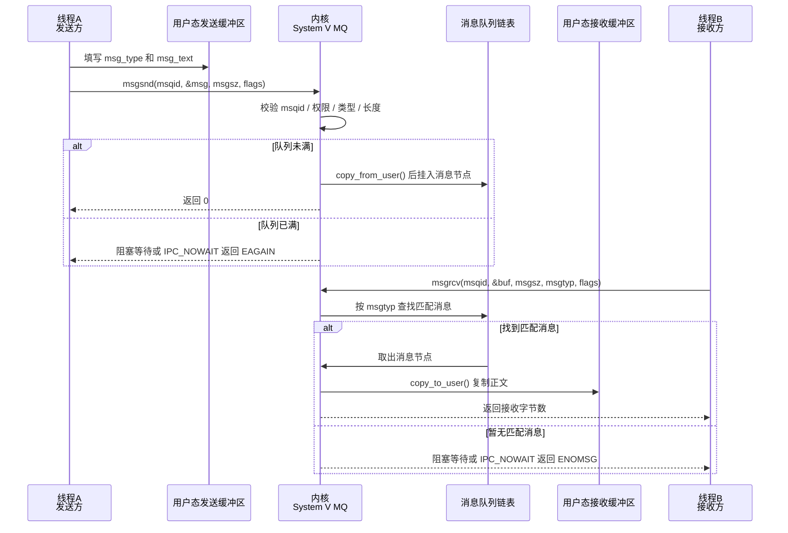

---
tags:
  - 平台/linux
  - 进程
  - 进程/IPC
阅读次数: 0
---

# 11.6 消息队列 (Message Queue)

> [!tip] 交互动画
> 本篇核心难点的过程可视化（`msgtyp` 0/正/负三种选择规则 · 一次 `msgrcv` 只取一个完整节点与 `E2BIG` · 满队列阻塞对照 `IPC_NOWAIT`/EAGAIN · 同一队列按类型双向通信）：
> [▶ 在浏览器中打开动画](<../11. 进程/11.6 消息队列动画.html>)　·　更多见 [[网络编程·动画合集]]
> 也可直达单个场景：[按类型接收](<../11. 进程/11.6 消息队列动画.html#scene=typed>) · [消息边界](<../11. 进程/11.6 消息队列动画.html#scene=boundary>) · [满队列与 NOWAIT](<../11. 进程/11.6 消息队列动画.html#scene=capacity>) · [双向通信](<../11. 进程/11.6 消息队列动画.html#scene=duplex>)

## 1. 什么是消息队列

**消息队列 (Message Queue)** 是一种[[11.2 进程间通信IPC|进程间通信]]机制，它在内核中维护一个**消息链表**，进程可以向队列中发送消息，也可以从队列中接收消息。

### 1.1 消息队列的特点

| 特点 | 说明 |
|------|------|
| **异步通信** | 发送方不需要等待接收方，发送后即可继续执行 |
| **消息类型** | 每条消息都有类型，接收方可以选择性地接收特定类型的消息 |
| **消息边界** | 与[[11.3 管道通讯\|管道]]不同，消息队列保留消息边界，每次读取一条完整消息 |
| **全双工** | 同一个队列可以双向通信（通过不同的消息类型） |
| **非亲缘进程** | 不相关的进程可以通过相同的 key 访问同一队列 |

### 1.2 消息队列 vs 管道 vs 共享内存

| 特性 | [[11.3 管道通讯\|管道]] | 消息队列 | [[11.4 共享内存\|共享内存]] |
|------|--------|----------|------------|
| **数据格式** | 字节流 | 带类型的消息 | 任意 |
| **通信方向** | 单向 | 双向 | 双向 |
| **速度** | 中等 | 较慢 | 最快 |
| **同步** | 自带 | 自带 | 需要[[11.5 信号量\|信号量]] |
| **进程关系** | 通常需要亲缘 | 任意 | 任意 |

---

## 2. 消息队列的工作原理

![[图片/3.Linux/11. 进程/3_11_6_1.svg|852]]

消息队列表面上像一个“可以按类型取消息的链表”，实际传递过程可以拆成两次复制和一次队列状态变化：

1. 发送线程先在自己的用户空间准备 `struct msg_buffer`，其中 `msg_type` 用来标记消息类型，`msg_text` 或其他字段保存真正要传递的数据。
2. 发送线程调用 `msgsnd(msqid, &msg, sizeof(msg.msg_text), 0)` 后进入内核态，内核会检查 `msqid`、权限、`msg_type > 0`、消息长度和队列容量。
3. 如果队列没有满，内核把用户空间中的消息内容复制到内核空间，创建一个消息节点挂到消息队列链表中；如果队列已满且没有设置 `IPC_NOWAIT`，发送线程会阻塞等待队列腾出空间。
4. 接收线程调用 `msgrcv()` 后也会进入内核态。内核根据 `msgtyp` 查找消息：`0` 表示取队首任意类型，`> 0` 表示取指定类型，`< 0` 表示按类型范围选择。
5. 找到匹配消息后，内核把消息正文复制到接收线程传入的用户态缓冲区，并把这个消息节点从内核队列中删除。
6. 如果没有匹配消息且没有设置 `IPC_NOWAIT`，接收线程会阻塞；当新的匹配消息被 `msgsnd()` 放入队列后，内核再唤醒等待的接收线程。

> [!note] 进程和线程的关系
> System V 消息队列是 Linux 提供的进程间通信机制。线程本身共享同一进程的地址空间，所以同一进程内的线程通常用互斥量、条件变量或无锁队列即可；如果说“线程 A 和线程 B 通过消息队列通信”，更常见的工程场景是：两个线程分别位于不同进程中，真正跨越边界的是它们所在进程的用户空间和内核消息队列。

### 2.1 函数调用过程链条



---

## 3. 消息结构体

消息队列中的每条消息必须包含**消息类型**，通常定义如下结构体：

```c
// 自定义消息结构体
struct msg_buffer {
    long msg_type;       // 消息类型（必须 > 0）
    char msg_text[256];  // 消息内容（可以是任意数据）
};
```

> **重要**：`msg_type` 必须是 `long` 类型，且必须**大于 0**。这是消息队列的强制要求。

---

## 4. 相关函数

### 4.1 msgget() - 创建/获取消息队列

```c
#include <sys/types.h>
#include <sys/ipc.h>
#include <sys/msg.h>

int msgget(key_t key, int msgflg);
```

| 参数 | 说明 |
|------|------|
| `key` | IPC 键值，使用 `ftok()` 生成 |
| `msgflg` | 标志位（`IPC_CREAT`、权限等） |
| 返回值 | 成功返回消息队列标识符 (msqid)，失败返回 -1 |

**示例**：

```c
// 创建或获取消息队列
int msqid = msgget(key, IPC_CREAT | 0666);

// 创建新队列（如果已存在则失败）
int msqid = msgget(key, IPC_CREAT | IPC_EXCL | 0666);
```

### 4.2 msgsnd() - 发送消息

```c
int msgsnd(int msqid, const void *msgp, size_t msgsz, int msgflg);
```

| 参数 | 说明 |
|------|------|
| `msqid` | 消息队列标识符 |
| `msgp` | 指向消息结构体的指针 |
| `msgsz` | 消息**内容**的大小（不包括 `msg_type`） |
| `msgflg` | 标志位 |
| 返回值 | 成功返回 0，失败返回 -1 |

**标志位**：

| 标志 | 说明 |
|------|------|
| `0` | 默认行为，队列满时阻塞 |
| `IPC_NOWAIT` | 非阻塞，队列满时立即返回错误 |

**示例**：

```c
struct msg_buffer msg;
msg.msg_type = 1;
strcpy(msg.msg_text, "Hello, Message Queue!");

// 发送消息（msg_text 的大小）
msgsnd(msqid, &msg, sizeof(msg.msg_text), 0);
```

### 4.3 msgrcv() - 接收消息

```c
ssize_t msgrcv(int msqid, void *msgp, size_t msgsz, long msgtyp, int msgflg);
```

| 参数 | 说明 |
|------|------|
| `msqid` | 消息队列标识符 |
| `msgp` | 接收消息的缓冲区指针 |
| `msgsz` | 缓冲区大小（不包括 `msg_type`） |
| `msgtyp` | 要接收的消息类型 |
| `msgflg` | 标志位 |
| 返回值 | 成功返回实际接收的字节数，失败返回 -1 |

**msgtyp 参数的含义**：

| msgtyp 值 | 行为 |
|-----------|------|
| `== 0` | 接收队列中的**第一条**消息（任意类型） |
| `> 0` | 接收类型等于 `msgtyp` 的**第一条**消息 |
| `< 0` | 接收类型 ≤ \|msgtyp\| 的消息中**类型最小**的一条 |

**常用标志位**：

| 标志 | 说明 |
|------|------|
| `0` | 默认行为，没有消息时阻塞 |
| `IPC_NOWAIT` | 非阻塞，没有消息时立即返回错误 |
| `MSG_NOERROR` | 消息过长时截断而不是返回错误 |

**示例**：

```c
struct msg_buffer msg;

// 接收类型为 1 的消息
msgrcv(msqid, &msg, sizeof(msg.msg_text), 1, 0);
printf("Received: %s\n", msg.msg_text);

// 接收任意类型的消息
msgrcv(msqid, &msg, sizeof(msg.msg_text), 0, 0);
```

### 4.4 msgctl() - 控制消息队列

```c
int msgctl(int msqid, int cmd, struct msqid_ds *buf);
```

| 参数 | 说明 |
|------|------|
| `msqid` | 消息队列标识符 |
| `cmd` | 控制命令 |
| `buf` | `msqid_ds` 结构体指针 |
| 返回值 | 成功返回 0，失败返回 -1 |

**常用命令**：

| 命令 | 说明 |
|------|------|
| `IPC_STAT` | 获取消息队列状态信息 |
| `IPC_SET` | 设置消息队列属性 |
| `IPC_RMID` | 删除消息队列 |

**示例**：

```c
// 删除消息队列
msgctl(msqid, IPC_RMID, NULL);
```

---

## 5. 代码示例

### 5.1 发送进程 (msg_send.c)

```c
#include <stdio.h>
#include <stdlib.h>
#include <string.h>
#include <sys/ipc.h>
#include <sys/msg.h>

// 消息结构体
struct msg_buffer {
    long msg_type;
    char msg_text[256];
};

int main(void) {
    key_t key;
    int msqid;
    struct msg_buffer msg;

    // 1. 生成 key
    key = ftok(".", 'm');
    if (key == -1) {
        perror("ftok failed");
        exit(1);
    }

    // 2. 创建消息队列
    msqid = msgget(key, IPC_CREAT | 0666);
    if (msqid == -1) {
        perror("msgget failed");
        exit(1);
    }
    printf("Message queue created, msqid = %d\n", msqid);

    // 3. 发送不同类型的消息
    // 消息类型 1
    msg.msg_type = 1;
    strcpy(msg.msg_text, "Hello from Sender! This is the first message.");
    if (msgsnd(msqid, &msg, sizeof(msg.msg_text), 0) == -1) {
        perror("msgsnd failed");
        exit(1);
    }
    printf("Sent: Type %ld, Content: %s\n", msg.msg_type, msg.msg_text);

    // 消息类型 2
    msg.msg_type = 2;
    strcpy(msg.msg_text, "This is a message with a different type.");
    if (msgsnd(msqid, &msg, sizeof(msg.msg_text), 0) == -1) {
        perror("msgsnd failed");
        exit(1);
    }
    printf("Sent: Type %ld, Content: %s\n", msg.msg_type, msg.msg_text);

    // 消息类型 1（再发一条）
    msg.msg_type = 1;
    strcpy(msg.msg_text, "Another message of type 1.");
    if (msgsnd(msqid, &msg, sizeof(msg.msg_text), 0) == -1) {
        perror("msgsnd failed");
        exit(1);
    }
    printf("Sent: Type %ld, Content: %s\n", msg.msg_type, msg.msg_text);

    printf("\nAll messages sent!\n");
    return 0;
}
```

### 5.2 接收进程 (msg_recv.c)

```c
#include <stdio.h>
#include <stdlib.h>
#include <sys/ipc.h>
#include <sys/msg.h>

struct msg_buffer {
    long msg_type;
    char msg_text[256];
};

int main(void) {
    key_t key;
    int msqid;
    struct msg_buffer msg;

    // 1. 生成相同的 key
    key = ftok(".", 'm');
    if (key == -1) {
        perror("ftok failed");
        exit(1);
    }

    // 2. 获取消息队列
    msqid = msgget(key, 0666);
    if (msqid == -1) {
        perror("msgget failed");
        exit(1);
    }
    printf("Message queue obtained, msqid = %d\n\n", msqid);

    // 3. 接收类型为 1 的消息
    printf("Receiving messages of type 1:\n");
    while (msgrcv(msqid, &msg, sizeof(msg.msg_text), 1, IPC_NOWAIT) != -1) {
        printf("  Received: Type %ld, Content: %s\n", msg.msg_type, msg.msg_text);
    }

    // 4. 接收类型为 2 的消息
    printf("\nReceiving messages of type 2:\n");
    if (msgrcv(msqid, &msg, sizeof(msg.msg_text), 2, IPC_NOWAIT) != -1) {
        printf("  Received: Type %ld, Content: %s\n", msg.msg_type, msg.msg_text);
    }

    // 5. 删除消息队列
    msgctl(msqid, IPC_RMID, NULL);
    printf("\nMessage queue removed.\n");

    return 0;
}
```

### 5.3 编译和运行

```bash
# 编译
gcc -o msg_send msg_send.c
gcc -o msg_recv msg_recv.c

# 运行
./msg_send
./msg_recv
```

**预期输出**：

```
# msg_send 输出
Message queue created, msqid = 0
Sent: Type 1, Content: Hello from Sender! This is the first message.
Sent: Type 2, Content: This is a message with a different type.
Sent: Type 1, Content: Another message of type 1.

All messages sent!

# msg_recv 输出
Message queue obtained, msqid = 0

Receiving messages of type 1:
  Received: Type 1, Content: Hello from Sender! This is the first message.
  Received: Type 1, Content: Another message of type 1.

Receiving messages of type 2:
  Received: Type 2, Content: This is a message with a different type.

Message queue removed.
```

---

## 6. 双向通信示例

利用消息类型可以实现双向通信——一个进程发送类型 1，接收类型 2；另一个进程相反。

### 6.1 进程 A

```c
#include <stdio.h>
#include <stdlib.h>
#include <string.h>
#include <sys/ipc.h>
#include <sys/msg.h>

struct msg_buffer {
    long msg_type;
    char msg_text[256];
};

int main(void) {
    key_t key = ftok(".", 'c');
    int msqid = msgget(key, IPC_CREAT | 0666);
    struct msg_buffer msg;

    // 发送类型 1 的消息
    msg.msg_type = 1;
    strcpy(msg.msg_text, "Message from Process A");
    msgsnd(msqid, &msg, sizeof(msg.msg_text), 0);
    printf("Process A sent: %s\n", msg.msg_text);

    // 接收类型 2 的消息（阻塞等待）
    msgrcv(msqid, &msg, sizeof(msg.msg_text), 2, 0);
    printf("Process A received: %s\n", msg.msg_text);

    return 0;
}
```

### 6.2 进程 B

```c
#include <stdio.h>
#include <stdlib.h>
#include <string.h>
#include <sys/ipc.h>
#include <sys/msg.h>

struct msg_buffer {
    long msg_type;
    char msg_text[256];
};

int main(void) {
    key_t key = ftok(".", 'c');
    int msqid = msgget(key, 0666);
    struct msg_buffer msg;

    // 接收类型 1 的消息（阻塞等待）
    msgrcv(msqid, &msg, sizeof(msg.msg_text), 1, 0);
    printf("Process B received: %s\n", msg.msg_text);

    // 发送类型 2 的消息
    msg.msg_type = 2;
    strcpy(msg.msg_text, "Reply from Process B");
    msgsnd(msqid, &msg, sizeof(msg.msg_text), 0);
    printf("Process B sent: %s\n", msg.msg_text);

    // 清理
    msgctl(msqid, IPC_RMID, NULL);

    return 0;
}
```

---

## 7. 查看和管理消息队列

```bash
# 查看所有 System V IPC 对象
ipcs

# 只查看消息队列
ipcs -q

# 删除指定的消息队列
ipcrm -q <msqid>
```

**ipcs -q 输出示例**：

```
------ Message Queues --------
key        msqid      owner      perms      used-bytes   messages
0x6d012345 32768      user       666        512          2
```

| 字段 | 说明 |
|------|------|
| `key` | IPC 键值 |
| `msqid` | 消息队列标识符 |
| `used-bytes` | 队列中消息占用的总字节数 |
| `messages` | 队列中的消息数量 |

---

## 8. 消息队列的限制

系统对消息队列有一些限制：

| 限制 | 说明 | 查看命令 |
|------|------|----------|
| `MSGMAX` | 单条消息的最大大小 | `cat /proc/sys/kernel/msgmax` |
| `MSGMNB` | 单个队列的最大字节数 | `cat /proc/sys/kernel/msgmnb` |
| `MSGMNI` | 系统中最大队列数量 | `cat /proc/sys/kernel/msgmni` |

**临时修改限制**：

```bash
# 修改单条消息最大大小
echo 65536 > /proc/sys/kernel/msgmax

# 修改单个队列最大字节数
echo 65536 > /proc/sys/kernel/msgmnb
```

---

## 9. 消息队列中的 overlap 实现过程

消息队列天然支持“发送方继续执行、接收方稍后处理”的 overlap。它和管道不同：管道是字节流，消息队列保留每条消息的边界和类型。

典型过程：

1. 发送进程准备 `struct msg_buffer`，把任务编号、控制命令或小块数据放入 `msg_text`。
2. 发送进程调用 `msgsnd()`，内核把消息复制到队列节点中。
3. 只要队列没满，`msgsnd()` 返回后发送进程就可以继续准备下一条消息，不必等待接收进程处理完。
4. 接收进程调用 `msgrcv()`，可以按 `msgtyp` 只取自己关心的消息类型。
5. 如果接收进程暂时没有消息，可以阻塞等待，也可以使用 `IPC_NOWAIT` 返回后先做其他工作。
6. 多个消费者可以按消息类型分工：例如类型 1 表示计算任务，类型 2 表示日志任务，类型 3 表示退出命令。

```c
// sender: 提交任务后继续准备下一批
if (msgsnd(msqid, &msg, sizeof(msg.msg_text), IPC_NOWAIT) == -1) {
    handle_queue_full();
}
prepare_next_batch();

// receiver: 没有消息时不阻塞，先做本地缓存处理
ssize_t n = msgrcv(msqid, &msg, sizeof(msg.msg_text), 1, IPC_NOWAIT);
if (n > 0) {
    handle_message(&msg);
} else {
    process_local_cache();
}
```

```text
发送进程: msgsnd(task1) ── 准备 task2 ── msgsnd(task2)
内核队列:      task1 等待消费 ── task1 被取走 / task2 入队
接收进程:                msgrcv(task1) ── 处理 task1
```

> [!tip] 消息队列适合控制面 overlap
> 如果传的是大块数据，共享内存更合适；如果传的是任务描述、状态通知、控制命令，消息队列更自然。

---

## 10. 关键要点

1. **消息队列实现异步通信**：发送方不需要等待接收方
2. **消息有类型**：可以选择性地接收特定类型的消息
3. **保留消息边界**：每次接收一条完整消息，不会像管道那样混合
4. **不需要同步机制**：与[[11.4 共享内存|共享内存]]不同，消息队列自带同步
5. **`msg_type` 必须大于 0**：这是强制要求
6. **使用 `msgtyp` 参数灵活接收**：0 接收任意、正数接收指定类型、负数接收最小类型
7. **消息队列 overlap** 通过内核队列解耦发送和接收，常配合 `IPC_NOWAIT` 避免无意义阻塞

---

#进程/IPC #IPC/消息队列 #平台/Linux #跨平台
