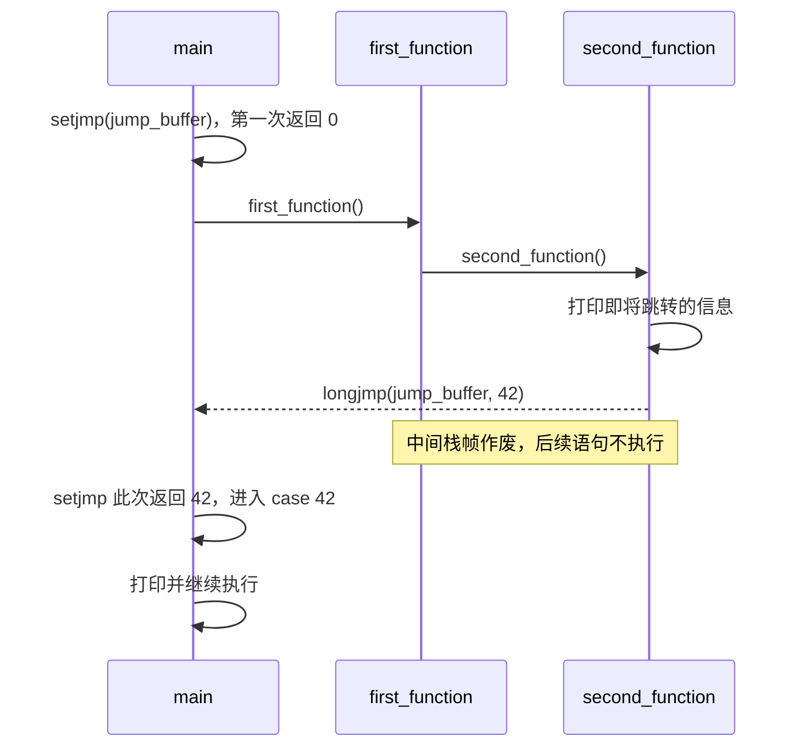

---
tags:
  - Linux
  - 进程
阅读次数: 0
---

# 11.7 非局部跳转

## 1. 简介

`goto` 只能在一个函数里跳。`setjmp()` 和 `longjmp()` 能跨函数跳：递归到第 100 层的地方调一次 `longjmp()`，下一条指令就已经在 `main` 里了，中间 99 层一次也不用返回。

代价是它**不是返回**。它把[[1.2 函数栈帧建立与销毁原理\|栈指针]]和程序计数器直接写回 `setjmp()` 那一刻的值，中间那些栈帧的收尾代码一句都不会跑。所以它既是 C 里异常机制的底座，也是资源泄漏的常见来源。

---

## 2. setjmp() 和 longjmp() - 基本非局部跳转

### 2.1 函数原型

```c
#include <setjmp.h>

int setjmp(jmp_buf env);
void longjmp(jmp_buf env, int val);
```

| 函数 | 干什么 |
|------|------|
| `setjmp()` | 把当前执行环境存进 `env`，留一个可以跳回来的点 |
| `longjmp()` | 从 `env` 里把执行环境写回去，控制流回到 `setjmp()` 那一行 |

### 2.2 一次调用，两次返回

`setjmp()` 是少数「一次调用会返回两次」的函数：

| 什么时候返回 | 返回值 |
|------|------|
| 第一次直接调用 | `0` |
| 被 `longjmp(env, val)` 打回来 | `val` |

有一个边界值得记住：`longjmp(env, 0)` 传的 0 不会原样返回，标准规定这种情况下 `setjmp()` 返回 1。因为 0 已经被「第一次直接调用」占了，不能有两种含义。这条对第 4.1 节的 `THROW(0)` 是个坑。

所以用 `setjmp()` 的代码结构一定是「按返回值分两支走」，不存在「调用完接着往下」这种写法。

### 2.3 它存了什么，没存什么

![[图片/SVG/3_11_11_7_1.svg|1307]]

图 A 左边是 `longjmp()` 之前的栈：`main` 调 `first_function`，后者调 `second_function`，三个帧叠着，栈顶在最深处。右边是跳完之后：`main` 的帧原样活着，中间两个帧变成虚线，**内存还在那里，但已经不属于任何人**，下一次函数调用就会把它们覆盖掉。

这一步只花几条指令，因为它做的事就是把几个寄存器写回去。图 B 列的三样东西就是 `env` 里的全部内容：跳回哪一行（PC）、栈顶退到哪（SP/FP）、以及被调用者保存寄存器（x86-64 上是 `rbx`、`rbp`、`r12` 到 `r15`）。函数正常返回时本来也要恢复这几个寄存器，`longjmp()` 的区别只是跳过中间几层，一次恢复到最外层那一份。

`env` 里**没有**的两样东西各自对应一节麻烦：信号掩码见第 2 节，局部变量的当前值见 3.1。

### 2.4 setjmp 只能写在这几个位置

C 标准把 `setjmp()` 能出现的位置限死了（C11 7.13.2.1），只有四种：

1. 选择或迭代语句的**整个**控制表达式：`if (setjmp(env))`、`switch (setjmp(env))`、`while (setjmp(env))`
2. 和一个整数常量表达式做关系或相等比较，且整个比较是控制表达式：`if (setjmp(env) == 0)`
3. `!` 的操作数，且整个表达式是控制表达式：`if (!setjmp(env))`
4. 整个表达式语句，允许带 `(void)` 强转：`setjmp(env);`

写成别的样子是未定义行为，包括下面这两种最顺手的：

```c
int ret = setjmp(env);            // 未定义行为
if ((ret = setjmp(env)) != 0) {}  // 未定义行为
```

限制的理由和 `longjmp()` 的机制是一回事：跳回来时寄存器是 `setjmp()` 那一刻的样子，任何**半算完的表达式**的中间结果都不保证还在。把 `setjmp()` 的返回值塞进一个更大的表达式，就是在要求编译器保住这些中间结果。

标准没给这个保证。要拿到具体的 `val`，`switch (setjmp(env))` 就够用，改写成本是零。

### 2.5 代码示例

```c
#include <stdio.h>
#include <setjmp.h>

jmp_buf jump_buffer;

void second_function(void) {
    printf("In second_function, about to longjmp.\n");
    longjmp(jump_buffer, 42);        // 控制流直接回到 main 的 setjmp
    printf("This will never be printed.\n");
}

void first_function(void) {
    printf("In first_function, calling second_function.\n");
    second_function();
    printf("This will never be printed.\n");   // second_function 不会返回
}

int main(void) {
    // 用 switch 才能既拿到 val，又待在标准允许的位置上
    switch (setjmp(jump_buffer)) {
    case 0:
        printf("setjmp returned 0, calling first_function.\n");
        first_function();
        break;

    case 42:
        printf("longjmp returned 42, back in main.\n");
        break;

    default:
        printf("unexpected jump value.\n");
        break;
    }

    printf("Program continues normally.\n");
    return 0;
}
```

### 2.6 控制流时序



`first_function` 里 `second_function()` 后面那句永远打不出来，这是这段代码最该注意的地方：`second_function` 没有返回，`first_function` 也就没机会继续。

### 2.7 运行结果

```
setjmp returned 0, calling first_function.
In first_function, calling second_function.
In second_function, about to longjmp.
longjmp returned 42, back in main.
Program continues normally.
```

---

## 3. sigsetjmp() 和 siglongjmp() - 掩码要不要一起存

### 3.1 掩码是怎么被锁住的

![[图片/SVG/3_11_11_7_3.svg|1307]]

内核在调用信号处理函数之前做了两件事：把当前信号掩码存进 `ucontext`，然后**把这个信号本身加进掩码**。第二步是为了防重入，处理 `SIGINT` 的过程中再来一个 `SIGINT` 不会套着调一层。

那掩码什么时候还回来？handler 正常返回时会走 `sigreturn`，由它从 `ucontext` 里把旧掩码读回来。

从 handler 里 `longjmp()` 出去，等于让 **handler 永远不返回**，`sigreturn` 这一步没人跑。图 A 第 ③ 格就是这个状态：掩码此刻长什么样，取决于 `longjmp()` 的实现有没有顺手存过掩码，而 POSIX 明确写了这件事不做保证。落到不存掩码的那种实现上，掩码里的 `SIGINT` 会一直留着，第二次按 Ctrl-C 只让信号挂在 pending 里，程序看上去毫无反应。

`sigsetjmp()` / `siglongjmp()` 把这件事从「看 libc 的实现」改成一个显式参数。图 B 里掩码来自 `sigsetjmp()` 存下的那一份，跟 `sigreturn` 跑不跑无关。

**在信号处理函数里跳转，只用这一对。**

### 3.2 函数原型

```c
#include <setjmp.h>

int sigsetjmp(sigjmp_buf env, int savesigs);
void siglongjmp(sigjmp_buf env, int val);
```

| 参数 | 含义 |
|------|------|
| `env` | 存执行环境的缓冲区，类型是 `sigjmp_buf`，不是 `jmp_buf` |
| `savesigs` | 非 0 表示连信号掩码一起存，`siglongjmp()` 会把它还回去；传 0 就退回和 `setjmp()` 一样的不确定行为 |
| `val` | `siglongjmp()` 传给 `sigsetjmp()` 的返回值，同样不能是 0 |

### 3.3 代码示例：信号处理中的安全跳转

```c
#include <stdio.h>
#include <signal.h>
#include <setjmp.h>
#include <unistd.h>

static sigjmp_buf jump_buffer;
static volatile sig_atomic_t can_jump = 0;   // 跳转点没设好之前不许跳

void signal_handler(int sig) {
    if (!can_jump) {
        return;                  // env 还没填，跳过去就是未定义行为
    }
    // handler 里不能用 printf，它不是异步信号安全的
    const char msg[] = "\ncaught SIGINT, jumping back\n";
    write(STDERR_FILENO, msg, sizeof(msg) - 1);

    siglongjmp(jump_buffer, 1);
}

int main(void) {
    signal(SIGINT, signal_handler);

    if (sigsetjmp(jump_buffer, 1) == 0) {
        can_jump = 1;            // 必须在 sigsetjmp 之后才置起来
        printf("Working. Press Ctrl+C to interrupt.\n");

        while (1) {
            printf("...\n");
            sleep(1);
        }
    } else {
        can_jump = 0;            // 跳回来了，先把闸关掉
        printf("Interrupted, cleaning up and exiting.\n");
    }

    printf("Program finished.\n");
    return 0;
}
```

`can_jump` 这个闸不是装饰。`signal()` 注册完到 `sigsetjmp()` 填好 `env` 之间有一个窗口，这期间来一个 `SIGINT`，`siglongjmp()` 拿到的是一片没初始化的内存。

它的两个限定词各有理由：`volatile` 是因为它被 handler 异步改写，编译器不能把它缓存在寄存器里；`sig_atomic_t` 是因为对它的读写要保证不被信号打断到一半。这跟 3.1 节那个 `volatile` 是两回事，别混起来记。

handler 里也别用 `printf`。它不是异步信号安全的函数，主流程正在 `printf` 中途被打断时进来会踩坏 `stdio` 的内部状态。要输出就用 `write()`，完整的约束见 [[11.5 僵尸进程#4.7 handler 里的三条约束|handler 里的三条约束]]。

### 3.4 运行示例

```
Working. Press Ctrl+C to interrupt.
...
...
^C
caught SIGINT, jumping back
Interrupted, cleaning up and exiting.
Program finished.
```

---

## 4. 四个陷阱

### 4.1 局部变量的值可能变回去

![[图片/SVG/3_11_11_7_2.svg|1307]]

「`longjmp()` 之后局部变量的值不确定」这句话流传很广，但范围放得太宽。标准（C11 7.13.2.1）划的线要窄得多，图 B 左边那三个条件**同时成立**才不确定：

1. 是调用 `setjmp()` 那个函数里的自动变量
2. 没有 `volatile` 限定
3. 在 `setjmp()` 和 `longjmp()` 之间被改过

少任何一条，跳回来读到的就是 `longjmp()` 调用时刻的值。所以全局变量、`static` 变量、堆上的数据都不受这条影响。

图 A 是这条规则背后的机制。`x` 是普通 `int`，编译器把它放在 `rbx` 里，`setjmp()` 顺手把 `rbx` 存进了 `env`，之后 `x = 10` 只改了寄存器；`longjmp()` 把 `rbx` 恢复成 0，那个 10 就没了。`y` 带 `volatile`，编译器不敢把它留在寄存器里，每次读写都落到栈内存，而 `env` 里根本没有栈的内容，所以 10 还在。

```c
#include <stdio.h>
#include <setjmp.h>

jmp_buf env;

void do_jump(void) {
    longjmp(env, 1);
}

int main(void) {
    int x = 0;           // 三个条件全中，跳回来的值不确定
    volatile int y = 0;  // 有 volatile，跳回来一定是 10

    if (setjmp(env) == 0) {
        x = 10;
        y = 10;
        do_jump();
    } else {
        printf("x = %d (不确定), y = %d (一定是 10)\n", x, y);
    }

    return 0;
}
```

这段代码是用来观察机制的，`-O0` 和 `-O2` 编出来的 `x` 很可能不一样。正式代码里不要去读这种变量：**跳回来还要用的局部变量，加 `volatile`**。

### 4.2 不要跳到已经返回的函数

`setjmp()` 所在的函数一旦返回，`env` 就是一张废票。它记的栈指针指向一块已经被回收的区域，`longjmp()` 会把栈顶搬到那里，后面的行为完全不可预测。

```c
// 错误示例
jmp_buf env;

void setup_jump(void) {
    setjmp(env);          // setup_jump 一返回，这个 env 就无效了
}

int main(void) {
    setup_jump();
    longjmp(env, 1);      // 未定义行为，栈帧已经不在了
}
```

同一条规则的另一个说法：`longjmp()` 只能往调用链的**上游**跳，跳不进一个还没被调用的函数。

跨线程也不行。POSIX 规定 `jmp_buf` 只在存下它的那个线程里有效，拿着别的线程的 `env` 去 `longjmp()` 是未定义行为。

### 4.3 中间几层的清理代码不会跑

这是第 1 节那张栈帧图里两个虚线帧的直接后果：帧作废了，帧里的收尾代码也就没机会跑。

```c
void process_file(void) {
    FILE *fp = fopen("data.txt", "r");
    if (some_error_condition) {
        longjmp(env, 1);   // fp 泄漏：fclose 那一行永远不会执行
    }
    fclose(fp);
}
```

「在跳转目标处统一清理」这个说法太含糊，跳转点根本看不见 `fp`。可行的做法有两条：

- **别让中间层的局部变量独占资源**。把要清理的东西登记到跳转点能看到的地方，比如一张 `static` 的资源表，或者一个一路传下去的 context 结构
- **别用非局部跳转**。改成一层层返回错误码，这也是绝大多数 C 项目的选择

### 4.4 C++ 里跨过析构函数就是未定义行为

C++ 标准的规定很具体：如果把这一对 `setjmp` / `longjmp` 换成 `catch` / `throw` 会触发任何非平凡析构函数，那么这次跳转是未定义行为。

也就是说，跳过的那几层栈帧里只要有一个 `std::string`、`std::vector` 或者任何自定义析构函数的对象，这段代码就不合法。

C++ 里该用的是异常。异常会正常展开栈、跑完每一层的析构函数，这正是 `longjmp()` 不做的事。

---

## 5. 实际应用场景

### 5.1 错误处理（简易异常机制）

```c
#include <stdio.h>
#include <setjmp.h>

jmp_buf error_handler;

#define TRY       if (setjmp(error_handler) == 0)
#define THROW(n)  longjmp(error_handler, n)
#define CATCH     else

void risky_operation(int value) {
    if (value < 0) {
        THROW(1);
    }
    printf("Operation succeeded with value: %d\n", value);
}

int main(void) {
    TRY {
        risky_operation(10);   // 成功
        risky_operation(-5);   // 失败，跳到 CATCH
        risky_operation(20);   // 不会执行
    }
    CATCH {
        printf("Error caught! Handling error...\n");
    }

    return 0;
}
```

这套宏能跑，但跟真正的异常差得远，四条限制都是实打实会撞上的：

| 缺什么 | 具体后果 |
|------|------|
| 没有 `finally` | 中间层的资源清理得自己想办法，就是 3.3 那个问题 |
| 不能嵌套 | 只有一个全局 `error_handler`，内层 `TRY` 会把外层存的 `env` 覆盖掉 |
| `CATCH` 拿不到错误码 | `setjmp` 的返回值被 `TRY` 的比较吃掉了，要传值得再加一个 `volatile` 全局变量 |
| 不是线程安全的 | `jmp_buf` 是全局的，两个线程同时进 `TRY` 就废了 |

还有一个静默的坑：`THROW(0)` 不会让 `setjmp()` 返回 0，标准把它改成 1，于是 `TRY` 那一支不会走，`CATCH` 会走。错误码里不能有 0。

### 5.2 从深层递归中退出

```c
#include <stdio.h>
#include <setjmp.h>

static jmp_buf escape;
static volatile int escaped_depth;   // 深度靠这个变量带出去，不靠 longjmp 的 val

void deep_recursion(int depth) {
    printf("Depth: %d\n", depth);

    if (depth > 100) {
        printf("Too deep! Escaping...\n");
        escaped_depth = depth;
        longjmp(escape, 1);
    }

    deep_recursion(depth + 1);
}

int main(void) {
    if (setjmp(escape) == 0) {
        deep_recursion(1);
    } else {
        printf("Escaped from depth %d\n", escaped_depth);
    }

    return 0;
}
```

`escaped_depth` 是 `static` 的，不受 3.1 那三个条件约束，加 `volatile` 是为了不让编译器把跨越跳转的读写优化掉。深度值走这条路而不是走 `longjmp()` 的 `val`，是为了让 `setjmp()` 待在标准允许的位置上。

这个例子省下的是每一层的 `if (ret < 0) return ret;`，代价是每一层的清理也一起被跳过了。递归函数里只要 `malloc` 过东西，这个写法就得先解决 3.3。

---

## 6. 总结对比

| | `setjmp` / `longjmp` | `sigsetjmp` / `siglongjmp` |
|------|------|------|
| 信号掩码 | POSIX 不保证存也不保证还 | `savesigs` 非 0 时一定存、一定还 |
| 能不能在 handler 里跳 | 不能，掩码状态没法保证 | 能，这就是它存在的理由 |
| 跳转方向 | 只能往调用链上游 | 同左 |
| 中间层的清理代码 | 一律不跑 | 同左 |
| C++ | 跨过非平凡析构函数就是未定义行为 | 同左 |
| 线程 | `env` 只在存它的那个线程里有效 | 同左 |

选用的界线很清楚：

- **信号处理函数里要跳** → `sigsetjmp` / `siglongjmp`，没有第二个选项
- **写 C++** → 用异常，别碰这两组函数
- **写 C，想做异常** → 先算清楚 3.3 的清理怎么办；算不清就老老实实返回错误码

---

## 7. 关键要点

- `setjmp()` 存执行环境，`longjmp()` 把 SP、PC 和被调用者保存寄存器原样写回，它**不是返回**，中间几层栈帧的收尾代码一句都不跑
- `setjmp()` 一次调用返回两次：直接调用返回 0，被打回来返回 `val`；`longjmp(env, 0)` 会变成返回 1
- `setjmp()` 只能出现在四种位置，`int ret = setjmp(env)` 不在其中，要拿 `val` 就用 `switch`
- 跳回来还要读的局部变量加 `volatile`；`static`、全局、堆上的数据不受这条影响
- `env` 里没有信号掩码，handler 里跳转只能用 `sigsetjmp` / `siglongjmp`，因为 `longjmp` 绕过了负责还掩码的 `sigreturn`
- handler 里要有 `can_jump` 这类闸，且不能调 `printf`
- `setjmp()` 所在的函数返回后，`env` 作废；跨线程用 `env` 同样作废
- C++ 里跨过非平凡析构函数的跳转是未定义行为，该用异常
