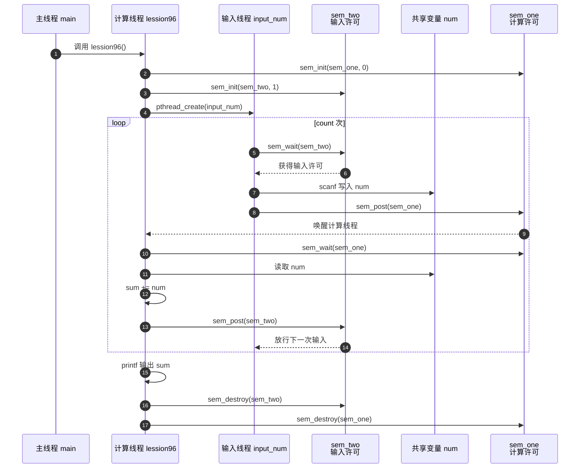

---
tags:
  - Linux
  - 线程
阅读次数: 0
---

# 12.4 信号量（Semaphore）

## 1. 简介

信号量是一种非常强大的线程同步工具，它本质上是一个**计数器**。这个计数器可以控制对共享资源的访问，从而解决并发问题。信号量可以解决 [[12.3 互斥量|互斥量]] 无法处理的更复杂的同步场景。

你可以把它想象成一个有固定座位的候车室：
- 当一个线程想要进入候车室，它必须先拿走一把钥匙（信号量减一）
- 如果还有座位（信号量的值大于 0），线程就可以进去坐下
- 如果没有座位了（信号量的值等于 0），那么新线程就只能在门口等待，直到有人离开
- 当一个线程离开候车室时，它会释放一把钥匙（信号量加一），此时等待的线程就可以进入

---

## 2. 信号量的两种类型

### 2.1 二值信号量（Binary Semaphore）

也叫互斥信号量（Mutex），它的值只能是 **0 或 1**，当值为 1 时，表示资源可用；当值为 0 时，则处于阻塞状态，它主要用于互斥，保护临界区。它实现了上面例子中 "候补-找座" 的一次性行为。

**特点**：
- 功能上类似于 [[12.3 互斥量|互斥量]]
- 主要用于互斥访问共享资源
- 任何时刻只有一个线程可以持有

### 2.2 计数信号量（Counting Semaphore）

它的值可以大于 1，主要用于控制对多个资源的访问。例如，如果一个系统有 3 个打印机，你可以将信号量的初值设为 3。每当一个线程使用打印机时，信号量减 1；释放时，信号量加 1。当信号量为 0 时，所有打印机都被占用，用于控制对多个资源的访问。

**特点**：
- 计数值可以大于 1
- 用于控制对多个资源的访问

---

## 3. 信号量与互斥量的区别

| 特性 | 信号量 | [[12.3 互斥量\|互斥量]] |
|:---|:---|:---|
| 持有者 | 无严格所有权，任何线程都可以执行 `sem_post()` 增加计数 | 有所有权，通常应该由加锁的线程解锁 |
| 计数器 | 有计数器，可以大于 1，用于控制多个资源或并发额度 | 没有公开计数器，主要是已锁定 / 未锁定两种状态 |
| 用途 | 资源计数、生产者消费者、限制并发、跨线程通知 | 保护临界区，保证同一时刻只有一个线程修改共享数据 |
| 典型问题 | 初值设置错误会导致永远阻塞或并发过量 | 忘记解锁、重复加锁、加锁顺序错误会导致死锁 |

---

## 4. 信号量 API

信号量相关函数定义在 `<semaphore.h>` 头文件中。

### 4.1 sem_init() - 初始化一个信号量

```c
#include <semaphore.h>

int sem_init(sem_t *sem, int pshared, unsigned int value);
```

**参数详解**：

| 参数 | 说明 |
|:---|:---|
| `sem` | `sem_t *sem`：指向信号量变量的指针 |
| `pshared` | 一个重要标志，如果设置为 0，信号量只能在当前[[1.3 进程的虚拟地址空间\|进程]]内的线程间共享（这是最常见的方式）。如果设置为非 0，则信号量可以在多个进程间共享，但这要求 `sem` 必须位于共享内存区域中 |
| `value` | `unsigned int value`：信号量的**初始值**，这就是你所说的 "计数器" 的初始值。对于计数信号量，可以设置为资源数量；对于二值信号量，通常设置为 1 |

**返回值**：成功返回 0，失败返回 -1

### 4.2 sem_wait() - 等待信号量（P 操作）

```c
int sem_wait(sem_t *sem);
```

这个函数用于原子性地**减少**信号量的值。如果信号量当前的值为 0，那么调用线程将被阻塞，直到信号量的值变为大于 0。

**函数原型**：`int sem_wait(sem_t *sem);`

**作用**：它实现了上面例子中 "拿走一把钥匙" 的原子操作，通常用于在访问共享资源之前进行阻塞。

### 4.3 sem_post() - 发送信号（V 操作）

```c
int sem_post(sem_t *sem);
```

这个函数用于原子性地**增加**信号量的值。如果此时有其他线程因为 `sem_wait()` 而处于阻塞状态，`sem_post()` 会唤醒其中一个。

**函数原型**：`int sem_post(sem_t *sem);`

**作用**：它实现了上面例子中 "归还钥匙" 的原子操作，通常用于在完成对共享资源的操作后进行释放。

### 4.4 sem_destroy() - 销毁信号量

```c
int sem_destroy(sem_t *sem);
```

当不再需要信号量时，必须调用此函数来释放其占用的资源。

**函数原型**：`int sem_destroy(sem_t *sem);`

**作用**：清理信号量，防止资源泄漏。

---

## 5. 代码示例

下面是一个使用信号量实现生产者-消费者模式的示例，演示了信号量如何协调两个线程之间的同步：

```c
#include <semaphore.h>
#include <pthread.h>
#include <stdio.h>
#include <string.h>

sem_t sem_one;  // 控制是否可以输入
sem_t sem_two;  // 控制是否完成计算
int num = 0;

// 输入线程：负责读取用户输入
void* input_num(void* arg) {
    int count = 0;
    memcpy(&count, &arg, sizeof(int));

    for (int i = 0; i < count; i++) {
        printf("input num: ");
        sem_wait(&sem_two);   // 等待上一次计算完成
        scanf("%d", &num);
        sem_post(&sem_one);   // 通知计算线程可以开始
    }
    return NULL;
}

// 计算线程：负责累加求和
void lession96() {
    int sum = 0;
    int count = 5;

    // 初始化信号量
    sem_init(&sem_one, 0, 0);  // 初始为0，表示还没有输入
    sem_init(&sem_two, 0, 1);  // 初始为1，表示可以开始输入

    pthread_t thread;
    pthread_create(&thread, NULL, input_num, (void*)count);

    for (int i = 0; i < count; i++) {
        // 等待输入完成
        sem_wait(&sem_one);
        sum += num;
        sem_post(&sem_two);  // 通知输入线程可以继续
    }

    printf("sum is %d\n", sum);

    // 销毁信号量
    sem_destroy(&sem_two);
    sem_destroy(&sem_one);
}

int main(int argc, char* argv[]) {
    lession96();
    return 0;
}
```

### 5.1 生产者-消费者同步示意图


![[图片/3.Linux/12. 线程/Pasted image 20260520192016.png|935]]

### 5.2 线程通信与调用时序



**代码分析**：

1. 使用两个信号量 `sem_one` 和 `sem_two` 来实现"乒乓式"的线程协作
2. `sem_two` 初始为 1，允许输入线程先执行输入操作
3. 输入完成后，`sem_post(&sem_one)` 通知计算线程可以读取数据
4. 计算线程处理完后，`sem_post(&sem_two)` 通知输入线程可以进行下一次输入
5. 这种模式确保了输入和计算交替进行，避免了数据竞争

### 5.3 SVG 图解：两个信号量实现单格生产者-消费者

![[图片/3.Linux/12. 线程/3_12_4_1.svg|760]]

这段代码可以理解成一个只有一格的生产者-消费者模型：

- `sem_two` 是输入许可，初始为 `1`，所以输入线程第一轮可以先执行 `scanf()`
- `sem_one` 是数据就绪信号，初始为 `0`，所以计算线程会先卡在 `sem_wait(&sem_one)`
- 输入线程写入全局 `num` 后执行 `sem_post(&sem_one)`，计算线程才能 `sum += num`
- 计算线程处理完再执行 `sem_post(&sem_two)`，输入线程才能进入下一轮
- 这不是“同时写同时读”，而是两个线程用信号量打乒乓：每一轮只允许一个线程碰 `num`

> [!warning] 课堂代码里的传参写法
> `pthread_create(&thread, NULL, input_num, (void*)count)` 再用 `memcpy(&count, &arg, sizeof(int))` 属于“把整数塞进指针”的演示写法，依赖平台细节。工程里更推荐传 `&count`，或为线程参数单独分配一个结构体，避免 32/64 位差异和生命周期问题。

---

## 6. 在推理服务中的用法

信号量不只用于教材里的生产者-消费者模型。在 GPU 推理服务中，它常被抽象成**并发额度**和**背压**：

| 场景 | 信号量含义 | 工程目的 |
|---|---|---|
| 限制同时进入 GPU 推理的请求数 | 一个计数值表示可用 slot | 防止请求无限堆积压爆显存 |
| 控制 tokenizer / prefill / decode 队列 | 队列非空时唤醒 worker | 让 CPU worker 和 GPU worker 解耦 |
| 限制同时使用 pinned memory buffer | buffer 数量就是初始值 | 避免 host-device 异步拷贝占用过多页锁定内存 |
| benchmark 并发压测 | 并发请求数由信号量控制 | 稳定测 TTFT / TPOT / TPS，避免压测脚本失控 |

要注意：信号量只能表达“还有几个资源可用”，不能保护复杂数据结构本身。队列、map、日志等共享对象仍然需要 [[12.3 互斥量|互斥量]] 或 [[12.7 条件变量与线程池|条件变量配合互斥量]] 来维护一致性。

---

## 7. 关键要点

1. **信号量本质**：信号量是一个计数器，用于控制对共享资源的访问

2. **两种类型**：
   - 二值信号量（0 或 1）：用于互斥
   - 计数信号量（≥0）：用于资源计数

3. **核心操作**（PV 操作）：
   - `sem_wait()`（P 操作）：信号量减 1，若为 0 则阻塞
   - `sem_post()`（V 操作）：信号量加 1，可能唤醒等待线程

4. **与互斥量的选择**：
   - 简单的互斥访问：使用 [[12.3 互斥量|互斥量]]
   - 需要计数或复杂同步：使用信号量

5. **推理服务里的直觉**：信号量常用来限制并发 slot、buffer 数量和请求队列压力

---


