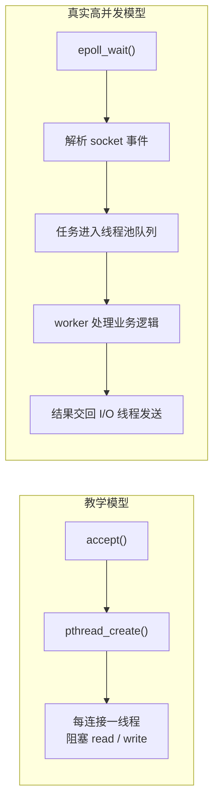
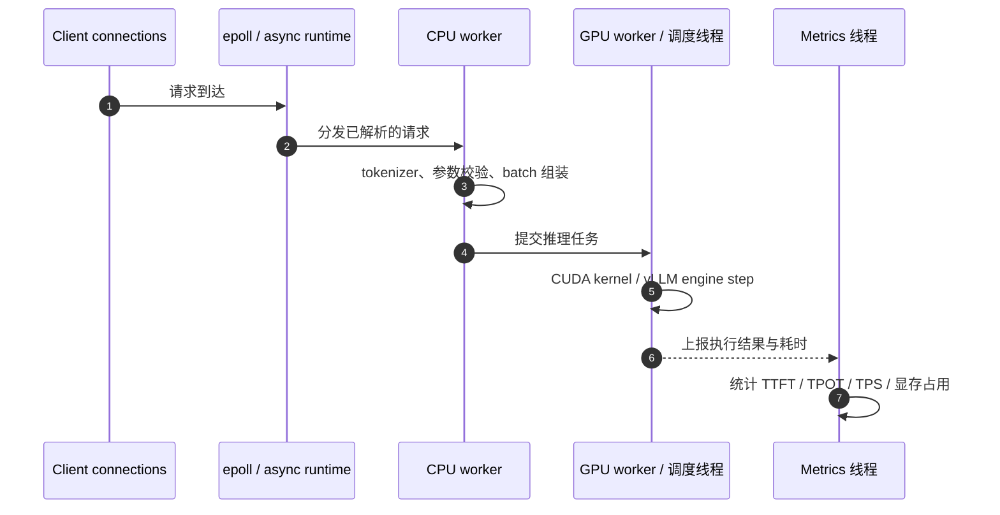

---
tags:
  - Linux
  - 线程
阅读次数: 0
---

# 12.6 多线程并发服务器案例

本节通过一个完整的案例，展示如何综合运用前面学习的知识构建一个**多线程并发 TCP 服务器**。这个案例整合了 [[7.7 套接字|Socket 编程]]、[[12.2 线程的创建与运行|线程创建]]、[[12.3 互斥量|互斥量]] 等核心概念。

---

## 1. 概述

在实际的服务器开发中，需要同时处理多个客户端的连接请求。比较常见的实现方式有：

- **多进程模型**：为每个客户端 fork 一个子进程
- **多线程模型**：为每个客户端创建一个线程（本案例采用）
- **IO 多路复用**：使用 select/poll/epoll（见 [[13.1 IO复用简介|IO 复用]]）
- **Reactor + 线程池模型**：一个或少量 I/O 线程负责事件循环，固定数量 worker 处理耗时任务（见 [[12.7 条件变量与线程池]]）

多线程模型相比多进程模型，具有以下优势：

| 特性 | 多线程 | 多进程 |
|:---|:---|:---|
| 资源开销 | 较小（共享地址空间） | 较大（独立地址空间） |
| 数据共享 | 直接共享（需同步） | 需要 IPC 机制 |
| 创建速度 | 快 | 相对较慢 |
| 稳定性 | 一个线程崩溃可能影响整个进程 | 进程间相互隔离 |

> [!warning] 工程边界
> “每个客户端一个线程”适合教学和小规模服务，但高并发服务通常不会无限创建线程。真实工程更常见的是 `epoll` / Reactor 负责连接事件，再把 CPU 密集或阻塞任务投递到固定大小线程池。

---

## 2. 服务器架构设计

![[图片/3.Linux/12. 线程/3_12_6_1.svg]]

### 2.1 核心设计要点

1. **主线程职责**：监听连接请求，接受新连接，创建工作线程
2. **工作线程职责**：处理单个客户端的所有请求
3. **线程分离**：工作线程设置为分离状态，结束后自动回收资源
4. **连接管理**：使用 set 容器存储所有活跃连接的套接字
5. **日志系统**：使用互斥量保护日志文件的写入操作

### 2.2 从教学模型到真实服务模型



这也是为什么 [[13.4 epoll模型|epoll]] 和 [[12.7 条件变量与线程池|线程池]] 要连在一起学：前者解决“很多 fd 怎么等”，后者解决“耗时任务交给谁做”。

---

## 3. 关键实现细节

### 3.1 多个连接的共同的全局变量

```c
set<int> client_users;  // 存储客户端 socket
pthread_mutex_t users_mutex;  // 保护 client_users 的互斥锁
```

使用 STL 的 `set` 容器管理所有活跃的客户端连接。由于多个线程可能同时操作这个容器，需要使用 [[12.3 互斥量|互斥量]] 进行保护。

### 3.2 线程安全的日志系统

```c
pthread_mutex_t log_mutex;

void log_message(const char* msg) {
    pthread_mutex_lock(&log_mutex);

    FILE* log_file = fopen("server.log", "a");
    fprintf(log_file, "%s\n", msg);
    fclose(log_file);

    pthread_mutex_unlock(&log_mutex);
}
```

多个工作线程可能同时写日志，使用互斥量确保日志内容不会交错混乱。

### 3.3 客户端登录处理

```c
void handle_client_login(int user_id, int client_fd) {
    // 记录用户登录
    connected_users.insert(client_fd);
}
```

### 3.4 消息转发功能

服务器接收一个客户端的消息后，可以转发给其他所有连接的客户端：

```c
void broadcast_message(const char* msg) {
    pthread_mutex_lock(&users_mutex);

    for (int fd : client_users) {
        write(fd, msg, strlen(msg));
    }

    pthread_mutex_unlock(&users_mutex);
}
```

### 3.5 上面两段代码的共同问题：临界区里放了阻塞操作

`broadcast_message` 和 `log_message` 的加锁都是正确的，不存在数据竞争。但它们把一个**时长不受自己控制**的操作放进了临界区：前者是 `write`，后者是 `fopen`/`fclose`。

![[图片/SVG/3_12_6_3.svg|1000]]

`write()` 只有在内核发送缓冲区还有空间时才立刻返回。某个客户端连上之后一直不 `read`，它那条连接的发送缓冲区就会被填满，此时 `write` 阻塞。图 A 画的就是这一刻：广播线程握着 `users_mutex` 睡在 `fd 9` 上，其余线程全部堵在 `pthread_mutex_lock`，新连接进不了列表、断开的连接也 `close` 不掉。**一个不读数据的客户端就能让整个连接管理停摆**，而且这不是 bug，是这段代码的设计后果。

图 B 那三级里，第 ① 级的遗留问题最值得记住：**fd 是可复用的小整数**，`close` 之后这个号码随时可能属于另一条连接，所以它不能当连接的唯一标识跨锁使用。第 ③ 级就是 Reactor 模式里的输出缓冲设计，muduo 的 `TcpConnection::send` 先试着直接写，写不完的进 `outputBuffer` 并注册可写事件，高水位回调就是背压的出口。这条路线接到本节末尾说的「epoll + 线程池 + 有界队列」。

日志那段的毛病相同，只是慢的东西从网络换成了磁盘。改法是启动时 `open` 一次，用 `O_APPEND` 直接 `write`：

```c
// 全局，启动时打开一次
int log_fd = open("server.log", O_WRONLY | O_CREAT | O_APPEND, 0644);

void log_message(const char* msg) {
    char line[BUFFER_SIZE + 8];
    int n = snprintf(line, sizeof(line), "%s\n", msg);
    write(log_fd, line, n);      // 整条一次写出，不需要 log_mutex
}
```

`O_APPEND` 下内核保证「定位到文件末尾」和「写入」这两步之间不被打断，所以整条日志一次 `write` 发出去就不会和别的线程交错，互斥量可以整个省掉。这条保证在本地文件系统上成立，NFS 上不成立。日志量大到影响主路径时，下一步是异步日志：业务线程只往内存队列里塞，专门的线程负责落盘。

---

## 4. 完整代码实现

### 4.1 服务端代码

```c
#include <stdio.h>
#include <stdlib.h>
#include <string.h>
#include <unistd.h>
#include <pthread.h>
#include <sys/socket.h>
#include <netinet/in.h>
#include <arpa/inet.h>
#include <set>

#define PORT 12900
#define BUFFER_SIZE 1024

// 全局变量
std::set<int> client_users;           // 存储所有客户端 socket
pthread_mutex_t users_mutex;          // 保护 client_users
pthread_mutex_t log_mutex;            // 保护日志文件

// 日志记录函数（线程安全）
void log_message(const char* msg) {
    pthread_mutex_lock(&log_mutex);

    FILE* log_file = fopen("server.log", "a");
    if (log_file) {
        fprintf(log_file, "%s\n", msg);
        fclose(log_file);
    }

    pthread_mutex_unlock(&log_mutex);
}

// 客户端处理函数
void* handle_client(void* arg) {
    int client_sock = *(int*)arg;
    free(arg);  // 释放传入的参数内存

    char buffer[BUFFER_SIZE];
    ssize_t bytes_read;

    // 添加到连接列表
    pthread_mutex_lock(&users_mutex);
    client_users.insert(client_sock);
    pthread_mutex_unlock(&users_mutex);

    log_message("New client connected");

    // 接收并处理消息
    while ((bytes_read = read(client_sock, buffer, sizeof(buffer) - 1)) > 0) {
        buffer[bytes_read] = '\0';

        // 记录收到的消息
        char log_buf[BUFFER_SIZE + 64];
        snprintf(log_buf, sizeof(log_buf), "Received: %s", buffer);
        log_message(log_buf);

        // 回显消息给客户端
        write(client_sock, buffer, bytes_read);
    }

    // 客户端断开连接
    pthread_mutex_lock(&users_mutex);
    client_users.erase(client_sock);
    pthread_mutex_unlock(&users_mutex);

    close(client_sock);
    log_message("Client disconnected");

    return NULL;
}

// 关闭所有客户端连接
void close_all_clients() {
    pthread_mutex_lock(&users_mutex);

    for (int fd : client_users) {
        close(fd);
    }
    client_users.clear();

    pthread_mutex_unlock(&users_mutex);
}

int main(int argc, char* argv[]) {
    int server_sock;
    struct sockaddr_in server_addr, client_addr;
    socklen_t client_len = sizeof(client_addr);

    // 初始化互斥量
    pthread_mutex_init(&users_mutex, NULL);
    pthread_mutex_init(&log_mutex, NULL);

    // 1. 创建套接字
    server_sock = socket(AF_INET, SOCK_STREAM, 0);
    if (server_sock < 0) {
        perror("socket");
        return -1;
    }

    // 设置地址重用（避免 TIME_WAIT 问题）
    int opt = 1;
    setsockopt(server_sock, SOL_SOCKET, SO_REUSEADDR, &opt, sizeof(opt));

    // 2. 绑定地址
    memset(&server_addr, 0, sizeof(server_addr));
    server_addr.sin_family = AF_INET;
    server_addr.sin_addr.s_addr = htonl(INADDR_ANY);
    server_addr.sin_port = htons(PORT);

    if (bind(server_sock, (struct sockaddr*)&server_addr, sizeof(server_addr)) < 0) {
        perror("bind");
        close(server_sock);
        return -1;
    }

    // 3. 开始监听
    if (listen(server_sock, 5) < 0) {
        perror("listen");
        close(server_sock);
        return -1;
    }

    printf("Server listening on port %d\n", PORT);
    log_message("Server started");

    // 4. 主循环：接受连接并创建工作线程
    while (1) {
        int* client_sock = (int*)malloc(sizeof(int));
        *client_sock = accept(server_sock, (struct sockaddr*)&client_addr, &client_len);

        if (*client_sock < 0) {
            perror("accept");
            free(client_sock);
            continue;
        }

        printf("New connection from %s:%d\n",
               inet_ntoa(client_addr.sin_addr),
               ntohs(client_addr.sin_port));

        // 创建工作线程处理客户端
        pthread_t thread;
        if (pthread_create(&thread, NULL, handle_client, client_sock) != 0) {
            perror("pthread_create");
            close(*client_sock);
            free(client_sock);
            continue;
        }

        // 分离线程，使其结束后自动回收资源
        pthread_detach(thread);
    }

    // 清理资源（实际上这里不会执行到）
    close_all_clients();
    close(server_sock);
    pthread_mutex_destroy(&users_mutex);
    pthread_mutex_destroy(&log_mutex);

    return 0;
}
```

### 4.2 主循环里那次 malloc 为什么不能省

主循环里有一处容易被当成累赘删掉的写法：`accept` 之后先 `malloc` 一个 `int` 存放 fd，再把这个指针交给线程，由工作线程 `free`。

![[图片/SVG/3_12_6_2.svg|1000]]

`pthread_create` 的第四个参数是一个 `void *`，它只把**指针值**交给新线程，不复制指针指向的内容。新线程什么时候被调度、什么时候去读这块内存，主线程完全不知道，图 B 那三步的根源就在这里。

堆上那份拷贝的作用只有一个：让 fd 的值活过「主线程回到 `accept`」这一刻。工作线程把值读进自己的栈上局部变量之后它就没用了，所以 `free(arg)` 紧跟在第一行之后。

图 C 第三行那种免 `malloc` 的写法，是把整数直接塞进指针本身：

```c
// 主线程
pthread_create(&thread, NULL, handle_client, (void *)(intptr_t)client_sock);

// 工作线程
int client_sock = (int)(intptr_t)arg;
```

值随参数一起复制，没有共享内存，也就没有竞态和释放问题。需要传的不止一个 fd（比如还要带客户端地址）时就得回到 `malloc` 一个结构体，规则不变：**谁接手谁释放，取完值立刻 `free`。**

### 4.3 客户端代码

```c
#include <stdio.h>
#include <stdlib.h>
#include <string.h>
#include <unistd.h>
#include <sys/socket.h>
#include <netinet/in.h>
#include <arpa/inet.h>

#define PORT 12900
#define BUFFER_SIZE 1024

int main(int argc, char* argv[]) {
    if (argc < 2) {
        printf("Usage: %s <server_ip>\n", argv[0]);
        return -1;
    }

    int sock;
    struct sockaddr_in server_addr;
    char buffer[BUFFER_SIZE];

    // 1. 创建套接字
    sock = socket(AF_INET, SOCK_STREAM, 0);
    if (sock < 0) {
        perror("socket");
        return -1;
    }

    // 2. 设置服务器地址
    memset(&server_addr, 0, sizeof(server_addr));
    server_addr.sin_family = AF_INET;
    server_addr.sin_port = htons(PORT);

    if (inet_pton(AF_INET, argv[1], &server_addr.sin_addr) <= 0) {
        perror("inet_pton");
        close(sock);
        return -1;
    }

    // 3. 连接服务器
    if (connect(sock, (struct sockaddr*)&server_addr, sizeof(server_addr)) < 0) {
        perror("connect");
        close(sock);
        return -1;
    }

    printf("Connected to server %s:%d\n", argv[1], PORT);

    // 4. 发送和接收数据
    while (1) {
        printf("Enter message (q to quit): ");
        if (fgets(buffer, sizeof(buffer), stdin) == NULL) {
            break;
        }

        // 去除换行符
        buffer[strcspn(buffer, "\n")] = '\0';

        if (strcmp(buffer, "q") == 0) {
            break;
        }

        // 发送消息
        write(sock, buffer, strlen(buffer));

        // 接收回显
        ssize_t bytes_read = read(sock, buffer, sizeof(buffer) - 1);
        if (bytes_read > 0) {
            buffer[bytes_read] = '\0';
            printf("Server echo: %s\n", buffer);
        }
    }

    // 5. 关闭连接
    close(sock);
    printf("Disconnected from server\n");

    return 0;
}
```

---

## 5. 不需要加锁的场景

需要注意的是，**并非所有共享资源都需要加锁**。以下场景可以不加锁：

- **只读操作**：如果所有线程只是读取共享数据，没有写操作，则不需要加锁
- **原子操作**：使用 [[15.3 atomic|atomic]] 类型的变量进行简单的读写操作
- **线程局部存储**：每个线程有自己的副本，互不影响

---

## 6. 与 CUDA / LLM 推理服务的类比

把这个 TCP 服务器换成一个 LLM 推理服务，线程模型会更像这样：



这里的关键不是“线程越多越快”，而是把不同瓶颈分开：

| 环节 | 主要资源 | 线程相关问题 | GPU / 推理相关问题 |
|---|---|---|---|
| 网络收发 | socket fd、epoll | I/O 线程不能被慢任务阻塞 | TTFT 会受排队时间影响 |
| Tokenizer / JSON 解析 | CPU core、内存 | 是否需要线程池并行 | CPU 预处理慢会让 GPU 空转 |
| Batch 组装 | 请求队列、锁 | 锁粒度、条件变量、背压 | batch size 影响 TPS 和 TPOT |
| GPU 执行 | CUDA stream、显存 | 不要在持锁时等待 GPU 同步 | kernel 性能、KV cache、显存碎片 |
| 日志与指标 | 文件、监控队列 | 异步写入，避免阻塞主路径 | benchmark 需要稳定记录延迟分布 |

> [!important] 推理服务里的线程原则
> 不要让 I/O 线程直接做长时间 CPU 计算，也不要在持有互斥锁时调用可能长时间等待的 `cudaDeviceSynchronize()`、阻塞式推理接口或慢速日志写入。否则看起来是 GPU 慢，实际可能是 host-side 队列和锁把请求卡住了。

---

## 7. 编译与运行

```bash
# 编译服务端
g++ -o server server.cpp -lpthread

# 编译客户端
gcc -o client client.c

# 运行服务端
./server

# 在另一个终端运行客户端
./client 127.0.0.1
```

---

## 8. 关键要点

1. **主线程与工作线程分工明确**：
   - 主线程：监听、接受连接、分发任务
   - 工作线程：处理具体的客户端请求

2. **线程分离避免资源泄漏**：使用 `pthread_detach()` 让工作线程结束后自动回收（见 [[12.5 线程销毁#3. 分离（Detach）|线程分离]]）

3. **互斥量保护共享资源**：对共享数据结构（如客户端列表、日志文件）的访问必须使用 [[12.3 互斥量|互斥量]] 保护

4. **临界区里不能放阻塞操作**：加了锁只是没有数据竞争。`broadcast_message` 在持锁时 `write`，一个不读数据的客户端就能让所有连接管理停摆。锁的持有时间必须由自己决定，不能由最慢的对端决定

5. **跨线程传参要保证生命周期**：`pthread_create` 只传指针不复制内容。传栈变量地址会被下一次 `accept` 覆盖，得用 `malloc` 或把整数塞进指针本身

6. **fd 是可复用的小整数**：不能当连接的唯一标识跨锁使用，`close` 之后这个号码随时可能属于另一条连接

7. **正确处理连接生命周期**：
   - 连接建立时添加到管理列表
   - 连接断开时从列表移除并关闭套接字

8. **设置 SO_REUSEADDR**：避免服务器重启时出现 "Address already in use" 错误（与 [[7.6 TCP协议基础#5.3 TIME_WAIT|TIME_WAIT 状态]] 相关）

9. **工程升级方向**：从“每连接一线程”升级到 `epoll + 线程池 + 有界队列`，再进一步理解 LLM 推理服务中的 CPU-GPU 调度和背压

---
