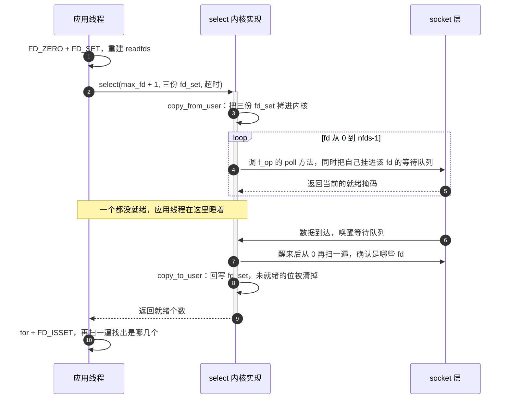

---
tags:
  - Linux
  - IO复用
阅读次数: 0
---

# 13.2 select 模型

> [!tip] 交互动画
> select 与 epoll 对比过程可视化（fd_set 每次拷贝 · 内核线性扫描 · 用户再 FD_ISSET · 对照红黑树+就绪链表）：
> [▶ 在浏览器中打开动画](<../../图片/HTML/3.Linux/13. IO复用/13.2.1 select与epoll对比动画.html>)　·　更多见 [[网络编程·动画合集]]
> 也可直达单个场景：[select 工作流](<../../图片/HTML/3.Linux/13. IO复用/13.2.1 select与epoll对比动画.html#scene=select>) · [epoll 工作流](<../../图片/HTML/3.Linux/13. IO复用/13.2.1 select与epoll对比动画.html#scene=epoll>) · [对照总结](<../../图片/HTML/3.Linux/13. IO复用/13.2.1 select与epoll对比动画.html#scene=compare>)

## 1. select 函数概述

`select()` 是最早的 [[13.1 IO复用简介|I/O 复用]] 实现，它可以同时监控多个[[4.1 打开、读取、写入、关闭#1. 文件描述符（File Descriptor）|文件描述符]]的状态变化。`select()` 函数源自 BSD Unix，具有良好的跨平台性，在 Windows、Linux、macOS 等系统上都可使用。

它今天仍然值得看懂，不是因为还要用它写高并发服务，而是因为 [[13.3 poll模型|poll]] 和 [[13.4 epoll模型|epoll]] 改掉的每一处，对应的都是 select 身上的一个具体毛病。不知道被改的是什么，就只能背结论。

---

## 2. select 函数原型

```c
#include <sys/select.h>
#include <sys/time.h>

int select(int nfds, fd_set *readfds, fd_set *writefds,
           fd_set *exceptfds, struct timeval *timeout);
```

### 2.1 参数说明

| 参数 | 说明 |
|:---|:---|
| `nfds` | 需要监控的最大文件描述符值 + 1 |
| `readfds` | 监控可读事件的 fd 集合（输入/输出参数） |
| `writefds` | 监控可写事件的 fd 集合（输入/输出参数） |
| `exceptfds` | 监控异常事件的 fd 集合（输入/输出参数） |
| `timeout` | 超时时间，NULL 表示永久阻塞 |

### 2.2 返回值

| 返回值 | 含义 |
|:---|:---|
| `> 0` | 就绪的文件描述符数量 |
| `0` | 超时，没有任何 fd 就绪 |
| `-1` | 出错，设置 `errno` |

### 2.3 nfds 为什么是「最大 fd + 1」

`nfds` 不是「我要监控几个 fd」，而是**内核循环的上界**。内核实现里就是一句 `for (i = 0; i < nfds; i++)`，把 `0` 到 `nfds - 1` 的每一位都看一遍。所以要让最大的那个 fd 也被扫到，上界必须比它大 1。

这个设计有两个直接后果：

- 监控 fd 3 和 fd 900 这两个，`nfds` 得写 901，内核照样从 0 扫到 900。**成本跟最大的 fd 值走，不跟个数走。**
- 传得比实际大不会出错，只是白扫；传小了则最大的那个 fd 永远不会被报告，而且不报错，只表现为「这个连接的数据一直收不到」。

### 2.4 timeout 参数

```c
struct timeval {
    long tv_sec;   // 秒
    long tv_usec;  // 微秒
};
```

| 设置方式                   | 效果             |
| :--------------------- | :------------- |
| `NULL`                 | 永久阻塞，直到有 fd 就绪 |
| `tv_sec=0, tv_usec=0`  | 立即返回（非阻塞检查）    |
| `tv_sec>0 或 tv_usec>0` | 等待指定时间         |

> [!warning] Linux 会改写 timeout
> `select()` 返回时，Linux 把 `timeout` 改成「**剩余**的时间」。POSIX 允许这么做但不要求，所以别的 Unix 上它可能原封不动。
>
> 落到代码上：`struct timeval` 不能定义在循环外面用一辈子，否则第二轮开始超时值就被上一轮吃掉了，几轮之后变成 0，`select()` 从阻塞退化成忙轮询。**每轮循环开头重新赋值。**

---

## 3. fd_set 数据结构

`fd_set` 是一个**位图**（bitmap）结构，用于表示一组文件描述符。每一位代表一个文件描述符的状态。

```c
// 典型实现（简化）
typedef struct {
    unsigned long fds_bits[FD_SETSIZE / (8 * sizeof(long))];
} fd_set;
```

### 3.1 fd_set 操作宏

| 宏 | 功能 | 用法 |
|:---|:---|:---|
| `FD_ZERO(fd_set *set)` | 清空集合 | `FD_ZERO(&readfds);` |
| `FD_SET(int fd, fd_set *set)` | 将 fd 添加到集合 | `FD_SET(sockfd, &readfds);` |
| `FD_CLR(int fd, fd_set *set)` | 从集合中移除 fd | `FD_CLR(sockfd, &readfds);` |
| `FD_ISSET(int fd, fd_set *set)` | 检查 fd 是否在集合中 | `if (FD_ISSET(sockfd, &readfds))` |

### 3.2 fd_set 是「值-结果参数」

`readfds` 既是入参也是出参，这一条直接决定了主循环该怎么写。

- **进内核之前**，位图表示「我想监控这些 fd」；
- **返回之后**，同一块内存被内核改写成「这些 fd 已经就绪」，没就绪的位全被清掉。

所以每轮 `while` 循环必须 `FD_ZERO` 之后重新 `FD_SET` 一遍。这不是保险起见的写法，是不这么写就一定错：第二轮的监控集合会缩水成第一轮的就绪集合。

![[图片/3.Linux/13. IO复用/13_2_1.svg|940]]

图里 B 区就是这件事：调用前置了 3、7、9 三位，只有 7 就绪，返回后 3 和 9 的位被内核清掉了。

### 3.3 fd_set 的限制

- `FD_SETSIZE` 通常定义为 **1024**，限制了最大可监控的文件描述符数量
- 文件描述符的值必须小于 `FD_SETSIZE`
- 这个限制是**编译时固定**的

> [!danger] fd 值 ≥ 1024 是内存越界，不是返回错误
> `FD_SET(1500, &readfds)` 不会报错，它会往 `fds_bits` 数组后面写。栈上的相邻变量被改掉，程序在别处莫名其妙地崩。
>
> 在 include 之前 `#define FD_SETSIZE 4096` 这种做法，glibc 并不支持：`fd_set` 的大小在库里已经定死，改宏只会让你的代码和 libc 对同一块内存的理解不一致。**真要监控上千 fd，换 [[13.3 poll模型|poll]] 或 [[13.4 epoll模型|epoll]]，不要试图撑大 select。**

### 3.4 exceptfds 不是「错误集合」

名字有误导性。在 TCP socket 上，`exceptfds` 报告的是**带外数据（OOB / urgent data）到达**，不是连接出错。

连接出错时的表现是：这个 fd 在 `readfds` 里变成可读，你去 `read()` 才拿到 `-1` 和具体的 `errno`。所以判断错误的位置在 `read()` / `write()` 的返回值上，不在 `exceptfds` 里。日常代码这个参数传 `NULL` 就行。

---

## 4. select 工作流程

先看应用这一侧的三步：重建集合、调用、遍历结果。



这张图补上了源码看不出来的两件事：**睡醒之后内核会把所有 fd 重新扫一遍**（唤醒只说明「有事发生了」，不说明是哪个 fd），以及**用户拿到的返回值只有个数，没有编号**，所以还得自己再扫一趟。

> [!note] 返回值和 `FD_ISSET` 的关系
> `select()` 告诉你「有 3 个就绪」，但不告诉你是哪 3 个。想省点力气，可以在 `FD_ISSET` 命中后把计数减一，减到 0 就跳出循环，不必扫完 `nfds`。

---

## 5. 内核里的三段 O(n)

上面那张 SVG 的 A 区把一次调用拆成了七步，其中三步的成本随 `nfds` 增长：

| 段 | 干什么 | 为什么躲不掉 |
|:---|:---|:---|
| ① `copy_from_user` | 把 `readfds`/`writefds`/`exceptfds` 三份位图整体拷进内核 | 监控集合每次调用都重新传，内核不替你记住 |
| ② `do_select` 线性扫描 | 从 0 到 `nfds-1`，对每个置位的 fd 调一次 `f_op->poll` | 内核不知道哪些 fd 可能就绪，只能挨个问 |
| ③ 用户态 `FD_ISSET` | 再扫一遍位图，找出就绪的是哪几个 | 返回值只有个数，位置信息在位图里 |

内核这里有一处小优化：`do_select()` 按 `unsigned long` 为单位取位图，一个字（64 位）里三份掩码全为 0 就整字跳过。所以**稀疏但 fd 值很大**的场景没有想象中那么惨，但只要 fd 分布得开，跳过就失效了。

真正的问题不是常数大小，是**成本挂在总连接数上而不是活跃连接数上**。一万个长连接里只有十个在收发数据，select 每轮照样要走完一万个的流程。这条就是 [[13.4 epoll模型|epoll]] 要拆掉的东西。

---

## 6. EINTR：被信号打断之后

`select()` 被信号中断时返回 `-1`、`errno == EINTR`。这时候有一个坑：**`fd_set` 的内容是未定义的**，不能拿来判断谁就绪，也不能接着用作下一轮的输入。

```c
for (;;) {
    FD_ZERO(&readfds);                 // 每轮重建，EINTR 之后尤其必要
    rebuild_fdset(&readfds, &max_fd);

    struct timeval tv = {5, 0};        // 每轮重新赋值，Linux 会改写它
    int n = select(max_fd + 1, &readfds, NULL, NULL, &tv);

    if (n < 0) {
        if (errno == EINTR) continue;  // 正常情况，重建后重来
        perror("select");
        break;                         // 真错误才退出，不要 continue 死循环
    }
    if (n == 0) { on_timeout(); continue; }

    dispatch(&readfds, max_fd);
}
```

两处细节：

- **`if (errno == EINTR) continue;` 和 `perror` 后 `break` 要分开写。** 常见写法是出错就 `continue`，遇到 `EBADF` 这类不会自愈的错误就变成 100% CPU 的死循环。
- **`tv` 定义在循环内部。** 定义在外面的话，第一轮等 5 秒、第二轮只剩 3 秒、几轮之后就是 0，`select` 退化成非阻塞轮询，CPU 直接打满。

需要在等待期间安全地处理信号，用 `pselect()`：它接受一个 `sigset_t`，原子地「换掩码 → 等待 → 换回来」，避开了「检查完标志位、还没进 select 时信号到达」的竞态。`pselect()` 的超时参数是 `const struct timespec *`，不会被改写。

---

## 7. 完整示例代码

### 7.1 使用 select 的 TCP 服务器

```c
#include <stdio.h>
#include <stdlib.h>
#include <string.h>
#include <unistd.h>
#include <sys/socket.h>
#include <sys/select.h>
#include <netinet/in.h>
#include <arpa/inet.h>

#define PORT 8080
#define MAX_CLIENTS 30
#define BUFFER_SIZE 1024

int main() {
	// listen_fd：负责监听 | conn_fd：负责与客户端通信 | client_fds：保存客户端连接
    int listen_fd, conn_fd, client_fds[MAX_CLIENTS];
    int max_fd, activity, i;
    fd_set readfds;
    char buffer[BUFFER_SIZE];
    struct sockaddr_in server_addr, client_addr;
    socklen_t addr_len = sizeof(client_addr);

    // 初始化客户端数组
    for (i = 0; i < MAX_CLIENTS; i++) {
        client_fds[i] = 0;
    }

    // 1. 创建监听套接字
    listen_fd = socket(AF_INET, SOCK_STREAM, 0);
    if (listen_fd < 0) {
        perror("socket");
        exit(EXIT_FAILURE);
    }

    // 设置地址复用
    int opt = 1;
    setsockopt(listen_fd, SOL_SOCKET, SO_REUSEADDR, &opt, sizeof(opt));

    // 2. 绑定地址
    memset(&server_addr, 0, sizeof(server_addr));
    server_addr.sin_family = AF_INET;
    server_addr.sin_addr.s_addr = INADDR_ANY;
    server_addr.sin_port = htons(PORT);

    if (bind(listen_fd, (struct sockaddr*)&server_addr,
             sizeof(server_addr)) < 0) {
        perror("bind");
        exit(EXIT_FAILURE);
    }

    // 3. 开始监听
    if (listen(listen_fd, 5) < 0) {
        perror("listen");
        exit(EXIT_FAILURE);
    }

    printf("服务器启动，监听端口 %d...\n", PORT);

    // 4. 主循环
    while (1) {
        // 清空并重新设置 fd_set
        FD_ZERO(&readfds);

        // 添加监听套接字
        FD_SET(listen_fd, &readfds);
        max_fd = listen_fd;

        // 添加所有活跃的客户端套接字
        for (i = 0; i < MAX_CLIENTS; i++) {
            if (client_fds[i] > 0) {
                FD_SET(client_fds[i], &readfds);
            }
            if (client_fds[i] > max_fd) {
                max_fd = client_fds[i];
            }
        }

        // 5. 调用 select 等待事件，阻塞
        // >0 读取到了数据、= 0 关闭、< 0 读取错误
        activity = select(max_fd + 1, &readfds, NULL, NULL, NULL);

        if (activity < 0) {
            perror("select");
            continue;
        }

        // 6. 检查监听套接字是否有新连接
        if (FD_ISSET(listen_fd, &readfds)) {
            conn_fd = accept(listen_fd,
                            (struct sockaddr*)&client_addr,
                            &addr_len);
            if (conn_fd < 0) {
                perror("accept");
                continue;
            }

            printf("新连接: %s:%d, fd=%d\n",
                   inet_ntoa(client_addr.sin_addr),
                   ntohs(client_addr.sin_port),
                   conn_fd);

            // 添加到客户端数组
            for (i = 0; i < MAX_CLIENTS; i++) {
                if (client_fds[i] == 0) {
                    client_fds[i] = conn_fd;
                    break;
                }
            }
        }

        // 7. 检查所有客户端套接字
        for (i = 0; i < MAX_CLIENTS; i++) {
            int fd = client_fds[i];

            if (fd > 0 && FD_ISSET(fd, &readfds)) {
                // 读取数据
                ssize_t bytes_read = read(fd, buffer, BUFFER_SIZE - 1);

                if (bytes_read <= 0) {
                    // 客户端断开连接
                    printf("客户端断开: fd=%d\n", fd);
                    close(fd);
                    client_fds[i] = 0;
                } else {
                    // 回显数据
                    buffer[bytes_read] = '\0';
                    printf("收到数据 [fd=%d]: %s", fd, buffer);
                    write(fd, buffer, bytes_read);
                }
            }
        }
    }

    close(listen_fd);
    return 0;
}
```

### 7.2 这段代码为什么这么组织

**`client_fds` 数组存在的理由，是 `fd_set` 记不住东西。** 上面 3.2 讲过，返回后集合被改写成就绪集合，所以「我到底在监控哪些连接」这份信息必须由应用自己保管。数组的每个槽位就是一条连接，`0` 表示空位。epoll 不需要这个数组，因为监控集合本来就留在内核里。

**第 4 步的整段重建，对应的是每轮的固定成本。** 循环开头 `FD_ZERO`、遍历数组 `FD_SET`、顺带算出 `max_fd`，这些都是 select 独有的开销，`poll` 只需要维护数组，`epoll` 连这一步都没有。

**第 6 步只 `accept()` 一次是够的。** `listen_fd` 可读表示全连接队列里至少有一个连接。这里用的是阻塞 fd + LT 语义，剩下的连接下一轮 `select()` 还会报，不会丢。到了 [[13.4 epoll模型#8.2 边缘触发（Edge Triggered, ET）|ET 模式]] 这条就不成立了，必须循环 accept 到 `EAGAIN`。

**第 7 步的 `bytes_read <= 0` 合并了两种情况。** `== 0` 是对端正常关闭（收到 FIN），`< 0` 是真出错。教学代码合起来处理没问题，生产代码要分开：`0` 走正常关闭流程，`-1` 还得看 `errno` 是不是 `EINTR`。

### 7.3 这段示例简化掉的东西

它能跑，但离能上线还差这几处，每一处都是真实会踩的：

| 简化处 | 会怎样 | 该怎么做 |
|:---|:---|:---|
| `activity < 0` 直接 `continue` | 遇到 `EBADF` 这类不自愈的错误变成死循环，CPU 打满 | 只对 `EINTR` 重试，其余记录并退出，见上面第 6 节 |
| `conn_fd` 没检查是否 ≥ `FD_SETSIZE` | 连接数上去以后 `FD_SET` 写越界，随机崩 | `accept` 后先判断 `conn_fd >= FD_SETSIZE` 就直接 `close` 并拒绝 |
| 数组满了不 `close(conn_fd)` | fd 泄漏，最后 `accept` 一直失败 | 找不到空位就 `close(conn_fd)` |
| `write()` 返回值没检查 | 短写时数据悄悄丢一截；对端已关闭时触发 `SIGPIPE` 直接杀进程 | 检查返回值处理短写，并 `signal(SIGPIPE, SIG_IGN)`，见 [[8.12 非阻塞connect与健壮收发#5. 健壮发送：处理短写|健壮发送]] |
| 收到数据就假定是一条完整消息 | 消息边界靠运气 | 应用层定协议，见 [[8.9 TCP的粘包和拆包]] |

---

## 8. select 的优缺点

### 8.1 优点

| 优点 | 说明 |
|:---|:---|
| **跨平台** | 几乎所有操作系统都支持，Windows 上也有（语义略有差异） |
| **简单易用** | 只有一个函数，没有额外的内核对象要管理 |
| **精确超时** | 结构体里带微秒字段（实际精度受调度粒度限制） |

### 8.2 缺点

| 缺点 | 说明 |
|:---|:---|
| **fd 数量限制** | `FD_SETSIZE` 编译期固定为 1024，越界是写坏内存 |
| **线性扫描** | 内核按 `nfds` 扫，成本跟最大 fd 值走 |
| **数据拷贝** | 每次调用都要把三份 fd_set 拷进内核 |
| **fd_set 被改写** | 值-结果参数，每轮必须重建 |
| **无法直接获取就绪 fd** | 返回值只有个数，还要自己扫一遍位图 |
| **timeout 被改写** | Linux 特有，循环里必须重新赋值 |

### 8.3 性能怎么退化的

把上面 SVG 底部那条成本条展开：每一轮 `select()` 的固定开销是「重建位图 + 拷贝三份 + 内核扫 `nfds` 个 + 用户扫 `nfds` 个」，四项都跟 `nfds` 成正比，跟**就绪个数无关**。

结论是这条曲线的形状：连接数从 100 涨到 10000，每轮的工作量涨 100 倍，而真正有数据的连接可能还是那几十个。CPU 全花在「问一遍所有人有没有事」上。这就是所谓 C10K 问题在 select 这一侧的样子。

---

## 9. select 的适用场景

- **跨平台需求**：需要在 Windows/Linux/macOS 等多平台运行
- **连接数较少**：并发连接数在几百以内，且 fd 值确定小于 1024
- **兼容旧系统**：需要支持较老的操作系统版本
- **超时驱动的小工具**：只等两三个 fd，顺便要一个精确超时

> **提示**：对于 Linux 平台上的高并发场景，建议使用 [[13.4 epoll模型|epoll]]。

---

## 10. 关键要点

1. **`nfds` 是内核循环的上界**，写成「最大 fd + 1」，成本跟最大 fd 值走，不跟个数走。
2. **`fd_set` 是值-结果参数**，返回后只剩就绪位，所以每轮必须 `FD_ZERO` 重建。
3. **fd 值 ≥ `FD_SETSIZE` 是内存越界**，不是返回错误；改宏也撑不大，该换 poll/epoll。
4. **Linux 会改写 `timeout`**，`struct timeval` 必须定义在循环内部。
5. **`EINTR` 之后 `fd_set` 内容未定义**，只能重建后重来；出错分支不要一律 `continue`。
6. **`exceptfds` 报的是带外数据**，不是连接错误；错误从 `read`/`write` 的返回值看。
7. **每轮固定成本四项**：重建位图、拷贝三份、内核扫 `nfds`、用户扫 `nfds`。

---

## 11. 相关笔记

- [[13.1 IO复用简介]] - I/O 模型与 I/O 复用的定位
- [[13.3 poll模型]] - 用数组换掉位图，解掉 1024 和每轮重建
- [[13.4 epoll模型]] - 把监控集合留在内核，成本改跟就绪个数走
- [[8.12 非阻塞connect与健壮收发]] - 短写、`SIGPIPE` 与健壮收发
- [[8.9 TCP的粘包和拆包]] - 为什么「读到一次就当一条消息」是错的
