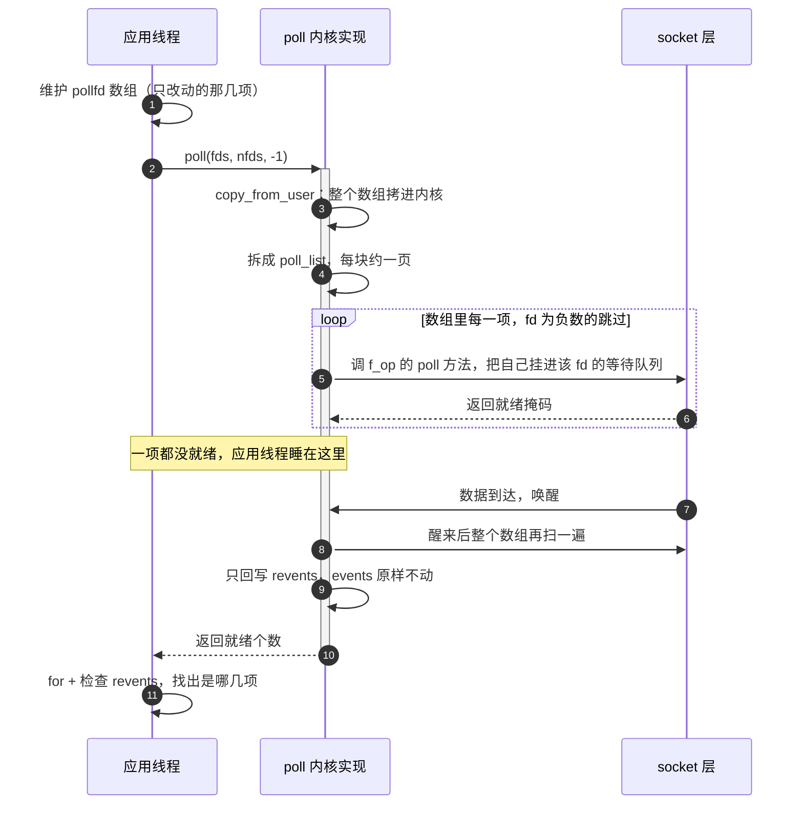

---
tags:
  - Linux
  - IO复用
阅读次数: 0
---

# 13.3 poll 模型

## 1. poll 函数概述

`poll()` 是 [[13.1 IO复用简介|I/O 复用]] 的另一种实现，它是对 [[13.2 select模型|select]] 的改进，解决了 select 的一些限制问题。`poll()` 源自 System V Unix，在 POSIX 标准中也有定义。

它改掉的是 select 的**接口设计**，不是**工作方式**。位图换成数组、监控意图和返回结果分成两个字段，这两点解掉了 1024 上限和每轮重建；至于「拷贝整个集合进内核」和「内核逐项问一遍」，poll 一样不少。

![[图片/3.Linux/13. IO复用/13_3_1.svg|940]]

---

## 2. poll 与 select 的对比

| 特性 | select | poll |
|:---|:---|:---|
| fd 数量限制 | 固定 1024（`FD_SETSIZE`），越界是写坏内存 | 无固定限制，受 `RLIMIT_NOFILE` 约束 |
| fd 集合表示 | 位图 `fd_set` | 动态数组 `pollfd` |
| 事件与返回分离 | 否（`fd_set` 被改写） | 是（`events` 和 `revents` 分开） |
| 每轮是否重建 | 必须 `FD_ZERO` 重来 | 不用，改哪项动哪项 |
| 遇到无效 fd | 整个调用返回 `-1` / `EBADF` | 只有那一项标 `POLLNVAL`，其余照常 |
| 可监控事件类型 | 读 / 写 / 带外 | 更细，含 `POLLRDHUP`、`POLLPRI` 等 |
| 每轮复杂度 | O(n) | O(n) |
| 跨平台性 | 更好（Windows 支持） | 较好（Windows 不原生支持 `poll`） |

倒数第三行在工程上很实在：select 只要集合里混进一个已经 `close` 的 fd，整轮直接失败，而且不告诉你是哪个；poll 会把问题精确标在那一项的 `revents` 上，其他连接不受影响。

---

## 3. poll 函数原型

```c
#include <poll.h>

int poll(struct pollfd *fds, nfds_t nfds, int timeout);
```

### 3.1 参数说明

| 参数 | 说明 |
|:---|:---|
| `fds` | 指向 `pollfd` 结构体数组的指针 |
| `nfds` | 数组中元素的数量 |
| `timeout` | 超时时间（毫秒） |

注意 `nfds` 在这里的含义和 select 的完全不同：select 的是「最大 fd 值 + 1」，poll 的就是**数组长度**。这是接口上真正的改进：成本终于挂在「监控了几个」上，而不是「最大的那个 fd 有多大」上。

### 3.2 返回值

| 返回值 | 含义 |
|:---|:---|
| `> 0` | 就绪的文件描述符数量 |
| `0` | 超时，没有任何 fd 就绪 |
| `-1` | 出错，设置 `errno` |

### 3.3 timeout 参数

| 值 | 效果 |
|:---|:---|
| `-1` | 永久阻塞，直到有 fd 就绪 |
| `0` | 立即返回（非阻塞检查） |
| `> 0` | 等待指定的毫秒数 |

`timeout` 是普通的 `int`，**不会被内核改写**，可以放心地定义在循环外面，这一点比 select 省心。代价是精度只到毫秒，而且上限约 24.8 天（`INT_MAX` 毫秒）。

需要纳秒精度或者要在等待期间原子地换信号掩码，用 `ppoll()`：

```c
int ppoll(struct pollfd *fds, nfds_t nfds,
          const struct timespec *timeout_ts, const sigset_t *sigmask);
```

它和 `pselect()` 解决的是同一个竞态：先检查标志位再进 `poll()` 的话，信号可能正好落在这两步中间，于是标志位置上了但你已经睡进去了。

---

## 4. pollfd 结构体

```c
struct pollfd {
    int   fd;       // 要监控的文件描述符
    short events;   // 请求监控的事件（输入参数）
    short revents;  // 实际发生的事件（输出参数）
};
```

### 4.1 字段说明

| 字段 | 类型 | 说明 |
|:---|:---|:---|
| `fd` | int | 要监控的[[4.1 打开、读取、写入、关闭#1. 文件描述符（File Descriptor）|文件描述符]]，设为负数则忽略该项 |
| `events` | short | 请求监控的事件位掩码，内核**不会**改它 |
| `revents` | short | 内核返回的实际就绪事件，每次调用都被整体覆写 |

`revents` 不需要你手动清零。内核对每一项 `fd >= 0` 的条目直接赋值，对 `fd < 0` 的条目写 `0`。上一轮的结果不会残留到这一轮。

### 4.2 events/revents 可用事件

| 事件常量 | 说明 | events | revents |
|:---|:---|:---|:---|
| `POLLIN` | 有数据可读 | ✓ | ✓ |
| `POLLPRI` | 有紧急数据可读（如 TCP 带外数据） | ✓ | ✓ |
| `POLLOUT` | 可以写数据（不会阻塞） | ✓ | ✓ |
| `POLLRDHUP` | 对端关闭连接或关闭写端（Linux 2.6.17+） | ✓ | ✓ |
| `POLLERR` | 发生错误 | - | ✓ |
| `POLLHUP` | 挂起（如管道写端关闭） | - | ✓ |
| `POLLNVAL` | fd 无效（未打开） | - | ✓ |

> **注意**：`POLLERR`、`POLLHUP`、`POLLNVAL` 只能在 `revents` 中返回，不能在 `events` 中设置。

「不能在 `events` 中设置」的意思不是「设了会报错」，而是**你不设它们也会来**。所以每轮检查必须带上这三个，否则一条出错的连接会一直在 `revents` 里报同一个事件，而你的代码因为只看 `POLLIN` 就一直不处理。事件循环表面上在跑，实际卡在死循环里空转。

### 4.3 三个「关闭」事件的区别

这三个最容易混：

| 事件 | 到底发生了什么 | 还能读吗 | 还能写吗 |
|:---|:---|:---|:---|
| `POLLRDHUP` | 对端关了写方向（发来 FIN），半关闭 | 能，缓冲区里可能还有数据 | 能，对端还在读 |
| `POLLHUP` | 连接两个方向都断了 | 剩余数据还能读完 | 不能，写了会 `EPIPE` |
| `POLLERR` | 连接出错，比如收到 RST | 去 `read` 会拿到具体 `errno` | 不能 |

实际写法是：先把 `POLLIN` 里的数据读干净，再处理关闭。反过来先关连接，缓冲区里的尾包就丢了。详见 [[8.11 TCP连接关闭与异常状态]]。

### 4.4 常用事件组合

```c
// 监控可读事件
fds[i].events = POLLIN;

// 监控可读和可写事件
fds[i].events = POLLIN | POLLOUT;

// 监控所有读相关事件
fds[i].events = POLLIN | POLLPRI | POLLRDHUP;
```

---

## 5. poll 工作流程



这张图揭示的是：**「不用每轮重建」省掉的只是第一行那一步**。中间的拷贝、挂等待队列、逐项询问、醒来重扫，和 select 一模一样。图里唯一变绿的是倒数第三步：内核只碰 `revents`，`events` 保持原样，所以你的数组下一轮可以直接再用。

> **优势**：与 select 不同，poll 的 `events` 字段不会被修改，无需每次重新设置。

---

## 6. 内核那边的 poll_list

`poll()` 进内核后走 `do_sys_poll()`。数组可能很大（几万项），内核不会一次性 `kmalloc` 一整块，而是拆成链表：每个节点装约一页的 `pollfd`，串成 `poll_list`。小数组（约 30 项以内）直接用栈上的空间，连堆分配都省了。

这解释了两件事：

- **poll 的「无上限」是有代价的。** 上限从 1024 变成了内存和 `RLIMIT_NOFILE`，但每次调用要拷贝并遍历的量也跟着涨。监控三万个 fd，每轮就是三万次 `f_op->poll` 调用。
- **数组里的空洞不是免费的。** `fd = -1` 的项内核会跳过 `f_op->poll`，但它仍然占着数组的位置，仍然要被 `copy_from_user` 搬进内核。省掉的只是最贵的那一步，不是全部。

---

## 7. 数组是你自己管的，三个坑

从 select 的位图换成数组，管理责任也从内核转到了应用。这三个坑在下面的示例代码里全都存在：

### 7.1 `nfds` 只增不减

示例里 `nfds` 在分配新槽位时增长，但客户端断开后从来不缩。跑一整天，峰值一万连接、当前只剩十个，`poll()` 每轮照样按一万扫。

### 7.2 空洞越攒越多

用 `fds[i].fd = -1` 标记删除很方便，但空洞不会自己消失。数组变成筛子之后，有效项和总项数差出一个数量级。

### 7.3 边遍历边删

紧凑数组的删除通常用 swap-and-pop：把末尾元素挪过来，长度减一。但这么做会**把一个还没检查过的元素挪到已经走过的下标上**，本轮就漏掉它了。

```c
// 一轮事件处理结束后统一压缩，避免边遍历边改下标
static nfds_t compact(struct pollfd* fds, nfds_t nfds) {
    nfds_t w = 0;                       // w 是写指针，指向下一个有效项该落的位置
    for (nfds_t r = 0; r < nfds; ++r) { // r 是读指针，从头扫到尾
        if (fds[r].fd >= 0) {
            if (w != r) fds[w] = fds[r];
            ++w;
        }
    }
    return w;                           // 新的 nfds，空洞被挤掉了
}
```

这段是标准的双指针原地压缩：读指针一路向前，只有遇到有效项才写到写指针的位置。它有三个好处：

- **放在遍历之后跑**，所以本轮的下标不会被打乱，7.3 那个坑自然绕开了；
- **`if (w != r)` 这个判断**让「没有空洞」的常见情况退化成纯扫描，一次赋值都不做；
- **返回值就是新的 `nfds`**，调用方直接 `nfds = compact(fds, nfds);`，`nfds` 从此会减。

代价是每轮多一次 O(n) 扫描。连接数不多时可以只在「本轮确实关掉了连接」时才调用它。

> [!note] 这三个坑 epoll 都不存在
> 因为监控集合根本不在应用手里。`epoll_ctl(DEL)` 之后内核自己把 epitem 从红黑树摘掉，没有数组、没有空洞、也没有 `nfds`。见 [[13.4 epoll模型#2. epoll 的三个核心对象]]。

---

## 8. 完整示例代码

### 8.1 使用 poll 的 TCP 服务器

```c
#include <stdio.h>
#include <stdlib.h>
#include <string.h>
#include <unistd.h>
#include <sys/socket.h>
#include <poll.h>
#include <netinet/in.h>
#include <arpa/inet.h>

#define PORT 8080
#define MAX_CLIENTS 100
#define BUFFER_SIZE 1024

int main() {  // main 函数作用域开始
    int listen_fd, conn_fd;
    struct pollfd fds[MAX_CLIENTS + 1];  // +1 用于监听套接字
    int nfds = 1;  // 当前监控的 fd 数量
    char buffer[BUFFER_SIZE];
    struct sockaddr_in server_addr, client_addr;
    socklen_t addr_len = sizeof(client_addr);

    // 1. 创建监听套接字
    listen_fd = socket(AF_INET, SOCK_STREAM, 0);
    if (listen_fd < 0) {  // if：创建套接字失败
        perror("socket");
        exit(EXIT_FAILURE);
    }  // if：创建套接字失败结束

    // 设置地址复用
    int opt = 1;
    setsockopt(listen_fd, SOL_SOCKET, SO_REUSEADDR, &opt, sizeof(opt));

    // 2. 绑定地址
    memset(&server_addr, 0, sizeof(server_addr));
    server_addr.sin_family = AF_INET;
    server_addr.sin_addr.s_addr = INADDR_ANY;
    server_addr.sin_port = htons(PORT);

    if (bind(listen_fd, (struct sockaddr*)&server_addr,
             sizeof(server_addr)) < 0) {  // if：绑定失败
        perror("bind");
        exit(EXIT_FAILURE);
    }  // if：绑定失败结束

    // 3. 开始监听
    if (listen(listen_fd, 5) < 0) {  // if：监听失败
        perror("listen");
        exit(EXIT_FAILURE);
    }  // if：监听失败结束

    // 4. 初始化 pollfd 数组
    // 第一个元素用于监听套接字
    fds[0].fd = listen_fd;
    fds[0].events = POLLIN;

    // 初始化其他位置
    for (int i = 1; i <= MAX_CLIENTS; i++) {  // for：初始化客户端槽位开始
        fds[i].fd = -1;  // -1 表示未使用
    }  // for：初始化客户端槽位结束

    printf("服务器启动，监听端口 %d...\n", PORT);

    // 5. 主循环
    while (1) {  // while：服务器主循环开始
        // 调用 poll
        int ret = poll(fds, nfds, -1);  // -1 表示永久等待

        if (ret < 0) {  // if：poll 调用失败
            perror("poll");
            break;
        }  // if：poll 调用失败结束

        // 6. 检查监听套接字
        if (fds[0].revents & POLLIN) {  // if：监听套接字有新连接
            conn_fd = accept(listen_fd,
                            (struct sockaddr*)&client_addr,
                            &addr_len);
            if (conn_fd < 0) {  // if：accept 失败
                perror("accept");
                continue;
            }  // if：accept 失败结束

            printf("新连接: %s:%d, fd=%d\n",
                   inet_ntoa(client_addr.sin_addr),
                   ntohs(client_addr.sin_port),
                   conn_fd);

            // 添加新客户端到 pollfd 数组
            int added = 0;
            for (int i = 1; i <= MAX_CLIENTS; i++) {  // for：查找空闲客户端槽位开始
                if (fds[i].fd < 0) {  // if：找到空闲槽位
                    fds[i].fd = conn_fd;
                    fds[i].events = POLLIN;
                    if (i >= nfds) {  // if：新槽位超出当前监控数量
                        nfds = i + 1;
                    }  // if：更新 nfds 结束
                    added = 1;
                    break;
                }  // if：找到空闲槽位结束
            }  // for：查找空闲客户端槽位结束

            if (!added) {  // if：没有空闲槽位
                printf("连接数已满，拒绝连接\n");
                close(conn_fd);
            }  // if：没有空闲槽位结束
        }  // if：监听套接字有新连接结束

        // 7. 检查所有客户端套接字
        for (int i = 1; i < nfds; i++) {  // for：遍历客户端套接字开始
            if (fds[i].fd < 0) {  // if：跳过未使用槽位
                continue;
            }  // if：跳过未使用槽位结束

            // 检查可读事件
            if (fds[i].revents & POLLIN) {  // if：客户端 fd 可读
                ssize_t bytes_read = read(fds[i].fd, buffer, BUFFER_SIZE - 1);

                if (bytes_read <= 0) {  // if：客户端断开或读取失败
                    // 客户端断开连接
                    printf("客户端断开: fd=%d\n", fds[i].fd);
                    close(fds[i].fd);
                    fds[i].fd = -1;
                } else {  // else：成功读取到客户端数据
                    // 回显数据
                    buffer[bytes_read] = '\0';
                    printf("收到数据 [fd=%d]: %s", fds[i].fd, buffer);
                    write(fds[i].fd, buffer, bytes_read);
                }  // if/else：处理 read 返回值结束
            }  // if：客户端 fd 可读结束

            // 检查错误事件
            if (fds[i].revents & (POLLERR | POLLHUP | POLLNVAL)) {  // if：客户端 fd 出错
                printf("fd=%d 发生错误，关闭连接\n", fds[i].fd);
                close(fds[i].fd);
                fds[i].fd = -1;
            }  // if：客户端 fd 出错结束
        }  // for：遍历客户端套接字结束
    }  // while：服务器主循环结束

    close(listen_fd);
    return 0;
}  // main 函数作用域结束
```

### 8.2 这段代码的三处关键设计

**`fds[0]` 固定给 `listen_fd`，客户端从下标 1 开始。** 这样第 7 步的循环可以直接从 `i = 1` 起步，不用在循环里判断「这一项是不是监听 fd」。位置本身携带了含义，是数组结构才有的便利。

**`fds[i].fd = -1` 而不是把后面的元素前移。** 断开一条连接时如果立刻压缩数组，本轮遍历的下标就乱了（见 7.3）。置 `-1` 是最省事的延迟删除：内核认得这个约定，会跳过这一项。代价就是空洞会积累，需要在事件处理结束后调用上面那个 `compact()`。

**第 7 步先处理 `POLLIN` 再处理错误事件，顺序是对的。** 对端异常断开时 `POLLIN | POLLERR` 可能同时置位，接收缓冲区里还留着最后几个字节。先读后关才不会丢尾包。不过这里有个真实 bug：上面那个分支已经 `close` 并把 `fd` 置 `-1` 了，下面的错误分支还会再 `close(-1)` 一次。`close(-1)` 本身只是返回 `EBADF`，但要是 fd 编号已经被新连接复用，关掉的就是别人的连接了。**处理完一项之后应该 `continue`。**

### 8.3 还差什么

| 简化处 | 会怎样 | 该怎么做 |
|:---|:---|:---|
| `ret < 0` 直接 `break` | 一次 `EINTR` 就把整个服务停了 | `if (errno == EINTR) continue;` 之后再判真错误 |
| 关闭连接后没 `continue` | 同一轮里对同一个下标 `close` 两次 | 处理完就 `continue` 下一项 |
| `nfds` 只增不减 | 连接断完仍按历史峰值扫 | 事件处理后调用 7.3 的 `compact()` |
| `listen_fd` 只 `accept` 一次 | 一轮只收一个连接，高峰期建连变慢 | 循环 `accept` 到 `EAGAIN`（需非阻塞 fd） |
| `write()` 返回值没检查 | 短写丢数据；对端已关时 `SIGPIPE` 杀进程 | 处理短写 + 忽略 `SIGPIPE`，见 [[8.12 非阻塞connect与健壮收发#5. 健壮发送：处理短写|健壮发送]] |

---

## 9. poll 的优缺点

### 9.1 优点

| 优点 | 说明 |
|:---|:---|
| **无固定 fd 数量限制** | 上限变成内存和 `RLIMIT_NOFILE` |
| **events/revents 分离** | 数组可以复用，不用每轮重建 |
| **成本挂在个数上** | 不像 select 那样跟最大 fd 值走 |
| **更丰富的事件类型** | `POLLRDHUP` 能区分半关闭 |
| **无效 fd 不拖垮整轮** | 只标 `POLLNVAL`，其他连接照常 |

### 9.2 缺点

| 缺点 | 说明 |
|:---|:---|
| **线性扫描** | 内核每轮遍历整个数组，O(n) |
| **数据拷贝** | 每次调用整个数组进出内核 |
| **无法直接获取就绪 fd** | 用户态仍要扫一遍找 `revents` 非零的项 |
| **数组要自己维护** | 空洞、`nfds` 收缩、删除时的下标问题 |
| **跨平台性稍差** | Windows 不原生支持 |

### 9.3 时间复杂度

每轮的开销是三项，全部随 `nfds` 增长：

| 段 | 干什么 |
|:---|:---|
| `copy_from_user` | 整个数组拷进内核，包括 `fd = -1` 的空洞 |
| `do_poll` 遍历 | 逐项调 `f_op->poll`，挂等待队列 |
| 用户态遍历 | 扫一遍找 `revents` 非零的项 |

和 select 一样是 O(n)，差别只在 n 的含义：select 的 n 是「最大 fd 值」，poll 的 n 是「监控个数」。**连接稀疏时 poll 明显更划算，连接稠密时两者一样慢。**

---

## 10. poll 与 select 的选择建议

| 场景 | 建议 |
|:---|:---|
| 需要跨平台（包括 Windows） | 选择 select |
| fd 数量可能超过 1024 | 选择 poll |
| fd 值稀疏（比如程序前面开了很多文件） | 选择 poll |
| 需要区分半关闭（`POLLRDHUP`） | 选择 poll |
| 集合里可能混入已关闭的 fd | 选择 poll，不会整轮失败 |
| Linux 高并发服务 | 选择 [[13.4 epoll模型\|epoll]] |

---

## 11. 关键要点

1. **poll 改的是接口，不是工作方式**：解掉了 1024 上限和每轮重建，拷贝和线性扫描原样保留。
2. **`nfds` 是数组长度**，不是「最大 fd + 1」；成本终于跟监控个数走。
3. **`events` 内核不动，`revents` 每轮整体覆写**，所以数组能复用，也不用手动清零。
4. **`POLLERR` / `POLLHUP` / `POLLNVAL` 不用申请也会来**，每轮必须检查，否则事件循环会空转。
5. **`POLLRDHUP` 是半关闭，`POLLHUP` 是全断**；先把数据读干净再关连接。
6. **数组的三个坑**：`nfds` 只增不减、空洞积累、边遍历边删；用遍历后统一压缩解决。
7. **`timeout` 是 `int` 毫秒且不会被改写**，比 select 省心，但精度只到毫秒。

---

## 12. 相关笔记

- [[13.1 IO复用简介]] - I/O 模型与 I/O 复用的定位
- [[13.2 select模型]] - 位图、值-结果参数与三段 O(n)
- [[13.4 epoll模型]] - 监控集合留在内核，拷贝和线性扫描一起消失
- [[8.11 TCP连接关闭与异常状态]] - FIN、RST 与半关闭的处理顺序
- [[8.12 非阻塞connect与健壮收发]] - 短写、`SIGPIPE` 与健壮收发
