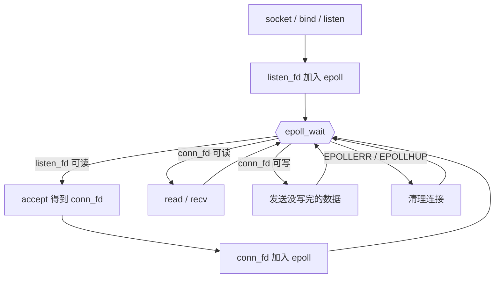
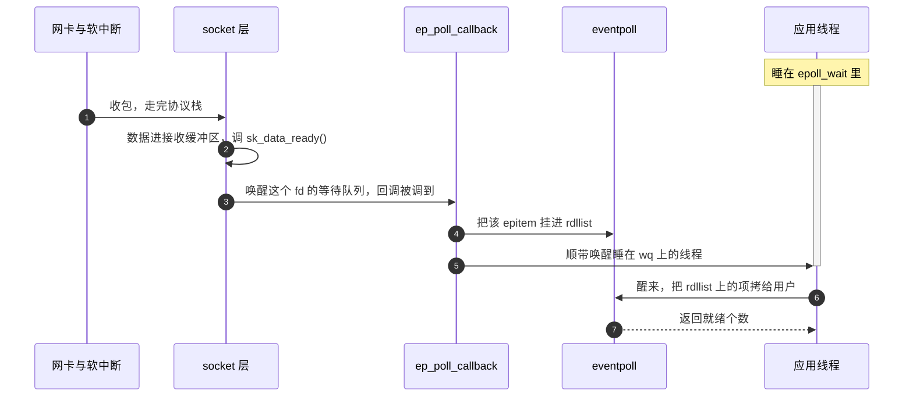
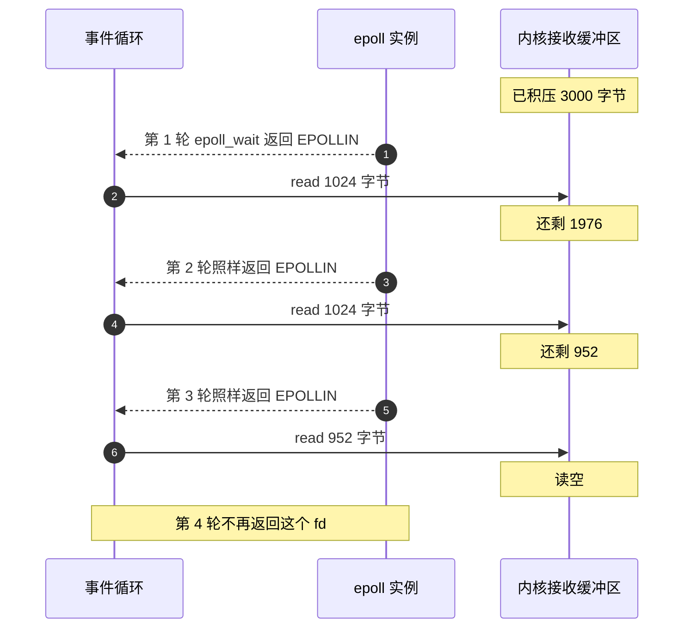
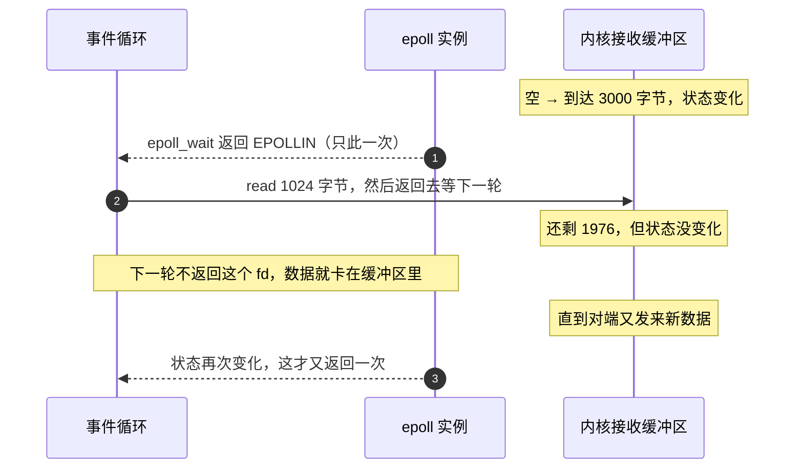
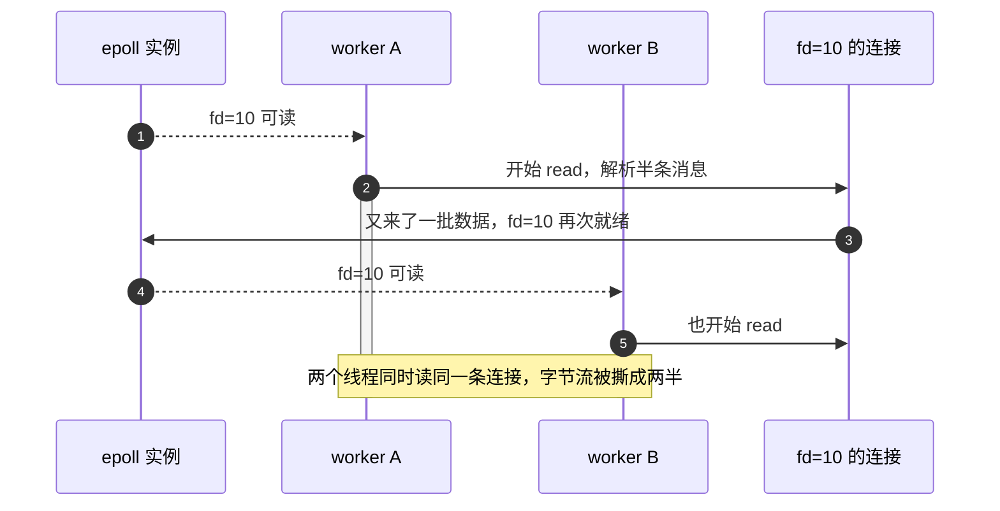
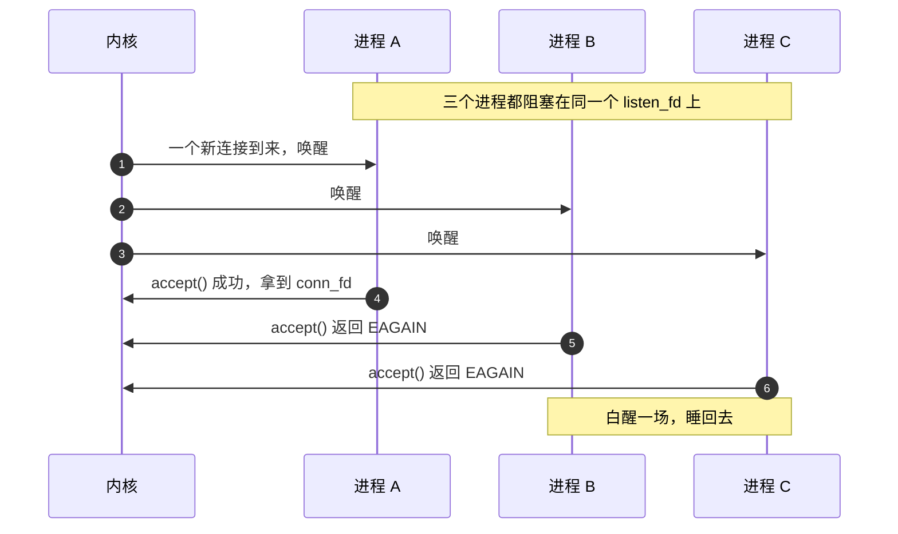
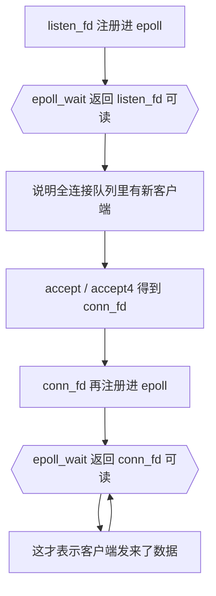
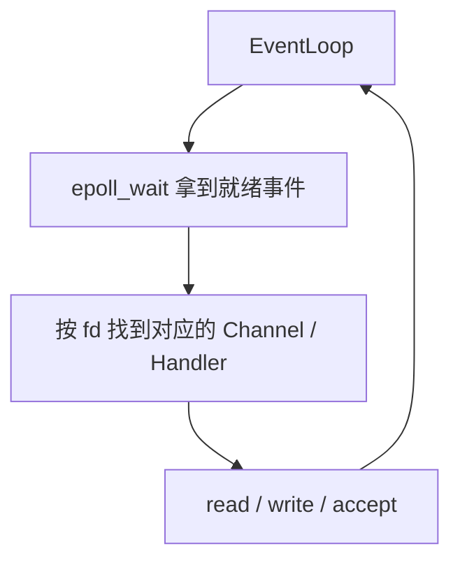
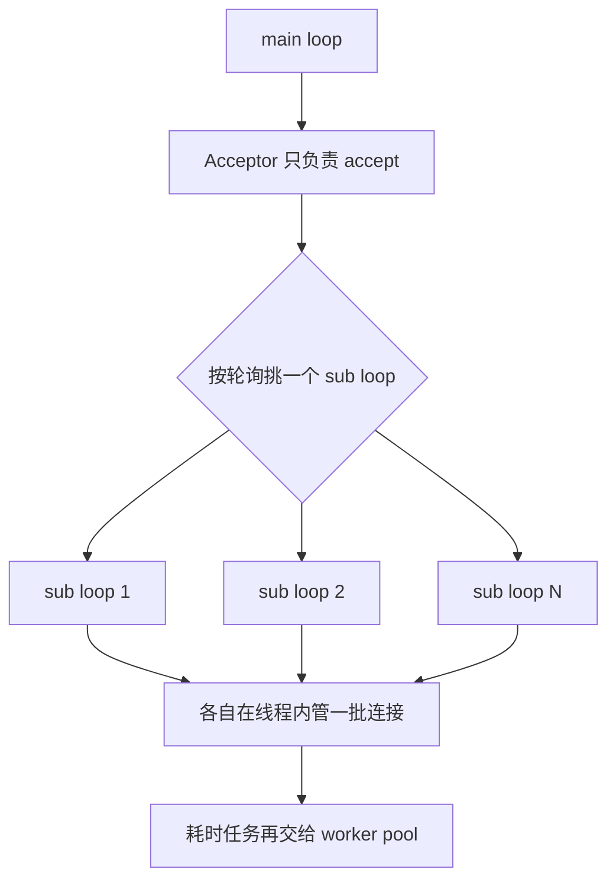

---
tags:
  - Linux
  - IO复用
阅读次数: 0
---

# 13.4 epoll 模型

> [!tip] 交互动画
> epoll 相关过程可视化（与 select 对照 · LT/ET 触发语义 · 非阻塞读到 EAGAIN）：
> [▶ select 与 epoll 对比](<../../图片/HTML/3.Linux/13. IO复用/13.2.1 select与epoll对比动画.html>)　·　[▶ LT 与 ET](<../../图片/HTML/3.Linux/13. IO复用/13.4.1 epoll LT与ET动画.html>)　·　更多见 [[网络编程·动画合集]]
> 对比场景：[select 工作流](<../../图片/HTML/3.Linux/13. IO复用/13.2.1 select与epoll对比动画.html#scene=select>) · [epoll 工作流](<../../图片/HTML/3.Linux/13. IO复用/13.2.1 select与epoll对比动画.html#scene=epoll>) · [对照总结](<../../图片/HTML/3.Linux/13. IO复用/13.2.1 select与epoll对比动画.html#scene=compare>)
> LT/ET 场景：[LT 水平触发](<../../图片/HTML/3.Linux/13. IO复用/13.4.1 epoll LT与ET动画.html#scene=lt>) · [ET 边缘触发](<../../图片/HTML/3.Linux/13. IO复用/13.4.1 epoll LT与ET动画.html#scene=et>) · [读到 EAGAIN](<../../图片/HTML/3.Linux/13. IO复用/13.4.1 epoll LT与ET动画.html#scene=loop>) · [对照](<../../图片/HTML/3.Linux/13. IO复用/13.4.1 epoll LT与ET动画.html#scene=compare>)

## 1. epoll 概述

`epoll` 是 Linux 特有的 [[13.1 IO复用简介|I/O 复用]] 机制，从 Linux 2.6 内核开始引入。相比 [[13.2 select模型|select]] 和 [[13.3 poll模型|poll]]，epoll 在处理大量并发连接时具有显著的性能优势，是 **Linux 高性能网络编程的首选方案**。

> [!note] 核心定位
> `epoll` 解决的是：**如何让少量线程高效等待大量 fd 的就绪事件**。
>
> 它不是严格意义上的异步 I/O。`epoll_wait()` 通知的是“可以读/写”，真正的 `read()` / `write()` 仍由应用程序完成。

### 1.1 epoll 的核心改进

| 问题 | select/poll | epoll |
|:---|:---|:---|
| fd 数量限制 | `select` 默认受 `FD_SETSIZE` 限制，`poll` 无固定限制但仍线性扫描 | 无固定 `FD_SETSIZE` 限制，受系统资源限制 |
| 监控集合传递 | 每次调用都传入完整 fd 集合 | 通过 `epoll_ctl()` 增删改，监控集合长期保存在内核 |
| 事件检测 | 通常需要遍历所有 fd | 就绪事件进入就绪链表，`epoll_wait()` 返回就绪列表 |
| 返回就绪 fd | 需要用户态再次遍历查找 | 直接返回就绪事件数组 |

> [!warning] 不要机械背“epoll 永远 O(1)”
> 更准确的说法是：`epoll` 避免了 `select/poll` 每次按**总连接数**线性扫描的主要成本，`epoll_wait()` 的返回处理通常主要与**就绪事件数量**相关。
>
> fd 的增删改仍有管理成本，例如内核需要维护监控集合。

---

## 2. epoll 的三个核心对象

从工程视角看，epoll 服务器里通常有三类对象：

| 对象 | 作用 |
|:---|:---|
| `epoll_fd` / `epfd` | epoll 实例，对应内核中的事件表 |
| `listen_fd` | 监听新连接 |
| `conn_fd` | 已建立连接，用于数据收发 |

核心流程：



### 2.1 epfd 背后是一个 struct eventpoll

`epfd` 本身只是个句柄，真正的东西在内核里的 `struct eventpoll`。把它拆开看，只有三样：

![[图片/3.Linux/13. IO复用/13_4_2.svg|940]]

| 成员 | 是什么 | 谁在用 |
|:---|:---|:---|
| `rbr` | 一棵红黑树，每个被监控的 fd 对应一个 `epitem` 节点 | `epoll_ctl()` 的增删改，`O(log n)` |
| `rdllist` | 一条就绪链表，只挂已经就绪的 `epitem` | `epoll_wait()` 只碰这一条 |
| `wq` | 等待队列，就绪链表为空时调用线程睡在这儿 | 由回调负责唤醒 |

三个系统调用的分工也就清楚了：

| 调用 | 实际做了什么 |
|:---|:---|
| `epoll_create1()` | 建一个 `eventpoll`，这时树和链表都是空的 |
| `epoll_ctl(ADD)` | 建 `epitem` 插进红黑树，**顺手把回调 `ep_poll_callback` 挂到这个 fd 自己的等待队列上** |
| `epoll_wait()` | 看 `rdllist` 空不空：空就睡在 `wq` 上，不空就把就绪项搬给用户 |

加粗那半句是 epoll 和 select/poll 真正的分水岭。select/poll **每一轮调用**都要把自己挂进每个 fd 的等待队列，返回前再全部摘掉；epoll 在 `epoll_ctl()` 时挂一次，此后长期有效。注册成本从「每轮 × n」变成了「一次性」。

### 2.2 数据到达那一刻，谁调了谁



这张图要说的是：**全程没有任何一步在遍历监控集合。** 是「谁有事谁自己举手」，不是「挨个问一遍谁有事」。所以 `epoll_wait()` 的成本跟就绪个数走，跟总连接数无关。它比 [[13.2 select模型|select]]、[[13.3 poll模型|poll]] 适合高并发，原因就在这里，不在「用了红黑树」——红黑树只加速 `epoll_ctl()` 的增删改。

---

## 3. epoll 的三个核心函数

epoll 使用三个系统调用完成 I/O 复用：

```c
#include <sys/epoll.h>

int epoll_create(int size);
int epoll_create1(int flags);

int epoll_ctl(int epfd, int op, int fd,
              struct epoll_event *event);

int epoll_wait(int epfd,
               struct epoll_event *events,
               int maxevents,
               int timeout);
```

记忆方式：

- `epoll_create1()`：创建 epoll 实例
- `epoll_ctl()`：增删改监听 fd
- `epoll_wait()`：等待就绪事件

对照 [[13.2 select模型|select]] 看更清楚：select 把「注册」和「等待」压在同一个系统调用里，所以每轮都要重来一遍；epoll 把它们拆成了 `ctl` 和 `wait` 两个调用，注册的成本才有机会被摊掉。

---

## 4. epoll_create / epoll_create1 - 创建 epoll 实例

```c
int epoll_create(int size);
int epoll_create1(int flags);  // Linux 2.6.27+
```

### 4.1 参数说明

| 参数 | 说明 |
|:---|:---|
| `size` | 提示内核预期监控的 fd 数量，Linux 2.6.8 后被忽略，但必须 `> 0` |
| `flags` | `epoll_create1()` 的标志，如 `EPOLL_CLOEXEC` |

### 4.2 返回值

- **成功**：返回 epoll 实例的[[4.1 打开、读取、写入、关闭#1. 文件描述符（File Descriptor）|文件描述符]]，即 `epfd`
- **失败**：返回 `-1`，设置 `errno`

### 4.3 示例

```c
int epfd = epoll_create1(EPOLL_CLOEXEC);
if (epfd < 0) {
    perror("epoll_create1");
    exit(EXIT_FAILURE);
}
```

> [!tip]
> 新代码优先使用 `epoll_create1(EPOLL_CLOEXEC)`，避免 fd 在 `exec` 后泄漏到子进程。

使用完毕后需要 `close(epfd)` 关闭 epoll 实例。

---

## 5. epoll_ctl - 管理监控列表

```c
int epoll_ctl(int epfd, int op, int fd,
              struct epoll_event *event);
```

### 5.1 参数说明

| 参数 | 说明 |
|:---|:---|
| `epfd` | epoll 实例的文件描述符 |
| `op` | 操作类型 |
| `fd` | 要操作的目标文件描述符 |
| `event` | 指向 `epoll_event` 结构体的指针 |

### 5.2 操作类型

| 操作 | 说明 |
|:---|:---|
| `EPOLL_CTL_ADD` | 向 epoll 实例添加新的 fd |
| `EPOLL_CTL_MOD` | 修改已注册 fd 的监控事件 |
| `EPOLL_CTL_DEL` | 从 epoll 实例删除 fd |

### 5.3 返回值

- **成功**：返回 `0`
- **失败**：返回 `-1`，设置 `errno`

---

## 6. epoll_event 结构体

```c
struct epoll_event {
    uint32_t     events;    // 监控的事件类型
    epoll_data_t data;      // 用户数据
};

typedef union epoll_data {
    void    *ptr;     // 用户自定义指针
    int      fd;      // 文件描述符
    uint32_t u32;     // 32位整数
    uint64_t u64;     // 64位整数
} epoll_data_t;
```

### 6.1 常用事件

| 事件 | 说明 |
|:---|:---|
| `EPOLLIN` | 有数据可读 |
| `EPOLLOUT` | 可以写数据 |
| `EPOLLPRI` | 有紧急数据可读 |
| `EPOLLERR` | 发生错误 |
| `EPOLLHUP` | 挂起，对端关闭或异常 |
| `EPOLLRDHUP` | 对端关闭连接或关闭写端，Linux 2.6.17+ |
| `EPOLLET` | 设置为边缘触发模式（Edge Triggered） |
| `EPOLLONESHOT` | 只监控一次事件，触发后需要重新注册 |

### 6.2 示例：注册监控事件

```c
struct epoll_event ev;
ev.events = EPOLLIN | EPOLLRDHUP;
ev.data.fd = sockfd;

if (epoll_ctl(epfd, EPOLL_CTL_ADD, sockfd, &ev) < 0) {
    perror("epoll_ctl");
    exit(EXIT_FAILURE);
}
```

> [!tip] `data.fd` 与 `data.ptr`
> 教学代码常用 `data.fd` 保存文件描述符。真实 C++ 网络库常在 `data.ptr` 中保存连接对象指针，因此连接对象生命周期必须非常清楚，避免悬空指针。

---

## 7. epoll_wait - 等待事件

```c
int epoll_wait(int epfd,
               struct epoll_event *events,
               int maxevents,
               int timeout);
```

### 7.1 参数说明

| 参数 | 说明 |
|:---|:---|
| `epfd` | epoll 实例的文件描述符 |
| `events` | 用于接收就绪事件的数组 |
| `maxevents` | `events` 数组的最大容量 |
| `timeout` | 超时时间，单位毫秒 |

### 7.2 timeout 参数

| 值 | 效果 |
|:---|:---|
| `-1` | 永久阻塞，直到有事件就绪 |
| `0` | 立即返回，非阻塞检查 |
| `> 0` | 等待指定的毫秒数 |

### 7.3 返回值

| 返回值 | 含义 |
|:---|:---|
| `> 0` | 就绪的事件数量 |
| `0` | 超时，没有事件就绪 |
| `-1` | 出错，设置 `errno` |

### 7.4 示例

```c
#define MAX_EVENTS 64
struct epoll_event events[MAX_EVENTS];

int nready = epoll_wait(epfd, events, MAX_EVENTS, -1);
if (nready < 0) {
    if (errno == EINTR) {
        // 被信号中断，可以继续等待
    } else {
        perror("epoll_wait");
        exit(EXIT_FAILURE);
    }
}

for (int i = 0; i < nready; ++i) {
    int fd = events[i].data.fd;
    if (events[i].events & EPOLLIN) {
        // 处理可读事件
    }
}
```

### 7.5 maxevents 怎么选

`epoll_wait()` 一次最多搬 `maxevents` 个事件出来，就绪链表上没搬完的留到下一轮。所以这个值**不影响正确性，只影响批量大小**：

- 太小（比如 8）：就绪事件多时要多跑几轮，多几次系统调用；
- 太大（比如 65536）：`events` 数组白占内存，而且一轮里处理的事件越多，排在后面的连接等得越久。

常见取值 64 到 1024。有个现成的判断信号：**`epoll_wait()` 的返回值经常等于 `maxevents`**，说明事件一直搬不完，可以调大。

> [!danger] `maxevents` 不能大于 `events` 数组的容量
> 内核会照着 `maxevents` 往数组里写，传大了就是缓冲区越界。这两个数字应该来自同一个常量。

### 7.6 epoll_pwait 与 signalfd

和 `pselect()` / `ppoll()` 同理，`epoll_pwait()` 多一个 `sigmask`，原子地完成「换信号掩码 → 等待 → 换回来」：

```c
int epoll_pwait(int epfd, struct epoll_event *events,
                int maxevents, int timeout, const sigset_t *sigmask);
```

epoll 生态里更常见的做法是 `signalfd`：把信号变成一个可读的 fd 丢进 epoll，和普通连接事件走同一条处理路径，就不用再纠结信号处理函数里哪些函数可以调。定时器（`timerfd`）和跨线程唤醒（`eventfd`）用的是同一个思路，见 [[13.7 eventfd、timerfd与跨线程唤醒]]。

---

## 8. 触发模式：LT 与 ET

`epoll` 支持两种事件触发模式：

| 模式 | 触发条件 | 编程要求 |
|:---|:---|:---|
| LT 水平触发 | 只要 fd 仍然可读/可写，就会反复通知 | 可以一次只处理一部分 |
| ET 边缘触发 | fd 状态发生变化时通知一次 | 必须非阻塞并循环处理到 `EAGAIN` |

### 8.1 水平触发（Level Triggered, LT）

LT 是默认模式，与 `select` / `poll` 的行为类似。只要 fd 上还有没处理完的数据，每一轮 `epoll_wait()` 都会把它报出来，所以一次只读一部分也不会丢事件，编程负担最小。

假设接收缓冲区里有 3000 字节，而你的 `buf` 只有 1024：



图里没写出来的是内核那半步：每轮把 `epitem` 交给用户之后，LT 会**再回填检查一次**这个 fd 是否仍然就绪，还就绪就把它重新挂回 `rdllist`。上面 2.1 那张图的 D 区画的就是这一步。

记忆：**LT 是“只要还有数据，就一直提醒你”。**

### 8.2 边缘触发（Edge Triggered, ET）

ET 需要设置 `EPOLLET` 标志。它只在**状态发生变化**时通知一次，比如接收缓冲区从空变成非空。没读干净的部分不会再被提醒，只能等下一批新数据到达时顺带被带出来。

同样是 3000 字节积压、`buf` 只有 1024 的场景，ET 下会变成这样：



卡住的这 1976 字节没有丢，它们还在内核缓冲区里；丢的是**通知**。如果对端正在等你的响应而不再发数据，这条连接就此僵死。所以 ET 下的读法只有一种：循环读到 `EAGAIN`（见 8.4）。

机制上的原因在 2.1 那张图的 D 区：ET 把 `epitem` 交给用户之后**不做回填检查**，也就不会重新挂回 `rdllist`。省掉的正是 LT 每轮都要做的那次「还就绪吗」。

记忆：**ET 是“只提醒一次，你必须一次处理到没数据”。**

### 8.3 为什么 ET 必须配合非阻塞 read

要理解 ET 为什么容易写错，需要先看 socket 数据到底在哪里。

网络数据到达后，数据不是直接交给你的 C++ 代码，而是先进入内核里的 socket 接收缓冲区。`read()` / `recv()` 是一次系统调用，它做的事情是：把这个 fd 对应的内核接收缓冲区中的数据，拷贝到用户态的 `buf` 中。

更完整的缓冲区背景可参考 [[8.7 IO缓冲]]。


所以，“fd 是否可读”本质上是在问：**内核接收缓冲区里是否有数据可以搬给用户态**。


阻塞 fd 和非阻塞 fd 的关键区别在于：缓冲区为空时，`read()` / `recv()` 怎么反应。

| 场景 | 阻塞 fd | 非阻塞 fd | 对 ET 的意义 |
|:---|:---|:---|:---|
| 接收缓冲区有数据 | 立即返回读到的字节数 | 立即返回读到的字节数 | 两者都能正常读取 |
| 接收缓冲区为空 | 线程睡眠等待新数据，调用不返回 | 返回 `-1`，并设置 `errno = EAGAIN` / `EWOULDBLOCK` | 非阻塞才能判断“已经读空，可以退出循环” |

> [!note]
> `EAGAIN` / `EWOULDBLOCK` 在这里不是连接错误，而是非阻塞 IO 给你的“读空边界”。

ET + 阻塞 fd + `while (read/recv)` 的卡住过程如下：

```mermaid
sequenceDiagram
    autonumber
    participant Loop as 事件循环线程
    participant Buf as 内核接收缓冲区
    participant Other as 其他连接

    Buf->>Loop: 数据到达，ET 触发一次
    Loop->>Buf: read() 读到数据
    Loop->>Buf: read() 又读到数据
    Note over Buf: 缓冲区已被读空
    Loop->>Buf: 再 read() 一次
    activate Loop
    Note over Loop,Buf: 阻塞 fd：不返回 EAGAIN，线程直接睡在这里
    Note over Other: 事件堆在 epoll 里，没人回来处理
    deactivate Loop
```

时序图里最要紧的是那段 `activate`：**卡住的不是这一条连接，是整个事件循环所在的线程。** 单线程 Reactor 下，这一刻服务器对所有连接都失去了响应，而代码里看不出任何异常：`read()` 就是普通的一行调用。

> [!warning] ET 的致命错误
> 阻塞 fd 读空后不会返回 `EAGAIN` 让你 `break`，而是直接把当前线程挂起。
>
> 对单线程 Reactor 来说，这意味着整个事件循环被卡住，其他连接也无法继续处理。

记忆：**ET 要一直读到内核接收缓冲区为空；非阻塞 fd 用 `EAGAIN` / `EWOULDBLOCK` 告诉你“这一轮可以停了”。**

### 8.4 ET 模式的正确读法

因此，ET 下的读取代码通常不是“读一次”，而是一直读到 `EAGAIN` 为止。

```cpp
while (true) {
    ssize_t n = recv(fd, buf, sizeof(buf), 0);

    if (n > 0) {
        // 处理数据
    } else if (n == 0) {
        // 对端关闭
        close(fd);
        break;
    } else if (errno == EAGAIN || errno == EWOULDBLOCK) {
        break;  // 已经读空
    } else if (errno == EINTR) {
        continue;
    } else {
        close(fd);
        break;
    }
}
```

> [!warning] 高频面试点
> ET 模式必须使用非阻塞 fd，并循环读写到 `EAGAIN` / `EWOULDBLOCK`。
>
> 如果 fd 是阻塞的，循环读到没数据时会卡死事件循环；如果只读一次，缓冲区中剩余数据可能不会再次触发事件。

### 8.5 `errno` 从哪里来？

`errno` 是 C/POSIX 提供的错误码变量，声明在 `<errno.h>` 中；C++ 中也可以包含 `<cerrno>`。

当 `recv()`、`read()`、`accept()`、`write()` 这类系统调用失败时，通常会返回 `-1`，并把失败原因写入 `errno`。所以代码里不是直接判断 `recv()` 返回了 `EAGAIN`，而是先判断返回值小于 `0`，再看 `errno` 里记录的具体原因。

```cpp
#include <errno.h>

ssize_t n = recv(fd, buf, sizeof(buf), 0);
if (n < 0) {
    if (errno == EAGAIN || errno == EWOULDBLOCK) {
        // 非阻塞 fd 暂时无数据可读
    }
}
```

> [!note]
> 现代 Linux/glibc 中，`errno` 在线程内是独立的，可以把它理解为“当前线程最近一次系统调用失败的原因”。

### 8.6 非阻塞 IO 常见 `errno`

| errno | 常见场景 | 含义 | 常见处理 |
|:---|:---|:---|:---|
| `EAGAIN` | `read` / `recv` / `accept` / `write` | 非阻塞操作暂时不能完成，例如没有数据可读、没有连接可接收、发送缓冲区满 | 正常情况，退出当前循环，等待下一次 `epoll` 通知 |
| `EWOULDBLOCK` | `read` / `recv` / `accept` / `write` | 操作如果继续执行会阻塞；Linux 上通常和 `EAGAIN` 值相同 | 通常和 `EAGAIN` 一起判断 |
| `EINTR` | 多数系统调用 | 系统调用被信号中断 | 一般 `continue` 重试 |
| `ECONNRESET` | `read` / `recv` / `write` | 对端异常断开，TCP 收到 RST | 关闭 fd，并从 `epoll` 中移除 |
| `ETIMEDOUT` | socket IO | 连接或传输超时 | 关闭 fd，记录错误 |
| `ECONNABORTED` | `accept` | 已完成的连接在 `accept` 前被中止 | 通常忽略该连接，继续处理其他连接 |
| `EMFILE` | `accept` / `socket` / `open` | 当前进程打开的 fd 数达到上限 | 记录错误，释放资源或使用 idle fd 技巧 |
| `ENFILE` | `accept` / `socket` / `open` | 系统级 fd 数达到上限 | 记录错误，通常需要系统层面处理 |
| `EBADF` | `read` / `write` / `epoll_ctl` | fd 无效，可能已经关闭或未正确初始化 | 检查逻辑错误，避免重复关闭或误用 fd |
| `EINVAL` | 多数系统调用 | 参数非法，或 fd 状态不符合调用要求 | 检查调用参数 |
| `ENOTSOCK` | socket API | 传入的 fd 不是 socket | 检查 fd 来源 |
| `EPIPE` | `write` / `send` | 对端已关闭，继续写入；可能伴随 `SIGPIPE` | 关闭 fd，通常还要忽略或处理 `SIGPIPE` |
| `ENOBUFS` / `ENOMEM` | `send` / `accept` 等 | 内核缓冲区或内存不足 | 记录错误，稍后重试或降载 |

> [!tip]
> `read()` / `recv()` 返回 `0` 表示对端正常关闭连接，这不是 `errno`。

### 8.7 LT vs ET 对比

| 特性 | LT（水平触发） | ET（边缘触发） |
|:---|:---|:---|
| 默认模式 | ✓ | ✗ |
| 编程难度 | 简单 | 较复杂 |
| 性能 | 较低 | 更高 |
| 必须非阻塞 | 否 | 是 |
| 必须循环读写 | 否 | 是 |
| 读空边界 | 可以下次继续提醒 | 必须本轮读到 `EAGAIN` / `EWOULDBLOCK` |
| 阻塞 fd 风险 | 一次没读完通常还会继续提醒，但仍可能拖慢线程 | 读空后容易卡在阻塞 `read()` / `recv()` 上 |
| 事件丢失风险 | 无 | 有（处理不当时） |

---

## 9. 错误事件处理

`epoll_wait()` 返回事件时，不应该只判断 `EPOLLIN` 和 `EPOLLOUT`。真实服务至少要处理：

| 事件 | 含义 | 建议处理 |
|:---|:---|:---|
| `EPOLLERR` | fd 发生错误 | 用 `getsockopt(SO_ERROR)` 取错误，关闭连接 |
| `EPOLLHUP` | 对端挂断 | 关闭连接 |
| `EPOLLRDHUP` | 对端关闭写方向 | 读完剩余数据后关闭，或进入半关闭逻辑 |

示例：

```cpp
if (ev.events & (EPOLLERR | EPOLLHUP | EPOLLRDHUP)) {
    int err = 0;
    socklen_t len = sizeof(err);
    getsockopt(fd, SOL_SOCKET, SO_ERROR, &err, &len);

    epoll_ctl(epfd, EPOLL_CTL_DEL, fd, nullptr);
    close(fd);
    continue;
}
```

相关关闭状态可参考 [[8.11 TCP连接关闭与异常状态]]。

---

## 10. EPOLLONESHOT

多线程 epoll 服务器中，如果多个线程都可能处理同一个 fd，可能出现同一连接被并发处理的问题。

没有 `EPOLLONESHOT` 时，可能出现这种情况：



图里两条 `activate` 是重叠的，这就是问题所在：TCP 是字节流，两个线程各读走一段，谁也拼不出完整的消息。更糟的情况是 A 判断连接该关了就 `close(10)`，而 B 手里还拿着这个 fd 在读；此时 fd 号可能已经被新连接复用。

这样会导致两个线程同时读写同一个连接，容易出现数据读取顺序混乱、连接状态被改坏、一个线程关闭 fd 而另一个线程还在使用等问题。

`EPOLLONESHOT` 的语义是：**事件触发一次后，这个 fd 会从活跃通知中临时失效，必须重新 `epoll_ctl(..., EPOLL_CTL_MOD, ...)` 才会继续触发。**

可以把它理解成：**这个 fd 触发一次后自动暂停，等 worker 处理完再手动恢复监听。**

典型流程：

```mermaid
sequenceDiagram
    autonumber
    participant EP as epoll 实例
    participant Loop as 事件线程
    participant W as worker 线程
    participant B as 其他 worker

    EP-->>Loop: fd=10 可读（带 EPOLLONESHOT）
    Note over EP: 该 fd 就此失效，不再产生事件
    Loop->>W: 把 fd=10 交给线程池
    W->>W: read、解析、更新连接状态
    EP--xB: 这期间不会把 fd=10 派给别的 worker
    W->>EP: epoll_ctl(MOD) 重新注册 EPOLLONESHOT
    EP-->>Loop: 之后才会再次报告 fd=10
```

图里那条打叉的线是 `EPOLLONESHOT` 的全部价值：从触发到重新 `MOD` 的这段窗口里，这个 fd 在 epoll 眼里是不存在的。

这样可以保证：**同一时刻，一个 fd 最多只被一个 worker 处理。**

核心代码形态：

```cpp
event.events = EPOLLIN | EPOLLET | EPOLLONESHOT | EPOLLRDHUP;
event.data.fd = fd;
epoll_ctl(epfd, EPOLL_CTL_MOD, fd, &event);
```

它适合和 [[12.7 条件变量与线程池|线程池]] 配合，但会增加状态管理复杂度。

复杂度主要来自这些细节：

- worker 处理完后必须重新 `EPOLL_CTL_MOD`，否则这个 fd 后续不会再触发事件
- 如果处理过程中发现连接关闭或出错，就不能再重新 `MOD`
- 关闭连接时要从 epoll 中删除并 `close(fd)`
- 连接状态要保证只被当前 worker 修改，避免和其他线程同时操作

一句话记忆：**`EPOLLONESHOT` 用来防止多个线程同时处理同一个 fd；代价是每次处理完都要手动重新注册。**

---

## 11. 惊群问题

惊群指多个进程或线程同时等待同一个事件，但最终只有一个能处理，其他都被无意义唤醒。

可以把它理解成：**明明只来了一件事，却把一群等待者都叫醒了，最后只有一个抢到活干，其他人白醒一场。**

以 `accept()` 为例：



一件事叫醒三个人，两个人的唤醒、调度、系统调用全是白花的。连接数不多时看不出来，每秒上万新连接、几十个 worker 进程时，这部分开销就相当可观了。

惊群通常不是功能错误，而是性能浪费：大量线程或进程被唤醒后又睡回去，会增加上下文切换、锁竞争和 CPU 消耗。

常见场景：

- 多进程都阻塞在同一个监听 socket 的 `accept()`
- 多个 epoll 实例同时监听同一个 `listen_fd`
- 高并发下大量线程被唤醒争抢同一资源

缓解方式：

| 方式 | 作用 |
|:---|:---|
| 使用单独 Acceptor 线程负责 `accept()` | 只让一个线程接收新连接，避免多个线程同时抢同一个 `listen_fd` |
| 使用 `SO_REUSEPORT` | 让多个进程或线程拥有各自的监听 socket，由内核分摊新连接 |
| 新内核中使用 `EPOLLEXCLUSIVE` | 多个 epoll 等同一个监听 socket 时，尽量只唤醒一个等待者 |
| 必要时使用 `EPOLLONESHOT` | 防止同一个已连接 fd 被多个 worker 同时处理 |

一句话记忆：**惊群就是一个事件叫醒一群等待者，最后只有一个能干活；核心问题是浪费 CPU 和上下文切换。**

---

## 12. accept4

`accept4()` 可以在接受连接时直接设置 `SOCK_NONBLOCK` 和 `SOCK_CLOEXEC`，避免先 `accept()` 再 `fcntl()` 的竞态和额外系统调用。

```cpp
int connfd = accept4(listenfd, nullptr, nullptr,
                     SOCK_NONBLOCK | SOCK_CLOEXEC);
```

优势：

- 新连接一创建就是非阻塞
- 避免多线程程序中 fd 被子进程继承
- 少一次或多次 `fcntl()` 调用

---

## 13. 具体案例：listen_fd 和 conn_fd 的分工

epoll 服务器里最容易混淆的是 `listen_fd` 和 `conn_fd`：

| fd | 来源 | 作用 |
|:---|:---|:---|
| `listen_fd` | `socket()`、`bind()`、`listen()` 后得到 | 只负责监听新客户端连接 |
| `conn_fd` | `accept()` / `accept4()` 返回 | 负责和某一个客户端收发数据 |

核心流程：



两个 fd 的「可读」含义完全不同：`listen_fd` 可读 = 有连接可以 `accept`，`conn_fd` 可读 = 有字节可以 `read`。混淆这两者的典型症状是对 `listen_fd` 调 `read()`：不会崩，但永远读不到东西。

最小代码形态：

```cpp
// 1. listen_fd 只负责接收新连接
if (fd == listen_fd) {
    int conn_fd = accept4(listen_fd, nullptr, nullptr,
                          SOCK_NONBLOCK | SOCK_CLOEXEC);

    struct epoll_event ev;
    ev.events = EPOLLIN | EPOLLET | EPOLLRDHUP;
    ev.data.fd = conn_fd;
    epoll_ctl(epfd, EPOLL_CTL_ADD, conn_fd, &ev);
}

// 2. conn_fd 才负责读客户端数据
else if (events[i].events & EPOLLIN) {
    char buf[1024];
    int n = read(fd, buf, sizeof(buf));
}
```

一句话记忆：**`listen_fd` 放进 epoll 是为了监听新连接；`conn_fd` 放进 epoll 是为了监听客户端有没有数据可读。**

---

## 14. EPOLLOUT 不要常驻

大多数 TCP socket 在正常情况下都是可写的，内核发送缓冲区有几百 KB，平时远没写满。所以 `EPOLLOUT` 常驻监听的效果是：**每一轮 `epoll_wait()` 都会把所有连接报一遍可写**，事件循环空转烧 CPU，真正的读事件反而被埋在几千条无用通知里。

![[图片/3.Linux/13. IO复用/13_4_3.svg|940]]

### 14.1 三步策略

1. 默认只关注 `EPOLLIN`
2. 发送缓冲区有剩余数据没发完时，临时关注 `EPOLLOUT`
3. 输出缓冲区清空后，取消 `EPOLLOUT`

关键在于把「还没发完的字节」存在应用自己的输出缓冲区里。`EPOLLOUT` 只是一个「现在可以接着写了」的提醒，数据得由你保管。

```cpp
// 简化的发送入口：能直接写就直接写，写不完才挂 EPOLLOUT
void Connection::send(const char* data, size_t len) {
    size_t sent = 0;

    // 只有在没有欠账时才敢直接写，否则会插队打乱字节顺序
    if (outputBuffer_.empty()) {
        ssize_t n = ::write(fd_, data, len);
        if (n > 0) {
            sent = static_cast<size_t>(n);
        } else if (n < 0 && errno != EAGAIN && errno != EWOULDBLOCK) {
            handleError();
            return;
        }
    }

    if (sent < len) {
        outputBuffer_.append(data + sent, len - sent);  // 剩下的存起来
        enableWriting();                                // MOD 挂上 EPOLLOUT
    }
}

// EPOLLOUT 到来时接着写欠账
void Connection::handleWrite() {
    ssize_t n = ::write(fd_, outputBuffer_.peek(), outputBuffer_.readableBytes());
    if (n <= 0) { handleError(); return; }

    outputBuffer_.retrieve(static_cast<size_t>(n));
    if (outputBuffer_.empty()) {
        disableWriting();          // 欠账还清，立刻摘掉 EPOLLOUT
        if (writeCompleteCallback_) writeCompleteCallback_();
    }
}
```

三个地方要留意：

- **`if (outputBuffer_.empty())` 这个判断不能省。** 缓冲区里还有欠账时直接 `write()` 新数据，新数据会排到旧数据前面，字节流顺序就乱了。有欠账时唯一正确的动作是追加进缓冲区。
- **常见路径上一次 `epoll_ctl` 都不调。** 连接空闲、缓冲区空、一次写完，这是绝大多数请求的样子，全程只有一次 `write()`。挂载和摘除只发生在真的写不下的时候。
- **`disableWriting()` 必须在缓冲区空的那一刻调用，不能拖。** 拖一轮就多一轮全连接的空转通知。

### 14.2 三层缓冲，满了各自的后果

一次响应要穿过三层，SVG 的 B 区是这张表：

| 在哪一层 | 满了会怎样 | 该做的事 |
|:---|:---|:---|
| 应用输出缓冲区 | 没有上限就一路涨到 OOM，被 OOM killer 杀掉 | 设高水位，超过就触发反压：停止读取、限速、或者直接断开 |
| 内核 `sndbuf` | `write()` 短写或返回 `EAGAIN` | 挂 `EPOLLOUT` 等它腾出空位 |
| 在途未确认数据 | 受对端窗口和拥塞窗口限制 | 不归应用管 |

**反压只能做在第一层。** 下面两层满了的时候，应用唯一能做的就是别再往里塞，而这件事只有第一层看得见。一个只会往 `outputBuffer_` 里 `append` 而从不检查大小的服务，遇到慢客户端（下载大文件却几乎不读）就是内存曲线一路向上。

> [!tip] 面试回答
> `EPOLLOUT` 不是不能监听，而是不要**常驻监听**。只有有待发送数据且一次没写完时才注册，发送完成后取消，避免事件循环空转。

> [!note] EPOLLOUT 说的是「有空位」，不是「已送达」
> 它只表示内核发送缓冲区能再接收一些字节，跟对端有没有收到、什么时候收到没有任何关系。数据什么时候真正上路，还要看发送端的 Nagle 判定和窗口，那是 [[10.3 Nagle算法]] 的内容，这里不重复。

这和 [[8.12 非阻塞connect与健壮收发#5. 健壮发送：处理短写|非阻塞短写处理]] 是同一套工程模型。

---

## 15. 关闭连接的顺序

epoll 服务器里关闭 fd 时，建议顺序是：


顺序不能颠倒的理由各不相同：先从连接表删掉，是防止别的线程又拿到它；`epoll_ctl(DEL)` 要在 `close()` **之前**，因为 fd 一旦关闭，内核会自动把它从 epoll 里摘掉，此时再调 `DEL` 会拿到 `EBADF`；连接对象最后释放，是因为 `epoll_event.data.ptr` 里可能还存着它的地址。

如果先释放连接对象，而 epoll 事件里还保存着指针，就可能出现悬空指针。很多 C++ 网络库会在 `epoll_event.data.ptr` 中保存连接对象地址，因此生命周期要格外清楚。

### 15.1 「close 会自动移除」是有前提的

内核确实会在 fd 关闭时把它从所有 epoll 实例里摘掉，但触发条件是这个**打开文件描述（open file description）**的最后一个引用消失。只要还有别的 fd 指向同一个描述，`epitem` 就一直留着。

制造出多个引用的方式并不罕见：`dup()` / `dup2()`、`fork()` 之后父子各持一份、通过 Unix 域套接字把 fd 传给别的进程。

```c
int fd2 = dup(fd);                          // 两个 fd 指向同一个 file description
epoll_ctl(epfd, EPOLL_CTL_ADD, fd, &ev);
close(fd);                                  // 引用还剩一个，epitem 没被摘掉
// epoll_wait 之后仍会报这一项，而 ev.data.fd 里的编号已经无效
```

这时候 `epoll_wait()` 会返回一个已经关闭的 fd 编号。糟糕的是这个编号很可能已经被新 `accept()` 的连接复用了，于是你拿着旧连接的事件去操作新连接。

规避方法就是上面那个顺序：**在 `close()` 之前显式 `epoll_ctl(EPOLL_CTL_DEL)`**，不要依赖自动摘除。单 fd 的简单场景下这一步看着多余，但它是唯一在所有情况下都成立的写法。

---

## 16. 完整示例代码

### 16.1 使用 epoll 的 TCP 服务器

```c
#include <stdio.h>
#include <stdlib.h>
#include <string.h>
#include <unistd.h>
#include <fcntl.h>
#include <errno.h>
#include <sys/socket.h>
#include <sys/epoll.h>
#include <netinet/in.h>
#include <arpa/inet.h>

#define PORT 8080
#define MAX_EVENTS 1024
#define BUFFER_SIZE 4096

// 设置非阻塞模式
void set_nonblocking(int fd) {
    int flags = fcntl(fd, F_GETFL, 0);
    fcntl(fd, F_SETFL, flags | O_NONBLOCK);
}

int main() {
    int listen_fd, conn_fd, epfd;
    struct epoll_event ev, events[MAX_EVENTS];
    struct sockaddr_in server_addr, client_addr;
    socklen_t addr_len = sizeof(client_addr);
    char buffer[BUFFER_SIZE];

    // 1. 创建监听套接字
    listen_fd = socket(AF_INET, SOCK_STREAM, 0);
    if (listen_fd < 0) {
        perror("socket");
        exit(EXIT_FAILURE);
    }

    // 设置地址复用
    int opt = 1;
    setsockopt(listen_fd, SOL_SOCKET, SO_REUSEADDR, &opt, sizeof(opt));

    // 设置非阻塞
    set_nonblocking(listen_fd);

    // 2. 绑定地址
    memset(&server_addr, 0, sizeof(server_addr));
    server_addr.sin_family = AF_INET;
    server_addr.sin_addr.s_addr = INADDR_ANY;
    server_addr.sin_port = htons(PORT);

    if (bind(listen_fd, (struct sockaddr*)&server_addr,
             sizeof(server_addr)) < 0) {
        perror("bind");
        exit(EXIT_FAILURE);
    }

    // 3. 开始监听
    if (listen(listen_fd, SOMAXCONN) < 0) {
        perror("listen");
        exit(EXIT_FAILURE);
    }

    // 4. 创建 epoll 实例
    epfd = epoll_create1(EPOLL_CLOEXEC);
    if (epfd < 0) {
        perror("epoll_create1");
        exit(EXIT_FAILURE);
    }

    // 5. 将监听套接字添加到 epoll
    ev.events = EPOLLIN;
    ev.data.fd = listen_fd;
    if (epoll_ctl(epfd, EPOLL_CTL_ADD, listen_fd, &ev) < 0) {
        perror("epoll_ctl");
        exit(EXIT_FAILURE);
    }

    printf("服务器启动，监听端口 %d...\n", PORT);

    // 6. 事件循环
    while (1) {
        int nready = epoll_wait(epfd, events, MAX_EVENTS, -1);

        if (nready < 0) {
            if (errno == EINTR) continue;
            perror("epoll_wait");
            break;
        }

        // 7. 处理就绪事件
        for (int i = 0; i < nready; i++) {
            int fd = events[i].data.fd;

            if (events[i].events & (EPOLLERR | EPOLLHUP | EPOLLRDHUP)) {
                close(fd);
                continue;
            }

            // 处理新连接
            if (fd == listen_fd) {
                while (1) {
                    conn_fd = accept(listen_fd,
                                     (struct sockaddr*)&client_addr,
                                     &addr_len);
                    if (conn_fd < 0) {
                        if (errno == EAGAIN || errno == EWOULDBLOCK) {
                            break;  // 所有连接已处理
                        }
                        perror("accept");
                        break;
                    }

                    printf("新连接: %s:%d, fd=%d\n",
                           inet_ntoa(client_addr.sin_addr),
                           ntohs(client_addr.sin_port),
                           conn_fd);

                    // 设置非阻塞并添加到 epoll
                    set_nonblocking(conn_fd);
                    ev.events = EPOLLIN | EPOLLET | EPOLLRDHUP;
                    ev.data.fd = conn_fd;
                    epoll_ctl(epfd, EPOLL_CTL_ADD, conn_fd, &ev);
                }
            }
            // 处理客户端数据
            else if (events[i].events & EPOLLIN) {
                // ET 模式：循环读取直到 EAGAIN
                while (1) {
                    ssize_t n = read(fd, buffer, BUFFER_SIZE - 1);

                    if (n < 0) {
                        if (errno == EAGAIN || errno == EWOULDBLOCK) {
                            break;  // 数据已读完
                        }
                        perror("read");
                        close(fd);
                        break;
                    } else if (n == 0) {
                        printf("客户端断开: fd=%d\n", fd);
                        close(fd);
                        break;
                    }

                    // 回显数据
                    buffer[n] = '\0';
                    printf("收到数据 [fd=%d]: %s", fd, buffer);
                    write(fd, buffer, n);
                }
            }
        }
    }

    close(listen_fd);
    close(epfd);
    return 0;
}
```

> [!warning] 示例代码说明
> 上面示例用于理解 epoll 主流程。生产代码还需要处理短写、输出缓冲区、`epoll_ctl(DEL)`、连接对象生命周期、日志、限流和协议解析等问题。

---

## 17. 服务端架构模型

### 17.1 Reactor

Reactor 的思想是：事件循环等待 I/O 就绪，然后分发给对应 handler。



Nginx、Redis、muduo 都可以用 Reactor 思想理解。

### 17.2 Proactor

Proactor 的思想是：异步操作完成后通知应用。Linux 传统 epoll 更接近 Reactor；真正的 Proactor 更接近 IOCP 或 `io_uring` 的完成事件模型。

面试里可以这样回答：**epoll 通知“可以读写”，应用自己读写；Proactor 通知“读写已经完成”。**

### 17.3 one loop per thread

高性能 C++ 网络库常见结构：



它避免多个线程同时操作同一个连接，降低锁复杂度：一条连接从注册到销毁都只属于一个 sub loop 的线程，读写和状态变更天然串行，`EPOLLONESHOT` 那套并发保护也就用不上了。

---

## 18. 定时器与心跳

`epoll` 本身只负责 fd 事件，不负责业务超时。真实服务通常还需要：

- 连接空闲超时
- 请求超时
- 心跳超时
- 定时清理半关闭连接

常见实现：

- `timerfd` 加入 epoll
- 最小堆管理定时器
- 时间轮管理大量连接超时

TCP keepalive 是内核级探活，默认周期通常很长；应用心跳是业务级保活，能更快发现逻辑层断连。两者不是一回事。

---

## 19. epoll 的优缺点

### 19.1 优点

| 优点 | 说明 |
|:---|:---|
| **高效事件通知** | 监控集合留在内核，`epoll_wait()` 返回就绪事件列表 |
| **无固定 fd 数量限制** | 不受 `FD_SETSIZE` 限制，只受系统资源限制 |
| **避免重复传入完整集合** | fd 增删改通过 `epoll_ctl()` 完成 |
| **只返回就绪 fd** | 无需用户态遍历全部监控 fd |
| **支持 ET 模式** | 可减少重复通知，但要求更严格 |

### 19.2 缺点

| 缺点 | 说明 |
|:---|:---|
| **仅 Linux 支持** | 不跨平台 |
| **ET 模式复杂** | 需要非阻塞 I/O 和循环读写到 `EAGAIN` |
| **API 较复杂** | 需要 `epoll_create1`、`epoll_ctl`、`epoll_wait` 配合 |
| **工程状态管理复杂** | 需要管理连接对象、缓冲区、定时器、生命周期 |

---

## 20. 三种 I/O 复用机制对比

^92837a

| 特性 | select | poll | epoll |
|:---|:---|:---|:---|
| 最大 fd 数 | 默认受 `FD_SETSIZE` 限制 | 无固定限制 | 无固定限制 |
| fd 集合表示 | `fd_set` 位图 | `pollfd` 数组 | 内核事件表 |
| fd 拷贝 | 每次调用 | 每次调用 | 主要在 `epoll_ctl()` 增删改时 |
| 就绪查找 | 遍历查找 | 遍历查找 | 返回就绪事件数组 |
| 触发模式 | LT | LT | LT / ET |
| 跨平台 | 好 | 较好 | Linux only |
| 适合场景 | 小规模、多平台 | 中等规模 | Linux 高并发服务端 |

---

## 21. 面试问法

| 问题 | 回答要点 |
|:---|:---|
| epoll 为什么比 select/poll 适合高并发 | 监控集合留在内核，`epoll_wait()` 返回就绪列表，避免每次按总 fd 数扫描 |
| ET 为什么必须非阻塞 | 阻塞读写可能卡死事件循环，且必须读到 `EAGAIN` |
| `EPOLLERR` 怎么处理 | 查 `SO_ERROR`，从 epoll 删除并清理连接 |
| `EPOLLONESHOT` 解决什么 | 防止同一 fd 被多个线程同时处理 |
| 惊群是什么 | 多个等待者被唤醒争抢同一事件 |
| 为什么不要常驻 `EPOLLOUT` | 大多数时间 fd 可写，会导致忙通知 |
| epoll 是 Reactor 还是 Proactor | 更接近 Reactor，通知就绪而非完成 |
| `accept4()` 有什么用 | 接收连接时直接设置非阻塞和 close-on-exec，减少竞态与系统调用 |
| epfd 里到底存了什么 | 一棵红黑树装全部 `epitem`，一条就绪链表装已就绪的，加一个等待队列 |
| 红黑树是不是快的原因 | 不是。快的原因是回调把就绪项主动送上链表；红黑树只加速 `epoll_ctl` 的增删改 |
| LT 和 ET 在内核里差在哪 | LT 把 `epitem` 交给用户后会回填检查、仍就绪就挂回就绪链表；ET 没有这一步 |
| `close(fd)` 会自动从 epoll 移除吗 | 最后一个引用消失才会；`dup`/`fork` 之后不会，所以要显式 `EPOLL_CTL_DEL` |
| `maxevents` 怎么定 | 只影响每轮批量大小，不影响正确性；返回值经常打满就调大 |

---

## 22. 关键要点

1. **epoll 三大函数**：`epoll_create1()`、`epoll_ctl()`、`epoll_wait()`。
2. **核心思想**：监控集合长期保存在内核，`epoll_wait()` 返回就绪事件列表。
3. **`epfd` 背后是 `struct eventpoll`**：红黑树 `rbr` 装全部 `epitem`，就绪链表 `rdllist` 装已就绪的，等待队列 `wq` 供 `epoll_wait()` 睡。
4. **快在回调，不在红黑树**：`epoll_ctl()` 时把 `ep_poll_callback` 挂进 fd 的等待队列，之后是「谁有事谁举手」，没有任何一步在遍历监控集合。
5. **ET 模式必须使用非阻塞 fd，并循环读写到 `EAGAIN`；否则读空后的阻塞 `read()` 会卡住事件循环**。
6. **LT 与 ET 的机制差别只有一步**：LT 交出 `epitem` 后会回填检查、仍就绪就挂回就绪链表，ET 不做这一步。
7. **错误事件要统一处理，不能只看 `EPOLLIN`**。
8. **`EPOLLONESHOT` 常用于多线程防止同一连接并发处理**。
9. **`EPOLLOUT` 应该按需注册，输出缓冲区清空后取消**；反压只能做在应用输出缓冲区这一层。
10. **`close()` 的自动移除靠不住**（`dup`/`fork` 会留下引用），关闭前显式 `EPOLL_CTL_DEL`。
11. **epoll 服务器还需要定时器、心跳、连接生命周期管理**。
12. **传统 epoll 更接近 Reactor，而不是 Proactor**。

---

## 23. 相关笔记

- [[13.1 IO复用简介]] - I/O 模型与 I/O 复用定位
- [[13.2 select模型]] - select 的位图、限制和线性扫描
- [[13.3 poll模型]] - pollfd 数组与 poll 模型
- [[13.6 Reactor模式与EventLoop]] - 事件循环与 Channel 的落地形态
- [[13.7 eventfd、timerfd与跨线程唤醒]] - 把定时器和信号也变成 fd 丢进 epoll
- [[8.12 非阻塞connect与健壮收发]] - 非阻塞读写、短写和反压
- [[8.11 TCP连接关闭与异常状态]] - FIN、RST、CLOSE_WAIT 和关闭策略
- [[8.13 TCP内核队列与参数调优]] - backlog、队列和 accept 压力
- [[12.7 条件变量与线程池]] - epoll 与线程池配合

---
