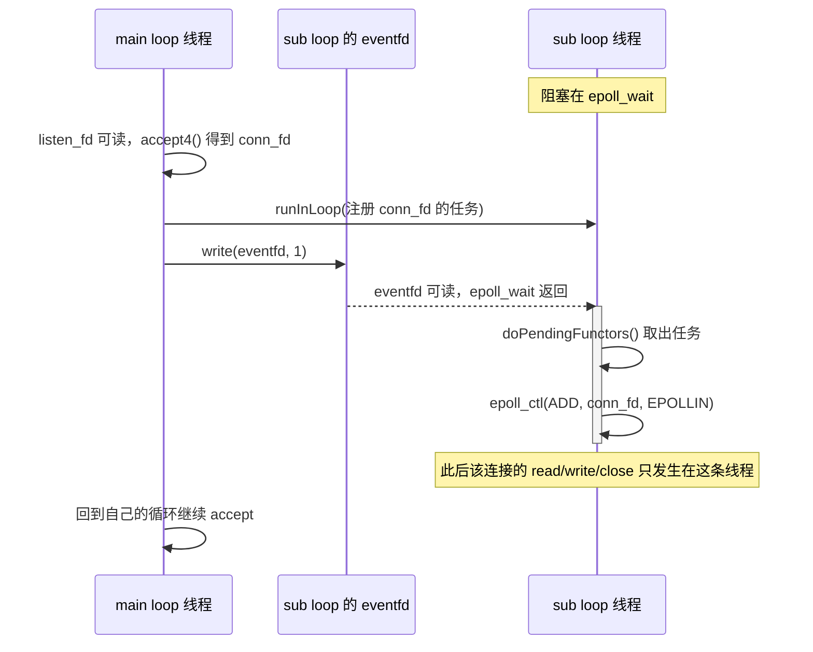

---
tags:
  - Linux
  - IO复用
阅读次数: 0
---

# 13.6 Reactor 模式与 EventLoop

> [!tip] 交互动画
> Reactor / EventLoop 过程可视化（角色映射 · poll→handleEvent→functors · EPOLLOUT 按需 · one loop per thread）：
> [▶ 在浏览器中打开动画](<../../图片/HTML/3.Linux/13. IO复用/13.6.2 Reactor EventLoop动画.html>)　·　更多见 [[网络编程·动画合集]]
> 也可直达单个场景：[角色映射](<../../图片/HTML/3.Linux/13. IO复用/13.6.2 Reactor EventLoop动画.html#scene=roles>) · [事件循环](<../../图片/HTML/3.Linux/13. IO复用/13.6.2 Reactor EventLoop动画.html#scene=loop>) · [读写路径](<../../图片/HTML/3.Linux/13. IO复用/13.6.2 Reactor EventLoop动画.html#scene=path>) · [多线程 Reactor](<../../图片/HTML/3.Linux/13. IO复用/13.6.2 Reactor EventLoop动画.html#scene=multi>)

## 1. 为什么 epoll 之后还需要 Reactor

学完 [[13.4 epoll模型|epoll]] 之后，已经知道 Linux 可以用一个线程高效等待大量 fd 的就绪事件。但 `epoll_wait()` 只回答一个问题：

> 哪些 fd 现在可以读、可以写，或者发生了异常？

它不会继续回答：

- 这个 fd 对应哪个连接对象？
- 可读事件应该调用谁的回调？
- 可写事件什么时候注册、什么时候取消？
- 连接关闭时如何避免回调访问已经释放的对象？
- 多线程服务器里，新连接应该交给哪个线程？

这些问题属于工程组织层面，Reactor 模式就是为了解决这类问题。

> [!note] 核心定义
> Reactor 模式的核心是：事件循环等待 I/O 就绪事件，然后把事件分发给对应的 handler；真正的 `read()` / `write()` 仍由应用程序完成。
>
> 所以 Reactor 是一种事件驱动架构模式，不是某个 Linux 系统调用。

可以把 [[13.1 IO复用简介|I/O 复用]] 和 Reactor 的关系理解成：

```text
epoll：负责高效发现“谁就绪了”
Reactor：负责把“就绪事件”分发到正确的对象和回调
```

---

## 2. Reactor 的核心角色映射

经典 Reactor 模式里的术语，落到 Linux/C++ 网络库中通常可以这样对应：

| Reactor 角色 | Linux / C++ 常见实现 | 作用 |
|:---|:---|:---|
| Handle | `fd` / socket | 事件源，例如 `listen_fd`、`conn_fd` |
| Synchronous Event Demultiplexer | `select` / `poll` / `epoll_wait()` | 同步等待多个 fd 的就绪事件 |
| EventLoop / Dispatcher | `EventLoop` | 事件循环、事件分发、执行待处理任务 |
| Event Handler | `Channel` / callback | 保存 fd 关注的事件和对应回调 |
| Concrete Handler | `Acceptor` / `TcpConnection` | 处理 accept、read、write、close 等具体逻辑 |

其中最容易混淆的是 `Channel` 和连接对象：

- `Channel` 通常不拥有 fd，只是把“fd + 关注事件 + 回调函数”绑在一起。
- `TcpConnection` 或 socket RAII 对象更接近连接资源的拥有者。
- `epoll_event.data.ptr` 在真实 C++ 网络库中常指向 `Channel` 或连接相关对象，因此生命周期必须清晰，后面会在 [[13.8 连接对象生命周期与RAII]] 继续展开。

> [!tip] 记忆方式
> `epoll` 面向 fd，Reactor 面向对象和回调。
> 从教学代码到工程代码，关键变化就是：不再只拿到一个 `int fd`，而是要找到这个 fd 背后的连接状态、缓冲区和处理函数。

---

## 3. 单线程 Reactor 工作流

单线程 Reactor 并不是“只能处理一个连接”，而是一个线程通过 I/O 复用同时管理很多连接。

![[图片/3.Linux/13. IO复用/13_6_1.svg|900]]

典型流程：

1. 创建 `listen_fd`，设置为非阻塞。
2. 创建 `epoll` 实例。
3. 为 `listen_fd` 创建 `Channel`，注册可读事件。
4. `EventLoop::loop()` 内部调用 `poller.poll()`，底层通常是 `epoll_wait()`。
5. `listen_fd` 可读时，调用 `Acceptor::handleRead()` 接收新连接。
6. `conn_fd` 可读时，调用 `TcpConnection::handleRead()` 收数据。
7. `conn_fd` 可写时，调用 `TcpConnection::handleWrite()` 发送输出缓冲区中的剩余数据。
8. 出现异常或关闭事件时，进入 close/error handler 清理连接。

事件循环的核心结构大致是：

```text
while (!quit) {
    activeChannels = poller.poll(timeout);

    for channel in activeChannels:
        channel.handleEvent();

    doPendingFunctors();
}
```

这个循环里有三个关键点：

| 步骤 | 含义 |
|:---|:---|
| `poller.poll()` | 等待 fd 就绪事件 |
| `channel.handleEvent()` | 根据 `EPOLLIN`、`EPOLLOUT`、异常事件调用对应回调 |
| `doPendingFunctors()` | 执行其他线程投递到本 EventLoop 的任务 |

其中 `Channel::handleEvent()` 背后的回调注册与触发机制，可以继续看 [[13.6.1 回调函数与Reactor事件分发]]。

> [!warning] ET 模式不要只读一次
> 如果底层使用 `EPOLLET`，可读事件到来后必须配合非阻塞 fd 循环 `read()` / `recv()` 到 `EAGAIN`。否则内核缓冲区中残留的数据可能不会再次触发通知。
>
> 非阻塞收发细节见 [[8.12 非阻塞connect与健壮收发]]。

### 3.1 一轮循环内部：三段与两个状态标志

上面的伪代码把一轮写成三行，但真实实现里这三行之间还有两个状态标志在起作用。

![[图片/3.Linux/13. IO复用/13_6_4.svg|900]]

先看第三段。`doPendingFunctors()` 的常见写法是：

```cpp
void EventLoop::doPendingFunctors() {
    std::vector<Functor> functors;
    callingPendingFunctors_ = true;

    {
        std::lock_guard<std::mutex> lock(mutex_);
        functors.swap(pendingFunctors_);   // 锁内只做这一次交换
    }

    for (const Functor& functor : functors) {
        functor();                          // 已解锁，这里可以慢
    }

    callingPendingFunctors_ = false;
}
```

这段代码看起来只是多绕了一个局部变量，实际解决了三个问题：

1. **临界区被压到一次指针交换。** 如果直接在锁里遍历执行，别的线程投递任务就得排队等所有 functor 跑完。`swap` 之后队列当场变空，锁立刻释放，投递方几乎不阻塞。
2. **执行时不持锁，functor 里可以再调 `queueInLoop()`。** 否则同一个 `mutex_` 会被同一线程二次加锁，直接死锁。
3. **本轮的任务列表已经被取走了。** functor 执行期间新投递的任务落在下一轮 —— 这正是 `callingPendingFunctors_` 存在的理由：`queueInLoop()` 看到这个标志为真，即使调用方就是 loop 线程自己，也要 `wakeup()` 一次。不然循环回到 `poll()` 会一直睡到下次有 I/O 事件，那个任务的延迟就完全不可控了。

跨线程投递的完整链路（`eventfd` 怎么写、怎么读）在 [[13.7 eventfd、timerfd与跨线程唤醒]]，这里只关心 EventLoop 这一侧。

再看第二段。

> [!warning] 遍历 activeChannels_ 时不能直接删 Channel
> `handleEvent()` 里如果顺手调用 `removeChannel()`，把自己或别的连接从 Poller 摘掉，正在被遍历的 `activeChannels_` 里就会留下指向已析构对象的指针。
>
> muduo 的处理是在遍历前置 `eventHandling_ = true`，这期间 `removeChannel()` 只做延迟处理，等本轮遍历结束再真正摘除。自己实现时，最省事的做法是把“销毁连接”也写成一个 functor 投进 `pendingFunctors_`，让它在第三段执行。

最后是 `poll(timeout)` 里那个一直没解释的 `timeout`。它决定了“没有任何 fd 就绪时，这一轮最多睡多久”，取值方式取决于定时器怎么实现：

| 定时器实现 | timeout 取值 |
|:---|:---|
| 用 `timerfd` 挂进 epoll | 固定值即可，muduo 取 10 秒 |
| 用自己维护的定时器堆 | 每轮算“最近一个定时器还剩多久” |

走 `timerfd` 的实现里，定时器到期本身就是一次可读事件，所以 `poll()` 不需要靠 timeout 醒来。不走 `timerfd` 又把 timeout 写成 `-1`，定时器就永远不会触发。

---

## 4. EventLoop 到底是什么

`EventLoop` 不是简单的 `while(true)`，它是一个线程内的事件调度中心。

一个成熟的 `EventLoop` 通常管理这些内容：

| 组成 | 作用 |
|:---|:---|
| `Poller` / `EpollPoller` | 封装 `epoll_create1()`、`epoll_ctl()`、`epoll_wait()` |
| active channels | 本轮 `poll()` 返回的就绪事件列表 |
| pending functors | 其他线程或当前线程投递进来的待执行函数 |
| wakeup fd / `eventfd` | 唤醒阻塞在 `epoll_wait()` 上的 EventLoop |
| timer queue | 管理定时器、超时、心跳等事件 |

在 muduo 风格的设计里，一个 `EventLoop` 通常绑定一个线程：

```text
一个 EventLoop
    对应一个线程
    管理一批 Channel
    分发这一批连接的 I/O 事件
```

这带来一个重要约束：连接状态应该在所属 EventLoop 线程内修改。其他线程想操作连接时，不应该直接改连接对象，而应该通过类似 `runInLoop()` / `queueInLoop()` 的接口把任务投递回所属 EventLoop。

跨线程投递后，如果 EventLoop 正阻塞在 `epoll_wait()`，就需要借助 `eventfd` 等机制唤醒它，这部分可以继续看 [[13.7 eventfd、timerfd与跨线程唤醒]]。

> [!warning] 不要阻塞 EventLoop
> EventLoop 线程应该只做短小的 I/O 处理和状态分发。数据库访问、复杂计算、慢磁盘 I/O 等耗时任务应投递到线程池，否则一个慢任务会拖住该 loop 管理的所有连接。

### 4.1 “一个线程一个 EventLoop”靠什么保证

前面说“连接状态应该在所属 EventLoop 线程内修改”，这句话如果只写在注释里，迟早会有人绕过去。工程实现会把它变成运行期检查：

```cpp
class EventLoop {
public:
    void assertInLoopThread() const {
        if (!isInLoopThread()) abortNotInLoopThread();   // 直接 abort
    }
    bool isInLoopThread() const { return threadId_ == CurrentThread::tid(); }

private:
    const pid_t threadId_;   // 构造时记下创建者，之后只读
};
```

`threadId_` 在构造函数里记下创建这个 EventLoop 的线程，之后不再变。凡是要求“必须在 loop 线程执行”的成员函数，开头先 `assertInLoopThread()`。这样跨线程误用会当场 abort，而不是变成偶尔复现一次的数据竞争 —— 后者在多线程服务器里几乎不可能靠日志定位。

还有反向的一层：一个线程也不该有两个 EventLoop。做法是用线程局部变量记住“本线程已经有 loop 了”，第二次构造直接失败：

```cpp
thread_local EventLoop* t_loopInThisThread = nullptr;

EventLoop::EventLoop() : threadId_(CurrentThread::tid()) {
    if (t_loopInThisThread) abortTwoLoops();   // 同一线程已有 EventLoop
    t_loopInThisThread = this;
}
```

muduo 用的是 GCC 扩展 `__thread`，C++11 之后写 `thread_local` 即可。有了这两处检查，one loop per thread 才从口头约定变成代码约束。

> [!note] quit() 不是立刻停
> `quit()` 只把 `quit_` 置真，循环要跑完当前这一轮才会退出。如果是别的线程调 `quit()`，此时 loop 多半正睡在 `epoll_wait()` 上，还得 `wakeup()` 一次它才能醒来看见标志 —— 和 `queueInLoop()` 需要唤醒是同一个原因。

---

## 5. 连接读写路径

理解 Reactor，不能只停留在“等待事件并回调”。真正写服务器时，更重要的是看一条连接从 accept 到 read/write/close 的完整路径。

### 5.1 accept 路径

`listen_fd` 可读表示有新连接可以接收，但不代表只调用一次 `accept()` 就够了。

在 ET 模式或高并发场景下，通常需要循环接收：

```text
while true:
    conn_fd = accept4(listen_fd, SOCK_NONBLOCK | SOCK_CLOEXEC)

    if conn_fd >= 0:
        分配给某个 EventLoop
        创建 TcpConnection / Channel
        注册读事件
    else if errno == EAGAIN or errno == EWOULDBLOCK:
        break
    else:
        处理错误
```

这里有两个工程细节：

- 新连接应尽早设置为非阻塞，避免后续 `read()` / `write()` 卡住 EventLoop。
- 新连接应该明确分配给某个 EventLoop，后续读写和关闭都回到这个 EventLoop 中处理。

### 5.2 read 路径

`EPOLLIN` 到来后，读路径通常是：

```text
conn_fd 可读
    ↓
循环 recv() 到 EAGAIN
    ↓
数据追加到 input buffer
    ↓
应用层协议解析
    ↓
产生业务请求或响应
```

TCP 是字节流协议，不保留应用层消息边界。因此 read handler 只是把字节读入缓冲区，真正的“消息”需要由协议解析层从 input buffer 中拆出来。粘包和拆包问题见 [[8.9 TCP的粘包和拆包]]。

如果业务处理很轻，可以在 EventLoop 中直接完成；如果业务处理很重，就应该把任务投递到线程池，避免阻塞 I/O 事件分发。

### 5.3 write 路径

写路径最容易犯的错误是长期监听 `EPOLLOUT`。

大多数 TCP socket 在大多数时间都是“可写”的。如果一直监听写事件，EventLoop 会被频繁唤醒，造成空转。

更合理的流程是：

> [!tip] 写事件按需注册
> `EPOLLOUT` 应该在“有待发送数据且一次没有发完”时才注册；output buffer 清空后要及时取消，避免 EventLoop 被可写事件反复唤醒。

```text
应用产生响应数据
    ↓
追加到 output buffer
    ↓
尝试立即 send()
    ↓
如果一次没发完，注册 EPOLLOUT
    ↓
下次可写时继续发送
    ↓
output buffer 清空后取消 EPOLLOUT
```

所以 `EPOLLOUT` 不是默认常驻事件，而是“有待发送数据且暂时发不完”时才打开。完整的健壮发送逻辑可以和 [[8.12 非阻塞connect与健壮收发]] 一起理解。

![[图片/3.Linux/13. IO复用/13_6_5.svg|900]]

#### 5.3.1 发不完的数据堆在哪里

按需注册 `EPOLLOUT` 解决的是空转，没解决另一个问题：output buffer 会不会一直涨。

对端如果收了不读，它的接收窗口会收缩到 0，本机 `send()` 一直返回 `EAGAIN`，`EPOLLOUT` 也就不再触发。可上层业务并不知道这件事，还在按自己的节奏往 buffer 里塞响应。一条这样的连接足以把进程内存吃光。

工程上要设两道阈值：

| 阈值 | 性质 | 触发后做什么 |
|:---|:---|:---|
| 高水位 | 软信号 | 回调上层，让它暂停产生数据 |
| 硬上限 | 保命 | 直接断开这条连接 |

高水位回调（muduo 里叫 `HighWaterMarkCallback`，阈值默认 64 MB）只是通知，不会自己丢数据 —— 上层收到后应该停止写入，等 buffer 降下来时的 `WriteCompleteCallback` 再继续。这一对回调合起来就是应用层的流控。硬上限则是最后一道防线：宁可丢这一条连接，也不能让它拖垮整个进程。两个阈值都按单条连接算，不是按进程总量算。

还有一个容易漏的时机：应用调用 `shutdown()` 时，output buffer 里可能还有没发完的数据。这时不能立刻 `shutdown(fd, SHUT_WR)`，否则尾部数据直接丢掉。正确做法是置一个待关闭标志，等 `handleWrite()` 把 buffer 发空、准备取消 `EPOLLOUT` 时，再顺手关掉写端。

### 5.4 close / error 路径

连接关闭和异常事件不能只靠 `read()` 返回 0 来处理，还要关注：

| 事件 | 含义 |
|:---|:---|
| `EPOLLERR` | fd 发生错误 |
| `EPOLLHUP` | 挂起，对端关闭或异常 |
| `EPOLLRDHUP` | 对端关闭写端，常用于检测半关闭 |

close/error handler 通常要做这些事：

1. 从 `epoll` 中删除或禁用对应 `Channel`。
2. 防止后续事件继续触发已关闭 fd。
3. 让连接对象按明确顺序释放资源。
4. 避免 `epoll_event.data.ptr` 指向已经析构的对象。

TCP 关闭状态与异常情况见 [[8.11 TCP连接关闭与异常状态]]，连接对象的 RAII 管理见 [[13.8 连接对象生命周期与RAII]]。

---

## 6. 多线程 Reactor：one loop per thread

单线程 Reactor 已经能管理很多连接，但如果业务量继续增大，一个线程的 CPU 会成为瓶颈。常见扩展方式是多线程 Reactor，也就是 one loop per thread。

从单线程到多 Reactor 中间还有一档，三种形态放在一起看更清楚：

| 模型 | 结构 | 瓶颈在哪 | 适用场景 |
|:---|:---|:---|:---|
| 单 Reactor 单线程 | 一个 loop 包办 accept、读写、业务 | 业务一慢，全部连接被拖住 | 业务极轻，如早期 Redis |
| 单 Reactor + 线程池 | 一个 loop 管全部 I/O，业务丢给线程池 | I/O 事件分发本身成为单点 | 连接数中等，业务重 |
| 主从 Reactor | main loop 只 accept，sub loop 分管连接 | 多核基本吃满 | 连接数大，I/O 就是主要开销 |

中间那档最容易被忽略：它只解决了“业务不阻塞 I/O”，没解决“I/O 分发本身跑不过来”。连接数上到几万、每个连接都有稳定读写时，单个 loop 线程光是 `epoll_wait` 加回调分发就能吃满一个核，这时才需要拆成多个 loop。

![[图片/3.Linux/13. IO复用/13_6_2.svg|900]]

典型结构：

| 角色 | 职责 |
|:---|:---|
| main EventLoop | 监听 `listen_fd`，负责 accept 新连接 |
| sub EventLoop | 管理已建立连接的读写事件 |
| worker thread pool | 执行耗时业务、计算、阻塞式外部调用 |

新连接进入服务器后，一般流程是：

```text
main loop accept 新连接
    ↓
按轮询或负载选择一个 sub loop
    ↓
把 conn_fd 注册到该 sub loop
    ↓
后续这个连接的 read/write/close 都在该 sub loop 中处理
```

“把 `conn_fd` 注册到该 sub loop”这一步不能由 main loop 自己做。`epoll_ctl()` 改的是 sub loop 的事件表，而 sub loop 此刻可能正阻塞在 `epoll_wait()` 上，两边同时动同一个 epoll 实例和连接对象就是竞态。正确的做法还是投递：



图里能看出源码不会明说的一点：main loop 从头到尾没有碰过 `conn_fd` 的事件表。它只是 `accept4()` 拿到一个整数，把“注册”这件事包成 functor 扔过去，然后立刻回到自己的循环。真正调用 `epoll_ctl()` 的是 sub loop 线程自己 —— 连接的归属从第一步起就是明确的。

### 6.1 另一种分发方式：SO_REUSEPORT

新连接不一定非得由 main loop 分发。另一种做法是每个线程各自 `socket()`、设 `SO_REUSEPORT`、`bind()` 同一个端口、`listen()`，由内核按四元组哈希把新连接直接投进某个线程的 accept 队列。

| 维度 | main loop 分发 | SO_REUSEPORT |
|:---|:---|:---|
| accept 并发 | 单点，所有新连接排队 | 每个线程各自 accept |
| 负载均衡 | 应用可自己按连接数挑 loop | 内核哈希，不保证均匀 |
| 惊群 | 只有一个线程在 accept，不存在 | 内核只唤醒一个队列的持有者 |
| 依赖 | 无 | 内核 ≥ 3.9 |

短连接密集、accept 本身成为瓶颈时（比如压测里每秒几万次连接建立），`SO_REUSEPORT` 的收益很直接。长连接为主的服务通常无所谓，accept 一天也跑不了几次。选项细节和惊群问题见 [[8.13 TCP内核队列与参数调优]]。

这两种方式共同的关键收益是：

> 一个连接在同一时刻只归属一个 EventLoop 线程，能显著减少锁和竞态。

业务线程池和 Reactor 不是替代关系：

- Reactor 解决的是大量连接的 I/O 事件等待与分发。
- 线程池解决的是耗时任务的并发执行。

线程池的基本思想可以回顾 [[12.7 条件变量与线程池]]。在网络库里，worker 线程处理完业务后，不应该随意长期持有并操作连接 fd，而应该把响应写入任务投递回连接所属的 EventLoop。

---

## 7. Reactor 与 Proactor 对比

Reactor 和 Proactor 最核心的区别是：通知到来时，I/O 操作到底有没有完成。

| 模型 | 通知含义 | 应用是否自己读写 | 典型实现 |
|:---|:---|:---|:---|
| Reactor | fd 已经可以读/写 | 是，应用继续调用 `read()` / `write()` | Linux `select` / `poll` / `epoll` |
| Proactor | I/O 操作已经完成 | 否，直接处理完成结果 | Windows IOCP、Linux `io_uring` |

传统 Linux `epoll` 更接近 Reactor，因为 `epoll_wait()` 返回的是“就绪事件”：

```text
epoll_wait() 返回 EPOLLIN
    不是说数据已经被读到用户缓冲区
    而是说现在调用 read()/recv() 大概率不会阻塞
```

所以不要把 `epoll` 说成真正的异步 I/O。它是高效的 I/O 复用机制，配合 Reactor 可以构建高性能事件驱动服务器。

### 7.1 Linux 上真正的 Proactor：io_uring

Proactor 在 Linux 上曾经长期没有像样的实现，`io_uring` 补上了这一块。它在用户态和内核之间放两个共享环形队列：应用把“读 4 KB 到这块缓冲区”这样的请求写进提交队列（SQ），内核完成之后往完成队列（CQ）里放一条结果。应用取到那条结果时，数据已经躺在自己的缓冲区里了，不需要再调 `read()`。

这就是 Proactor 的语义 —— 通知的是“已完成”，不是“可以开始了”。

但网络库目前仍以 `epoll` + Reactor 为主：

- `io_uring` 在存储 I/O 上收益明显（能省掉大量系统调用和阻塞等待），网络场景下 `epoll` 本来就不阻塞，差距没那么大。
- 接口和内核版本绑得紧，5.x 各小版本之间能力差异不小，做通用库要处理的兼容分支很多。

顺带提一个容易混的说法：Linux 上也可以用 Reactor“模拟”Proactor —— I/O 线程在 `epoll` 通知后把数据完整读进 buffer，再把 buffer 交给工作线程，工作线程只处理业务、完全不碰 fd。从工作线程的视角看，它拿到的确实是“已完成的 I/O 结果”，但底层机制仍然是 Reactor。

---

## 8. 常见工程陷阱

| 问题 | 后果 | 正确做法 |
|:---|:---|:---|
| EventLoop 中执行阻塞任务 | 拖住该 loop 下所有连接 | 投递到线程池或异步任务系统 |
| 常驻监听 `EPOLLOUT` | socket 经常可写，导致频繁唤醒 | 有待发送数据时才开启，发送完关闭 |
| ET 模式只读一次 | 缓冲区残留数据可能不再通知 | 非阻塞循环读到 `EAGAIN` |
| 跨线程直接操作连接 | 竞态、悬空指针、状态错乱 | 投递回所属 EventLoop |
| `data.ptr` 生命周期不清 | 回调访问已释放对象 | RAII、remove channel、延迟销毁策略 |
| 忽略 `EPOLLERR/HUP/RDHUP` | 死连接、资源泄漏 | 统一 close/error handler |
| 线程池队列无限堆积 | 内存膨胀、延迟失控 | 队列上限、反压、限流 |
| 遍历 active channels 时删 Channel | 迭代器失效、访问已析构对象 | 置 `eventHandling_` 延迟摘除，或把销毁包成 functor |
| 在锁内执行 pending functors | 投递方长时间阻塞；functor 再投递则死锁 | 先 `swap` 到局部 vector，解锁后执行 |
| `callingPendingFunctors_` 时不唤醒 | 新任务睡到下次有 I/O 事件才跑 | `queueInLoop()` 里把它并进唤醒条件 |
| output buffer 不设上限 | 对端不读时，一条连接吃光进程内存 | 高水位回调做流控 + 硬上限断连 |
| 一个线程构造两个 EventLoop | 两个 loop 抢同一线程，语义崩坏 | `thread_local` 记录，重复构造直接 abort |
| 不用 timerfd 且 timeout 传 `-1` | 定时器永不到期 | 用 `timerfd`，或按最近定时器算 timeout |

---

## 9. 面试问法

| 问题 | 回答要点 |
|:---|:---|
| 什么是 Reactor 模式？ | 事件循环等待 I/O 就绪事件，然后分发给对应 handler；应用自己完成读写。 |
| Reactor 和 epoll 是什么关系？ | `epoll` 是底层 I/O 复用机制，Reactor 是上层事件分发架构。 |
| EventLoop 是什么？ | 线程内事件调度中心，负责 poll、事件分发、pending functors、timer、wakeup。 |
| 为什么 one loop per thread？ | 让连接归属固定 EventLoop，减少多个线程同时操作连接状态带来的锁和竞态。 |
| 为什么不能在 EventLoop 做耗时任务？ | 一个慢任务会阻塞整个 loop，影响它管理的所有连接。 |
| 为什么 `EPOLLOUT` 不能常驻？ | socket 大多时候可写，常驻会导致频繁唤醒和空转。 |
| epoll 是 Reactor 还是 Proactor？ | 更接近 Reactor，因为它通知的是就绪，不是 I/O 完成。 |
| worker 线程处理完业务如何回写？ | 把写任务投递回连接所属 EventLoop，再由该 loop 修改 buffer 和 fd 事件。 |
| `doPendingFunctors` 为什么先 swap？ | 把临界区压到一次交换；执行时已解锁，functor 里可以再投递而不死锁。 |
| 已经在 loop 线程里，为什么还要 wakeup？ | 正在跑 functor 时本轮列表已被 swap 走，新任务只能等下一轮，不唤醒就会睡到下次有事件。 |
| 怎么保证一个线程只有一个 EventLoop？ | 构造时记 `threadId_` 做断言，再用线程局部变量拦住同线程的第二次构造。 |
| 主从 Reactor 里新连接怎么交给 sub loop？ | main loop accept 后投递注册任务并唤醒，`epoll_ctl` 由 sub loop 自己调用。 |
| 除了 main loop 分发还有什么办法？ | 每个线程 `SO_REUSEPORT` 各自 listen，由内核分发新连接。 |
| output buffer 一直涨怎么办？ | 高水位回调让上层停止产生数据，另设硬上限，超了断开这条连接。 |
| `io_uring` 属于哪一种？ | Proactor。完成队列里拿到的是已完成的 I/O 结果，不用再 `read()`。 |

---

## 10. 关键要点

1. Reactor 是事件驱动架构模式，不是某个 Linux 系统调用。
2. `epoll` 负责等待就绪事件，`EventLoop` 负责组织事件分发。
3. `Channel` 封装 fd 的关注事件和回调，连接对象负责状态、缓冲区和资源生命周期。
4. EventLoop 线程不能被阻塞，耗时任务应交给线程池。
5. 写事件应按需注册，输出缓冲区清空后取消 `EPOLLOUT`。
6. 多线程 Reactor 常用 one loop per thread，降低连接状态竞争。
7. 跨线程修改连接状态应投递回所属 EventLoop。
8. 传统 Linux `epoll` 更接近 Reactor，`io_uring` 才是 Linux 上真正的 Proactor。
9. `doPendingFunctors()` 先 `swap` 再执行：临界区只剩一次交换，执行期间可以再投递。
10. 正在执行 functor 时投递的任务落到下一轮，所以那一刻也要 `wakeup()`。
11. 遍历就绪 Channel 期间不能直接摘除 Channel，要延迟到本轮之后。
12. output buffer 需要高水位回调做流控，再加一道硬上限兜底。
13. one loop per thread 靠 `threadId_` 断言和线程局部变量强制，不是靠自觉。
