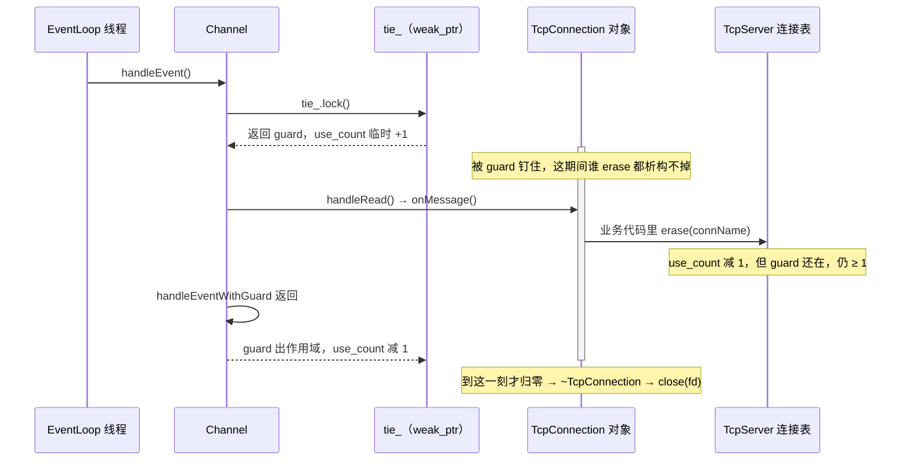

---
tags:
  - Linux
  - IO复用
阅读次数: 0
---

# 13.8 连接对象生命周期与RAII

> [!tip] 交互动画
> 本篇核心难点的过程可视化（UniqueFd 独占所有权与 move 转移 · use_count 跳动看悬空/引用环/lock 提升 · 六步安全关闭顺序对照"先 close"反例）：
> [▶ 在浏览器中打开动画](<../../图片/HTML/3.Linux/13. IO复用/13.8.1 连接对象生命周期与RAII动画.html>)　·　更多见 [[网络编程·动画合集]]
> 也可直达单个场景：[fd 所有权](<../../图片/HTML/3.Linux/13. IO复用/13.8.1 连接对象生命周期与RAII动画.html#scene=own>) · [shared/weak](<../../图片/HTML/3.Linux/13. IO复用/13.8.1 连接对象生命周期与RAII动画.html#scene=sp>) · [析构顺序](<../../图片/HTML/3.Linux/13. IO复用/13.8.1 连接对象生命周期与RAII动画.html#scene=seq>)

---

## 1. 一个 fd 和一个连接对象的差距

教学版 `epoll` 服务器里，一条连接就是一个 `int`：

```text
epoll_wait() 返回 fd
    |-- listen_fd -> accept
    |-- conn_fd   -> read / write / close
```

真实网络库里，同一条连接被一组对象共同持有：

| 对象 | 职责 |
|:---|:---|
| `Socket` / `UniqueFd` | 拥有 fd，析构时 `close()` |
| `Channel` | 保存 fd 关注的事件和回调，不拥有 fd |
| `TcpConnection` | 拥有连接状态、输入输出缓冲区、`Socket`、`Channel` |
| `EventLoop` / `Poller` | 在所属线程内分发事件，只存 `Channel*` |
| `TcpServer` 连接表 | 用 `shared_ptr<TcpConnection>` 保存活跃连接 |

`close(fd)` 只解决了这张表里的一行。剩下的问题是**其他人手上那些指针什么时候失效**：

1. `epoll_event.data.ptr` 里存着 `Channel*`，内核不会因为 fd 关了就把它清掉。
2. `epoll_wait()` 一次可能返回几十个事件，处理第 3 个事件时销毁的对象，可能正是第 7 个事件要用的。
3. 多线程 Reactor 里，别的线程可能正好也持有这条连接的引用。

> [!note] 核心问题
> 连接生命周期管理要解决的是：**fd 关闭、事件注销、对象析构、回调执行这四件事的先后顺序**。
>
> 顺序错了，症状是 fd 泄漏、重复关闭、回调访问已析构对象、`epoll` 返回悬空指针——而且都不是必现。

![[图片/3.Linux/13. IO复用/13_8_1.svg|960]]

上图的 A 区是一条连接的五个阶段，每个阶段同时标出「谁持有对象」和「内核那边什么状态」；B 区是六步安全关闭顺序，以及三种抄近路写法立刻会引发什么。后面几节逐段拆开讲。

---

## 2. 所有权边界：谁 close(fd)，谁只是看着它

![[图片/3.Linux/13. IO复用/13_8_2.svg|960]]

| 对象 | 拥有 fd 吗 | 说明 |
|:---|:---:|:---|
| `Socket` / `UniqueFd` | 是 | RAII 封装，析构时关闭 |
| `Channel` | 否 | 只保存 fd 值和回调，不负责关闭 |
| `TcpConnection` | 间接 | 通过 `Socket` 拥有 fd，并组合 `Channel`、buffer、状态 |
| `EventLoop` / `Poller` | 否 | 只监听和分发，存的是 `Channel*` |
| 连接表 | 拥有连接对象 | `shared_ptr<TcpConnection>` |

这和 [[13.6 Reactor模式与EventLoop|Reactor]] 的角色划分一致：`Channel` 是事件处理入口，`TcpConnection` 是连接状态和资源的聚合点。

> [!warning] Channel 不要拥有 fd
> 如果 `Channel` 和 `Socket` 都认为自己该关 fd，就会 `close()` 两次。
>
> 第二次 `close()` 危险在于它**不会报错也不会崩**：那个整数很可能已经被内核分配给了另一条刚 `accept` 上来的连接，于是那条连接被静默踢掉。高并发下这种 bug 表现为"偶尔有客户端连不上"，几乎无法从日志里定位。

fd 号码的复用速度比直觉快得多——内核总是分配当前可用的最小非负整数（见 [[4.1 打开、读取、写入、关闭#1. 文件描述符（File Descriptor）|文件描述符]]），一条连接关掉、下一条 `accept` 进来，拿到的往往就是同一个号。

---

## 3. 用 RAII 管理 fd

RAII 就是把 `close(fd)` 从各个 `return` 分支和异常路径上收回到析构函数里。C++ 标准库没有现成的 fd 封装（`unique_ptr` 管的是指针，fd 是 `int`，`-1` 才是无效值而不是 `nullptr`），所以要自己写一个：

```cpp
class UniqueFd {
public:
    UniqueFd() noexcept = default;
    explicit UniqueFd(int fd) noexcept : fd_(fd) {}

    ~UniqueFd() { reset(); }

    UniqueFd(const UniqueFd&) = delete;
    UniqueFd& operator=(const UniqueFd&) = delete;

    UniqueFd(UniqueFd&& other) noexcept : fd_(other.release()) {}

    UniqueFd& operator=(UniqueFd&& other) noexcept {
        if (this != &other) {
            reset(other.release());          // 先取走再 reset，自赋值和别名都安全
        }
        return *this;
    }

    [[nodiscard]] int get() const noexcept { return fd_; }
    explicit operator bool() const noexcept { return fd_ >= 0; }

    [[nodiscard]] int release() noexcept {   // 放弃所有权，调用方接管
        return std::exchange(fd_, -1);
    }

    void reset(int newFd = -1) noexcept {
        if (fd_ >= 0) {
            ::close(fd_);                    // 返回值见下方 warning
        }
        fd_ = newFd;
    }

private:
    int fd_ = -1;
};
```

三处写法值得说明：

**移动赋值先 `release()` 再 `reset()`。** 如果反过来写成「先 `reset()` 自己，再拿走对方的 fd」，当 `other` 和 `*this` 是同一对象的别名时，fd 已经被关掉了，再取回来就是个已关闭的号。用 `reset(other.release())` 这一句同时完成"取走对方的、关掉自己的旧的"，顺序天然正确。

**`operator bool` 加 `explicit`。** 不加的话 `UniqueFd` 会隐式转成 `int`，于是 `fd1 == fd2`、`fd + 1` 这类根本没意义的表达式都能编译通过。

**`release()` 标了 `[[nodiscard]]`。** 单独调用 `release()` 而丢掉返回值，等于故意泄漏一个 fd——这是唯一能泄漏的路径，让编译器帮忙盯着。

这个类对应《Effective C++》Item 13（用对象管理资源）和 Item 14（想清楚资源管理类的复制行为），思路和 [[独享智能指针|unique_ptr]] 一样，只是管的资源是 fd。

> [!warning] 析构里的 close() 失败了怎么办
> Linux 上 `close()` 返回 `-1` 时，**fd 已经被释放了**。所以不能像别的系统调用那样看到 `EINTR` 就重试——重试关掉的会是别的线程刚拿到的新 fd。
>
> 析构函数里正确的处理只有一种：记日志。真正在意写入是否成功的代码，应该在关闭之前显式 `fsync()` 或检查 `write()` 的返回值，而不是指望 `close()`。

> [!tip] fd 拥有者必须禁止复制
> 两个对象持有同一个 fd，析构时就是两次 `close()`。移动语义表达的正是"所有权转移"这件事，而复制表达不了。

---

## 4. 五个阶段与安全关闭的六步

一条连接从 `accept` 到析构，走过 SVG A 区的五个阶段：

| 阶段 | 触发 | 主要动作 |
|:---|:---|:---|
| 创建 | `accept4()` 返回 `conn_fd` | 设非阻塞，构造 `TcpConnection` 和 `Channel` |
| 建立 | 分配到某个 sub loop | 入连接表，`epoll_ctl(ADD)`，触发 connection callback |
| 活跃 | `EPOLLIN` / `EPOLLOUT` | 读进 input buffer，发 output buffer |
| 关闭中 | 对端关闭、本端主动关闭或错误 | 禁用事件，处理剩余输出，触发 close callback |
| 销毁 | 引用计数归零 | `Channel` 已从 `epoll` 摘除，`Socket` 析构关 fd |

关闭流程的六步：

```text
① queueInLoop(closeInLoop)     回到连接所属的 EventLoop 线程
② disableAll()                 不再关注任何读写事件
③ removeChannel()              epoll_ctl(DEL)，内核不再持有 Channel*
④ 连接表 erase(name)           shared_ptr 计数减 1
⑤ queueInLoop(connectDestroyed) 绑定一份 shared_ptr，推迟到下一轮
⑥ use_count 归零               ~TcpConnection → ~Socket → close(fd)
```

前四步的理由比较直白：先让内核放手，再让连接表放手。第 ⑤ 步最容易被省掉，也最容易出事。

### 4.1 为什么第 ⑤ 步不能省

关闭连接的判断，通常发生在 `Channel::handleEvent()` 里——读到 0 字节、或者收到 `EPOLLHUP`。也就是说，第 ①–④ 步是在 `Channel::handleEvent()` 的**调用栈内部**执行的。

如果第 ④ 步的 `erase` 恰好让引用计数降到 0，`TcpConnection` 立刻析构，它成员里的 `Channel` 也跟着析构。可是这一刻 `Channel::handleEvent()` 这个成员函数还没返回——它的 `this` 已经是野指针了。

```text
EventLoop::loop()
  └─ Channel::handleEvent()          ← 栈帧还在
       └─ TcpConnection::handleRead()
            └─ closeCallback()
                 └─ 连接表 erase → ~TcpConnection → ~Channel   ✗ 把自己的栈帧抽掉了
```

第 ⑤ 步的 `queueInLoop(std::bind(&TcpConnection::connectDestroyed, conn))` 做的事就是把一份 `shared_ptr` 绑进 functor 里，让计数至少多撑一轮。等本轮 `epoll_wait` 的所有事件都处理完、`handleEvent` 的栈帧退干净了，EventLoop 才去执行 pending functors，那时析构才安全。

还有一层同样的原因：`epoll_wait()` 一次返回的是一整个数组，`Poller` 已经把这批 `Channel*` 填进了 `activeChannels_`。处理第 3 个 Channel 时销毁第 7 个 Channel 的对象，第 7 个指针就悬空了。所以规则不只是"不能销毁自己"，而是**本轮事件分发期间，任何 Channel 都不该被析构**。

muduo 在 `EventLoop::removeChannel` 里放了断言来守住这条：事件分发过程中（`eventHandling_` 为真）要移除的只能是当前正在处理的那个 Channel。

### 4.2 抄近路的三种写法

| 写法 | 立刻发生什么 | 症状 |
|:---|:---|:---|
| 直接 `close(fd)`，跳过 `epoll_ctl(DEL)` | 事件数组里还留着这个 `Channel*` | 事件命中已被复用的 fd，或访问悬空对象 |
| 在 `handleEvent` 栈里析构 `Channel` | `activeChannels_` 后面的元素失效 | 同一次 `epoll_wait` 循环内崩溃 |
| `Channel` 与 `Socket` 各关一次 | 第二次 `close` 关的是别人的 fd | 随机连接被踢掉，难以复现 |

> [!warning] 「close 会自动把 fd 从 epoll 里移除」是有前提的
> 前提是这个 fd 的**所有**副本都关了。只要还有 `dup()` 出来的副本、或者 fork 后子进程持有的副本活着，内核里的 file description 就没销毁，epoll 的注册项也就还在。详见 [[13.4 epoll模型#15. 关闭连接的顺序|epoll 的关闭连接顺序]]。

TCP 层面的关闭状态（`FIN`、半关闭、`RST`）见 [[8.11 TCP连接关闭与异常状态]]。

---

## 5. shared_ptr、weak_ptr 与回调安全

连接对象会被多个地方临时引用：连接表、正在执行的回调、业务层异步任务、定时器回调。所以 `TcpConnection` 用 [[共享智能指针|shared_ptr]] 管理。

回调里怎么捕获它，三种选择差别很大：

| 捕获方式 | 风险 |
|:---|:---|
| 裸指针 `this` | 回调排队期间对象可能已析构，执行时访问悬空内存 |
| 长期持有 `shared_ptr` | 连接迟迟不释放，`TcpConnection ⇄ Channel` 还会形成引用环 |
| 持有 `weak_ptr`，用前 `lock()` | 对象还在才执行，析构了就跳过 |

### 5.1 Channel::tie_ 的作用

`Channel` 持有一份指向所属 `TcpConnection` 的 `weak_ptr`，每次分发事件前先提升：

```cpp
void Channel::handleEvent() {
    if (tied_) {
        if (auto guard = tie_.lock()) {      // 提升成功 → 对象还活着
            handleEventWithGuard();          // guard 在整个回调期间钉住它
        }
        // 提升失败：连接已经析构，本次事件直接丢弃
    } else {
        handleEventWithGuard();
    }
}
```

`guard` 是个栈上的 `shared_ptr`，作用范围就是这次回调。它把引用计数临时 +1，保证**回调执行到一半时对象不会被别人释放**。



图里揭示的是源码看不出的一点：`erase` 那一行**没有**让对象死掉，真正决定析构时刻的是栈上 `guard` 的作用域末尾。业务代码在回调里随手删连接之所以是安全的，全靠这个 guard。

### 5.2 tie 为什么在 connectEstablished 里做

`tie_` 不能在 `TcpConnection` 的构造函数里绑定。构造期间对象还没交给任何 `shared_ptr` 管理，此时 `shared_from_this()` 会抛 `std::bad_weak_ptr`。

正确的时机是 `connectEstablished()`——它由 `TcpServer` 在连接表插入之后调用，此刻已经存在一个管着它的 `shared_ptr`：

```cpp
class TcpConnection : public std::enable_shared_from_this<TcpConnection> {
public:
    void connectEstablished() {
        setState(kConnected);
        channel_->tie(shared_from_this());   // 此刻已被 shared_ptr 管理，可以取
        channel_->enableReading();
        connectionCallback_(shared_from_this());
    }
};
```

继承 `enable_shared_from_this` 是这套写法的前提：类的成员函数里只有 `this`，要往回调里塞一份 `shared_ptr`，就得靠它。对应《Effective Modern C++》Item 19。

> [!warning] 避免 shared_ptr 环
> `TcpConnection` 拥有 `Channel`。如果 `Channel` 反过来强持 `TcpConnection`，计数永远降不到 0，连接和 fd 一起泄漏。
>
> 「观察但不拥有」的关系一律用 `weak_ptr`——这正是 `tie_` 声明成 `weak_ptr` 而不是 `shared_ptr` 的原因。

---

## 6. 多线程下的释放顺序

one loop per thread 模型里，每条连接固定属于某个 `EventLoop`。关闭请求即使来自 worker 线程，也要投递回连接所属的 loop：

```text
worker 线程
    |-- queueInLoop(closeInLoop)      只投递任务，不碰连接状态
    |-- eventfd 唤醒目标 EventLoop
    |
所属 EventLoop 线程
    |-- closeInLoop()
    |-- disableAll + removeChannel
    |-- 连接表移除
```

投递机制见 [[13.7 eventfd、timerfd与跨线程唤醒|跨线程唤醒]]。

> [!note] 所属线程原则
> `TcpConnection` 的读写缓冲区、Channel 事件、连接状态都只在所属 EventLoop 线程内修改。
>
> 好处不只是省锁：单线程内的执行顺序是确定的，生命周期才有得推理。一旦允许两个线程同时改状态，"析构发生在哪一刻"就没法回答了。

---

## 7. 常见工程陷阱

| 问题 | 后果 | 正确做法 |
|:---|:---|:---|
| 直接 `close(fd)`，不从 `epoll` 删除 | 后续事件命中旧 fd 或悬空指针 | 先 `disableAll` + `removeChannel`，再释放 fd |
| `Channel` 和 `Socket` 都关 fd | 重复关闭，误关被复用的新 fd | fd 只留一个 RAII 拥有者 |
| 在 `handleEvent` 栈内析构 Channel | 本轮 `activeChannels_` 后续元素失效 | `queueInLoop(connectDestroyed)` 推迟一轮 |
| 构造函数里 `shared_from_this()` | 抛 `std::bad_weak_ptr` | 移到 `connectEstablished()` |
| 回调捕获裸指针 | 执行时对象可能已析构 | 用 `weak_ptr` + `lock()` |
| 回调长期持有 `shared_ptr` | 连接不释放，或形成引用环 | 观察关系用 `weak_ptr` |
| 跨线程释放连接对象 | 与事件分发竞态 | 投递回所属 EventLoop |
| 析构函数里 `close()` 失败就重试 | 关掉别人刚拿到的 fd | 只记日志；重要数据提前 `fsync` |
| 析构函数里做业务回调 | 析构路径可能重入 | 析构只释放资源，业务通知放在关闭流程里 |

---

## 8. 面试问法

| 问题 | 回答要点 |
|:---|:---|
| 连接对象生命周期为什么比 fd 复杂？ | fd 只是内核资源；连接对象还包含 Channel、buffer、状态、回调和连接表引用，各方失效时刻不同。 |
| Channel 该不该拥有 fd？ | 不该。Channel 负责事件分发，fd 由 Socket / UniqueFd 这类 RAII 对象独占。 |
| 关闭连接前为什么要从 epoll 删除？ | 避免后续 `epoll_wait()` 返回失效 fd 或悬空的 `data.ptr`。 |
| 从连接表 erase 之后为什么还要再投递一轮？ | 此刻还在 `Channel::handleEvent` 的调用栈里，立即析构会把自己的栈帧和本轮 activeChannels 一起弄坏。 |
| `Channel::tie_` 解决什么？ | 回调执行期间临时提升引用计数，防止回调跑到一半对象被释放。 |
| 为什么 tie 要在 connectEstablished 里做？ | 构造期间对象尚未被 shared_ptr 管理，`shared_from_this()` 会抛 `bad_weak_ptr`。 |
| 为什么 fd RAII 对象禁止复制？ | 复制产生多个拥有者，析构时重复 `close()`，可能关掉已被复用的新连接。 |
| `close()` 失败能重试吗？ | 不能。Linux 上 fd 已经释放，重试会关掉别的线程刚拿到的 fd。 |
| 多线程中谁负责释放连接？ | 连接所属的 EventLoop 线程；其他线程只能 `queueInLoop` 投递。 |

---

## 9. 关键要点

1. `fd` 是内核资源，`TcpConnection` 是包含 fd、buffer、状态和回调的 C++ 对象，两者失效时刻不同。
2. fd 由 `Socket` / `UniqueFd` 唯一拥有；`Channel` 只观察，不 `close`。
3. RAII 类禁止复制、只能移动；`close()` 失败不重试，析构里只记日志。
4. 关闭顺序：回到所属 loop → `disableAll` → `removeChannel` → 连接表 erase → 再投递一轮 → 引用计数归零后析构。
5. 第五步不能省：本轮事件分发期间任何 Channel 都不该被析构。
6. `shared_ptr` 表达共享生命周期，`weak_ptr` 表达观察关系；`Channel::tie_` 用后者。
7. `shared_from_this()` 只能在对象已被 `shared_ptr` 管理之后调用。
8. 连接状态和释放流程都回到所属 EventLoop 线程执行。

---

## 10. 参考

- 《Effective C++》Item 13：Use objects to manage resources
- 《Effective C++》Item 14：Think carefully about copying behavior in resource-managing classes
- 《Effective Modern C++》Item 18：Use `std::unique_ptr` for exclusive-ownership resource management
- 《Effective Modern C++》Item 19：Use `std::shared_ptr` for shared-ownership resource management
- 《Effective Modern C++》Item 20：Use `std::weak_ptr` for `std::shared_ptr`-like pointers that can dangle
- 《Linux多线程服务端编程》第 4.7 节、第 7.15 节：Reactor 中的对象生命期与 `shared_ptr` 技巧

---

## 11. 相关笔记

- [[13.4 epoll模型]] - epoll 关闭顺序与 `data.ptr` 生命周期风险
- [[13.6 Reactor模式与EventLoop]] - Channel、TcpConnection、EventLoop 的职责划分
- [[13.7 eventfd、timerfd与跨线程唤醒]] - 跨线程投递任务回所属 EventLoop
- [[13.9 定时器、心跳与连接超时]] - 定时器回调里的 `weak_ptr` 与超时关闭
- [[8.11 TCP连接关闭与异常状态]] - TCP 关闭状态与异常连接处理
- [[独享智能指针]] - 独占所有权与自定义资源释放
- [[共享智能指针]] - 引用计数、控制块与 weak_ptr
