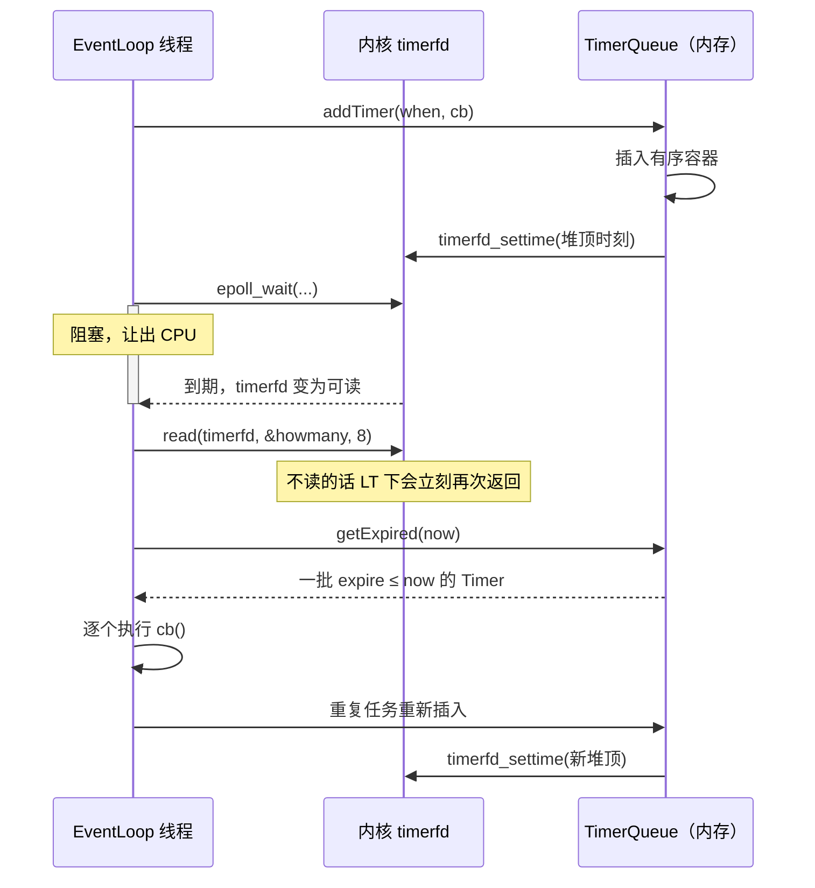

---
tags:
  - Linux
  - IO复用
阅读次数: 0
---

# 13.9 定时器、心跳与连接超时

> [!tip] 交互动画
> 本篇核心难点的过程可视化（堆顶到期时间驱动 `timerfd` 重设与批量执行 · 时间轮槽位刷新与指针推进 · 心跳 missed 计数容忍到达上限才关闭 · `weak_ptr.lock()` + `queueInLoop` 的安全关闭顺序）：
> [▶ 在浏览器中打开动画](<../../图片/HTML/3.Linux/13. IO复用/13.9 定时器、心跳与连接超时动画.html>)　·　更多见 [[网络编程·动画合集]]
> 也可直达单个场景：[最小堆 + timerfd](<../../图片/HTML/3.Linux/13. IO复用/13.9 定时器、心跳与连接超时动画.html#scene=heap>) · [时间轮](<../../图片/HTML/3.Linux/13. IO复用/13.9 定时器、心跳与连接超时动画.html#scene=wheel>) · [心跳容忍](<../../图片/HTML/3.Linux/13. IO复用/13.9 定时器、心跳与连接超时动画.html#scene=heartbeat>) · [超时安全关闭](<../../图片/HTML/3.Linux/13. IO复用/13.9 定时器、心跳与连接超时动画.html#scene=close>)

---

## 1. epoll 之外还缺什么

[[13.4 epoll模型|epoll]] 只回答一件事：哪些 fd 现在可读可写。它不会主动告诉应用：

- 某个连接已经空闲太久
- 某个请求处理超时了
- 某个客户端的心跳丢了
- 某批半关闭的连接该清理了
- 某个后台任务到点了

这些都是时间事件。成熟的 [[13.6 Reactor模式与EventLoop|EventLoop]] 同时管着 socket fd、`eventfd`、`timerfd` 和一个 timer queue。

> [!note] 核心定位
> `timerfd` 把"最近一次到期时刻"翻译成一个 fd 可读事件，让时间事件能挤进同一个 `epoll_wait()`。
>
> 大量业务定时任务由内存里的 timer queue 管理。`timerfd` 是唤醒源，timer queue 是主体。

### 1.1 为什么不给每个连接配一个 timerfd

| 做法 | 问题 |
|:---|:---|
| 每个连接一个 `timerfd` | fd 数量翻倍，每次刷新超时都要一次 `timerfd_settime` 系统调用，`epoll_ctl` 的注册项也翻倍 |
| 一个 loop 一个 `timerfd` + timer queue | fd 只多一个，到期任务统一排序，可以批量处理 |

十万连接配十万个 `timerfd`，光 fd 上限就先撑爆了，而这十万个定时器里绝大多数时刻都不会到期。

---

## 2. 一次到期的完整回合

![[图片/3.Linux/13. IO复用/13_9_1.svg|1390]]

三条泳道分别是 EventLoop 线程、内存里的 TimerQueue、内核的 timerfd。编号 ①–⑨ 串起从 `addTimer` 到重新 arm 的一整轮，底部三张红卡是最常见的三处漏做。

### 2.1 三个关键系统调用

```cpp
int createTimerfd() {
    int fd = ::timerfd_create(CLOCK_MONOTONIC, TFD_NONBLOCK | TFD_CLOEXEC);
    if (fd < 0) {
        // 记日志并终止：EventLoop 没有 timerfd 就完全没有时间能力
    }
    return fd;
}
```

两个参数都不是随便填的。**`CLOCK_MONOTONIC` 而不是 `CLOCK_REALTIME`**：前者从系统启动开始单调递增，管理员改系统时间、NTP 回拨都影响不到它；用后者的话，一次时钟回拨会让所有超时判断集体失准，往前跳则会让一大批定时器同时炸开。**`TFD_CLOEXEC`** 保证 fork+exec 时这个 fd 不会漏进子进程——如果漏了，子进程持有的副本会让 file description 一直不销毁。

```cpp
void resetTimerfd(int timerfd, Timestamp expiration) {
    itimerspec newValue{};                       // 值初始化，两个字段全部清零
    newValue.it_value = howMuchTimeFromNow(expiration);
    // it_interval 留 0：一次性触发，下一次到期时刻由 TimerQueue 现算
    if (::timerfd_settime(timerfd, 0, &newValue, nullptr) < 0) {
        // 记日志
    }
}
```

`it_interval` 留 0 是因为下一次该在什么时候响，取决于队列里剩下的堆顶是谁，不是一个固定周期。让内核按固定间隔重复触发，反而要在用户态额外过滤掉没用的唤醒。

> [!warning] it_value 算成 0 等于把定时器关掉
> `itimerspec.it_value` 全为零在 `timerfd_settime` 里的语义是 **disarm**，不是"立刻到期"。
>
> 如果目标时刻已经过去、或者只差几十纳秒，`howMuchTimeFromNow()` 算出来可能就是 0，定时器被静默关掉，此后再也不响。muduo 的做法是给结果设一个下限（不足 100 微秒就按 100 微秒算）。

```cpp
void readTimerfd(int timerfd) {
    std::uint64_t howmany = 0;
    ssize_t n = ::read(timerfd, &howmany, sizeof howmany);   // 这一步不能省
    if (n != sizeof howmany) {
        // 记日志
    }
}
```

`read` 出来的 8 字节是"自上次读之后到期了几次"，这个数值本身通常没人用，但**这次读必须做**。`timerfd` 在 epoll 里默认是水平触发：只要不把它读空，`epoll_wait()` 会立刻再次返回它，事件循环原地空转，把一个核烧满。

### 2.2 一轮的执行时序



这张图点出源码里看不出来的一件事：**从 `read` 到最后一次 `timerfd_settime` 之间，EventLoop 是不阻塞的**。所有到期回调都在这段时间里串行跑完，跑得越久，后面那些 socket 事件就被压得越久——这就是"到期回调必须短"的由来。

---

## 3. TimerQueue 的数据结构

三类核心操作：添加一个未来到期的任务、取消或刷新某个任务、取出当前已到期的一批。

| 数据结构 | 适合场景 | 特点 |
|:---|:---|:---|
| 最小堆 | 任务量中等、到期时刻分散 | 堆顶就是最近到期项，插入/弹出 `O(log n)` |
| 有序 `set<pair<Timestamp, Timer*>>` | 需要按 id 取消 | 同样 `O(log n)`，但中间删除也是 `O(log n)` |
| 时间轮 | 海量连接、精度只要秒级 | 插入和推进接近 `O(1)`，精度受槽宽限制 |

用堆的话，取消一个定时器要在堆中间删元素，代价高。两种绕法：

- **lazy cancel**：先给 Timer 打个 canceled 标记，等它自己浮到堆顶时直接丢弃。实现简单，代价是已取消的任务还会占着内存直到到期。
- **换成有序容器**：muduo 用 `std::set<std::pair<Timestamp, Timer*>>`。用 pair 而不是单独的 Timestamp 做键，是为了让同一时刻到期的多个定时器都能存进去——`set` 本身不允许重复键，配上指针就唯一了。

### 3.1 时间轮

时间轮把未来切成固定宽度的槽，比如每秒一个。连接有活动就把它挪到未来的某个槽；指针每秒前进一格，走到的那个槽里还剩下的东西就算超时。

单层时间轮的槽数决定了它能表达的最大延迟：8 个槽、每槽 1 秒，最多只能表达 8 秒后的事件。要表达几小时的超时又不想开几万个槽，就用**分层时间轮**——秒轮转满一圈进位到分轮，分轮转满进位到时轮，跟钟表的三根针一样。Kafka 的 purgatory 和 Netty 的 `HashedWheelTimer` 都是这个路子。

网络服务器里的空闲超时通常只要秒级或几十秒级精度，单层时间轮就够。

---

## 4. 判断连接还活着：心跳与空闲踢除

![[图片/3.Linux/13. IO复用/13_9_2.svg|1390]]

上图 A 区是心跳的 missed 计数怎么累积到上限，B 区是时间轮靠引用计数把空闲连接自动关掉。两件事解决的问题不同：心跳查的是"对端的业务逻辑还在跑吗"，空闲踢除查的是"这条连接还有人用吗"。

### 4.1 应用心跳与 TCP keepalive

| 机制 | 层次 | 判断什么 | 时间尺度 |
|:---|:---|:---|:---|
| TCP keepalive | 内核 TCP 层 | 这条 TCP 连接在网络上还通吗 | 默认 2 小时起，见 [[10.1 套接字选项]] |
| 应用心跳 | 应用协议层 | 对端的业务处理还在正常工作吗 | 由业务定，通常秒到分钟 |

对端进程卡死在一个死锁里、GC 停顿几十秒、业务线程池打满——这些情况下 TCP 连接完全健康，keepalive 探测照样成功，只有应用层的 ping 收不到 pong。

> [!tip] 心跳包要走协议层
> 心跳不能是"随便写几个字节"。它得是应用协议里明确定义的一类消息，接收端才能把它和普通业务数据区分开，也才能在收到时正确地更新活跃时间。

两种常见模型：

| 模型 | 流程 | 适合 |
|:---|:---|:---|
| ping / pong | 一端定时发 ping，对端回 pong | 长连接网关、RPC、WebSocket |
| 被动刷新 | 收到任何有效业务包就刷新活跃时间 | 消息本来就密集的连接 |

### 4.2 容忍计数

单次丢包、一次 GC 停顿都可能让一次 pong 迟到。丢一次就断开会造成大量误杀，所以要设容忍上限：

```text
每 heartbeatInterval 发一次 ping
收到 pong → missed = 0
没收到    → ++missed
missed 达到 missedLimit → 判定失活，投递 closeInLoop()
```

间隔 5 秒、上限 3 次，最坏要 15 秒才判定失活。想更灵敏，应该缩短间隔而不是把上限降到 1——上限降到 1 就退化成"丢一次就断"，抖动一下连接就没了。

### 4.3 时间轮 + 引用计数踢空闲连接

最直白的做法是给每条连接记 `lastActiveTime`，再起一个定时器周期性扫描整张连接表。十万连接、每秒扫一次，就是每秒十万次时间戳比较，而且这十万次里绝大多数都是白扫。

《Linux多线程服务端编程》里有一个更省的做法：把时间轮的每个桶做成一组 `shared_ptr`，让引用计数替你判断超时。

```cpp
// Entry 的析构函数就是"这条连接已经空闲够久了"这个事件本身
struct Entry {
    explicit Entry(const std::weak_ptr<TcpConnection>& conn) : conn_(conn) {}

    ~Entry() {
        if (auto conn = conn_.lock()) {   // 连接还在才关；已经关掉的就什么都不做
            conn->shutdown();
        }
    }

    std::weak_ptr<TcpConnection> conn_;
};

using EntryPtr     = std::shared_ptr<Entry>;
using WeakEntryPtr = std::weak_ptr<Entry>;
using Bucket       = std::unordered_set<EntryPtr>;
```

`Entry` 里存 `weak_ptr<TcpConnection>` 而不是 `shared_ptr`，是为了避免时间轮反过来延长连接的寿命——连接的生命周期归连接表管，时间轮只是观察者。这和 [[13.8 连接对象生命周期与RAII|连接生命周期]] 里 `Channel::tie_` 的选择是同一个理由。

连接建立时，往队尾桶里放一份强引用，同时把弱引用挂到连接自己身上：

```cpp
void onConnection(const TcpConnectionPtr& conn) {
    if (conn->connected()) {
        auto entry = std::make_shared<Entry>(conn);
        buckets_.back().insert(entry);            // 强引用只存在于桶里
        conn->setContext(WeakEntryPtr(entry));    // 连接自己只留弱引用
    }
}
```

`setContext` 存的必须是 `weak_ptr`。如果连接持有 `Entry` 的强引用，`Entry` 的计数就永远降不到 0，整套机制直接失效。

收到数据时，往**当前**队尾桶里再塞一份：

```cpp
void onMessage(const TcpConnectionPtr& conn, Buffer* buf) {
    auto weakEntry = std::any_cast<WeakEntryPtr>(conn->getContext());
    if (auto entry = weakEntry.lock()) {
        buckets_.back().insert(entry);   // unordered_set 去重：同一秒内收多少包都只算一份
    }
    // ... 处理业务数据
}
```

同一个 `EntryPtr` 被插进多个桶，引用计数就等于"这条连接在最近几个桶里出现过几次"。用 `unordered_set` 是为了让同一秒内的多次收包只增加一次计数。

每秒的定时器只做一件事：

```cpp
void onTimer() {
    buckets_.push_back(Bucket());   // 环形缓冲满了，队首那个桶被挤出去，整桶析构
}
```

队首桶析构 → 桶里那批 `shared_ptr<Entry>` 一起消失 → 某个 `Entry` 如果在这 N 秒里再没被塞进新桶，它的计数就归零 → `~Entry()` 触发 → 连接关闭。

`buckets_` 用环形缓冲（`boost::circular_buffer`，或自己拿 `std::vector` 加下标取模），容量就是超时秒数：容量 8 表示"8 秒没动静就踢"。

整套机制里没有一次遍历，也没有一次时间戳比较。桶在环里的位置本身就编码了时间。

---

## 5. 超时关闭仍要走连接生命周期

定时器判定超时之后，关闭动作还是得按 [[13.8 连接对象生命周期与RAII|连接对象生命周期]] 的规则来：

```text
timer callback 判定超时
    |-- weak_ptr.lock()          连接还在吗？不在就直接返回
    |-- queueInLoop(closeInLoop) 回到连接所属的 EventLoop
    |-- disableAll + removeChannel
    |-- 连接表 erase
    |-- 引用计数归零 → RAII 析构 close(fd)
```

两个要点：

1. **定时器回调不长期持有 `shared_ptr`。** 定时任务可能在队列里排几十秒，这期间强引用会让一条早该释放的连接一直占着 fd 和 buffer。用 `weak_ptr`，执行时对象在就处理、不在就跳过。
2. **关闭动作回到所属 EventLoop。** 定时器回调本身跑在某个 loop 线程里，如果连接属于另一个 loop，直接改状态就会和那边的 I/O 回调并发。

---

## 6. 常见工程陷阱

| 问题 | 后果 | 正确做法 |
|:---|:---|:---|
| 每个连接一个 `timerfd` | fd 数量膨胀，刷新超时都要系统调用 | 一个 EventLoop 一个 `timerfd` + timer queue |
| 用 `CLOCK_REALTIME` 建 timerfd | 改系统时间或 NTP 回拨时超时集体失准 | 用 `CLOCK_MONOTONIC` |
| 到期后不 `read` 那 8 字节 | LT 下 `epoll_wait` 立刻再次返回，空转烧核 | 每次都读掉 |
| `it_value` 算出 0 就直接 settime | 定时器被静默 disarm，此后再不触发 | 给结果设下限（如 100 微秒） |
| 一次只执行堆顶一个任务 | 同一时刻到期的其他任务被推迟一轮 | 取出全部 `expire ≤ now` 一起执行 |
| 执行完不重新 arm | 后续定时任务集体失效 | 按新的堆顶重新 `timerfd_settime` |
| 定时器回调强持有连接 | 连接迟迟不释放，甚至引用环 | 用 `weak_ptr` 观察 |
| 用 `system_clock` 记活跃时间 | 和 `CLOCK_REALTIME` 同样的回拨问题 | 用 `steady_clock` |
| 心跳丢一次就断开 | 一次抖动或 GC 停顿就误杀连接 | 设容忍次数；要灵敏就缩短间隔 |
| 只依赖 TCP keepalive | 对端进程卡死时 TCP 仍然健康，发现不了 | 应用层心跳单独设计 |
| 到期回调里干重活 | 定时器和 I/O 事件一起被拖延 | 回调保持短小，重任务丢线程池 |

---

## 7. 面试问法

| 问题 | 回答要点 |
|:---|:---|
| `timerfd` 和 timer queue 是什么关系？ | `timerfd` 是能进 epoll 的唤醒源，只记一个时刻；timer queue 在内存里管所有业务定时任务。 |
| 为什么不每个连接一个 `timerfd`？ | fd 数量和 `epoll_ctl` 成本随连接数线性膨胀，而绝大多数定时器同一时刻都不会到期。 |
| `timerfd` 为什么必须用 `CLOCK_MONOTONIC`？ | `CLOCK_REALTIME` 会被改时间和 NTP 回拨影响，导致超时判断整体失准。 |
| 到期后不读那 8 字节会怎样？ | 水平触发下 `epoll_wait` 立刻再次返回该 fd，事件循环空转占满一个核。 |
| 最小堆和有序 set 怎么选？ | 只需按时间取最近项用堆；需要按 id 取消，用 `set<pair<Timestamp, Timer*>>` 中间删除更方便。 |
| 时间轮适合什么场景？ | 海量连接的秒级空闲超时，插入和推进接近 `O(1)`，不需要遍历。 |
| 时间轮怎么用引用计数判断超时？ | 桶里放 `shared_ptr<Entry>`，连接活跃就往队尾桶再塞一份；桶被挤出环时计数归零，`~Entry()` 关连接。 |
| 心跳和 TCP keepalive 的区别？ | keepalive 判断 TCP 链路可达，应用心跳判断对端业务是否还在正常处理。 |
| 连接超时后能直接 `close(fd)` 吗？ | 不能。要投递回所属 EventLoop，按 Channel 移除和 RAII 释放的顺序走。 |
| timer callback 为什么常用 `weak_ptr`？ | 避免定时任务在队列里排队期间强行延长连接寿命，也避免执行时访问已析构对象。 |

---

## 8. 关键要点

1. `epoll` 只管 fd 就绪，业务超时要靠 timer queue 单独管理。
2. `timerfd` 是唤醒源，一个 EventLoop 配一个就够；成千上万的定时任务放内存里。
3. `timerfd_create` 用 `CLOCK_MONOTONIC` + `TFD_CLOEXEC`；`it_value` 算成 0 会把定时器关掉。
4. 到期后三件事缺一不可：`read` 掉 8 字节、批量取出所有到期项、按新堆顶重新 arm。
5. 数据结构按需选：堆看最近项，有序 set 方便取消，时间轮扛海量连接。
6. 时间轮 + `shared_ptr<Entry>` 能把空闲踢除做成零遍历，靠计数归零触发析构。
7. 应用心跳是协议层机制，TCP keepalive 是内核层机制，两者查的问题不同。
8. 心跳要有容忍次数；超时关闭仍要回所属 EventLoop，走 Channel 移除和 RAII 释放的顺序。
9. 到期回调保持短小，重任务丢给线程池，否则 I/O 事件跟着一起被拖。

---

## 9. 参考

- 《Linux多线程服务端编程》第 7.10 节：用时间轮和 `shared_ptr` 踢掉空闲连接
- 《Linux多线程服务端编程》第 8.2 节：muduo 的 `TimerQueue` 实现与 `timerfd` 用法
- `man 2 timerfd_create` / `man 2 timerfd_settime`：`it_value` 全零的 disarm 语义

---

## 10. 相关笔记

- [[13.4 epoll模型]] - epoll 只负责 fd 就绪，不负责业务超时
- [[13.6 Reactor模式与EventLoop]] - EventLoop 中 timer queue 的位置
- [[13.7 eventfd、timerfd与跨线程唤醒]] - `timerfd` 的系统调用语义和 epoll 集成
- [[13.8 连接对象生命周期与RAII]] - 超时关闭时的安全释放顺序与 `weak_ptr` 观察关系
- [[8.11 TCP连接关闭与异常状态]] - TCP 关闭、半关闭、RST 与异常状态
- [[10.1 套接字选项]] - TCP keepalive 等 socket 选项
