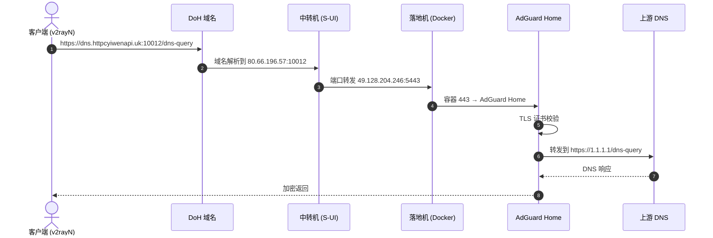
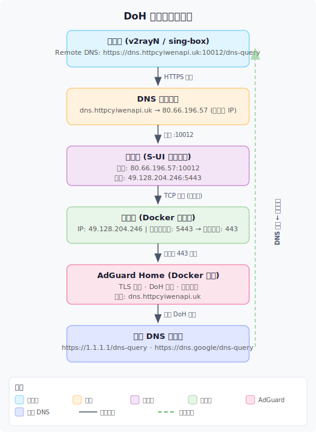
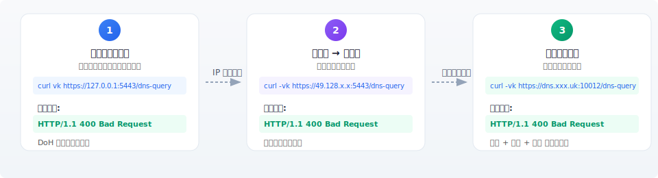
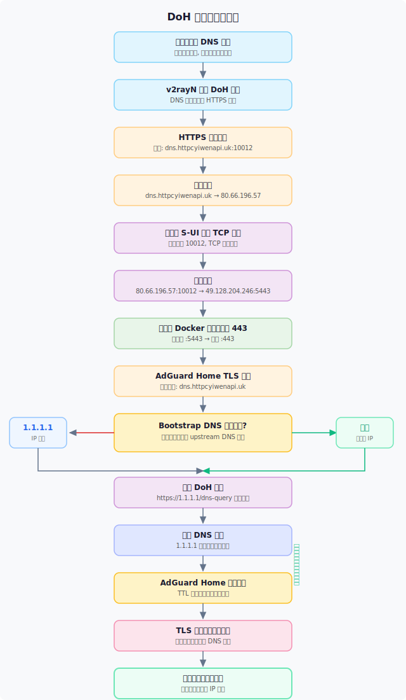
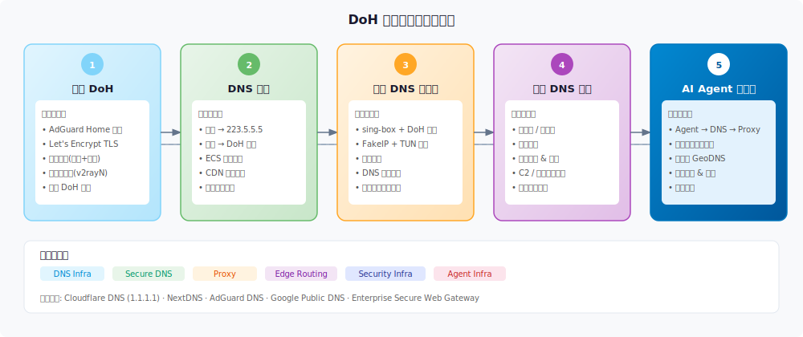

> **知识定位**：从零搭建一套基于 DoH（DNS over HTTPS）的私有解析基础设施，涵盖落地机部署、中转机转发、客户端接入、企业级应用。
> 前置知识：[[8. TCP 编程]] · [[10. 套接字]] · [[15. 安装V2ray]]

---

## 一、一句话定位

> 将 DNS 从"本地系统服务"升级为"远程可控的加密服务"，通过代理链路实现防污染、防劫持、可审计。

---

## 二、整体架构

### 2.1 请求链路



### 2.2 节点拓扑



---

## 三、组件职责

| 层级 | 组件 | 作用 |
|------|------|------|
| 客户端 | v2rayN / sing-box | 发起 DoH 请求，接收 DNS 响应 |
| 域名 | dns.httpcyiwenapi.uk | DoH 入口，TLS 证书绑定域名 |
| 中转机 | S-UI 端口转发 | 隐藏真实落地机 IP，增加一跳 |
| 落地机 | Docker 容器 | 承载 AdGuard Home 服务 |
| DNS 服务 | AdGuard Home | 提供 DoH 端点、广告过滤、日志 |
| 上游 DNS | Cloudflare / Google | 实际递归解析 |
| 证书 | Let's Encrypt | TLS 加密，DoH 必须 |

---

## 四、落地机部署

### 4.1 目录初始化

```bash
docker rm -f adguardhome     # 清理旧容器
rm -rf /opt/adguardhome      # 清理旧数据

mkdir -p /opt/adguardhome/work
mkdir -p /opt/adguardhome/conf

# 权限控制，仅容器用户可读写
chmod 700 /opt/adguardhome/work
chmod 700 /opt/adguardhome/conf
```

### 4.2 核心配置文件

路径：`/opt/adguardhome/conf/AdGuardHome.yaml`

```yaml
http:
  address: 0.0.0.0:3000       # Web 管理界面

dns:
  bind_hosts:
    - 0.0.0.0
  port: 53                    # 传统 DNS 端口
  upstream_dns:
    - https://1.1.1.1/dns-query
    - https://dns.google/dns-query
  bootstrap_dns:
    - 1.1.1.1
    - 8.8.8.8                 # 必须设置，避免递归解析死循环

tls:
  enabled: true
  server_name: dns.httpcyiwenapi.uk
  port_https: 443
  certificate_path: /etc/letsencrypt/live/dns.httpcyiwenapi.uk/fullchain.pem
  private_key_path: /etc/letsencrypt/live/dns.httpcyiwenapi.uk/privkey.pem
```

### 4.3 Docker 启动

```bash
docker run -d \
  --name adguardhome \
  --restart unless-stopped \
  -v /opt/adguardhome/work:/opt/adguardhome/work \
  -v /opt/adguardhome/conf:/opt/adguardhome/conf \
  -v /etc/letsencrypt:/etc/letsencrypt:ro \
  -p 3000:3000/tcp \
  -p 5443:443/tcp \
  adguard/adguardhome
```

**参数说明**：
- `-p 3000:3000`：Web 管理界面
- `-p 5443:443`：宿主机 5443 映射到容器内 443（DoH 端点）
- `-v /etc/letsencrypt:ro`：只读挂载 TLS 证书目录（`:ro` 防止容器误写）

### 4.4 TLS 证书获取

```bash
# 使用 certbot 申请 Let's Encrypt 证书
certbot certonly --standalone \
  -d dns.httpcyiwenapi.uk \
  --preferred-challenges http \
  --http-01-port 80
```

> 注意：申请证书时 80 端口不能被占用，需要先停止占用 80 端口的服务。

---

## 五、中转机配置（S-UI 端口转发）

目标：`10012 → 49.128.204.246:5443`

核心原则：
- DoH 端口与代理端口必须分离
- 不混用 443 / REALITY / TLS
- 中转机只负责 TCP 转发，不解密

S-UI 中添加入站：
```
监听端口: 10012
传输协议: TCP
目标地址: 49.128.204.246:5443
流量类型: 转发
```

---

## 六、验证链路

### 6.1 验证流程图



### 6.2 逐步验证

**Step 1: 落地机本地**
```bash
curl -vk https://127.0.0.1:5443/dns-query
# 预期: HTTP/1.1 400 Bad Request（说明 DoH 服务已启动）
```

**Step 2: 中转机 → 落地机（IP 直连验证中转）**
```bash
curl -vk https://49.128.204.246:5443/dns-query
# 预期: HTTP/1.1 400（绕过域名，验证端口转发链路）
```

**Step 3: 完整域名链路**
```bash
curl -vk https://dns.httpcyiwenapi.uk:10012/dns-query
# 预期: HTTP/1.1 400（验证端到端，包括域名解析 + 中转 + 落地）
```

**Step 4: 本机强制解析测试**
```bash
curl -vk --resolve dns.httpcyiwenapi.uk:5443:127.0.0.1 \
  https://dns.httpcyiwenapi.uk:5443/dns-query
# 强制将域名解析到 127.0.0.1，验证 TLS 证书是否匹配
```

> **为什么 400 = 成功？** DoH 是 HTTP 协议的 DNS 解析服务。浏览器用 GET + `?dns=base64payload` 格式请求，`curl` 直接 GET `/dns-query` 没有带 DNS payload，所以返回 400。服务本身已正常运行。

---

## 七、客户端配置（v2rayN）

```text
Remote DNS:   https://dns.httpcyiwenapi.uk:10012/dns-query
Bootstrap DNS: 1.1.1.1
Domestic DNS:  1.1.1.1
```

---

## 八、关键坑总结

### ❶ 证书路径字段名

```yaml
# 错误
certificate_chain: /etc/letsencrypt/...   ❌

# 正确
certificate_path: /etc/letsencrypt/...    ✅
```

### ❷ 容器路径 ≠ 宿主机路径

证书必须在容器内路径可访问，必须挂载：

```bash
-v /etc/letsencrypt:/etc/letsencrypt:ro
```

容器内的 `certificate_path` 写的是 **容器内的路径**，不是宿主机的。

### ❸ DoH 必须用域名访问

```text
❌ https://49.128.204.246:5443/dns-query   # 证书不匹配
✅ https://dns.httpcyiwenapi.uk:10012/dns-query  # 证书绑定域名
```

TLS 证书的 `Subject Alternative Name` 绑的是域名，不是 IP。

### ❹ 端口映射必须正确

```text
✅ 宿主机 5443 → 容器 443
❌ 宿主机 5443 → 容器 5443
```

AdGuard Home 的 `tls.port_https` 是 443，容器外通过 5443 映射进来。

### ❺ 400 ≠ 错误

```text
400 Bad Request = DoH 服务已正常启动
```

DoH 需要标准的 DNS payload（base64 编码），直接用 GET 请求没有 payload 就会返回 400。

### ❻ Bootstrap DNS 必须设置

防止递归解析死循环：

```text
dns.httpcyiwenapi.uk → 需要解析自己域名 → 陷入死循环
```

`bootstrap_dns` 使用 IP 地址，绕过域名解析。

### ❼ TUN 模式不能叠加

```text
宿主机开 TUN + VM 开 TUN → 网络混乱
```

两层 TUN 会导致路由冲突、包循环。

---

## 九、DoH 协议详解

### 9.1 与传统 DNS 对比

| 特性 | 传统 DNS (53) | DoH (443) |
|------|---------------|-----------|
| 传输协议 | UDP/TCP | HTTPS (TCP) |
| 加密 | 无 | TLS |
| 端口 | 53 | 443 |
| 防污染 | 无 | 是 |
| 可审计 | 运营商可见 | 只有终端节点可见 |

### 9.2 DoH 请求格式

**浏览器方式（GET）**：
```
GET /dns-query?dns=AAABAAABAAAAAAAAA3d3dwdleGFtcGxlA2NvbQAAAQAB
Host: dns.example.com
Accept: application/dns-message
```

**浏览器方式（POST）**：
```
POST /dns-query
Content-Type: application/dns-message
Host: dns.example.com

<binary DNS wire data>
```

**dig 方式**：
```bash
dig @dns.httpcyiwenapi.uk example.com +https
```

**使用 doh-curl**：
```bash
curl -H "Accept: application/dns-message" \
  "https://dns.httpcyiwenapi.uk:10012/dns-query?dns=AAABAAABAAAAAAAAA3d3dwdleGFtcGxlA2NvbQAAAQAB" \
  --output - | hexdump -C
```

---

## 十、现实应用场景

### 10.1 个人用途

| 场景 | 说明 |
|------|------|
| 防 DNS 污染 | 不走本地 ISP 的 DNS，避免劫持和污染 |
| 隐私保护 | DoH = HTTPS 加密，ISP 看不到你解析了什么 |
| 稳定性提升 | 上游可以选 1.1.1.1 / 8.8.8.8，不依赖本地运营商 |
| 支撑代理系统 | DNS 和代理解耦，避免 DNS 泄漏，精准路由 |

### 10.2 企业用途

| 场景 | 说明 |
|------|------|
| Zero Trust DNS | 所有 DNS 走企业网关，统一出口 |
| 恶意域名阻断 | 阻断钓鱼网站、C2 通信、勒索软件 |
| 统一审计 | 记录谁访问了什么域名 |
| 内部私有解析 | `service.internal → 内网 IP` |
| CDN / 地域优化 | EDNS Client Subnet，最近节点解析 |

---

## 十一、DoH 请求完整流程图



---

## 十二、进化方向

### 12.1 路线图



### 12.2 具体方向

| 方向 | 内容 | 价值 |
|------|------|------|
| DNS 分流 | 国内 → 223.5.5.5，国外 → DoH | 国内访问更快，国外不被污染 |
| ECS 优化 | EDNS Client Subnet，CDN 就近解析 | 提高 CDN 命中率 |
| FakeIP + TUN | 透明代理，所有流量走 TUN | 更完整的代理方案 |
| 多节点 DoH | GeoDNS，多地区部署 | 提高可用性和解析速度 |
| 缓存优化 | 减少上游查询次数 | 降低 RTT，节省带宽 |
| 广告过滤 | AdGuard Home 自带功能 | 拦截恶意域名和广告 |
| 企业黑名单 | 阻断恶意域名和 C2 | 安全防护，员工上网管理 |

---

## 十三、与 Agent Infra 的关系

DNS 是所有网络请求的第一步。如果 DNS 被控制：

```
Agent 的所有行为都可以被 → 路由、限制、监控、重写
```

这套 DoH 基础设施为 AI Agent 提供：
- **可控的网络入口**：所有域名解析走安全通道
- **防泄漏**：避免 DNS 暴露真实 IP 和目标
- **策略路由**：Agent 访问不同 API 可走不同链路

---

## 十四、核心要点

1. DoH 本质是把 DNS 请求伪装成 HTTPS 流量，绕过运营商 DNS 监控
2. 证书路径、端口映射、容器挂载是部署的三大核心坑
3. Bootstrap DNS 必须设置，否则域名解析会产生递归死循环
4. 400 Bad Request 在 DoH 验证中是正常响应
5. TUN 模式不能多层叠加，会导致路由崩溃
6. 中转机的作用是隐藏真实落地机 IP，增加安全层级
7. 这套架构可直接进化为企业级 DNS 安全网关

---

## 参见

- [[8. TCP 编程]] — TCP 连接与传输原理
- [[10. 套接字]] — Socket 编程基础
- [[15. 安装V2ray]] — V2Ray 代理系统部署
