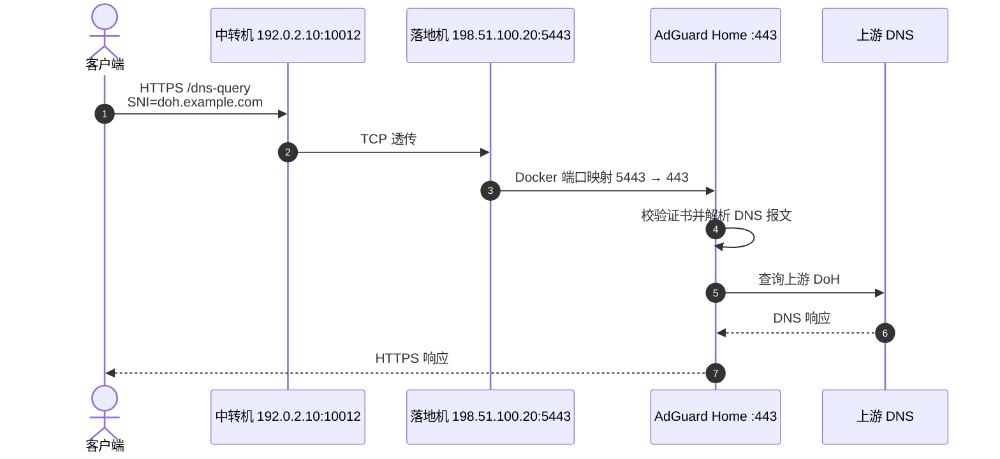

# 16.1 CDN 与自建 DoH 全链路

> [!abstract] 知识定位
> 从零搭建一套基于 DoH（DNS over HTTPS）的私有 DNS 解析服务，覆盖落地机部署、中转机转发、客户端接入和链路验证。
>
> 前置知识：[[3.Linux/8. TCP 编程/8.1 TCP原理|TCP 原理]]、[[3.Linux/7. 网络编程基础/7.6 套接字|套接字]]

> [!warning] 示例地址
> 本文使用保留域名 `doh.example.com` 和文档专用 IP。实际部署时统一替换为自己的地址：
>
> - DoH 域名：`doh.example.com`
> - 中转机：`192.0.2.10`
> - 落地机：`198.51.100.20`

## 1. 服务定位

DoH 将 DNS 报文放入 HTTPS 请求中传输。客户端与 DoH 服务端之间的查询内容受 TLS 保护，可减少本地网络对 DNS 明文的监听和篡改。

DoH 不提供端到端匿名性。网络运营方仍能看到连接目标 IP，并可能通过 TLS 元数据识别服务域名；DoH 服务端和上游解析器也能看到查询内容。

## 2. 整体架构

### 2.1 请求链路


```mermaid
sequenceDiagram
    autonumber
    actor Client as 客户端
    participant Relay as 中转机 192.0.2.10:10012
    participant Host as 落地机 198.51.100.20:5443
    participant AGH as AdGuard Home :443
    participant Upstream as 上游 DNS

    Client->>Relay: HTTPS /dns-query<br/>SNI=doh.example.com
    Relay->>Host: TCP 透传
    Host->>AGH: Docker 端口映射 5443 → 443
    AGH->>AGH: 校验证书并解析 DNS 报文
    AGH->>Upstream: 查询上游 DoH
    Upstream-->>AGH: DNS 响应
    AGH-->>Client: HTTPS 响应
```

中转机只做 TCP 转发，不终止 TLS。证书校验和 DoH 请求处理都发生在 AdGuard Home。

### 2.2 节点拓扑

![[图片/3.Linux/16.CDN/cdn-arch.svg|760]]

## 3. 组件职责

| 层级 | 组件 | 职责 |
|---|---|---|
| 客户端 | v2rayN、sing-box 或系统 DoH 客户端 | 发起 DoH 查询并处理 DNS 响应 |
| 域名 | `doh.example.com` | 提供稳定入口，并与 TLS 证书匹配 |
| 中转机 | S-UI 端口转发 | 将入口 TCP 流量转发到落地机 |
| 落地机 | Docker | 承载 AdGuard Home |
| DNS 服务 | AdGuard Home | 提供 DoH 端点、缓存、过滤和查询日志 |
| 上游 DNS | Cloudflare、Google 或其他解析器 | 执行递归解析 |
| 证书 | Let's Encrypt | 为 DoH 入口提供 TLS 证书 |

## 4. 落地机部署

### 4.1 创建持久化目录

```bash
sudo install -d -m 700 /opt/adguardhome/work
sudo install -d -m 700 /opt/adguardhome/conf
```

如果机器上已有 AdGuard Home，先备份 `/opt/adguardhome/conf`，不要直接删除原配置。

### 4.2 启动容器

```bash
docker run -d \
    --name adguardhome \
    --restart unless-stopped \
    -v /opt/adguardhome/work:/opt/adguardhome/work \
    -v /opt/adguardhome/conf:/opt/adguardhome/conf \
    -v /etc/letsencrypt:/etc/letsencrypt:ro \
    -p 3000:3000/tcp \
    -p 5443:443/tcp \
    adguard/adguardhome
```

端口和挂载含义：

| 参数 | 作用 |
|---|---|
| `-p 3000:3000/tcp` | 暴露初始 Web 管理界面 |
| `-p 5443:443/tcp` | 将宿主机 `5443` 映射到容器 HTTPS 端口 `443` |
| `-v .../work` | 持久化运行数据 |
| `-v .../conf` | 持久化配置文件 |
| `-v /etc/letsencrypt:...:ro` | 只读挂载 TLS 证书目录 |

> [!warning] 管理端口
> 完成初始化后，不要把 `3000/tcp` 长期暴露到公网。可通过防火墙限制来源，或仅绑定到管理网络。

### 4.3 获取 TLS 证书

证书的 SAN 必须包含 `doh.example.com`。使用 HTTP-01 验证时，域名需要先指向执行 Certbot 的主机，并保证公网能够访问其 `80/tcp`。

```bash
sudo certbot certonly --standalone \
    -d doh.example.com \
    --preferred-challenges http
```

> [!note] 中转架构中的证书申请
> 如果域名只解析到中转机，HTTP-01 请求也会先到中转机。需要临时把 `80/tcp` 转发到申请证书的落地机，或者改用 DNS-01 验证。

### 4.4 配置 AdGuard Home

优先在 AdGuard Home 管理界面中配置加密 DNS。配置文件通常位于：

```text
/opt/adguardhome/conf/AdGuardHome.yaml
```

核心字段示意如下。字段层级可能随 AdGuard Home 版本变化，应以当前版本生成的配置文件为准。

```yaml
http:
  address: 0.0.0.0:3000

dns:
  bind_hosts:
    - 0.0.0.0
  port: 53
  upstream_dns:
    - https://1.1.1.1/dns-query
    - https://dns.google/dns-query
  bootstrap_dns:
    - 1.1.1.1
    - 8.8.8.8

tls:
  enabled: true
  server_name: doh.example.com
  port_https: 443
  certificate_path: /etc/letsencrypt/live/doh.example.com/fullchain.pem
  private_key_path: /etc/letsencrypt/live/doh.example.com/privkey.pem
```

`bootstrap_dns` 用于解析上游 DoH 地址中的域名。例如，AdGuard Home 在访问 `https://dns.google/dns-query` 之前，必须先得到 `dns.google` 的 IP。

> [!danger] 修改配置文件前先停止服务
> AdGuard Home 运行时可能重写 `AdGuardHome.yaml`。手动编辑前先停止容器，修改完成后再启动。

```bash
docker stop adguardhome
# 编辑 /opt/adguardhome/conf/AdGuardHome.yaml
docker start adguardhome
```

## 5. 中转机配置

目标转发关系：

```text
192.0.2.10:10012  →  198.51.100.20:5443
```

S-UI 入站配置示意：

```text
监听地址：0.0.0.0
监听端口：10012
传输协议：TCP
目标地址：198.51.100.20
目标端口：5443
流量类型：转发
```

配置原则：

- 中转机只做四层 TCP 透传。
- DoH 端口与代理入站端口分开。
- 不在中转机上重复配置 REALITY 或 TLS 解密。
- 使用防火墙限制落地机 `5443/tcp`，只允许中转机访问。

中转能避免客户端直接看到落地机地址，但中转机本身仍然知道落地机地址。它是拓扑隔离手段，不等同于访问控制或身份认证。

## 6. 验证链路

### 6.1 验证顺序

![[图片/3.Linux/16.CDN/cdn-validation.svg|836]]

按“落地机容器 → 落地机公网入口 → 中转入口 → 完整 DoH 查询”的顺序排查，可以快速定位失败节点。

### 6.2 只检查端点是否可达

在落地机上测试容器端口：

```bash
curl -v --resolve doh.example.com:5443:127.0.0.1 \
    https://doh.example.com:5443/dns-query
```

测试落地机公网入口：

```bash
curl -v --resolve doh.example.com:5443:198.51.100.20 \
    https://doh.example.com:5443/dns-query
```

测试中转入口：

```bash
curl -v --resolve doh.example.com:10012:192.0.2.10 \
    https://doh.example.com:10012/dns-query
```

这些命令故意没有携带 DNS 报文。服务可能返回 `400 Bad Request`。这只能说明 TLS 和 HTTP 端点可达，不能证明 DNS 解析成功。

> [!tip] 不要默认使用 `-k`
> `-k` 会跳过证书校验，容易掩盖证书域名不匹配、证书链不完整等问题。只有在定位 TLS 故障时才临时使用。

### 6.3 发送合法 DoH 查询

RFC 8484 规定：

- GET 请求把 DNS wire-format 报文编码为无填充的 Base64URL，并放入 `dns` 查询参数。
- POST 请求把 DNS wire-format 报文直接放入请求体。
- 成功的 HTTP 响应使用 `2xx` 状态码；标准媒体类型是 `application/dns-message`。

下面的 GET 请求查询 `www.example.com` 的 A 记录：

```bash
curl --fail-with-body \
    -H 'Accept: application/dns-message' \
    'https://doh.example.com:10012/dns-query?dns=AAABAAABAAAAAAAAA3d3dwdleGFtcGxlA2NvbQAAAQAB' \
    --dump-header response.headers \
    --output response.bin

grep -i '^content-type: application/dns-message' response.headers
hexdump -C response.bin
```

判断标准：

1. TLS 证书校验通过。
2. HTTP 状态码为 `2xx`。
3. 响应头包含 `Content-Type: application/dns-message`。
4. `response.bin` 包含有效的 DNS wire-format 响应。

如果本机安装的 `kdig` 支持 DoH，也可以直接验证解析结果：

```bash
kdig +https=https://doh.example.com:10012/dns-query www.example.com A
```

## 7. 客户端配置

v2rayN 配置示意：

```text
Remote DNS:    https://doh.example.com:10012/dns-query
Bootstrap DNS: 1.1.1.1
Domestic DNS:  按分流规则选择
```

Bootstrap DNS 的作用是解析 `doh.example.com`，避免客户端在访问 DoH 服务前先依赖该服务解析自身域名。

> [!warning] 防止解析回退
> 客户端可能在 DoH 失败后回退到系统 DNS。需要结合 v2rayN、sing-box 或操作系统的实际配置检查回退策略，不能只看 DoH 地址是否已填写。

## 8. 常见故障

### 8.1 证书字段写错

```yaml
# 错误字段
certificate_chain: /etc/letsencrypt/live/doh.example.com/fullchain.pem

# AdGuard Home 使用的字段
certificate_path: /etc/letsencrypt/live/doh.example.com/fullchain.pem
```

### 8.2 容器无法读取证书

配置文件中的证书路径是容器内路径。宿主机目录必须挂载到容器：

```bash
-v /etc/letsencrypt:/etc/letsencrypt:ro
```

证书续期后，如果 AdGuard Home 没有自动重新加载证书，需要重启容器并重新验证证书有效期。

### 8.3 使用 IP 访问导致证书不匹配

```text
错误：https://198.51.100.20:5443/dns-query
正确：https://doh.example.com:10012/dns-query
```

证书绑定的是域名。排障时如果需要指定 IP，应使用 `curl --resolve`，保留 URL 中的域名和 TLS SNI。

### 8.4 Docker 端口映射错误

```text
正确：宿主机 5443 → 容器 443
错误：宿主机 5443 → 容器 5443
```

容器内 AdGuard Home 监听 `443`，外部端口可以另选，但映射目标必须与容器监听端口一致。

### 8.5 把 400 当作解析成功

请求 `/dns-query` 却不携带 DNS 报文时，服务器可以返回 `400 Bad Request`。该结果说明请求到达了 HTTP 端点，但没有验证上游解析、响应编码或客户端兼容性。

### 8.6 Bootstrap DNS 配置缺失

当上游地址是域名时，AdGuard Home 需要先解析该域名。Bootstrap DNS 应填写可直接访问的 IP 地址解析器，不能再次指向同一个 DoH 域名。

### 8.7 多层 TUN 路由冲突

宿主机和虚拟机同时启用 TUN 并非一定失败，但需要明确规划默认路由、策略路由和 DNS 劫持规则。没有这类需求时，只在一层启用 TUN，排障成本更低。

### 8.8 防火墙放行不完整

至少检查以下方向：

| 位置 | 需要放行 |
|---|---|
| 中转机入站 | 客户端到 `10012/tcp` |
| 中转机出站 | 中转机到落地机 `5443/tcp` |
| 落地机入站 | 仅中转机到 `5443/tcp` |
| 落地机出站 | 到上游 DoH 的 `443/tcp`，以及证书续期所需流量 |

## 9. DoH 协议

### 9.1 与传统 DNS 对比

| 特性 | 传统 DNS | DoH |
|---|---|---|
| 应用层承载 | DNS over UDP/TCP | DNS over HTTPS |
| 常用端口 | `53` | `443` 或服务指定端口 |
| 客户端到解析器的加密 | 无 | TLS |
| 网络中间设备可见内容 | DNS 查询和响应 | 目标 IP、流量特征及部分 TLS 元数据 |
| 缓存位置 | 系统、路由器、递归解析器 | DoH 客户端、HTTP 缓存及递归解析器 |

### 9.2 GET 请求

```http
GET /dns-query?dns=AAABAAABAAAAAAAAA3d3dwdleGFtcGxlA2NvbQAAAQAB HTTP/2
Host: doh.example.com
Accept: application/dns-message
```

### 9.3 POST 请求

```http
POST /dns-query HTTP/2
Host: doh.example.com
Accept: application/dns-message
Content-Type: application/dns-message
Content-Length: 33

<DNS wire-format binary message>
```

DoH 使用标准 DNS wire format。GET 使用无填充的 Base64URL 编码；POST 直接发送二进制报文。

## 10. 应用与边界

### 10.1 个人使用

| 场景 | 能解决的问题 | 边界 |
|---|---|---|
| 减少 DNS 污染 | 避开本地明文 DNS 链路 | DoH 服务端仍可修改结果 |
| 防止局域网监听 | 查询内容经过 TLS 加密 | 目标 IP 和流量特征仍可见 |
| 统一过滤 | 在 AdGuard Home 中维护规则 | 错误规则会影响所有客户端 |
| 代理分流 | DNS 结果可与路由策略配合 | 必须检查 DNS 回退和泄漏 |

### 10.2 团队或企业使用

| 场景 | 说明 |
|---|---|
| 统一 DNS 策略 | 按设备或用户执行过滤和重写 |
| 恶意域名阻断 | 阻断钓鱼、恶意软件和 C2 域名 |
| 查询审计 | 保存查询日志并设置留存期限 |
| 私有域名解析 | 为内部服务提供 split-horizon DNS |
| 高可用 | 部署多个入口并监控解析成功率 |

> [!warning] 访问控制
> 公网 DoH 地址一旦泄露，其他人也可能使用该解析服务。应结合防火墙、客户端身份、反向代理认证或 AdGuard Home 支持的访问控制能力限制使用范围。

## 11. 完整请求流程

![[图片/3.Linux/16.CDN/doh-flow.svg|760]]

## 12. 后续改进

### 12.1 路线图

![[图片/3.Linux/16.CDN/doh-roadmap.svg|838]]

### 12.2 改进方向

| 方向 | 实现思路 | 注意事项 |
|---|---|---|
| DNS 分流 | 国内域名和国外域名使用不同上游 | 规则需要持续维护 |
| ECS | 向上游提供客户端网段信息 | 可能改善 CDN 定位，也会减少隐私 |
| 多节点 DoH | 部署多个地区入口并执行健康检查 | 客户端需要明确故障切换规则 |
| 缓存优化 | 调整缓存大小、最小 TTL 和最大 TTL | 过长 TTL 会延迟记录更新 |
| 访问控制 | 限制来源 IP、客户端或凭据 | 不能只依靠隐蔽端口 |
| 监控 | 记录成功率、延迟、证书有效期和上游错误 | 查询日志应设置访问权限和保留期限 |

> [!note] CDN 解析位置
> CDN 通常根据递归解析器的位置选择边缘节点。远程自建 DoH 可能让 CDN 把流量调度到靠近 DoH 服务器、而不是靠近客户端的节点。ECS 可以传递部分客户端网段信息，但会引入隐私权衡。

## 13. 与 Agent 基础设施的关系

Agent 发起 HTTP 请求前通常要先解析目标域名。统一 DNS 服务可以提供：

- 域名过滤和重写；
- 解析日志与故障定位；
- 按域名选择不同上游；
- 与代理规则配合，减少 DNS 泄漏。

DNS 控制只影响名称解析。它不能替代 TLS 校验、应用层鉴权、出站防火墙或代理访问控制。

## 14. 检查清单

- [ ] 域名解析到中转机。
- [ ] 证书 SAN 包含 DoH 域名。
- [ ] 中转机把 TCP 流量透传到落地机。
- [ ] 落地机 `5443/tcp` 只允许中转机访问。
- [ ] 容器内 `443/tcp` 正常监听。
- [ ] 证书目录以只读方式挂载。
- [ ] Bootstrap DNS 可以独立解析上游域名。
- [ ] 合法 DoH 查询返回 `2xx` 和 `application/dns-message`。
- [ ] 客户端未回退到系统明文 DNS。
- [ ] 已监控证书有效期和解析成功率。

## 15. 参考资料

- [RFC 8484: DNS Queries over HTTPS](https://www.rfc-editor.org/rfc/rfc8484)
- [AdGuard Home 配置说明](https://github.com/AdguardTeam/AdGuardHome/wiki/Configuration)
- [AdGuard Home 加密 DNS](https://github.com/AdguardTeam/AdGuardHome/wiki/Encryption)

## 16. 关联笔记

- [[3.Linux/8. TCP 编程/8.1 TCP原理|TCP 原理]]
- [[3.Linux/7. 网络编程基础/7.6 套接字|套接字]]
- [[3.Linux/10. 套接字/10.1 套接字选项|套接字选项]]
