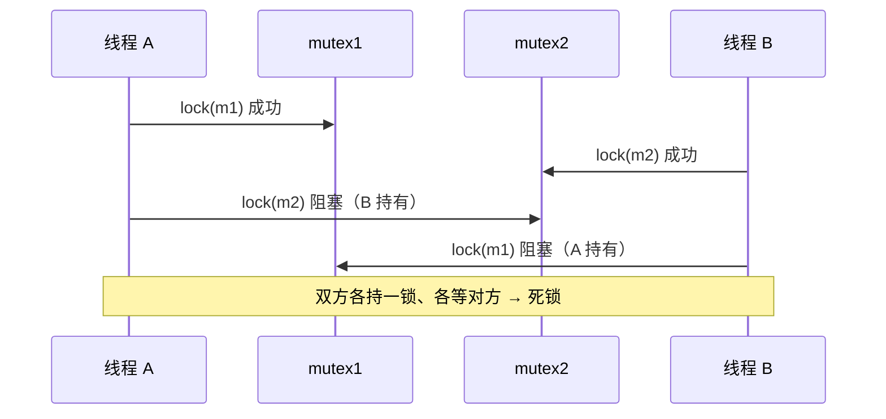

---
tags:
  - Linux/并发同步
阅读次数: 0
---

# 17.3 锁机制、死锁与故障

> 锁是最直接的同步手段：**用串行化换取正确性**。本节先统一对比各类锁并剖析其实现，再系统讲解用锁必然带来的三类故障（死锁、活锁、饥饿）及其规避手段。pthread 基础用法详见 [[12.3 互斥量]]。

---

## 一、锁的本质与分类

### 1. 锁的本质

锁把一段临界区变成"**同一时刻只有一个持有者**"：

- **加锁** = 申请进入临界区；若已被占用则等待。
- **解锁** = 释放临界区；可能需唤醒等待者。

锁的代价是**串行化**：被锁保护的代码无法并行，因此锁既是正确性的保证，也是性能的瓶颈。用锁的核心权衡，就是在"足够安全"与"足够并行"之间找平衡。

### 2. 锁的分类对比

| 锁类型 | 等待方式 | 适用场景 | pthread / std |
|--------|---------|---------|---------------|
| 互斥锁 (mutex) | 阻塞睡眠 | 临界区较长 | `pthread_mutex_t` / `std::mutex` |
| 自旋锁 (spinlock) | 忙等自旋 | 临界区极短、多核 | `pthread_spinlock_t` |
| 读写锁 (rwlock) | 读共享 / 写独占 | 读多写少 | `pthread_rwlock_t` / `std::shared_mutex` |
| 递归锁 (recursive) | 同线程可重入 | 递归调用持锁 | `PTHREAD_MUTEX_RECURSIVE` |

核心区别在**等待时做什么**：互斥锁让出 CPU 去睡眠，自旋锁则原地空转。前者省 CPU 但有上下文切换开销，后者反之。下面逐一展开。

### 3. 互斥锁与 futex 实现

> 用法详见 [[12.3 互斥量]]，本节补充 Linux 上 `std::mutex` / `pthread_mutex_t` 的底层机制 —— **futex**（fast userspace mutex）。

朴素的实现思路是：每次 lock/unlock 都做一次系统调用，让内核来仲裁。但系统调用代价昂贵（用户态↔内核态切换、寄存器保存、调度器介入），而现实中**绝大多数加锁是无竞争的**——锁当下没人持有，本不需要内核参与。

futex 的核心思想是**把无竞争的快路径留在用户态**：

- 用一个用户态整数（futex 字）表示锁状态。
- **加锁**：先用一条原子 `CAS` 指令尝试把它从 `0`（空闲）改成 `1`（占用）。成功即持锁，**全程不进内核**。
- 只有当 `CAS` 失败（说明锁已被别人持有）时，才调用 `futex(FUTEX_WAIT)` 系统调用，由内核把当前线程挂入等待队列并睡眠。
- **解锁**：原子地把 futex 字置回 `0`；只有当存在等待者时，才调用 `futex(FUTEX_WAKE)` 唤醒一个。

![[图片/3.Linux/17. 并发同步/3_17_3_1.svg]]

**一句话**：无竞争 → 一条原子指令搞定（快）；有竞争 → 才陷入内核排队（慢）。这正是 Linux 互斥锁在常见负载下表现优异的原因——你为"可能发生的竞争"付费，而不是为"每一次加锁"付费。

### 4. 自旋锁

自旋锁在等不到锁时**不睡眠，而是原地循环重试**（忙等，busy-wait）：

```cpp
while (lock.test_and_set(std::memory_order_acquire)) {
    // 空转，反复重试，不让出 CPU
}
```

**为什么忙等有时反而更快？** 互斥锁睡眠会触发**两次上下文切换**（睡下去、被唤醒），每次切换约数百纳秒到微秒级。如果临界区本身只有几十纳秒，那么"睡一觉再回来"的开销远大于"原地等一会儿"。此时自旋更划算。

**自旋 vs 睡眠的权衡：**

| 维度 | 自旋锁 | 互斥锁 |
|------|--------|--------|
| 等待时 CPU | 空转占用 | 让出，可调度他人 |
| 临界区时长 | 极短才划算 | 较长更合适 |
| 上下文切换 | 无 | 有（两次） |
| 单核场景 | **几乎总是错的** | 适用 |

**关键约束**：自旋锁在**单核**上是反模式——持锁者和自旋者在同一个 CPU 上，自旋者空转只会白白占满时间片，反而拖延持锁者释放。自旋锁的前提是"持锁者正在**另一个核**上飞快地跑完临界区"。

> 实践中常用**自适应锁**（adaptive mutex）：先自旋一小段时间，超过阈值再转为睡眠，兼顾两者优点。glibc 的 `pthread_mutex` 在 `PTHREAD_MUTEX_ADAPTIVE_NP` 模式下即如此。

### 5. 读写锁

读写锁区分两种访问，放宽"只能一个持有者"的限制：

- **读锁（共享）**：多个读者可同时持有。
- **写锁（独占）**：写者独占，与任何读者/写者互斥。

适用于**读多写少**：只读操作彼此不冲突，没必要互相串行化。

**读者优先 vs 写者优先：**

- **读者优先**：只要有读者在读，新来的读者就能插队进入。吞吐高，但若读者源源不断，**写者可能永远等不到锁** → **写者饥饿**（writer starvation）。
- **写者优先**：一旦有写者在等，就不再放新读者进入，写者拿到锁后再放行读者。避免写者饥饿，但读吞吐略降。

> 读写锁并非"读多就一定更快"：它的内部状态维护比普通互斥锁更复杂，**读临界区很短**时，读写锁的额外开销可能反而不如一把简单的 `std::mutex`。读多写少且**读临界区不算太短**时才是它的主场。

### 6. 递归锁与它的争议

递归锁（可重入锁）允许**同一线程多次加锁**而不死锁，内部用计数器记录加锁次数，解锁同样次数才真正释放。它解决的是"持锁函数又调用了另一个要加同一把锁的函数"。

**为什么 muduo / Google C++ 风格不推荐递归锁？**

- 递归锁往往是**设计有问题的信号**：它掩盖了"不清楚自己是否已持锁"这件事，而这正说明锁的职责边界没划清楚。
- 它**破坏了不变量的检查时机**。用普通互斥锁时，"进入临界区"意味着"此刻不变量成立"；而递归重入时，外层可能正处在修改一半、不变量尚未恢复的中间状态，内层却以为一切就绪。
- 正确的做法通常是**重构**：把"加锁的公有函数"和"假定已持锁的私有实现"分开（如 `doSomething()` 加锁后调用不加锁的 `doSomethingWithLockHold()`），而非用递归锁回避问题。

### 7. 锁粒度与性能

| 粒度 | 含义 | 代价 |
|------|------|------|
| 粗粒度 | 一把大锁保护一大片数据 | 实现简单，但并行度低、竞争激烈 |
| 细粒度 | 多把小锁各护一部分 | 并行度高，但易死锁、易出错 |

两个核心性能问题：

- **锁竞争（contention）**：多线程争抢同一把锁，导致大量线程阻塞/自旋。竞争是锁可扩展性的头号杀手——临界区越大、线程越多，竞争越严重。
- **伪共享（false sharing）**：两个本无关联的变量恰好落在**同一条缓存行**（通常 64 字节）上，一个核改其中之一，会令另一个核的整条缓存行失效，造成"看不见的争抢"。对锁本身亦然——把频繁竞争的锁/计数器按缓存行对齐（`alignas(64)`）可缓解。

> **选锁决策（经验法则）**：
> 1. 临界区长 / 会阻塞 / 单核 → **互斥锁**（首选 `std::mutex`）。
> 2. 临界区极短、多核、不会睡眠 → 考虑**自旋锁**或自适应锁。
> 3. 读多写少且读临界区不太短 → **读写锁**（`std::shared_mutex`）。
> 4. 想重入 → 先怀疑设计，**重构**优先于递归锁。

---

## 二、用锁的代价：死锁、活锁与饥饿

> 用锁就会有代价。本节系统讲解锁带来的三类典型故障及其规避手段。

### 1. 死锁 (Deadlock)

死锁是指**两个或多个线程各自持有对方所需的资源，互相等待、永久阻塞**。

#### 1.1 死锁的四个必要条件

四者**同时**满足才会死锁，破坏任意一个即可避免：

1. **互斥（Mutual Exclusion）**：资源同一时刻只能被一个线程占用。
2. **持有并等待（Hold and Wait）**：线程持有资源的同时，又去申请新资源且不释放已有的。
3. **不可剥夺（No Preemption）**：资源只能由持有者主动释放，不能被强行夺走。
4. **循环等待（Circular Wait）**：存在一个线程→资源的环形等待链。

![[图片/3.Linux/17. 并发同步/3_17_3_2.svg]]

#### 1.2 经典示例：两把锁加锁顺序相反

最常见的死锁来自**两个线程以相反顺序申请两把锁**：

```cpp
std::mutex m1, m2;

// 线程 A
void threadA() {
    std::lock_guard<std::mutex> g1(m1);   // 先 m1
    std::this_thread::sleep_for(1ms);     // 放大时间窗口
    std::lock_guard<std::mutex> g2(m2);   // 再 m2
    // ... 临界区 ...
}

// 线程 B
void threadB() {
    std::lock_guard<std::mutex> g2(m2);   // 先 m2
    std::this_thread::sleep_for(1ms);
    std::lock_guard<std::mutex> g1(m1);   // 再 m1  ← 顺序相反！
    // ... 临界区 ...
}
```

当 A 拿到 `m1`、B 拿到 `m2` 后，A 等 `m2`、B 等 `m1`，构成循环等待：



### 2. 死锁的预防与避免

预防的本质是**破坏四个必要条件之一**：

| 策略 | 做法 | 对应破坏的条件 |
|------|------|---------------|
| **统一加锁顺序** | 全局约定锁的申请顺序（lock ordering），人人遵守 | 循环等待 |
| **一次性申请全部锁** | `std::scoped_lock` / `std::lock` 同时上多把锁，要么全拿要么全不拿 | 持有并等待 |
| **trylock + 回退** | `try_lock` 失败就释放已持有的锁、退避重试 | 不可剥夺 |
| **超时机制** | `std::timed_mutex` / `pthread_mutex_timedlock`，等待超时即放弃 | 持有并等待 |

**Modern C++ 首选方案——`std::scoped_lock` 一次性锁多把：**

```cpp
void transfer(Account& from, Account& to, int amount) {
    // 同时锁住两把锁，内部用死锁规避算法，无论传入顺序如何都不会死锁
    std::scoped_lock lock(from.mtx, to.mtx);   // C++17
    from.balance -= amount;
    to.balance   += amount;
}                                              // 作用域结束自动解锁（RAII）
```

`std::scoped_lock`（C++17，等价于早期 `std::lock` + 两个 `lock_guard`）会用避免死锁的算法**同时**获取所有锁，从根本上消除"持有一把、等另一把"的窗口。详见 [[17.8 Modern C++ 同步设施与实战并发模式]]。

> 若只能逐个加锁，则务必保证**全局一致的加锁顺序**——例如永远按对象地址、或按锁 ID 从小到大申请。这是工程中最常用、成本最低的防死锁手段。

### 3. 死锁的检测与调试

| 手段 | 说明 |
|------|------|
| **`gdb` 看线程栈** | `info threads` + `thread apply all bt`，多个线程都停在 `__lll_lock_wait` / `pthread_mutex_lock` 即高度疑似死锁 |
| **资源分配图** | 把"谁持有谁、谁等待谁"画成有向图，**找环**即定位死锁（银行家算法的思想基础） |
| **工具检测** | Valgrind 的 **Helgrind / DRD**、ThreadSanitizer (`-fsanitize=thread`) 能检测潜在的加锁顺序冲突 |

> 死锁往往**偶发**（依赖特定时序），生产环境难复现。因此**预防胜于检测**：用 `std::scoped_lock` 和统一加锁顺序，从设计上消除死锁，比事后抓现场可靠得多。

### 4. 活锁 (Livelock)

活锁中，线程**并未阻塞**——它们都在运行、都在响应彼此，但因为不断"互相谦让"而谁都无法推进。

> 经典比喻：两人在走廊相遇，你向左他也向左，你向右他也向右，反复同步避让，谁都过不去。

常见于"`trylock` 失败就全部释放并重试"的死锁规避方案：若两个线程**同步地**重试，可能反复抢锁失败、反复退避，CPU 跑满却毫无进展。

**解法**：引入**随机化退避**（随机等待一小段时间再重试），打破对称性，让其中一方先成功。

### 5. 饥饿 (Starvation) 与公平性

饥饿是指某线程**长期得不到所需资源**而无法推进——它不像死锁那样全员卡死，而是个别线程被持续"饿着"。

- **写者饥饿**：读者优先的读写锁下，读者络绎不绝，写者永远排不上（见上文读写锁）。
- **优先级反转（priority inversion）**：低优先级线程持有锁，中优先级线程抢占了它运行，导致等锁的高优先级线程被间接拖死。
  - 经典案例：1997 年火星探路者号（Mars Pathfinder）的系统复位故障即源于此。
  - **解法**：**优先级继承**（priority inheritance）——持锁的低优先级线程临时继承等待者的高优先级，尽快跑完临界区释放锁。

#### 三类故障对比

| 故障 | 线程状态 | 根因 | 典型解法 |
|------|---------|------|---------|
| **死锁** | 全部阻塞，永不推进 | 循环等待 | 统一加锁顺序 / `std::scoped_lock` |
| **活锁** | 都在运行，但无进展 | 同步化的谦让/重试 | 随机化退避 |
| **饥饿** | 个别线程长期等待 | 不公平的调度/锁策略 | 公平锁 / 优先级继承 |

---

## 相关

- 理论基础：[[17.2 原子性、可见性与内存序]]
- 替代方案：[[17.5 无锁编程：CAS、乐观锁与悲观锁]]
- 策略定位：本章的锁均属**悲观锁** → 见 [[17.5 无锁编程：CAS、乐观锁与悲观锁]]
- C++ 安全加锁：[[17.8 Modern C++ 同步设施与实战并发模式]]（`std::scoped_lock` / `std::lock` 防死锁）
- 基础用法：[[12.3 互斥量]]
