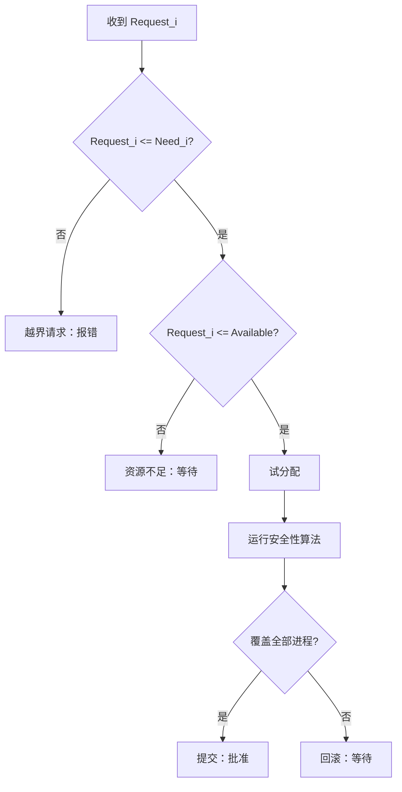

# 银行家算法

> [!abstract] 一句话定义
> 银行家算法（Banker's Algorithm）是一种**死锁避免**算法：进程提出资源请求后，系统先做一次“试分配”，只有当试分配后的状态仍存在一条能让所有进程依次完成的**安全序列**时，才真正批准请求；否则撤销试分配并让该进程等待。

银行家算法由 Dijkstra 提出。它借用银行授信的类比：银行不会因为账面上“现在还有钱”就立刻放款，而会检查放款后是否仍能安排所有客户完成业务并归还贷款。操作系统中的客户是进程，贷款额度是最大资源需求，现金是当前可用资源。[^mos]

> [!info] 知识网络
> - **前置知识**：[[17.1 并发同步概述：多执行流与共享可变状态]]、[[17.2 原子性、可见性与内存序]]
> - **核心关联**：[[17.3 锁机制、死锁与故障]]、[[17.4 条件同步：条件变量与信号量]]
> - **工程延伸**：[[17.6 并发队列：有界队列与无锁队列]]、[[17.7 进程间同步]]
> - **C++ 实践与调优**：[[17.8 Modern C++ 同步设施与实战并发模式]]、[[17.9 性能优化：IPC、锁与并发调优]]

---

## 1. 它解决的是什么问题

系统处理死锁通常有四类策略：

| 策略 | 核心做法 | 决策时点 |
| --- | --- | --- |
| 忽略 | 假设死锁极少发生 | 不处理 |
| 检测与恢复 | 允许死锁发生，再检测并回收 | 事后 |
| **死锁避免** | 根据当前状态与未来最大需求，只批准安全请求 | **每次分配前** |
| 死锁预防 | 从结构上破坏死锁四个必要条件之一 | 设计期 |

银行家算法属于第三类。它不要求系统彻底禁止“占有并等待”等行为，而是在每次分配前回答：

> **假如现在批准这次请求，系统是否仍能保证全部进程最终完成？**

这个“保证”依赖四个前提：

1. 每类资源的总量在检查期间不变；
2. 每个进程事先声明最大需求 `Max`；
3. 进程不会申请超过 `Max` 的资源；
4. 进程完成后会释放其持有的全部可重用资源。

缺少这些信息时，算法就无法证明安全性。

---

## 2. 安全状态、非安全状态与死锁

### 2.1 安全状态

如果存在一种进程排列：

$$
\langle P_{i_1}, P_{i_2}, \ldots, P_{i_n} \rangle
$$

使得每个进程在轮到自己时，其**剩余需求**都不超过当时可支配的资源，那么这个排列就是安全序列，当前状态就是安全状态。

这里的“可支配资源”不仅包括当前 `Available`，也包括前面已经假设完成的进程释放出来的资源。

### 2.2 非安全状态

非安全状态表示：**找不到一条能够保证所有进程完成的序列**。它不等于当前已经发生死锁。系统可能还能运行一段时间，甚至某个进程仍可能主动少申请资源或提前释放资源；只是操作系统不能把这些偶然行为当作保证。[^mos-unsafe]

### 2.3 死锁状态

死锁状态表示一组进程已经互相等待，且没有任何进程能够继续推进。死锁状态必然是非安全状态，但非安全状态未必已经死锁。

![[图片/SVG/银行家算法-安全状态与请求判定.svg|900]]

> [!warning] 最容易混淆的一句话
> **安全状态**是“存在保证”；**非安全状态**是“没有保证”；**死锁状态**是“已经无法前进”。

---

## 3. 数据结构与不变量

设系统有 $n$ 个进程、$m$ 类资源。经典实现维护以下结构：

| 名称 | 维度 | 含义 |
| --- | ---: | --- |
| `Total` | $m$ | 每类资源的系统总量 |
| `Available` | $m$ | 当前尚未分配的资源 |
| `Allocation` | $n \times m$ | 每个进程当前持有的资源 |
| `Max` | $n \times m$ | 每个进程事先声明的最大需求 |
| `Need` | $n \times m$ | 每个进程尚可能需要的资源 |
| `Request_i` | $m$ | 进程 $P_i$ 本次请求的资源 |

逐元素有：

$$
Need[i][j] = Max[i][j] - Allocation[i][j]
$$

每类资源还必须满足守恒不变量：

$$
Total[j] = Available[j] + \sum_{i=0}^{n-1} Allocation[i][j]
$$

### 3.1 经典资源模型

经典银行家算法把每类资源看成有限个**同质、可重复使用的实例**。例如 `Pr=2` 表示有两台可以互换的打印机；`Allocation[i][Pr]=1` 表示进程 $P_i$ 当前持有其中一台。`Max` 是最大声明（上界），并不表示进程一定会申请这么多。

安全性检查按最坏情况推演：假设某个进程可能一次性申请完整的 `Need[i]`，拿齐后完成并归还它持有的全部资源。实际进程如果会分批申请或提前归还资源，系统可能比检查结果更宽松，但算法不依赖这些偶然行为。

> [!warning] 模型适用边界
> 经典版本不直接表达资源实例之间不可互换、资源总量在检查期间变化、资源是一次性消耗品，或进程可能永远不释放资源等情况。遇到这些场景，需要扩展模型，或改用配额、超时、检测/恢复等机制。

`Total` 可以由守恒公式计算出来，并不是安全性检查必需的独立输入。示例代码只保存 `Available` 与 `Allocation`，避免同时维护两份可能互相矛盾的总量数据；实际系统仍可保留 `Total` 用来做一致性校验。

> [!info] 教材记号对照
> 《Modern Operating Systems》图 6-12 使用 `E` 表示总资源、`P` 表示已分配资源总量、`A` 表示可用资源；左矩阵 `C` 对应 `Allocation`，右矩阵 `R` 对应当前剩余需求 `Need`。本文采用更常见的 `Max / Allocation / Need / Available` 记号。

向量比较采用**逐分量比较**：

$$
X \le Y \iff \forall j,\; X[j] \le Y[j]
$$

因此 `(1, 0, 2) ≤ (1, 1, 2)` 成立，而 `(1, 2, 0) ≤ (2, 1, 3)` 不成立。

---

## 4. 安全性算法（Safety Algorithm）

安全性算法只做证明，不真正运行进程。它维护两个临时变量：

- `Work = Available`：在推演过程中可支配的资源；
- `Finish[i]`：进程 $P_i$ 是否已被证明可以完成。

### 4.1 算法步骤

1. 找一个尚未完成且满足 `Need[i] ≤ Work` 的进程；
2. 假设它取得剩余需求、运行结束并释放全部资源；
3. 令 `Work += Allocation[i]`，把它加入安全序列；
4. 重复，直到所有进程都完成，或找不到任何可推进的进程。

结果判定：

- 所有 `Finish[i] == true`：安全，得到一条安全序列；
- 仍有未完成进程且本轮无进展：非安全。

### 4.2 为什么是 `Work += Allocation[i]`

进程 $P_i$ 先从 `Work` 取得 `Need[i]`，完成后释放 `Allocation[i] + Need[i]`：

$$
Work' = Work - Need[i] + Allocation[i] + Need[i]
      = Work + Allocation[i]
$$

所以代码可以直接把它原来已经持有的 `Allocation[i]` 加回 `Work`。这是安全性算法中最容易写错的一行。

### 4.3 伪代码

```text
Work = Available
Finish[0..n-1] = false
SafeSequence = []

while 仍有未完成进程:
    找到 i，使 Finish[i] == false 且 Need[i] <= Work
    如果找不到:
        return UNSAFE

    Work = Work + Allocation[i]
    Finish[i] = true
    SafeSequence.push_back(i)

return SAFE, SafeSequence
```

如果同一轮有多个进程满足条件，任选一个都可以：完成一个进程后 `Work` 只会增加，不会减少。[^mos-safety]

### 4.4 安全性检查的保守性

`Need[i] ≤ Work` 检查的是“能否一次满足该进程的全部剩余最大需求”，而不是它下一次只申请一小部分资源时能否继续运行。因此安全性检查是一个**保守的最坏情况证明**：通过表示即使按最大声明推进，也存在完成路径；不通过表示系统无法对这种最坏情况作出保证，并不表示进程在所有实际行为下都一定卡死。

---

## 5. 资源请求算法（Resource-Request Algorithm）

当进程 $P_i$ 提交 `Request_i` 时，依次经过三道门。

### 5.1 合法性检查

$$
Request_i \le Need_i
$$

不成立说明进程申请超过了事先声明的最大需求。这不是“等一等”能解决的问题，而是调用方或声明本身出错。

### 5.2 当前可用性检查

$$
Request_i \le Available
$$

不成立说明当前资源不够，进程应等待。但即使成立，也**不能直接批准**，因为“拿得出来”不代表“拿完以后全局仍然安全”。

### 5.3 试分配与安全性检查

先临时执行：

$$
\begin{aligned}
Available &\leftarrow Available - Request_i \\
Allocation_i &\leftarrow Allocation_i + Request_i \\
Need_i &\leftarrow Need_i - Request_i
\end{aligned}
$$

然后运行安全性算法：

- 安全：提交这次修改；
- 非安全：把三项状态完整回滚，让 $P_i$ 等待。

> [!important] 工程语义
> 试分配、检查、提交或回滚必须对其他并发请求表现为一个原子决策。教学代码使用单线程可变状态；真实资源管理器需要互斥、串行化事件循环或事务化状态更新，否则两个请求可能分别看见同一份 `Available`。

### 5.4 进程完成后的真实释放

安全性算法里的“完成”只是推演；真实运行时，只有进程确实结束后，资源管理器才更新正式状态。若 $P_i$ 完成时当前持有的资源为 `Allocation[i]`，释放动作是：

```text
held = Allocation[i]
Available += held
移除 P_i；或将它的 Allocation、Max、Need 行全部置零并标记为 inactive
```

这里的 `Available` 是真实共享状态，而安全性算法中的 `Work` 是一次检查的临时副本，二者不能混用。安全性推演之所以只写 `Work += Allocation[i]`，是因为它已经假设先临时满足了 `Need[i]`，再把 `Allocation[i] + Need[i]` 全部归还。

---

## 6. 多资源示例：手算一条安全序列

下面采用《Modern Operating Systems》图 6-12 的五进程、四资源示例。资源顺序为：

```text
(T, Pl, Pr, B) = (磁带机, 绘图仪, 打印机, 蓝光机)
```

初始向量：

$$
Total=(6,3,4,2),\quad Assigned=(5,3,2,2),\quad Available=(1,0,2,0)
$$

### 6.1 当前分配与剩余需求

| 进程 | `Allocation` | `Need` |
| --- | --- | --- |
| A | `(3,0,1,1)` | `(1,1,0,0)` |
| B | `(0,1,0,0)` | `(0,1,1,2)` |
| C | `(1,1,1,0)` | `(3,1,0,0)` |
| D | `(1,1,0,1)` | `(0,0,1,0)` |
| E | `(0,0,0,0)` | `(2,1,1,0)` |

### 6.2 推演

初始 `Work=(1,0,2,0)`：

| 步骤 | 可完成进程 | 判据 | 完成后 `Work` |
| ---: | --- | --- | --- |
| 1 | D | `(0,0,1,0) ≤ (1,0,2,0)` | `(2,1,2,1)` |
| 2 | A | `(1,1,0,0) ≤ (2,1,2,1)` | `(5,1,3,2)` |
| 3 | B | `(0,1,1,2) ≤ (5,1,3,2)` | `(5,2,3,2)` |
| 4 | C | `(3,1,0,0) ≤ (5,2,3,2)` | `(6,3,4,2)` |
| 5 | E | `(2,1,1,0) ≤ (6,3,4,2)` | `(6,3,4,2)` |

因此：

$$
\langle D, A, B, C, E \rangle
$$

是一条安全序列，初始状态安全。

![[图片/SVG/银行家算法-多资源安全序列.svg|900]]

### 6.3 两次请求的差别

**请求一：B 再申请 1 台打印机。**

```text
Request_B = (0,0,1,0)
Available: (1,0,2,0) -> (1,0,1,0)
```

试分配后仍能找到安全序列，所以请求可以批准。

**请求二：随后 E 再申请最后 1 台打印机。**

```text
Request_E = (0,0,1,0)
Available: (1,0,1,0) -> (1,0,0,0)
```

此时 A、B、C、E 都缺绘图仪，D 缺打印机，没有任何一行满足 `Need ≤ Work`。试分配后的状态非安全，因此必须回滚并推迟 E 的请求。[^mos-example]

---

## 7. Modern C++17 实现

打包目录中的 `代码/银行家算法.cpp` 是以下片段按顺序合并后的可编译版本。

### 7.1 状态类型与逐分量比较

```cpp
#include <algorithm>
#include <cstddef>
#include <stdexcept>
#include <string>
#include <utility>
#include <vector>

using Count = int;
using ResourceVector = std::vector<Count>;
using ResourceMatrix = std::vector<ResourceVector>;

struct State {
    ResourceMatrix allocation;
    ResourceMatrix maximum;
    ResourceVector available;
};

struct SafetyResult {
    bool safe{};
    std::vector<std::size_t> sequence;
};
```

`std::vector` 让进程数与资源种类在运行时决定；状态对象按值拥有矩阵，不使用裸指针表达所有权。`SafetyResult` 同时返回布尔结论和安全序列，避免调用方在“安全”之外再做一次重复推演。

```cpp
[[nodiscard]] bool componentwise_leq(const ResourceVector& lhs,
                                     const ResourceVector& rhs) {
    if (lhs.size() != rhs.size()) {
        return false;
    }
    for (std::size_t j = 0; j < lhs.size(); ++j) {
        if (lhs[j] > rhs[j]) {
            return false;
        }
    }
    return true;
}
```

这里不能使用向量的字典序比较。银行家算法要求**每个资源分量都不超限**，所以必须逐列检查。

### 7.2 计算 `Need`

```cpp
[[nodiscard]] ResourceMatrix calculate_need(const State& state) {
    ResourceMatrix need = state.maximum;
    for (std::size_t i = 0; i < need.size(); ++i) {
        for (std::size_t j = 0; j < need[i].size(); ++j) {
            need[i][j] -= state.allocation[i][j];
        }
    }
    return need;
}
```

先复制 `maximum` 再原地相减，保证原状态不被修改。正式实现还应在入口验证矩阵维度、非负性以及 `Allocation ≤ Max`；完整源码已经包含这些检查。

### 7.3 安全性检查

```cpp
[[nodiscard]] SafetyResult check_safety(const State& state) {
    validate_state(state);
    const ResourceMatrix need = calculate_need(state);
    ResourceVector work = state.available;
    std::vector<bool> finished(state.allocation.size(), false);
    std::vector<std::size_t> sequence;
    sequence.reserve(state.allocation.size());

    while (sequence.size() < state.allocation.size()) {
        bool progressed = false;
        for (std::size_t i = 0; i < state.allocation.size(); ++i) {
            if (!finished[i] && componentwise_leq(need[i], work)) {
                for (std::size_t j = 0; j < work.size(); ++j) {
                    work[j] += state.allocation[i][j];
                }
                finished[i] = true;
                sequence.push_back(i);
                progressed = true;
                break;
            }
        }
        if (!progressed) {
            break;
        }
    }
    return {sequence.size() == state.allocation.size(), std::move(sequence)};
}
```

每找到一个可完成进程，就 `break` 并从头扫描。这样代码直接对应“完成一个进程后，资源池扩大，再重新判断所有候选者”的证明过程。`progressed == false` 是终止关键：若仍有未完成进程却没有任何一行可放行，状态就是非安全。

### 7.4 请求处理与回滚

```cpp
enum class RequestDecision {
    Granted,
    MustWait,
    ExceedsDeclaredMaximum,
    UnsafeRolledBack
};

struct RequestResult {
    RequestDecision decision{};
    SafetyResult trial_safety;
};
```

把“资源暂时不足”“违反最大需求”“试分配后不安全”分成不同结果非常重要：三者的调用方处置不同，不能都压成一个 `false`。

```cpp
[[nodiscard]] RequestResult request_resources(
    State& state, std::size_t process_id, const ResourceVector& request) {
    validate_state(state);
    const ResourceMatrix need = calculate_need(state);

    if (!componentwise_leq(request, need[process_id])) {
        return {RequestDecision::ExceedsDeclaredMaximum, {}};
    }
    if (!componentwise_leq(request, state.available)) {
        return {RequestDecision::MustWait, {}};
    }

    for (std::size_t j = 0; j < request.size(); ++j) {
        state.available[j] -= request[j];
        state.allocation[process_id][j] += request[j];
    }
```

前两次比较分别保护声明边界与当前容量。只有两关都通过才修改状态；这仍只是**试分配**。

```cpp
    SafetyResult trial = check_safety(state);
    if (trial.safe) {
        return {RequestDecision::Granted, std::move(trial)};
    }

    for (std::size_t j = 0; j < request.size(); ++j) {
        state.available[j] += request[j];
        state.allocation[process_id][j] -= request[j];
    }
    return {RequestDecision::UnsafeRolledBack, std::move(trial)};
}
```

安全则保留已经写入的状态；非安全则执行完全相反的操作恢复原值。由于 `Need` 是由 `Max - Allocation` 计算出来的，回滚 `Allocation` 后 `Need` 也随之恢复，不需要维护第三份可变矩阵。

> [!tip] 另一种事务化实现
> 当前示例采用“原地试分配 + 手动回滚”，直观且避免复制整个矩阵。若生产代码更看重异常安全，可以复制一份 `State trial = state`，只修改 `trial`，安全检查通过后再执行 `state = std::move(trial)`；代价是额外的 $O(nm)$ 拷贝，但不会因为遗漏回滚或中途抛异常而留下半更新状态。

### 7.5 控制流



这是单线程中的纯状态计算，没有多个并发执行主体或阻塞时序，因此用控制流图比时序图更准确。

### 7.6 编译与预期输出

```bash
g++ -std=c++17 -Wall -Wextra -Wpedantic -O2 \
    代码/银行家算法.cpp -o banker
./banker
```

```text
初始状态：安全，安全序列 D -> A -> B -> C -> E
B 请求 1 台打印机：已批准
批准后的安全序列 D -> A -> B -> C -> E
E 请求最后 1 台打印机：试分配后不安全，已回滚
```

---

## 8. 正确性直觉

### 8.1 为什么找到完整序列就能保证安全

若 `Need[i] ≤ Work`，系统有能力满足 $P_i$ 的全部剩余需求。按前提，$P_i$ 随后可以完成并释放资源，于是新的 `Work` 不小于旧的 `Work`。对安全序列逐项应用这个论证，最终所有进程都能完成。

### 8.2 为什么中途无进展就判非安全

若存在未完成进程，但对所有这些进程都有 `Need[i] ≰ Work`，那么没有任何一个进程能在当前可支配资源下获得完成所需的全部资源。安全序列的下一项不存在，因此无法建立“所有进程均可完成”的保证。

### 8.3 算法证明的不是唯一调度顺序

安全序列只是一个**完成证据**，不是操作系统以后必须严格执行的调度脚本。只要状态保持安全，运行时可以交错执行进程，也可能存在多条不同安全序列。

---

## 9. 复杂度

设进程数为 $n$、资源种类数为 $m$。

| 操作 | 时间复杂度 | 额外空间 |
| --- | ---: | ---: |
| 计算 `Need` | $O(nm)$ | $O(nm)$（若临时计算） |
| 一次安全性检查 | $O(n^2m)$ | $O(n+m)$，不计 `Need` |
| 一次资源请求判定 | $O(n^2m)$ | 与安全性检查相同 |

经典实现最多确认 $n$ 个进程；每确认一个进程，最坏要扫描 $n$ 行，每行比较 $m$ 个分量，因此是 $O(n^2m)$。

---

## 10. 常见错误

> [!bug] 实现陷阱
> 1. **只检查 `Request ≤ Available`**：这只能说明资源拿得出来，不能说明拿完后仍安全。
> 2. **把向量当标量比较**：必须逐资源分量比较，不能比较总和。
> 3. **完成后写成 `Work += Need`**：净释放量应是原 `Allocation`。
> 4. **试分配失败却少回滚一项**：`Available`、`Allocation`、显式存储的 `Need` 必须一致恢复。
> 5. **把非安全说成死锁**：非安全只是没有完成保证。
> 6. **接受负数请求或不一致矩阵**：输入校验是状态不变量的一部分。
> 7. **并发调用时不串行化决策**：两个线程可能重复消费同一份 `Available`。

> [!warning] 概念陷阱
> 安全性算法里的“假设某进程完成”不代表它此刻已经拿到 CPU 或实际运行；这只是用来证明存在一种可行完成顺序。

### 10.1 最佳实践

1. **先确认资源模型再套公式**：确认资源总量有限、实例可互换且会归还，确认 `Max` 是可信的上界。
2. **把 `Need` 作为派生数据**：由 `Max - Allocation` 统一计算，或在每次状态提交时同步更新，避免三份矩阵互相矛盾。
3. **把一次请求当作事务**：校验、试分配、安全检查和提交/回滚必须处在同一临界区；复杂实现可在副本上试算后一次提交。
4. **区分三种结果**：超过 `Need` 是非法请求，低于 `Available` 是暂时等待，试分配不安全是回滚等待。
5. **单独设计等待策略**：银行家算法不保证公平性；需要用 FIFO、年龄优先、配额或超时策略降低饥饿风险。

---

## 11. 为什么现实操作系统很少直接使用

银行家算法在理论上清晰，但完整前提在通用操作系统中通常不成立：

- 进程很少能提前准确声明最大资源需求；
- 进程集合会动态创建与退出；
- 资源可能故障或临时消失；
- 每次请求都做全局矩阵扫描，会增加共享资源管理路径的成本；
- 最大需求报得过大会造成保守拒绝，报得过小又会违反协议。

因此，现代系统更常使用局部配额、资源预留、容量水位、超时、锁顺序、事务回滚和 admission control 等机制。它们未必运行完整银行家算法，但保留了同一思想：

> **不要把资源分配到“所有人都差一点才能收尾”的状态；给完成路径保留余量。**

教材也指出，网络在缓冲区使用率较高时主动限流，可以看作类似“保留完成余量”的启发式做法。[^mos-practice]

### 11.1 与同步原语的职责边界

银行家算法只回答“这次资源分配会不会失去安全性”，不等于一套完整的并发同步设施：

| 银行家算法负责 | 仍需其它机制负责 |
| --- | --- |
| 根据 `Max / Allocation / Need / Available` 判断是否批准请求 | 用锁保证检查、试分配和提交/回滚的原子性 |
| 构造一条证明所有进程可完成的安全序列 | 用条件变量、信号量或等待队列实现阻塞与唤醒 |
| 拒绝会导致非安全状态的请求 | 处理公平性、优先级和长期等待，避免饥饿 |
| 在模型假设成立时避免资源死锁 | 处理进程崩溃、资源故障和最大需求未知等现实问题 |

因此，示例中的 `request_resources` **不是线程安全的资源管理器**。如果多个线程或进程共享同一个 `State`，必须把“校验 → 两道前置比较 → 试分配 → 安全性检查 → 提交或回滚”放进同一个串行化临界区；仅给最后的减法加锁是不够的。锁和死锁规避见 [[17.3 锁机制、死锁与故障]]，等待与唤醒见 [[17.4 条件同步：条件变量与信号量]]，跨进程场景见 [[17.7 进程间同步]]。

---

## 12. 面试问答

> [!question]- 安全状态一定不会死锁吗？
> 在银行家算法的前提成立、且系统只批准保持安全的请求时，可以保证存在一条让所有进程完成的顺序，因此能够避免资源死锁。若进程违反最大需求声明、资源突然故障或不释放资源，则证明前提被破坏，结论不再成立。

> [!question]- 非安全状态一定会死锁吗？
> 不一定。非安全表示系统无法保证所有进程完成。某个进程可能少申请资源或提前释放资源，使系统侥幸避开死锁；但算法不能依赖这种行为，所以会拒绝进入非安全状态。

> [!question]- `Request ≤ Available` 为什么还不够？
> 它只检查局部容量。分配后可能让所有进程都各自持有一部分资源，却没有任何进程拿得到完成所需的剩余资源。银行家算法还要检查试分配后的全局完成序列。

> [!question]- `Work += Allocation[i]` 为什么不是加 `Allocation[i] + Need[i]`？
> 推演中进程先从 `Work` 临时取得 `Need[i]`，完成后归还 `Allocation[i] + Need[i]`，两次 `Need[i]` 抵消，净增加量就是它原来持有的 `Allocation[i]`。

> [!question]- 安全序列唯一吗？
> 不唯一。只要每一步选中的进程满足 `Need ≤ Work`，都可构造出安全证据。不同扫描顺序可能返回不同安全序列。

> [!question]- 银行家算法和死锁检测算法一样吗？
> 不一样。银行家算法在**批准请求之前**使用 `Max` 与 `Need` 检查试分配后的安全性；死锁检测通常是在资源已经分配后，根据进程当前尚未满足的请求寻找可完成进程。两者都可能使用 `Work` 和 `Finish` 的推演框架，但决策时点和含义不同。

> [!question]- `Request ≤ Available` 不成立和试分配后不安全，有什么区别？
> 前者表示现在连这次请求都无法满足，通常等待资源释放；后者表示资源数量暂时够，但满足请求会破坏全局安全性，必须撤销试分配并推迟请求。两种情况的状态变化和调用方提示都不应混为一谈。

> [!question]- 银行家算法能保证请求最终不会饥饿吗？
> 不能。它只保证“批准后的状态安全”，不规定等待队列的公平策略。某个请求可能反复因为试分配不安全而等待，仍需 FIFO、年龄优先、配额或超时等策略处理长期等待。

---

## 13. 要点总结

| 结论 | 记忆方式 |
| --- | --- |
| 银行家算法是死锁避免，不是检测或预防 | 分配前做证明 |
| `Need = Max - Allocation` | 尚可能申请多少 |
| 安全状态存在覆盖全部进程的完成序列 | 有保证 |
| 非安全状态不等于已死锁 | 无保证 ≠ 已卡死 |
| 请求先过 `Need`、再过 `Available`、最后过安全性检查 | 三道门 |
| 试分配不安全必须完整回滚 | 先演算，后提交 |
| Safety check 的核心更新是 `Work += Allocation[i]` | 剩余需求借了又还 |
| 经典复杂度是 $O(n^2m)$ | n 次完成 × n 行 × m 列 |
| 资源是有限、可复用的同质实例，`Max` 是上界 | 先确认模型前提 |
| 银行家算法不负责加锁、唤醒和公平调度 | 安全性 ≠ 完整同步 |
| 实际系统更常采用类似的水位与预留启发式 | 思想常见，原算法少见 |

---

## 参考

[^mos]: Andrew S. Tanenbaum, Herbert Bos, *Modern Operating Systems*, 4th ed., Chapter 6, §6.5.3–6.5.4。银行家算法以银行授信类比资源分配，并在每次请求时检查结果状态是否安全。
[^mos-unsafe]: 同书 §6.5.2–6.5.3，Figures 6-9–6-11。教材明确区分安全、非安全与死锁：非安全状态没有完成保证，但不必然已经死锁。
[^mos-safety]: 同书 §6.5.4。多资源安全性检查反复寻找 `Need ≤ Available/Work` 的行，假设其完成并释放资源，直到全部完成或无行可选。
[^mos-example]: 同书 Figure 6-12 与其后示例。B 请求一台打印机后仍安全；随后 E 请求最后一台打印机会让可用向量降为 `(1,0,0,0)`，请求应推迟。
[^mos-practice]: 同书 §6.5.4。教材指出最大需求、进程集合和资源可用性在现实中难以固定，因此完整银行家算法很少直接使用，但保留余量的启发式仍常见。
