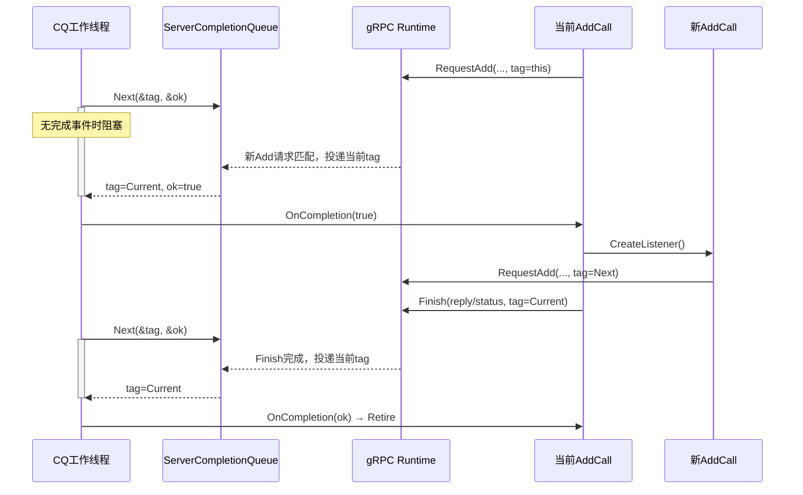
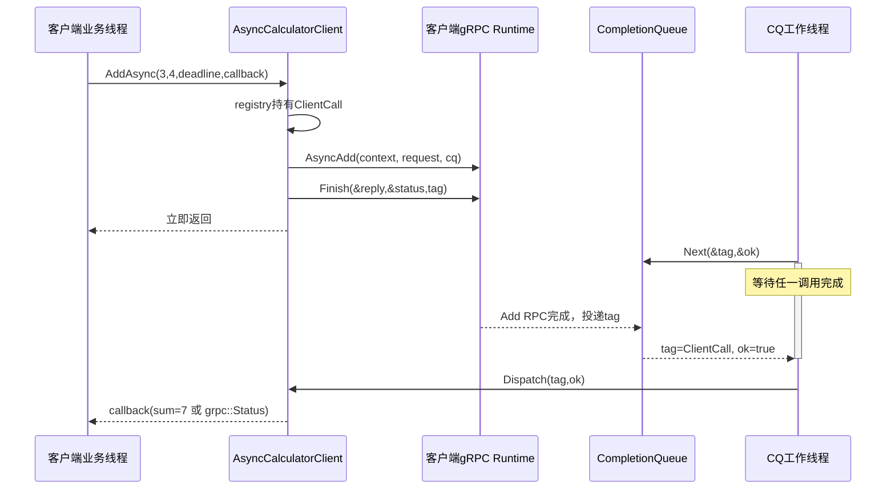
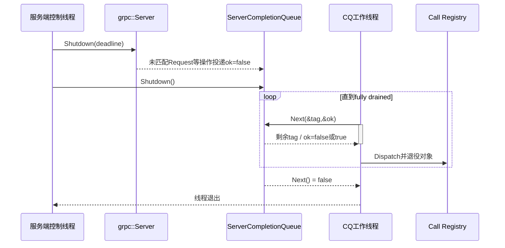

---
tags:
  - Linux
  - 网络编程基础
  - 应用层协议
  - RPC
  - gRPC
  - CompletionQueue
  - 状态机
aliases:
  - gRPC Completion Queue
  - gRPC CQ 异步 RPC
  - gRPC 异步 Add RPC
阅读次数: 0
---

# 18.5 gRPC Completion Queue：异步 Add RPC

[[18.1 RPC 协议模板|18.1 RPC 协议模板]] 用 14 B 帧头、`body_len`、`request_id` 和阻塞式精确读写，完整实现了 `AddViaRpc(client, 3, 4) → 7`；[[18.2 gRPC]] 又用 `.proto`、生成的 `Stub/Service` 和同步 Unary API 重写了同一个案例。

同步 gRPC 已经不需要手写 `ReadExactly()`、`WriteAll()` 和方法分发表，但调用线程仍然会阻塞在：

```cpp
grpc::Status status = stub_->Add(&context, request, &reply);
```

本篇继续保持相同的 `Add` 业务契约，只把调用模型切换为 **Completion Queue（CQ）异步 API**：

> **应用先向 gRPC runtime 登记一个异步操作和唯一 tag；runtime 在网络、HTTP/2 与消息处理推进到某个完成点后，把 tag 投递到 Completion Queue；CQ 工作线程取出 tag，再恢复对应 RPC 对象的状态机。**

因此，CQ 不是“另一种消息格式”，也不是应用直接操作的 socket 就绪队列。它是位于 gRPC runtime 之上的**完成事件队列**。

> [!important] 本文使用经典 CQ API
> gRPC C++ 当前同时提供同步 API、Completion Queue 异步 API 和 Callback/Reactor 异步 API。Callback API 的表达更直接，但 CQ 仍然适合学习“异步操作、tag、完成事件和对象生命周期”之间的关系。两套异步 API 的生命周期规则不能混用。

## 1. 先看全图：同一个 `Add(3, 4)` 如何穿过 CQ

![[图片/SVG/3_7_7_4_4_1.svg|1390]]

沿用 18.1 的自顶向下阅读方法，可以把 CQ 版拆成七层：

| 层次 | 这一层理解的对象 | 发起阶段 | 完成阶段 | 不应该关心什么 |
|:---:|:---|:---|:---|:---|
| ① 业务层 | `a`、`b`、`sum` | `AddAsync(3, 4, deadline, callback)` | callback 收到 `7` 或错误 | HTTP/2 帧 |
| ② 消息层 | `AddRequest/AddReply` | `set_a()`、`set_b()` | `reply.sum()` | protobuf 线路字节 |
| ③ 生成 API | `Stub/AsyncService` | `AsyncAdd()` / `RequestAdd()` | `Finish()` | socket 半包 |
| ④ RPC 对象 | `ClientCall/AddCall` | 保存 context、消息、状态 | 按阶段继续或退役 | fd 兴趣集 |
| ⑤ Completion Queue | `tag + ok` | 接收完成通知 | `Next()` 取回事件 | Add 的业务规则 |
| ⑥ gRPC runtime | call、stream、deadline | 推进序列化与 HTTP/2 | 产生高层完成事件 | 应用对象所有权 |
| ⑦ TCP | 可靠有序字节流 | 承载 HTTP/2 字节 | 连接关闭、重传、流控 | protobuf 字段含义 |

对象变化链是：

```text
业务值 3、4
    ↓ AddRequest
protobuf 消息对象
    ↓ Stub::AsyncAdd / AsyncService::RequestAdd
一次 gRPC Unary call
    ↓ tag 绑定到异步操作
等待中的 ClientCall / AddCall
    ↓ runtime 完成某一步
CompletionQueue 中的 tag + ok
    ↓ CQ 线程分发
继续状态机或完成 callback
```

与 [[18.3 非阻塞 RPC：epoll + 状态机]] 相比，最大的变化是事件粒度：

```text
epoll：fd 现在可读 / 可写
CQ：某个 Request / Read / Write / Finish 操作已经完成
```

应用不再维护 TCP 输入输出缓冲区和帧解析器，但仍然必须维护**每个 RPC 对象处于哪个阶段、谁拥有它、何时可以销毁它**。

---

## 2. 从 18.1 到 CQ：哪些不变量被谁接管

| 18.1 手写机制 | 同步 gRPC | CQ 异步 gRPC | 最终责任方 |
|:---|:---|:---|:---|
| `Add` 方法号 | `.proto` 中的 `rpc Add` | 不变 | IDL + 生成代码 |
| 8 B/4 B 手写消息体 | `AddRequest/AddReply` | 不变 | protobuf runtime |
| 14 B 自定义帧 | gRPC 消息前缀 + HTTP/2 | 不变 | gRPC runtime |
| `request_id` | runtime 内部调用/stream 状态 | 不变 | gRPC runtime |
| `ReadExactly/WriteAll` | runtime 内部推进 | runtime 内部推进 | gRPC runtime |
| 同步函数栈保存调用状态 | `Stub::Add()` 阻塞栈帧 | `ClientCall/AddCall` 长期对象 | **应用** |
| 返回值/异常 | `grpc::Status` + reply | CQ 事件后检查 `Status` + reply | **应用** |
| 超时 | `ClientContext::set_deadline()` | 不变，但完成是异步事件 | 应用配置 + runtime |
| 业务幂等性 | 业务自行设计 | 不变 | **业务** |

CQ 没有改变消息契约，也没有替业务决定重试、幂等和授权。它只把同步调用里“等到整次 RPC 完成才返回”的控制流，展开为多个可恢复的完成事件。

---

## 3. 第 ①～② 层：`.proto` 与 Add 业务语义完全不变

本篇继续使用 [[18.2 gRPC]] 中的 `calculator.proto`：

```proto
syntax = "proto3";

package rpcdemo;

service Calculator {
  rpc Add(AddRequest) returns (AddReply);
}

message AddRequest {
  uint32 a = 1;
  uint32 b = 2;
}

message AddReply {
  uint32 sum = 1;
}
```

CQ 只改变 C++ 调用方式，不改变：

```text
输入：两个 uint32
输出：一个 uint32
溢出：INVALID_ARGUMENT
方法身份：/rpcdemo.Calculator/Add
```

客户端仍然构造生成的消息对象：

```cpp
rpcdemo::AddRequest request;
request.set_a(3);
request.set_b(4);
```

服务端仍然执行同一条溢出判断：

```cpp
const std::uint32_t a = request.a();
const std::uint32_t b = request.b();
if (b > std::numeric_limits<std::uint32_t>::max() - a) {
    status = grpc::Status{
        grpc::StatusCode::INVALID_ARGUMENT,
        "uint32 addition overflow"};
} else {
    reply.set_sum(a + b);
    status = grpc::Status::OK;
}
```

这段判断属于 Add 的业务层，不能因为切换到异步 API 就搬进 CQ 事件循环或用 `ok=false` 代替。`ok` 表达的是**某个异步操作是否正常完成**；加法溢出仍然要通过稳定的 `grpc::Status` 返回。

---

## 4. 第 ③～⑤ 层：Completion Queue 的三个核心对象

### 4.1 异步操作：先登记“完成后通知我”

CQ API 的基本形式是：

```text
发起异步操作(..., tag)
    ↓
runtime 在后台推进
    ↓
cq.Next(&tag, &ok)
```

常见操作包括：

| 方向 | 操作 | CQ 事件表示什么 |
|:---|:---|:---|
| 服务端 | `AsyncService::RequestAdd(...)` | 一个新 Add RPC 已匹配到这个请求槽 |
| 服务端 | `ServerAsyncResponseWriter::Finish(...)` | 响应状态与消息的发送阶段已经完成 |
| 客户端 | `Stub::AsyncAdd(...)` | 创建异步 Unary 调用句柄 |
| 客户端 | `ClientAsyncResponseReader::Finish(...)` | reply 与最终 `grpc::Status` 已可读取 |

“发起操作”与“操作完成”不在同一个调用栈中，因此 tag 必须把完成事件关联回某个长期存在的上层对象。

### 4.2 tag：不是所有权，而是恢复句柄

`tag` 的类型是 `void*`。经典示例常传 `this`：

```cpp
service_->RequestAdd(
    &context_, &request_, &responder_, cq_, cq_, this);
```

这句话只表示：

> 当这个 `RequestAdd` 完成时，把同一个地址放进 CQ，使事件循环知道该恢复哪个对象。

它**不表示 CQ 拥有这个对象**，也不保证对象自动存活。本文让一个 registry 用 `std::unique_ptr` 真正拥有 RPC 对象；传给 gRPC 的裸指针只作为稳定身份，不表达资源所有权。

### 4.3 `ok`：不是 RPC 业务成功

`CompletionQueue::Next(&tag, &ok)` 中：

- `tag` 告诉应用“哪一步操作完成了”；
- `ok` 告诉应用“这一步是否以该操作的正常方式完成”。

对于本文用到的 unary 操作：

| CQ 事件 | `ok=true` | `ok=false` |
|:---|:---|:---|
| 服务端 `RequestAdd` | 确实匹配到一个新 RPC | server shutdown 前未匹配到请求 |
| 服务端 `Finish` | 响应准备进入/完成正常发送路径 | call 已死亡，如取消、deadline 或连接中断 |
| 客户端 `Finish` | reply 与 `grpc::Status` 可检查 | API 文档规定该事件通常应为 true；业务结果仍看 `Status` |

因此下面这个判断是错的：

```cpp
if (ok) {
    // 错：不能据此声称 Add 成功
}
```

正确层次是：

```text
先看 ok：当前异步操作是否有效完成
再看 grpc::Status：整次 RPC 是否成功
最后看 reply：业务结果是什么
```

---

## 5. 服务端状态机：一个 `AddCall` 代表一次 RPC 生命周期

![[图片/SVG/3_7_7_4_4_2.svg|1240]]

### 5.1 为什么至少需要 `Requesting → Finishing`

Unary 服务端的一次调用有两个明显完成点：

1. `RequestAdd` 匹配到一个新请求；
2. `Finish` 完成响应阶段。

所以一个最小状态机可以写成：

```cpp
enum class AddCallState {
    Requesting,
    Finishing,
};
```

经典教程使用 `CREATE / PROCESS / FINISH` 三态；本文把“收到请求后立即执行的同步业务阶段”当作一次 CQ 回调内的过渡，因此只保留两个**等待完成事件的状态**。两种写法描述的是同一条生命周期。

### 5.2 registry 负责所有权，tag 只负责身份

先定义统一事件接口：

```cpp
class CqTag {
public:
    enum class Disposition {
        Keep,
        Retire,
    };

    virtual ~CqTag() = default;
    virtual Disposition OnCompletion(bool ok) = 0;
};
```

`OnCompletion()` 返回 `Retire` 时，registry 才能销毁对象。这样没有任何 `delete this`，对象所有权始终集中在容器中。

```cpp
class ServerCallRegistry {
public:
    ServerCallRegistry(rpcdemo::Calculator::AsyncService& service,
                       grpc::ServerCompletionQueue& cq)
        : service_(service), cq_(cq) {}

    void CreateListener();
    void Dispatch(void* raw_tag, bool ok);

private:
    rpcdemo::Calculator::AsyncService& service_;
    grpc::ServerCompletionQueue& cq_;
    std::unordered_map<CqTag*, std::unique_ptr<CqTag>> calls_;
};
```

这里采用**一个 CQ、一个轮询线程**，因此 `calls_` 只在该线程中修改。若多个线程同时轮询同一 CQ，registry、业务状态以及 shutdown 路径都必须增加同步或按 CQ 分片。

### 5.3 `AddCall` 保存直到 Finish 完成所需的全部对象

```cpp
class AddCall final : public CqTag {
public:
    AddCall(ServerCallRegistry& owner,
            rpcdemo::Calculator::AsyncService& service,
            grpc::ServerCompletionQueue& cq)
        : owner_(owner),
          service_(service),
          cq_(cq),
          responder_(&context_) {}

    void Start();
    Disposition OnCompletion(bool ok) override;

private:
    ServerCallRegistry& owner_;
    rpcdemo::Calculator::AsyncService& service_;
    grpc::ServerCompletionQueue& cq_;

    grpc::ServerContext context_;
    rpcdemo::AddRequest request_;
    rpcdemo::AddReply reply_;
    grpc::ServerAsyncResponseWriter<rpcdemo::AddReply> responder_;
    AddCallState state_ = AddCallState::Requesting;
};
```

`context_`、`request_`、`reply_` 和 `responder_` 都是当前 RPC 的生命周期状态。它们必须活到相应完成事件返回，不能放在 `Start()` 的局部变量中，也不能把其地址保存到比 `AddCall` 活得更久的异步任务里。

### 5.4 先让 registry 取得所有权，再把 tag 交给 runtime

```cpp
void ServerCallRegistry::CreateListener() {
    auto call = std::make_unique<AddCall>(*this, service_, cq_);
    AddCall* const tag = call.get();
    calls_.emplace(tag, std::move(call));
    tag->Start();
}

void AddCall::Start() {
    service_.RequestAdd(
        &context_,
        &request_,
        &responder_,
        &cq_,
        &cq_,
        this);
}
```

顺序不能反过来：先把 `unique_ptr` 放入 registry，确保对象已有明确所有者；再调用 `RequestAdd()` 把稳定地址注册为 tag。这样即使完成事件很快到达，对象也不会处于无人持有的窗口。

### 5.5 收到 Request 事件后，先补位，再完成本次调用

```cpp
CqTag::Disposition AddCall::OnCompletion(bool ok) {
    if (state_ == AddCallState::Requesting) {
        if (!ok) {
            return Disposition::Retire;
        }

        owner_.CreateListener();

        const std::uint32_t a = request_.a();
        const std::uint32_t b = request_.b();
        grpc::Status status;
        if (b > std::numeric_limits<std::uint32_t>::max() - a) {
            status = grpc::Status{
                grpc::StatusCode::INVALID_ARGUMENT,
                "uint32 addition overflow"};
        } else {
            reply_.set_sum(a + b);
            status = grpc::Status::OK;
        }

        state_ = AddCallState::Finishing;
        responder_.Finish(reply_, status, this);
        return Disposition::Keep;
    }

    return Disposition::Retire;
}
```

`owner_.CreateListener()` 必须在处理当前业务时尽早执行。当前对象已经被本次 RPC 占用；若不补一个新的 `RequestAdd` 槽，服务端就没有对象继续等待下一个 Add 请求。

`Finish()` 也不是“函数返回后对象就可以销毁”。它只是发起异步完成操作；必须等同一个 tag 再次从 CQ 返回，状态为 `Finishing` 时，registry 才能退役对象。



图中最容易忽略的是两个等待点：`RequestAdd` 和 `Finish` 都只是登记操作，真正的生命周期推进发生在 CQ 再次返回 tag 时。

---

## 6. 服务端 CQ 事件循环：`Next()` 是统一阻塞点

```cpp
void ServerCallRegistry::Dispatch(void* raw_tag, bool ok) {
    auto* const tag = static_cast<CqTag*>(raw_tag);
    const auto it = calls_.find(tag);
    if (it == calls_.end()) {
        throw std::logic_error("CompletionQueue returned an unknown tag");
    }

    // OnCompletion() 可能补注册新的 AddCall，导致 unordered_map rehash。
    // 因此只保存 pointee 地址，不在回调后继续使用旧迭代器。
    CqTag* const call = it->second.get();
    const CqTag::Disposition disposition = call->OnCompletion(ok);
    if (disposition == CqTag::Disposition::Retire) {
        calls_.erase(tag);
    }
}
```

事件循环只做“取事件 → 恢复对应对象”：

```cpp
void RunServerCompletionQueue(
    grpc::ServerCompletionQueue& cq,
    ServerCallRegistry& registry) {
    registry.CreateListener();

    void* tag = nullptr;
    bool ok = false;
    while (cq.Next(&tag, &ok)) {
        registry.Dispatch(tag, ok);
    }
}
```

`cq.Next()` 会阻塞，直到：

- 有完成事件可取；或
- CQ 已请求 shutdown 且所有已登记事件都被取空。

因此它与 `epoll_wait()` 一样是统一等待点，但返回的不是 fd，而是应用之前提交的 tag。`Next()` 返回 `false` 表示 CQ 已经 **shutdown 且 fully drained**，此后工作线程才能安全退出。

---

## 7. 客户端：`AsyncAdd + Finish` 把同步返回值变成完成事件

### 7.1 每个调用对象保存 context、reply、status 和 reader

```cpp
struct ClientCall final : CqTag {
    using Completion = std::function<void(
        std::variant<std::uint32_t, grpc::Status>)>;

    grpc::ClientContext context;
    rpcdemo::AddReply reply;
    grpc::Status status;
    std::unique_ptr<grpc::ClientAsyncResponseReader<rpcdemo::AddReply>> reader;
    Completion completion;

    Disposition OnCompletion(bool ok) override {
        if (!ok) {
            completion(grpc::Status{
                grpc::StatusCode::UNKNOWN,
                "client Finish completion was not delivered normally"});
            return Disposition::Retire;
        }
        if (!status.ok()) {
            completion(status);
            return Disposition::Retire;
        }
        completion(reply.sum());
        return Disposition::Retire;
    }
};
```

客户端 unary 调用通常只等待一个 `Finish` 完成事件，因此不一定需要显式状态枚举；“对象仍在 registry 中且已经提交 `Finish`”本身就足以表达等待状态。

> [!note] `ok` 与 `status` 的边界
> 对客户端 `Finish`，当前 gRPC C++ API 文档说明完成事件的 `ok` 应当为 true；整次调用的连接错误、deadline、取消和服务端状态都通过 `grpc::Status` 表达。代码仍保留 `!ok` 防御分支，但不能用 `ok` 代替 `status.ok()`。

### 7.2 发起调用：先注册所有权，再提交 `Finish`

```cpp
class AsyncCalculatorClient {
public:
    using Result = std::variant<std::uint32_t, grpc::Status>;
    using Completion = std::function<void(Result)>;

    AsyncCalculatorClient(rpcdemo::Calculator::Stub& stub,
                          grpc::CompletionQueue& cq)
        : stub_(stub), cq_(cq) {}

    void AddAsync(std::uint32_t a,
                  std::uint32_t b,
                  std::chrono::system_clock::time_point deadline,
                  Completion completion);
    void Dispatch(void* raw_tag, bool ok);

private:
    rpcdemo::Calculator::Stub& stub_;
    grpc::CompletionQueue& cq_;
    std::unordered_map<CqTag*, std::unique_ptr<CqTag>> calls_;
};
```

```cpp
void AsyncCalculatorClient::AddAsync(
    std::uint32_t a,
    std::uint32_t b,
    std::chrono::system_clock::time_point deadline,
    Completion completion) {
    rpcdemo::AddRequest request;
    request.set_a(a);
    request.set_b(b);

    auto call = std::make_unique<ClientCall>();
    call->context.set_deadline(deadline);
    call->completion = std::move(completion);

    ClientCall* const tag = call.get();
    calls_.emplace(tag, std::move(call));

    tag->reader = stub_.AsyncAdd(&tag->context, request, &cq_);
    tag->reader->Finish(&tag->reply, &tag->status, tag);
}
```

`request` 可以是局部变量，因为生成的 `AsyncAdd()` 在返回前已经取得发起调用所需的数据；`context`、`reply`、`status` 和 `reader` 则必须跟随 `ClientCall` 活到 Finish tag 返回。

客户端的 `Dispatch()` 与服务端 registry 使用同一条规则：找到 tag，先保存稳定的 pointee 地址，调用 `OnCompletion(ok)`，最后按 tag 键退役对象。不要在回调后继续使用可能因容器插入而失效的 `unordered_map` 迭代器。callback 的执行线程就是 CQ poller 线程，不能在里面做长时间阻塞工作。

### 7.3 一次客户端调用的实际时序



同步 API 把等待藏在 `Stub::Add()` 里面；CQ API 则把等待显式放在共享 `CompletionQueue::Next()` 中，并用 tag 恢复某一个调用对象。

---

## 8. tag、HTTP/2 stream 与业务幂等键不是一回事

这三个标识分别属于不同层：

| 标识 | 生命周期 | 作用 | 是否可用于业务去重 |
|:---|:---|:---|:---:|
| `void* tag` | 一次异步操作 | CQ 返回时恢复应用对象 | 否 |
| gRPC/HTTP/2 call/stream 标识 | 一次传输层 RPC | runtime 关联请求、响应与流控 | 否 |
| 业务幂等键 | 一次业务意图，可跨重试 | 服务端持久化去重 | **是** |

客户端 deadline 到期时，CQ 最终会返回带失败 `grpc::Status` 的调用结果，但这仍然不能证明服务端没有执行。创建订单、扣减库存等非幂等方法，安全重试仍然需要业务幂等键；tag 和 stream ID 都不能替代它。

---

## 9. shutdown：先停 server，再停 CQ，最后 drain 完成事件

![[图片/SVG/3_7_7_4_4_3.svg|1240]]

服务端停止时必须遵守顺序：

```cpp
server->Shutdown(deadline); // 先停止接收新 RPC，并给在途调用收尾机会
server_cq->Shutdown();      // 再请求 CQ 关闭
poller.join();              // poller 继续 Next，直到队列 fully drained
```

CQ shutdown 不是“立刻丢掉所有 tag”。已经登记的操作仍会产生完成事件，其中一部分会带 `ok=false`。poller 必须继续消费，直到 `Next()` 返回 `false`，registry 才能确认不会再收到指向现有对象的 tag。

客户端也应遵循同样原则：

1. 停止发起新调用；
2. 取消或等待在途 `ClientContext`；
3. 调用 `client_cq.Shutdown()`；
4. 继续 drain，完成或失败所有 callback；
5. `Next()` 返回 `false` 后再销毁 CQ 与 registry。

如果先销毁 RPC 对象，再让 CQ 返回旧 tag，就会形成悬空指针；如果不 drain，调用对象与 callback 又可能永远留在 registry 中。



图中 shutdown 之后仍有事件，这是正确行为而不是异常；这些事件正是应用安全结束对象生命周期所需的最后通知。

---

## 10. CQ 与 epoll 状态机的逐层对照

| 问题 | epoll + 自定义协议 | gRPC Completion Queue |
|:---|:---|:---|
| 等待对象 | 多个 fd | 多个异步 gRPC 操作 |
| 返回标识 | `epoll_event.data.ptr` | `void* tag` |
| 事件粒度 | 可读、可写、HUP、ERR | Request、Read、Write、Finish 完成 |
| 半包/短写 | 应用维护 buffer 与 offset | gRPC runtime 维护 |
| 消息定界 | 应用解析 `body_len` | protobuf + gRPC message + HTTP/2 |
| 并发关联 | `request_id -> PendingCall` | runtime call 状态 + tag 对象 |
| 超时 | 应用 timer + tombstone | `ClientContext` deadline + 完成状态 |
| 背压 | 输出高水位、在途调用上限 | runtime 流控之外，应用仍需限制在途 RPC 与业务队列 |
| 对象销毁 | 连接关闭时失败 PendingCall | tag 全部返回并被 drain 后退役 Call 对象 |

二者真正相同的原则是：

> **异步控制流不会自动消失，只是从阻塞调用栈迁移到了显式状态对象；状态对象必须有唯一所有者，并且只能在确定再无事件引用它之后销毁。**

---

## 11. 多线程轮询 CQ 时新增的边界

一个 CQ 可以被多个线程调用 `Next()`，但“API 允许”不等于应用对象自动线程安全。多 poller 模型至少要决定：

```text
同一个 Call 对象的不同完成事件是否可能由不同线程处理
registry 如何同步
业务 callback 在哪个线程执行
是否把耗时业务交给独立线程池
shutdown 时谁负责停止与 join
每个 CQ 承载多少连接和 in-flight calls
```

入门实现先采用“一 CQ 一 poller”，把对象生命周期写正确；需要扩展时，再选择：

- 多个 CQ，每个 CQ 固定若干 poller 或一条线程；
- 一个 CQ 多 poller，但 registry 与共享状态加同步；
- 使用 Callback/Reactor API，把操作阶段表达成框架回调。

不要在没有线程归属设计的情况下，仅靠多开几个 `Next()` 线程追求吞吐量。

---

## 12. 常见错误

### 12.1 把 `ok` 当成 `grpc::Status::OK`

`ok` 是操作级完成语义，业务结果必须检查 `grpc::Status`。

### 12.2 `Finish()` 后立刻销毁对象

`Finish()` 只是登记异步操作；必须等待 Finish tag 返回。

### 12.3 当前 `AddCall` 开始处理后没有补 listener

没有新的 `RequestAdd()` 槽，服务端可能只处理一次调用，或降低并发接单能力。

### 12.4 tag 指向局部变量

函数返回后地址失效，CQ 稍后交回的 tag 会变成悬空指针。

### 12.5 用裸 `new/delete this` 扩散所有权

官方入门示例为了缩短代码常这样写。工程实现应把所有权集中在 registry、arena 或明确的生命周期管理器中；tag 只传非拥有地址。

### 12.6 先 shutdown CQ，再 shutdown server

服务端仍可能向 CQ 产生事件。应先停止 server，再 shutdown CQ，最后 drain。

### 12.7 callback 在 CQ 线程做阻塞工作

一个慢 callback 会阻塞该 poller 对其他完成事件的分发。耗时工作要进入业务线程池，并为队列设置上限。

### 12.8 认为 CQ 自动解决业务背压

HTTP/2 流控限制的是传输窗口，不等于限制数据库队列、CPU 任务、内存占用或 in-flight RPC 数量。应用仍需过载保护。

---

## 13. 从零重写时的检查顺序

1. **业务契约**：是否仍保持 Add 的输入、输出和溢出状态？
2. **异步操作**：每次 `Request/Read/Write/Finish` 是否都有唯一 tag？
3. **所有权**：谁拥有 tag 指向的对象？它会活到完成事件回来吗？
4. **状态机**：当前 tag 返回时，对象处于哪个阶段？下一步允许发起什么操作？
5. **`ok` 语义**：是否按具体操作解释，而不是当作统一业务状态？
6. **客户端结果**：是否最终检查 `grpc::Status` 与 reply？
7. **服务端补位**：处理当前请求前是否已经注册下一个 listener？
8. **线程归属**：callback、registry 和业务处理分别在哪个线程？
9. **deadline/取消**：业务能否及时停止并释放资源？
10. **shutdown**：是否先 server、再 CQ、最后 drain 到 `Next()==false`？
11. **资源上限**：in-flight calls、业务队列、消息大小与并发度是否有限？

最终可以把 CQ 模型压缩成一条公式：

```text
异步操作 + 唯一 tag
    → CompletionQueue 完成事件
    → 恢复长期 RPC 对象
    → 根据状态发起下一步或退役
```

[[18.3 非阻塞 RPC：epoll + 状态机]] 展示的是“从 fd 就绪事件开始亲手维护 RPC runtime”；本篇展示的是“gRPC 已经接管底层 runtime 后，应用仍然必须维护的调用对象状态机”。

## 参考资料

- [[18.1 RPC 协议模板|18.1 RPC 协议模板]]：Add 业务语义、调用关联与错误边界。
- [[18.2 gRPC]]：`.proto`、生成代码、同步 Unary Add 示例与 gRPC 分层。
- [[18.3 非阻塞 RPC：epoll + 状态机]]：fd 就绪事件、连接状态机与 CQ 的对照基线。
- gRPC C++ Documentation，*Asynchronous-API tutorial*。
- gRPC C++ API Reference，`grpc::CompletionQueue`、`grpc::ServerCompletionQueue`。
- gRPC C++ Documentation，*Asynchronous Callback API Tutorial*。
