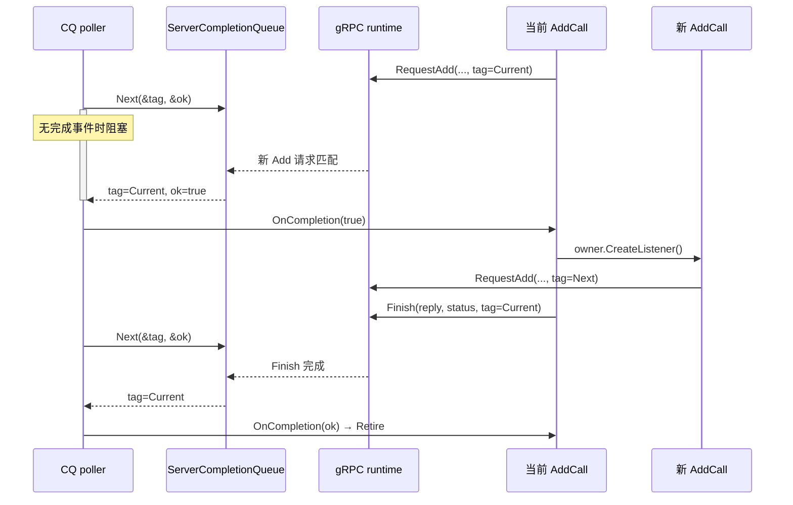
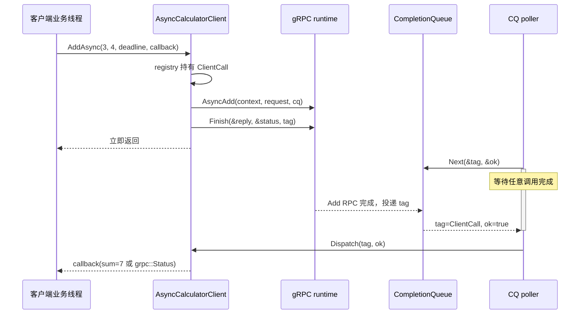

---
tags:
  - Linux
  - 网络编程基础
  - 应用层协议
  - RPC
  - gRPC
  - CompletionQueue
  - 状态机
aliases:
  - gRPC Completion Queue
  - gRPC CQ 异步 RPC
  - gRPC 异步 Add RPC
阅读次数: 0
---

# 18.5 gRPC Completion Queue：异步 Add RPC

[[18.1 RPC 协议模板|18.1 RPC 协议模板]] 手写了帧头、`request_id`、精确读写和方法分发；[[18.2 gRPC]] 用 `.proto` 与同步 Unary API 重写了同一个 `Add(3, 4) → 7`。本篇继续保持相同业务契约，只把同步调用栈展开成 **Completion Queue（CQ）完成事件 + 长期 RPC 对象状态机**。

> **应用先提交异步操作并附带唯一 tag；gRPC runtime 在后台推进 protobuf、HTTP/2 与 socket I/O；操作到达完成点后，runtime 把 `tag + ok` 投递到 CQ；poller 线程取回 tag，恢复对应对象。**

> [!important] 三个层次不要混淆
> `tag` 回答“恢复哪个本地对象”；`ok` 回答“当前异步操作是否按该操作的正常语义完成”；`grpc::Status + reply` 才回答“整次 RPC 和业务结果是什么”。

## 1. 总体结构

![[图片/SVG/3_7_7_4_4_1.svg|1240]]

| 层次 | 应用看到的对象 | gRPC runtime 接管的内容 |
|---|---|---|
| 业务层 | `a`、`b`、`sum`、callback | 不接管业务语义 |
| 消息层 | `AddRequest`、`AddReply` | protobuf 编解码 |
| 生成 API | `Stub`、`AsyncService` | 方法路径与调用骨架 |
| RPC 对象 | `ClientCall`、`AddCall` | 应用仍负责状态和生命周期 |
| Completion Queue | `tag + ok` | 保存完成通知 |
| 传输层 | 应用不直接操作 fd | HTTP/2、流控、socket I/O |

与 [[18.3 非阻塞 RPC：epoll + 状态机]] 的事件粒度不同：

```text
epoll：某个 fd 现在可读、可写或发生关闭
CQ：某个 Request / Read / Write / Finish 操作已经完成
```

CQ 省掉了应用层的半包、短写与帧解析器，但没有省掉对象所有权、阶段转换、deadline、背压和 shutdown。

---

## 2. `.proto` 与 Add 业务语义不变

```proto
syntax = "proto3";

package rpcdemo;

service Calculator {
  // Unary RPC：一个请求对应一个响应。
  rpc Add(AddRequest) returns (AddReply);
}

message AddRequest {
  // 字段号是线路 schema 的稳定身份，后续不要随意复用。
  uint32 a = 1;
  uint32 b = 2;
}

message AddReply {
  uint32 sum = 1;
}
```

异步 API 只改变控制流，不改变输入、输出和错误契约。加法溢出仍应通过 `grpc::StatusCode::INVALID_ARGUMENT` 返回，不能用 CQ 的 `ok=false` 表示业务错误。

---

## 3. CQ 的统一 tag 接口：tag 是身份，不是所有权

```cpp
class CqTag {
public:
    enum class Disposition {
        Keep,   // 当前对象还提交了异步操作，必须继续存活。
        Retire, // 已不会再产生指向该对象的 tag，可以从 registry 删除。
    };

    virtual ~CqTag() = default;

    // CQ poller 把具体完成事件的 ok 传进来。
    // 返回值只决定对象生命周期，不直接表达 RPC 业务成功。
    virtual Disposition OnCompletion(bool ok) = 0;
};
```

经典示例常把 `this` 作为 `void* tag`。这只意味着 CQ 稍后会交回同一个地址；CQ 不会替应用 `delete` 对象，也不会自动延长对象寿命。下面统一由 registry 中的 `std::unique_ptr` 持有对象。

---

## 4. 服务端：一个 `AddCall` 代表一次 Unary RPC 生命周期

### 4.1 状态只枚举“正在等待哪个完成事件”

```cpp
enum class AddCallState {
    Requesting, // 已提交 RequestAdd，等待新请求匹配。
    Finishing,  // 已提交 Finish，等待响应阶段完成。
};
```

收到 Request 事件后，业务计算在一次 CQ 回调内同步完成，所以不必额外保存 `Processing` 等待态。若业务被投递到线程池，则应增加显式处理态以及跨线程回投 EventLoop/CQ 的规则。

### 4.2 registry 集中管理所有权

```cpp
class ServerCallRegistry {
public:
    ServerCallRegistry(rpcdemo::Calculator::AsyncService& service,
                       grpc::ServerCompletionQueue& cq)
        : service_(service), cq_(cq) {}

    // 创建一个新的 RequestAdd 槽，使服务端始终有人等待下一次 Add。
    void CreateListener();

    // 根据 CQ 返回的地址找到真正对象，再推进状态机。
    void Dispatch(void* raw_tag, bool ok);

private:
    // 非拥有引用：service 与 cq 的寿命必须覆盖整个 registry。
    rpcdemo::Calculator::AsyncService& service_;
    grpc::ServerCompletionQueue& cq_;

    // key 是提交给 CQ 的稳定身份；value 才是真正的唯一所有者。
    std::unordered_map<CqTag*, std::unique_ptr<CqTag>> calls_;
};
```

本文约定“一 CQ 一 poller”，因此 `calls_` 只在 poller 线程修改。多个线程同时 `Next()` 时，registry 与共享业务状态必须加同步，或按多个 CQ 分片。

### 4.3 `AddCall` 必须保存到 Finish 返回为止的全部对象

```cpp
class AddCall final : public CqTag {
public:
    AddCall(ServerCallRegistry& owner,
            rpcdemo::Calculator::AsyncService& service,
            grpc::ServerCompletionQueue& cq)
        : owner_(owner),
          service_(service),
          cq_(cq),
          responder_(&context_) {}

    void Start();
    Disposition OnCompletion(bool ok) override;

private:
    ServerCallRegistry& owner_;
    rpcdemo::Calculator::AsyncService& service_;
    grpc::ServerCompletionQueue& cq_;

    // 下列成员的地址会交给 gRPC runtime，不能放在 Start() 的局部变量中。
    grpc::ServerContext context_;
    rpcdemo::AddRequest request_;
    rpcdemo::AddReply reply_;
    grpc::ServerAsyncResponseWriter<rpcdemo::AddReply> responder_;

    AddCallState state_ = AddCallState::Requesting;
};
```

`context_`、`request_`、`reply_`、`responder_` 都是异步操作正在引用的状态。只有对应的最后一个 tag 已从 CQ 返回后，对象才可以析构。

### 4.4 先让 registry 取得所有权，再提交 RequestAdd

```cpp
void ServerCallRegistry::CreateListener() {
    // 1. 先构造完整对象，并由 unique_ptr 表达唯一所有权。
    auto call = std::make_unique<AddCall>(*this, service_, cq_);

    // 2. 裸指针只作为稳定 tag；所有权仍在 call 中。
    AddCall* const tag = call.get();

    // 3. 先放入 registry，消除“事件先返回但对象尚无人持有”的窗口。
    const auto [it, inserted] = calls_.emplace(tag, std::move(call));
    if (!inserted) {
        throw std::logic_error("duplicate server CQ tag");
    }

    // 4. 最后才允许 runtime 持有该地址并产生完成事件。
    tag->Start();
}

void AddCall::Start() {
    service_.RequestAdd(
        &context_,
        &request_,
        &responder_,
        &cq_,       // 新请求匹配事件投递到哪个 CQ。
        &cq_,       // 当前 call 的完成通知使用哪个 CQ。
        this);      // 非拥有 tag；registry 仍拥有对象。
}
```

### 4.5 Request 返回后先补 listener，再处理当前请求

```cpp
CqTag::Disposition AddCall::OnCompletion(bool ok) {
    if (state_ == AddCallState::Requesting) {
        // shutdown 期间，尚未匹配到请求的 RequestAdd 可能以 ok=false 返回。
        // 此时 request_ 不可作为有效业务请求读取，也不应再提交 Finish。
        if (!ok) {
            return Disposition::Retire;
        }

        // 当前 AddCall 已被本次请求占用；尽早补一个新的等待槽，
        // 否则服务端在处理当前请求期间无人接收下一次 Add。
        owner_.CreateListener();

        const std::uint32_t a = request_.a();
        const std::uint32_t b = request_.b();
        grpc::Status status;

        // 先判断 max - a，避免 a + b 本身先发生无符号回绕。
        if (b > std::numeric_limits<std::uint32_t>::max() - a) {
            status = grpc::Status{
                grpc::StatusCode::INVALID_ARGUMENT,
                "uint32 addition overflow"};
        } else {
            reply_.set_sum(a + b);
            status = grpc::Status::OK;
        }

        // 必须先切换状态。若完成事件很快返回，下一次回调才能解释为 Finish。
        state_ = AddCallState::Finishing;

        // Finish 只是“提交异步完成操作”，不是“现在即可销毁对象”。
        responder_.Finish(reply_, status, this);
        return Disposition::Keep;
    }

    // 能进入这里说明 Finish 的 tag 已经返回。
    // 当前对象不会再提交新操作，registry 可以安全释放 unique_ptr。
    return Disposition::Retire;
}
```



图中两次出现同一个 tag：第一次恢复 Requesting，第二次恢复 Finishing。`Finish()` 返回并不等于响应完成。

---

## 5. 服务端 CQ 循环：`Next()` 是统一阻塞点

```cpp
void ServerCallRegistry::Dispatch(void* raw_tag, bool ok) {
    auto* const tag = static_cast<CqTag*>(raw_tag);

    const auto it = calls_.find(tag);
    if (it == calls_.end()) {
        throw std::logic_error("CompletionQueue returned an unknown tag");
    }

    // OnCompletion() 可能创建新 listener，触发 unordered_map rehash。
    // 因此先保存 pointee 地址，回调后不要继续解引用旧迭代器。
    CqTag* const call = it->second.get();
    const CqTag::Disposition disposition = call->OnCompletion(ok);

    if (disposition == CqTag::Disposition::Retire) {
        // 重新按稳定 key 删除；erase 后 unique_ptr 析构实际 RPC 对象。
        calls_.erase(tag);
    }
}

void RunServerCompletionQueue(grpc::ServerCompletionQueue& cq,
                              ServerCallRegistry& registry) {
    // 在首次阻塞前至少准备一个 RequestAdd 槽。
    registry.CreateListener();

    void* tag = nullptr;
    bool ok = false;

    // 有完成事件时返回 true；shutdown 且 fully drained 后返回 false。
    while (cq.Next(&tag, &ok)) {
        registry.Dispatch(tag, ok);
    }
}
```

不要把耗时磁盘 I/O、数据库访问或长计算直接放在 poller 线程；一个慢回调会阻塞该 CQ 上其他所有完成事件的分发。

---

## 6. 客户端：`AsyncAdd + Finish` 把返回值变成完成事件

### 6.1 每次调用保存 context、reply、status 与 reader

```cpp
struct ClientCall final : CqTag {
    using Result = std::variant<std::uint32_t, grpc::Status>;
    using Completion = std::function<void(Result)>;

    grpc::ClientContext context; // 保存 deadline、取消与 metadata 状态。
    rpcdemo::AddReply reply;     // Finish 完成前由 runtime 写入。
    grpc::Status status;         // 整次 RPC 的最终状态。

    // reader 代表仍在进行的 Unary 调用，必须活到 Finish tag 返回。
    std::unique_ptr<grpc::ClientAsyncResponseReader<rpcdemo::AddReply>> reader;
    Completion completion;

    Disposition OnCompletion(bool ok) override {
        // 对客户端 Unary Finish，业务/传输结果主要通过 status 表达。
        // 保留 !ok 分支用于防御异常完成通知，但绝不能用 ok 代替 status.ok()。
        if (!ok) {
            completion(grpc::Status{
                grpc::StatusCode::UNKNOWN,
                "client Finish completion was not delivered normally"});
            return Disposition::Retire;
        }

        if (!status.ok()) {
            completion(status);
            return Disposition::Retire;
        }

        completion(reply.sum());
        return Disposition::Retire;
    }
};
```

### 6.2 先注册对象，再提交 Finish

```cpp
void AsyncCalculatorClient::AddAsync(
    std::uint32_t a,
    std::uint32_t b,
    std::chrono::system_clock::time_point deadline,
    Completion completion) {
    rpcdemo::AddRequest request;
    request.set_a(a);
    request.set_b(b);

    auto call = std::make_unique<ClientCall>();
    call->context.set_deadline(deadline);
    call->completion = std::move(completion);

    ClientCall* const tag = call.get();

    // 先由 registry 建立唯一所有权；之后 runtime 才可能交回 tag。
    const auto [it, inserted] = calls_.emplace(tag, std::move(call));
    if (!inserted) {
        throw std::logic_error("duplicate client CQ tag");
    }

    // AsyncAdd 创建异步 Unary reader；调用本身不会等待网络完成。
    tag->reader = stub_.AsyncAdd(&tag->context, request, &cq_);

    // Finish 把 reply/status 的存储地址与 tag 注册给 runtime。
    // 在该 tag 返回前，ClientCall 及其所有成员都必须保持有效。
    tag->reader->Finish(&tag->reply, &tag->status, tag);
}
```

客户端 `Dispatch()` 与服务端相同：先按 tag 找对象，保存稳定 pointee，调用 `OnCompletion(ok)`，最后按 tag 删除。callback 就在 CQ poller 线程执行，耗时工作应投递到独立且有容量上限的业务线程池。



---

## 7. shutdown：先停 server，再停 CQ，最后 drain

```cpp
// 1. 阻止新 RPC 进入，并给在途调用一个收尾期限。
server->Shutdown(deadline);

// 2. 请求 CQ 进入关闭流程；已登记操作仍可能继续返回 tag。
server_cq->Shutdown();

// 3. poller 必须继续 Next()，直到 shutdown 且 fully drained。
//    只有 Next() 返回 false 后，才不会再出现指向现有对象的 tag。
poller.join();
```

客户端同样应先停止发起新调用，取消或等待在途 `ClientContext`，再 `client_cq.Shutdown()`，继续 drain，最后销毁 registry 与 CQ。若先销毁 Call 对象，后返回的 tag 会成为悬空指针；若不 drain，callback 和对象可能永久滞留。

---

## 8. 资源边界与常见错误

至少限制：在途 RPC 数、业务线程池队列长度、消息大小、单个 callback 执行时间，以及 shutdown 等待期限。HTTP/2 流控不是完整的业务背压。

- `ok=true` 不等于 `grpc::Status::OK`；
- `Finish()` 后不能立刻销毁对象；
- 当前 `AddCall` 被占用后必须及时补 listener；
- tag 不能指向局部变量，也不能承担所有权；
- callback 不应在 CQ 线程执行阻塞工作；
- 服务端必须先 `Server::Shutdown()`，再 `CQ::Shutdown()`，最后 drain；
- deadline 到期不能证明服务端未执行，非幂等操作仍需要业务幂等键。

最终把 CQ 模型压缩成一条关系：

```text
异步操作 + 唯一 tag
    → CompletionQueue 完成事件
    → 恢复长期 RPC 对象
    → 根据状态提交下一步或从 registry 退役
```

## 参考资料

- [[18.1 RPC 协议模板|18.1 RPC 协议模板]]：Add 业务语义、调用关联与错误边界。
- [[18.2 gRPC]]：`.proto`、生成代码与同步 Unary API。
- [[18.3 非阻塞 RPC：epoll + 状态机]]：fd 就绪事件与显式连接状态机。
- gRPC C++ Documentation，*Asynchronous-API tutorial*。
- gRPC C++ API Reference，`grpc::CompletionQueue`、`grpc::ServerCompletionQueue`。
