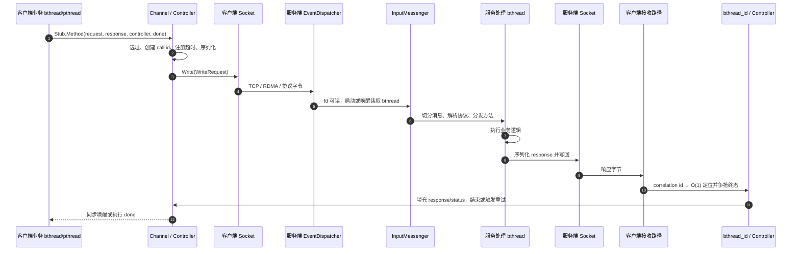
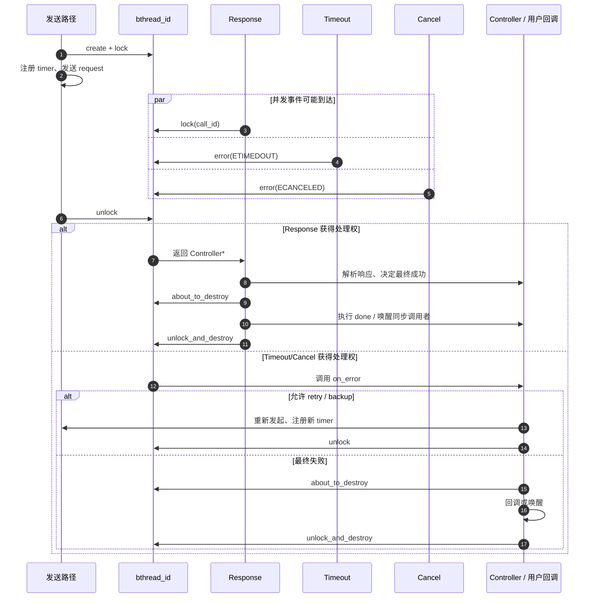
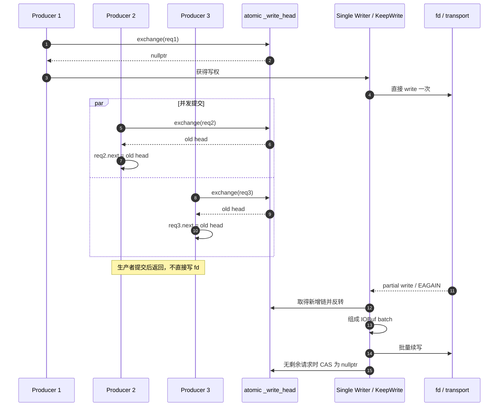

---
tags:
  - Linux
  - C++
  - 网络编程
  - RPC
  - brpc
  - bthread
  - 无锁编程
  - 性能工程
aliases:
  - Apache bRPC 核心架构
  - brpc 高性能设计
  - bthread M:N 调度
阅读次数: 0
---

# 18.10 工业级 C++ RPC 框架：brpc 核心架构与高性能设计

> [!info] 版本与范围
> 本文以 **Apache bRPC 1.17.0（2026-05-28）** 及其 `1.17.0` 标签源码为基线，重点分析 `bthread`、`bthread_id`、`bvar` 与 `Socket` 写路径。源码实现会继续演进，文中涉及类名、字段名和常量的细节均应结合具体版本阅读。

> [!important] 对“事实标准”的准确表述
> Apache bRPC 官方将其定位为工业级 C++ RPC 框架，常用于搜索、存储、机器学习、广告、推荐等高性能系统。面试中更稳妥的说法是：**bRPC 是国内 C++ 高性能 RPC 生态中很有代表性的工业框架**。不要在缺少公开证据时，把它表述成百度、字节、腾讯等所有公司的统一“事实标准”。

前置知识：

- RPC 的分层、请求标识与序列化：[[18.1 RPC 协议模板]]
- gRPC 的 IDL、Channel、Stub 与 HTTP/2：[[18.2 gRPC]]
- 事件驱动 RPC：[[18.3 非阻塞 RPC：epoll + 状态机]]
- gRPC Completion Queue：[[18.5 gRPC Completion Queue：异步 Add RPC]]
- 线程与线程池：[[12.1 线程简介]]、[[12.7 条件变量与线程池]]
- 原子操作、CAS 与 ABA：[[17.2 原子性、可见性与内存序]]、[[17.5 无锁编程：CAS、乐观锁与悲观锁]]
- 多生产者并发队列：[[17.6 并发队列：有界队列与无锁队列]]

## 0. 本章要回答的问题

1. `bthread` 为什么既不是 Linux `pthread`，也不等同于常见的 N:1 协程？
2. 一个同步写法的 RPC 为什么可以在大量并发调用下复用少量内核线程？
3. Response、Timeout、Cancel 和 Backup Response 同时到达时，谁有权结束同一个 RPC？
4. `bthread_id` 为什么能在 $O(1)$ 时间找到 `Controller`，又如何拒绝已经过期的事件？
5. `bvar` 为什么能让写侧很轻，却不适合作为高频控制变量？
6. 多个线程同时向同一条连接写请求时，如何避免消息交叉，又如何顺便形成批量写？
7. “无锁”“零竞争”“全双工”这些性能术语，在 bRPC 中分别应该限定到哪一段路径？

> [!abstract] 学完本章应建立的整体模型
> bRPC 的高性能不是来自某一个“神奇无锁结构”，而是来自一组相互配合的设计：
>
> - 用 `bthread` 把大量逻辑并发映射到少量 `pthread worker`；
> - 用带版本号的 `bthread_id` 管理一次 RPC 的竞争终态；
> - 用 `bvar` 把指标写竞争分散到线程本地；
> - 用 `Socket::_write_head` 把同连接并发写转化为 wait-free 提交与单写者批量排空；
> - 把昂贵操作推向读路径、竞争路径、后台路径或失败路径，让无竞争常见路径尽量短。

---

## 1. 先建立 bRPC 的五层运行时模型

bRPC 不是只有 “Stub → Socket” 的薄封装。理解源码时，可以把它拆成五个协作层次：

| 层次 | 代表组件 | 主要职责 |
| --- | --- | --- |
| 调用与治理层 | `Channel`、`Controller`、Load Balancer | 选址、超时、重试、取消、附件、调用结果 |
| 协议层 | Protobuf、HTTP/h2、gRPC、Thrift、Redis 等协议处理器 | 编解码、请求与响应关联、协议扩展 |
| 连接与 I/O 层 | `Socket`、`SocketId`、`EventDispatcher`、`InputMessenger` | 连接生命周期、非阻塞收发、消息切分、写请求聚合 |
| 执行层 | `TaskControl`、`TaskGroup`、`bthread`、`butex` | M:N 调度、阻塞与唤醒、工作窃取 |
| 并发状态与可观测层 | `bthread_id`、`bvar`、`rpcz`、内置服务 | RPC 终态竞争、ABA 防护、指标与诊断 |

![[图片/SVG/3_18_18_10_1.svg|900]]

这五层之间不是严格的“只能向下调用”。例如：

- `Controller` 中的 call id 会由接收路径找到，再通过 `bthread_id` 串行化终态处理；
- `Socket` 的写路径会在必要时启动 `KeepWrite` bthread；
- 调度器本身又使用 `bvar` 暴露 worker 数、切换速率和 run queue 状态；
- `EventDispatcher` 只等待 fd 事件，真正的读取、解析和用户回调由 bthread 执行。

---

## 2. 一次典型 Unary RPC 的端到端路径

下图是**概念化路径**，用于把核心组件串起来，不表示所有协议都会经过完全相同的函数。



需要抓住两条主线：

1. **数据线**：request/response 经过协议、连接、非阻塞 I/O 与解析分发。
2. **控制线**：call id、timer、cancel、socket failure 和 response 共同竞争一次 RPC 的状态机。

数据能正确收发，不代表控制线就没有竞态。`bthread_id` 正是为了控制线而存在。

---

## 3. `bthread`：M:N 调度，而不是“更小的 pthread”

### 3.1 M:N 的含义

Linux NPTL 的 `pthread` 通常是 1:1 模型：一个用户可见 pthread 对应一个内核调度实体。`bthread` 则把 $M$ 个逻辑线程映射到 $N$ 个 pthread worker，通常 $M \gg N$：

$$
M\ \text{个 bthread}
\quad\longrightarrow\quad
N\ \text{个 pthread worker}
\quad\longrightarrow\quad
N\ \text{个内核调度实体}
$$

内核只调度有限数量的 pthread worker；worker 内部再由 bthread runtime 选择下一个逻辑任务。

> [!note] 为什么官方文档说 bthread 不是通常意义上的 coroutine
> bRPC 文档把“协程”特指 N:1：所有协程共享一个系统线程。bthread 是 M:N，任务可以被其他 worker 窃取并在多核上运行；它还需要 `butex` 让 bthread 与 pthread 之间能够等待和唤醒。因此本文使用“用户态线程 / M:N 线程库”，不把它简单等同于 N:1 event loop 协程。

### 3.2 源码中的主要角色

| 组件 | 作用 |
| --- | --- |
| `TaskControl` | 管理整个 worker 集合、TaskGroup、ParkingLot、全局统计与工作窃取 |
| `TaskGroup` | 通常由一个 pthread worker 持有，保存当前任务、本地 run queue、远程提交队列 |
| `WorkStealingQueue` | owner 从本地弹出任务，其他 worker 可从另一端窃取 |
| `RemoteTaskQueue` | 接收非本 worker 提交的可运行任务 |
| `TaskMeta` | 一个 bthread 的函数、参数、版本、栈、局部存储和统计信息 |
| `ParkingLot` | worker 无任务时休眠，有新任务时被 `signal_task()` 唤醒 |
| `butex` | 同时兼容 bthread 与 pthread 等待/唤醒语义的同步基础设施 |

### 3.3 调度主循环

![[图片/SVG/3_18_18_10_2.svg|900]]

在 `1.17.0` 源码中：

- `TaskGroup::sched()` 先尝试本地 `_rq.pop()`；
- 本地没有任务时，`TaskGroup::steal_task()` 先检查 `_remote_rq`，再调用 `TaskControl::steal_task()`；
- `TaskControl::steal_task()` 按 seed 与 offset 遍历其他 `TaskGroup`，尝试从对方 `_rq` 或 `_remote_rq` 取得任务；
- 真正切换时，`TaskGroup::sched_to()` 更新当前 `TaskMeta`、切换 bthread-local storage，并通过 `jump_stack()` 切换栈上下文。

这说明 work stealing 不只是概念：本地队列、跨线程提交队列、随机窃取和 idle parking 都能在源码中找到对应结构。

### 3.4 用户态切换与 pthread 切换的正确比较

| 维度 | bthread 同 worker 切换 | pthread 调度切换 |
| --- | --- | --- |
| 决策者 | 用户态 bthread runtime | Linux 内核调度器 |
| 常见切换入口 | `yield`、butex 等待、RPC 同步等待 | 时间片、阻塞、唤醒、抢占 |
| 常见路径 | 保存/恢复必要上下文与栈，切换 bthread-local state | 进入内核调度路径，保存/恢复线程状态 |
| 内核参与 | 常见的同 worker 切换不需要请求内核重新调度 | 由内核完成 |
| 多核 | 任务可被其他 worker 窃取 | 内核直接调度每个 pthread |
| 迁移代价 | 被窃取后仍可能产生 cache locality 与跨核迁移成本 | 取决于调度、CPU 迁移、工作集和 NUMA |
| 可阻塞性 | bthread 原语能让出 worker；普通阻塞系统调用会卡住 worker | 阻塞当前 pthread，不阻塞同进程其他 pthread |

不能把结论简化成“bthread 永远只花几十纳秒，pthread 永远花几微秒”。实际成本与 CPU、栈状态、是否跨核、cache/TLB、调度压力和观测方法有关。可靠表述是：

> **bthread 的常见同 worker 调度路径在用户态完成，避免一次内核调度往返；pthread 的运行权由内核管理。bthread 的优势还来自少量 worker 集中使用 TLS cache、减少大量内核线程带来的调度与资源压力。**

### 3.5 阻塞语义是最重要的边界

#### 使用 bthread 原语阻塞

例如 `bthread_usleep()`、butex 或 bthread mutex 等待：

- 当前 bthread 变为不可运行；
- 当前 pthread worker 可以继续执行其他 bthread；
- 等待条件满足后，该 bthread 重新进入某个可运行队列。

#### 使用普通阻塞系统调用或 pthread 原语

例如直接调用 `::usleep()`、在慢磁盘上阻塞 `read()`、长时间等待 `pthread_mutex_t`：

- 被阻塞的是承载当前 bthread 的 pthread worker；
- 其他 worker 可窃取它队列里的可运行任务；
- 但如果大量 worker 都进入这类阻塞，整个 RPC runtime 仍会出现 worker starvation。

> [!danger] 典型自锁
> 所有 worker 都阻塞在某个 `pthread_mutex` 上，而释放该锁依赖一个尚未执行的 RPC 回调。由于已经没有 worker 能执行回调，系统形成线程池饥饿型死锁。
>
> 工程规则：**不要持有 pthread mutex 发起可能阻塞的 RPC；限制在途并发；把不可控的长阻塞隔离到专用线程池。**

---

## 4. `bthread_id`：版本化 RPC 终态门闩

### 4.1 它解决的不是“线程 ID”问题

`bthread_id_t` 不是 `bthread_t`。它是一种专门用于一次 RPC 生命周期的同步结构，目标包括：

- Response 与发送过程并发；
- Timeout 与发送过程并发；
- Retry/Backup 产生的多个 Response 并发；
- Cancel、Socket Failure 与正常 Response 并发；
- 由 correlation id 在 $O(1)$ 时间定位 RPC 上下文；
- 资源槽位复用后拒绝过期事件，防止 ABA。

### 4.2 64 位句柄：slot + version

`1.17.0` 中的编码方式可概括为：

```text
63                              32 31                               0
+--------------------------------+----------------------------------+
| ResourcePool slot / offset     | version / generation             |
+--------------------------------+----------------------------------+
```

- `slot` 让 runtime 直接定位 `bthread::Id`，不需要维护 correlation id → `Controller*` 的全局哈希表；
- `version` 表示这个槽位当前是哪一代对象；
- 槽位被回收后可以复用，但下一代 version 不同；
- 旧 timer、旧 response 或迟到 cancel 即使携带相同 slot，也会因 version 不匹配而被拒绝。

### 4.3 必须修正：“无全局锁”不等于 lock-free

> [!warning] 精确术语
> `bthread_id` 的优势是：**不依赖一个全局互斥哈希表，能以 O(1) 定位对象，并用版本号防 ABA。**
>
> 它不是形式化意义上的全路径 lock-free。`bthread::Id` 内部包含每个 ID 自己的 `FastPthreadMutex`、`butex`、`join_butex` 与 pending queue；发生竞争时还可能等待和唤醒。

因此，面试中不要说“`bthread_id` 完全无锁”。更准确的说法是：

> **版本化句柄 + 每 ID 细粒度门闩，把全局竞争拆散成单个 RPC 上的局部竞争。**

### 4.4 内部状态

普通非 ranged ID 可以按以下状态理解：

| 状态 | 源码表示 | 含义 |
| --- | --- | --- |
| Unlocked | `*butex == first_ver` | 当前没有终态处理者 |
| Locked | `*butex == locked_ver` | 某一路径正在处理 RPC 状态 |
| Contended | `*butex == contended_ver()` | 另一个 locker 正在等待 |
| AboutToDestroy | `*butex == unlockable_ver()` | 最终结果已确定，禁止新 locker 进入 |
| Invalid / Next Generation | `first_ver` 前移到 `end_ver()` | 旧 ID 失效，槽位可以归还并复用 |

![[图片/SVG/3_18_18_10_3.svg|900]]

### 4.5 Response、Timeout 与 Cancel 如何竞争



关键点不是“谁先获取 CPU”，而是**谁先取得同一个 ID 的处理权**：

- 未锁定时到达的 `error()` 可以成为 owner 并执行 `on_error`；
- 已被其他路径锁定时，错误信息进入 pending queue，调用方尽快返回；
- 当前 owner `unlock()` 时若发现 pending error，会继续处理该错误，而不是先暴露一个无保护窗口；
- 最终回调前先 `about_to_destroy()`，让后来等待 `lock()` 的路径立即失败；
- `unlock_and_destroy()` 推进 version、唤醒 waiter/joiner，并归还槽位。

### 4.6 ABA 示例

```text
旧 RPC A: call_id = (slot=42, version=7)
A 完成并归还 slot 42
新 RPC B: call_id = (slot=42, version=11)

迟到的 A-timeout 仍携带 (42, 7)
定位 slot 42 后发现当前代数不是 7
=> 拒绝事件，不会错误地取消 B
```

这比“指针是否为空”更强：同一块内存已经重新装入了一个合法对象时，version 仍能识别它不是原来的 RPC。

> [!important] Cancel 的语义边界
> 本地 Cancel 只是在竞争“本次调用应以何种状态结束”，不等于回滚服务端已经执行的业务副作用。需要业务级 exactly-once、幂等键或补偿事务时，仍应在协议和服务逻辑中单独设计。

---

## 5. `bvar`：把写竞争搬到读路径

### 5.1 为什么一个全局 atomic 计数器仍可能很贵

多个 CPU 核频繁修改同一个 atomic，会争用同一条 cache line。虽然每次操作是原子的，但 cache line 所有权会在核心间反复转移，线程数越多，cache bouncing 越明显。

`bvar::Adder<T>` 的核心思路是：

1. 每个线程取得自己的 TLS agent；
2. 热路径只更新本线程的 element；
3. 查询指标时，读取者遍历各线程 agent 并合并；
4. 线程退出时，把局部值提交到 global result。

```text
Thread A ──> TLS agent A ─┐
Thread B ──> TLS agent B ─┼──> combine_agents() ──> /vars
Thread C ──> TLS agent C ─┘
        写侧分散                         读侧合并
```

`1.17.0` 的 `Reducer::operator<<` 会取得 `AgentCombiner` 的 TLS agent，再修改本地 element；对于可原子化的简单类型，element 使用 relaxed atomic。`combine_agents()` 则取得 combiner 锁并遍历 agent 列表。

### 5.2 “零竞争”应改成“写侧低竞争”

> [!warning] 精确术语
> 官方文档给出的历史基准中，bvar 写开销在该测试环境下约为 20 ns，且随线程数增长较平稳；这不是所有 CPU、编译参数和 bvar 类型上的延迟承诺。
>
> 更准确的结论是：**bvar 的常见更新路径不争用一个全局计数 cache line，写侧大部分时间是 wait-free；首次创建 TLS agent、复杂 reducer、reset、读取合并和对象生命周期管理仍有额外成本。**

### 5.3 C++17 指标封装示例

```cpp
// C++17，Apache bRPC 1.17.0。
// 该类演示如何把请求数、错误数和延迟统一封装。
// bvar 对象必须比所有调用 Observe() 的线程活得更久。

#include <cstdint>

#include <butil/time.h>
#include <bvar/bvar.h>

class RpcMetrics final {
public:
    RpcMetrics()
        // expose_as("demo", "rpc_request_total")
        // 对应 /vars/demo_rpc_request_total。
        : request_total_("demo", "rpc_request_total"),
          error_total_("demo", "rpc_error_total"),
          // LatencyRecorder 会暴露 average、max、count、qps、
          // percentile/CDF 等一组指标。
          latency_("demo", "rpc") {}

    // latency_us 由调用方按微秒传入。
    // LatencyRecorder 的参数类型本身不携带单位，
    // 因此项目必须统一时间单位和指标命名约定。
    void Observe(bool succeeded, std::int64_t latency_us) noexcept {
        request_total_ << 1;

        if (!succeeded) {
            error_total_ << 1;
        }

        latency_ << latency_us;
    }

private:
    bvar::Adder<std::int64_t> request_total_;
    bvar::Adder<std::int64_t> error_total_;
    bvar::LatencyRecorder latency_;
};

void HandleOneRpc(RpcMetrics& metrics) {
    const std::int64_t begin_us = butil::cpuwide_time_us();

    bool succeeded = false;
    try {
        // 执行业务或下游 RPC。
        // succeeded 应由真实结果设置，而不是仅凭“函数返回”判断。
        succeeded = true;
    } catch (...) {
        // 示例只展示统计生命周期；真实服务还必须记录错误并映射状态码。
        succeeded = false;
    }

    const std::int64_t latency_us =
        butil::cpuwide_time_us() - begin_us;

    metrics.Observe(succeeded, latency_us);
}
```

### 5.4 适合与不适合的场景

| 适合 bvar | 不适合直接使用 bvar |
| --- | --- |
| 请求总数、错误总数、字节数 | 严格实时的并发额度判断 |
| QPS、吞吐、平均/分位延迟 | token bucket 的即时余额 |
| 低频展示的队列深度和状态 | 生成唯一序号 |
| `/vars`、监控抓取、调试页面 | 代替 mutex/CAS 保护业务不变量 |
| 需要低写开销的广泛埋点 | 高频写且高频读、必须看到最新值的控制逻辑 |

`bvar` 的本质不是“免费读取”，而是**让大量写者更轻，把代价集中到较少发生的读取、采样与展示**。

---

## 6. 单连接并发写：wait-free 提交 + 单写者批量排空

### 6.1 为什么不能让所有线程直接 `write(fd, ...)`

对 stream socket 来说，多个线程分别执行多次非原子写，不能自动保证应用层消息边界不交叉。RPC 框架必须保证：

- 同一时刻只有一个写者操作该连接；
- 其他生产者能够快速提交，不在一把全局 mutex 后排队；
- 遇到 partial write 或 `EAGAIN` 时，有明确的续写者；
- 新到请求可以和未写完请求一起批量提交；
- 连接失败时，所有尚未完成的 `WriteRequest` 都能收到一致错误。

### 6.2 `_write_head` 的 MPSC 协议

下面是算法草图，不是公开 API，也不是可直接编译的源码：

```text
producer(request):
    request.next = UNCONNECTED
    old_head = atomic_exchange(_write_head, request)

    if old_head != null:
        request.next = old_head
        return                 # 已有 writer，提交结束

    request.next = null
    become_the_single_writer()
```

逻辑分成两条路径：

#### 无竞争快路径

`atomic_exchange()` 返回 `nullptr`：

1. 当前线程取得写权；
2. 先在调用线程中直接写一次；
3. 如果全部写完且没有新请求，把 `_write_head` CAS 回 `nullptr`；
4. 不创建后台 bthread。

#### 竞争或 partial-write 路径

`atomic_exchange()` 返回旧 head：

1. 当前生产者把 `request->next` 指向旧 head；
2. 当前生产者立即返回；
3. 已有 writer 发现新链表；
4. writer 把 LIFO 链反转为提交顺序，接到当前写链尾部；
5. 若一次没有写完，启动或继续 `KeepWrite` bthread；
6. `DoWrite()` 收集多个 `IOBuf`，批量写入 transport。



### 6.3 为什么只能说“提交 wait-free”

`StartWrite()` 在 1.17.0 源码中明确指出一个小窗口：

1. producer 已经把自己的 request 交换成新 head；
2. 但还没来得及把 `request->next` 从 `UNCONNECTED` 改成旧 head；
3. OS 恰好抢占该 producer；
4. writer 看到 `UNCONNECTED`，只能短暂自旋等待链接完成。

因此：

- **竞争生产者的提交路径**设计为 wait-free；
- **持有写权的 writer**不是形式化意义上的 wait-free，也不是完整 lock-free；
- writer 还可能等待连接建立、TLS/SSL 锁、内核发送缓冲区、EPOLLOUT 或远端流控；
- `KeepWrite` 是单写者后台排空者，不是“所有写线程无锁地同时写 fd”。

### 6.4 聚合写为什么能提高吞吐

当连接繁忙时，writer 尚未排空旧数据，新 producer 已经把更多 request 接到链表中。`KeepWrite` 再次执行时可以：

- 一次收集多个 `IOBuf`；
- 减少每条消息独立进入写路径的固定成本；
- 形成 producer → queue → batch writer 的流水线；
- 提高 cache locality 和系统调用摊销效率。

`1.17.0` 的 `DoWrite()` 会把一段 request 链收集到数组中再交给 transport；当前实现的批数组上限是 `DATA_LIST_MAX = 256`。这是版本实现细节，不应写进业务协议假设。

### 6.5 “全双工”与“聚合写”是两个维度

> [!important] 不要混淆
> - 全双工：连接的两个方向都可以传输数据，例如 Streaming RPC 同时读写。
> - MPSC 聚合写：**单个方向的 outbound write serialization**。
>
> 读路径与写路径可以并行推进，但这不等于整个实现无锁。特别是 SSL 对象需要 `_ssl_session_mutex` 保护，读写 SSL session 不能被笼统描述为“全双工无锁”。

并发 writer 的顺序由原子 exchange 的线性化顺序与链表反转共同决定。它能避免字节交叉，但如果业务要求跨线程事件具有更强的因果顺序，仍应在应用层提供 sequence number、单一串行执行器或明确的队列。

### 6.6 背压仍然存在

聚合只能降低提交竞争，不能消除下游容量限制：

- 内核 send buffer 可能写满并返回 `EAGAIN`；
- 远端处理慢时，未写字节会增长；
- bRPC 可能把 Socket 标记为 overcrowded 并返回 `EOVERCROWDED`；
- `WaitEpollOut()` 只是在等待可写，不会凭空增加带宽；
- 忽略 `EOVERCROWDED` 会把压力转化为内存队列和尾延迟。

工程上应同时设置请求并发上限、超时、队列水位和失败策略，而不是只依赖“无锁队列”。

---

## 7. 接收路径：EventDispatcher 不等于传统 I/O Thread

bRPC 的 `EventDispatcher` 主要等待 fd 事件，而不是固定地负责某组 fd 的全部读取与业务处理。典型接收流程是：

1. edge-triggered 事件到达；
2. fd 对应的原子门闩决定是否需要启动读取 bthread；
3. 新 bthread 尽快读取 socket，提升刚被唤醒时的 cache locality；
4. `InputMessenger` 从字节流切分消息并识别协议；
5. 多条完整消息可由多个 bthread 并发执行 `Process`；
6. EventDispatcher 本身继续等待其他事件，必要时其 bthread 可被其他 worker 窃取。

这避免了“某个 I/O thread 上一条慢连接拖住同组所有连接”的固定绑定，但也意味着：

- 同一个 fd 上的多条消息可能并发进入业务处理；
- 业务对象不能默认依赖“同连接回调天然串行”；
- 需要顺序语义时，应由协议、stream、ExecutionQueue 或业务状态机明确保证。

---

## 8. 四种设计的共同方法：移动竞争，而不是宣称没有竞争

| 机制 | 热路径优化 | 代价被移动到哪里 | 主要失败模式 |
| --- | --- | --- | --- |
| `bthread` M:N | 少量 worker 复用大量逻辑并发 | 用户态调度、work stealing、栈与队列管理 | 阻塞系统调用耗尽 worker |
| `bthread_id` | O(1) slot 定位、无全局哈希锁 | 每 ID mutex/butex、pending error、版本检查 | 错误理解 cancel 或生命周期 |
| `bvar` | TLS 分片写，减少 cache bouncing | 读取合并、reset、首次 TLS agent 创建 | 用监控值做强实时控制 |
| Socket MPSC 写 | 竞争 producer 快速提交 | 单 writer、KeepWrite、EPOLLOUT、内核队列 | 无界积压、误称全路径 lock-free |

这四种机制体现了相同的性能工程原则：

1. **优化 common case**：无竞争时直接运行或直接写一次。
2. **细粒度隔离**：把全局热点拆成 worker-local、thread-local 或 per-RPC 状态。
3. **版本化资源句柄**：内存复用不等于对象身份复用。
4. **批处理**：竞争越高，越有机会由单消费者形成 batch。
5. **显式冷路径**：连接失败、partial write、指标读取和终态回调可以更复杂。
6. **背压优先于堆队列**：吞吐不足时必须拒绝、限流或超时。

### 8.1 值得观察的内部指标

从 1.17.0 源码可见的代表性 bvar 包括：

- `bthread_worker_count`
- `bthread_worker_usage`
- `bthread_switch_second`
- `bthread_signal_second`
- `bthread_group_status`
- `bthread_count`
- `rpc_keepwrite_second`
- `rpc_waitepollout_count`
- `rpc_waitepollout_second`

这些指标可帮助区分：

- worker 不够还是业务 CPU 饱和；
- bthread 创建/切换过多还是 run queue 积压；
- 写聚合正在发挥作用，还是大量时间耗在等待可写；
- 连接本身慢，还是应用回调阻塞。

---

## 9. bRPC 与 gRPC C++：不是“谁绝对更快”

| 维度 | bRPC | gRPC C++ |
| --- | --- | --- |
| 核心定位 | C++ 工业服务运行时、多协议接入与可扩展组件 | 跨语言、IDL-first 的通用 RPC 生态 |
| 常用协议 | 可在同一框架中支持 HTTP/HTTPS、h2/gRPC、Thrift、Redis 及自定义协议 | 标准 gRPC 语义，通常以 Protocol Buffers 与 HTTP/2 为核心 |
| 服务执行 | 同步、异步均可；同步等待可由 bthread M:N 承载 | Sync、Completion Queue Async、Callback/Reactor |
| C++ 异步模型 | runtime 以 bthread、Socket、回调和内部状态机组合 | CQ 用 tag 驱动完成事件；Callback API 用 Reactor 回调 |
| 并发写关注点 | Socket 层 wait-free MPSC 提交、单写者与 KeepWrite 批处理 | HTTP/2 stream/transport 管理复用；应用层同一 stream 通常只允许一个 read 和一个 write 在途 |
| 观测体验 | `/vars`、`rpcz`、connections、flags、CPU/heap/contention profiler 等内置页面 | 更强调标准生态、跨语言工具与外部可观测系统集成 |
| 适合场景 | C++ 为主、已有 bRPC 基础设施、需要多协议或深度定制 | 多语言组织、公开稳定 IDL、广泛客户端与云原生互操作 |
| 主要风险 | 对 bthread 阻塞边界、框架内部语义和团队经验要求高 | C++ 高 QPS 场景需正确选择 Sync/CQ/Callback 并管理 Reactor/CQ 生命周期 |

当前 gRPC C++ 文档通常建议优先考虑 Callback API；其性能指南同时指出，在真正极高 QPS 的场景中，Completion Queue API 仍可能更快。由此可见，框架名不能替代执行模型分析。

> [!tip] 面试中的 30 秒回答
> bRPC 与 gRPC 的差异不只是序列化或“谁 benchmark 更快”。bRPC 把 M:N bthread、版本化 `bthread_id`、TLS 分片 bvar 和 wait-free MPSC 写提交做进 C++ runtime，偏向高性能 C++ 内部服务和多协议兼容；gRPC 更强调标准化跨语言 IDL、HTTP/2 语义和广泛生态，在 C++ 中提供 Sync、CQ 与 Callback/Reactor。最终选择要看语言边界、协议兼容、阻塞代码比例、可观测体系和同等条件下的实测结果。

### 9.1 公平 benchmark 至少要固定这些变量

- 相同 request/response 大小；
- 相同序列化格式与是否使用 attachment/raw buffer；
- 相同 TLS、压缩和认证配置；
- 相同连接数、每连接并发数与连接复用策略；
- 相同同步/异步模型和 worker 数；
- 相同 timeout、retry、backup request；
- 相同 CPU 亲和、NUMA、网卡与 IRQ 配置；
- 同时报告 QPS、CPU/request、P50、P99、P999、错误率和内存峰值。

只报告最高 QPS，不能说明真实生产场景中尾延迟、资源成本与故障行为更好。

---

## 10. 源码阅读与实验路线

### 10.1 固定版本并定位核心文件

```bash
git clone https://github.com/apache/brpc.git
cd brpc
git switch --detach 1.17.0

rg "bool TaskControl::steal_task" src/bthread
rg "void TaskGroup::sched" src/bthread
rg "bthread_id_lock_and_reset_range" src/bthread/id.cpp
rg "class AgentCombiner" src/bvar
rg "Socket::StartWrite|Socket::KeepWrite|Socket::DoWrite" src/brpc/socket.cpp
```

推荐顺序：

1. `src/bthread/task_control.{h,cpp}`
2. `src/bthread/task_group.{h,cpp}`
3. `src/bthread/work_stealing_queue.h`
4. `src/bthread/id.cpp`
5. `src/bvar/detail/combiner.h`
6. `src/bvar/reducer.h`
7. `src/brpc/socket.{h,cpp}`

### 10.2 四组最小实验

#### 实验 A：bthread 原语阻塞与系统阻塞

- 固定 worker 数；
- 一组任务调用 `bthread_usleep()`；
- 另一组任务调用 `::usleep()`；
- 逐步让系统阻塞任务数接近 worker 数；
- 观察 QPS、P99、`bthread_worker_usage` 和 run queue。

预期验证的是“系统阻塞消耗 worker”，而不是预设某个固定延迟数字。

#### 实验 B：bvar 写扩展性与读代价

- 1、2、4、8、16、32 个线程更新同一个 `std::atomic<int64_t>`；
- 同样线程数更新一个 `bvar::Adder<int64_t>`；
- 分别测量 update throughput；
- 再单独提高 `get_value()` 或 `/vars` 抓取频率，观察读合并成本。

#### 实验 C：单连接小消息聚合

- 多个 producer 共享一条连接；
- 使用固定小消息持续异步写；
- 比较低并发与高并发时 `rpc_keepwrite_second`；
- 观察 `rpc_waitepollout_count`、未写字节、P99 和 CPU；
- 对单 producer 连续异步写，再评估 `write_in_background` 是否形成更稳定 batch。

#### 实验 D：Response/Timeout/Cancel 竞态

- 把超时设置到接近服务处理延迟；
- 并发触发 cancel、backup response 和连接失败；
- 检查用户回调只结束一次；
- 检查迟到事件不会修改已复用的下一代 RPC 上下文；
- 记录最终状态分布，而不是只看是否崩溃。

### 10.3 Linux 性能观测

```bash
perf stat \
  -e context-switches,cpu-migrations,cache-misses,cycles,instructions \
  -- ./your_rpc_benchmark
```

再结合：

- `/vars`
- `/rpcz`
- `/connections`
- CPU profiler
- contention profiler
- `ss -tin` 中的 send/receive queue
- 火焰图与线程/bthread 栈

共同判断瓶颈。单看上下文切换次数，无法区分“有用的并发调度”与“线程池抖动”。

---

## 11. 高频误区与面试检查

### 11.1 “bthread 就是协程”

不准确。按 bRPC 官方术语，常见协程是 N:1；bthread 是 M:N，支持多核工作窃取，并用 butex 连接 bthread/pthread 等待语义。

### 11.2 “bthread 中调用任何阻塞函数都只阻塞当前 bthread”

错误。只有 bthread-aware 的阻塞原语能让出 worker；普通阻塞系统调用和 pthread 原语会阻塞承载它的 pthread worker。

### 11.3 “`bthread_id` 是无锁状态机”

错误。它避免的是全局哈希表和全局 mutex，内部仍有 per-ID mutex、butex、pending queue。核心价值是 O(1) 定位、局部串行化和 generation 防 ABA。

### 11.4 “有 version 就绝对没有并发问题”

错误。version 解决对象身份复用，不自动保护 `Controller` 内部所有字段。只有在正确的 lock/error/unlock/destroy 协议内访问上下文，生命周期才成立。

### 11.5 “bvar 比 atomic 快，所以所有共享变量都改成 bvar”

错误。bvar 适合监控聚合，不适合强一致、高频读取的控制逻辑。它把竞争和成本转移到读与合并。

### 11.6 “Socket 聚合写整条路径都是 lock-free”

错误。竞争 producer 的提交设计为 wait-free，但 writer、链接完成窗口、连接建立、SSL、EPOLLOUT 和内核背压都可能等待。

### 11.7 “全双工说明多个线程可以同时写一个 fd”

错误。全双工指两个方向可同时传输；同一方向仍需要单写者、协议 framing 和顺序规则。

### 11.8 “Cancel 成功就说明服务端没有执行”

错误。Cancel 只改变调用生命周期；服务端副作用需要幂等键、去重、事务或补偿机制保护。

### 11.9 “benchmark 显示 bRPC 更快，所以生产一定选 bRPC”

错误。协议、payload、连接复用、TLS、异步模型、重试、观测开销和团队能力不同，结果就不可直接迁移。

---

## 12. 总结

bRPC 的四个核心设计可以压缩成四句话：

1. **`bthread`**：用 M:N 和 work stealing，让同步风格的逻辑并发复用少量 pthread worker；但普通阻塞调用仍会消耗 worker。
2. **`bthread_id`**：用 `slot + version` 在 O(1) 定位 RPC 上下文并防 ABA，再用 per-ID 门闩让 Response、Timeout、Cancel 竞争唯一终态。
3. **`bvar`**：用 TLS agent 分散热写，把全局合并成本留给低频读取；它是观测机制，不是业务同步机制。
4. **Socket 聚合写**：用 wait-free MPSC 提交获得单写者，再由直接写或 `KeepWrite` 批量排空；提交无等待不代表整个 I/O 路径无锁。

真正值得学习的不是记住“纳秒级”“无锁”“更快”这些标签，而是看清每项优化把代价移到了哪里，以及拥塞、阻塞、失败和对象复用时，系统还能否保持正确。

---

## 13. 参考资料

### 13.1 Apache bRPC 官方资料

1. Apache bRPC, *bRPC Overview*  
   https://brpc.apache.org/docs/overview/  
   访问日期：2026-08-30。
2. Apache bRPC, *bthread*  
   https://brpc.apache.org/docs/bthread/bthread/  
   访问日期：2026-08-30。
3. Apache bRPC, *bthread_id*  
   https://brpc.apache.org/zh/docs/rpc-in-depth/bthread_id/  
   访问日期：2026-08-30。
4. Apache bRPC, *bvar*  
   https://brpc.apache.org/docs/bvar/bvar/  
   访问日期：2026-08-30。
5. Apache bRPC, *IO*  
   https://brpc.apache.org/docs/rpc-in-depth/io/  
   访问日期：2026-08-30。
6. Apache bRPC, *Streaming RPC*  
   https://brpc.apache.org/docs/client/streaming-rpc/  
   访问日期：2026-08-30。
7. Apache bRPC 1.17.0 Release  
   https://github.com/apache/brpc/releases/tag/1.17.0  
   发布日期：2026-05-28。

### 13.2 Apache bRPC 1.17.0 源码

1. `src/bthread/task_control.{h,cpp}`  
   https://github.com/apache/brpc/blob/1.17.0/src/bthread/task_control.cpp
2. `src/bthread/task_group.{h,cpp}`  
   https://github.com/apache/brpc/blob/1.17.0/src/bthread/task_group.cpp
3. `src/bthread/id.cpp`  
   https://github.com/apache/brpc/blob/1.17.0/src/bthread/id.cpp
4. `src/bvar/detail/combiner.h`  
   https://github.com/apache/brpc/blob/1.17.0/src/bvar/detail/combiner.h
5. `src/bvar/reducer.h`  
   https://github.com/apache/brpc/blob/1.17.0/src/bvar/reducer.h
6. `src/brpc/socket.{h,cpp}`  
   https://github.com/apache/brpc/blob/1.17.0/src/brpc/socket.cpp

### 13.3 gRPC 官方对比资料

1. gRPC, *C++ Best Practices*  
   https://grpc.io/docs/languages/cpp/best_practices/  
   访问日期：2026-08-30。
2. gRPC, *C++ Asynchronous Callback API Tutorial*  
   https://grpc.io/docs/languages/cpp/callback/  
   访问日期：2026-08-30。
3. gRPC, *C++ Asynchronous CompletionQueue Tutorial*  
   https://grpc.io/docs/languages/cpp/async/  
   访问日期：2026-08-30。
4. gRPC, *Performance Best Practices*  
   https://grpc.io/docs/guides/performance/  
   访问日期：2026-08-30。

### 13.4 教材

1. Andrew S. Tanenbaum, Herbert Bos, *Modern Operating Systems*, 4th Edition, Chapter 2：User-Level Threads、Kernel-Level Threads、Hybrid Implementations、Thread Scheduling。
2. Michael Kerrisk, *The Linux Programming Interface*, Chapters 31 and 33：Thread-Local Storage、Thread Implementation Models。
3. 陈硕，《Linux 多线程服务端编程：使用 muduo C++ 网络库》，第 3～4 章：多线程服务器模型、线程原语与 thread-local。
