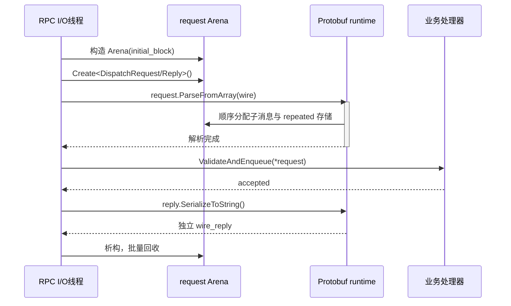
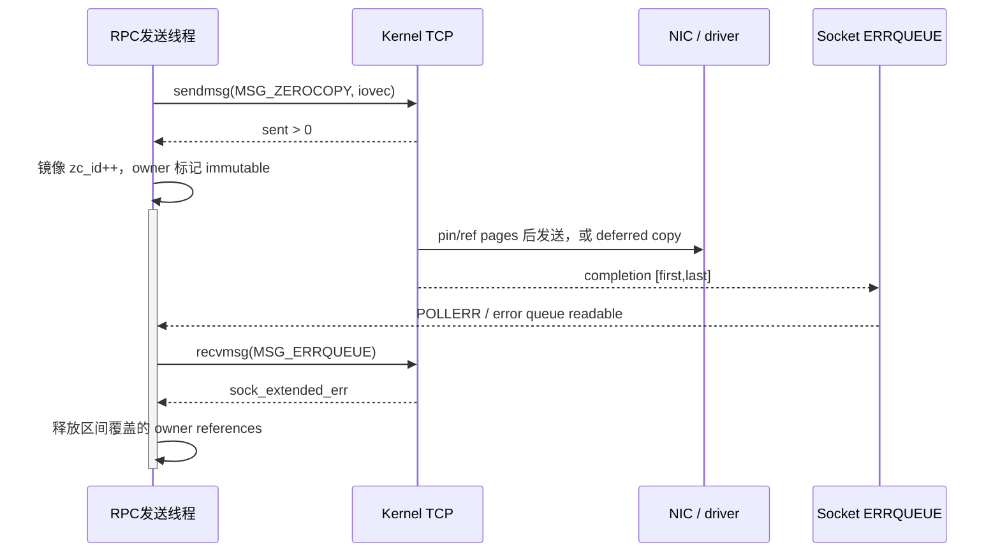

---
tags:
  - Linux
  - RPC
  - 高性能网络
  - 序列化
  - FlatBuffers
  - ProtocolBuffers
  - ZeroCopy
  - MSG_ZEROCOPY
aliases:
  - 零拷贝序列化
  - FlatBuffers 与 Protobuf Arena
  - iovec 与 MSG_ZEROCOPY
阅读次数: 0
---

# 18.11 零拷贝序列化与内存传递：FlatBuffers 与 Protobuf Arena

[[18.1 RPC 协议模板]] 已经建立了 `request_id`、帧定界与精确收发的基础；[[18.2 gRPC]] 又展示了 `protobuf payload → C++ 请求对象 → 业务处理 → C++ 响应对象 → payload` 的完整路径。[[18.6 io_uring 非阻塞 RPC]] 与 [[18.7 RDMA Verbs 与 CQ 非阻塞 RPC]] 则反复强调：异步 I/O 的完成事件首先是**资源生命周期边界**，不等于 RPC 已经成功。

本篇把这两条线合并起来，回答一个更靠近高性能数据面的题目：

> 当序列化、动态分配和内存拷贝已经进入热点，应该优化哪一层？每一层省掉的到底是哪一次工作？

> [!warning] “Protobuf 反序列化占 30%～50% CPU”不是通用常数
> 这个比例可能出现在特定消息结构、访问模式、编译选项和负载下，但不能脱离 `perf`、分配统计与端到端基准直接套用。官方资料只确认分配与释放可能占 Protobuf CPU 时间的显著部分。工程上应把“30%～50%”当作**待验证的性能假设**，而不是选型结论。

> [!abstract] 本篇边界
> - C++ 示例以 C++20 表达所有权和只读视图；
> - `MSG_ZEROCOPY` 部分是 Linux-only，并只讨论 socket **发送侧**；
> - FlatBuffers / Cap'n Proto 的“零反序列化”准确含义是**不物化独立 C++ 对象树**，不是“零 CPU”；
> - Protobuf Arena 优化 allocation/free，不改变 Protobuf 线路格式，也不会把解析变成 in-place access；
> - TLS、压缩、gRPC runtime 内部缓冲与具体 NIC offload 会改变实际拷贝路径，必须对真实部署栈测量。

---

## 1. 先拆开“零拷贝”：它至少包含四种不同优化

“零拷贝”经常被当成一个模糊标签，实际上下面四种成本互相独立：

| 优化层 | 典型技术 | 省掉什么 | 没有省掉什么 |
|---|---|---|---|
| 消息读取 | FlatBuffers、Cap'n Proto | 从 wire buffer 物化完整 C++ 对象树 | 边界检查、offset/pointer 计算、字节序处理、cache miss、业务遍历 |
| 对象分配 | Protobuf Arena | 大量小对象的独立 `malloc/free` 与逐对象回收 | Protobuf tag/varint 解析、字段写入、部分字符串分配、最终序列化 |
| 用户态拼接 | `iovec` + `writev/sendmsg` | `header + metadata + payload` 先 `memcpy` 到连续大 buffer | 普通 socket 路径的 user→kernel 数据复制 |
| 内核发送 | `MSG_ZEROCOPY` | 在适合的路径上避免 user→kernel payload copy | page pin/accounting、协议栈处理、NIC 发送、完成通知、远端接收与 RPC 执行 |

可以把一次 RPC 的相关 CPU 成本粗略拆成：

```text
T_rpc = T_validate
      + T_materialize
      + T_allocate/free
      + T_user_concat
      + T_user_to_kernel
      + T_transport
      + T_business
```

不同技术只消去其中一项或几项：

- Arena 主要压低 `T_allocate/free`；
- FlatBuffers / Cap'n Proto 主要压低 `T_materialize`；
- `iovec` 主要压低 `T_user_concat`；
- `MSG_ZEROCOPY` 只在内核实际采用 copy avoidance 时压低 `T_user_to_kernel`。

![[图片/SVG/3_18_4_18_11_1.svg|1240]]

这张图最重要的判断是：**Arena 与直接访问格式不是替代关系，它们优化的是不同阶段。**

---

## 2. 基线：Protobuf 默认解析为什么可能昂贵

Protobuf 的线路格式由 field number、wire type、varint 或 length-delimited 数据组成。接收端调用 `ParseFromArray()` 一类接口时，runtime 通常要完成：

```text
读取 tag
→ 识别 field number / wire type
→ 解码 varint 或长度
→ 检查边界
→ 找到生成类中的目标字段
→ 写入标量，或构造 string / repeated / submessage
→ 递归解析嵌套消息
→ 保存或跳过未知字段
```

这里不应该把所有成本都简称为“深拷贝”。更准确的说法是：**Protobuf 执行 eager parse，并把线路表示物化为生成类对象图。**

| 字段形态 | 常见工作 |
|---|---|
| 标量 `uint32/int64/bool` | tag 分支、varint 解码、写入对象成员 |
| `string/bytes` | 读取长度、边界检查、为目标存储申请空间并复制数据 |
| `repeated` 标量 | 扩容内部数组并逐项写入 |
| 子消息 | 获取或创建子对象，再递归解析 |
| 未知字段 | 依据 runtime 策略保留或跳过 |

因此 Protobuf 热点可能来自多个来源：

1. **分支和变长编码**：tag 与 varint 都有数据相关控制流；
2. **小对象分配**：嵌套消息、字符串和 repeated 容器会触发分配；
3. **写放大**：输入 bytes 被重新组织到另一套对象布局；
4. **缓存局部性**：分散在堆上的对象图增加 cache/TLB 压力；
5. **完整物化**：即使业务只读三个字段，解析器仍要理解并构造整条消息所需状态。

> [!important] 先确认是哪一种热点
> 如果 `malloc/free` 与析构占主导，Arena 往往比换格式更低风险；如果业务只访问少数字段，而 parse/materialization 占主导，直接访问格式才更有吸引力；如果 profile 主要落在 TLS、压缩或业务计算，替换 serializer 可能几乎没有收益。

---

## 3. FlatBuffers：把消息保留为 buffer 上的 typed view

### 3.1 线路布局的核心不是“把 C++ struct 原样发出去”

FlatBuffers 定义的是跨平台二进制布局，不依赖本机编译器对 C++ 结构体的 padding 规则。其关键元素包括：

```text
buffer start
└─ root uoffset
   └─ root table
      ├─ soffset → vtable
      ├─ inline scalar / struct
      └─ uoffset → string / vector / child table
```

- buffer 起始位置保存到 root table 的无符号相对偏移；
- table 首字段保存到 vtable 的有符号偏移；
- vtable 记录对象大小与各字段在 table 内的 offset，缺失字段返回 schema 默认值；
- `struct` 固定布局并内联，适合不会独立演进的小型值对象；
- `table` 通过 vtable 支持可选字段和兼容演进；
- vector 使用元素数量前缀，元素连续存放；string 本质上是带长度且以 `\0` 结束的字节 vector；
- 标量采用 little-endian；大端机器仍可读取，但访问需要 byte swap。

“直接访问”发生在生成 accessor 中：它根据 root、vtable 和相对 offset 找到目标字段，**不先创建另一棵 `std::string/std::vector/unique_ptr` 对象树**。

### 3.2 用 schema 表达 AI 调度元数据

下面的消息只传 tensor 的位置描述，不把模型输入的大块数据塞进控制消息：

```fbs
namespace rpcdemo;

enum DType : ubyte {
  FP16,
  BF16,
  FP32
}

struct TensorRef {
  buffer_id: ulong;
  offset: ulong;
  length: uint;
  dtype: DType;
}

table DispatchRequest {
  request_id: ulong;
  model_id: string;
  inputs: [TensorRef];
}

root_type DispatchRequest;
file_identifier "DRPC";
```

这里刻意把 `TensorRef` 设计成 `struct`：每项固定大小、内联到 vector，遍历时不需要为每个 tensor 再追一层 table offset。`DispatchRequest` 使用 `table`，因为以后可能增加 deadline、priority 或 trace metadata。

### 3.3 网络输入必须先验证，再暴露只读 view

FlatBuffers accessor 假设 offset 合法。来自网络的 buffer 在验证前不能直接交给业务代码。下面的包装同时解决验证和生命周期问题。

第一部分定义一个“冻结后的 buffer 所有者”：

```cpp
#include <flatbuffers/verifier.h>

#include <cstddef>
#include <cstdint>
#include <memory>
#include <stdexcept>
#include <string_view>
#include <vector>

#include "dispatch_generated.h"
class DispatchRequestView {
public:
    using Buffer = std::vector<std::byte>;

    static DispatchRequestView VerifyAndOpen(
        std::shared_ptr<const Buffer> bytes);

    [[nodiscard]] std::uint64_t request_id() const noexcept;
    [[nodiscard]] std::string_view model_id() const noexcept;
    [[nodiscard]] std::size_t input_count() const noexcept;
    [[nodiscard]] const rpcdemo::TensorRef& input_at(
        std::size_t index) const;

private:
    DispatchRequestView(std::shared_ptr<const Buffer> bytes,
                        const rpcdemo::DispatchRequest* root) noexcept;

    std::shared_ptr<const Buffer> bytes_;
    const rpcdemo::DispatchRequest* root_{};
};
```

`root_` 是不拥有内存的指针；真正延长生命周期的是 `bytes_`。只要 view 存在，整个 backing buffer 就必须保持地址稳定且不可修改。

验证与访问实现如下：

```cpp
DispatchRequestView DispatchRequestView::VerifyAndOpen(
    std::shared_ptr<const Buffer> bytes) {
    if (!bytes || bytes->empty()) {
        throw std::invalid_argument("empty FlatBuffer");
    }

    const auto* raw = reinterpret_cast<const std::uint8_t*>(
        bytes->data());
    flatbuffers::Verifier verifier(raw, bytes->size());

    if (!rpcdemo::VerifyDispatchRequestBuffer(verifier)) {
        throw std::invalid_argument("invalid DispatchRequest buffer");
    }

    return DispatchRequestView{
        std::move(bytes), rpcdemo::GetDispatchRequest(raw)};
}

DispatchRequestView::DispatchRequestView(
    std::shared_ptr<const Buffer> bytes,
    const rpcdemo::DispatchRequest* root) noexcept
    : bytes_(std::move(bytes)), root_(root) {}
```

只有验证成功才构造 view，因此业务侧不会拿到“部分有效”的对象。`file_identifier "DRPC"` 也会进入生成的 root verifier，用来尽早发现消息类型错配。

访问器只在原 buffer 上读取：

```cpp
std::uint64_t DispatchRequestView::request_id() const noexcept {
    return root_->request_id();
}

std::string_view DispatchRequestView::model_id() const noexcept {
    const auto* value = root_->model_id();
    return value == nullptr
        ? std::string_view{}
        : std::string_view{value->c_str(), value->size()};
}

std::size_t DispatchRequestView::input_count() const noexcept {
    const auto* values = root_->inputs();
    return values == nullptr ? 0 : values->size();
}

const rpcdemo::TensorRef& DispatchRequestView::input_at(
    std::size_t index) const {
    const auto* values = root_->inputs();
    if (values == nullptr || index >= values->size()) {
        throw std::out_of_range("TensorRef index out of range");
    }
    return *values->Get(
        static_cast<flatbuffers::uoffset_t>(index));
}
```

返回的 `string_view` 和 `TensorRef&` 都不拥有数据，不能逃逸到 `DispatchRequestView` 之外。更严格的接口可以让业务回调在 view 生命周期内完成，而不是把这些借用对象保存到异步任务中。

> [!warning] `shared_ptr<const Buffer>` 不是绝对冻结机制
> 如果其他地方仍保留指向同一个 `vector` 的可变别名，仍可能扩容或改写其内容。生产实现应在所有权协议上保证“接收完成后冻结”，或使用本身不可变、地址固定的 buffer 类型。

### 3.4 Verifier 不是零成本，但它不是完整对象物化

Verifier 会检查 offset、字段大小、字符串终止与嵌套/表数量限制。它需要 CPU，也会访问一部分 buffer；优势是通常不分配对象，而且不必读取所有 scalar 值。

因此准确的路径是：

```text
network bytes
→ length / frame limit
→ FlatBuffers Verifier
→ GetDispatchRequest(raw)
→ 按需 accessor
```

而不是：

```text
network bytes → 零检查地 reinterpret_cast → 业务
```

### 3.5 调用 `UnPack()` 会重新进入对象树世界

FlatBuffers 的 object API 会把 table/vector/string 转成普通 C++ 对象和 STL 容器，便于独立持有和修改。例如：

```cpp
std::unique_ptr<rpcdemo::DispatchRequestT> object =
    root->UnPack();
```

此时又发生了 materialization 和动态分配。它可能仍比其他方案方便，但不能再把这一条路径称为 in-place access。一个很有价值的基准负对照就是：

```text
FlatBuffers verify + direct access
vs.
FlatBuffers verify + UnPack + object traversal
```

---

## 4. Cap'n Proto：同样直接访问，但布局、安全模型和 framing 不同

Cap'n Proto 也不要求先构造独立对象树，但不能把它简单描述成“另一个 FlatBuffers”。

| 维度 | FlatBuffers | Cap'n Proto |
|---|---|---|
| 基本布局 | 标量、table/vtable、相对 byte offset | 64-bit word、struct/list pointer、segment |
| root | buffer 起始 `uoffset_t` | 第一 segment 的第一个 word 是 root pointer |
| 多块内存 | 常见读取路径是一块连续 buffer | 一条 message 可有多个彼此独立的 segment |
| 不可信输入 | 通常先运行 Verifier | pointer 在访问时惰性校验，并用 traversal/nesting limit 防放大与深递归 |
| 压缩形态 | 普通 FlatBuffer 可直接访问 | packed encoding 必须先 unpack，之后才能按 word/segment 访问 |
| 适合场景 | 游戏资产、读多写少 metadata、mmap/网络 buffer | 低开销消息、segment/arena 构建、与 Cap'n Proto RPC 体系结合 |

Cap'n Proto 的 message 以 8 字节 word 为单位，每个 object 按 word 边界对齐。单个 message 可以分成多个 segment；跨 segment 使用 far pointer，因此各 segment 不要求在虚拟地址上彼此连续。

这对 scatter-gather 很有吸引力，但在线路上仍然需要 framing：

```text
segment_count - 1
→ 每个 segment 的 word 数
→ 对齐 padding
→ segment 0 bytes
→ segment 1 bytes
→ ...
```

> [!important] “多 segment”不等于“socket 自动理解消息”
> TCP 仍是字节流。发送方可以用 `iovec` 一次描述 segment table 与多个 segment，接收方仍必须先恢复 framing，才能建立安全的 segment 视图。

Cap'n Proto 的 packed 格式利用零字节压缩线路大小，但 packed bytes 不是可直接按原 schema pointer 访问的 word layout。选择 packing 就是在带宽与 CPU/materialization 之间重新做一次权衡。

---

## 5. Protobuf Arena：保留解析模型，改变对象的分配域

### 5.1 Arena 真正做了什么

默认 Protobuf 消息与子对象通常分别从 heap 分配。Arena 改成从较大的 block 中顺序分配：

```text
当前 block: [used.............free................]
                        ↑ bump pointer
```

大多数分配退化为对齐后移动指针；请求结束时整块回收，不再遍历对象树逐个 `delete`。对于需要析构或外部 heap 所有权的对象，Arena 仍可能维护 cleanup / owned list，因此不能笼统说“所有析构函数都绝不会运行”。

### 5.2 一次请求使用一个 Arena

下面的示例让请求对象和响应对象属于同一个 request lifetime。初始 16 KiB block 放在栈上；空间不足时 Arena 仍可按配置申请后续 block。

```cpp
#include <google/protobuf/arena.h>

#include <array>
#include <climits>
#include <cstddef>
#include <cstdint>
#include <span>
#include <stdexcept>
#include <string>

#include "dispatch.pb.h"

struct DispatchResult {
    std::string wire_reply;
    std::uint64_t arena_space_used{};
};
```

处理函数先建立 Arena，并在解析前检查旧式 `int` 长度接口的边界：

```cpp
DispatchResult HandleDispatchOnArena(
    std::span<const std::byte> wire_request) {
    if (wire_request.size() > static_cast<std::size_t>(INT_MAX)) {
        throw std::length_error("protobuf input exceeds ParseFromArray limit");
    }

    alignas(std::max_align_t)
        std::array<std::byte, 16 * 1024> initial_block{};

    google::protobuf::ArenaOptions options;
    options.initial_block = reinterpret_cast<char*>(
        initial_block.data());
    options.initial_block_size = initial_block.size();

    google::protobuf::Arena arena(options);
```

初始 block 的所有者仍是当前栈帧，因此它必须比 `arena` 活得更久；这里声明顺序满足这一要求。

随后在同一个 Arena 中创建 request/reply：

```cpp
    auto* request = google::protobuf::Arena::Create<
        rpcdemo::DispatchRequest>(&arena);
    auto* reply = google::protobuf::Arena::Create<
        rpcdemo::DispatchReply>(&arena);

    if (!request->ParseFromArray(
            wire_request.data(),
            static_cast<int>(wire_request.size()))) {
        throw std::invalid_argument("invalid protobuf request");
    }

    reply->set_request_id(request->request_id());
    reply->set_accepted(ValidateAndEnqueue(*request));
```

这里仍然执行 Protobuf parse；变化的是生成对象、子消息和许多内部容器共享同一个 allocation domain。

最后序列化响应，并在 Arena 析构前复制出独立结果：

```cpp
    DispatchResult result;
    if (!reply->SerializeToString(&result.wire_reply)) {
        throw std::runtime_error("failed to serialize protobuf reply");
    }

    result.arena_space_used = arena.SpaceUsed();
    return result;
}
```

`wire_reply` 是函数返回后继续存在的拥有型对象；不能返回 `request`、`reply` 或它们字段的引用，因为函数结束时 Arena 会统一释放其存储。



这张图揭示了源码里容易忽略的边界：**Arena 可以覆盖一次请求的多个处理阶段，但所有借用指针都必须在批量回收前结束。**

### 5.3 Arena 的主要陷阱

#### 字符串和 unknown fields 仍可能落在 heap

当前 C++ Arena 文档明确列出例外：普通 string 字段的数据以及 unknown fields 仍使用 heap。Arena 对“消息中含大量长字符串”的收益可能小于对“含大量子消息与 repeated 数组”的收益。

#### 跨 Arena 的 move / `Swap()` 可能退化成深拷贝

为了防止子对象跟随错误的生命周期，以下边界可能触发复制：

```text
heap message ↔ arena message
arena A       ↔ arena B
```

特别要检查：

- move assignment；
- `Swap()`；
- `set_allocated_*()` / `release_*()`；
- repeated message 的 `AddAllocated()` / `ReleaseLast()`。

`unsafe_arena_*` API 可以跳过复制和所有权检查，但只有在同一 Arena 或严格证明等价生命周期时才安全。它不是常规“性能开关”。

#### 分配可并发，不代表 `Reset()` 可并发

多个线程可以从同一 Arena 分配；`Reset()` 与析构则必须在所有分配者和使用者停止后执行。把一个全局 Arena 在请求之间反复 `Reset()`，很容易制造 use-after-free 与停顿尖峰。

#### Arena 粒度过大也会浪费内存

推荐起点通常是 per-request / per-batch，而不是 per-process：

- 请求结束时间清楚；
- 错误路径可以统一释放；
- 不会让短命对象长期占据大 block；
- 较少发生跨 Arena 移交。

最终粒度应依据 `SpaceUsed()`、峰值 RSS、请求大小分布和并发度调优。

---

## 6. `iovec`：不拼接，不等于不复制到内核

### 6.1 典型 RPC 发送对象天然是分段的

一个框架往往已经分别拥有：

```text
RPC frame header     小而固定
metadata / FlatBuffer 中等、只读
large payload        大块、共享或池化
```

最简单但多一次用户态 copy 的写法是：

```text
allocate contiguous buffer
→ memcpy header
→ memcpy metadata
→ memcpy payload
→ send
```

`iovec` 允许一次 `sendmsg()` 描述多个不连续区间，从而省掉这次拼接。`iovec` 本身只是 `{base, len}` 描述符，不拥有任何字节。

### 6.2 用 cursor 正确处理 TCP 短发送

发送状态必须记住“已经跨过几个 segment、当前 segment 内走了多少”。先定义 cursor 接口：

```cpp
#include <sys/socket.h>

#include <array>
#include <cerrno>
#include <cstddef>
#include <span>
#include <stdexcept>
#include <system_error>

class GatherCursor {
public:
    static constexpr std::size_t kMaxSegments = 3;

    explicit GatherCursor(
        std::array<std::span<const std::byte>, kMaxSegments> segments);

    [[nodiscard]] bool empty() const noexcept;
    [[nodiscard]] std::size_t BuildIovecs(
        std::span<iovec> output) const;
    void Consume(std::size_t bytes);

private:
    void SkipEmptySegments() noexcept;

    std::array<std::span<const std::byte>, kMaxSegments> segments_;
    std::size_t segment_index_{};
    std::size_t segment_offset_{};
};
```

构造时跳过零长度区间，避免出现“cursor 未结束但构造不出任何 `iovec`”的死循环：

```cpp
GatherCursor::GatherCursor(
    std::array<std::span<const std::byte>, kMaxSegments> segments)
    : segments_(segments) {
    SkipEmptySegments();
}

bool GatherCursor::empty() const noexcept {
    return segment_index_ == segments_.size();
}

void GatherCursor::SkipEmptySegments() noexcept {
    while (segment_index_ < segments_.size() &&
           segment_offset_ == segments_[segment_index_].size()) {
        ++segment_index_;
        segment_offset_ = 0;
    }
}
```

每次系统调用前，从当前位置生成临时描述符：

```cpp
std::size_t GatherCursor::BuildIovecs(
    std::span<iovec> output) const {
    std::size_t count = 0;
    std::size_t index = segment_index_;
    std::size_t offset = segment_offset_;

    while (index < segments_.size() && count < output.size()) {
        const auto segment = segments_[index];
        if (offset < segment.size()) {
            output[count++] = iovec{
                .iov_base = const_cast<std::byte*>(
                    segment.data() + offset),
                .iov_len = segment.size() - offset,
            };
        }
        ++index;
        offset = 0;
    }
    return count;
}
```

`iov_base` 的历史接口类型是可写 `void*`，但 `sendmsg()` 不会修改发送数据，因此这里的 `const_cast` 只用于适配 C API；不能把它扩散成业务可写指针。

系统调用返回的是整个 iovec 序列前缀的已发送字节数，`Consume()` 必须跨 segment 推进：

```cpp
void GatherCursor::Consume(std::size_t bytes) {
    while (bytes > 0 && segment_index_ < segments_.size()) {
        const std::size_t remaining =
            segments_[segment_index_].size() - segment_offset_;

        if (bytes < remaining) {
            segment_offset_ += bytes;
            return;
        }

        bytes -= remaining;
        ++segment_index_;
        segment_offset_ = 0;
        SkipEmptySegments();
    }

    if (bytes != 0) {
        throw std::logic_error("sendmsg reported too many bytes");
    }
}
```

最后是可用于非阻塞 socket 的发送推进函数：

```cpp
enum class FlushResult { Complete, WouldBlock };
FlushResult FlushGathered(int fd, GatherCursor& cursor) {
    std::array<iovec, GatherCursor::kMaxSegments> iovecs{};
    while (!cursor.empty()) {
        const std::size_t count = cursor.BuildIovecs(iovecs);
        msghdr message{};
        message.msg_iov = iovecs.data();
        message.msg_iovlen = count;

        const ssize_t sent = ::sendmsg(fd, &message, MSG_NOSIGNAL);
        if (sent > 0) {
            cursor.Consume(static_cast<std::size_t>(sent));
            continue;
        }
        if (sent == 0) {
            throw std::system_error(
                EPIPE, std::generic_category(), "sendmsg");
        }
        if (errno == EINTR) {
            continue;
        }
        if (errno == EAGAIN || errno == EWOULDBLOCK) {
            return FlushResult::WouldBlock;
        }
        throw std::system_error(
            errno, std::generic_category(), "sendmsg");
    }

    return FlushResult::Complete;
}
```

```mermaid
sequenceDiagram
    participant RPC as RPC发送状态机
    participant K as Kernel TCP
    participant Loop as EventLoop

    RPC->>K: sendmsg(iovec[header, metadata, payload])
    alt sent > 0
        K-->>RPC: 已接收前缀 n bytes
        RPC->>RPC: cursor.Consume(n)
        opt 仍有 remaining bytes
            RPC->>K: 重新构造 iovec 并继续 sendmsg
        end
    else EAGAIN / EWOULDBLOCK
        K-->>RPC: 当前发送缓冲区不可写
        RPC->>Loop: 保存 cursor 与全部 buffer owners
        activate Loop
        Note over Loop: 等待 EPOLLOUT，不在原地忙等
        K-->>Loop: socket writable
        deactivate Loop
        Loop->>RPC: FlushGathered(fd, cursor)
    end
```

这张图揭示了 `iovec` 没有解决的生命周期问题：临时 descriptor 可以在系统调用返回后丢弃，但 header、metadata、payload 的实际存储必须活到 cursor 完成。

### 6.3 三个不能混淆的边界

```text
iovec segment boundary ≠ TCP message boundary
一次 sendmsg 返回       ≠ 整帧发送完成
sendmsg 接受字节         ≠ 远端 RPC 成功
```

还要遵守系统的 `IOV_MAX` / `sysconf(_SC_IOV_MAX)` 限制。框架不应为每个极小字段创建一个 segment；通常把小 header 合并成一块、把大 payload 保持独立即可。

---

## 7. `MSG_ZEROCOPY`：发送成功后反而要更久地持有 buffer

![[图片/SVG/3_18_4_18_11_2.svg|1240]]

### 7.1 先设置 socket option，再按调用选择 flag

Linux 要求应用先声明自己理解新的生命周期语义：

```cpp
#include <sys/socket.h>

#include <cerrno>
#include <system_error>

void EnableZeroCopy(int fd) {
    int enabled = 1;
    if (::setsockopt(fd, SOL_SOCKET, SO_ZEROCOPY,
                     &enabled, sizeof(enabled)) == -1) {
        throw std::system_error(
            errno,
            std::generic_category(),
            "setsockopt(SO_ZEROCOPY)");
    }
}
```

启用后仍可按消息大小混用普通 copy send 与 `MSG_ZEROCOPY`。这很重要，因为 page pin、引用计数和完成通知对小消息可能比一次 `memcpy` 更贵。

### 7.2 `sendmsg()` 返回后不能复用已接受的字节

```cpp
enum class ZeroCopySubmitKind {
    Sent,
    WouldBlock,
    ResourceLimited,
};

struct ZeroCopySubmitResult {
    ZeroCopySubmitKind kind{};
    std::size_t bytes{};
};
```

发送函数只报告本次系统调用是否接受了字节：

```cpp
ZeroCopySubmitResult SubmitZeroCopy(
    int fd, std::span<iovec> vectors) {
    msghdr message{};
    message.msg_iov = vectors.data();
    message.msg_iovlen = vectors.size();
    for (;;) {
        const ssize_t sent = ::sendmsg(
            fd, &message, MSG_NOSIGNAL | MSG_ZEROCOPY);
        if (sent > 0) {
            return {ZeroCopySubmitKind::Sent,
                    static_cast<std::size_t>(sent)};
        }
        if (sent == 0) {
            throw std::system_error(
                EPIPE, std::generic_category(), "sendmsg");
        }
        if (errno == EINTR) {
            continue;
        }
        if (errno == EAGAIN || errno == EWOULDBLOCK) {
            return {ZeroCopySubmitKind::WouldBlock, 0};
        }
        if (errno == ENOBUFS) {
            return {ZeroCopySubmitKind::ResourceLimited, 0};
        }
        throw std::system_error(
            errno, std::generic_category(), "sendmsg(MSG_ZEROCOPY)");
    }
}
```

`Sent` 只表示该前缀进入本地 socket 路径。应用必须把它对应的 buffer owner 标记为 `in-flight / immutable`，直到 error queue 回报 completion。

### 7.3 completion ID 按“成功的系统调用次数”计数

每个 socket 维护一个 32-bit counter：

- 一次带 `MSG_ZEROCOPY` 且 `sent > 0` 的系统调用占用一个 ID；
- ID 统计调用次数，不统计 byte 数；
- 失败、零长度调用不前进；
- 计数器最终会在 `UINT32_MAX` 后回绕；
- 一次短发送只保护已接受的前缀；继续发送 remaining bytes 会产生新的 ID。

内核不会把这个 ID 作为 `sendmsg()` 返回值直接交给应用，因此框架要在**每个 socket 的串行发送路径**中维护同样的计数，并把 ID 映射到资源所有者：

```text
zc_id 100 → header owner + payload owner，覆盖前 32 KiB
zc_id 101 → 同一 payload owner，覆盖 remaining 96 KiB
```

正确的登记顺序是：

```text
预测 candidate_id = next_zc_id
→ 先登记 candidate_id → owner bundle（PendingSubmit）
→ sendmsg(MSG_ZEROCOPY)
→ sent > 0：确认 InFlight，next_zc_id++
→ 失败：回滚 PendingSubmit，不前进 ID
```

如果另一个线程可以同时发送，或者 completion drain 线程能在登记前消费通知，镜像计数就会失配。因此生产框架通常把同一 socket 的 send 与 zerocopy 账本串行化到一个 I/O owner 线程。

### 7.4 从 error queue 解析完成区间

完成通知使用 `sock_extended_err`，IPv4/IPv6 socket 分别通过 `IP_RECVERR` / `IPV6_RECVERR` control message 返回。

```cpp
#include <time.h>
#include <linux/errqueue.h>
#include <netinet/in.h>
#include <sys/socket.h>

#include <cstddef>
#include <cstdint>
#include <optional>
#include <span>
#include <stdexcept>

struct ZeroCopyCompletion {
    std::uint32_t first{};
    std::uint32_t last{};
    bool copied{};
};
```

解析器只接受 origin 为 zerocopy 且 `ee_errno == 0` 的通知：

```cpp
std::optional<ZeroCopyCompletion>
ParseZeroCopyCompletion(msghdr& message) {
    for (cmsghdr* cmsg = CMSG_FIRSTHDR(&message);
         cmsg != nullptr;
         cmsg = CMSG_NXTHDR(&message, cmsg)) {
        const bool ipv4 =
            cmsg->cmsg_level == SOL_IP &&
            cmsg->cmsg_type == IP_RECVERR;
        const bool ipv6 =
            cmsg->cmsg_level == SOL_IPV6 &&
            cmsg->cmsg_type == IPV6_RECVERR;

        if (!ipv4 && !ipv6) {
            continue;
        }
        if (cmsg->cmsg_len <
            CMSG_LEN(sizeof(sock_extended_err))) {
            continue;
        }
```

找到目标 control message 后再解释范围：

```cpp
        const auto* error =
            reinterpret_cast<const sock_extended_err*>(
                CMSG_DATA(cmsg));

        if (error->ee_errno != 0 ||
            error->ee_origin != SO_EE_ORIGIN_ZEROCOPY) {
            continue;
        }

        return ZeroCopyCompletion{
            .first = error->ee_info,
            .last = error->ee_data,
            .copied =
                error->ee_code == SO_EE_CODE_ZEROCOPY_COPIED,
        };
    }
    return std::nullopt;
}
```

`[first, last]` 是**包含两端的 ID 区间**。内核会合并连续通知；TCP 常常按序完成，但重传和 socket teardown 下不能把“永远有序”写成不变量。

事件循环用非阻塞方式持续 drain：

```cpp
#include <array>
#include <vector>

std::vector<ZeroCopyCompletion>
DrainZeroCopyCompletions(int fd) {
    std::vector<ZeroCopyCompletion> result;
    std::array<std::byte, 1> payload{};
    alignas(cmsghdr) std::array<std::byte, 512> control{};

    for (;;) {
        iovec payload_iov{
            .iov_base = payload.data(),
            .iov_len = payload.size(),
        };
        msghdr message{};
        message.msg_iov = &payload_iov;
        message.msg_iovlen = 1;
        message.msg_control = control.data();
        message.msg_controllen = control.size();
```

读取并区分“队列暂空”和真正错误：

```cpp
        const ssize_t received = ::recvmsg(
            fd, &message, MSG_ERRQUEUE | MSG_DONTWAIT);

        if (received == -1) {
            if (errno == EINTR) {
                continue;
            }
            if (errno == EAGAIN || errno == EWOULDBLOCK) {
                break;
            }
            throw std::system_error(
                errno,
                std::generic_category(),
                "recvmsg(MSG_ERRQUEUE)");
        }
        if ((message.msg_flags & MSG_CTRUNC) != 0) {
            throw std::runtime_error(
                "truncated zerocopy control message");
        }
        if (auto completion =
                ParseZeroCopyCompletion(message)) {
            result.push_back(*completion);
        }
    }
    return result;
}
```

教学代码用 `vector` 返回结果以便阅读；热路径可改成固定批次或 callback，避免 drain 本身产生分配。若同一 error queue 还承载 ICMP、timestamping 等消息，必须按 `ee_origin` 统一分发，不能把非 zerocopy 通知静默丢弃。



这张图揭示了普通 `sendmsg()` 没有的等待区间：系统调用已经返回，但应用仍在等待“内核不再引用这些页”。

### 7.5 completion 的语义必须说准确

收到 zerocopy completion 只证明：

```text
内核已经释放对共享用户页的引用
→ 应用现在可以修改或复用这些 bytes
```

它**不证明**：

```text
NIC 已完成发送
TCP 对端已经 ACK
服务端已经读到完整 RPC
服务端业务已经执行
客户端 RPC 已成功
```

如果 `copied == true`，说明内核最终执行了 deferred copy；该次发送仍然必须等通知后才能复用原页，但没有获得预期的 copy avoidance 收益。框架应统计 copied ratio，并考虑在该 socket/路径上退回普通发送。

### 7.6 为什么微秒级小 RPC 往往不适合它

`MSG_ZEROCOPY` 用 page accounting 与 completion bookkeeping 替代按字节复制。官方文档给出的经验是大约 10 KiB 以上的 write 才通常开始有吸引力；这不是 ABI 阈值，也不是所有 NIC/CPU 的固定分界。

因此常见策略是：

```text
small control message → 普通 sendmsg(iovec)
large immutable payload → sendmsg(iovec, MSG_ZEROCOPY)
```

本机 loopback 上 TCP/UDP zerocopy 会走 deferred copy，不能用两个本地进程的结果证明生产网络收益。应在两台主机、真实 NIC 与相同 MTU/offload 配置下测试。

### 7.7 接收侧仍可能有 kernel→user copy

`MSG_ZEROCOPY` 只优化发送侧。普通 TCP 接收仍通常要把数据送入用户 buffer。即便如此，FlatBuffers 仍可能省掉接收后的第二次用户态 materialization：

```text
kernel socket buffer
→ recv 到用户接收 buffer       仍有一次接收 copy
→ verify + typed view           不再复制成 C++ 对象树
```

所以“序列化直接访问”和“socket 发送零拷贝”可以组合，但不能把它们合并成一句“端到端完全零拷贝”。

---

## 8. 生命周期账本：谁拥有 bytes，什么时候才能释放

| 对象/路径 | 非拥有视图 | 真正 owner | 最早安全回收点 |
|---|---|---|---|
| FlatBuffers root / accessor | 生成的 table/struct 指针、`string_view` | backing buffer | 所有 view 与借用字段都结束后 |
| Cap'n Proto reader | segment reader / field reader | 所有 message segments | 所有 reader 与业务借用结束后 |
| Protobuf Arena message | 生成消息裸指针 | `google::protobuf::Arena` | request/batch 所有使用者结束后销毁或 Reset |
| 普通 `sendmsg(iovec)` | 临时 `iovec[]` | header/metadata/payload buffers | 对已返回的正数前缀，系统调用返回后；remaining 仍由 cursor 持有 |
| `MSG_ZEROCOPY` | 临时 `iovec[]` | in-flight owner bundle | error queue completion 覆盖对应 zc_id 后 |
| RDMA SEND/WRITE | SGE/WR 描述符 | 注册 MR 中的 slot/buffer | 对应 WC 与框架定义的更高层完成条件后，见 [[18.7 RDMA Verbs 与 CQ 非阻塞 RPC]] |

统一原则是：

> 描述符可以很短命，被描述的内存不能比异步消费者更早消失。

错误路径同样要结账：连接关闭、超时、取消或 QP/socket 错误都不能直接跳过仍在内核/NIC 中的引用。RPC deadline 与 buffer completion 是两套状态机。

---

## 9. 在 RPC 框架中怎样组合这些技术

### 9.1 控制面与数据面分离

对 AI 推理调度、高性能存储元数据或 checkpoint 传输，可以把一条请求拆成：

```text
RPC header
+ typed metadata（Protobuf Arena 或 FlatBuffers/Cap'n Proto）
+ large data descriptor / large payload
```

更常见的工程形态是：

```text
控制面：request_id、tensor shape、buffer_id、offset、length、checksum
数据面：共享内存、对象存储、RDMA READ/WRITE 或大块 socket payload
```

这样 schema 负责“数据是什么、在哪里、如何验证”，数据面负责“怎样高效搬运”。不要把数百 MiB 模型权重无条件嵌入一个需要完整物化的消息对象。

### 9.2 一条 TCP RPC 的可实现路径

```text
1. 生成固定 RPC header
2. 生成或取得只读 metadata buffer
3. 引用已有 large payload
4. iovec = [header, metadata, payload]
5. 小消息：普通 sendmsg
6. 大 payload：满足平台条件时尝试 MSG_ZEROCOPY
7. cursor 处理短发送
8. error queue completion 释放 zerocopy owner
9. Response(request_id) 才完成 RPC
```

这里至少有三个完成标识：

| 标识 | 只解决什么 |
|---|---|
| send cursor | 当前 RPC bytes 是否全部被本地 socket 接受 |
| zerocopy completion ID | 哪些用户页可复用 |
| RPC `request_id` / HTTP stream | 哪次远端调用收到合法 Response |

### 9.3 gRPC 与 `MSG_ZEROCOPY` 的边界

使用普通 gRPC C++ API 时，应用交给 runtime 的是 protobuf message，而不是可以自行维护到 error queue completion 的原始 `iovec` owner。runtime 可能序列化、压缩、加密、切 HTTP/2 DATA frame 并复制到内部 slice。

因此不能仅凭“Linux 支持 `MSG_ZEROCOPY`”就断言现有 gRPC 调用已经走该路径。是否支持、在哪个版本和 transport 下支持，属于框架实现细节；需要检查当前 runtime 源码、配置和基准。对于必须精确控制 buffer 生命周期的数据面，常见做法是让 gRPC 留在控制面，专用传输处理大块数据。

### 9.4 TLS 与压缩会重新定义 buffer

压缩和加密都是字节变换：

```text
plaintext payload
→ compressed/encrypted output buffer
→ transport
```

原 payload 即使不用拼接，也不代表变换后的 bytes 不需要新存储。用户态 TLS、kTLS、硬件 offload 的拷贝路径不同，不能用明文 socket 的结果直接外推。基准至少要分开：

```text
plain TCP
TLS without compression
TLS + application compression
```

---

## 10. 选型矩阵：先看访问模型，再看生态

| 方案 | 接收模型 | 分配行为 | 读/写倾向 | 兼容与生态 | 典型选择理由 |
|---|---|---|---|---|---|
| Protobuf 默认 heap | eager parse → 对象树 | 多个 heap 对象 | 读写都方便 | gRPC 与多语言生态成熟 | 消息不大、开发效率与兼容性优先 |
| Protobuf Arena | eager parse → Arena 对象树 | block + 批量释放，仍有例外 | 读写都方便 | 完全保持 Protobuf wire/API 体系 | 已有 Protobuf 系统，profile 指向 allocation/free |
| FlatBuffers direct | verify → buffer view | 读取通常不建对象树 | 读多写少最合适 | 多语言，schema 演进规则不同于 Protobuf | 按需访问、mmap/共享 buffer、metadata 热路径 |
| FlatBuffers object API | verify → `UnPack()` | 重新创建 STL 对象 | 修改方便 | 与 direct schema 共存 | 需要独立所有权，接受 materialization |
| Cap'n Proto | segment reader + lazy checks | message builder/segment arena | 读多、segment 化 | 需接受其 schema/RPC/运行时体系 | word-aligned direct access、多 segment 构建 |

一个保守而常见的升级顺序是：

```text
Protobuf heap
→ 先测 allocation
→ Protobuf per-request Arena
→ 再测 parse/materialization
→ 只对真正热点的读多消息评估 FlatBuffers / Cap'n Proto
```

这样能避免为了省几十微秒，先承担全系统 IDL、兼容性、调试工具和语言 binding 的迁移成本。

---

## 11. 基准设计：必须把“少访问字段”和“完整遍历”分开

### 11.1 Serializer 组合

至少比较：

| 组别 | 路径 | 目的 |
|---|---|---|
| P0 | Protobuf heap `ParseFromArray` | 当前基线 |
| P1 | Protobuf per-request Arena | 隔离 allocation/free 收益 |
| F0 | FlatBuffers Verify + 读取 3 个字段 | 展示按需访问优势 |
| F1 | FlatBuffers Verify + 完整遍历 | 比较真实全读成本 |
| F2 | FlatBuffers Verify + `UnPack()` | 证明 object API 会重新物化 |
| C0 | Cap'n Proto unpacked segments + 读取 3 个字段 | 比较 word/segment direct access |
| C1 | Cap'n Proto packed reader | 量化 packing 的解压成本 |

### 11.2 消息形态

不能只测一个 `Add(3,4)`：

```text
64 B       纯标量控制消息
1 KiB      若干 string + repeated scalar
16 KiB     嵌套 metadata
256 KiB    metadata + 中等 payload
1 MiB      大块 bytes / tensor descriptor batch
```

还要分别构造：

- 扁平标量；
- 大量短字符串；
- 深层子消息；
- 大 repeated struct；
- 未知字段/版本演进输入。

### 11.3 发送路径组合

```text
S0: memcpy 拼成连续 buffer + send
S1: iovec + 普通 sendmsg
S2: iovec + MSG_ZEROCOPY（仅大消息）
```

`S2` 要在两台主机上测，并记录：

- zerocopy completion 延迟；
- `SO_EE_CODE_ZEROCOPY_COPIED` 比例；
- `ENOBUFS` 与 fallback 次数；
- in-flight pinned bytes 峰值；
- p50/p99 RPC 延迟，而不只看发送吞吐。

### 11.4 指标

| 层 | 指标 |
|---|---|
| CPU | cycles、instructions、branches、branch-misses、cache-misses |
| allocator | allocation count、allocated bytes、free count、Arena `SpaceUsed()` |
| latency | parse/verify、字段访问、serialize、send submit、completion lag、端到端 p50/p99 |
| memory | RSS、峰值 in-flight bytes、page pin/resource limit |
| correctness | malformed input、短发送、ID wrap、乱序 completion、取消/关闭 |

> [!tip] 负对照比“最快数字”更有价值
> FlatBuffers direct 与 `UnPack()` 的差异、普通 sendmsg 与 zerocopy copied-fallback 的差异，可以证明收益到底来自哪个阶段，而不是被 cache、编译器或消息大小偶然性误导。

---

## 12. 常见错误

> [!bug] 实现陷阱
> 1. **把“零反序列化”写成“0 CPU”**：验证、offset 访问、cache miss 与业务遍历仍然存在。
> 2. **网络输入不跑 FlatBuffers Verifier**：恶意 offset 可能越界访问。
> 3. **view 比 backing buffer 活得久**：`string_view`、table 指针立即悬空。
> 4. **调用 `UnPack()` 后仍宣称 direct access**：对象树和分配已经回来。
> 5. **认为 Arena 改变 wire format**：它只改变 C++ 对象分配域。
> 6. **Arena 析构/Reset 时仍有异步任务使用 message**：形成批量 use-after-free。
> 7. **跨 Arena `Swap/release/set_allocated` 不测复制**：正确性 API 可能通过深拷贝维护生命周期。
> 8. **把 `iovec` 当 owner**：descriptor 很快失效，底层 buffer 才是真正资源。
> 9. **只处理单个 segment 的短发送**：TCP 返回值可能停在任意 segment 中间。
> 10. **`sendmsg(MSG_ZEROCOPY)` 返回就改写 buffer**：可能直接破坏自己正在发送的数据。
> 11. **把 zerocopy completion 当 TCP ACK 或 RPC Response**：它只释放本地页引用。
> 12. **所有消息都强制 zerocopy**：小消息和 deferred copy 可能更慢。
> 13. **只在 loopback 跑 zerocopy 基准**：TCP/UDP 本地路径会 deferred copy。
> 14. **忽略 TLS/压缩**：变换层可能重新创建连续输出 buffer。
> 15. **没有长度、嵌套、表数量与在途内存上限**：直接访问格式同样需要 DoS 边界。

---

## 13. 实现检查表

- [ ] 用 profile 区分 parse、allocation、用户态拼接、user→kernel copy 与业务 CPU；
- [ ] 把“30%～50%”作为本系统待测数据，不写成 serializer 固有比例；
- [ ] FlatBuffers 网络输入先验证，view 明确持有 immutable backing buffer；
- [ ] Cap'n Proto 设置消息大小、traversal 与 nesting limit；
- [ ] Arena 粒度与请求生命周期一致，所有借用在销毁/Reset 前结束；
- [ ] 检查 string、unknown fields 与跨 Arena API 的隐藏 heap/copy；
- [ ] `iovec` 只描述稳定存储，短发送 cursor 可跨 segment 恢复；
- [ ] `IOV_MAX`、发送队列字节数与每连接在途消息数都有上限；
- [ ] 同一 zerocopy socket 的成功调用 ID 与 owner 账本严格串行；
- [ ] completion range 支持批量、回绕与异常乱序；
- [ ] `SO_EE_CODE_ZEROCOPY_COPIED`、`ENOBUFS` 和 fallback 有指标；
- [ ] zerocopy owner 只在 error queue completion 后释放；
- [ ] RPC 仍以合法 Response / deadline / transport failure 完成，不以 send completion 完成；
- [ ] 真实 NIC、双机、TLS/压缩配置下重新验证收益。

---

## 14. 参考资料

### 教材

- Martin Kleppmann, *Designing Data-Intensive Applications*, 1st ed., Chapter 4 “Encoding and Evolution”.
- Michael Kerrisk, *The Linux Programming Interface*, Chapter 5, §5.7 “Scatter-Gather I/O: `readv()` and `writev()`”.
- W. Richard Stevens, Bill Fenner, Andrew M. Rudoff, *UNIX Network Programming, Volume 1: The Sockets Networking API*, 3rd ed., Chapter 14, §14.4–14.5.
- 陈硕，《Linux 多线程服务端编程：使用 muduo C++ 网络库》，第 7 章，§7.4–7.6。
- Brendan Gregg, *Systems Performance: Enterprise and the Cloud*, 2nd ed., Chapters 5, 7, and 10.

### 官方文档

- Protocol Buffers, “C++ Arena Allocation Guide”: https://protobuf.dev/reference/cpp/arenas/
- FlatBuffers, “C++ Usage”: https://flatbuffers.dev/languages/cpp/
- FlatBuffers, “FlatBuffer Internals”: https://flatbuffers.dev/internals/
- Cap'n Proto, “Encoding Spec”: https://capnproto.org/encoding.html
- Cap'n Proto, “C++ Serialization”: https://capnproto.org/cxx.html
- Linux Kernel Documentation, “MSG_ZEROCOPY”: https://www.kernel.org/doc/html/latest/networking/msg_zerocopy.html
- Linux kernel selftest: `tools/testing/selftests/net/msg_zerocopy.c`.

> 官方文档访问日期：2026-08-30。Linux socket、Protobuf 与各序列化库的具体 API/实现可能随版本变化，落地前应按项目锁定版本复核。
