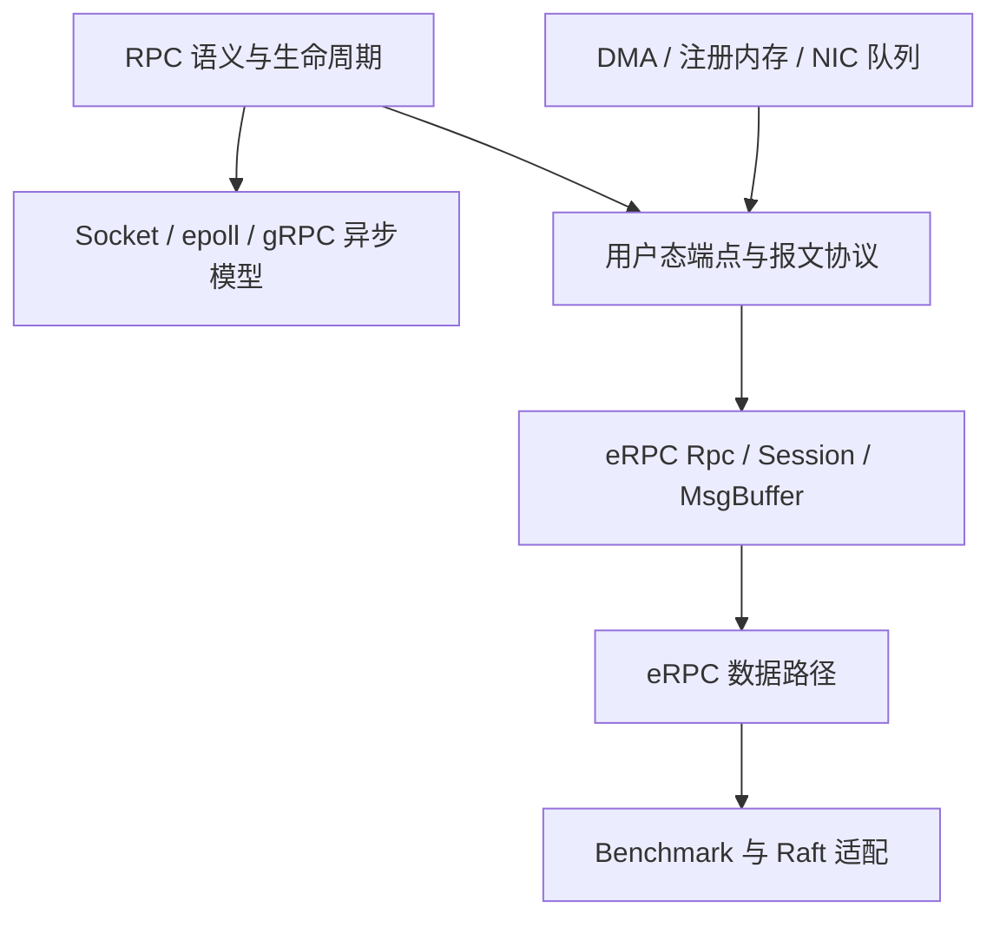
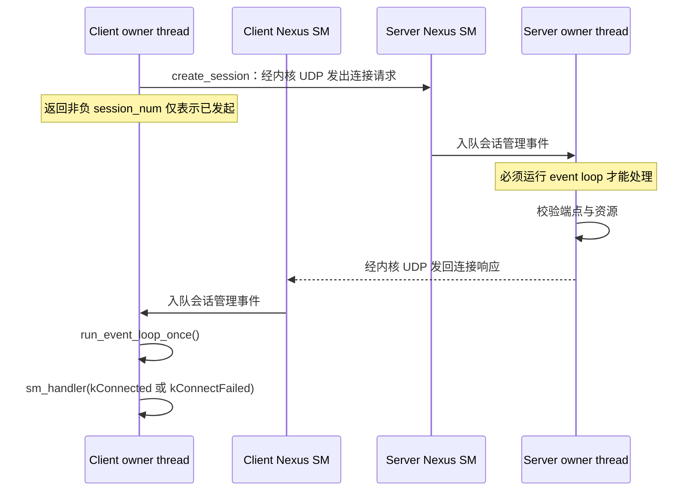
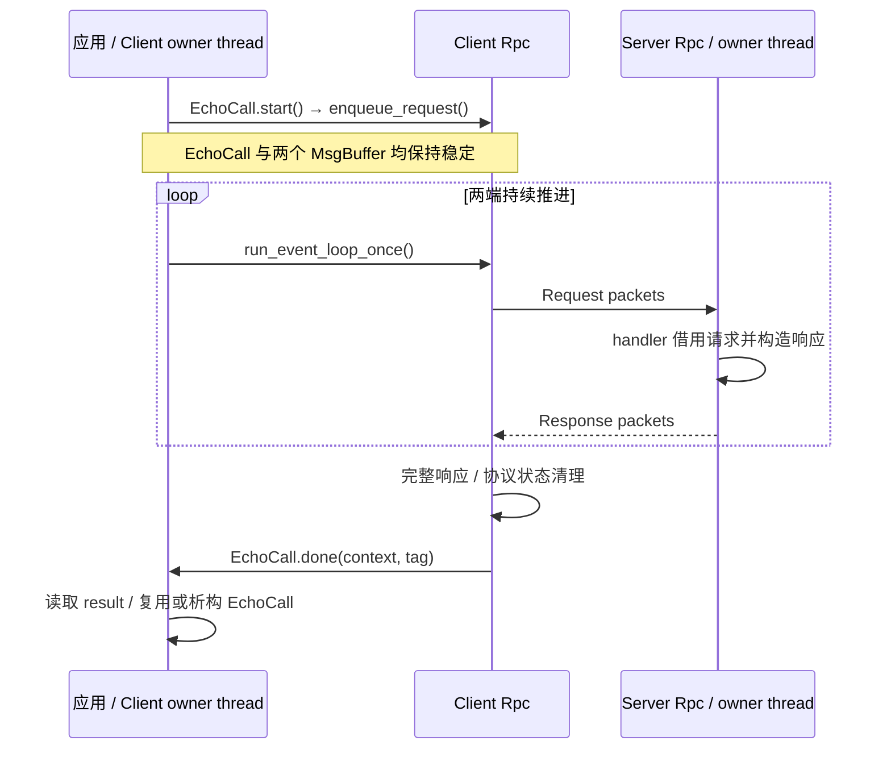

---
tags:
  - Linux
  - RPC
  - eRPC
  - 高性能网络
  - 生命周期
aliases:
  - eRPC 核心架构
  - eRPC Session 与 MsgBuffer
阅读次数: 0
---

# 18.10 eRPC 核心架构：Session、MsgBuf、Event Loop 与 Transport

[[3.Linux/18. 高级网络编程与 RPC/03. 异步与事件驱动/18.3 非阻塞 RPC：epoll + 状态机|18.3 非阻塞 RPC：epoll + 状态机]] 建立了事件驱动与状态机模型，[[3.Linux/18. 高级网络编程与 RPC/03. 异步与事件驱动/18.5 gRPC Completion Queue：异步 Add RPC|18.5 gRPC Completion Queue：异步 Add RPC]] 强调了异步操作的完成与对象生命期，[[3.Linux/18. 高级网络编程与 RPC/04. 高性能 IO 与数据面/18.7 RDMA Verbs 与 CQ 非阻塞 RPC|18.7 RDMA Verbs 与 CQ 非阻塞 RPC]] 则把完成队列和注册内存引入 RPC。本篇接着研究：**当可靠传输、请求调度与 NIC 数据路径都由用户态库协调时，一次 RPC 如何向前推进？**

> [!abstract] 范围与版本
> 这里的 eRPC 是数据中心项目 `erpc-io/eRPC`，不是同名的嵌入式 RPC 或以太坊 RPC 项目。`MsgBuf` 是标题中的简称；当前 C++ 类型名为 `erpc::MsgBuffer`。
>
> 原始设计参照 NSDI 2019 论文；API 与实现核对固定在提交 `de83dab3eab4a0fb19bfc4881c11d4a6b89ff17d`，检查日期为 2026-09-07。上游 CMake 指定 C++11；本篇教学封装使用 C++17。运行讨论以 Linux 为范围，不能把一个 Transport 的实现细节推广到所有后端。

## 1. 定位：eRPC 不是给 gRPC 换一块网卡

eRPC 提供异步请求/响应接口，但应用直接操作消息字节与 continuation；它不要求消息必须采用 Protobuf，也不是 HTTP/2 上的 gRPC。学习 [[3.Linux/18. 高级网络编程与 RPC/02. RPC框架/18.2 gRPC|18.2 gRPC]] 后可以复用 RPC 生命周期的认识，却不能照搬其 Channel、CompletionQueue 或序列化模型。[S1][S2]

eRPC 的设计主线是：**以不可靠报文 I/O 为底座，在端点软件中组织会话、可靠请求/响应、包级流控和发送调度。** InfiniBand 后端使用 UD SEND 路径，不是让客户端对服务器业务对象执行 one-sided READ/WRITE。[S2][S5]



图中箭头是**知识依赖**，不是协议栈层次，也不是“学完前一种产品才能使用后一种产品”。io_uring 与 verbs 是有价值的对照路径，不是 eRPC 的必经底层模块。

## 2. 五个核心对象分别管理什么

| 对象 | 粒度与职责 | 不能混淆的对象 |
|---|---|---|
| `Nexus` | 进程级初始化、请求类型注册、会话管理线程、可选后台工作线程 | 不是所有 RPC 数据都要经过的中央热路径线程 |
| `Rpc<CTransport>` | 一个用户线程独占的通信端点；拥有事件循环、Transport、会话集合及相关资源 | 不是“一次远程调用”的临时对象 |
| `Session` | 两个 Rpc 端点之间的逻辑关联；保存角色、双方会话编号、路由、credit、请求槽位 | 不是一条 TCP socket，也不等价于一个 RC QP |
| `MsgBuffer` | 应用消息的字节区及其内部管理信息；分配容量与当前数据长度分离 | 不是普通 `std::vector`，也不是自动释放内存的智能指针 |
| `ReqHandle` | 服务器处理一个请求时使用的借用句柄，关联请求和可用响应缓冲 | 不是可无限保存的请求数据副本 |

依据为 `nexus.h`、`rpc.h`、`session.h`、`msg_buffer.h` 和 `req_handle.h`。[S2][S3]

![[图片/SVG/eRPC-端点与资源所有权.svg|900]]

图中有两个关键边界：上方 Nexus 管的是进程公共设施；下方每个 Rpc 的数据路径由自己的 owner thread 推进。Session 在 CPU 可访问的内存中保存逻辑状态，多个 Session 可以复用同一个端点的 Transport 队列。**逻辑会话数量、请求槽位数量、硬件队列数量是三种不同规模。**

### 2.1 Rpc 的 owner thread 是线程安全边界

`rpc.h` 明确说明：公开函数不对任意用户线程提供线程安全保证。eRPC 自己的后台线程只有受限的并发访问权限，不能据此推断“把同一个 Rpc 指针传给自己的线程池就安全”。[S2]

陈硕《Linux 多线程服务端编程》第 3.3 节的 one loop per thread，可帮助理解线程归属；但这是模型上的联系，不代表 muduo 与 eRPC 的跨线程 API 契约相同。[B1]

更稳妥的组织方式是让业务状态、请求槽和 Rpc 尽量归属同一线程。需要跨线程工作时，通过有界工作队列传递拥有明确生命期的数据，再由 owner thread 发起或完成网络操作。队列中的业务对象仍需独立处理同步与背压；不应把内部 API 的“background-safe”扩展成任意外部线程安全。

### 2.2 Session 有方向性，进程可以同时扮演多种角色

一条 Session 的两端分别承担 client 与 server 角色；client 在这条会话上发请求，server 回响应。一个 Rpc 可以在不同会话上分别充当 client 或 server。反向主动调用需要相应的客户端会话，不能把“同一进程能收发 RPC”理解成“同一 Session 是任意双向流”。[S3]

Raft 节点之间既会发起也会接收 RPC，正适合检验这个区别：节点角色是分布式协议概念，会话角色是通信库概念，两者不是同一个枚举。

### 2.3 分清五类标识

| 标识 | 谁决定 | 用途 |
|---|---|---|
| 管理 URI：`hostname:udp_port` | 应用配置 | 找到远端 Nexus 的控制面 |
| `rpc_id` | 应用分配，进程内 Rpc 之间必须唯一 | 找到进程内某个通信端点 |
| `session_num` | eRPC 返回，本地有效 | 索引本端逻辑会话 |
| `req_type` | 应用注册 | 选择服务器 handler |
| continuation 的 `tag` | 应用传入，本地指针/上下文 | 找回本次调用状态，不是线上地址 |

双方的本地 `session_num` 不必相同。`req_num` 和 `pkt_num` 则是 eRPC 协议内部用于请求代际、包顺序与重传的状态，不应拿 `req_type` 代替业务去重 ID。[S2][S3][S4]

## 3. 控制面与数据面：能 ping 通还不等于能跑 RPC

Nexus 的 URI 属于**内核可达的管理网络**。`create_session()` 通过控制面发起握手；Rpc 构造参数 `phy_port` 则选择支持当前 Transport 的数据面端口。物理上可以是不同 NIC，也可能共享硬件，但两条逻辑路径必须分别核验。[S2][S3]

例如，DPDK 接管某端口后，该端口原来的内核 IP 未必仍能承担管理握手。反过来，控制面能通信，也不证明数据面 MTU、flow steering、端口索引或交换路径正确。`phy_port=0` 是当前 Transport 枚举下的端口索引，不是字符串 `eth0`。



这是线程职责的简化图；不展开 socket 辅助函数及重试分支。实现保证需要关注的是：**SM 接收线程负责收包和分发，Rpc 仍须进入事件循环处理会话事件。**[S2][S3]

创建顺序应当是：构造 Nexus → 注册 handler → 在各自 owner thread 构造 Rpc → 发起会话 → 轮询到成功/失败事件 → 分配或复用消息资源 → 发送业务请求。不要在测量区间内反复建立会话。

## 4. Event Loop：它推进的是整个用户态协议

在本次固定提交中，`run_event_loop_do_one_st()` 的主要工作如下：[S6]

```text
处理已到达的 SM 事件
→ 采样接收时间戳，处理 RX completion
→ 处理等待 credit 的队列
→ 在启用 pacing 时处理 timing wheel
→ 刷出 TX batch
→ 处理 eRPC 后台线程发来的请求/响应入队工作
→ 到扫描周期时检查丢包与 SM 重试
```

这不是 `epoll_wait()` 换个名字。[[3.Linux/18. 高级网络编程与 RPC/03. 异步与事件驱动/18.3 非阻塞 RPC：epoll + 状态机|18.3 非阻塞 RPC：epoll + 状态机]] 主要围绕内核 fd readiness 调度；eRPC 还必须主动推进包级协议、信用额度、计时和重传。

`run_event_loop_once()` 在无工作时返回；持续调用会形成 busy polling。`run_event_loop(100)` 的参数表示这次轮询循环的运行时长，不是某个 RPC 的业务 deadline，也不是“保证 100 ms 后该请求失败并释放”。长 handler 还可能让一次循环超过预期时长。[S2][S6]

### 4.1 Foreground handler 与 background handler

短 handler 可以直接运行在 dispatch/owner thread，减少跨线程交接。耗时工作可以注册成 eRPC background handler，但后台调度需要额外队列与内存生命期管理。[S3][S4]

不能在 foreground handler 中执行长时间同步磁盘 I/O、等待另一个 RPC 完成，或者忙等线程池结果；这些操作不仅延迟其他请求，还延迟 credit 与网络反馈。长任务应拆阶段，完成时再发响应。

### 4.2 回调可以发起嵌套 RPC，但不能递归进入 event loop

`enqueue_request()` 和 `enqueue_response()` 可以出现在相应回调中；**回调里不能再次调用 event loop，也不能析构当前 Rpc**。短请求可能直接借用 RX ring，递归收包会破坏该借用期间的内存安全。[S1]

因此“handler 发出另一个请求后返回，后续 continuation 再回复上游”是异步依赖；“handler 发请求后循环 run_event_loop 等它完成”则违反约束。

## 5. MsgBuffer：分配所有权不等于随时可读写

`alloc_msg_buffer(capacity)` 指定最大应用数据容量；`resize_msg_buffer()` 只调整有效长度和包数，不能把容量扩展到分配上限之外。分配失败可能返回 `buf_ == nullptr`，严重失败也可能抛异常。`MsgBuffer` 析构函数本身不负责释放其后备缓冲。[S2][S3]

[[8.高性能存储/4. RDMA 与 RoCE/4.4 内存注册与零拷贝|4.4 内存注册与零拷贝]] 解释了注册内存为什么具有生命周期约束。这里还要增加一个软件层条件：即使本地 NIC 已完成一次发送，eRPC 也可能为了重传继续使用同一份消息。

| 资源 | 应用何时可访问 | 何时失去访问权/如何回收 |
|---|---|---|
| 客户端 request MsgBuffer | 提交前填写；continuation 开始后可复用 | 提交至 continuation 之间不可修改、释放或移动描述对象 |
| 客户端 response MsgBuffer | continuation 开始后读取完整响应 | 应用分配并最终释放；传输期间交给 eRPC 写入 |
| 服务器 request 数据 | handler 内按契约借用 | handler 返回与 `enqueue_response()` 二者中较早发生者即终止借用 |
| 服务器 `ReqHandle` | 可为延后响应保留句柄 | `enqueue_response()` 后不再使用；不能由应用 `delete` |
| `pre_resp_msgbuf_` | 构造本次短响应时使用 | 提交后交回 eRPC，不由应用手动释放 |
| `dyn_resp_msgbuf_` | 通过规定方式为大响应分配/填写 | 提交后交回 eRPC，由其在安全时机回收 |

[S1][S2] 中所说的“ownership”有时指临时使用权限，有时指分配/回收责任；上表把两者拆开，以免误读“response 一直由应用所有”为“传输期间可以同时读取”。

> [!danger] 保留 ReqHandle 不等于保留请求字节
> 一个 handler 准备等待下游 RPC 时，可以按契约保存 ReqHandle；但离开 handler 前，必须把稍后要用的 key、命令或其他参数复制到自有稳定存储。保存 `get_req_msgbuf()->buf_` 然后返回，是典型悬空借用。

服务器不能随意把任意应用 MsgBuffer 传给 `enqueue_response()`；该接口要求使用当前 ReqHandle 的预分配或动态响应槽位。不同请求共享一个可写响应缓冲，会与重传和并发请求发生冲突。[S2]

## 6. C++17 示例：先把客户端生命周期封装正确

下面是**可接入 eRPC 程序的客户端辅助类，不是完整联网程序**。四段 C++ 按顺序拼接为一个翻译单元；它不创建 Nexus、连接或运行线程。它管理一个固定 8 字节 echo 请求，禁止复制/移动，确保传给 eRPC 的 MsgBuffer 描述对象和 tag 地址稳定。所有方法必须在 Rpc 的 owner thread 调用，Rpc 必须比该对象活得久。

### 6.1 声明：把“在途”做成显式状态

```cpp
#include <algorithm>
#include <cstdint>
#include <cstring>
#include <exception>
#include <new>
#include <stdexcept>
#include "rpc.h"

using Rpc = erpc::Rpc<erpc::CTransport>;
class EchoCall final {
 public:
  enum class Result { NotStarted, Pending, Ok, TransportFailure, BadResponse };
  explicit EchoCall(Rpc& rpc);
  ~EchoCall() noexcept;
  EchoCall(const EchoCall&) = delete;
  EchoCall& operator=(const EchoCall&) = delete;
  EchoCall(EchoCall&&) = delete;
  EchoCall& operator=(EchoCall&&) = delete;
  void start(int connected_session, std::uint8_t request_type);
  Result result() const noexcept { return result_; }
 private:
  static void done(void* context, void* tag) noexcept;
  Rpc& rpc_;                         // 借用；端点必须晚于本对象析构。
  erpc::MsgBuffer request_, response_; // 后备缓冲由本类负责回收。
  Result result_ = Result::NotStarted;
};
```

### 6.2 构造与析构：处理第二次分配失败，拒绝在途释放

```cpp
EchoCall::EchoCall(Rpc& rpc) : rpc_(rpc) {
  request_ = rpc_.alloc_msg_buffer(8);
  if (request_.buf_ == nullptr) throw std::bad_alloc{};
  try {
    response_ = rpc_.alloc_msg_buffer(8);
    if (response_.buf_ == nullptr) throw std::bad_alloc{};
  } catch (...) {
    rpc_.free_msg_buffer(request_); // 第二块分配失败，回滚第一块。
    throw;
  }
}
EchoCall::~EchoCall() noexcept {
  // 这是契约违规的 fail-fast，不是取消请求的实现。
  if (result_ == Result::Pending) std::terminate();
  rpc_.free_msg_buffer(response_);
  rpc_.free_msg_buffer(request_);
}
```

析构函数不暗中“等待网络”，也不在仍可能被使用时释放内存。生产封装必须另行设计 shutdown/drain 或进程级隔离策略；单凭业务 deadline 不能把 `Pending` 改成可释放。

### 6.3 提交：先固定状态，再交出两个缓冲

```cpp
void EchoCall::start(int session, std::uint8_t type) {
  if (result_ == Result::Pending)
    throw std::logic_error("EchoCall is already in flight");
  if (session < 0) throw std::invalid_argument("negative session");
  // 前置条件：session 是当前 Rpc 中仍有效的会话编号。
  if (!rpc_.is_connected(session))
    throw std::logic_error("session is not connected");
  rpc_.resize_msg_buffer(&request_, 8);
  rpc_.resize_msg_buffer(&response_, 8);
  std::fill_n(request_.buf_, 8, std::uint8_t{0x5a});
  result_ = Result::Pending;
  rpc_.enqueue_request(session, type, &request_, &response_, done, this);
  // 不在这里释放/改写缓冲；外部 owner thread 继续运行 event loop。
}
```

### 6.4 Continuation：回调到来才归还缓冲使用权

```cpp
void EchoCall::done(void*, void* tag) noexcept {
  auto& self = *static_cast<EchoCall*>(tag); // 借用，不转移对象所有权。
  const auto size = self.response_.get_data_size();
  if (size == 0) { // 本固定版本记录的 continuation-with-failure 约定。
    self.result_ = Result::TransportFailure;
  } else if (size != 8 ||
             !std::equal(self.request_.buf_, self.request_.buf_ + 8,
                         self.response_.buf_)) {
    self.result_ = Result::BadResponse;
  } else {
    self.result_ = Result::Ok;
  }
  // 不递归进入 event loop，不析构当前 Rpc，不抛出异常。
}
```

**限制要读在代码前面，而不是运行失败后才补充：**`enqueue_request()` 的公开契约为满足前置条件时成功入队；内存耗尽等内部致命故障不由这个教学类恢复。服务器必须实现 8 字节 echo，并保证响应不超过客户端分配容量。上游 `hello_world` 默认消息容量为 16 字节；本类需要单独配套的 8 字节 echo 服务，不能直接假定二者协议兼容。此代码完成了 API/生命周期静态核对，尚未在真实 eRPC 头文件与依赖环境中编译运行。[S2][S7]



## 7. 三类 timeout 绝不能混为一谈

| 时间界限 | 触发的动作 | 不代表什么 |
|---|---|---|
| `run_event_loop(timeout_ms)` | 本次循环运行的时间范围 | 不是业务 RPC 取消 |
| 报文重传计时 | 检查协议进度，必要时重新发送 | 不等于判断业务未执行 |
| 应用 deadline | 应用停止等待或标记结果不再有用 | 不自动撤回远端执行，也不自动归还缓冲 |

DDIA 第 1 版第 4 章说明：超时后，客户端可能不知道远端是否已经执行。对 eRPC 而言还多了一层本地内存问题：**结果不再有用，不等于发送、重传和回调都不再引用原对象。**[B2]

> [!warning] 论文中的节点故障能力，不等于本提交已经完整兑现
> 本次源码 `rpc_pkt_loss.cc` 的服务器故障检测分支以 `if (false)` 禁用；`NOTES.md` 记录了会话 reset/机器故障检测方面的 TODO；CMake 未启用 `server_failure_test`。不能据 `rpc.h` 的概述注释推断断网后一定会自动收到失败 continuation。上面的零长度检查只处理**确实被调用**的失败回调，不保证它一定发生。[S1][S8]

shutdown 应停止接收新业务，保持对象存活并继续推进已接纳请求，再按会话接口契约处理断开和资源释放。遇到永不完成的故障路径，应先验证库的取消/重置实现；没有验证时，隔离实验进程比“强行把 busy 清掉再 free”更安全。

## 8. 读源码的最短路线

从 `nexus.h` 和 `rpc.h` 找公开契约；随后读 `rpc_ev_loop.cc` 明白谁推进系统；再沿 `rpc_req.cc → rpc_resp.cc` 追踪一次调用；最后把 `session.h` 的槽位/credit 与 `msg_buffer.h` 的布局对应起来。不要一开始就钻进某款 NIC 的 WQE 格式。

完成本篇后，应能解释：为何 Nexus 存在但数据面仍停滞、为何 server handler 返回后请求指针不再安全、为何 `tag` 要稳定、为何析构 MsgBuffer 描述对象不等于释放缓冲。接下来用 [[3.Linux/18. 高级网络编程与 RPC/18.11 eRPC 高性能数据路径：Zero-Copy、Credit、重传与拥塞处理|18.11 eRPC 高性能数据路径：Zero-Copy、Credit、重传与拥塞处理]] 解释速度与可靠性如何共存，再通过 [[3.Linux/18. 高级网络编程与 RPC/18.12 eRPC Benchmark 与 Raft 论文复现实验|18.12 eRPC Benchmark 与 Raft 论文复现实验]] 核对这些机制是否真的进入实验路径。

## 9. 参考资料

- [B1] 陈硕，《Linux 多线程服务端编程：使用 muduo C++ 网络库》，2013 年第 1 版，§3.3.1 one loop per thread、§3.3.2 线程池。用途：线程归属与异步任务组织；不作为 eRPC API 的依据。
- [B2] Martin Kleppmann，*Designing Data-Intensive Applications*，第 1 版，2017，第 4 章 “The problems with remote procedure calls (RPCs)”，印刷页 134–135。用途：超时结果不确定与重试语义。
- [S1] eRPC [`NOTES.md`](https://github.com/erpc-io/eRPC/blob/de83dab3eab4a0fb19bfc4881c11d4a6b89ff17d/NOTES.md)，所有权与 SM 约束、已知 TODO。
- [S2] eRPC [`src/rpc.h`](https://github.com/erpc-io/eRPC/blob/de83dab3eab4a0fb19bfc4881c11d4a6b89ff17d/src/rpc.h)，公开 API、线程安全与回调契约。
- [S3] eRPC [`nexus.h`](https://github.com/erpc-io/eRPC/blob/de83dab3eab4a0fb19bfc4881c11d4a6b89ff17d/src/nexus.h)、[`session.h`](https://github.com/erpc-io/eRPC/blob/de83dab3eab4a0fb19bfc4881c11d4a6b89ff17d/src/session.h)、[`msg_buffer.h`](https://github.com/erpc-io/eRPC/blob/de83dab3eab4a0fb19bfc4881c11d4a6b89ff17d/src/msg_buffer.h)、[`req_handle.h`](https://github.com/erpc-io/eRPC/blob/de83dab3eab4a0fb19bfc4881c11d4a6b89ff17d/src/req_handle.h)，对象职责与缓冲布局。
- [S4] eRPC [`rpc_req.cc`](https://github.com/erpc-io/eRPC/blob/de83dab3eab4a0fb19bfc4881c11d4a6b89ff17d/src/rpc_impl/rpc_req.cc)、[`rpc_resp.cc`](https://github.com/erpc-io/eRPC/blob/de83dab3eab4a0fb19bfc4881c11d4a6b89ff17d/src/rpc_impl/rpc_resp.cc)，请求槽位、RX 借用和完整响应处理。
- [S5] eRPC [`ib_transport_datapath.cc`](https://github.com/erpc-io/eRPC/blob/de83dab3eab4a0fb19bfc4881c11d4a6b89ff17d/src/transport_impl/infiniband/ib_transport_datapath.cc)，UD SEND 与本地 completion。
- [S6] eRPC [`rpc_ev_loop.cc`](https://github.com/erpc-io/eRPC/blob/de83dab3eab4a0fb19bfc4881c11d4a6b89ff17d/src/rpc_impl/rpc_ev_loop.cc)，事件循环。
- [S7] eRPC [`hello_world/client.cc`](https://github.com/erpc-io/eRPC/blob/de83dab3eab4a0fb19bfc4881c11d4a6b89ff17d/hello_world/client.cc)、[`hello_world/common.h`](https://github.com/erpc-io/eRPC/blob/de83dab3eab4a0fb19bfc4881c11d4a6b89ff17d/hello_world/common.h)，官方最小调用示例；本篇没有照搬其裸 `new/delete` 和简化退出逻辑。
- [S8] eRPC [`rpc_pkt_loss.cc`](https://github.com/erpc-io/eRPC/blob/de83dab3eab4a0fb19bfc4881c11d4a6b89ff17d/src/rpc_impl/rpc_pkt_loss.cc)、[`CMakeLists.txt`](https://github.com/erpc-io/eRPC/blob/de83dab3eab4a0fb19bfc4881c11d4a6b89ff17d/CMakeLists.txt)，当前故障检测与测试开关。
- [P1] Anuj Kalia、Michael Kaminsky、David G. Andersen，*Datacenter RPCs can be General and Fast*，USENIX NSDI 2019，§3–4。原始设计补充：[论文](https://www.usenix.org/system/files/nsdi19-kalia.pdf)。

所有 [S] 均固定于 `de83dab3eab4a0fb19bfc4881c11d4a6b89ff17d`；工程封装与学习路线为本文组织，不属于教材或上游代码原文。
