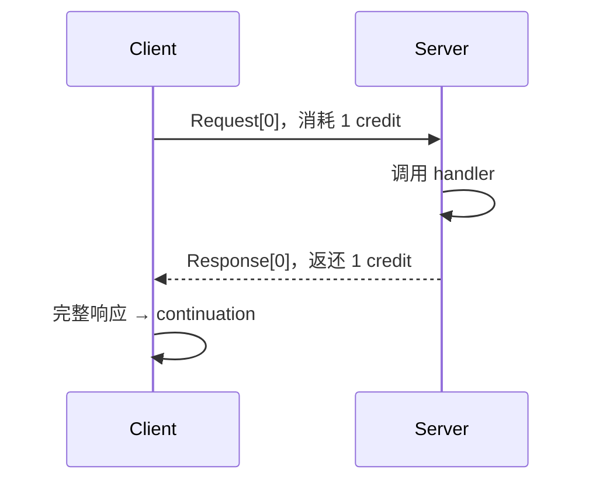
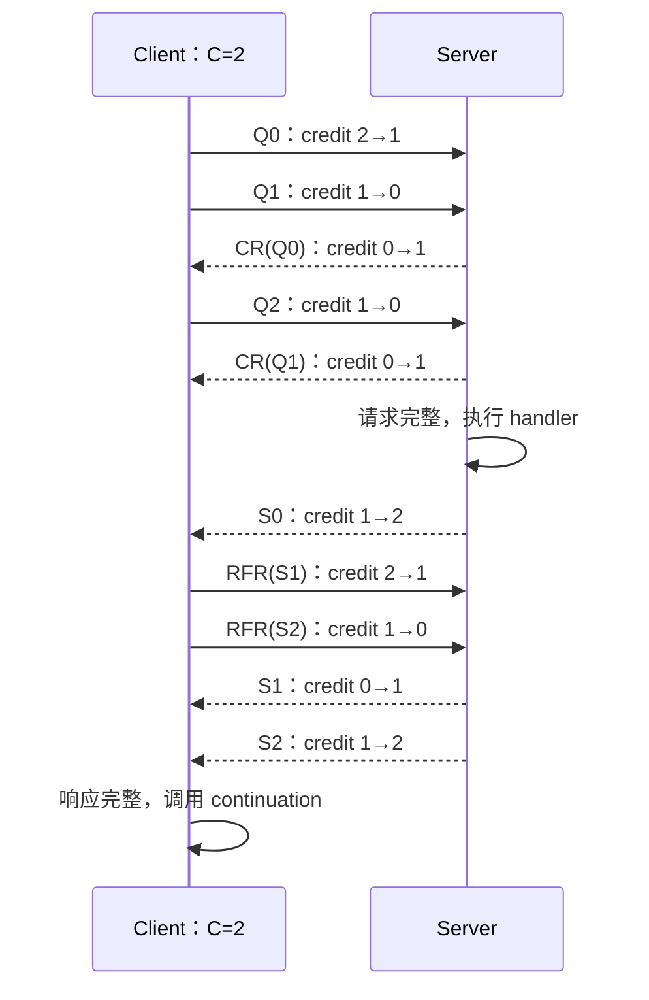
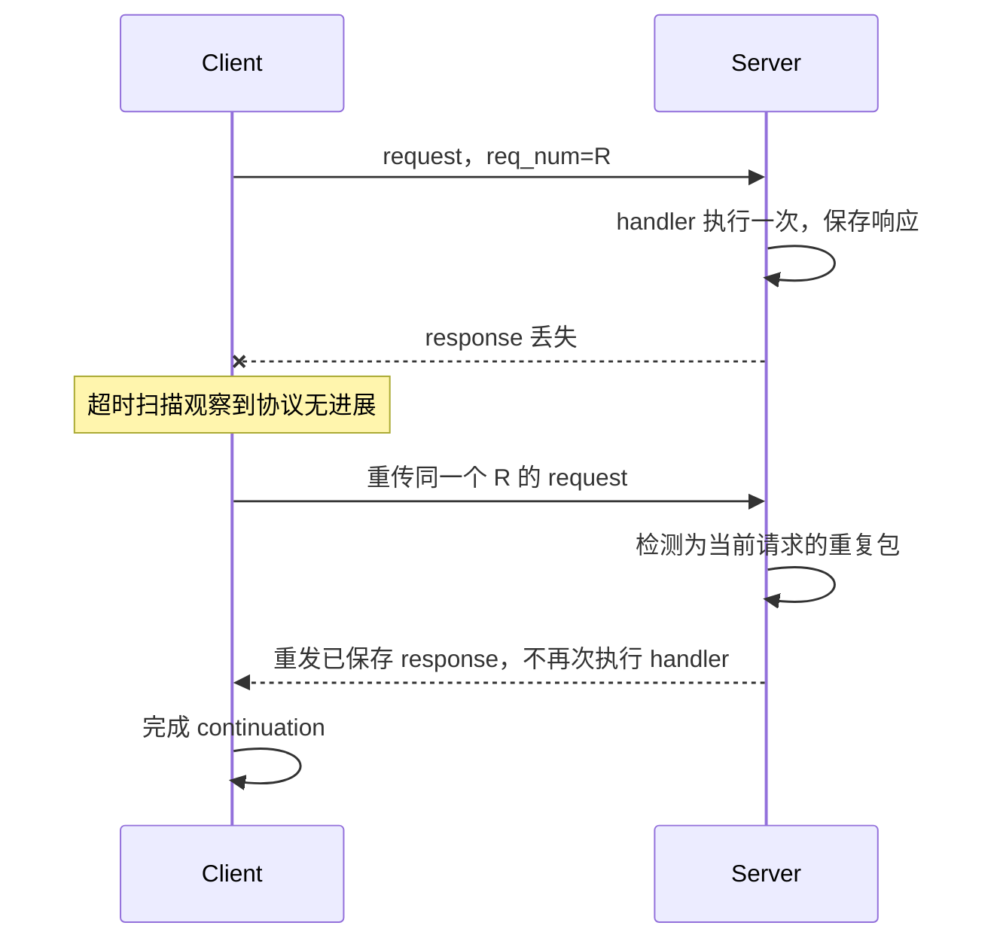

---
tags:
  - Linux
  - RPC
  - eRPC
  - ZeroCopy
  - 流量控制
  - 拥塞控制
aliases:
  - eRPC 高性能数据路径
  - eRPC Credit 与重传
阅读次数: 0
---

# 18.11 eRPC 高性能数据路径：Zero-Copy、Credit、重传与拥塞处理

[[3.Linux/18. 高级网络编程与 RPC/18.10 eRPC 核心架构：Session、MsgBuf、Event Loop 与 Transport|18.10 eRPC 核心架构：Session、MsgBuf、Event Loop 与 Transport]] 说明了对象和线程归属。本篇沿着消息内存、发送调度、线上包交换、重传及完成回调逐段解释：**哪些工作可以省，哪些状态不能省，以及“快路径”需要什么前提。**

> [!abstract] 版本边界
> 原始设计来自 NSDI 2019；实现分析固定在 `erpc-io/eRPC` 提交 `de83dab3eab4a0fb19bfc4881c11d4a6b89ff17d`，检查日期 2026-09-07。凡称“当前实现”，均指这一提交，而非所有分支或未来版本。
>
> 最重要的源码差异：**该提交的 DPDK TX 路径会把 MsgBuffer 内容复制到 rte_mbuf；不能把论文中的零拷贝发送直接当成此后端的事实。**

## 1. “Zero-copy”必须指出省掉哪一次复制

[[3.Linux/18. 高级网络编程与 RPC/04. 高性能 IO 与数据面/18.11 零拷贝序列化与内存传递|18.11 零拷贝序列化与内存传递]] 区分了零反序列化、分配优化、用户态拼接和内核发送。eRPC 的同一术语也必须拆层，尤其不能把 “kernel bypass” 与 “payload 没有 memcpy” 画等号。

| 路径 | 本次核验到的行为 | 可以怎样描述 |
|---|---|---|
| 应用生成 request | 应用可以直接填写 MsgBuffer；外部序列化器仍可能生成临时对象/缓冲 | 不自动等于零序列化 |
| IBTransport 非 inline TX | SGE 引用 MsgBuffer 中的 header/data，由 NIC 读取 | 避免先把完整 payload 拼接复制到另一 TX buffer |
| IBTransport inline TX | 小包可采用 `IBV_SEND_INLINE` | 少一次独立 payload DMA，但不是“没有任何 CPU 复制” |
| **DpdkTransport TX** | 分配 rte_mbuf，`memcpy` header/payload，再 `rte_eth_tx_burst()` | **用户态轮询发送，但该版本不是零拷贝 TX** |
| 单包 foreground request RX | 启用 `kZeroCopyRX` 时构造借用 RX ring 的 MsgBuffer 视图 | handler 执行期间可避免请求 payload copy |
| background 或多包 request RX | 分配独立请求缓冲并复制/重组 | 不能称为同样的零拷贝接收 |
| client response RX | 复制进用户提供的 response MsgBuffer，再调用 continuation | 不是端到端双向无复制 |

依据为 `dpdk_transport_datapath.cc`、`ib_transport_datapath.cc`、`rpc_req.cc`、`rpc_resp.cc` 和 `tweakme.h`。[S1][S2][S3]

![[图片/SVG/eRPC-MsgBuffer与收发拷贝边界.svg|900]]

图中上方是同一 MsgBuffer 布局；中间分开 IB 与 DPDK 两条 TX 路径；下方区分服务器短请求借用与需要复制的 RX 路径。**不要把不同后端的优点拼成一条现实中不存在的“全零拷贝路径”。**

### 1.1 为什么一个 MsgBuffer 不是一个普通字节数组

`buf_` 指向应用数据起点；第 0 个包头在其前方。后续包头位于分配的数据容量之后，并考虑对齐，而不是插进每一段应用数据中。[S4]

```text
H0 | 连续的应用数据容量 max_data_size | 对齐 | H1 | H2 | ...
     ↑ buf_
     当前有效数据长度 data_size ≤ max_data_size
```

于是非 inline 的 IB TX 可以让第 0 包的 header 与 data 使用一个 SGE；后续包分别引用自己的 header 和连续数据区中的对应切片。应用看到连续消息，传输层仍可分包。这里的 0-based header 编号不同于论文图 2 使用的 1-based 标号。

不能直接写 `buf_[-1]` 或把 MsgBuffer 重新分配成另一个地址；那些布局区域不是应用协议的可写空间。容量不变时 `resize_msg_buffer()` 调整有效数据长度，不是 `realloc()`。

### 1.2 快路径的共同逻辑：减少固定成本

单包请求省掉大消息重组；foreground handler 省掉一次跨线程交接；预分配响应减少热点分配；批量 TX 与选择性 signaled 减少提交/完成处理；低拥塞时绕过部分 rate update 与 timing wheel。它们削减的是不同阶段，不能简单把不同基准中的百分比相加。[S2][S3][S5]

[[8.高性能存储/4. RDMA 与 RoCE/4.16 Inline Batching 与 Doorbell 优化|4.16 Inline Batching 与 Doorbell 优化]] 可用于补充理解 inline、batching 和 doorbell，但具体阈值、队列深度和收益必须以 Transport、NIC 与实验版本为准。

## 2. 先区分三层限制：业务准入、请求窗口与包 credit

| 限制 | 限制的是什么 | 资源耗尽时的结果 |
|---|---|---|
| 应用 admission / outstanding 上限 | 接纳多少业务调用及其字节预算 | 应用拒绝、排队或背压 |
| `kSessionReqWindow` / session slots | 一条 Session 同时跟踪多少个已分配槽位的 RPC | `enqueue_request()` 可进入 session backlog |
| `kSessionCredits` / `credits_` | 该 Session 可以推进多少个尚未配对返回的 client 包 | 请求留在 credit-stall 路径，等待额度 |

`session.h` 与 `rpc_req.cc` 明确把 free slots、backlog 和 credits 存成不同状态。[S6] 一次大请求可以占一个 RPC slot，却消耗多个包 credit；一批短请求可以分别占槽位，并竞争同一 Session 的 credit。

**credit 不会自动把应用 backlog 限制为一个可接受的内存量。**即使网络被流控，应用仍可能持续分配请求和 response buffer。应用应同时限制请求数量与总在途字节，并单独统计尚未提交、已提交但无槽位、已占槽位但等 credit 的等待时间。

## 3. Credit 的含义：一次 client 包对应一次 server 返回

这里的 credit 是会话级、包级额度，不是 CPU 核数，也不是远端业务事务执行许可。

`kick_req_st()` 消耗 credit 发送 request 包；`kick_rfr_st()` 消耗 credit 请求后续 response 包。符合顺序的 server 返回到达后，再补回额度；不能对每个重复包无条件 `credits++`。[S3][S5]

从普通运行状态看，可用下面的**教学记账模型**理解：

```text
可用 credit + 已记账的未返回 client 包 = 会话配额 C
```

这不是源码变量的逐字断言，也不是断言物理网络中永远只有 C 个包。误判丢包后重传，旧包仍可能在路上；软件回滚额度与物理在途数量必须区分。

### 3.1 两种控制包为什么存在

**Credit Return（CR）**：服务器针对非最后一个 request 包返还额度。最后一个 request 包不再单独需要 CR，其额度由第一个 response 包归还。

**Request For Response（RFR）**：client 收到第一个 response 包后，向 server 请求剩余 response 包。server 不会仅因“已经生成完整响应”就在无 client 触发的情况下主动发出所有剩余包。[S3][S5][P1]

好处是让 client 集中控制协议推进；代价是大响应需要额外交互，不能仅凭链路带宽估算多包 RPC 的延迟。

### 3.2 单包请求 + 单包响应



没有额外 CR 或 RFR。这是 small-message optimization 的一个可见结果：正常协议开销没有额外增加一次确认往返。

### 3.3 三包请求 + 三包响应：手工走一遍 C=2

下面的 `Q0–Q2`、`S0–S2` 是便于阅读的**消息内包索引**，不是把源码线上 `pkt_num` 字段简化成相同编号。



若 request 有 `Nq` 个包、response 有 `Ns` 个包，且都至少占一个包，忽略握手、重传和 Transport 层额外开销，这条 client-driven 协议的教学计数为：

```text
request data = Nq
CR           = Nq - 1
response data = Ns
RFR          = Ns - 1
总包数        = 2 × (Nq + Ns) - 2
```

例如 `Nq=Ns=3` 得到 10 包；`Nq=Ns=1` 得到 2 包。这是根据包配对规则推导的计数，不是“eRPC 全部网络流量”的估计。

### 3.4 线上包号与 response 内索引不相同

`rpc_resp.cc` 把第一个 response 的线上 `pkt_num` 设为 `request_num_pkts - 1`，后续响应递增。三包 request 的第一个 response 因而不是线上编号 0。[S3]

调试 packet trace 时，应同时记下 `req_num`、线上 `pkt_num`、消息内 `pkt_idx` 与包类型。用一个名为 `seq` 的整数代替这些概念，会在 CR/RFR、跨请求复用和重传时出错。

## 4. BDP、credit 和拥塞控制不是同一件事

《UNIX Network Programming》第 3 版 §22.5 说明：在不可靠 datagram 上构造请求/响应，需要处理序号、超时和重发。但它的教学程序不是 eRPC 的大消息高吞吐协议，不能把书中秒级计时常数照搬到这里。[B1]

先做一个与实现常量分开的容量推导。若链路速率为 `B` bit/s，RTT 为 `T` 秒：

```text
BDP_bytes = B × T / 8
C_approx  ≈ ceil(BDP_bytes / 每包计账字节数)
```

例如**假设** `100 Gbit/s`、`6 μs` RTT，BDP 为 `75,000 B`；按每包 `1,500 B` 的一致计账口径，约需 50 个包填满管道。这只是量纲和窗口估计，不是推荐把 eRPC 常量改成 50：实际还要统一 MTU、header、有效 payload、共享链路和多 Session 的计账口径。

credit 可限制单 Session 突发和接收资源占用；它不能保证大量 client 同时向一个 receiver incast 时没有拥塞。即使每条流只贡献一个 BDP，汇聚队列也可能承受多个 BDP。反过来，有可用 credit 也不意味着“现在允许立即发送”：pacing 可能要求等到后续时间槽。[S5][S6]

## 5. Timely 与 pacing：一个决定速率，一个安排时刻

当前 `tweakme.h` 默认打开 `kEnableCc` 及相应优化开关。`session.h` 保存每个 client Session 的 Timely 实例；响应处理可以更新速率；请求发送可能直达 TX batch，也可能进入 timing wheel。[S3][S5][S6][S7]

因此可把它拆成四步：取时间戳 → 得到 RTT 样本 → 更新发送速率 → 按速率安排包的发送时刻。速率是 bytes/s 时，单包间隔量级为 `L/R`；不要遗漏 bits 与 bytes 的 8 倍换算。

`Session::cc_getupdate_tx_tsc()` 的思路可写成下面的等价量纲模型：

```text
desired_time_i = max(desired_time_(i-1) + packet_bytes / rate_Bps, now)
```

当发送落后时不把时钟继续排在过去；当多个包待发送时按速率拉开时刻。这是读懂 pacing 的模型，不是可直接替换源码 TSC 运算的伪实现。

### 5.1 低拥塞优化不等于永久关闭控制

低拥塞时可以绕开 timing wheel；满足低 RTT 条件时可以跳过不必要的 Timely 更新；收发批次可复用时间戳，减少采样成本。发生拥塞后仍需要相应反馈与调度路径。[S7]

### 5.2 当前源码还有一个不能忽略的缺口

`kick_rfr_st()` 留有 `TODO: Pace RFRs`，当前实现按 credit 发送 RFR，没有像 request 那样调用 timing wheel 调度。[S5]

因此比较 request-heavy 与 response-heavy 流量时，要分别核验实际 pacing 覆盖范围。不能仅因 `kEnableCc=true` 就声称“所有触发大响应的客户端包都已经被均匀 pacing”。这也说明**读源码可以改变实验问题本身**，而不只是给论文补函数名。

## 6. 丢包处理：Go-back-N、旧包过滤与重复响应

当前 `kRpcRTOUs` 为 `5000` 微秒；实际触发还取决于 progress timestamp、扫描周期和 event loop 是否得到运行。[S7][S8] 它不是按每个 RPC 的业务 deadline 配置的超时。

`pkt_loss_retransmit_st()` 的主要逻辑如下：[S8]

```text
计算 delta = num_tx - num_rx
→ 没有未返回包则不重传
→ 仍有该请求的包在 timing wheel 中则暂缓回滚
→ 回收 delta 对应的软件 credit
→ num_tx 回退到 num_rx
→ 从回退后的请求包或 RFR 位置继续推进
→ 刷出必要的 TX batch / DMA 引用
```

这是协议进度回滚，不是再次调用应用的 `enqueue_request()` 新建一个业务请求。server 根据槽位当前请求号和包号识别旧包、重复包和新的合法请求；重复请求有响应可用时重发响应，没有响应时不会因此再执行一次 handler。[S3][S8]

### 6.1 响应丢失：为什么不能重执行业务



这里的 at-most-once 依赖通信状态仍能区分同一个逻辑 RPC。客户端在超时后重建会话、重新发起业务请求，或服务器进程丢失内存中的状态，都不能仅凭 eRPC 的包级去重推出业务 exactly-once。跨重试的命令 ID、结果缓存与恢复策略属于上层系统。[B2]

### 6.2 乱序和真正丢包

源码只接纳符合其当前进度的包；部分未来包会被丢弃，重复的历史包则可能触发 CR 或 response 重发。这不等于所有乱序包都被保留后重组，也不是 TCP SACK 那样的选择确认协议。[S3][S8]

丢一个包可能让后续已到达的数据也需要重传，因此高丢包、高乱序下的代价需要实测。不能把“能够恢复”表述为“性能不会下降”，更不能把论文针对当年测试网络的选择说成所有现代数据中心的最优结论。

## 7. 零拷贝与重传相遇：完成回调前要消灭所有旧引用

最危险的时序不是简单“发完再收”，而是：

```text
初次 request 已到 server
→ client 误判丢包，排入一次重传
→ 原 response 到达 client
→ continuation 想复用/释放 request
→ 但旧的重传引用可能仍在软件或硬件发送队列
```

因此安全条件是：**向应用归还缓冲使用权之前，任何仍可能访问它的 TX batch、NIC DMA 或 timing wheel 引用都必须结束。**`rpc_resp.cc` 在完整响应分支检查 `wheel_count_ == 0`，并说明重传后的发送排空与迟到包处理如何维持这一约束。[S3][S8]

IBTransport 的 `tx_flush()` 用发送完成来确定此前 DMA 已结束；当前 DPDK 后端在 `tx_flush()` 中直接返回，理由正是其 TX 已复制数据到独立 mbuf。[S1][S2]

但这**不意味着 DPDK 用户可以提交后立即修改原 request**：协议重传仍可能重新从应用 MsgBuffer 读取数据，且公开 API 的借用约束未因此改变。物理复制消除了一类 DMA 悬空风险，未消除整个 RPC 的生命周期。

[[8.高性能存储/4. RDMA 与 RoCE/4.17 Retry RNR 与 Timeout|4.17 Retry RNR 与 Timeout]] 讨论的是 RDMA 相关 retry/RNR 等机制；这里需要区分 UD/软件重传与 RC 的硬件可靠性，不能把两种重试计数相加后解释为同一事件。

## 8. 性能排查：把现象映射回具体等待点

| 现象 | 优先验证 | 不能直接下的结论 |
|---|---|---|
| 小包平均延迟正常，P99 很高 | 长 handler、轮询间隔、CPU 抢占、丢包重传 | NIC 一定慢 |
| 大请求带宽低 | credit、pacing、消息分包、NUMA、应用 memcpy | 零拷贝一定没生效 |
| 大响应比大请求表现不同 | RFR 数量及 pacing 覆盖，响应端资源 | 一定是同一种拥塞路径 |
| 会话越多内存越大 | session slots、预分配响应、RX 资源、backlog | 逻辑 Session 必须等于一个硬件 QP |
| 断网后不返回失败 | 本版本故障检测是否连接到有效 reset 路径 | 调低 RTO 就等于实现 deadline |
| 切 DPDK 后 CPU 变高 | TX mbuf 分配与 memcpy、driver、批大小 | DPDK 天生比 verbs 慢 |

最后一行只是排查假设，不是一个已经完成的性能比较。代码中存在 memcpy 不足以单独证明它就是瓶颈；应使用 [[8.高性能存储/0. 数据路径硬件基础/0.8 Benchmark 基本方法|0.8 Benchmark 基本方法]] 的观测方法定位，再进入 [[3.Linux/18. 高级网络编程与 RPC/18.12 eRPC Benchmark 与 Raft 论文复现实验|18.12 eRPC Benchmark 与 Raft 论文复现实验]] 的控制变量实验。

## 9. 复习检查

能解释下面三个反例，才算真正理解数据路径：一条有空闲 RPC slot 的 Session 仍可能没有 credit；一条有 credit 的 Session 仍可能被 pacing 推迟；一次 response 到达也必须先完成旧引用清理，才能安全进入 continuation。

进一步思考：把接收拷贝删除后，哪个对象必须延长生命期？把 credit 翻倍后，接收资源和汇聚队列会承受什么变化？把 RTO 大幅缩小后，如何证明没有增加误重传与 DMA 排空成本？这些问题都应形成可检验的实验，而不是静态参数建议。

## 10. 参考资料

- [B1] W. Richard Stevens、Bill Fenner、Andrew M. Rudoff，*UNIX Network Programming, Volume 1: The Sockets Networking API*，第 3 版，2004，§22.5，印刷页 597–607。用途：可靠 datagram 请求/响应的序号、重试与计时基础。
- [B2] Martin Kleppmann，*Designing Data-Intensive Applications*，第 1 版，2017，第 4 章 RPC 的问题，印刷页 134–135。用途：超时和业务重试语义，不作为 eRPC 具体机制的来源。
- [S1] eRPC [`dpdk_transport_datapath.cc`](https://github.com/erpc-io/eRPC/blob/de83dab3eab4a0fb19bfc4881c11d4a6b89ff17d/src/transport_impl/dpdk/dpdk_transport_datapath.cc)，TX memcpy、TX flush、RX mbuf 生命周期。
- [S2] eRPC [`ib_transport_datapath.cc`](https://github.com/erpc-io/eRPC/blob/de83dab3eab4a0fb19bfc4881c11d4a6b89ff17d/src/transport_impl/infiniband/ib_transport_datapath.cc)，SGE、inline、选择性完成与 flush。
- [S3] eRPC [`rpc_req.cc`](https://github.com/erpc-io/eRPC/blob/de83dab3eab4a0fb19bfc4881c11d4a6b89ff17d/src/rpc_impl/rpc_req.cc)、[`rpc_resp.cc`](https://github.com/erpc-io/eRPC/blob/de83dab3eab4a0fb19bfc4881c11d4a6b89ff17d/src/rpc_impl/rpc_resp.cc)，收包顺序、CR/response、RX 复制与 continuation。
- [S4] eRPC [`msg_buffer.h`](https://github.com/erpc-io/eRPC/blob/de83dab3eab4a0fb19bfc4881c11d4a6b89ff17d/src/msg_buffer.h)，`get_pkthdr_0()`、`get_pkthdr_n()` 和缓冲布局。
- [S5] eRPC [`rpc_kick.cc`](https://github.com/erpc-io/eRPC/blob/de83dab3eab4a0fb19bfc4881c11d4a6b89ff17d/src/rpc_impl/rpc_kick.cc)，request/RFR credit 消耗及 RFR pacing TODO。
- [S6] eRPC [`session.h`](https://github.com/erpc-io/eRPC/blob/de83dab3eab4a0fb19bfc4881c11d4a6b89ff17d/src/session.h)，会话角色、slots、backlog、credit、Timely 与发送时间计算。
- [S7] eRPC [`tweakme.h`](https://github.com/erpc-io/eRPC/blob/de83dab3eab4a0fb19bfc4881c11d4a6b89ff17d/src/tweakme.h)，本提交 RTO、拥塞控制、RX 零拷贝开关。
- [S8] eRPC [`rpc_pkt_loss.cc`](https://github.com/erpc-io/eRPC/blob/de83dab3eab4a0fb19bfc4881c11d4a6b89ff17d/src/rpc_impl/rpc_pkt_loss.cc)，进度回滚、发送排空与未启用的故障检测分支。
- [P1] Anuj Kalia、Michael Kaminsky、David G. Andersen，*Datacenter RPCs can be General and Fast*，USENIX NSDI 2019，图 2–3、§4–5、附录 B–C：[论文](https://www.usenix.org/system/files/nsdi19-kalia.pdf)。

全部 [S] 固定于 `de83dab3eab4a0fb19bfc4881c11d4a6b89ff17d`，访问/核验日期 2026-09-07。容量公式、包数计算和排查假设为基于上述机制的教学推导，不是论文测量结果。
